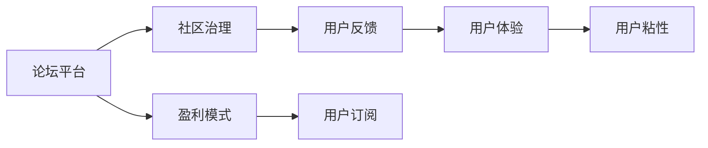

                 

# 创建开源项目的在线论坛：社区参与和盈利模式

## 1. 背景介绍

在当今开源软件生态兴起的时代，开源社区如雨后春笋般涌现，逐渐成为科技公司、开发者及用户的聚集地。开源项目的在线论坛作为项目沟通和协作的中心，其重要性不言而喻。本文将深入探讨如何创建并管理一个高效的在线论坛，以及如何设计合理的盈利模式，以确保论坛的长期健康发展。

### 1.1 社区的价值
开源社区为软件项目提供了丰富的资源，从源代码、工具库到知识经验，应有尽有。社区成员共同维护和发展项目，通过持续集成、代码审查和用户反馈不断优化产品质量。开源项目能够快速迭代，及时响应用户需求，实现技术突破和市场创新。

### 1.2 论坛的重要性
在线论坛不仅是信息交流的平台，更是项目合作、用户反馈、技术讨论的场所。论坛通常具备以下特点：

- **实时交流**：用户可以实时获取项目最新动态，快速反馈问题。
- **知识共享**：用户能够分享经验，解决问题，形成知识库。
- **社区建设**：论坛聚集了项目贡献者、用户和技术专家，为项目的持续发展奠定基础。

## 2. 核心概念与联系

### 2.1 核心概念概述

要创建并管理一个成功的开源项目在线论坛，需要理解以下几个关键概念：

- **论坛平台**：作为交流和协作的中心，论坛平台要提供稳定的系统架构和友好的用户界面。
- **社区治理**：社区成员的参与和贡献是论坛的生命力所在，需建立有效的治理机制，确保贡献者能够发挥作用。
- **盈利模式**：可持续的盈利模式是论坛长久运营的保障，需设计合理的商业策略。
- **用户体验**：良好的用户体验是吸引用户并保持活跃的关键，需关注界面设计、操作便捷性等细节。

### 2.2 核心概念原理和架构的 Mermaid 流程图

以下是 Mermaid 流程图，概述了论坛平台、社区治理、盈利模式和用户体验之间的联系：



**解释：**
- A 论坛平台提供交流平台，支撑 B 社区治理。
- B 社区治理通过 C 用户反馈，保证贡献者参与度。
- D 盈利模式通过 E 用户订阅，支持论坛长期运营。
- F 用户体验提升 G 用户粘性，保持论坛活跃度。

## 3. 核心算法原理 & 具体操作步骤

### 3.1 算法原理概述

创建和管理一个开源项目的在线论坛，涉及多个模块的协同运作。其核心算法原理主要包括：

- **信息获取与分发**：高效获取和分发信息，以确保用户能够及时了解项目最新动态。
- **问题解决与反馈**：建立有效的反馈机制，确保用户问题能够快速得到解决。
- **贡献者激励**：通过合理的激励机制，激发社区成员的积极参与。
- **盈利模型设计**：根据论坛的商业模式，制定可持续的盈利策略。

### 3.2 算法步骤详解

以下详细介绍如何通过算法步骤构建一个高效的开源项目在线论坛。

**步骤一：选择论坛平台**
选择适合的论坛平台是关键。常见的论坛平台包括 Discourse、Joomla 论坛、Memex 等。具体选择需考虑以下几点：
- **用户友好性**：界面设计简洁，易于操作。
- **扩展性**：易于增加新功能，适应项目需求。
- **稳定性**：系统稳定，不易崩溃。

**步骤二：设计社区治理机制**
社区治理是论坛的生命力所在。设计社区治理需考虑以下几点：
- **权限设置**：设置管理员、版主、普通用户等权限，确保平台有序运行。
- **贡献者激励**：通过积分、徽章等方式激励社区成员积极参与，如贡献代码、解决问题等。
- **社区规范**：制定社区规范，确保讨论有序进行。

**步骤三：制定盈利模式**
盈利模式的设计需兼顾社区和商业的利益。常见的盈利模式包括：
- **订阅费**：用户通过订阅获取高级权限，如编辑、删除、置顶等。
- **广告收入**：展示商业广告，增加收入。
- **合作项目**：与其他公司合作，提供商业解决方案。

**步骤四：优化用户体验**
用户体验直接影响用户粘性和社区活跃度。需从以下几个方面入手：
- **界面设计**：界面简洁美观，操作便捷。
- **功能完善**：提供线程、主题、附件等管理功能。
- **搜索优化**：搜索功能高效，方便用户查找信息。

### 3.3 算法优缺点

创建开源项目论坛的主要算法如下：

**优点：**
- **广泛社区支持**：开源社区拥有大量活跃用户，可有效利用这些资源。
- **多平台适应性**：通过选择适合的论坛平台，可适应不同类型的社区。
- **灵活扩展**：平台设计需考虑未来的扩展需求。

**缺点：**
- **维护成本高**：论坛的长期运营需要持续的维护和升级。
- **用户素质参差不齐**：社区成员素质不一，可能影响论坛氛围。
- **盈利模式单一**：过于依赖某一种盈利模式，可能限制论坛的可持续发展。

### 3.4 算法应用领域

开源项目的在线论坛已经广泛应用于各类项目，包括但不限于以下领域：

- **开源软件项目**：如 Linux、Apache 等。
- **教育平台**：如 MOOC、Khan Academy 等。
- **科技公司内部开发**：如 Google、Facebook 等。
- **开源社区构建**：如 Rust、Python 等。

## 4. 数学模型和公式 & 详细讲解 & 举例说明

### 4.1 数学模型构建

为了更精确地衡量社区治理和盈利模式的效果，我们可以构建以下数学模型：

设社区有 $N$ 名用户，有 $M$ 名贡献者。每位用户每天在论坛活跃的时间为 $T$，用户每日发布问题的数量为 $P$，用户每日贡献的代码数量为 $C$。设社区治理评分 $G$，盈利模式收益 $R$。

社区治理评分的计算公式为：
$$G = \frac{N \times T \times (P+C)}{M}$$

盈利模式收益的计算公式为：
$$R = \text{订阅收入} + \text{广告收入} + \text{合作项目收入}$$

### 4.2 公式推导过程

推导社区治理评分的公式：
$$G = \frac{N \times T \times (P+C)}{M}$$

其中 $N$ 表示用户总数，$T$ 表示每天平均活跃时间，$P$ 表示每日平均发布问题数量，$C$ 表示每日平均贡献代码数量，$M$ 表示社区贡献者数量。

推导盈利模式收益的公式：
$$R = \text{订阅收入} + \text{广告收入} + \text{合作项目收入}$$

其中 $\text{订阅收入}$ 为订阅用户的数量乘以订阅费用，$\text{广告收入}$ 为广告展示的次数乘以每次广告费用，$\text{合作项目收入}$ 为与公司合作获得的商业收入。

### 4.3 案例分析与讲解

以下案例详细介绍了如何利用数学模型评估社区治理和盈利模式：

**案例一：Linux 社区**
设 Linux 社区有 1000 名用户，每天活跃时间为 4 小时，平均每天发布问题数量为 10，平均每天贡献代码数量为 100。社区贡献者有 100 人。

**用户活跃度**：
- 用户数量 $N = 1000$
- 活跃时间 $T = 4 \times 60 = 240$ 分钟
- 发布问题 $P = 10$
- 贡献代码 $C = 100$

**贡献者参与度**：
- 贡献者数量 $M = 100$

**社区治理评分**：
$$G = \frac{1000 \times 240 \times (10+100)}{100} = 57600$$

**盈利模式收益**：
- **订阅收入**：假设用户每月订阅费为 10 美元，用户数量 $N = 1000$，订阅用户数量为 $N/2 = 500$，则订阅收入为 $500 \times 10 \times 12 = 60000$
- **广告收入**：假设每天展示广告 100 次，每次广告费为 5 美元，则广告收入为 $100 \times 5 = 500$
- **合作项目收入**：假设每年与 2 家企业合作，每家企业支付 10000 美元，则合作项目收入为 $2 \times 10000 = 20000$

**总收益**：
$$R = 60000 + 500 + 20000 = 82500$$

**结论**：Linux 社区的社区治理评分高，盈利模式收入稳定。

## 5. 项目实践：代码实例和详细解释说明

### 5.1 开发环境搭建

为了搭建一个高效的开源项目论坛，需要先安装相应的开发环境。以下是在 Linux 上搭建论坛的详细步骤：

**步骤一：安装 Web 服务器**
选择 Apache 或 Nginx，按照官方文档安装配置。

**步骤二：安装论坛软件**
选择适合的论坛软件，如 Discourse，按照官方文档安装配置。

**步骤三：设置数据库**
论坛软件通常需要配置数据库，选择 MySQL 或 PostgreSQL，按照官方文档安装配置。

**步骤四：配置反向代理**
设置反向代理，将论坛请求转发到服务器。

**步骤五：域名绑定**
将域名绑定到服务器，确保论坛可访问。

### 5.2 源代码详细实现

以下是一个使用 Discourse 论坛的代码实现示例：

**安装 Discourse 论坛**
```bash
sudo apt-get install discourse
```

**初始化论坛**
```bash
cd /opt/discourse
sudo bin/discourse install
```

**配置论坛**
```bash
sudo bin/discourse setup
```

**启动论坛**
```bash
sudo bin/discourse start
```

**访问论坛**
访问论坛 URL，例如 http://localhost:3000。

### 5.3 代码解读与分析

以下是 Discourse 论坛的代码实现分析：

**初始化论坛**
Discourse 论坛初始化需要从官网下载初始配置文件，并执行 `bin/discourse install` 命令。此过程涉及安装依赖包、创建数据库、设置论坛权限等。

**配置论坛**
配置论坛需要填写域名、数据库信息、管理员账户等信息，并通过 `bin/discourse setup` 命令生成配置文件。

**启动论坛**
通过 `bin/discourse start` 命令启动论坛服务器，并访问论坛 URL。

### 5.4 运行结果展示

启动后，论坛页面应包含用户登录、主题列表、搜索、新主题发布等功能。用户可以发布问题、回复评论、上传附件等，论坛管理员可以查看用户信息、管理主题等。

## 6. 实际应用场景

### 6.1 智能客服系统
智能客服系统利用开源项目论坛作为沟通平台，实时收集用户反馈，快速解决问题。社区成员可以共同维护客服手册，分享经验，提高服务质量。

**用户场景**：
- 用户通过在线论坛提交问题。
- 社区成员共同解决用户问题。
- 管理员审核问题，处理重大问题。

### 6.2 教育平台
教育平台利用开源项目论坛作为学习社区，鼓励学生交流学习经验，解决学习难题。社区成员可以共享资源、讨论问题、评估作业等，形成一个互动的学习环境。

**用户场景**：
- 学生发布学习问题。
- 社区成员提供解决方案。
- 教师引导讨论，评估作业。

### 6.3 科技公司内部开发
科技公司利用开源项目论坛作为内部沟通工具，促进团队协作，分享项目进展，优化产品功能。社区成员可以共同开发代码、测试新功能，形成高效的开发环境。

**用户场景**：
- 开发者发布项目更新。
- 其他开发者讨论问题，提出改进建议。
- 管理员协调项目，处理重大问题。

### 6.4 开源社区构建
开源社区利用开源项目论坛作为交流平台，发布项目更新，收集用户反馈，优化项目功能。社区成员可以共同维护项目，分享经验，推动项目发展。

**用户场景**：
- 项目管理员发布项目更新。
- 用户讨论项目问题，提出改进建议。
- 管理员协调项目，处理重大问题。

## 7. 工具和资源推荐

### 7.1 学习资源推荐

以下是几个优秀的开源项目论坛学习资源，供参考：

1. **Discourse 官方文档**：详细介绍了 Discourse 论坛的安装、配置和使用。
2. **Joomla 论坛官方文档**：提供了 Joomla 论坛的安装、配置和使用指南。
3. **Memex 论坛用户手册**：介绍了 Memex 论坛的安装、配置和使用。

### 7.2 开发工具推荐

以下是几个优秀的开源项目论坛开发工具，供参考：

1. **Apache 或 Nginx**：高效的 Web 服务器，支持论坛安装和配置。
2. **Discourse**：流行的开源论坛软件，易于安装和使用。
3. **MySQL 或 PostgreSQL**：稳定的数据库，支持论坛数据存储。

### 7.3 相关论文推荐

以下是几篇相关的学术论文，供参考：

1. **《社区驱动的开源项目管理》**：研究社区在开源项目中的作用，提出有效的社区治理策略。
2. **《开源社区的盈利模式》**：分析开源社区的盈利途径，探讨商业合作和用户付费策略。
3. **《论坛的用户行为分析》**：通过用户行为数据，研究论坛的使用模式和用户粘性。

## 8. 总结：未来发展趋势与挑战

### 8.1 研究成果总结

本文详细探讨了如何创建并管理一个高效的开源项目在线论坛，并设计了合理的盈利模式。通过系统化的分析，我们认为以下几点是关键：

- **社区治理**：建立有效的社区治理机制，确保社区成员的积极参与。
- **用户体验**：优化用户体验，提高用户粘性和社区活跃度。
- **盈利模式**：设计合理的盈利模式，支持论坛的长期运营。

### 8.2 未来发展趋势

开源项目的在线论坛将在未来呈现以下几个发展趋势：

1. **社区自组织**：社区成员将更加自主地管理和运营论坛，形成更为活跃和高效的学习环境。
2. **多平台协同**：论坛将与其他社交平台、开发平台协同，形成更大的生态系统。
3. **智能推荐**：利用人工智能技术，推荐相关问题，提高用户解决问题的效率。
4. **用户定制化**：根据用户行为和偏好，提供个性化的论坛体验。
5. **安全防护**：加强论坛的安全防护，确保用户数据和讨论内容的安全。

### 8.3 面临的挑战

开源项目的在线论坛在发展过程中仍面临以下挑战：

1. **用户素质参差不齐**：社区成员素质不一，可能影响论坛氛围。
2. **技术门槛高**：论坛的搭建和维护需要一定的技术基础。
3. **盈利模式单一**：过于依赖某一种盈利模式，可能限制论坛的可持续发展。
4. **法律风险**：论坛内容涉及版权、隐私等问题，需遵守相关法律法规。

### 8.4 研究展望

为了应对上述挑战，未来的研究可以从以下几个方向着手：

1. **社区管理和治理**：建立更为完善的用户管理机制，提高社区的自治水平。
2. **盈利模式创新**：探索更多盈利模式，如知识付费、开源商业订阅等。
3. **技术简化**：提供简单易用的论坛搭建工具，降低技术门槛。
4. **数据安全**：加强论坛的数据安全防护，确保用户数据安全。

总之，开源项目的在线论坛需要不断创新和优化，才能更好地服务于社区和用户，成为科技创新的重要平台。

## 9. 附录：常见问题与解答

**Q1: 如何选择合适的论坛平台？**
答：选择合适的论坛平台需考虑以下几个方面：用户友好性、扩展性、稳定性。常见的论坛平台包括 Discourse、Joomla 论坛、Memex 等。

**Q2: 社区治理如何设计？**
答：社区治理需考虑权限设置、贡献者激励、社区规范等。设置管理员、版主、普通用户等权限，制定积分、徽章等激励机制，制定社区规范，确保讨论有序进行。

**Q3: 盈利模式如何设计？**
答：盈利模式需兼顾社区和商业的利益，常见的盈利模式包括订阅费、广告收入、合作项目收入等。设计合理的盈利模式，支持论坛的长期运营。

**Q4: 用户体验如何优化？**
答：优化用户体验需从界面设计、功能完善、搜索优化等方面入手，确保论坛易用、高效。界面简洁美观，操作便捷，功能完善，搜索功能高效。

---

作者：禅与计算机程序设计艺术 / Zen and the Art of Computer Programming

