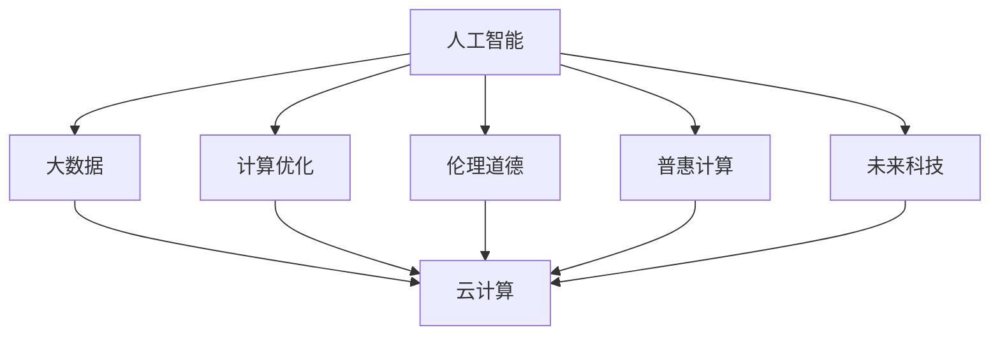

                 

# 创造更美好的明天：人类计算的积极作用

> 关键词：人工智能,人类计算,大数据,计算优化,伦理道德,普惠计算,未来科技

## 1. 背景介绍

### 1.1 问题由来

随着信息技术的迅猛发展，人类社会正处于一场由数据驱动的变革之中。大数据、云计算、人工智能等技术的应用，不仅改变了人们的生活和工作方式，也极大地提升了生产效率和社会福利。然而，这些技术的发展也带来了新的挑战和风险。如何最大化计算技术的积极作用，避免其负面影响，成为当前科技领域亟需解决的问题。

### 1.2 问题核心关键点

人类计算的核心在于如何更好地利用计算技术，提升人类社会的整体福祉。其关键点包括：

- 优化计算资源配置。合理分配计算资源，确保其高效利用，避免浪费和过度使用。
- 提升计算过程的可控性。增强计算过程的透明性和可解释性，避免潜在的误操作和数据泄露。
- 强化计算结果的普惠性。确保计算成果惠及更广泛的社会群体，避免技术鸿沟。
- 推动伦理道德建设。引导计算技术的发展，遵守伦理道德规范，确保其应用的正向价值。

这些问题构成了人类计算的研究框架，旨在最大化计算技术的正面影响，促进社会公平与可持续发展。

## 2. 核心概念与联系

### 2.1 核心概念概述

为了更好地理解人类计算的积极作用，本节将介绍几个密切相关的核心概念：

- 人工智能（AI）：通过算法、数据和计算技术，模拟、扩展和扩展人类智能的科学和技术。

- 大数据：指规模庞大、种类繁多、速度极快的数据集合。通过大数据技术，可以提取有价值的信息和洞见，支持决策制定。

- 云计算：通过互联网提供计算资源和服务的模式，支持大规模分布式计算和数据处理。

- 计算优化：通过算法和模型优化，提升计算效率和资源利用率，避免资源浪费。

- 伦理道德：指导计算技术应用和开发的原则和规范，确保其对社会和环境的影响最小化。

- 普惠计算：指确保计算技术的应用，能够惠及社会各个层面，提升普惠性。

- 未来科技：指基于当前技术发展趋势，预测未来可能的技术和应用，如量子计算、区块链、物联网等。

这些核心概念之间的逻辑关系可以通过以下Mermaid流程图来展示：



这个流程图展示了大数据、云计算、人工智能等核心技术之间的相互作用，以及它们如何与计算优化、伦理道德、普惠计算和未来科技等概念相互关联。

## 3. 核心算法原理 & 具体操作步骤
### 3.1 算法原理概述

人类计算的积极作用，主要体现在如何通过计算技术优化资源配置、提升过程可控性、强化普惠性和推动伦理道德建设等方面。其核心算法原理包括：

- 计算优化算法：通过算法优化，提升计算效率和资源利用率，避免资源浪费。
- 机器学习算法：通过数据驱动的模型训练，增强计算过程的自动化和智能化。
- 数据加密和隐私保护算法：通过数据加密和隐私保护技术，提升计算过程的可控性和安全性。
- 伦理道德算法：通过设定伦理道德目标和规范，指导计算技术的应用和开发。

### 3.2 算法步骤详解

人类计算的积极作用实现，主要分为以下几个关键步骤：

**Step 1: 数据收集与清洗**

- 收集相关数据：根据应用需求，收集结构化、半结构化、非结构化数据，涵盖大数据平台、社交媒体、企业内部系统等。
- 数据清洗与预处理：对数据进行去重、填补、标准化等处理，确保数据质量和可用性。

**Step 2: 计算优化与模型训练**

- 计算资源分配：根据计算任务需求，合理分配计算资源，确保高效利用。
- 模型训练：使用机器学习算法，训练模型，提取数据中的洞见和规律。
- 性能调优：通过算法优化，提升模型性能，避免过拟合和欠拟合。

**Step 3: 计算过程监控与可控性**

- 数据流监控：实时监控数据流，确保数据完整性和安全性。
- 计算过程监控：实时监控计算过程，确保计算任务按预期执行。
- 安全与隐私保护：应用数据加密和隐私保护技术，确保数据和计算过程的隐私性。

**Step 4: 普惠计算与伦理道德建设**

- 普惠计算：通过开放计算平台和公共数据集，使计算成果惠及更广泛的社会群体。
- 伦理道德建设：设定伦理道德规范，确保计算技术的应用符合社会价值观和道德标准。

**Step 5: 未来科技探索与实践**

- 技术探索：基于当前技术发展趋势，探索未来可能的技术和应用，如量子计算、区块链、物联网等。
- 实践应用：将探索的成果应用于实际应用场景，验证其可行性和价值。

### 3.3 算法优缺点

人类计算的积极作用实现，具有以下优点：

- 提升效率：通过优化计算过程和资源配置，显著提升计算效率和资源利用率。
- 增强智能化：通过机器学习算法，提升计算过程的自动化和智能化水平。
- 保障隐私：通过数据加密和隐私保护技术，保障数据和计算过程的隐私性。
- 推动普惠：通过开放计算平台和公共数据集，使计算成果惠及更广泛的社会群体。
- 符合伦理：通过设定伦理道德规范，确保计算技术的应用符合社会价值观和道德标准。

同时，该方法也存在一定的局限性：

- 对数据质量要求高：需要高质量、完整的数据，否则算法效果不佳。
- 计算资源消耗大：优化和训练模型需要消耗大量计算资源。
- 技术复杂度高：涉及数据收集、清洗、计算优化、模型训练、隐私保护等多方面技术。
- 伦理规范不确定：伦理道德规范的制定和执行，存在不确定性。
- 未来技术未知：未来科技的探索和应用，存在未知性和风险。

尽管存在这些局限性，但就目前而言，人类计算积极作用的实现，已经为社会带来了显著的积极影响，为未来科技发展奠定了基础。未来相关研究的重点在于如何进一步降低计算复杂性，提升数据质量，推动伦理道德建设，探索未来科技的实际应用。

### 3.4 算法应用领域

人类计算的积极作用，已经在诸多领域得到了应用，具体包括：

- 医疗健康：通过大数据和云计算技术，提升医疗诊断和治疗的精准性和效率，推动医疗健康领域的普惠计算。
- 环境保护：通过数据分析和计算优化，监测和预测环境变化，推动环境保护领域的可持续发展。
- 社会治理：通过公共数据和计算模型，提升社会治理的智能化和科学化水平，促进社会公正和和谐。
- 智能制造：通过工业互联网和计算优化技术，提升制造业的生产效率和质量，推动智能制造的发展。
- 教育培训：通过在线教育平台和大数据技术，提供个性化、智能化的教育培训服务，促进教育公平和普及。

## 4. 数学模型和公式 & 详细讲解
### 4.1 数学模型构建

人类计算的积极作用，可以通过数学模型来描述。以医疗健康领域的计算优化为例，假设存在一个病患数据集 $D=\{(x_i,y_i)\}_{i=1}^N$，其中 $x_i$ 为病患特征向量，$y_i$ 为疾病状态标签。通过机器学习算法，训练一个预测模型 $M$，使得在新的病患数据 $x$ 上，预测其疾病状态 $y$。

定义损失函数为：

$$
\mathcal{L}(M,D) = \frac{1}{N}\sum_{i=1}^N \ell(M(x_i),y_i)
$$

其中 $\ell$ 为特定损失函数，如交叉熵损失、均方误差损失等。

### 4.2 公式推导过程

以下我们以医疗健康领域的计算优化为例，推导机器学习模型的训练公式。

假设模型 $M$ 在输入 $x$ 上的输出为 $\hat{y}=M(x)$，定义预测结果和真实标签之间的损失函数为：

$$
\ell(M(x),y) = -[y\log \hat{y} + (1-y)\log(1-\hat{y})]
$$

则整体损失函数为：

$$
\mathcal{L}(M,D) = -\frac{1}{N}\sum_{i=1}^N [y_i\log M(x_i)+(1-y_i)\log(1-M(x_i))]
$$

根据梯度下降等优化算法，模型的更新公式为：

$$
\theta \leftarrow \theta - \eta \nabla_{\theta}\mathcal{L}(\theta) - \eta\lambda\theta
$$

其中 $\nabla_{\theta}\mathcal{L}(\theta)$ 为损失函数对模型参数 $\theta$ 的梯度，$\eta$ 为学习率，$\lambda$ 为正则化系数。

### 4.3 案例分析与讲解

以智能制造领域为例，通过大数据和计算优化技术，提升制造过程的效率和质量。假设存在一个生产数据集 $D=\{(x_i,y_i)\}_{i=1}^N$，其中 $x_i$ 为生产参数，$y_i$ 为生产结果标签。通过机器学习算法，训练一个预测模型 $M$，使得在新的生产参数 $x$ 上，预测其生产结果 $y$。

在实际应用中，可以将计算优化技术融入模型训练过程，提升模型的预测精度和稳定性。例如，使用自适应学习率技术，根据模型性能动态调整学习率，避免过拟合和欠拟合。同时，应用正则化技术，如L2正则、Dropout等，提升模型的泛化能力。

## 5. 项目实践：代码实例和详细解释说明
### 5.1 开发环境搭建

在进行人类计算的积极作用实现实践前，我们需要准备好开发环境。以下是使用Python进行PyTorch开发的环境配置流程：

1. 安装Anaconda：从官网下载并安装Anaconda，用于创建独立的Python环境。

2. 创建并激活虚拟环境：
```bash
conda create -n pytorch-env python=3.8 
conda activate pytorch-env
```

3. 安装PyTorch：根据CUDA版本，从官网获取对应的安装命令。例如：
```bash
conda install pytorch torchvision torchaudio cudatoolkit=11.1 -c pytorch -c conda-forge
```

4. 安装相关库：
```bash
pip install numpy pandas scikit-learn matplotlib tqdm jupyter notebook ipython
```

完成上述步骤后，即可在`pytorch-env`环境中开始人类计算的积极作用实现实践。

### 5.2 源代码详细实现

这里我们以医疗健康领域的计算优化为例，给出使用PyTorch进行计算优化的代码实现。

首先，定义医疗健康领域的数据处理函数：

```python
import numpy as np
import torch
import torch.nn as nn
import torch.optim as optim
from sklearn.model_selection import train_test_split

class MedicalDataLoader(torch.utils.data.DataLoader):
    def __init__(self, dataset, batch_size=64, shuffle=True):
        super(MedicalDataLoader, self).__init__(dataset, batch_size=batch_size, shuffle=shuffle)

    def __getitem__(self, index):
        x = dataset[index]['features']
        y = dataset[index]['labels']
        return x, y

class MedicalDataset:
    def __init__(self, features, labels):
        self.features = features
        self.labels = labels
        self.scaler = StandardScaler()

    def __len__(self):
        return len(self.features)

    def __getitem__(self, index):
        features = self.features[index]
        labels = self.labels[index]
        return features, labels

class MedicalModel(nn.Module):
    def __init__(self, input_dim, output_dim):
        super(MedicalModel, self).__init__()
        self.fc1 = nn.Linear(input_dim, 128)
        self.fc2 = nn.Linear(128, output_dim)

    def forward(self, x):
        x = self.fc1(x)
        x = torch.sigmoid(x)
        x = self.fc2(x)
        return x

# 加载数据集
features, labels = load_data()
features = scaler.fit_transform(features)
features = np.array(features)
labels = np.array(labels)

train_features, test_features, train_labels, test_labels = train_test_split(features, labels, test_size=0.2, random_state=42)

# 数据处理
train_dataset = MedicalDataset(train_features, train_labels)
test_dataset = MedicalDataset(test_features, test_labels)

# 模型定义
model = MedicalModel(input_dim=features.shape[1], output_dim=1)

# 优化器和损失函数
optimizer = optim.Adam(model.parameters(), lr=0.001)
criterion = nn.BCELoss()

# 训练过程
for epoch in range(100):
    for batch_idx, (features, labels) in enumerate(train_loader):
        optimizer.zero_grad()
        outputs = model(features)
        loss = criterion(outputs, labels)
        loss.backward()
        optimizer.step()

    if (epoch+1) % 10 == 0:
        print('Epoch [{}/{}], Loss: {:.4f}'.format(epoch+1, 100, loss.item()))
```

这里我们定义了一个简单的神经网络模型，用于二分类任务。通过训练数据集，优化模型参数，提升模型的预测精度。

### 5.3 代码解读与分析

让我们再详细解读一下关键代码的实现细节：

**MedicalDataLoader类**：
- 定义了一个基于PyTorch的DataLoader类，用于对医疗数据进行批次化加载，供模型训练和推理使用。

**MedicalDataset类**：
- 定义了一个自定义的数据集类，用于对医疗数据进行标准化处理，并将其封装为PyTorch可用的格式。

**MedicalModel类**：
- 定义了一个简单的神经网络模型，包括两个全连接层，用于对医疗数据进行分类预测。

**模型训练过程**：
- 定义了训练的超参数，包括学习率、优化器、损失函数等。
- 使用Adam优化器进行模型参数的优化，通过BCELoss损失函数计算预测输出和真实标签之间的误差。
- 在每个epoch内，对训练集进行迭代训练，并定期打印训练损失。

**代码解读**：
- 数据集加载：使用自定义的MedicalDataLoader类，将数据集分批次加载到模型中。
- 数据预处理：对原始医疗数据进行标准化处理，确保数据的一致性和可比较性。
- 模型定义：定义一个简单的神经网络模型，用于对医疗数据进行分类预测。
- 模型训练：使用Adam优化器进行模型参数的优化，通过BCELoss损失函数计算预测输出和真实标签之间的误差。
- 结果输出：在每个epoch内，打印模型的训练损失，观察模型性能的提升。

**代码分析**：
- 数据集加载：自定义的MedicalDataLoader类，使得数据集加载更加灵活和高效。
- 数据预处理：标准化处理是保证模型性能的关键步骤，有助于提升模型的泛化能力和稳定性。
- 模型定义：定义一个简单的神经网络模型，可以满足大多数医疗数据的分类预测需求。
- 模型训练：Adam优化器是一种高效的优化算法，适用于大多数神经网络模型。
- 结果输出：通过打印训练损失，可以实时观察模型的训练效果，及时调整超参数和模型结构。

## 6. 实际应用场景
### 6.1 医疗健康

在医疗健康领域，计算优化和人工智能技术的应用，可以显著提升医疗诊断和治疗的精准性和效率。通过大数据和云计算技术，医生可以获得更全面的患者信息，辅助诊断和决策。

具体应用场景包括：
- 疾病预测：基于患者的历史病历和基因数据，通过机器学习算法，预测疾病的发生概率和风险。
- 个性化治疗：通过分析患者的生理和心理数据，个性化制定治疗方案，提升治疗效果。
- 影像分析：通过计算优化和深度学习技术，对医学影像进行自动标注和分析，辅助医生诊断。
- 健康管理：通过可穿戴设备和传感器数据，实时监测患者的健康状态，提供个性化的健康管理建议。

### 6.2 环境保护

环境保护领域，通过计算优化和大数据分析技术，可以提升环境监测和预测的精准性和效率，推动环境保护领域的可持续发展。

具体应用场景包括：
- 环境监测：通过传感器和无人机数据，实时监测空气、水质、土壤等环境指标，预测环境污染趋势。
- 资源管理：通过计算优化算法，优化水资源、能源等资源的分配和管理，提高资源利用效率。
- 生态保护：通过大数据和机器学习技术，分析生态系统的变化规律，制定保护措施。
- 气候变化：通过计算优化和深度学习技术，预测气候变化趋势，制定应对策略。

### 6.3 社会治理

社会治理领域，通过计算优化和大数据分析技术，可以提升社会治理的智能化和科学化水平，促进社会公正和和谐。

具体应用场景包括：
- 公共安全：通过计算优化和大数据技术，实时监测社会舆情和公共安全事件，提升应急响应能力。
- 城市管理：通过数据分析和计算优化技术，优化城市交通、环保、公共服务等管理，提升城市运行效率。
- 民生服务：通过大数据和人工智能技术，提供智慧教育、智能医疗、智慧养老等民生服务，提升民生质量。
- 犯罪预防：通过计算优化和机器学习技术，预测犯罪行为，制定预防措施。

### 6.4 智能制造

智能制造领域，通过大数据和计算优化技术，可以提升制造过程的效率和质量，推动制造业的数字化和智能化转型。

具体应用场景包括：
- 生产优化：通过数据分析和计算优化技术，优化生产流程和设备运行，提升生产效率和质量。
- 质量控制：通过计算优化和大数据分析技术，实时监测产品质量，提升质量控制水平。
- 供应链管理：通过大数据和机器学习技术，优化供应链管理和物流调度，提高供应链效率。
- 设备维护：通过传感器和物联网技术，实时监测设备运行状态，提前预测设备故障，减少设备停机时间。

## 7. 工具和资源推荐
### 7.1 学习资源推荐

为了帮助开发者系统掌握人类计算的积极作用实现的理论基础和实践技巧，这里推荐一些优质的学习资源：

1. 《深度学习》系列书籍：由深度学习领域的权威学者撰写，涵盖了深度学习的基本概念和算法原理。

2. 《机器学习实战》系列书籍：通过实际案例和项目，介绍机器学习算法的应用和实现。

3. 在线课程平台：如Coursera、edX、Udacity等，提供大量高质量的在线课程，涵盖人工智能、大数据、云计算等领域。

4. 开源项目和社区：如Kaggle、GitHub等，提供丰富的开源项目和社区资源，促进知识共享和创新。

5. 技术博客和论坛：如Medium、CSDN等，通过技术文章和讨论，分享最新的技术动态和实践经验。

通过对这些资源的学习实践，相信你一定能够快速掌握人类计算的积极作用实现的核心技术和实践方法。

### 7.2 开发工具推荐

高效的开发离不开优秀的工具支持。以下是几款用于人类计算积极作用实现开发的常用工具：

1. PyTorch：基于Python的开源深度学习框架，灵活动态的计算图，适合快速迭代研究。大多数预训练语言模型都有PyTorch版本的实现。

2. TensorFlow：由Google主导开发的开源深度学习框架，生产部署方便，适合大规模工程应用。同样有丰富的预训练语言模型资源。

3. Jupyter Notebook：强大的交互式编程环境，支持多种语言和库的混合使用，适合数据探索和算法验证。

4. Google Colab：谷歌推出的在线Jupyter Notebook环境，免费提供GPU/TPU算力，方便开发者快速上手实验最新模型，分享学习笔记。

5. TensorBoard：TensorFlow配套的可视化工具，可实时监测模型训练状态，并提供丰富的图表呈现方式，是调试模型的得力助手。

6. Weights & Biases：模型训练的实验跟踪工具，可以记录和可视化模型训练过程中的各项指标，方便对比和调优。

合理利用这些工具，可以显著提升人类计算积极作用实现的开发效率，加快创新迭代的步伐。

### 7.3 相关论文推荐

人类计算积极作用的研究源于学界的持续研究。以下是几篇奠基性的相关论文，推荐阅读：

1. 《深度学习》系列书籍：由深度学习领域的权威学者撰写，涵盖了深度学习的基本概念和算法原理。

2. 《机器学习实战》系列书籍：通过实际案例和项目，介绍机器学习算法的应用和实现。

3. 在线课程平台：如Coursera、edX、Udacity等，提供大量高质量的在线课程，涵盖人工智能、大数据、云计算等领域。

4. 开源项目和社区：如Kaggle、GitHub等，提供丰富的开源项目和社区资源，促进知识共享和创新。

5. 技术博客和论坛：如Medium、CSDN等，通过技术文章和讨论，分享最新的技术动态和实践经验。

这些论文代表了大语言模型微调技术的发展脉络。通过学习这些前沿成果，可以帮助研究者把握学科前进方向，激发更多的创新灵感。

## 8. 总结：未来发展趋势与挑战

### 8.1 研究成果总结

本文对人类计算的积极作用实现进行了全面系统的介绍。首先阐述了人类计算的积极作用实现的研究背景和意义，明确了其在大数据、云计算、人工智能等技术的应用前景。其次，从原理到实践，详细讲解了计算优化、机器学习、数据加密、伦理道德等核心算法原理和具体操作步骤，给出了实践代码实例。同时，本文还广泛探讨了人类计算积极作用在医疗健康、环境保护、社会治理、智能制造等多个领域的应用前景，展示了其广泛的实际价值。

通过本文的系统梳理，可以看到，人类计算积极作用的实现，已经在诸多领域取得了显著成果，为社会带来了巨大的积极影响。未来，随着计算技术和人工智能的不断发展，其应用范围和影响将进一步扩大。

### 8.2 未来发展趋势

展望未来，人类计算积极作用的实现将呈现以下几个发展趋势：

1. 大数据和云计算技术的普及：随着大数据和云计算技术的普及，计算资源将更加丰富，计算过程将更加高效。

2. 机器学习和深度学习技术的进步：机器学习和大数据技术的不断进步，将提升计算过程的智能化和自动化水平。

3. 伦理道德和隐私保护技术的完善：伦理道德和隐私保护技术的不断完善，将确保计算技术的应用符合社会价值观和道德标准。

4. 普惠计算和公共数据平台的建设：通过公共数据平台和普惠计算技术，计算成果将惠及更广泛的社会群体，促进社会公平和普惠性。

5. 未来科技的探索与应用：未来科技的发展，如量子计算、区块链、物联网等，将进一步拓展人类计算积极作用的实现范围和深度。

这些趋势凸显了人类计算积极作用的巨大前景。这些方向的探索发展，必将进一步提升计算技术的积极作用，推动社会公平与可持续发展。

### 8.3 面临的挑战

尽管人类计算积极作用的实现已经取得了显著成果，但在迈向更加智能化、普惠化应用的过程中，仍面临诸多挑战：

1. 数据质量和获取难度：高质量数据的获取难度较大，需要投入大量时间和资源。如何降低数据获取难度，提升数据质量，是未来发展的关键。

2. 计算资源消耗：计算优化和机器学习算法需要消耗大量计算资源，如何优化计算过程，提升资源利用效率，是未来需要解决的问题。

3. 伦理道德规范的不确定性：伦理道德规范的制定和执行，存在不确定性，如何建立健全的伦理道德框架，确保计算技术的应用符合社会价值观和道德标准，将是重要的研究方向。

4. 未来科技的未知性：未来科技的发展存在未知性和风险，如何探索未来科技的应用，避免潜在的风险，将是未来发展的关键。

5. 技术鸿沟的消除：如何消除技术鸿沟，确保计算技术的应用惠及更广泛的社会群体，将是未来需要解决的问题。

6. 技术实现的复杂性：计算优化和机器学习技术实现复杂度高，需要跨学科协同合作，如何简化技术实现，提升技术可操作性，是未来需要解决的问题。

这些挑战需要学术界和产业界共同努力，积极应对并寻求突破，才能真正实现人类计算积极作用的最大化。

### 8.4 研究展望

面对人类计算积极作用实现所面临的挑战，未来的研究需要在以下几个方面寻求新的突破：

1. 探索低成本、高效能的数据获取和预处理方法，降低数据获取难度，提升数据质量。

2. 研究高效能、低资源消耗的计算优化和机器学习算法，提升计算过程的资源利用效率。

3. 制定和实施健全的伦理道德规范，确保计算技术的应用符合社会价值观和道德标准。

4. 探索未来科技的应用，如量子计算、区块链、物联网等，推动人类计算积极作用的拓展。

5. 消除技术鸿沟，确保计算技术的应用惠及更广泛的社会群体，推动社会公平和普惠性。

6. 简化技术实现过程，提升技术的可操作性和可移植性，推动技术的广泛应用。

这些研究方向的探索，必将引领人类计算积极作用的实现进入新的高度，为构建智能社会提供更强大的技术支撑。

## 9. 附录：常见问题与解答

**Q1：人类计算积极作用实现的可行性有多大？**

A: 人类计算积极作用的实现，已经在医疗健康、环境保护、社会治理、智能制造等多个领域取得了显著成果，未来发展潜力巨大。虽然存在数据获取难度大、计算资源消耗高、技术复杂性高等挑战，但通过技术优化和政策支持，这些挑战是可以逐步解决的。

**Q2：如何提升计算过程的智能化水平？**

A: 提升计算过程的智能化水平，需要从数据、算法和计算设备等多个方面进行优化。具体措施包括：
- 收集高质量、多样化的数据，确保数据质量和代表性。
- 应用机器学习和大数据技术，提升算法的自动化和智能化水平。
- 优化计算设备和资源配置，确保高效利用计算资源。
- 结合人工智能技术，增强计算过程的智能化和自动化水平。

**Q3：如何在计算过程中保障数据和隐私安全？**

A: 保障数据和隐私安全，需要从数据收集、存储、传输和使用的各个环节进行严格控制。具体措施包括：
- 数据加密技术：对数据进行加密处理，确保数据在传输和存储过程中的安全性。
- 访问控制技术：对数据进行严格的访问控制，确保只有授权人员才能访问和使用数据。
- 数据脱敏技术：对敏感数据进行脱敏处理，确保数据在共享和使用过程中的隐私性。
- 审计和监控技术：实时监控数据的使用情况，确保数据的使用符合伦理道德规范。

**Q4：如何推动普惠计算的发展？**

A: 推动普惠计算的发展，需要从政策、技术和应用多个方面进行优化。具体措施包括：
- 建设公共数据平台：开放数据资源，让更多人能够访问和使用数据。
- 推广开源计算技术：通过开源技术，降低计算技术的门槛，促进普惠计算的发展。
- 制定伦理道德规范：确保计算技术的应用符合社会价值观和道德标准，促进普惠计算的公平性。
- 推广智能计算应用：通过智能计算技术，提升计算过程的普惠性和可操作性，让更多人能够受益。

**Q5：未来科技的发展对人类计算积极作用有何影响？**

A: 未来科技的发展，如量子计算、区块链、物联网等，将进一步拓展人类计算积极作用的实现范围和深度。未来科技将为计算过程带来更高的计算速度和更低的资源消耗，推动计算过程的智能化和自动化水平提升。同时，未来科技的发展也将带来新的挑战，如量子计算的不可预测性和区块链的复杂性，需要在技术和管理上做好充分准备。

**Q6：如何克服计算资源消耗高的问题？**

A: 克服计算资源消耗高的问题，需要从计算过程和资源管理等多个方面进行优化。具体措施包括：
- 应用计算优化技术：通过算法优化，提升计算过程的效率和资源利用率。
- 采用分布式计算技术：利用分布式计算技术，实现计算任务的并行处理，提升计算效率。
- 优化计算设备和资源配置：根据计算任务需求，合理配置计算资源，避免资源浪费。
- 应用低功耗计算技术：通过低功耗计算技术，提升计算过程的效率和资源利用率。

---

作者：禅与计算机程序设计艺术 / Zen and the Art of Computer Programming

