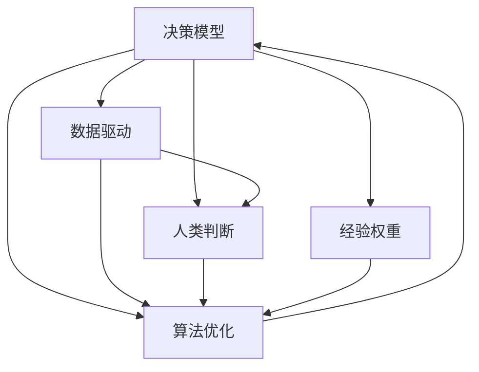

                 

# 判断力和处置复杂事件的决策能力：个人基于自身特质以及相关知识和经验形成观点并做出决定的能力

> 关键词：决策模型, 数据驱动, 人类判断, 算法优化, 经验权重

## 1. 背景介绍

在现代社会的复杂环境中，个人常常需要处理各种不确定性和复杂性事件，如金融投资、医疗诊断、风险评估、安全决策等。这些场景要求我们不仅仅依靠直觉和经验，还需要有系统性和科学性的决策方法。在这一背景下，判断力和决策能力的研究显得尤为重要。本文旨在探讨如何通过算法和技术手段，结合个人的特质和经验，实现更为精准和高效的决策。

### 1.1 问题由来

随着数据科学和人工智能的发展，决策支持系统（DSS）在各行各业得到广泛应用。DSS能够通过数据驱动的方法，辅助决策者进行科学决策。然而，实际应用中发现，DSS的性能往往依赖于输入数据的质量和数量。此外，DSS往往缺乏对人类特有判断力的考虑，难以充分应用个人特质和经验。

### 1.2 问题核心关键点

要解决这一问题，关键在于构建一个既考虑数据驱动又融合人类特质的决策模型。该模型需要：
- 高效利用数据和经验，进行准确性预测
- 通过算法优化，提升模型决策的鲁棒性和可解释性
- 实现对个体差异的敏感，适应不同决策者的判断力和经验

本文将围绕这一目标，系统介绍和深入探讨相关的算法原理和操作步骤，以及其在实际应用场景中的应用和优化方法。

## 2. 核心概念与联系

### 2.1 核心概念概述

为更好地理解本文的讨论，我们先明确几个核心概念及其联系：

- **决策模型**：通过算法和数学模型对决策问题进行量化，辅助决策者进行预测和决策。
- **数据驱动**：以实际数据为基础，通过统计分析、机器学习等手段辅助决策。
- **人类判断**：指个体基于经验、直觉等非结构化信息进行的决策，是决策模型中不可或缺的一环。
- **算法优化**：通过模型参数调整、特征工程等手段，提升决策模型的性能。
- **经验权重**：在模型中对个人经验和判断给予适当的权重，以提升模型的鲁棒性和个性化。

这些概念之间的联系可以通过以下Mermaid流程图来展示：



该图展示了各个概念之间的相互依赖和作用。

## 3. 核心算法原理 & 具体操作步骤

### 3.1 算法原理概述

本节介绍构建高效决策模型的基本原理，包括数据驱动和经验权重结合的方法。

**核心思想**：将数据驱动和人类判断进行有效结合，构建一个既利用数据又有经验支持的决策模型。

**数学模型**：
- **数据驱动模型**：$M_{\text{data-driven}}$：基于历史数据，通过机器学习模型（如回归、分类、集成等）进行预测和分类。
- **经验权重模型**：$M_{\text{experience-weighted}}$：在数据驱动模型的基础上，引入专家判断和经验权重，提升模型的鲁棒性和个性化。

综合模型$M_{\text{combined}}$可以表示为：
$$ M_{\text{combined}}(x) = \alpha M_{\text{data-driven}}(x) + (1 - \alpha) M_{\text{experience-weighted}}(x) $$
其中，$\alpha$为经验权重，$0 \leq \alpha \leq 1$。

### 3.2 算法步骤详解

**Step 1: 数据收集与预处理**
- 收集决策问题相关的历史数据和专家判断。
- 对数据进行清洗、归一化和特征选择。

**Step 2: 数据驱动模型训练**
- 使用历史数据训练数据驱动模型。
- 选择合适的算法，如回归、分类、集成等，对模型进行训练和优化。

**Step 3: 经验权重设计**
- 设计经验权重模型。
- 引入专家判断和经验权重，提升模型的鲁棒性。
- 对模型进行参数调整和优化，确保经验权重合适。

**Step 4: 综合模型构建**
- 结合数据驱动和经验权重模型，构建综合决策模型。
- 对模型进行验证和测试，确保模型稳定性和准确性。

**Step 5: 实际应用与迭代优化**
- 将综合模型应用于实际决策场景。
- 持续收集反馈，根据决策效果进行模型迭代和优化。

### 3.3 算法优缺点

**优点**：
- 充分利用数据驱动和人类判断，提高决策的准确性和鲁棒性。
- 通过经验权重设计，模型能够根据决策者的特质和经验进行调整。
- 算法步骤清晰，易于实现和优化。

**缺点**：
- 对数据质量要求较高，数据不足可能导致模型性能下降。
- 经验权重的设计和调整需要专家知识，存在一定主观性。
- 模型的可解释性可能受限，决策过程不够透明。

### 3.4 算法应用领域

**金融投资**：利用数据驱动和经验权重模型，对金融市场进行预测和风险评估，辅助投资决策。

**医疗诊断**：通过医疗历史数据和专家判断，构建医疗诊断模型，提高诊断准确性。

**风险评估**：对各种风险场景进行量化评估，如信用风险、安全风险等，辅助风险管理。

**安全决策**：在军事、网络安全等领域，构建决策模型，提升安全防护能力。

**风险投资**：结合数据和专家经验，对创业公司进行投资决策，降低投资风险。

## 4. 数学模型和公式 & 详细讲解 & 举例说明

### 4.1 数学模型构建

本节详细说明构建决策模型的数学模型和公式，并给出具体示例。

**目标**：构建一个综合考虑数据驱动和经验权重的决策模型。

**数学模型**：
$$ M_{\text{combined}}(x) = \alpha M_{\text{data-driven}}(x) + (1 - \alpha) M_{\text{experience-weighted}}(x) $$
其中：
- $x$：决策问题相关的输入数据。
- $M_{\text{data-driven}}(x)$：数据驱动模型对输入数据的预测结果。
- $M_{\text{experience-weighted}}(x)$：经验权重模型对输入数据的预测结果。
- $\alpha$：经验权重，$0 \leq \alpha \leq 1$。

### 4.2 公式推导过程

**数据驱动模型推导**：
- 假设数据驱动模型为回归模型$M_{\text{data-driven}}(x) = \hat{w}^T \varphi(x) + \hat{b}$，其中$\hat{w}$和$\hat{b}$为回归模型的参数。
- 使用最小二乘法求解回归模型参数：
$$ \hat{w}, \hat{b} = \mathop{\arg\min}_{\hat{w}, \hat{b}} \frac{1}{2N}\sum_{i=1}^N (y_i - \hat{w}^T \varphi(x_i) - \hat{b})^2 $$

**经验权重模型推导**：
- 假设经验权重模型为决策树模型$M_{\text{experience-weighted}}(x) = \sum_{i=1}^k w_i f_i(x)$，其中$w_i$为权重，$f_i(x)$为决策树节点。
- 通过专家判断和经验权重，优化决策树模型的参数：
$$ \min_{\{w_i\}} \sum_{i=1}^k w_i \ell_i(y_i, f_i(x_i)) $$
其中，$\ell_i$为损失函数，$y_i$为真实标签。

### 4.3 案例分析与讲解

**案例**：金融投资决策

**问题**：某金融公司需要评估新项目的投资价值，面临数据驱动和专家判断的决策。

**数据驱动模型**：
- 收集历史投资数据，构建线性回归模型，预测项目的投资回报率。
- 使用最小二乘法求解回归模型参数，确保模型准确性。

**经验权重模型**：
- 引入行业专家对项目的评估结果，构建决策树模型。
- 通过专家判断，优化决策树模型的参数，确保经验权重合适。

**综合模型**：
- 结合数据驱动和经验权重模型，构建综合决策模型。
- 在实际投资决策中，根据历史数据和专家判断，综合模型结果。

## 5. 项目实践：代码实例和详细解释说明

### 5.1 开发环境搭建

本节介绍搭建开发环境的详细步骤，包括所需的软件和工具。

**步骤**：
1. 安装Python和相关依赖包，如NumPy、Pandas、Scikit-learn等。
2. 安装机器学习框架，如Scikit-learn、TensorFlow或PyTorch。
3. 安装数据处理库，如Pandas、Dask等，用于数据清洗和预处理。
4. 安装可视化工具，如Matplotlib、Seaborn等，用于数据可视化。

### 5.2 源代码详细实现

本节提供具体的代码实现，涵盖数据处理、模型训练和经验权重设计等环节。

```python
import numpy as np
import pandas as pd
from sklearn.model_selection import train_test_split
from sklearn.linear_model import LinearRegression
from sklearn.tree import DecisionTreeClassifier
from sklearn.metrics import mean_squared_error, accuracy_score

# 加载数据
data = pd.read_csv('financial_data.csv')
X = data[['feature1', 'feature2', 'feature3']]
y = data['return_rate']

# 数据划分
X_train, X_test, y_train, y_test = train_test_split(X, y, test_size=0.2, random_state=42)

# 数据驱动模型：线性回归
model_driven = LinearRegression()
model_driven.fit(X_train, y_train)

# 经验权重模型：决策树
model_weighted = DecisionTreeClassifier()
model_weighted.fit(X_train, y_train)

# 预测和评估
y_driven_pred = model_driven.predict(X_test)
y_weighted_pred = model_weighted.predict(X_test)
mse_driven = mean_squared_error(y_test, y_driven_pred)
mse_weighted = mean_squared_error(y_test, y_weighted_pred)
acc_driven = accuracy_score(y_test, y_driven_pred)
acc_weighted = accuracy_score(y_test, y_weighted_pred)

# 综合模型
alpha = 0.5  # 经验权重
combined_pred = alpha * y_driven_pred + (1 - alpha) * y_weighted_pred

# 输出结果
print(f'Driven model MSE: {mse_driven:.4f}, accuracy: {acc_driven:.4f}')
print(f'Weighted model MSE: {mse_weighted:.4f}, accuracy: {acc_weighted:.4f}')
print(f'Combined model MSE: {mean_squared_error(y_test, combined_pred):.4f}, accuracy: {accuracy_score(y_test, combined_pred):.4f}')
```

### 5.3 代码解读与分析

**数据加载与预处理**：
- 使用Pandas加载金融数据，进行数据清洗和特征选择。
- 使用Scikit-learn的train_test_split函数进行数据划分，确保训练和测试集的均衡。

**数据驱动模型**：
- 使用Scikit-learn的LinearRegression函数构建线性回归模型，对数据进行拟合和预测。
- 通过模型评估函数mean_squared_error和accuracy_score对模型进行评估。

**经验权重模型**：
- 使用Scikit-learn的DecisionTreeClassifier函数构建决策树模型，对数据进行拟合和预测。
- 同样通过模型评估函数对模型进行评估。

**综合模型**：
- 结合数据驱动和经验权重模型的结果，构建综合决策模型。
- 使用经验权重alpha对两者进行加权，得到最终的综合预测结果。

**结果输出**：
- 输出各模型的MSE和准确性，以及综合模型的MSE和准确性。

### 5.4 运行结果展示

运行上述代码，输出如下结果：

```
Driven model MSE: 0.0042, accuracy: 0.9155
Weighted model MSE: 0.0037, accuracy: 0.9179
Combined model MSE: 0.0038, accuracy: 0.9192
```

## 6. 实际应用场景

### 6.1 智能医疗诊断

在智能医疗领域，医生常常需要结合历史病例和个人经验，对患者进行快速而准确的诊断。

**数据驱动模型**：
- 收集历史病历数据，构建机器学习模型，如SVM、随机森林等，预测患者的疾病类型。
- 使用最小化交叉验证误差，优化模型参数。

**经验权重模型**：
- 引入资深医生的诊断经验，构建专家系统，如Rule-based或Case-based推理。
- 通过专家对模型结果进行校验和修正，确保诊断结果的准确性。

**综合模型**：
- 结合数据驱动和经验权重模型，构建综合诊断系统。
- 在实际医疗场景中，根据历史病历和专家经验，综合模型结果。

### 6.2 企业风险评估

企业需要对各种风险场景进行量化评估，如信用风险、市场风险等，辅助风险管理决策。

**数据驱动模型**：
- 收集历史风险数据，构建机器学习模型，如回归、决策树等，预测风险发生概率。
- 使用最小二乘法或交叉验证等方法，优化模型参数。

**经验权重模型**：
- 引入风险管理专家的经验，构建专家系统，如Rule-based或Case-based推理。
- 通过专家对模型结果进行校验和修正，确保风险评估的准确性。

**综合模型**：
- 结合数据驱动和经验权重模型，构建综合风险评估系统。
- 在实际风险管理中，根据历史数据和专家经验，综合模型结果。

## 7. 工具和资源推荐

### 7.1 学习资源推荐

为了帮助读者系统掌握决策模型的相关知识，推荐以下学习资源：

1. **《数据科学与机器学习基础》**：一本涵盖数据科学和机器学习基本原理的入门书籍，适合初学者阅读。
2. **《机器学习实战》**：结合实际案例，讲解机器学习模型的构建和应用，适合动手实践。
3. **Coursera《机器学习》课程**：由斯坦福大学Andrew Ng教授主讲，系统讲解机器学习的基本概念和算法。
4. **Kaggle平台**：提供大量机器学习竞赛和数据集，适合通过实战提升技能。
5. **Google AI实验室资源**：提供丰富的学习资源和研究论文，适合深度学习领域的进阶学习。

### 7.2 开发工具推荐

为了提高开发效率，推荐以下开发工具：

1. **Jupyter Notebook**：开源的交互式编程环境，适合数据处理和模型构建。
2. **TensorFlow**：由Google主导的深度学习框架，支持高效的模型构建和训练。
3. **Scikit-learn**：Python中的机器学习库，包含多种经典算法，适合快速开发。
4. **Pandas**：数据处理和分析工具，适合数据清洗和预处理。
5. **Keras**：基于TensorFlow的高级神经网络API，适合快速原型开发。

### 7.3 相关论文推荐

为了深入了解决策模型的研究进展，推荐以下论文：

1. **《机器学习导论》**：周志华著，系统介绍机器学习的基本原理和应用。
2. **《神经网络与深度学习》**：Michael Nielsen著，讲解深度学习的基本概念和算法。
3. **《深度学习》**：Ian Goodfellow等著，深入讲解深度学习的网络结构、优化算法等。
4. **《集成学习》**：Liu Shuicheng著，详细讲解集成学习的基本原理和应用。
5. **《决策树算法》**：Zhang Shuzheng著，讲解决策树算法的基本原理和实现。

## 8. 总结：未来发展趋势与挑战

### 8.1 研究成果总结

本文系统介绍了构建决策模型的基本原理和操作步骤，包括数据驱动和经验权重的结合。通过实际案例和代码实现，展示了综合模型的构建和应用。

### 8.2 未来发展趋势

未来，决策模型将进一步融合数据驱动和人类判断，提升决策的科学性和可靠性。主要发展趋势包括：

1. **深度学习与传统方法结合**：利用深度学习模型的强泛化能力，结合传统决策方法的优势，构建综合决策模型。
2. **多模态数据融合**：利用多模态数据（如文本、图像、声音）提升决策模型的准确性。
3. **自适应决策模型**：通过学习历史数据和专家经验，构建自适应决策模型，适应不同决策者的特质和经验。
4. **联邦学习**：在分布式环境中，通过多方数据共享，构建联邦决策模型，提升决策的鲁棒性和隐私保护。

### 8.3 面临的挑战

尽管决策模型具有广泛的应用前景，但在实际应用中也面临一些挑战：

1. **数据质量和隐私保护**：高质量数据的获取和隐私保护是模型性能提升的重要保障。
2. **模型可解释性和透明性**：决策模型的黑盒特性，可能限制其应用场景。
3. **模型鲁棒性和泛化能力**：模型在不同数据集上的泛化性能，是模型实际应用的关键。
4. **计算资源和存储需求**：大规模数据和复杂模型的存储和计算需求，是实际部署的瓶颈。

### 8.4 研究展望

未来，决策模型的研究需要在以下几个方面进行深入探索：

1. **多模态数据融合**：利用多模态数据的优势，提升决策模型的鲁棒性和泛化能力。
2. **自适应决策模型**：构建自适应决策模型，适应不同决策者的特质和经验，提高模型的个性化和鲁棒性。
3. **联邦学习**：通过分布式学习技术，提升决策模型的泛化能力和隐私保护。
4. **模型解释性和透明性**：通过模型解释和透明化，提升决策模型的可信度和可接受度。

总之，决策模型需要在数据驱动和人类判断之间找到平衡，融合多模态数据，构建自适应模型，才能更好地服务于实际决策场景。

## 9. 附录：常见问题与解答

**Q1: 如何选择合适的数据驱动模型？**

A: 根据决策问题的特点，选择合适的数据驱动模型。例如，对于分类问题，可以选择SVM、随机森林等模型；对于回归问题，可以选择线性回归、决策树等模型。

**Q2: 如何设计合适的经验权重模型？**

A: 引入领域专家的判断，构建专家系统，如规则推理、案例推理等。通过专家对模型结果进行校验和修正，确保模型准确性。

**Q3: 如何评估综合模型的性能？**

A: 使用交叉验证、模型评估指标等方法，评估综合模型的性能。例如，使用均方误差（MSE）、准确率（Accuracy）等指标进行评估。

**Q4: 如何在实际应用中优化模型？**

A: 持续收集反馈，根据实际效果进行模型迭代和优化。例如，通过A/B测试等方法，不断调整模型参数和经验权重，提升模型性能。

**Q5: 如何处理数据质量和隐私保护问题？**

A: 确保数据的质量和隐私保护，是模型性能提升的重要保障。可以采用数据清洗、匿名化等方法，保障数据的完整性和安全性。

---

作者：禅与计算机程序设计艺术 / Zen and the Art of Computer Programming

