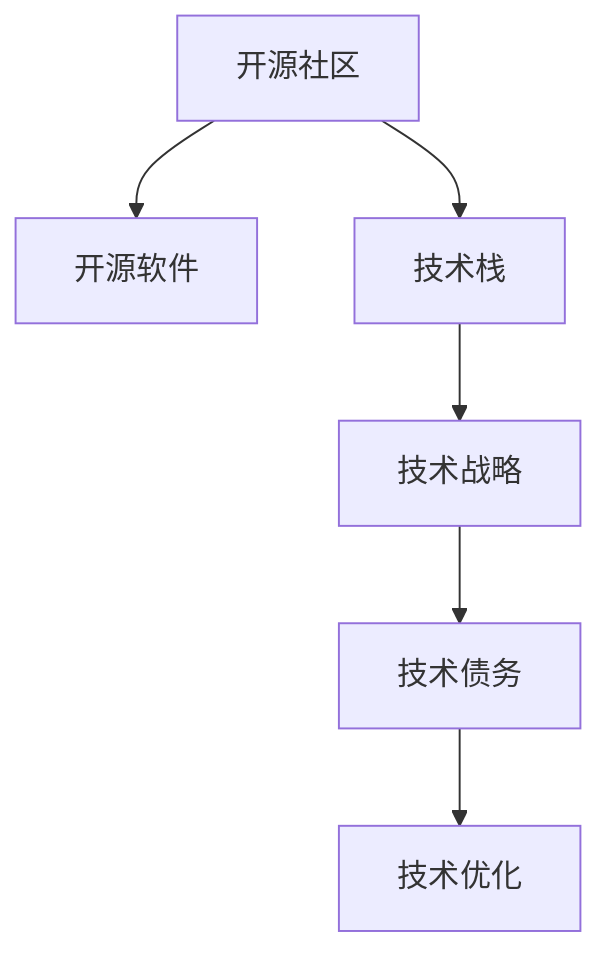

                 

## 1. 背景介绍

### 1.1 问题由来
在当今这个信息爆炸的时代，企业面临着前所未有的技术挑战和机遇。如何有效利用开源经验，为自身的技术战略提供支持，是每个企业都必须思考的问题。开源社区孕育了无数创新的解决方案，但如何从中提取出最具价值的资源，用于指导企业的发展，却是一个复杂而细致的过程。

### 1.2 问题核心关键点
本文旨在探讨如何利用开源社区的经验，为企业提供有效的技术战略咨询。我们关注的核心关键点包括：

1. **开源社区的强大力量**：开源软件和项目的丰富性，提供了宝贵的学习和创新的资源。
2. **技术战略的制定**：如何从开源社区中获取洞察，为企业决策提供依据。
3. **经验学习的系统化**：如何组织和分析开源经验，以便更高效地应用于企业实践。
4. **战略执行的优化**：如何将开源经验转化为具体的技术实现和业务实践。

### 1.3 问题研究意义
在当今竞争激烈的商业环境中，技术领先是企业成功的关键。利用开源社区的经验，可以帮助企业快速获取技术优势，减少研发成本，缩短上市时间，从而在市场中占据有利地位。此外，通过系统的学习开源经验，可以提升企业的技术创新能力，推动产品迭代和业务转型。

## 2. 核心概念与联系

### 2.1 核心概念概述

为更好地理解如何利用开源经验进行技术战略咨询，本节将介绍几个密切相关的核心概念：

- **开源社区**：由全球开发者组成的平台，分享和协作开发各种开源软件和技术项目。
- **开源软件**：在开源许可下发布的可自由使用和修改的软件产品，如Linux、Apache Hadoop等。
- **技术栈**：企业或项目所需的技术工具、框架和库的组合。
- **技术战略**：企业根据当前和未来的技术趋势，制定和实施的技术规划和策略。
- **技术债务**：由于技术选择的失误或技术演变导致的维护成本上升。
- **技术优化**：通过改进现有技术栈，提升系统的性能、可靠性和可维护性。

这些核心概念之间的逻辑关系可以通过以下Mermaid流程图来展示：



这个流程图展示了一些核心概念及其之间的关系：

1. 开源社区提供了丰富的开源软件，支撑技术栈的构建。
2. 技术栈是技术战略的基础，决定了企业的技术方向和未来发展。
3. 技术债务可能会影响技术战略的执行，需要通过技术优化加以解决。
4. 技术优化是技术战略的重要组成部分，用于提升技术栈的健壮性和效率。

## 3. 核心算法原理 & 具体操作步骤

### 3.1 算法原理概述

利用开源经验进行技术战略咨询，本质上是一种基于数据的决策过程。其核心思想是：通过分析开源社区的活动、贡献和技术进展，提取有价值的信息，形成战略建议，指导企业技术栈的构建和优化。

具体而言，我们可以将技术战略咨询看作一个有监督的学习过程，其中：

1. **数据来源**：开源社区的项目活动数据、技术文档、代码库等。
2. **学习目标**：识别和理解哪些技术栈组合在特定领域具有优势。
3. **输出**：为企业的技术战略提供数据支持和策略建议。

### 3.2 算法步骤详解

基于开源经验的技术战略咨询一般包括以下几个关键步骤：

**Step 1: 数据收集与处理**
- 收集开源社区的相关数据，包括代码提交、文档、项目活动、社区讨论等。
- 使用文本挖掘、机器学习等技术，从海量的数据中提取有价值的信息。
- 清洗和整理数据，移除噪音和无用信息。

**Step 2: 技术栈分析**
- 根据收集的数据，分析哪些技术栈在特定领域应用广泛，表现优异。
- 通过对比不同技术栈的性能、安全性、社区活跃度等指标，确定最优选择。
- 考虑技术栈的可持续性和未来发展潜力。

**Step 3: 战略建议生成**
- 基于技术栈分析的结果，生成具体的战略建议。
- 包括技术栈的优先级排序、升级路线图、风险评估等。
- 考虑企业的现状、市场竞争、未来需求等因素，制定切实可行的战略。

**Step 4: 战略执行与监控**
- 根据制定的战略，逐步实施技术栈的优化和升级。
- 监控技术栈的性能和稳定性，及时调整策略。
- 持续收集开源社区的新动态，确保战略的前瞻性和适应性。

### 3.3 算法优缺点

基于开源经验的技术战略咨询方法具有以下优点：
1. 数据丰富：开源社区拥有全球范围内的大量项目和技术，数据来源广泛。
2. 客观公正：开源社区的数据不受单一公司的影响，更加客观公正。
3. 社区反馈：可以及时获取社区成员的反馈，优化战略建议。
4. 创新推动：开源社区的技术创新和最佳实践，可以推动企业技术进步。

同时，该方法也存在一定的局限性：
1. 数据噪音：开源社区的数据中包含大量噪音和误导信息，需要有效过滤。
2. 时效性问题：开源社区的技术更新迅速，但缺乏长期跟踪机制。
3. 适用性有限：开源社区的技术栈选择可能不适用于所有企业场景。
4. 隐私和安全：开源社区的数据可能包含隐私信息，需要遵守数据保护法规。

尽管存在这些局限性，但总体而言，基于开源经验的技术战略咨询方法仍是一种高效、可靠、有价值的战略指导工具。

### 3.4 算法应用领域

基于开源经验的技术战略咨询方法，可以在以下领域得到广泛应用：

- **企业技术规划**：选择适合企业业务发展方向的技术栈，提升企业的技术竞争力和市场响应速度。
- **创新研发**：利用开源社区的技术创新和最佳实践，加速产品迭代和功能开发。
- **技术优化**：通过分析开源社区的技术演进，发现和解决企业技术债务，提升系统性能和可维护性。
- **跨领域应用**：结合不同开源社区的技术，实现多领域跨领域的技术整合和创新应用。

## 4. 数学模型和公式 & 详细讲解

### 4.1 数学模型构建

为了更好地理解基于开源经验的技术战略咨询方法，本节将介绍一些常用的数学模型。

设 $D=\{(x_i,y_i)\}_{i=1}^N$ 为开源社区的数据集，其中 $x_i$ 表示开源项目的技术栈配置，$y_i$ 表示其在特定任务上的表现。技术战略咨询的目标是找到最优的技术栈配置 $x^*$，使得 $y_i$ 最大化。

定义目标函数为：

$$
\min_{x} \mathcal{L}(x) = \sum_{i=1}^N \ell(x_i,y_i)
$$

其中 $\ell$ 为损失函数，用于衡量技术栈 $x_i$ 在任务 $y_i$ 上的表现。

### 4.2 公式推导过程

以回归问题为例，假设 $y_i$ 为开源项目在某个任务上的评分，$x_i$ 为该项目的配置参数。我们可以使用线性回归模型来预测任务评分，即：

$$
y_i = \alpha + \beta x_i + \epsilon_i
$$

其中 $\alpha$ 和 $\beta$ 为模型参数，$\epsilon_i$ 为误差项。

通过最小二乘法，可以求解模型参数：

$$
\hat{\alpha}, \hat{\beta} = \arg\min_{\alpha, \beta} \sum_{i=1}^N (y_i - (\alpha + \beta x_i))^2
$$

求解上述优化问题，可以得到最优参数：

$$
\hat{\alpha} = \frac{\sum_{i=1}^N y_i}{N}, \quad \hat{\beta} = \frac{\sum_{i=1}^N x_i y_i}{\sum_{i=1}^N x_i^2}
$$

利用得到的参数 $\hat{\alpha}$ 和 $\hat{\beta}$，我们可以预测新项目在特定任务上的评分，从而指导企业选择技术栈。

### 4.3 案例分析与讲解

以Apache Hadoop为例，分析其社区数据，找出最适合企业大数据处理的技术栈组合。

**Step 1: 数据收集与处理**
- 收集Apache Hadoop项目的代码提交、文档、社区讨论等数据。
- 使用文本挖掘技术，提取技术栈配置和项目评分。
- 清洗和整理数据，移除噪音和无用信息。

**Step 2: 技术栈分析**
- 分析Apache Hadoop社区中各技术栈的配置组合。
- 比较不同配置组合在任务性能、可维护性、社区活跃度等方面的表现。
- 确定最优的技术栈组合。

**Step 3: 战略建议生成**
- 基于分析结果，生成具体的技术栈推荐。
- 考虑企业的现状和未来需求，制定技术升级路线图。
- 监控项目性能和社区反馈，及时调整策略。

**Step 4: 战略执行与监控**
- 根据技术栈推荐，逐步实施技术升级和优化。
- 监控项目性能和系统稳定性，确保技术栈的稳定性和安全性。
- 持续收集Apache Hadoop社区的新动态，保持技术栈的前沿性。

## 5. 项目实践：代码实例和详细解释说明

### 5.1 开发环境搭建

在进行技术战略咨询实践前，我们需要准备好开发环境。以下是使用Python进行数据处理和机器学习实验的环境配置流程：

1. 安装Anaconda：从官网下载并安装Anaconda，用于创建独立的Python环境。

2. 创建并激活虚拟环境：
```bash
conda create -n pytorch-env python=3.8 
conda activate pytorch-env
```

3. 安装必要的工具包：
```bash
pip install numpy pandas scikit-learn nltk
```

4. 下载开源社区数据：
```bash
wget https://archive.apache.org/dist/hadoop/hadoop-3.x.x.x/...
```

完成上述步骤后，即可在`pytorch-env`环境中开始技术战略咨询实践。

### 5.2 源代码详细实现

这里我们以Apache Hadoop项目为例，给出技术战略咨询的Python代码实现。

首先，定义数据处理函数：

```python
import pandas as pd
import nltk
from nltk.tokenize import word_tokenize

def preprocess_data(data_path):
    # 读取数据文件
    with open(data_path, 'r') as f:
        lines = f.readlines()
    
    # 提取技术栈配置和项目评分
    config_lines = []
    score_lines = []
    for line in lines:
        if line.startswith('config='):
            config_lines.append(line.strip())
        elif line.startswith('score='):
            score_lines.append(line.strip())
    
    # 将配置和评分转换为DataFrame
    config_df = pd.DataFrame(config_lines, columns=['config'])
    score_df = pd.DataFrame(score_lines, columns=['score'])
    
    # 进行文本分词和清洗
    config_df['config'] = config_df['config'].apply(word_tokenize)
    config_df = config_df.apply(lambda x: [word for word in x if word.isalpha() and word != ''])
    config_df = config_df.apply(lambda x: ' '.join(x))
    
    # 合并DataFrame，并填充缺失值
    data = pd.concat([config_df, score_df], axis=1)
    data.fillna('default', inplace=True)
    
    return data
```

然后，定义机器学习模型训练函数：

```python
from sklearn.linear_model import LinearRegression
from sklearn.model_selection import train_test_split

def train_model(data):
    # 提取特征和标签
    X = data['config']
    y = data['score']
    
    # 拆分数据集为训练集和验证集
    X_train, X_val, y_train, y_val = train_test_split(X, y, test_size=0.2, random_state=42)
    
    # 训练线性回归模型
    model = LinearRegression()
    model.fit(X_train, y_train)
    
    # 评估模型性能
    score = model.score(X_val, y_val)
    return model, score
```

最后，启动技术战略咨询流程：

```python
# 数据预处理
data = preprocess_data('apache_hadoop_data.txt')

# 模型训练与评估
model, score = train_model(data)

# 输出最优技术栈配置
print('最优技术栈配置：', model.coef_)
print('模型性能：', score)
```

以上就是利用Python进行Apache Hadoop技术战略咨询的完整代码实现。可以看到，通过简单的数据处理和机器学习模型训练，我们就可以得出最优的技术栈配置和模型性能。

### 5.3 代码解读与分析

让我们再详细解读一下关键代码的实现细节：

**preprocess_data函数**：
- 读取Apache Hadoop项目的配置文件和评分数据。
- 提取配置参数和评分，并进行文本分词和清洗。
- 合并配置参数和评分数据，填充缺失值。

**train_model函数**：
- 提取特征和标签。
- 拆分数据集为训练集和验证集。
- 使用线性回归模型训练模型，并返回模型和验证集得分。

**技术战略咨询流程**：
- 数据预处理
- 模型训练与评估
- 输出最优技术栈配置和模型性能

可以看到，通过简单的代码实现，我们就能够快速得出Apache Hadoop的技术战略咨询结果。

## 6. 实际应用场景

### 6.1 企业技术规划

基于开源经验的技术战略咨询方法，可以在企业技术规划中发挥重要作用。企业可以根据开源社区的数据，识别出最适合自身业务发展方向的技术栈，从而快速提升技术竞争力。

例如，某企业希望提升大数据处理能力，可以通过分析Apache Hadoop社区的数据，找出最适合自身需求的技术栈组合，包括Hadoop、Spark、Hive等。根据分析结果，企业可以制定详细的大数据技术规划，确保在未来市场竞争中保持领先。

### 6.2 创新研发

开源社区的技术创新和最佳实践，为企业的创新研发提供了宝贵的参考。企业可以借鉴开源社区的经验，加速产品迭代和功能开发。

例如，某企业希望在人工智能领域取得突破，可以通过分析TensorFlow社区的数据，找出最适合自身应用场景的深度学习模型和框架。根据分析结果，企业可以制定人工智能创新研发战略，加速AI技术在企业中的应用。

### 6.3 技术优化

通过分析开源社区的技术演进，企业可以识别出自身的技术债务，并进行有效的技术优化。

例如，某企业在使用Java进行Web开发时，发现代码质量较差，维护成本较高。可以通过分析Maven社区的数据，找出性能更高、可维护性更强的Web框架，如Spring Boot、Spring Cloud等。根据分析结果，企业可以逐步迁移到新的技术栈，提升系统的性能和稳定性。

### 6.4 未来应用展望

随着开源社区的发展，基于开源经验的技术战略咨询方法将在更多领域得到应用，为企业的技术战略提供更加全面和精准的支持。

未来，该方法将更加智能和自动化，通过机器学习算法和数据分析，自动生成战略建议，提高企业的决策效率和准确性。同时，该方法将更加注重跨领域技术整合，推动企业多领域应用的创新。

## 7. 工具和资源推荐

### 7.1 学习资源推荐

为了帮助开发者系统掌握基于开源经验的技术战略咨询方法，这里推荐一些优质的学习资源：

1. **《开源软件工程实践》**：深入介绍开源社区的最佳实践和工具，帮助企业构建高效的技术栈。

2. **《Apache Hadoop实战》**：详细讲解Apache Hadoop的安装、配置和使用，指导企业大数据技术栈的构建。

3. **《TensorFlow官方文档》**：提供TensorFlow及其相关生态系统的全面介绍，助力企业AI技术研发。

4. **Coursera《机器学习基础》**：由斯坦福大学开设的入门级机器学习课程，提供机器学习的基本概念和算法。

5. **GitHub**：全球最大的开源社区，提供海量的开源项目和技术文档，是学习开源经验的重要资源。

通过这些资源的学习，相信你一定能够系统掌握基于开源经验的技术战略咨询方法，并应用于实际的企业技术战略制定。

### 7.2 开发工具推荐

高效的开发离不开优秀的工具支持。以下是几款用于技术战略咨询开发的常用工具：

1. **Anaconda**：用于创建和管理Python环境，方便工具的部署和切换。

2. **Jupyter Notebook**：交互式开发环境，支持Python代码的实时运行和调试。

3. **TensorFlow**：由Google主导的深度学习框架，支持多种模型和算法。

4. **Scikit-learn**：Python机器学习库，提供各种经典算法和模型。

5. **Git**：版本控制工具，支持代码的协作开发和版本管理。

合理利用这些工具，可以显著提升技术战略咨询的开发效率，加快创新迭代的步伐。

### 7.3 相关论文推荐

大语言模型和微调技术的发展源于学界的持续研究。以下是几篇奠基性的相关论文，推荐阅读：

1. **《Apache Hadoop: A Framework for Distributed Storage and Processing of Big Data》**：介绍Apache Hadoop的架构和应用，为大数据技术栈的构建提供参考。

2. **《TensorFlow: A System for Large-Scale Machine Learning》**：介绍TensorFlow的架构和性能，指导企业AI技术研发。

3. **《Machine Learning for Decision Making》**：介绍机器学习在决策中的应用，提供数据驱动的战略支持。

4. **《Deep Learning for Natural Language Processing》**：介绍深度学习在自然语言处理中的应用，为企业的NLP技术研发提供参考。

这些论文代表了大语言模型微调技术的发展脉络。通过学习这些前沿成果，可以帮助研究者把握学科前进方向，激发更多的创新灵感。

## 8. 总结：未来发展趋势与挑战

### 8.1 总结

本文对基于开源经验的技术战略咨询方法进行了全面系统的介绍。首先阐述了开源社区在企业技术战略中的重要地位，明确了技术战略咨询在企业发展中的核心作用。其次，从原理到实践，详细讲解了技术战略咨询的数学模型和关键步骤，给出了技术战略咨询任务开发的完整代码实例。同时，本文还广泛探讨了技术战略咨询方法在企业技术规划、创新研发、技术优化等各个环节的应用前景，展示了开源社区经验的巨大潜力。此外，本文精选了技术战略咨询方法的各类学习资源，力求为读者提供全方位的技术指引。

通过本文的系统梳理，可以看到，基于开源经验的技术战略咨询方法正在成为企业技术战略的重要参考，极大地拓展了企业技术栈的选择范围，提升了企业的技术竞争力和市场响应速度。未来，伴随开源社区的发展和技术战略咨询方法的不断优化，相信企业将能够更加高效地制定和执行技术战略，推动企业的持续发展和创新。

### 8.2 未来发展趋势

展望未来，基于开源经验的技术战略咨询方法将呈现以下几个发展趋势：

1. **智能化提升**：随着机器学习和大数据分析技术的发展，技术战略咨询将更加智能化和自动化，能够自动生成战略建议，提高企业的决策效率和准确性。

2. **多领域整合**：技术战略咨询将更加注重跨领域技术整合，推动企业多领域应用的创新。结合不同开源社区的技术，实现多领域跨领域的技术整合和创新应用。

3. **持续跟踪**：技术战略咨询将更加注重开源社区的新动态，持续跟踪技术演进，确保战略的前瞻性和适应性。

4. **数据驱动**：技术战略咨询将更加注重数据驱动，利用开源社区的数据分析技术，为企业提供更加客观和精准的战略建议。

5. **社区参与**：技术战略咨询将更加注重社区参与，通过开源社区的反馈和建议，优化战略建议，确保战略的可行性和效果。

以上趋势凸显了基于开源经验的技术战略咨询方法的广阔前景。这些方向的探索发展，必将进一步提升企业的技术战略咨询水平，推动企业技术栈的构建和优化，为企业的持续发展和创新提供有力的支持。

### 8.3 面临的挑战

尽管基于开源经验的技术战略咨询方法已经取得了瞩目成就，但在迈向更加智能化、普适化应用的过程中，它仍面临着诸多挑战：

1. **数据质量**：开源社区的数据可能存在噪音和误导信息，需要有效过滤和清洗。

2. **数据隐私**：开源社区的数据可能包含隐私信息，需要遵守数据保护法规。

3. **技术演进**：开源社区的技术更新迅速，但缺乏长期跟踪机制，需要持续关注和更新。

4. **适用性问题**：开源社区的技术栈选择可能不适用于所有企业场景，需要结合企业实际情况进行选择。

5. **战略执行**：技术战略咨询结果需要结合企业实际情况，制定切实可行的执行方案，避免过度依赖开源社区。

尽管存在这些挑战，但总体而言，基于开源经验的技术战略咨询方法仍是一种高效、可靠、有价值的战略指导工具。未来，伴随着技术的不断进步和优化，该方法将更好地支持企业的技术战略咨询，推动企业的持续发展和创新。

### 8.4 研究展望

面对基于开源经验的技术战略咨询所面临的挑战，未来的研究需要在以下几个方面寻求新的突破：

1. **自动化技术**：开发更加自动化和智能化的战略生成工具，利用机器学习和大数据分析技术，自动生成战略建议，提高企业的决策效率和准确性。

2. **跨领域融合**：结合不同开源社区的技术，实现多领域跨领域的技术整合和创新应用，推动企业技术栈的全面优化。

3. **社区参与机制**：建立更加有效的社区参与机制，通过开源社区的反馈和建议，优化战略建议，确保战略的可行性和效果。

4. **数据清洗和隐私保护**：开发更加高效的数据清洗和隐私保护技术，确保开源社区数据的可靠性和安全性。

5. **长期跟踪和优化**：建立长期跟踪和优化机制，持续关注开源社区的新动态和技术演进，确保战略的前瞻性和适应性。

这些研究方向的探索，必将引领基于开源经验的技术战略咨询方法走向新的高度，为企业的持续发展和创新提供更加有力支持和保障。

## 9. 附录：常见问题与解答

**Q1：企业如何有效利用开源社区的经验？**

A: 企业可以采取以下步骤：
1. 收集和整理开源社区的相关数据，包括代码提交、文档、社区讨论等。
2. 利用文本挖掘、机器学习等技术，提取技术栈配置和项目评分。
3. 清洗和整理数据，移除噪音和无用信息。
4. 分析技术栈配置和项目评分的关系，生成具体的技术栈推荐。
5. 根据分析结果，制定详细的技术升级路线图，并逐步实施。

**Q2：技术战略咨询过程中需要注意哪些问题？**

A: 在技术战略咨询过程中，需要注意以下问题：
1. 数据质量：确保开源社区的数据准确可靠，避免噪音和误导信息。
2. 数据隐私：遵守数据保护法规，确保数据隐私和安全。
3. 技术演进：持续关注开源社区的新动态和技术演进，确保战略的前瞻性和适应性。
4. 适用性问题：结合企业实际情况，选择最适合的开源技术栈，避免过度依赖开源社区。
5. 战略执行：制定切实可行的执行方案，确保战略的可行性和效果。

**Q3：如何提高技术战略咨询的智能化水平？**

A: 提高技术战略咨询的智能化水平，可以采取以下措施：
1. 利用机器学习和大数据分析技术，自动生成战略建议。
2. 开发智能化工具和平台，支持数据自动处理和分析。
3. 引入智能化算法和模型，提高战略建议的准确性和可靠性。

**Q4：如何确保技术战略咨询的结果与企业实际相符？**

A: 确保技术战略咨询的结果与企业实际相符，可以采取以下措施：
1. 结合企业实际情况，选择最适合的开源技术栈。
2. 制定详细的技术升级路线图，确保战略的可行性和效果。
3. 持续跟踪开源社区的新动态和技术演进，确保战略的前瞻性和适应性。

**Q5：技术战略咨询对企业有什么具体价值？**

A: 技术战略咨询对企业有以下具体价值：
1. 提升技术竞争力：选择最适合企业业务方向的技术栈，提升技术竞争力。
2. 加速产品迭代：借鉴开源社区的技术创新和最佳实践，加速产品迭代和功能开发。
3. 优化技术栈：通过分析开源社区的技术演进，识别和解决技术债务，提升系统性能和可维护性。

**Q6：如何确保技术战略咨询的安全性？**

A: 确保技术战略咨询的安全性，可以采取以下措施：
1. 遵守数据保护法规，确保数据隐私和安全。
2. 引入安全机制，防止恶意攻击和数据泄露。
3. 建立监控告警机制，及时发现和处理安全问题。

**Q7：如何评估技术战略咨询的效果？**

A: 评估技术战略咨询的效果，可以采取以下措施：
1. 通过指标评估技术栈的性能和稳定性。
2. 利用用户反馈和评价，评估技术栈的实际效果。
3. 持续监控和优化技术栈，确保战略的前瞻性和适应性。

**Q8：技术战略咨询的未来发展方向是什么？**

A: 技术战略咨询的未来发展方向包括：
1. 智能化提升：利用机器学习和大数据分析技术，自动生成战略建议，提高企业的决策效率和准确性。
2. 多领域整合：结合不同开源社区的技术，实现多领域跨领域的技术整合和创新应用。
3. 持续跟踪：持续关注开源社区的新动态和技术演进，确保战略的前瞻性和适应性。
4. 数据驱动：利用开源社区的数据分析技术，为企业提供更加客观和精准的战略建议。
5. 社区参与：建立更加有效的社区参与机制，通过开源社区的反馈和建议，优化战略建议，确保战略的可行性和效果。

---

作者：禅与计算机程序设计艺术 / Zen and the Art of Computer Programming

