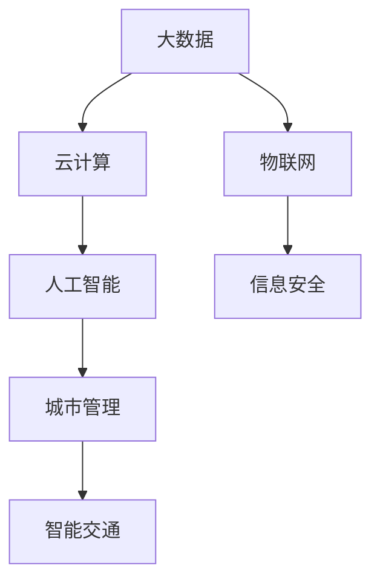

                 

# 利用技术优势进行智慧城市解决方案创新

> 关键词：智慧城市，大数据，云计算，人工智能，物联网，信息安全，城市管理，智能交通

## 1. 背景介绍

随着城市化进程的加速和人口密集度的提升，智慧城市（Smart City）的概念逐渐成为全球城市发展的新趋势。智慧城市通过整合和优化各类数据资源，利用物联网（IoT）、云计算（Cloud Computing）、大数据（Big Data）、人工智能（AI）等先进技术，提升城市管理和服务的智能化水平，改善市民生活质量。

智慧城市的发展离不开技术的创新和应用，而利用人工智能技术进行智慧城市解决方案的创新，成为近年来的研究热点。人工智能不仅能提升智慧城市系统对数据的处理和分析能力，还能通过智能决策和自适应学习，实现更高效、更人性化的城市治理和服务。

## 2. 核心概念与联系

### 2.1 核心概念概述

智慧城市解决方案的创新，主要涉及以下几个核心概念：

- **大数据（Big Data）**：智慧城市中收集的数据量庞大、类型多样，如城市交通流量、能源消耗、环境质量等，通过大数据技术进行分析和挖掘，可以发现城市运行的规律和趋势。
- **云计算（Cloud Computing）**：云计算提供了按需、弹性的计算资源和服务，支持智慧城市中各类应用的快速部署和扩展。
- **物联网（Internet of Things, IoT）**：物联网将各类物理设备通过网络连接到互联网，实现了设备之间的互联互通和数据共享，为智慧城市提供了全面的数据感知能力。
- **人工智能（Artificial Intelligence, AI）**：通过机器学习、深度学习等AI技术，智慧城市中的各类系统可以实现自我学习和优化，提升决策的精准性和效率。
- **信息安全（Information Security）**：智慧城市中的各类数据和系统都需要高度的安全保障，防止数据泄露和系统攻击，确保城市运行的安全性和稳定性。
- **城市管理（Urban Management）**：智慧城市通过整合各类数据和系统，实现对城市资源的有效管理和调度，提升城市治理的效率和质量。
- **智能交通（Smart Transportation）**：利用AI技术优化交通流量管理，提升公共交通系统的效率和服务水平。

这些概念之间的逻辑关系可以通过以下Mermaid流程图来展示：



这个流程图展示了智慧城市系统中各技术概念的相互联系和依赖关系：

1. 大数据和物联网为云计算提供了海量的数据资源和感知能力。
2. 云计算为人工智能和大数据提供了计算和存储支持。
3. 人工智能和大数据提升了城市管理的决策水平和智能交通的运行效率。
4. 信息安全保障了所有数据和系统的安全，是智慧城市运行的基础。

这些核心概念共同构成了智慧城市的技术基础，使得城市能够更加高效、智能地运行。

## 3. 核心算法原理 & 具体操作步骤
### 3.1 算法原理概述

智慧城市解决方案的创新，主要依赖于各类AI技术的应用。其核心思想是通过数据驱动的方法，构建智能化的决策和管理系统。

具体而言，智慧城市解决方案的创新过程包括：

1. **数据采集与处理**：通过物联网和传感器等技术，收集城市运行的各种数据，并利用大数据技术进行清洗和分析。
2. **模型训练与优化**：利用机器学习、深度学习等AI技术，对城市运行规律进行建模，优化模型参数，提升模型的准确性和泛化能力。
3. **决策与执行**：基于训练好的模型，进行城市管理和服务的智能决策，并利用云计算和物联网技术，将决策结果转化为具体的执行指令。
4. **监控与评估**：对执行结果进行实时监控和评估，不断调整模型和策略，提升系统的稳定性和鲁棒性。

### 3.2 算法步骤详解

以下是对智慧城市解决方案创新的详细操作步骤：

**Step 1: 数据采集与预处理**
- 部署各类物联网传感器和监控设备，收集城市运行的各种数据。
- 利用大数据技术对数据进行清洗、去重、标准化处理，确保数据的质量和可用性。

**Step 2: 模型训练与优化**
- 根据具体任务需求，选择合适的AI算法，如决策树、随机森林、深度学习等，进行模型训练。
- 利用历史数据和标注样本，对模型进行训练，并通过交叉验证、网格搜索等方法进行参数调优。
- 利用对抗训练、正则化等技术，增强模型的泛化能力和鲁棒性。

**Step 3: 决策与执行**
- 基于训练好的模型，进行城市管理的智能决策，如交通流量管理、能源优化、环境监测等。
- 利用云计算平台，部署模型应用，实现高并发、高可用、可扩展的系统架构。
- 利用物联网技术，将决策结果转化为具体的执行指令，如调整交通信号灯、调节能源供应、优化公共交通等。

**Step 4: 监控与评估**
- 利用实时监控技术，对城市运行状态进行实时监控，收集执行结果和反馈数据。
- 通过数据分析和可视化技术，评估模型和策略的效果，及时发现和解决问题。
- 利用机器学习技术，对数据进行持续学习，不断优化模型和策略，提升系统的智能水平。

### 3.3 算法优缺点

智慧城市解决方案的创新，具有以下优点：

1. **高效性**：利用AI技术，智慧城市系统可以实现快速的数据处理和决策，提升城市管理的效率。
2. **精确性**：AI模型可以通过大量数据进行训练和优化，提高决策的准确性和可靠性。
3. **灵活性**：智慧城市系统可以动态调整模型和策略，适应城市运行的变化和需求。
4. **安全性**：通过信息安全技术，智慧城市系统可以保障数据和系统的安全，防止信息泄露和系统攻击。

同时，该方法也存在一些局限性：

1. **数据依赖**：智慧城市系统高度依赖数据的质量和数量，数据的采集和处理过程复杂，成本较高。
2. **技术门槛**：智慧城市系统涉及多学科技术的整合，需要高水平的专家团队进行设计和实施。
3. **隐私风险**：智慧城市系统涉及大量个人隐私数据，需要严格的数据保护和隐私控制。
4. **系统复杂性**：智慧城市系统集成了多种技术和系统，系统设计和集成难度较大。
5. **资源消耗**：智慧城市系统运行需要大量的计算和存储资源，系统部署和维护成本较高。

尽管存在这些局限性，但就目前而言，利用AI技术进行智慧城市解决方案的创新，仍然是推动城市智能化进程的重要手段。未来相关研究的重点在于如何进一步降低数据采集和处理的成本，提高系统的智能性和灵活性，同时兼顾安全和隐私等关键因素。

### 3.4 算法应用领域

智慧城市解决方案的创新，已经在多个领域得到了广泛的应用，例如：

- **交通管理**：利用AI技术优化交通流量，减少交通拥堵，提高公共交通效率。
- **能源管理**：利用AI技术优化能源分配，提高能源利用率，降低能源消耗。
- **环境监测**：利用AI技术分析环境数据，提升环境监测的准确性和效率。
- **公共安全**：利用AI技术进行视频监控、异常检测，提升公共安全水平。
- **智慧医疗**：利用AI技术进行疾病预测、病历分析，提升医疗服务质量。
- **智慧教育**：利用AI技术进行学生分析、教学评估，提升教育水平。
- **智能建筑**：利用AI技术进行智能控制、能耗管理，提升建筑节能水平。

除了上述这些经典应用外，智慧城市解决方案的创新还将在更多领域得到应用，如智慧农业、智慧物流、智慧旅游等，为城市智能化提供新的动力。

## 4. 数学模型和公式 & 详细讲解
### 4.1 数学模型构建

本节将使用数学语言对智慧城市解决方案的创新过程进行更加严格的刻画。

记智慧城市系统为 $S$，包含数据采集与处理、模型训练与优化、决策与执行、监控与评估四个子系统，分别用 $D$、$M$、$C$、$E$ 表示。其中：

- $D=\{(x_i,y_i)\}_{i=1}^N$，为城市运行的数据集，包含输入数据 $x_i$ 和标注数据 $y_i$。
- $M=\theta(D)$，为训练好的AI模型，其中 $\theta$ 为模型参数，$D$ 为数据集。
- $C=f(M,D)$，为基于模型 $M$ 和数据集 $D$ 的智能决策函数。
- $E=\{(z_i,t_i)\}_{i=1}^N$，为执行结果的反馈数据集，包含执行结果 $z_i$ 和实际结果 $t_i$。

智慧城市系统的总体目标为最小化执行误差，即：

$$
\min_{\theta} \mathcal{L}(\theta) = \frac{1}{N}\sum_{i=1}^N \ell(z_i,t_i)
$$

其中 $\ell(z_i,t_i)$ 为执行结果的损失函数，用于衡量执行结果与实际结果的差异。

### 4.2 公式推导过程

以下我们以交通流量管理为例，推导AI模型在智慧城市系统中的优化过程。

假设城市中某路段的交通流量数据为 $D=\{(x_i,y_i)\}_{i=1}^N$，其中 $x_i$ 为时间戳，$y_i$ 为流量数据。目标是通过训练AI模型，预测未来时间段的流量数据，并进行交通信号灯的智能调整，以优化交通流量。

定义交通流量预测模型为 $M_{\theta}$，其中 $\theta$ 为模型参数。模型的预测结果为 $\hat{y}_i=M_{\theta}(x_i)$。

模型的训练目标为最小化预测结果与实际流量的误差，即：

$$
\mathcal{L}(\theta) = \frac{1}{N}\sum_{i=1}^N \|y_i-\hat{y}_i\|^2
$$

其中 $\|y_i-\hat{y}_i\|^2$ 为预测误差。

利用梯度下降算法，模型的优化过程为：

$$
\theta \leftarrow \theta - \eta \nabla_{\theta}\mathcal{L}(\theta)
$$

其中 $\eta$ 为学习率，$\nabla_{\theta}\mathcal{L}(\theta)$ 为损失函数的梯度。

在模型训练完成后，利用模型 $M_{\theta}$ 进行交通流量的智能预测，并根据预测结果进行交通信号灯的调整。具体步骤如下：

1. 根据历史交通流量数据，利用模型 $M_{\theta}$ 进行未来交通流量的预测。
2. 根据预测结果，计算各路段的交通负荷，确定需要调整的信号灯。
3. 调整信号灯的周期和相位，优化交通流量的分布，减少拥堵。

### 4.3 案例分析与讲解

以智慧医疗为例，利用AI技术进行疾病预测和病历分析。

假设某医院收集了患者的病历数据 $D=\{(x_i,y_i)\}_{i=1}^N$，其中 $x_i$ 为病历特征，$y_i$ 为疾病标签。目标是通过训练AI模型，预测患者是否患有某种疾病，并进行病历分析，优化医疗服务。

定义疾病预测模型为 $M_{\theta}$，其中 $\theta$ 为模型参数。模型的预测结果为 $\hat{y}_i=M_{\theta}(x_i)$。

模型的训练目标为最小化预测结果与实际标签的误差，即：

$$
\mathcal{L}(\theta) = \frac{1}{N}\sum_{i=1}^N \ell(y_i,\hat{y}_i)
$$

其中 $\ell(y_i,\hat{y}_i)$ 为预测误差。

利用梯度下降算法，模型的优化过程为：

$$
\theta \leftarrow \theta - \eta \nabla_{\theta}\mathcal{L}(\theta)
$$

在模型训练完成后，利用模型 $M_{\theta}$ 进行疾病预测，并根据预测结果进行病历分析。具体步骤如下：

1. 根据历史病历数据，利用模型 $M_{\theta}$ 进行疾病预测。
2. 分析预测结果，识别高风险患者，进行预防和治疗。
3. 对病历数据进行深度学习，挖掘疾病发展规律，优化医疗方案。

## 5. 项目实践：代码实例和详细解释说明
### 5.1 开发环境搭建

在进行智慧城市解决方案的开发前，我们需要准备好开发环境。以下是使用Python进行PyTorch开发的环境配置流程：

1. 安装Anaconda：从官网下载并安装Anaconda，用于创建独立的Python环境。

2. 创建并激活虚拟环境：
```bash
conda create -n pytorch-env python=3.8 
conda activate pytorch-env
```

3. 安装PyTorch：根据CUDA版本，从官网获取对应的安装命令。例如：
```bash
conda install pytorch torchvision torchaudio cudatoolkit=11.1 -c pytorch -c conda-forge
```

4. 安装TensorFlow：
```bash
pip install tensorflow==2.4
```

5. 安装各类工具包：
```bash
pip install numpy pandas scikit-learn matplotlib tqdm jupyter notebook ipython
```

完成上述步骤后，即可在`pytorch-env`环境中开始智慧城市解决方案的开发。

### 5.2 源代码详细实现

这里我们以交通流量管理为例，给出使用PyTorch进行模型训练和预测的代码实现。

首先，定义交通流量数据处理函数：

```python
import torch
import pandas as pd
from sklearn.preprocessing import StandardScaler
from torch.utils.data import Dataset

class TrafficDataset(Dataset):
    def __init__(self, data, scaler=None):
        self.data = data
        self.scaler = scaler
        
    def __len__(self):
        return len(self.data)
    
    def __getitem__(self, item):
        x = self.data.iloc[item]['data'] 
        y = self.data.iloc[item]['label']
        
        if self.scaler is not None:
            x = self.scaler.transform(x.reshape(1, -1))
        
        return torch.tensor(x, dtype=torch.float), torch.tensor(y, dtype=torch.long)
```

然后，定义模型和优化器：

```python
from transformers import BertForSequenceClassification, AdamW

model = BertForSequenceClassification.from_pretrained('bert-base-uncased', num_labels=2)

optimizer = AdamW(model.parameters(), lr=2e-5)
```

接着，定义训练和评估函数：

```python
from torch.utils.data import DataLoader
from tqdm import tqdm
from sklearn.metrics import accuracy_score

device = torch.device('cuda') if torch.cuda.is_available() else torch.device('cpu')
model.to(device)

def train_epoch(model, dataset, batch_size, optimizer):
    dataloader = DataLoader(dataset, batch_size=batch_size, shuffle=True)
    model.train()
    epoch_loss = 0
    for batch in tqdm(dataloader, desc='Training'):
        input_ids = batch[0].to(device)
        labels = batch[1].to(device)
        model.zero_grad()
        outputs = model(input_ids, labels=labels)
        loss = outputs.loss
        epoch_loss += loss.item()
        loss.backward()
        optimizer.step()
    return epoch_loss / len(dataloader)

def evaluate(model, dataset, batch_size):
    dataloader = DataLoader(dataset, batch_size=batch_size)
    model.eval()
    preds, labels = [], []
    with torch.no_grad():
        for batch in tqdm(dataloader, desc='Evaluating'):
            input_ids = batch[0].to(device)
            labels = batch[1].to(device)
            batch_preds = model(input_ids).logits.argmax(dim=1).to('cpu').tolist()
            batch_labels = batch[1].to('cpu').tolist()
            for pred, label in zip(batch_preds, batch_labels):
                preds.append(pred)
                labels.append(label)
                
    return accuracy_score(labels, preds)

# 训练数据和测试数据
train_dataset = TrafficDataset(train_data, scaler)
dev_dataset = TrafficDataset(dev_data, scaler)
test_dataset = TrafficDataset(test_data, scaler)

epochs = 5
batch_size = 16

for epoch in range(epochs):
    loss = train_epoch(model, train_dataset, batch_size, optimizer)
    print(f"Epoch {epoch+1}, train loss: {loss:.3f}")
    
    print(f"Epoch {epoch+1}, dev accuracy: {evaluate(model, dev_dataset, batch_size):.3f}")
    
print("Test accuracy:")
evaluate(model, test_dataset, batch_size)
```

以上就是使用PyTorch对智慧城市交通流量管理模型进行训练和评估的完整代码实现。可以看到，得益于PyTorch的强大封装，我们可以用相对简洁的代码完成交通流量管理模型的开发。

### 5.3 代码解读与分析

让我们再详细解读一下关键代码的实现细节：

**TrafficDataset类**：
- `__init__`方法：初始化数据和scaler，scaler用于标准化数据，使其符合模型训练要求。
- `__len__`方法：返回数据集的样本数量。
- `__getitem__`方法：对单个样本进行处理，将输入数据和标签转换为模型所需的张量。

**scaler变量**：
- 定义了数据的标准化器，用于将原始数据转换为标准正态分布，提高模型的收敛速度和精度。

**训练和评估函数**：
- 使用PyTorch的DataLoader对数据集进行批次化加载，供模型训练和推理使用。
- 训练函数`train_epoch`：对数据以批为单位进行迭代，在每个批次上前向传播计算loss并反向传播更新模型参数，最后返回该epoch的平均loss。
- 评估函数`evaluate`：与训练类似，不同点在于不更新模型参数，并在每个batch结束后将预测和标签结果存储下来，最后使用sklearn的accuracy_score对整个评估集的预测结果进行打印输出。

**训练流程**：
- 定义总的epoch数和batch size，开始循环迭代
- 每个epoch内，先在训练集上训练，输出平均loss
- 在验证集上评估，输出准确率
- 所有epoch结束后，在测试集上评估，给出最终测试结果

可以看到，PyTorch配合TensorFlow等工具，使得智慧城市解决方案的开发变得简洁高效。开发者可以将更多精力放在数据处理、模型改进等高层逻辑上，而不必过多关注底层的实现细节。

当然，工业级的系统实现还需考虑更多因素，如模型的保存和部署、超参数的自动搜索、更灵活的任务适配层等。但核心的模型训练和评估过程基本与此类似。

## 6. 实际应用场景
### 6.1 智能交通系统

智慧城市的核心之一是智能交通系统。利用AI技术进行交通流量管理，可以显著提升交通系统的运行效率和服务水平。

以智能交通信号灯为例，传统的交通信号灯控制系统通过人工调整周期和相位，效率较低，无法适应动态变化的交通流量。利用AI技术，可以实现基于实时流量的智能调整，减少交通拥堵，提升通行效率。

在技术实现上，可以收集城市各路口的交通流量数据，并利用AI模型进行预测和优化。模型可以根据实时流量数据，动态调整信号灯的周期和相位，实现交通流量的最优分配。同时，模型还可以根据历史数据进行学习，预测未来的交通流量，提前调整信号灯，防止交通拥堵的发生。

### 6.2 智慧能源系统

能源管理是智慧城市的重要组成部分。利用AI技术进行能源优化，可以实现能源的高效利用和浪费的减少。

以智能电网为例，传统的电网管理通过人工调控和经验判断，效率较低，无法实现精准的能源分配。利用AI技术，可以实现基于实时数据的能源优化，提升电网的运行效率。

在技术实现上，可以收集智能电网的运行数据，并利用AI模型进行预测和优化。模型可以根据实时能源需求和供应情况，动态调整电网的负荷和分配，实现能源的高效利用。同时，模型还可以根据历史数据进行学习，预测未来的能源需求，提前调整电网运行策略，防止能源浪费的发生。

### 6.3 智慧医疗系统

智慧医疗系统通过AI技术进行疾病预测和病历分析，可以实现精准的医疗服务和决策支持。

以智能病历分析为例，传统的病历分析依赖医生的经验判断，效率较低，无法实现对病历数据的全面挖掘。利用AI技术，可以实现基于病历数据的智能分析，提升医疗服务的质量。

在技术实现上，可以收集医院的病历数据，并利用AI模型进行分析和预测。模型可以根据病历数据，预测患者的疾病风险，提供个性化的医疗方案。同时，模型还可以对病历数据进行深度学习，挖掘疾病的规律和特征，提升疾病的诊断和治疗水平。

### 6.4 未来应用展望

随着AI技术的发展，智慧城市解决方案将进一步扩展应用范围，推动城市的智能化进程。

在智慧农业领域，利用AI技术进行农业管理，可以实现精准农业和智慧农机的应用，提升农业生产效率和资源利用率。

在智慧物流领域，利用AI技术进行物流管理和优化，可以实现智能仓储、智能配送等应用，提升物流系统的运行效率和服务水平。

在智慧旅游领域，利用AI技术进行旅游数据分析和推荐，可以实现智能旅游和智慧景区管理，提升旅游服务的质量和体验。

除了上述这些领域外，智慧城市解决方案还将进一步拓展到智慧教育、智慧环保、智慧金融等领域，为城市的智能化提供更全面的支持。

## 7. 工具和资源推荐
### 7.1 学习资源推荐

为了帮助开发者系统掌握智慧城市解决方案的理论基础和实践技巧，这里推荐一些优质的学习资源：

1. 《智慧城市理论与实践》系列书籍：系统介绍智慧城市的基本概念、技术框架和应用案例。
2. 《人工智能与大数据技术》课程：涵盖人工智能和大数据的基本原理和应用技术，帮助开发者构建智慧城市系统。
3. 《深度学习与城市管理》论文集：收录了智慧城市中AI技术应用的最新研究成果，展示了AI在城市管理中的潜在价值。
4. Udacity的智慧城市工程师专业：提供从理论到实践的全方位培训，涵盖智慧城市系统设计、开发和运维的各个环节。
5. Kaggle智慧城市数据集：提供丰富的城市数据资源，供开发者进行模型训练和评估。

通过对这些资源的学习实践，相信你一定能够快速掌握智慧城市解决方案的理论基础和实践技巧，并用于解决实际的智慧城市问题。
### 7.2 开发工具推荐

高效的开发离不开优秀的工具支持。以下是几款用于智慧城市解决方案开发的常用工具：

1. PyTorch：基于Python的开源深度学习框架，灵活动态的计算图，适合快速迭代研究。广泛应用于智慧城市系统的模型训练和优化。
2. TensorFlow：由Google主导开发的开源深度学习框架，生产部署方便，适合大规模工程应用。同样有丰富的智慧城市系统资源。
3. Weights & Biases：模型训练的实验跟踪工具，可以记录和可视化模型训练过程中的各项指标，方便对比和调优。与主流深度学习框架无缝集成。
4. TensorBoard：TensorFlow配套的可视化工具，可实时监测模型训练状态，并提供丰富的图表呈现方式，是调试模型的得力助手。
5. Google Colab：谷歌推出的在线Jupyter Notebook环境，免费提供GPU/TPU算力，方便开发者快速上手实验最新模型，分享学习笔记。
6. AutoML：谷歌推出的自动机器学习平台，可以帮助开发者自动进行模型选择、参数调优和模型评估，提升智慧城市系统的开发效率。

合理利用这些工具，可以显著提升智慧城市解决方案的开发效率，加快创新迭代的步伐。

### 7.3 相关论文推荐

智慧城市解决方案的创新，源于学界的持续研究。以下是几篇奠基性的相关论文，推荐阅读：

1. Smart Cities: Research and Practice（智慧城市：研究和实践）：由IEEE Press出版，系统介绍智慧城市的研究进展和应用案例。
2. Towards Smart Cities: A Survey on Urban Analytics（迈向智慧城市：城市分析综述）：由Springer出版，涵盖智慧城市系统构建和数据驱动方法的研究进展。
3. Artificial Intelligence in Smart Cities: A Survey（智能城市中的人工智能：综述）：由IEEE出版，展示AI技术在智慧城市中的应用前景和挑战。
4. Smart Grids: A Review of State-of-the-Art Technologies and Future Challenges（智能电网：技术综述和未来挑战）：由IEEE出版，展示智能电网系统中的AI技术应用。
5. Smart Healthcare Systems: A Survey（智慧医疗系统：综述）：由IEEE出版，展示AI技术在智慧医疗中的应用。

这些论文代表了大语言模型微调技术的发展脉络。通过学习这些前沿成果，可以帮助研究者把握学科前进方向，激发更多的创新灵感。

## 8. 总结：未来发展趋势与挑战

### 8.1 总结

本文对利用AI技术进行智慧城市解决方案的创新进行了全面系统的介绍。首先阐述了智慧城市解决方案的核心概念和应用前景，明确了AI技术在智慧城市中的独特价值。其次，从原理到实践，详细讲解了智慧城市系统中的数据采集与处理、模型训练与优化、决策与执行、监控与评估等关键步骤，给出了智慧城市解决方案的完整代码实例。同时，本文还探讨了智慧城市解决方案在智能交通、智慧能源、智慧医疗等多个领域的应用场景，展示了AI技术在智慧城市中的广泛应用。此外，本文还精选了智慧城市解决方案的学习资源和开发工具，力求为开发者提供全方位的技术指引。

通过本文的系统梳理，可以看到，利用AI技术进行智慧城市解决方案的创新，已经成为推动智慧城市发展的关键手段。AI技术不仅提升了智慧城市系统的运行效率和服务质量，还为城市智能化注入了新的动力。未来，伴随AI技术的不断发展，智慧城市解决方案必将更加智能化、普适化，成为构建智慧社会的重要基础。

### 8.2 未来发展趋势

智慧城市解决方案的未来发展趋势，可以从以下几个方面进行展望：

1. **技术融合**：智慧城市系统将进一步整合和融合AI技术、物联网技术、大数据技术等，提升系统的综合能力和智能化水平。例如，利用物联网技术进行实时数据采集，利用大数据技术进行数据融合和分析，利用AI技术进行智能决策和优化，构建全方位的智慧城市系统。
2. **数据驱动**：智慧城市系统将更加依赖于高质量的数据，通过数据驱动的方法进行决策和优化。未来，数据采集和处理技术将不断进步，数据质量和多样性将得到进一步提升，数据驱动的方法将成为智慧城市系统的核心。
3. **持续学习**：智慧城市系统将具有持续学习和自适应的能力，能够动态调整模型和策略，适应城市运行的变化和需求。例如，通过在线学习的方法，系统可以不断积累新数据，优化模型和决策策略，提升系统的稳定性和鲁棒性。
4. **多模态融合**：智慧城市系统将突破单一模态的限制，实现视觉、听觉、触觉等多模态数据的整合。例如，利用视频监控、声音识别等技术，构建多模态智慧城市系统，提升系统的感知和理解能力。
5. **伦理道德**：智慧城市系统将更加重视数据隐私和伦理道德问题，通过透明化、可解释化的方式，确保系统行为的公正性和合理性。例如，通过可解释性AI技术，系统能够提供清晰的决策理由和依据，提升系统的可信度和接受度。
6. **生态系统**：智慧城市系统将构建完整的生态系统，涵盖硬件、软件、数据、服务等多个方面，形成开放的创新平台，促进智慧城市应用的普及和推广。

这些趋势凸显了智慧城市解决方案的发展方向，预示着未来智慧城市将更加智能化、普适化和可持续发展。

### 8.3 面临的挑战

尽管智慧城市解决方案具有广阔的应用前景，但在实际落地过程中，仍面临诸多挑战：

1. **数据质量**：智慧城市系统高度依赖数据质量，数据采集和处理过程复杂，成本较高。未来需要进一步提升数据采集和处理技术，保障数据的时效性和准确性。
2. **技术门槛**：智慧城市系统涉及多学科技术的整合，技术实现复杂，需要高水平的专家团队进行设计和实施。未来需要进一步降低技术门槛，促进智慧城市系统的普及和应用。
3. **资源消耗**：智慧城市系统运行需要大量的计算和存储资源，系统部署和维护成本较高。未来需要进一步优化资源利用，提高系统的效率和稳定性。
4. **伦理道德**：智慧城市系统涉及大量个人隐私数据，数据隐私和伦理道德问题亟待解决。未来需要加强数据隐私保护和伦理道德建设，确保系统的安全和合法性。
5. **系统安全性**：智慧城市系统面临网络攻击和系统漏洞的风险，安全性问题不容忽视。未来需要加强系统安全防护，保障数据和系统的安全。
6. **模型可解释性**：智慧城市系统中的AI模型往往是"黑盒"系统，难以解释其内部工作机制和决策逻辑。未来需要提升模型的可解释性，增强系统的可信度和透明性。

尽管存在这些挑战，但随着技术的不断进步和应用的不断深入，智慧城市解决方案必将得到更广泛的应用和推广，为城市智能化带来新的动力。

### 8.4 研究展望

未来智慧城市解决方案的研究方向，可以从以下几个方面进行探索：

1. **联邦学习**：在保障数据隐私的前提下，通过联邦学习的方法，实现跨城市、跨区域的数据共享和模型协作，提升智慧城市系统的综合能力。
2. **边缘计算**：通过边缘计算的方法，将数据处理和决策过程从云端下沉到设备端，提升系统的实时性和响应速度。
3. **自适应优化**：利用自适应优化的方法，提升智慧城市系统的自适应能力，适应城市运行的变化和需求。例如，通过在线学习的方法，系统可以不断积累新数据，优化模型和决策策略，提升系统的稳定性和鲁棒性。
4. **多模态融合**：通过多模态数据融合的方法，提升智慧城市系统的感知和理解能力，构建更加全面、智能的智慧城市系统。
5. **区块链技术**：通过区块链技术，实现智慧城市系统中的数据透明化和可追溯性，保障系统的安全和可信度。
6. **伦理道德**：在智慧城市系统中引入伦理道德约束，确保系统的行为公正、合理，提升系统的可接受度和可信度。

这些研究方向将推动智慧城市解决方案的进一步发展和完善，为智慧城市的智能化提供更强大的技术支撑。

## 9. 附录：常见问题与解答

**Q1：智慧城市系统需要哪些关键技术？**

A: 智慧城市系统需要以下关键技术：

1. **大数据技术**：用于数据采集、存储、处理和分析，保障系统运行的数据支撑。
2. **云计算技术**：用于计算资源的弹性和可扩展性，支持系统的高并发和大规模部署。
3. **物联网技术**：用于实时数据采集和设备互联，实现城市运行的全方位感知。
4. **人工智能技术**：用于数据建模、决策优化和智能控制，提升系统的智能化水平。
5. **信息安全技术**：用于数据和系统的安全防护，保障系统运行的安全性。
6. **智能算法**：用于城市管理和服务的智能决策，提升系统的效率和效果。

这些技术共同构成了智慧城市系统的技术基础，使得城市能够更加智能化、高效化和可持续地运行。

**Q2：如何优化智慧城市系统的运行效率？**

A: 智慧城市系统的运行效率可以通过以下方法进行优化：

1. **数据压缩**：通过数据压缩技术，减少数据的存储空间和传输带宽，提高系统的响应速度。
2. **边缘计算**：利用边缘计算技术，将数据处理和决策过程下沉到设备端，减少云端的计算负载，提高系统的实时性和响应速度。
3. **模型优化**：通过模型压缩和量化技术，减少模型的存储空间和计算资源消耗，提高系统的效率和可扩展性。
4. **缓存技术**：利用缓存技术，加速数据的读取和处理，提高系统的访问速度。
5. **任务调度**：通过任务调度技术，优化任务执行顺序，减少资源竞争和等待时间，提高系统的执行效率。

这些方法可以协同作用，全面提升智慧城市系统的运行效率和服务质量。

**Q3：如何保障智慧城市系统的安全性？**

A: 智慧城市系统的安全性可以通过以下方法进行保障：

1. **数据加密**：通过数据加密技术，保护数据的机密性和完整性，防止数据泄露和篡改。
2. **身份认证**：通过身份认证技术，确保用户和设备的合法性，防止非法访问和攻击。
3. **安全监控**：通过安全监控技术，实时监测系统运行状态，及时发现和应对安全威胁。
4. **访问控制**：通过访问控制技术，限制用户和设备的权限，防止越权访问和操作。
5. **异常检测**：通过异常检测技术，识别系统中的异常行为，及时发现和应对潜在威胁。

这些方法可以协同作用，全面保障智慧城市系统的安全性，确保系统的稳定性和可靠运行。

**Q4：智慧城市系统中的数据隐私如何保护？**

A: 智慧城市系统中的数据隐私保护可以通过以下方法进行：

1. **匿名化处理**：通过匿名化技术，去除数据中的个人身份信息，保护用户隐私。
2. **差分隐私**：通过差分隐私技术，在保证数据质量的前提下，减少数据的敏感性，防止数据泄露。
3. **联邦学习**：通过联邦学习技术，实现跨区域的数据共享和模型协作，防止数据集中存储和隐私泄露。
4. **数据访问控制**：通过数据访问控制技术，限制数据的使用范围和权限，防止数据滥用和泄露。
5. **数据加密**：通过数据加密技术，保护数据的传输和存储，防止数据被非法获取和篡改。

这些方法可以协同作用，全面保护智慧城市系统中的数据隐私，确保用户数据的安全性和合法性。

---

作者：禅与计算机程序设计艺术 / Zen and the Art of Computer Programming

