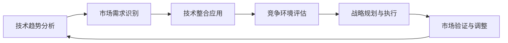

                 

## 1. 背景介绍

技术洞察力对于创业来说是一种关键能力。它意味着能够在复杂多变的环境中，准确地理解当前技术趋势和市场需求，以及它们之间的潜在联系。这种洞察力对于创业公司在竞争激烈的市场中站稳脚跟，快速适应环境变化，实现持续增长至关重要。本文将探讨如何利用技术洞察力进行创新创业，通过从技术原理到实际应用，从数学模型到开发实践，全面阐释技术洞察力在创新创业中的角色和价值。

## 2. 核心概念与联系

### 2.1 核心概念概述

技术洞察力，简单来说，是指个人或组织在特定技术领域内，通过深入研究、实践和反思，获取并应用关键知识的能力。它涵盖了技术理解、市场分析、趋势预测、战略制定等多个层面。以下是几个核心概念及其相互关系：

- **技术趋势分析**：对当前和未来技术的发展趋势进行分析和预测。
- **市场需求识别**：通过市场调研和用户反馈，识别目标用户群体的需求和痛点。
- **技术整合应用**：将新技术与现有产品或服务进行整合，创造出新的价值。
- **竞争环境评估**：分析竞争对手的技术实力和市场策略，识别自身优势和劣势。
- **战略规划与执行**：根据技术洞察和市场需求，制定并执行相应的市场策略。

这些概念构成了技术洞察力的主要框架，通过综合应用这些概念，创业公司可以更好地应对市场挑战，抓住机遇，实现创新和成长。

### 2.2 核心概念原理和架构的 Mermaid 流程图



## 3. 核心算法原理 & 具体操作步骤

### 3.1 算法原理概述

技术洞察力的获取与应用是一个循环迭代的动态过程。它结合了数据收集、模型构建、结果分析和实践调整等多个环节。以下是技术洞察力获取的主要步骤：

1. **数据收集**：收集行业内的技术报告、市场调研、用户反馈、竞争信息等数据。
2. **模型构建**：构建预测模型，如回归模型、聚类模型、分类模型等，分析数据的潜在模式和趋势。
3. **结果分析**：通过分析模型输出，识别技术趋势、市场需求、竞争态势等关键信息。
4. **实践调整**：根据分析结果，调整产品或服务的设计、开发策略，以更好地满足市场需求。

### 3.2 算法步骤详解

以下是一个详细的技术洞察力获取和应用步骤：

**Step 1: 数据收集与预处理**
- 收集行业内的技术报告、市场调研、用户反馈、竞争信息等数据。
- 对数据进行清洗和预处理，去除噪音和不相关数据。
- 将数据分为训练集和测试集，以便进行后续模型构建和验证。

**Step 2: 模型构建**
- 选择合适的模型架构，如回归模型、聚类模型、分类模型等。
- 使用Python等编程语言，选择合适的机器学习框架（如TensorFlow、PyTorch等）进行模型实现。
- 对模型进行超参数调优，使用交叉验证等技术优化模型性能。

**Step 3: 结果分析**
- 对模型输出结果进行分析，识别技术趋势、市场需求、竞争态势等关键信息。
- 使用数据可视化工具（如Matplotlib、Seaborn等）呈现分析结果，帮助团队更好地理解数据。

**Step 4: 实践调整**
- 根据分析结果，调整产品或服务的设计、开发策略。
- 进行产品原型开发和测试，验证改进措施的有效性。
- 根据反馈不断迭代改进，优化产品或服务以满足市场需求。

### 3.3 算法优缺点

技术洞察力获取和应用的优点包括：

- 数据驱动：通过数据分析和建模，获取基于事实的技术洞察，减少主观偏差。
- 预测能力：通过模型构建和结果分析，能够预测未来的技术趋势和市场需求，帮助提前布局。
- 决策支持：提供科学的数据和分析结果，支持创业团队制定更加合理的战略决策。

但该方法也存在一些缺点：

- 数据质量依赖：数据的质量和完整性直接影响模型的准确性和可信度。
- 模型复杂性：构建和优化复杂模型需要大量时间和资源，可能不适用于小规模创业公司。
- 适应性问题：模型结果可能与实际情况有所偏差，需要持续调整和优化。

### 3.4 算法应用领域

技术洞察力在多个领域都有广泛的应用，包括但不限于：

- **科技创新**：识别新兴技术趋势，推动产品创新和升级。
- **市场拓展**：分析市场竞争态势，制定市场进入和退出策略。
- **用户体验优化**：识别用户需求和痛点，提升产品使用体验。
- **风险管理**：评估技术风险和市场风险，制定风险应对措施。
- **战略规划**：结合技术洞察和市场需求，制定长期战略规划。

## 4. 数学模型和公式 & 详细讲解 & 举例说明

### 4.1 数学模型构建

技术洞察力的获取和应用通常涉及多个数学模型，以下是一些典型的数学模型：

- **回归模型**：用于分析变量之间的线性关系，预测未来趋势。
- **聚类模型**：用于识别数据中的群组，发现技术或市场需求中的模式。
- **分类模型**：用于将数据分为不同的类别，识别技术趋势和市场需求的变化。

### 4.2 公式推导过程

以回归模型为例，假设我们有n个数据点 $(x_1, y_1), (x_2, y_2), ..., (x_n, y_n)$，目标是找到一个线性模型 $y = \theta_0 + \theta_1 x + \epsilon$，其中 $\epsilon$ 是误差项，通过最小化误差平方和来求解 $\theta_0$ 和 $\theta_1$。

最小二乘法求解公式如下：

$$
\theta = (X^T X)^{-1} X^T y
$$

其中，$X = \begin{bmatrix} 1 & x_1 \\ 1 & x_2 \\ \vdots & \vdots \\ 1 & x_n \end{bmatrix}$，$y = \begin{bmatrix} y_1 \\ y_2 \\ \vdots \\ y_n \end{bmatrix}$。

### 4.3 案例分析与讲解

以一个创业公司的技术洞察力应用案例为例，假设该公司计划开发一款智能客服系统。以下是具体步骤：

**Step 1: 数据收集与预处理**
- 收集行业内关于智能客服的报告和案例研究，分析市场需求和趋势。
- 对现有智能客服系统的用户反馈进行分析，识别常见问题和痛点。
- 通过调查问卷和访谈，收集潜在客户的需求和期望。

**Step 2: 模型构建**
- 构建回归模型，分析市场需求与技术趋势之间的关系。
- 使用Python和Scikit-learn库实现回归模型，并进行超参数调优。

**Step 3: 结果分析**
- 通过分析回归模型输出，识别市场需求和趋势的变化。
- 使用Matplotlib等工具呈现结果，帮助团队理解市场需求。

**Step 4: 实践调整**
- 根据分析结果，调整智能客服系统的功能设计，如自动回复、问题分类等。
- 进行原型开发和测试，收集用户反馈，优化系统功能。
- 持续收集用户反馈和市场数据，不断迭代改进。

## 5. 项目实践：代码实例和详细解释说明

### 5.1 开发环境搭建

以下是一个Python环境搭建的示例：

**Step 1: 安装Python和相关库**
- 安装Python 3.8，使用Anaconda创建虚拟环境。
- 安装必要的库，如NumPy、Pandas、Matplotlib、Scikit-learn等。

**Step 2: 数据准备**
- 准备所需数据集，如行业报告、用户反馈、市场调研等。
- 对数据进行清洗和预处理，去除噪音和不相关数据。

**Step 3: 模型构建与训练**
- 选择适当的模型，如线性回归模型。
- 使用Python和Scikit-learn库实现模型，并进行超参数调优。

### 5.2 源代码详细实现

以下是一个回归模型的代码示例：

```python
import numpy as np
from sklearn.linear_model import LinearRegression

# 数据准备
X = np.array([[1, 2], [3, 4], [5, 6]])
y = np.array([1, 3, 5])

# 模型构建与训练
model = LinearRegression()
model.fit(X, y)

# 结果分析
y_pred = model.predict([[7, 8]])
print("预测值：", y_pred)
```

### 5.3 代码解读与分析

以上代码展示了回归模型的基本实现流程：

- 首先，导入必要的库和数据。
- 然后，定义线性回归模型，并进行训练。
- 最后，使用训练好的模型对新的数据点进行预测。

## 6. 实际应用场景

技术洞察力在多个实际应用场景中都有广泛的应用。以下是几个典型的场景：

### 6.1 智能客服系统

在智能客服系统中，技术洞察力可以帮助创业公司识别市场需求，优化智能客服系统的功能和性能。通过对用户反馈和市场调研数据的分析，创业公司可以识别用户常见问题，优化自动回复和问题分类功能，提升用户满意度。

### 6.2 智能推荐系统

在智能推荐系统中，技术洞察力可以帮助创业公司分析用户行为数据，识别用户的兴趣和偏好。通过对用户历史行为和浏览记录的建模，创业公司可以推荐更符合用户兴趣的内容，提升用户体验。

### 6.3 医疗健康平台

在医疗健康平台中，技术洞察力可以帮助创业公司识别用户健康需求，提供个性化健康建议。通过对用户健康数据和行为数据的分析，创业公司可以推荐更有效的健康管理方案，提升用户健康水平。

### 6.4 未来应用展望

技术洞察力的应用前景广阔，未来在以下几个方向有更多可能性：

- **AI驱动的产品创新**：利用AI技术分析和预测市场趋势，推动产品创新和升级。
- **跨界融合的商业模式**：结合不同领域的先进技术，创新商业模式，提供跨界服务。
- **智能决策支持**：通过数据驱动的决策支持系统，提升创业公司的决策效率和准确性。

## 7. 工具和资源推荐

### 7.1 学习资源推荐

为了帮助创业公司系统掌握技术洞察力的方法和应用，以下是一些推荐的学习资源：

- **Coursera和edX在线课程**：提供关于机器学习、数据分析、商业智能等领域的在线课程，适合初学者和进阶学习者。
- **Kaggle数据科学竞赛**：通过参与数据科学竞赛，实战练习和提升技术洞察力。
- **GitHub代码库**：查找和分享开源数据集和代码，提升技术洞察力的应用实践能力。

### 7.2 开发工具推荐

以下是一些推荐的开发工具：

- **Jupyter Notebook**：提供交互式编程环境，支持数据可视化、模型构建和结果分析。
- **TensorFlow和PyTorch**：支持深度学习和机器学习模型的构建和训练，提供丰富的API和工具库。
- **Scikit-learn**：提供简单易用的机器学习模型实现，支持回归、分类、聚类等算法。

### 7.3 相关论文推荐

以下是一些推荐的相关论文：

- **Deep Learning for Healthcare**：讨论如何利用深度学习技术改进医疗健康平台，提升用户健康管理水平。
- **AI-Driven Recommendation Systems**：介绍如何构建AI驱动的推荐系统，提升用户体验和满意度。
- **Customer Experience in Smart Service Systems**：研究如何利用技术洞察力优化智能客服系统，提升用户满意度。

## 8. 总结：未来发展趋势与挑战

### 8.1 总结

本文详细介绍了如何利用技术洞察力进行创新创业。通过从技术原理到实际应用，从数学模型到开发实践，全面阐释了技术洞察力在创新创业中的角色和价值。技术洞察力不仅能够帮助创业公司理解市场需求和趋势，还能够指导产品创新和战略规划，提升创业公司的竞争力和市场地位。

### 8.2 未来发展趋势

技术洞察力的应用前景广阔，未来在以下几个方向有更多可能性：

- **AI技术的持续进步**：随着AI技术的不断发展，技术洞察力在产品创新和市场预测中的作用将更加重要。
- **跨界融合的趋势**：不同领域的先进技术将更加紧密结合，推动跨界创新和商业模式的变革。
- **智能决策的普及**：基于数据驱动的决策支持系统将更加普及，提升创业公司的决策效率和准确性。

### 8.3 面临的挑战

尽管技术洞察力在创新创业中具有重要价值，但面临的挑战也不容忽视：

- **数据隐私和安全**：在分析用户数据时，必须遵守数据隐私和安全法规，确保用户数据的安全。
- **技术复杂性**：构建和优化复杂模型需要大量时间和资源，创业公司可能面临技术资源不足的问题。
- **市场动态变化**：市场需求和技术趋势不断变化，技术洞察力需要持续调整和优化，以保持其时效性和准确性。

### 8.4 研究展望

未来技术洞察力的研究将围绕以下几个方向展开：

- **自动化技术洞察**：开发自动化工具和算法，提升技术洞察力获取的效率和准确性。
- **多模态数据分析**：结合不同类型的数据源，进行多模态数据分析，提升技术洞察力的综合能力。
- **跨领域知识整合**：将跨领域的专业知识和经验与技术洞察力结合，提升技术洞察力的实用性和普适性。

## 9. 附录：常见问题与解答

**Q1: 如何获取高质量的数据？**

A: 高质量的数据获取是技术洞察力应用的关键。可以通过以下方式获取高质量数据：
- 参加行业内的数据竞赛，获取公开数据集。
- 进行市场调研，收集用户反馈和需求数据。
- 使用公开的API接口，获取相关领域的数据。

**Q2: 如何评估模型的准确性？**

A: 评估模型的准确性是技术洞察力应用的重要环节。常用的评估方法包括：
- 交叉验证：将数据集分为训练集和测试集，评估模型的预测准确性。
- ROC曲线和AUC值：评估分类模型的准确性和泛化能力。
- MSE和RMSE：评估回归模型的预测精度。

**Q3: 如何处理数据噪音和不相关数据？**

A: 数据噪音和不相关数据是技术洞察力获取的主要障碍。常用的处理方式包括：
- 数据清洗：去除缺失值和异常值，处理重复数据。
- 特征选择：选择与目标变量相关性高的特征，去除无关特征。
- 数据归一化：将数据缩放到0到1之间，提升模型训练效果。

通过回答这些常见问题，可以帮助创业公司更好地理解和应用技术洞察力，提升创新创业的成功率。

---

作者：禅与计算机程序设计艺术 / Zen and the Art of Computer Programming

