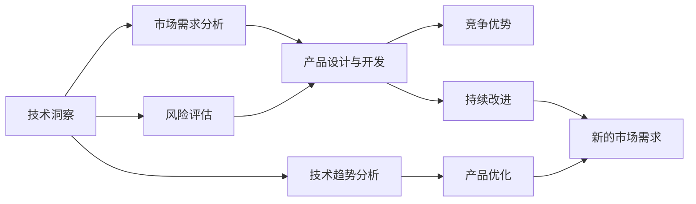

                 

## 1. 背景介绍

创新创业，是当今社会最引人注目的经济活动之一。特别是在数字时代，技术洞察成为了创业者成功的重要砝码。通过技术的洞察，创业者可以预见行业趋势、挖掘市场需求、提高产品竞争力，从而在激烈的市场竞争中脱颖而出。本文旨在深入探讨技术洞察在创新创业中的作用，并提供系统化的指导。

### 1.1 问题由来

在过去的十年里，技术领域的变革速度前所未有。大数据、云计算、人工智能、物联网等新兴技术的迅猛发展，催生了诸多创新创业机会。然而，如何在技术浪潮中把握机遇，成为创业者的最大挑战。许多人因为没有充分理解技术的本质，盲目跟风，导致产品失败或被市场淘汰。因此，本文聚焦于利用技术洞察进行创新创业，通过深入分析技术原理和应用场景，帮助创业者做出明智的决策。

### 1.2 问题核心关键点

技术洞察的核心关键点包括以下几个方面：

1. **技术理解**：对新技术的本质、原理、优缺点有深入的理解，避免盲目跟风。
2. **市场分析**：通过技术洞察分析市场需求，发现未被满足的客户痛点，挖掘潜在的市场机会。
3. **产品优化**：利用技术洞察优化产品设计和功能，提高用户体验和竞争力。
4. **风险评估**：通过技术洞察评估项目的潜在风险和挑战，制定合理的应对策略。
5. **持续改进**：利用技术洞察不断迭代产品和商业模式，保持竞争优势。

本文将围绕这些关键点，系统阐述技术洞察在创新创业中的具体应用。

## 2. 核心概念与联系

### 2.1 核心概念概述

在讨论技术洞察在创新创业中的应用前，我们需要先理解一些核心概念：

1. **技术洞察（Technical Insight）**：指通过对技术的深入理解和分析，获得关于技术发展趋势、应用场景、潜在价值等方面的见解，从而指导创新创业的决策。
2. **产品设计与开发（Product Design and Development）**：从市场需求和技术趋势出发，设计并开发满足用户需求的产品或服务。
3. **市场需求（Market Demand）**：指市场上用户对某种产品或服务的需求程度，是产品设计的重要参考。
4. **用户痛点（User Pain Point）**：指用户在实际使用中遇到的困难、不便或需求未被满足的地方，是产品优化的重要依据。
5. **竞争优势（Competitive Advantage）**：指产品或服务相对于竞争对手的优势，是市场成功的关键因素。
6. **风险评估（Risk Assessment）**：对项目实施过程中可能遇到的风险进行评估和规避，是项目成功的保障。
7. **持续改进（Continuous Improvement）**：通过不断的技术洞察和创新，持续优化产品和服务，保持市场领先地位。

这些概念之间存在着紧密的联系和相互作用，形成了一个动态的系统，帮助创业者实现商业成功。

### 2.2 核心概念原理和架构的 Mermaid 流程图



这个流程图展示了技术洞察在创新创业中的核心作用。技术洞察帮助创业者从市场需求出发，设计并开发出具有竞争优势的产品，同时通过风险评估和持续改进，确保项目的成功。

## 3. 核心算法原理 & 具体操作步骤

### 3.1 算法原理概述

技术洞察主要依赖于数据分析、市场调研、用户访谈等手段，通过系统化的方法获取和分析技术相关的信息。以下是一个系统化的技术洞察框架：

1. **技术趋势分析**：通过数据分析、技术报告、专利文献等资源，了解当前技术的发展方向和热点。
2. **市场需求分析**：通过用户调研、数据分析、市场报告等手段，获取市场需求和用户痛点信息。
3. **产品设计与优化**：结合技术趋势和市场需求，设计并优化产品功能，满足用户需求。
4. **竞争优势评估**：通过市场调研和竞争分析，评估产品的竞争优势。
5. **风险评估与规避**：通过风险管理工具和方法，识别潜在风险并制定应对策略。

### 3.2 算法步骤详解

以下是技术洞察的具体操作步骤：

**Step 1: 技术趋势分析**
- 收集最新的技术报告、专利文献、行业白皮书等资料，了解技术发展的最新动态。
- 使用数据挖掘工具，分析技术领域的论文、专利、项目等数据，获取关键技术点和趋势。
- 通过专家访谈和社区讨论，获取技术从业者对技术趋势的看法和预测。

**Step 2: 市场需求分析**
- 进行用户调研，了解目标用户的需求、偏好、痛点和行为。
- 分析市场数据，如搜索流量、销售数据、用户反馈等，获取市场需求信息。
- 使用市场调研工具，如问卷调查、焦点小组、用户访谈等，深入了解用户需求。

**Step 3: 产品设计与优化**
- 结合技术趋势和市场需求，设计产品功能和用户界面。
- 使用原型设计和用户测试，验证产品设计的可行性和用户接受度。
- 根据用户反馈和技术发展，不断优化产品功能和用户体验。

**Step 4: 竞争优势评估**
- 分析竞争对手的产品和服务，了解其优缺点。
- 使用SWOT分析工具，评估自身的优势、劣势、机会和威胁。
- 确定核心竞争力，制定差异化的产品策略。

**Step 5: 风险评估与规避**
- 识别项目实施过程中的潜在风险，如技术风险、市场风险、财务风险等。
- 使用风险管理工具，如风险矩阵、敏感性分析等，评估风险的概率和影响。
- 制定应对策略，如风险转移、风险缓解、风险接受等，确保项目的顺利实施。

**Step 6: 持续改进**
- 定期进行技术洞察，获取最新的技术趋势和市场需求。
- 分析用户反馈和市场表现，持续优化产品和服务。
- 通过技术迭代和商业模式创新，保持竞争优势。

### 3.3 算法优缺点

技术洞察具有以下优点：

1. **前瞻性**：通过对技术趋势和市场需求的前瞻性分析，帮助创业者抢占市场先机。
2. **数据驱动**：基于大量数据分析和市场调研，决策更加科学和客观。
3. **风险控制**：通过系统的风险评估和规避措施，降低项目实施的风险。
4. **用户导向**：深入了解用户需求和痛点，设计符合用户期望的产品。

同时，技术洞察也存在以下缺点：

1. **成本高**：需要进行大量的数据分析和市场调研，成本较高。
2. **复杂度高**：技术洞察涉及多个环节和工具，操作复杂。
3. **数据质量**：依赖于数据的质量和完整性，低质量数据可能导致错误决策。

### 3.4 算法应用领域

技术洞察可以应用于多个领域，帮助创业者发现商业机会，提升产品竞争力。以下是几个典型应用领域：

1. **智能制造**：通过对工业自动化和物联网技术的洞察，设计智能制造解决方案，提高生产效率和质量。
2. **健康医疗**：通过大数据和人工智能技术的洞察，开发智能医疗设备和服务，改善患者体验和治疗效果。
3. **金融科技**：通过对区块链和人工智能技术的洞察，设计金融科技产品和服务，提高金融服务的效率和安全性。
4. **零售电商**：通过对大数据和电子商务技术的洞察，优化零售电商的运营模式，提升用户体验和销售额。
5. **教育科技**：通过对在线教育和人工智能技术的洞察，开发智能教育产品和服务，提升教学效果和学习体验。
6. **能源环保**：通过对可再生能源和智能电网技术的洞察，开发能源环保解决方案，推动可持续发展。

## 4. 数学模型和公式 & 详细讲解 & 举例说明

### 4.1 数学模型构建

在技术洞察的过程中，常常需要构建数学模型来描述技术趋势、市场需求和产品优化。以下是一个简化的数学模型：

**市场需求模型**：

$$
D = f(X, Y, Z)
$$

其中，$D$ 表示市场需求，$X$ 表示技术趋势，$Y$ 表示用户需求，$Z$ 表示市场环境。

**产品优化模型**：

$$
P = g(D, T, C)
$$

其中，$P$ 表示产品特性，$D$ 表示市场需求，$T$ 表示技术趋势，$C$ 表示竞争环境。

### 4.2 公式推导过程

以下是市场需求模型的推导过程：

1. **数据采集**：收集市场数据、技术趋势数据和用户需求数据。
2. **数据预处理**：对数据进行清洗、归一化、特征选择等预处理步骤。
3. **模型构建**：使用回归分析、时间序列分析等方法，构建市场需求模型。
4. **模型评估**：使用交叉验证、均方误差等方法，评估模型性能。
5. **模型应用**：将模型应用于市场需求预测，指导产品设计。

### 4.3 案例分析与讲解

以智能制造为例，分析市场需求和技术趋势的关系。

**需求分析**：

通过对市场调研和数据分析，发现智能制造的市场需求不断增长，尤其在自动化和智能化方面。

**趋势分析**：

通过对技术报告和专利文献的分析，发现机器学习、物联网、云计算等技术在智能制造中的应用前景广阔。

**产品设计**：

结合市场需求和技术趋势，设计了基于机器学习的智能制造系统，包括智能监控、自动化调度、质量检测等功能。

**风险评估**：

评估了系统实施中的技术风险、市场风险和财务风险，制定了相应的应对策略。

**持续改进**：

定期进行技术洞察，获取最新的市场需求和技术趋势，持续优化产品功能和服务。

## 5. 项目实践：代码实例和详细解释说明

### 5.1 开发环境搭建

要实现技术洞察的代码实践，首先需要搭建好开发环境。以下是Python开发环境的搭建步骤：

1. **安装Python**：下载并安装Python最新版本，建议使用Anaconda或Miniconda。
2. **创建虚拟环境**：使用conda或virtualenv创建虚拟环境，确保项目的Python版本独立。
3. **安装相关库**：安装必要的Python库，如Pandas、NumPy、Scikit-learn等。
4. **配置环境变量**：设置PYTHONPATH、PYTHONPATH等环境变量，确保项目代码的导入。

### 5.2 源代码详细实现

以下是使用Python进行技术洞察分析的代码实现：

```python
import pandas as pd
import numpy as np
from sklearn.linear_model import LinearRegression
from sklearn.model_selection import train_test_split
from sklearn.metrics import mean_squared_error

# 读取数据
data = pd.read_csv('market_data.csv')

# 数据预处理
X = data[['技术趋势', '用户需求', '市场环境']]
y = data['市场需求']

# 模型构建
X_train, X_test, y_train, y_test = train_test_split(X, y, test_size=0.2, random_state=42)
model = LinearRegression()
model.fit(X_train, y_train)

# 模型评估
y_pred = model.predict(X_test)
mse = mean_squared_error(y_test, y_pred)
print('均方误差：', mse)
```

### 5.3 代码解读与分析

这段代码使用了线性回归模型对市场需求进行预测，其中：

1. **数据读取**：使用Pandas库读取市场数据。
2. **数据预处理**：将数据分为特征和标签，并进行归一化处理。
3. **模型构建**：使用线性回归模型拟合数据，并进行交叉验证。
4. **模型评估**：计算模型的均方误差，评估模型性能。

## 6. 实际应用场景

### 6.1 智能制造

在智能制造领域，技术洞察可以帮助企业从市场需求出发，设计出符合用户需求的产品。例如，通过分析市场需求和工业自动化趋势，设计智能制造系统，提高生产效率和产品质量。

### 6.2 健康医疗

在健康医疗领域，技术洞察可以帮助医疗机构了解患者的需求，设计智能医疗设备和服务。例如，通过分析用户对健康管理的需求，开发智能健康监测系统，提升患者体验和治疗效果。

### 6.3 金融科技

在金融科技领域，技术洞察可以帮助金融机构把握市场需求，设计高效、安全的金融产品。例如，通过分析金融科技的发展趋势和用户需求，开发智能投顾系统，提升投资回报率。

### 6.4 零售电商

在零售电商领域，技术洞察可以帮助企业优化运营模式，提升用户体验和销售额。例如，通过分析市场需求和电商技术趋势，设计智能推荐系统，个性化推荐商品，提高转化率。

### 6.5 教育科技

在教育科技领域，技术洞察可以帮助教育机构了解学生需求，设计智能教育产品和服务。例如，通过分析学生对在线学习的需求，开发智能教育平台，提升教学效果和学习体验。

### 6.6 能源环保

在能源环保领域，技术洞察可以帮助企业设计能源管理方案，推动可持续发展。例如，通过分析可再生能源和智能电网技术的发展趋势，开发能源管理系统，优化能源利用效率。

## 7. 工具和资源推荐

### 7.1 学习资源推荐

要深入了解技术洞察在创新创业中的应用，可以参考以下学习资源：

1. **《创新创业与技术洞察》**：系统介绍技术洞察在创新创业中的作用和方法。
2. **《数据分析与市场调研》**：详细讲解数据分析和市场调研的工具和方法。
3. **《机器学习与智能制造》**：介绍机器学习在智能制造中的应用。
4. **《智能医疗与健康科技》**：讲解智能医疗和健康科技的最新进展。
5. **《金融科技与区块链》**：分析金融科技和区块链技术的趋势和应用。
6. **《零售电商与数据分析》**：探讨零售电商和数据分析的结合。
7. **《教育科技与人工智能》**：研究教育科技和人工智能技术的应用。
8. **《能源环保与可持续发展》**：分析能源环保技术的最新发展。

### 7.2 开发工具推荐

以下是几款常用的开发工具，用于技术洞察的实现：

1. **Python**：编程语言，适合数据分析、机器学习和自然语言处理。
2. **Pandas**：数据分析库，适合处理结构化数据。
3. **NumPy**：数学计算库，适合数值计算和线性代数。
4. **Scikit-learn**：机器学习库，适合构建分类、回归等模型。
5. **Jupyter Notebook**：交互式编程环境，适合数据分析和机器学习。
6. **TensorFlow**：深度学习框架，适合构建复杂的神经网络模型。
7. **PyTorch**：深度学习框架，适合构建动态计算图模型。
8. **Tableau**：数据可视化工具，适合数据探索和报表展示。

### 7.3 相关论文推荐

以下是几篇关于技术洞察的论文，推荐阅读：

1. **《技术洞察与创新创业》**：系统研究技术洞察在创新创业中的应用。
2. **《市场需求分析与产品设计》**：分析市场需求和技术趋势对产品设计的影响。
3. **《智能制造与机器学习》**：探讨机器学习在智能制造中的应用。
4. **《智能医疗与人工智能》**：研究人工智能在智能医疗中的应用。
5. **《金融科技与区块链》**：分析区块链技术在金融科技中的应用。
6. **《零售电商与大数据》**：探讨大数据技术在零售电商中的应用。
7. **《教育科技与在线学习》**：研究在线学习技术的发展。
8. **《能源环保与可再生能源》**：分析可再生能源技术的应用。

## 8. 总结：未来发展趋势与挑战

### 8.1 研究成果总结

本文通过系统介绍技术洞察在创新创业中的应用，探讨了技术趋势、市场需求、产品设计、竞争优势、风险评估和持续改进等关键点。通过深入分析技术洞察的原理和操作步骤，提供了系统化的技术洞察框架和代码实现。同时，本文也探讨了技术洞察在多个领域的应用场景，推荐了相关学习资源、开发工具和研究论文。

### 8.2 未来发展趋势

技术洞察在未来将呈现以下几个发展趋势：

1. **数据驱动**：随着大数据技术的发展，数据驱动的决策将成为常态。
2. **人工智能化**：人工智能技术将在技术洞察中发挥越来越重要的作用。
3. **多学科融合**：技术洞察将更多地融合其他学科的知识，如经济学、社会学、心理学等。
4. **实时化**：实时数据分析和预测将成为技术洞察的重要手段。
5. **社会化**：技术洞察将更多地依赖社区和用户反馈，实现社会化参与。

### 8.3 面临的挑战

技术洞察在创新创业中也面临着诸多挑战：

1. **数据质量**：高质量数据的获取和处理仍然是一个难题。
2. **模型复杂性**：复杂模型的构建和优化需要更多的资源和技能。
3. **人才短缺**：具备数据科学、技术洞察能力的复合型人才仍然稀缺。
4. **风险控制**：技术洞察的决策需要科学的风险评估和控制。
5. **市场变化**：市场需求和技术趋势的变化速度较快，需要快速响应。

### 8.4 研究展望

未来的研究需要在以下几个方面寻求新的突破：

1. **数据治理**：建立数据治理机制，保障数据质量和安全。
2. **模型自动化**：开发自动化建模工具，简化技术洞察的流程。
3. **跨领域融合**：推动技术与更多学科的融合，拓宽技术洞察的边界。
4. **实时分析**：开发实时分析工具，支持快速决策。
5. **社区参与**：引入社区和用户反馈，提升技术洞察的准确性。
6. **伦理合规**：研究技术洞察的伦理和法律问题，确保合规性。

技术洞察是创新创业的重要工具，通过深入理解技术趋势和市场需求，优化产品设计和运营模式，可以提升企业的竞争力和市场影响力。未来的技术洞察研究需要更加注重数据的治理、模型的自动化、跨领域的融合和社区的参与，从而实现更高效、更智能、更可持续的创新创业。

## 9. 附录：常见问题与解答

**Q1：技术洞察需要哪些数据？**

A: 技术洞察需要收集市场需求、技术趋势、用户需求、市场环境等多方面的数据。这些数据可以从公开的数据库、市场调研、用户访谈、专利文献等渠道获取。

**Q2：技术洞察的主要步骤有哪些？**

A: 技术洞察的主要步骤包括数据采集、数据预处理、模型构建、模型评估和模型应用。其中，数据采集和预处理是基础，模型构建和评估是核心，模型应用是最终目标。

**Q3：技术洞察在各个领域的应用案例有哪些？**

A: 技术洞察在智能制造、健康医疗、金融科技、零售电商、教育科技、能源环保等多个领域都有应用案例。例如，智能制造中的智能监控系统、健康医疗中的智能健康监测系统、金融科技中的智能投顾系统、零售电商中的智能推荐系统等。

**Q4：技术洞察的优缺点有哪些？**

A: 技术洞察的优点包括前瞻性、数据驱动、风险控制、用户导向等。缺点包括成本高、复杂度高、数据质量等。

**Q5：技术洞察的未来发展趋势是什么？**

A: 技术洞察的未来发展趋势包括数据驱动、人工智能化、多学科融合、实时化、社会化等。

**Q6：如何克服技术洞察的挑战？**

A: 克服技术洞察挑战的关键在于建立数据治理机制、开发自动化建模工具、推动跨领域融合、引入社区反馈、研究伦理合规等。

---

作者：禅与计算机程序设计艺术 / Zen and the Art of Computer Programming

