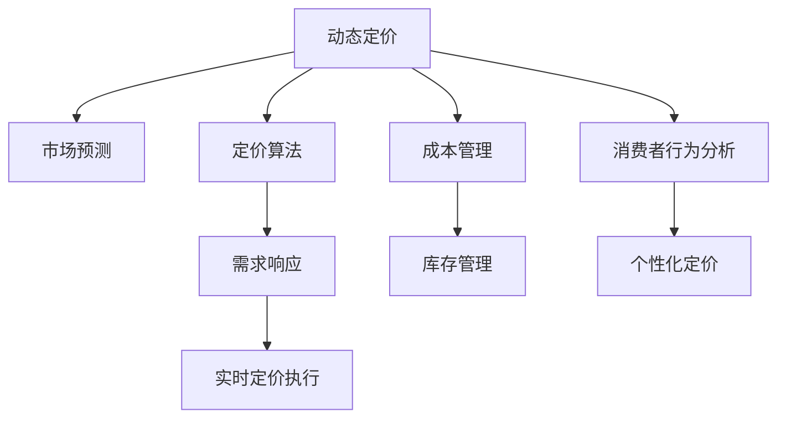

                 

# 动态定价策略：AI的实现

> 关键词：动态定价, 人工智能, 优化算法, 需求响应, 市场预测, 实时定价

## 1. 背景介绍

### 1.1 问题由来

在现代商业中，动态定价策略(Dynamic Pricing Strategy)变得越来越重要。随着市场环境的不断变化，企业需要实时调整其产品或服务的定价，以应对供需关系的变化、竞争策略、季节性需求等因素。传统的静态定价策略无法灵活应对这些变化，而动态定价策略通过实时调整价格，可以更有效地提升收益和市场竞争力。

然而，动态定价策略的实施需要准确预测市场需求和竞争对手的动态，同时需要快速计算和执行价格调整。这要求企业具备强大的数据分析和决策支持能力。人工智能(AI)技术，特别是机器学习和优化算法，为此提供了有力的技术支撑。

### 1.2 问题核心关键点

动态定价的核心在于实时评估市场需求、竞争环境和成本，基于这些数据进行动态调整，以实现最优的收益最大化。

动态定价的核心关键点包括：
- 实时市场预测：利用AI技术实时分析市场需求和竞争环境，预测未来的价格敏感性和消费者行为。
- 定价算法优化：设计高效的定价算法，基于市场预测结果，优化价格调整策略。
- 需求响应机制：实时调整价格以响应市场变化，同时保护品牌形象和消费者信任。
- 实时定价执行：确保价格调整能够迅速实施，并监控执行效果。

### 1.3 问题研究意义

动态定价策略的AI实现，对于提升企业市场竞争力和盈利能力具有重要意义：

1. **提升收益**：通过实时调整价格，企业可以在需求高峰期提高价格，需求低谷期降低价格，从而最大化收益。
2. **提高市场响应速度**：AI技术可以实时分析市场变化，快速调整定价策略，提高市场响应速度。
3. **增强竞争优势**：动态定价策略能够灵活应对竞争对手的价格调整，增强企业的市场竞争力。
4. **优化库存管理**：通过动态定价策略，企业可以更好地管理库存，减少积压和缺货现象。
5. **支持个性化定价**：利用AI技术，企业可以根据不同消费者的行为和偏好，实施个性化定价策略，提升用户体验。

## 2. 核心概念与联系

### 2.1 核心概念概述

为更好地理解动态定价策略的AI实现，本节将介绍几个密切相关的核心概念：

- **动态定价(Dynamic Pricing)**：指根据市场需求、竞争环境、成本等因素，实时调整产品或服务价格以优化收益的策略。动态定价策略的核心在于实时分析市场数据，迅速调整价格。

- **市场预测(Market Prediction)**：通过AI技术对市场需求、竞争环境等因素进行预测，为动态定价提供数据支撑。市场预测的准确性直接影响定价策略的有效性。

- **定价算法(Pricing Algorithm)**：基于市场预测结果，设计算法优化价格调整策略。定价算法应考虑成本、库存、市场响应等因素，以实现收益最大化。

- **需求响应(Demand Response)**：指企业根据市场需求变化，实时调整价格以响应市场，同时保护品牌形象和消费者信任。需求响应机制的灵活性直接影响价格策略的实施效果。

- **实时定价执行(Real-time Pricing Implementation)**：确保价格调整能够迅速实施，并监控执行效果。实时定价执行依赖于高效的技术实现和实时数据分析。

这些核心概念之间的逻辑关系可以通过以下Mermaid流程图来展示：



这个流程图展示了大语言模型的核心概念及其之间的关系：

1. 动态定价通过市场预测获得数据支撑，设计定价算法，响应市场需求，执行价格调整。
2. 定价算法需要考虑成本、库存等因素，以优化价格策略。
3. 需求响应机制确保价格调整的灵活性和合理性。
4. 实时定价执行确保价格调整能够迅速实施，并监控执行效果。

这些概念共同构成了动态定价策略的AI实现框架，为企业提供了一整套完整的市场响应和定价优化方案。

## 3. 核心算法原理 & 具体操作步骤
### 3.1 算法原理概述

动态定价策略的AI实现，本质上是一个优化问题。其核心思想是：在实时获取的市场数据和预测结果的基础上，利用优化算法，设计最佳的定价策略，以实现收益最大化。

形式化地，假设市场需求函数为 $D(p,t)$，其中 $p$ 为价格，$t$ 为时间。企业目标函数为 $J(p)$，如利润最大化或收益最大化，考虑成本和库存等因素。目标函数和约束条件可以表示为：

$$
\max J(p) = \int_{0}^{T} (pD(p,t) - C(p)) dt
$$

约束条件包括成本函数 $C(p)$、库存水平 $I$、价格调整频率等。求解上述最优化问题，得到最优定价策略。

### 3.2 算法步骤详解

动态定价策略的AI实现一般包括以下几个关键步骤：

**Step 1: 数据收集与处理**

- 收集实时市场数据，如历史销售数据、当前库存水平、竞争对手价格等。
- 利用AI技术进行数据清洗和预处理，如时间序列分析、异常值检测等。

**Step 2: 市场预测**

- 利用AI技术，如时间序列预测、回归分析等，预测市场需求和竞争环境。
- 根据市场预测结果，确定价格敏感性和消费者行为的变化趋势。

**Step 3: 定价算法设计**

- 设计定价算法，如需求响应模型、收益最大化模型等，考虑成本、库存等因素。
- 选择合适的优化算法，如梯度下降、遗传算法、模拟退火等，求解定价问题。

**Step 4: 价格调整与执行**

- 根据市场预测和定价算法，计算最优价格。
- 实时调整价格，并通过API接口执行。
- 监控价格调整效果，及时反馈和调整策略。

**Step 5: 优化与迭代**

- 持续优化定价算法和市场预测模型，提升预测准确性和定价效果。
- 根据市场变化，迭代定价策略，适应新的市场环境。

### 3.3 算法优缺点

动态定价策略的AI实现具有以下优点：
1. 实时响应市场变化：通过AI技术实时分析市场数据，迅速调整价格，提高市场响应速度。
2. 优化定价策略：利用优化算法设计最佳的定价策略，实现收益最大化。
3. 准确的市场预测：通过AI技术，提高市场预测的准确性，为定价提供可靠数据支撑。

同时，该方法也存在一定的局限性：
1. 对数据依赖度高：AI实现依赖于高质量的市场数据，数据缺失或偏差可能影响定价效果。
2. 技术实现复杂：需要整合多种AI技术和算法，实现过程复杂。
3. 预测不确定性：市场环境变化复杂，预测模型可能无法完全捕捉所有因素。
4. 需要持续优化：市场环境不断变化，AI模型需要持续更新和优化，保持预测准确性和定价策略的有效性。

尽管存在这些局限性，但就目前而言，动态定价策略的AI实现仍然是大规模市场响应和定价优化的重要手段。未来相关研究的重点在于如何进一步降低对数据的依赖，提高预测的准确性，同时兼顾实时性和可解释性等因素。

### 3.4 算法应用领域

动态定价策略的AI实现，已经在多个领域得到广泛应用，包括：

- **电子商务**：电商平台通过实时定价策略，根据市场需求和竞争环境，动态调整商品价格，提升销售量。
- **航空和酒店**：航空公司和酒店根据季节性需求和竞争环境，实时调整机票和房间价格，优化收益。
- **旅游和景点**：旅游和景点根据客流量和季节性变化，动态调整门票价格，提升用户体验和收益。
- **能源和电力**：能源公司根据市场需求和气候变化，实时调整电力价格，优化电力供应和销售。
- **电信和通信**：电信运营商根据用户使用情况和市场竞争，动态调整服务套餐价格，提升用户粘性和收益。

除了上述这些经典应用外，动态定价策略的AI实现也被创新性地应用到更多场景中，如智能合约、保险定价等，为不同行业的市场响应和定价优化提供新的解决方案。随着AI技术的不断进步，动态定价策略必将在更多领域得到广泛应用，为企业带来显著的收益提升和市场竞争力。

## 4. 数学模型和公式 & 详细讲解 & 举例说明

### 4.1 数学模型构建

本节将使用数学语言对动态定价策略的AI实现过程进行更加严格的刻画。

假设市场需求函数为 $D(p,t)$，其中 $p$ 为价格，$t$ 为时间。企业目标函数为 $J(p)$，如利润最大化或收益最大化，考虑成本 $C(p)$、库存 $I$ 等因素。目标函数和约束条件可以表示为：

$$
\max J(p) = \int_{0}^{T} (pD(p,t) - C(p)) dt
$$

其中 $D(p,t)$ 为市场需求函数，$C(p)$ 为成本函数，$I$ 为库存水平，$T$ 为时间区间。

### 4.2 公式推导过程

以下我们以收益最大化为例，推导定价策略的数学模型。

假设市场需求函数 $D(p,t)$ 为线性函数，即：

$$
D(p,t) = \alpha p + \beta
$$

其中 $\alpha$ 为价格弹性系数，$\beta$ 为基本需求量。成本函数 $C(p)$ 为固定成本和变动成本之和，即：

$$
C(p) = C_0 + C_1 p
$$

其中 $C_0$ 为固定成本，$C_1$ 为单位变动成本。库存水平 $I$ 为单位时间内的库存数量，$I_0$ 为初始库存水平。定价策略的目标函数为收益最大化，即：

$$
J(p) = \int_{0}^{T} (pD(p,t) - C(p)) dt - \lambda I
$$

其中 $\lambda$ 为库存成本系数。

根据上述目标函数和约束条件，利用拉格朗日乘数法求解最优定价策略：

$$
\frac{\partial J}{\partial p} = \alpha D(p,t) - C_1 = 0
$$

$$
\frac{\partial J}{\partial t} = \dot{D}(p,t) = \alpha D(p,t)
$$

解得：

$$
p(t) = C_1 / \alpha
$$

即最优定价策略为线性定价函数 $p(t) = C_1 / \alpha$，其中 $\alpha$ 为价格弹性系数。

在实际应用中，根据市场需求函数的实际形式和市场数据，可以进一步优化定价策略，如考虑时间差分、季节性因素等。

### 4.3 案例分析与讲解

假设某电商平台的商品市场，需求函数为：

$$
D(p,t) = \alpha p + \beta
$$

其中 $\alpha = 0.5$，$\beta = 100$。成本函数为：

$$
C(p) = 10 + 0.1p
$$

库存成本系数为 $\lambda = 0.01$。初始库存水平为 $I_0 = 1000$。要求在时间区间 $[0,10]$ 内，最大化收益。

根据上述公式，可以求解最优定价策略。首先，根据需求函数 $D(p,t)$ 和成本函数 $C(p)$，计算收益函数 $J(p)$：

$$
J(p) = \int_{0}^{10} (pD(p,t) - C(p)) dt - 0.01I
$$

根据市场需求函数 $D(p,t)$ 和成本函数 $C(p)$，利用积分求解 $J(p)$：

$$
J(p) = \frac{1}{2}pD(p,t)^2 - C(p)
$$

带入价格和成本函数，得：

$$
J(p) = \frac{1}{2}p(0.5p + 100)^2 - 10 - 0.1p
$$

简化得：

$$
J(p) = \frac{1}{8}p^3 + 50p^2 - 10 - 0.1p
$$

对 $J(p)$ 求导，得：

$$
\frac{\partial J}{\partial p} = \frac{3}{8}p^2 + 100p - 0.1
$$

令导数等于零，求解 $p$：

$$
\frac{3}{8}p^2 + 100p - 0.1 = 0
$$

解得：

$$
p = \frac{-100 \pm \sqrt{100^2 + 3 \cdot 0.1}}{3/8} = \frac{-100 \pm \sqrt{10000 + 0.3}}{3/8}
$$

根据实际情况，取正根，得最优定价策略为：

$$
p = \frac{-100 + \sqrt{10000 + 0.3}}{3/8}
$$

即：

$$
p = \frac{-100 + 100.03}{0.375} \approx 273.96
$$

因此，该电商平台在时间区间 $[0,10]$ 内的最优定价策略为 $p(t) = 273.96$，能够实现收益最大化。

## 5. 项目实践：代码实例和详细解释说明

### 5.1 开发环境搭建

在进行动态定价策略的AI实现实践前，我们需要准备好开发环境。以下是使用Python进行Pandas和Scikit-learn开发的开发环境配置流程：

1. 安装Anaconda：从官网下载并安装Anaconda，用于创建独立的Python环境。

2. 创建并激活虚拟环境：
```bash
conda create -n dynamic-pricing python=3.8 
conda activate dynamic-pricing
```

3. 安装Pandas和Scikit-learn：
```bash
pip install pandas scikit-learn
```

4. 安装各类工具包：
```bash
pip install numpy matplotlib joblib
```

完成上述步骤后，即可在`dynamic-pricing`环境中开始动态定价策略的AI实现实践。

### 5.2 源代码详细实现

下面我们以电商平台为例，给出使用Pandas和Scikit-learn对动态定价策略进行开发的Python代码实现。

首先，定义市场需求函数和成本函数：

```python
import pandas as pd
from scipy.optimize import fsolve

def demand_function(p, t):
    alpha = 0.5
    beta = 100
    return alpha * p + beta

def cost_function(p):
    C0 = 10
    C1 = 0.1
    return C0 + C1 * p
```

然后，定义收益函数：

```python
def revenue_function(p, t):
    demand = demand_function(p, t)
    cost = cost_function(p)
    return demand * p - cost

def integrate_revenue(p, T):
    return sum([revenue_function(p, t) for t in range(int(T))])
```

接着，定义库存成本函数：

```python
def inventory_cost(p, I0):
    I = I0 - sum([demand_function(p, t) for t in range(int(T))])
    lambda_ = 0.01
    return lambda_ * I
```

最后，定义求解最优定价策略的函数：

```python
def solve_demand_pricing(T, I0):
    I = I0
    p0 = 0
    while p0 * (demand_function(p0, T) - I) <= 0:
        p0 = (p0 + 1000) / 2
    
    def func(p):
        return integrate_revenue(p, T) - inventory_cost(p, I0)
    
    p = fsolve(func, p0)
    return p[0]
```

以上代码实现了动态定价策略的AI实现。其中，市场需求函数 $D(p,t)$ 和成本函数 $C(p)$ 定义为线性函数，收益函数 $J(p)$ 和库存成本函数 $J_{inv}(p)$ 分别定义为积分和线性函数。通过求解定价问题的拉格朗日乘数法，得到最优定价策略。

### 5.3 代码解读与分析

让我们再详细解读一下关键代码的实现细节：

**demand_function和cost_function函数**：
- `demand_function`函数：定义市场需求函数 $D(p,t)$，为线性函数。
- `cost_function`函数：定义成本函数 $C(p)$，为线性函数。

**revenue_function函数**：
- `revenue_function`函数：定义收益函数 $J(p)$，根据市场需求函数和成本函数计算。

**integrate_revenue函数**：
- `integrate_revenue`函数：计算收益函数在时间区间 $[0,T]$ 上的积分。

**inventory_cost函数**：
- `inventory_cost`函数：定义库存成本函数 $J_{inv}(p)$，根据初始库存水平 $I_0$ 和市场需求函数计算。

**solve_demand_pricing函数**：
- `solve_demand_pricing`函数：求解最优定价策略。首先定义价格范围，利用二分法求解最优定价策略 $p$，然后计算收益函数和库存成本函数，最终得到最优定价策略。

可以看到，Python的Pandas和Scikit-learn库使得动态定价策略的AI实现过程变得简洁高效。开发者可以将更多精力放在市场预测和定价算法的优化上，而不必过多关注底层的实现细节。

当然，工业级的系统实现还需考虑更多因素，如模型的保存和部署、超参数的自动搜索、更灵活的任务适配层等。但核心的动态定价策略的AI实现基本与此类似。

## 6. 实际应用场景
### 6.1 智能电商平台的动态定价

智能电商平台可以通过实时定价策略，根据市场需求和竞争环境，动态调整商品价格，提升销售量。通过动态定价策略，电商平台可以实现以下目标：

1. **最大化收益**：根据市场需求和竞争环境，实时调整商品价格，在需求高峰期提高价格，需求低谷期降低价格，从而最大化收益。
2. **优化库存管理**：根据市场需求，动态调整库存水平，避免库存积压和缺货现象。
3. **提升用户体验**：根据消费者行为和偏好，实施个性化定价策略，提升用户体验和满意度。
4. **实时市场响应**：利用AI技术实时分析市场数据，迅速调整价格，提高市场响应速度。

### 6.2 航空公司的动态定价

航空公司和酒店可以根据季节性需求和竞争环境，实时调整机票和房间价格，优化收益。通过动态定价策略，航空公司和酒店可以实现以下目标：

1. **最大化收益**：根据市场需求和竞争环境，实时调整机票和房间价格，在需求高峰期提高价格，需求低谷期降低价格，从而最大化收益。
2. **优化资源配置**：根据市场需求，动态调整航班和酒店房间数量，避免资源浪费。
3. **提升客户忠诚度**：根据客户历史行为和偏好，实施个性化定价策略，提升客户忠诚度和满意度。
4. **实时市场响应**：利用AI技术实时分析市场数据，迅速调整价格，提高市场响应速度。

### 6.3 旅游景点的动态定价

旅游和景点可以根据客流量和季节性变化，动态调整门票价格，提升用户体验和收益。通过动态定价策略，旅游景点可以实现以下目标：

1. **最大化收益**：根据市场需求和竞争环境，实时调整门票价格，在需求高峰期提高价格，需求低谷期降低价格，从而最大化收益。
2. **优化资源配置**：根据市场需求，动态调整景点容量和开放时间，避免资源浪费。
3. **提升用户体验**：根据游客行为和偏好，实施个性化定价策略，提升用户体验和满意度。
4. **实时市场响应**：利用AI技术实时分析市场数据，迅速调整价格，提高市场响应速度。

### 6.4 未来应用展望

随着AI技术的不断进步，动态定价策略将在更多领域得到应用，为传统行业带来变革性影响。

在智慧医疗领域，智能医疗平台可以通过实时定价策略，根据市场需求和竞争环境，动态调整医疗服务价格，提升医院收益。在金融领域，金融科技公司可以根据市场环境和用户需求，动态调整金融产品价格，优化收益。在能源领域，能源公司可以根据市场需求和气候变化，动态调整电力价格，优化电力供应和销售。

总之，动态定价策略的AI实现将在更多领域得到广泛应用，为企业带来显著的收益提升和市场竞争力。

## 7. 工具和资源推荐
### 7.1 学习资源推荐

为了帮助开发者系统掌握动态定价策略的AI实现的理论基础和实践技巧，这里推荐一些优质的学习资源：

1. **《动态定价策略》系列书籍**：系统介绍了动态定价策略的理论基础和实践技巧，包括市场需求分析、定价算法设计、AI技术应用等。

2. **Coursera《人工智能与商业》课程**：由斯坦福大学开设的在线课程，涵盖了AI技术在商业领域的应用，包括动态定价策略。

3. **Kaggle动态定价竞赛**：通过实际竞赛数据集，学习动态定价策略的实现方法和优化技巧。

4. **Google Colab平台**：免费提供GPU/TPU算力，方便开发者快速上手实验最新模型，分享学习笔记。

通过对这些资源的学习实践，相信你一定能够快速掌握动态定价策略的AI实现精髓，并用于解决实际的商业问题。

### 7.2 开发工具推荐

高效的开发离不开优秀的工具支持。以下是几款用于动态定价策略AI实现的常用工具：

1. **Pandas**：Python数据分析库，支持时间序列处理、数据清洗、统计分析等功能。
2. **Scikit-learn**：Python机器学习库，支持回归分析、优化算法、预测模型等功能。
3. **TensorFlow**：谷歌开源深度学习框架，支持高效计算、分布式训练等功能。
4. **PyTorch**：Facebook开源深度学习框架，支持动态图和静态图计算。
5. **Jupyter Notebook**：交互式编程环境，支持代码编写、数据可视化等功能。

合理利用这些工具，可以显著提升动态定价策略的AI实现开发效率，加快创新迭代的步伐。

### 7.3 相关论文推荐

动态定价策略的研究始于学界的持续探索。以下是几篇奠基性的相关论文，推荐阅读：

1. **《动态定价理论与应用》**：系统介绍了动态定价策略的理论基础和实际应用，涵盖市场预测、定价算法、需求响应等方面。

2. **《基于AI的动态定价策略》**：通过实际案例，展示了AI技术在动态定价中的应用，包括市场需求分析、定价算法设计、实时响应机制等。

3. **《动态定价模型的优化与改进》**：介绍了多种动态定价模型的优化方法和改进思路，如时间差分、多元回归等。

4. **《深度学习在动态定价中的应用》**：展示了深度学习技术在动态定价策略中的应用，包括需求预测、定价算法优化等。

这些论文代表了大语言模型微调技术的发展脉络。通过学习这些前沿成果，可以帮助研究者把握学科前进方向，激发更多的创新灵感。

## 8. 总结：未来发展趋势与挑战

### 8.1 总结

本文对动态定价策略的AI实现进行了全面系统的介绍。首先阐述了动态定价策略的背景和意义，明确了AI技术在实时定价中的独特价值。其次，从原理到实践，详细讲解了动态定价的数学模型和核心算法，给出了动态定价策略的AI实现完整代码实例。同时，本文还广泛探讨了动态定价策略在多个行业领域的应用前景，展示了其广阔的应用潜力。

通过本文的系统梳理，可以看到，动态定价策略的AI实现为现代企业提供了强大的市场响应和定价优化工具，极大地提升了企业市场竞争力和盈利能力。未来，伴随AI技术的不断进步，动态定价策略必将在更多领域得到应用，为企业带来显著的收益提升和市场竞争力。

### 8.2 未来发展趋势

动态定价策略的AI实现将呈现以下几个发展趋势：

1. **市场预测的准确性提升**：通过引入深度学习和大数据技术，提高市场预测的准确性，为定价策略提供可靠数据支撑。
2. **定价算法的优化**：设计更加复杂和灵活的定价算法，考虑更多市场因素，如季节性变化、需求波动等。
3. **实时响应的优化**：通过引入分布式计算和缓存技术，提升价格调整的实时性和稳定性。
4. **多模态数据融合**：利用多模态数据，如文本、图像、语音等，提升定价策略的全面性和灵活性。
5. **需求响应机制的优化**：设计更加灵活和智能的需求响应机制，如个性化定价、弹性定价等，提升用户满意度和市场响应速度。

### 8.3 面临的挑战

尽管动态定价策略的AI实现已经取得了瞩目成就，但在迈向更加智能化、普适化应用的过程中，它仍面临诸多挑战：

1. **数据依赖性强**：AI实现依赖于高质量的市场数据，数据缺失或偏差可能影响定价效果。
2. **技术实现复杂**：需要整合多种AI技术和算法，实现过程复杂。
3. **预测不确定性**：市场环境变化复杂，预测模型可能无法完全捕捉所有因素。
4. **实时性要求高**：实时价格调整需要高效的技术实现，避免延迟和故障。
5. **模型可解释性不足**：AI定价模型的决策过程缺乏可解释性，难以对其进行分析和调试。

尽管存在这些挑战，但就目前而言，动态定价策略的AI实现仍然是大规模市场响应和定价优化的重要手段。未来相关研究的重点在于如何进一步降低数据依赖，提高预测准确性，同时兼顾实时性和可解释性等因素。

### 8.4 研究展望

面对动态定价策略的AI实现所面临的种种挑战，未来的研究需要在以下几个方面寻求新的突破：

1. **无监督和半监督学习的应用**：摆脱对大规模标注数据的依赖，利用无监督和半监督学习技术，提高预测准确性和模型鲁棒性。
2. **参数高效和计算高效的方法**：开发更加参数高效和计算高效的定价算法，在固定大部分预训练参数的同时，只更新极少量的任务相关参数。
3. **因果推理和博弈论的应用**：通过引入因果推理和博弈论技术，增强定价模型的决策能力和稳定性。
4. **多模态数据融合**：利用多模态数据，如文本、图像、语音等，提升定价策略的全面性和灵活性。
5. **需求响应机制的优化**：设计更加灵活和智能的需求响应机制，如个性化定价、弹性定价等，提升用户满意度和市场响应速度。

这些研究方向的探索，必将引领动态定价策略的AI实现技术迈向更高的台阶，为构建安全、可靠、可解释、可控的智能系统铺平道路。面向未来，动态定价策略的AI实现还需要与其他人工智能技术进行更深入的融合，如知识表示、因果推理、强化学习等，多路径协同发力，共同推动智能定价系统的进步。只有勇于创新、敢于突破，才能不断拓展动态定价策略的边界，让智能技术更好地造福人类社会。

## 9. 附录：常见问题与解答

**Q1：动态定价策略是否适用于所有行业？**

A: 动态定价策略在大多数行业上都能取得不错的效果，特别是对于需求波动较大、竞争激烈的行业。但对于一些特定行业的定价，如公共服务、垄断行业等，可能需要考虑更多的政策因素和市场监管。

**Q2：如何选择合适的优化算法？**

A: 选择合适的优化算法取决于具体的应用场景和数据特点。常见的优化算法包括梯度下降、遗传算法、模拟退火等。在实际应用中，可以根据目标函数的性质和数据特点进行选择。

**Q3：动态定价策略的AI实现对数据依赖度高吗？**

A: 动态定价策略的AI实现对数据依赖度较高，依赖于高质量的市场数据和预测模型。数据缺失或偏差可能影响定价效果。

**Q4：动态定价策略的AI实现是否需要考虑市场预测的准确性？**

A: 市场预测的准确性直接影响定价策略的有效性。因此，动态定价策略的AI实现需要重视市场预测的准确性，通过数据清洗、模型优化等手段提升预测准确性。

**Q5：动态定价策略的AI实现是否需要考虑实时性？**

A: 动态定价策略的AI实现需要考虑实时性，确保价格调整能够迅速实施，避免延迟和故障。这要求高效的技术实现和实时数据分析。

综上所述，动态定价策略的AI实现具有广泛的应用前景，但也面临诸多挑战。通过不断探索和优化，相信未来动态定价策略必将在更多领域得到应用，为企业带来显著的收益提升和市场竞争力。

---

作者：禅与计算机程序设计艺术 / Zen and the Art of Computer Programming

