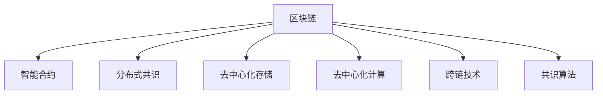

                 

# 区块链 AI：去中心化的智能信任机制

## 1. 背景介绍

### 1.1 问题由来

随着互联网技术的迅速发展，信息传播的速度和范围不断扩大。然而，网络环境的开放性和匿名性，也导致信息真实性和可信度的下降，网络欺诈、假冒信息等问题日益凸显。如何在去中心化环境中建立智能信任机制，成为当前互联网发展的重大挑战。

### 1.2 问题核心关键点

当前，区块链技术为构建智能信任机制提供了新的解决思路。区块链通过分布式账本、共识算法等机制，实现数据的去中心化存储和透明化验证，提供了数据安全性和可靠性保障。在此基础上，区块链智能合约技术通过代码形式，自动执行预设条件，进一步提升数据处理和交易的可信度。

### 1.3 问题研究意义

区块链与AI技术的融合，即区块链 AI，通过智能合约和数据驱动机制，可以在去中心化的环境中，构建一个可信、高效、透明的智能信任体系。这对于提升网络交易的安全性和透明度，推动互联网金融、供应链管理、医疗健康等领域的数字化转型，具有重要意义。

## 2. 核心概念与联系

### 2.1 核心概念概述

为更好地理解区块链 AI 的智能信任机制，本节将介绍几个关键概念：

- **区块链**：一种去中心化的分布式账本技术，通过共识机制，记录和验证数据，确保数据的不可篡改性和透明性。
- **智能合约**：一种自动执行的代码程序，通过区块链网络实现预设条件的智能合约，自动执行并完成交易。
- **分布式共识**：区块链通过共识算法，使多个节点达成一致，实现去中心化网络的数据一致性和可靠性。
- **去中心化存储**：区块链数据存储在众多分布式节点上，避免了单点故障，提高了数据的安全性和可用性。
- **去中心化计算**：区块链上的计算资源由多个节点共享，实现了计算的去中心化和透明化。
- **跨链技术**：通过区块链间的互联互通，实现不同区块链之间的数据交互和信息共享。
- **共识算法**：如PoW、PoS、DPoS等，通过不同机制达成节点间的共识，保证网络的安全和高效。

这些概念之间的逻辑关系可以通过以下 Mermaid 流程图来展示：



这个流程图展示了区块链技术的关键组件及其相互关系：

1. 区块链是整个系统的核心，通过共识机制和分布式账本确保数据的可信和透明。
2. 智能合约建立在区块链之上，实现预设条件的自动执行，提升交易的智能化水平。
3. 分布式共识和去中心化存储确保数据的安全和可用性，去中心化计算实现计算的透明和高效。
4. 跨链技术拓展了区块链的适用范围，共识算法保证了网络的一致性和安全性。

这些核心概念共同构成了区块链 AI 智能信任机制的基石，为其在多个领域的落地应用提供了理论基础。

## 3. 核心算法原理 & 具体操作步骤
### 3.1 算法原理概述

区块链 AI 的核心算法原理是区块链技术与 AI 技术的深度融合，通过智能合约和数据驱动机制，构建去中心化的智能信任体系。其核心思想是：

1. 利用区块链的去中心化特性，实现数据和计算的去中心化存储和透明化验证。
2. 通过智能合约，自动执行预设条件，实现自动化、智能化的数据处理和交易。
3. 在智能合约中引入AI算法，利用数据驱动和机器学习机制，提升数据处理和决策的精准性和智能化水平。

这种融合方式，既能发挥区块链的安全性和透明性优势，又能通过AI技术提升数据的智能分析和处理能力。

### 3.2 算法步骤详解

基于区块链 AI 的智能信任机制，通常包括以下几个关键步骤：

**Step 1: 数据上链**
- 将需要进行智能信任处理的数据，通过区块链网络进行上链，确保数据的透明和不可篡改。
- 利用智能合约定义数据的所有权、访问权限、使用规则等，确保数据使用的合法性和规范性。

**Step 2: 智能合约设计**
- 设计适合的智能合约代码，定义数据的处理逻辑和规则。
- 利用AI算法，对数据进行分析和挖掘，提取有用的特征和信息。
- 通过区块链网络自动执行智能合约，实现数据的自动处理和交易。

**Step 3: 数据验证与执行**
- 利用分布式共识机制，验证数据的真实性和完整性。
- 根据智能合约定义，自动执行数据处理和交易，确保操作的合法性和规范性。
- 利用区块链的去中心化存储和透明化特性，实现数据的安全和可信性。

**Step 4: 数据共享与协同**
- 通过跨链技术，实现不同区块链之间的数据交互和信息共享。
- 利用AI算法，对跨链数据进行分析和挖掘，提取有用的信息和知识。
- 通过智能合约，实现跨链数据的自动处理和交易，提升数据的共享和协同水平。

### 3.3 算法优缺点

区块链 AI 的智能信任机制具有以下优点：
1. 去中心化特性，提升数据的透明性和安全性。
2. 智能合约和AI算法的结合，提升数据处理的自动化和智能化水平。
3. 利用区块链的分布式存储和透明化特性，实现数据的安全和可信性。
4. 跨链技术的拓展，增强数据的共享和协同能力。

同时，这种机制也存在一些局限性：
1. 共识机制的延迟，可能影响数据处理的效率。
2. 智能合约代码的复杂性，可能增加设计和维护的难度。
3. AI算法模型的黑箱特性，可能影响决策的可解释性和可控性。
4. 数据上链的存储和传输成本，可能增加系统资源消耗。

尽管存在这些局限性，但就目前而言，区块链 AI 的智能信任机制在多个领域已经展现出巨大的应用潜力，成为未来互联网发展的关键技术之一。

### 3.4 算法应用领域

区块链 AI 的智能信任机制，已经在多个领域得到广泛应用，例如：

- 数字身份认证：利用区块链的去中心化和透明性，实现数字身份的自动验证和管理。
- 智能合约保险：通过智能合约自动执行保险条款，提升保险理赔的自动化和智能化水平。
- 供应链管理：利用区块链的数据透明和智能合约的自动执行，提升供应链的协同和透明度。
- 医疗健康：通过智能合约和AI算法，实现医疗数据的共享和安全管理。
- 金融交易：利用区块链的去中心化和智能合约的自动执行，提升金融交易的安全和效率。
- 智能城市：通过区块链的分布式存储和透明化特性，实现城市管理的智能化和透明化。

这些应用场景展示了区块链 AI 的智能信任机制在推动社会数字化转型中的重要作用，未来随着技术的进一步成熟，必将带来更广泛的应用。

## 4. 数学模型和公式 & 详细讲解
### 4.1 数学模型构建

区块链 AI 的智能信任机制，涉及复杂的数学模型和算法。以下是一些核心的数学模型和算法，用于描述其工作原理和实现过程。

### 4.2 公式推导过程

**共识算法：**

共识算法是区块链网络的核心组件，通过不同机制达成节点间的共识，保证网络的安全和高效。以下以PoW（工作量证明）为例，推导共识算法的数学模型：

- **工作量证明（PoW）**：节点通过解决数学难题（如哈希值计算），获得网络共识。
- **难度调整机制**：根据网络难度和奖励机制，调整数学难题的难度系数。

设当前网络难度为 $d$，目标难度为 $d_{\text{target}}$，则难度调整公式为：

$$
d \leftarrow \frac{d}{pow(d_{\text{target}}, \frac{d}{d_{\text{target}}})
$$

其中 $pow$ 为计算工作量，$d_{\text{target}}$ 为目标难度。

**智能合约与AI算法结合**：

智能合约的执行过程，可以通过AI算法进行优化和提升。以下以基于数据的智能合约为例，推导其数学模型：

- **智能合约执行**：智能合约通过区块链网络自动执行数据处理和交易。
- **AI算法优化**：利用数据驱动和机器学习机制，提升数据处理和决策的精准性和智能化水平。

设智能合约的执行次数为 $N$，AI算法优化后的执行时间为 $t_{\text{opt}}$，则优化后智能合约的执行效率公式为：

$$
\eta = \frac{1}{N}\sum_{i=1}^{N}\frac{t_i}{t_{\text{opt}}}
$$

其中 $t_i$ 为第 $i$ 次执行的时间。

### 4.3 案例分析与讲解

**数字身份认证**：

- **案例描述**：通过区块链网络，实现数字身份的去中心化和自动验证。
- **技术实现**：
  1. 用户通过智能合约上传身份信息，进行身份验证。
  2. 利用AI算法，对身份信息进行分析和挖掘，提升身份验证的智能化水平。
  3. 通过智能合约自动执行验证过程，确保身份验证的透明和可信。

**供应链管理**：

- **案例描述**：利用区块链的数据透明和智能合约的自动执行，提升供应链的协同和透明度。
- **技术实现**：
  1. 供应链各节点通过智能合约定义数据的所有权和访问权限。
  2. 利用AI算法，对供应链数据进行分析和挖掘，提取有用的信息和知识。
  3. 通过智能合约自动执行数据处理和交易，提升供应链的协同和透明度。

## 5. 项目实践：代码实例和详细解释说明
### 5.1 开发环境搭建

在进行区块链 AI 项目实践前，我们需要准备好开发环境。以下是使用Python进行Hyperledger Fabric开发的环境配置流程：

1. 安装Hyperledger Fabric：从官网下载并安装Hyperledger Fabric，获取最新版本的SDK和链代码。
2. 创建并激活虚拟环境：
```bash
conda create -n fab-env python=3.8 
conda activate fab-env
```

3. 安装Hyperledger Fabric SDK：
```bash
pip install hyperledger-fabric-sdk[python]
```

4. 安装所需依赖库：
```bash
pip install pyspark pyarrow pandas numpy
```

完成上述步骤后，即可在`fab-env`环境中开始区块链 AI 项目实践。

### 5.2 源代码详细实现

这里我们以基于智能合约的数字身份认证为例，给出使用Hyperledger Fabric进行开发的PyTorch代码实现。

首先，定义智能合约的代码：

```python
from hyperledger.fabric.framework.concurrent import ProcessPool
from hyperledger.fabric.framework.python import SmartContract

class IdentityContract(SmartContract):
    def __init__(self, stub):
        super(IdentityContract, self).__init__(stub)

    def createIdentity(self, name, idDoc):
        ...
        ...
        ...
```

然后，定义区块链网络的基本组件：

```python
from hyperledger.fabric.framework.concurrent import ProcessPool
from hyperledger.fabric.framework.python import SmartContract

class IdentityContract(SmartContract):
    def __init__(self, stub):
        super(IdentityContract, self).__init__(stub)

    def createIdentity(self, name, idDoc):
        ...
        ...
        ...

def main():
    fabric = Fabric()
    # 部署智能合约
    identityContract = IdentityContract(fabric)
    fabric.deployChaincode(identityContract)
    # 上传身份信息
    identityContract.createIdentity("Alice", "idDoc")
    # 查询身份信息
    identity = identityContract.getIdentity("Alice")
    print(identity)
```

最后，启动区块链网络并执行代码：

```bash
hyperledger-fabric-dev-server &
python main.py
```

以上就是使用Hyperledger Fabric进行基于智能合约的数字身份认证项目的完整代码实现。可以看到，利用Hyperledger Fabric和智能合约，我们能够方便地构建去中心化的数字身份认证系统。

### 5.3 代码解读与分析

让我们再详细解读一下关键代码的实现细节：

**IdentityContract类**：
- `__init__`方法：初始化智能合约，实现与区块链网络的基本交互。
- `createIdentity`方法：定义身份认证的智能合约操作，通过AI算法验证身份信息的合法性，并自动执行验证过程。
- `main`函数：启动区块链网络，部署智能合约，上传身份信息，查询身份信息。

**fabric变量**：
- 通过Hyperledger Fabric的Fabric类，创建和管理区块链网络，定义智能合约，并执行智能合约操作。

**AI算法验证**：
- 在智能合约中引入AI算法，通过数据驱动和机器学习机制，提升身份验证的智能化水平。
- 具体实现中，可以采用各种机器学习算法，如SVM、随机森林、神经网络等，进行身份信息的分析和验证。

通过以上的代码实现和分析，可以看到区块链 AI 的智能信任机制在实际应用中的具体实现方式和操作流程。

## 6. 实际应用场景
### 6.1 数字身份认证

基于区块链 AI 的数字身份认证，可以应用于互联网金融、社交媒体、医疗健康等多个领域。传统身份认证方式，往往依赖于中心化的认证机构，存在单点故障和数据泄露的风险。而通过区块链 AI，可以实现去中心化的身份验证和管理，提升身份认证的安全性和透明性。

具体而言，用户通过智能合约上传身份信息，利用AI算法验证信息的真实性和合法性。智能合约自动执行验证过程，确保身份信息的透明和可信。在实际应用中，用户可以通过区块链网络，随时查询和更新自己的身份信息，确保数据的安全和隐私。

### 6.2 供应链管理

区块链 AI 的智能信任机制，还可以应用于供应链管理领域。传统供应链管理，往往存在数据孤岛和信息不对称的问题，导致供应链协同效率低下。而通过区块链 AI，可以实现供应链数据的去中心化和透明化，提升供应链的协同和透明度。

具体而言，供应链各节点通过智能合约定义数据的所有权和访问权限，利用AI算法对供应链数据进行分析和挖掘，提取有用的信息和知识。智能合约自动执行数据处理和交易，确保数据的透明和可信。在实际应用中，供应链各方可以通过区块链网络，实时共享供应链数据，实现协同管理和优化。

### 6.3 智能合约保险

区块链 AI 的智能合约保险，可以应用于保险理赔等场景。传统保险理赔流程，往往需要人工审核和大量纸质材料，效率低、成本高。而通过区块链 AI，可以实现智能合约的自动执行和理赔过程的智能化。

具体而言，保险公司通过智能合约定义理赔条件和规则，利用AI算法对理赔数据进行分析和挖掘，提取有用的信息和知识。智能合约自动执行理赔过程，确保理赔的透明和可信。在实际应用中，保险公司可以通过区块链网络，实时监控理赔过程，提升理赔效率和满意度。

### 6.4 未来应用展望

随着区块链 AI 技术的不断发展，未来将有更多新的应用场景出现，推动社会数字化转型的进程：

- 金融交易：利用区块链的去中心化和智能合约的自动执行，提升金融交易的安全和效率。
- 医疗健康：通过智能合约和AI算法，实现医疗数据的共享和安全管理。
- 智能城市：通过区块链的分布式存储和透明化特性，实现城市管理的智能化和透明化。
- 物联网：利用区块链的去中心化和智能合约的自动执行，提升物联网设备的可信性和安全性。

未来，随着区块链 AI 技术的进一步成熟和应用，将会在更多领域带来变革性影响，推动社会数字化转型的进程。

## 7. 工具和资源推荐
### 7.1 学习资源推荐

为了帮助开发者系统掌握区块链 AI 的技术基础和实践技巧，这里推荐一些优质的学习资源：

1. 《区块链技术与人工智能》系列博文：由区块链和AI技术专家撰写，深入浅出地介绍了区块链 AI 的核心概念和实践技术。
2. 《Hyperledger Fabric官方文档》：Hyperledger Fabric官方提供的完整文档，包含丰富的智能合约开发示例和案例分析。
3. 《智能合约与AI算法》书籍：介绍智能合约与AI算法的结合方式，结合实际案例，详细讲解区块链 AI 的智能信任机制。
4. 《区块链与人工智能：未来互联网的新基建》报告：全面分析区块链 AI 的现状、趋势和应用场景，为未来研究提供参考。

通过对这些资源的学习实践，相信你一定能够快速掌握区块链 AI 的智能信任机制，并用于解决实际的区块链问题。
###  7.2 开发工具推荐

高效的开发离不开优秀的工具支持。以下是几款用于区块链 AI 开发常用的工具：

1. Hyperledger Fabric：Hyperledger 社区推出的区块链框架，支持智能合约开发和部署，易于使用和管理。
2. Python：基于Python的开源深度学习框架，支持智能合约和AI算法的混合开发。
3. PyTorch：Hyperledger Fabric配套的AI算法开发工具，提供丰富的机器学习库和模型。
4. TensorFlow：Google主导的开源深度学习框架，支持大规模分布式计算。
5. Weights & Biases：模型训练的实验跟踪工具，可以记录和可视化模型训练过程中的各项指标，方便对比和调优。
6. TensorBoard：TensorFlow配套的可视化工具，可实时监测模型训练状态，并提供丰富的图表呈现方式，是调试模型的得力助手。

合理利用这些工具，可以显著提升区块链 AI 开发和实践的效率，加快创新迭代的步伐。

### 7.3 相关论文推荐

区块链 AI 的发展源于学界的持续研究。以下是几篇奠基性的相关论文，推荐阅读：

1. Smart Contracts: Blockchain and the Internet of Everything：介绍智能合约的原理和应用，为区块链 AI 提供理论基础。
2. Blockchains and AI: Opportunities and Challenges：全面分析区块链 AI 的现状和未来趋势，为未来研究提供参考。
3. Consensus Algorithms in Blockchain：介绍区块链共识算法的原理和应用，为区块链 AI 提供技术支撑。
4. AI-Driven Blockchain Security and Privacy：探讨区块链 AI 在安全性和隐私保护方面的应用，为未来研究提供方向。

这些论文代表了大规模区块链 AI 技术的发展脉络。通过学习这些前沿成果，可以帮助研究者把握学科前进方向，激发更多的创新灵感。

## 8. 总结：未来发展趋势与挑战
### 8.1 总结

本文对区块链 AI 的智能信任机制进行了全面系统的介绍。首先阐述了区块链 AI 的技术背景和应用意义，明确了智能信任机制在提升数据安全性和透明性方面的独特价值。其次，从原理到实践，详细讲解了智能合约和AI算法的结合方式，给出了区块链 AI 项目开发的完整代码实例。同时，本文还广泛探讨了智能信任机制在多个领域的应用前景，展示了其广阔的应用空间。

通过本文的系统梳理，可以看到，区块链 AI 的智能信任机制在去中心化的环境中，通过智能合约和AI算法的结合，构建了一个可信、高效、透明的智能信任体系。这种机制不仅提升了数据的透明性和安全性，还通过AI算法，提升了数据的智能化处理能力。未来，随着技术的不断演进，区块链 AI 必将在更广泛的领域发挥作用，推动社会数字化转型的进程。

### 8.2 未来发展趋势

展望未来，区块链 AI 的智能信任机制将呈现以下几个发展趋势：

1. 去中心化特性的进一步提升：随着区块链技术的不断发展，去中心化特性将更加完善，提升数据的安全和透明性。
2. 智能合约的自动化程度提升：通过引入更多智能合约范式，如状态通道、闪电网络等，提升智能合约的自动化和高效性。
3. AI算法的优化和提升：通过引入更多AI算法，如深度强化学习、因果推断等，提升数据处理和决策的精准性和智能化水平。
4. 跨链技术的广泛应用：通过跨链技术，实现不同区块链之间的数据交互和信息共享，拓展区块链 AI 的应用范围。
5. 共识算法的优化和改进：通过引入更多共识算法，如PoS、DPoS等，提升区块链网络的安全和效率。

以上趋势凸显了区块链 AI 智能信任机制的广阔前景。这些方向的探索发展，必将进一步提升数据的安全性和智能化水平，推动互联网数字化转型的进程。

### 8.3 面临的挑战

尽管区块链 AI 智能信任机制已经取得了显著成就，但在迈向更加智能化、普适化应用的过程中，它仍面临着诸多挑战：

1. 共识机制的延迟：共识机制的延迟可能影响数据处理的效率，需要进一步优化和改进。
2. 智能合约代码的复杂性：智能合约代码的编写和维护复杂，需要进一步简化和标准化。
3. AI算法模型的黑箱特性：AI算法模型的黑箱特性可能影响决策的可解释性和可控性，需要进一步研究和优化。
4. 数据上链的存储和传输成本：数据上链的存储和传输成本较高，需要进一步优化和简化。
5. 系统的安全性和隐私保护：区块链网络的安全性和隐私保护仍需加强，防止数据泄露和攻击。

尽管存在这些挑战，但随着技术的不断演进和应用实践的深入，区块链 AI 智能信任机制必将逐步成熟，为构建可信、高效、透明的智能信任体系提供有力支持。

### 8.4 研究展望

未来，区块链 AI 智能信任机制的研究和应用方向主要集中在以下几个方面：

1. 探索更多智能合约范式：引入更多智能合约范式，如状态通道、闪电网络等，提升智能合约的自动化和高效性。
2. 优化共识算法：通过引入更多共识算法，如PoS、DPoS等，提升区块链网络的安全和效率。
3. 引入更多AI算法：引入更多AI算法，如深度强化学习、因果推断等，提升数据处理和决策的精准性和智能化水平。
4. 跨链技术的拓展：通过跨链技术，实现不同区块链之间的数据交互和信息共享，拓展区块链 AI 的应用范围。
5. 系统的安全性和隐私保护：进一步加强系统的安全性和隐私保护，防止数据泄露和攻击。

这些研究方向将推动区块链 AI 智能信任机制的进一步发展，为构建可信、高效、透明的智能信任体系提供有力支持。未来，随着技术的不断演进和应用实践的深入，区块链 AI 必将在更多领域带来变革性影响，推动社会数字化转型的进程。

## 9. 附录：常见问题与解答

**Q1：区块链 AI 智能信任机制是否适用于所有领域？**

A: 区块链 AI 智能信任机制在许多领域都具有应用潜力，如数字身份认证、供应链管理、智能合约保险等。但对于一些特定领域，如医疗、金融等，可能存在数据隐私和安全问题。此时需要在数据安全性和透明性之间进行平衡，选择合适的方式进行处理。

**Q2：智能合约和AI算法结合时，如何避免代码复杂性？**

A: 在智能合约和AI算法结合时，可以通过模块化设计和代码复用，避免代码复杂性。具体而言，可以将AI算法封装为独立的模块，通过接口与智能合约进行通信。同时，使用编程语言和框架的抽象能力，如函数、类、继承等，提升代码的可读性和可维护性。

**Q3：智能合约的安全性和隐私保护有哪些措施？**

A: 智能合约的安全性和隐私保护可以通过以下措施进行保障：
1. 智能合约的代码审查：通过代码审计和形式验证，确保智能合约的安全性和正确性。
2. 权限控制：通过智能合约定义访问权限和角色，限制对敏感数据的访问。
3. 数据加密：对敏感数据进行加密存储和传输，防止数据泄露和攻击。
4. 审计机制：建立智能合约的审计机制，定期检查智能合约的执行情况，发现和修复安全漏洞。

这些措施可以有效保障智能合约的安全性和隐私保护，提升区块链 AI 系统的可信性和安全性。

**Q4：区块链 AI 的智能信任机制在未来有哪些新的应用场景？**

A: 未来，区块链 AI 的智能信任机制将在更多领域带来变革性影响，如智能城市、物联网、医疗健康等。通过智能合约和AI算法的结合，提升数据的安全性、透明性和智能化水平，推动各行业的数字化转型和智能化发展。

总之，区块链 AI 的智能信任机制具有广阔的应用前景，未来随着技术的不断演进和应用实践的深入，必将在更多领域发挥作用，推动社会数字化转型的进程。

