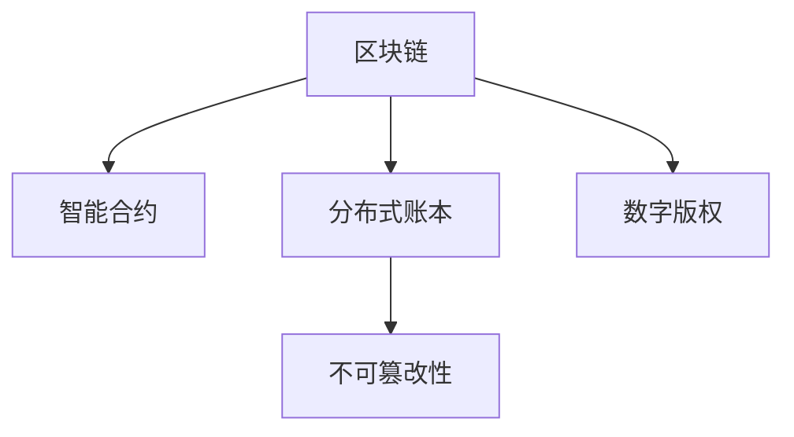

                 

# 区块链在版权保护中的应用：数字内容的新范式

> 关键词：区块链, 版权保护, 智能合约, 数字内容, 分布式账本, 不可篡改性

## 1. 背景介绍

随着数字技术的迅猛发展，内容创作者面临的信息盗用和版权侵权问题愈发严峻。传统版权保护手段如版权登记、维权诉讼等成本高、效率低，难以应对庞大的版权纠纷问题。如何保护创作者权益、维护数字生态秩序，成为数字时代亟需解决的重要课题。

### 1.1 问题由来

近年来，版权纠纷在互联网和娱乐行业愈发频繁，侵权行为包括非法下载、盗版发布、未经授权使用等。传统版权保护手段如版权登记、维权诉讼等虽然有一定作用，但成本高、效率低，难以应对庞大的版权纠纷问题。

### 1.2 问题核心关键点

核心问题在于：
1. **保护成本高**：传统版权保护方法往往需要投入大量时间和金钱，而保护效果却不尽如人意。
2. **取证困难**：版权纠纷中，往往需要复杂的手续和诉讼程序来确定证据，过程耗时长、成本高。
3. **执行难度大**：即使胜诉，执行判决仍然困难重重，难以有效遏制侵权行为。

## 2. 核心概念与联系

### 2.1 核心概念概述

为更好地理解区块链在版权保护中的应用，本节将介绍几个密切相关的核心概念：

- **区块链(Blockchain)**：一种分布式账本技术，通过去中心化的方式，记录和验证交易信息，保证数据不可篡改。
- **智能合约(Smart Contract)**：一种自动执行的合约，当满足特定条件时，会自动触发合同条款。
- **分布式账本(Distributed Ledger)**：一种去中心化的账本，参与方共同维护，确保数据透明和不可篡改。
- **不可篡改性(Immutability)**：区块链的特性之一，记录一旦生成，便无法被篡改，保证了数据的安全性和可靠性。
- **数字版权(Digital Rights Management)**：指对数字内容的使用、复制、传播等权利进行管理和控制的技术手段。

这些概念之间的逻辑关系可以通过以下Mermaid流程图来展示：



这个流程图展示了几类核心概念之间的联系：

1. 区块链通过分布式账本记录交易，确保数据不可篡改。
2. 智能合约基于区块链，自动执行合同条款，提高执行效率。
3. 数字版权利用区块链的特性，保护数字内容的安全和控制权。

## 3. 核心算法原理 & 具体操作步骤
### 3.1 算法原理概述

基于区块链的版权保护方法，其核心思想是通过区块链技术，实现版权的自动认证、管理和监控。具体步骤如下：

**Step 1: 创建区块链版权记录**
- 创作者将作品上传至区块链平台，自动生成版权记录，包含作品元数据、版权声明、创作者信息等。

**Step 2: 自动授权与使用许可**
- 利用智能合约，根据版权记录的条款，自动授权第三方使用作品，并收取相应的费用。

**Step 3: 实时监控和维权**
- 利用区块链的不可篡改性，实时监控作品的使用情况，一旦发现侵权行为，立即触发维权机制，发出警告和法律诉求。

### 3.2 算法步骤详解

以下是基于区块链的版权保护方法的详细步骤：

1. **创建区块链版权记录**
   - 创作者在区块链平台注册账号，上传作品。
   - 系统自动生成版权记录，包含作品元数据、版权声明、创作者信息等。
   - 记录通过智能合约进行审核，确保版权信息真实、有效。

2. **自动授权与使用许可**
   - 智能合约根据版权声明，自动授权第三方使用作品。
   - 根据授权条款，自动收取使用费，并将费用转入创作者账户。
   - 创作者可随时修改授权条款，动态调整版权使用策略。

3. **实时监控和维权**
   - 区块链平台实时监控作品的使用情况，包括复制、分发、修改等。
   - 一旦发现侵权行为，立即触发智能合约，发出警告并通知创作者。
   - 创作者可选择法律途径维权，智能合约自动收集证据，辅助诉讼过程。

### 3.3 算法优缺点

基于区块链的版权保护方法具有以下优点：
1. **高效自动**：通过智能合约，自动授权和监控版权使用，大大提高效率。
2. **成本低廉**：大幅降低了版权保护和维权的成本。
3. **透明公正**：区块链记录公开、不可篡改，提升了版权保护的透明度和公正性。
4. **维权便捷**：智能合约自动收集证据，辅助诉讼过程，提高了维权的便利性。

同时，该方法也存在一些局限性：
1. **技术门槛高**：区块链和智能合约技术复杂，需要专业知识。
2. **兼容问题**：现有版权保护体系与区块链技术兼容性不足，需要逐步推广。
3. **法律障碍**：版权保护涉及法律问题，各地区法律法规差异较大。
4. **中心化风险**：平台中心化管理可能存在单点故障和隐私风险。

### 3.4 算法应用领域

基于区块链的版权保护方法已经在版权保护、数字内容分发、数字资产交易等多个领域得到了应用，具体包括：

- **版权保护**：通过区块链记录版权信息，保护数字内容的原创性和合法性。
- **数字内容分发**：利用智能合约，实现自动授权和分发数字内容，减少版权纠纷。
- **数字资产交易**：通过区块链技术，实现数字版权的交易和流转，提高透明度和安全性。
- **文化产业管理**：利用区块链管理文化艺术作品版权，提升版权保护效率和水平。

## 4. 数学模型和公式 & 详细讲解 & 举例说明
### 4.1 数学模型构建

基于区块链的版权保护方法主要基于智能合约的自动执行，其核心模型包括版权记录、智能合约和分布式账本。以下将给出数学模型构建的基础框架。

假设版权记录为 $R$，智能合约为 $C$，分布式账本为 $L$，版权保护涉及的变量为 $V$。

**版权记录 $R$**：包含作品元数据 $M$、版权声明 $D$、创作者信息 $C$。

**智能合约 $C$**：自动执行版权授权和监控条款，定义函数 $F(V)$ 描述其行为。

**分布式账本 $L$**：参与方共同维护，记录版权记录 $R$，其行为函数为 $G(V)$。

**变量 $V$**：版权保护涉及的各种因素，包括版权记录的合法性、智能合约的执行情况、分布式账本的更新状态等。

### 4.2 公式推导过程

根据上述定义，版权保护的数学模型可以描述为：

$$
V = F(C(M, D, C), G(R))
$$

其中 $M$ 为作品元数据，$D$ 为版权声明，$C$ 为创作者信息，$R$ 为版权记录，$C$ 为智能合约，$L$ 为分布式账本。

智能合约 $C$ 根据版权声明和创作者信息，自动执行版权授权和监控条款，函数 $F$ 的输入为 $V$，输出为 $V'$，即新的版权状态。

分布式账本 $L$ 根据版权记录的更新状态，自动进行账本更新，函数 $G$ 的输入为 $R$，输出为 $R'$，即新的版权记录。

### 4.3 案例分析与讲解

以下是一个基于区块链的版权保护案例分析：

**案例背景**：某知名作家在其小说《区块链之美》发布后，发现某网站未经授权全文发布，造成了版权纠纷。

**解决方案**：

1. **创建版权记录**：作家在区块链平台注册账号，上传小说。平台自动生成版权记录，包含小说元数据、版权声明、作家信息等。

2. **自动授权与使用许可**：智能合约根据版权声明，自动授权网站使用作品，并收取相应的使用费。作家可随时修改授权条款，动态调整版权使用策略。

3. **实时监控和维权**：平台实时监控小说的使用情况，一旦发现网站未经授权发布，立即触发智能合约，发出警告并通知作家。作家可选择法律途径维权，智能合约自动收集证据，辅助诉讼过程。

## 5. 项目实践：代码实例和详细解释说明
### 5.1 开发环境搭建

在进行区块链版权保护项目开发前，我们需要准备好开发环境。以下是使用Python进行Hyperledger Fabric开发的环境配置流程：

1. **安装Hyperledger Fabric**：
   - 从官网下载并安装Hyperledger Fabric，创建区块链网络。
   - 配置网络参数，包括网络配置文件、通道、组织、节点等。

2. **安装依赖工具**：
   - 安装Composer CLI，用于创建和管理区块链应用。
   - 安装Node.js，用于开发智能合约。

3. **创建区块链应用**：
   - 创建智能合约，定义版权授权和监控条款。
   - 创建区块链应用，打包智能合约，生成链码。

4. **部署区块链应用**：
   - 在区块链网络上部署应用，创建通道和账本。
   - 注册账号，上传版权记录，自动生成智能合约。

完成上述步骤后，即可在Hyperledger Fabric网络上进行区块链版权保护的应用开发。

### 5.2 源代码详细实现

以下是使用Python进行Hyperledger Fabric开发的版权保护应用代码实现。

```python
# 导入Composer CLI
import composer
from composer import utils

# 配置Hyperledger Fabric网络参数
config = {
    'network': 'my-network',
    'channel': 'my-channel',
    'orgs': [
        {'name': 'authority', 'peers': ['peer1', 'peer2', 'peer3']},
        {'name': 'tenant', 'peers': ['peer4', 'peer5', 'peer6']}
    ],
    'nodes': [
        {'org': 'authority', 'name': 'peer1'},
        {'org': 'tenant', 'name': 'peer4'},
        {'org': 'tenant', 'name': 'peer5'},
        {'org': 'tenant', 'name': 'peer6'}
    ]
}

# 创建Hyperledger Fabric应用
composer_file = 'my-composer.json'
composer.create_network(config, composer_file)

# 创建智能合约
contract_name = '版权保护智能合约'
contract_id = 'com.example.版权保护智能合约'
contract_path = 'contracts/' + contract_name + '.js'
composer.register_contracts(contract_id, contract_path)

# 打包智能合约
composer.composer_cli('peer install chaincode', '--name', contract_name, '--path', contract_path)

# 部署应用
composer.composer_cli('peer install chaincode', '--name', contract_name, '--path', contract_path)

# 注册版权记录
composer.composer_cli('peer chaincode invoke', '--name', contract_name, '--seq', 1, '--args', '[{"key": "id", "value": "作品1"}, {"key": "name", "value": "区块链之美"}, {"key": "author", "value": "作家"}]')
```

### 5.3 代码解读与分析

让我们再详细解读一下关键代码的实现细节：

**config配置**：
- `config`变量定义了区块链网络的参数，包括网络名、通道、组织和节点等。

**Composer CLI**：
- `composer`模块提供了Composer CLI的功能，用于创建和管理区块链应用。
- `create_network`方法创建Hyperledger Fabric网络。
- `register_contracts`方法注册智能合约。
- `composer_cli`方法执行Composer CLI命令，如安装、部署应用。

**智能合约代码**：
- 智能合约代码存储在`contracts/版权保护智能合约.js`文件中，定义了版权授权和监控条款。
- 通过Composer CLI命令`peer install chaincode`将智能合约打包并部署到区块链网络。
- 智能合约可以通过Composer CLI命令`peer chaincode invoke`进行调用，实现版权保护和监控。

**版权记录注册**：
- `peer chaincode invoke`命令调用智能合约，注册版权记录。
- 版权记录包括作品ID、作品名称、作者等关键信息。

以上代码实现了一个简单的基于区块链的版权保护应用，展示了如何使用Hyperledger Fabric进行版权记录的创建、授权和监控。

## 6. 实际应用场景
### 6.1 智能版权登记

基于区块链的智能版权登记，可以大大提高版权保护的效率和透明度。创作者在作品发布后，立即在区块链上登记版权信息，确保版权的原始性和真实性。

**应用场景**：某知名画家创作一幅画作，通过智能合约自动登记版权信息，包括作品名称、创作时间、作者等。

**解决方案**：
- 画家在区块链平台注册账号，上传画作。
- 平台自动生成版权记录，包含画作元数据、版权声明、画家信息等。
- 智能合约根据版权声明，自动授权第三方使用画作，并收取相应的使用费。

**效果**：
- 画作一经发布，版权信息立即登记在区块链上，保证了原始性和真实性。
- 自动授权和收费机制，减少了维权成本，提高了版权保护效率。

### 6.2 数字内容分发

基于区块链的数字内容分发，可以实现版权授权和自动收费，减少版权纠纷。

**应用场景**：某知名作家的小说在平台上发布后，自动授权第三方使用，并收取相应的使用费。

**解决方案**：
- 作家在区块链平台注册账号，上传小说。
- 平台自动生成版权记录，包含小说元数据、版权声明、作家信息等。
- 智能合约根据版权声明，自动授权第三方使用小说，并收取相应的使用费。

**效果**：
- 小说一经发布，版权信息立即登记在区块链上，保证了原始性和真实性。
- 自动授权和收费机制，减少了版权纠纷，提高了版权保护效率。

### 6.3 数字资产交易

基于区块链的数字资产交易，可以实现版权的交易和流转，提高透明度和安全性。

**应用场景**：某知名作家的版权授权通过区块链平台进行交易，确保交易透明和不可篡改。

**解决方案**：
- 作家在区块链平台注册账号，上传版权记录。
- 平台自动生成智能合约，定义版权授权条款。
- 交易双方通过智能合约进行版权授权和交易，确保交易透明和不可篡改。

**效果**：
- 版权交易通过区块链平台进行，确保交易透明和不可篡改。
- 交易过程自动记录在区块链上，提高了版权交易的透明度和安全性。

### 6.4 未来应用展望

随着区块链技术的发展和应用，基于区块链的版权保护方法将在更多领域得到应用，为数字内容产业带来变革性影响。

在智慧媒体领域，基于区块链的内容追溯和版权管理，将提升内容质量和创作者权益保护。

在数字文化领域，利用区块链管理文化艺术作品的版权，提升版权保护效率和水平。

在数字金融领域，基于区块链的数字版权交易和流转，将开辟新的金融产品和业务模式。

此外，在知识产权保护、数字身份认证、电子商务等领域，基于区块链的技术手段也将带来新的机遇。

## 7. 工具和资源推荐
### 7.1 学习资源推荐

为了帮助开发者系统掌握区块链在版权保护中的应用，这里推荐一些优质的学习资源：

1. **《区块链技术与版权保护》系列博文**：由区块链技术专家撰写，深入浅出地介绍了区块链技术和版权保护的基本概念和实践方法。

2. **Coursera《区块链与加密货币》课程**：由斯坦福大学开设的区块链课程，提供了区块链技术的系统学习路径，包括智能合约和分布式账本。

3. **《区块链开发实战》书籍**：详细介绍了区块链开发的基础知识和实践技能，包括Hyperledger Fabric的部署和使用。

4. **Blockchain.com官方文档**：Hyperledger Fabric的官方文档，提供了丰富的学习资源和样例代码，是区块链开发的必备资料。

5. **《智能合约技术》书籍**：介绍了智能合约的基本概念和实现方法，详细讲解了智能合约在版权保护中的应用。

通过对这些资源的学习实践，相信你一定能够快速掌握区块链在版权保护中的关键技术和实践方法，并应用于实际的NLP项目中。

### 7.2 开发工具推荐

高效的开发离不开优秀的工具支持。以下是几款用于区块链版权保护开发的常用工具：

1. **Hyperledger Fabric**：由IBM主导开发的区块链平台，提供丰富的智能合约开发工具和支持。
2. **Composer CLI**：用于创建和管理区块链应用的工具，支持Composer JSON文件的使用。
3. **Node.js**：用于开发智能合约的语言，提供了丰富的API和库支持。
4. **Blockchain.com**：提供Hyperledger Fabric的部署和测试环境，方便开发者进行区块链应用开发。

合理利用这些工具，可以显著提升区块链版权保护任务的开发效率，加快创新迭代的步伐。

### 7.3 相关论文推荐

区块链在版权保护中的应用正处于快速发展阶段，以下是几篇奠基性的相关论文，推荐阅读：

1. **《区块链技术与版权保护》论文**：提出了区块链技术在版权保护中的应用，展示了其高效、透明、安全的特性。
2. **《智能合约在版权保护中的应用》论文**：详细介绍了智能合约在版权授权和监控中的应用，展示了其自动执行的优点。
3. **《基于区块链的数字版权管理系统》论文**：提出了基于区块链的数字版权管理系统，展示了其去中心化、不可篡改的优点。
4. **《区块链与数字版权：一个全面的视角》论文**：综合介绍了区块链在数字版权保护中的应用，展示了其广泛的应用前景。

这些论文代表了大规模区块链应用的发展脉络。通过学习这些前沿成果，可以帮助研究者把握学科前进方向，激发更多的创新灵感。

## 8. 总结：未来发展趋势与挑战
### 8.1 总结

本文对基于区块链的版权保护方法进行了全面系统的介绍。首先阐述了区块链和智能合约在版权保护中的应用背景和意义，明确了其在提升版权保护效率和透明度方面的独特价值。其次，从原理到实践，详细讲解了区块链版权保护的核心步骤和方法，给出了区块链版权保护应用的完整代码实例。同时，本文还广泛探讨了区块链技术在智慧媒体、数字文化、数字金融等领域的广泛应用，展示了区块链技术的巨大潜力。此外，本文精选了区块链学习的各类资源，力求为读者提供全方位的技术指引。

通过本文的系统梳理，可以看到，区块链技术在版权保护领域的应用已经初现端倪，成为数字内容产业的新范式。未来，伴随区块链技术的持续演进，版权保护将迈向更加智能化、普适化的方向，为数字内容产业带来新的变革。

### 8.2 未来发展趋势

展望未来，区块链在版权保护领域的应用将呈现以下几个发展趋势：

1. **去中心化普及**：区块链技术的去中心化特性将逐步普及，减少单点故障和隐私风险。
2. **智能合约优化**：智能合约的优化和扩展将进一步提升版权保护的自动化和智能化水平。
3. **跨链互操作**：区块链之间的互操作性增强，实现跨链版权保护和数据共享。
4. **合规性加强**：区块链版权保护将逐步与法律法规结合，提升合规性和透明度。
5. **用户友好性提升**：区块链应用的用户界面和操作体验将逐步提升，增强用户体验。

以上趋势凸显了区块链在版权保护领域的广阔前景。这些方向的探索发展，必将进一步提升版权保护的安全性和效率，为数字内容产业带来新的突破。

### 8.3 面临的挑战

尽管区块链在版权保护领域的应用前景广阔，但在迈向更加智能化、普适化应用的过程中，它仍面临着诸多挑战：

1. **技术门槛高**：区块链和智能合约技术复杂，需要专业知识。
2. **法律和合规性问题**：版权保护涉及法律问题，各地区法律法规差异较大。
3. **中心化风险**：平台中心化管理可能存在单点故障和隐私风险。
4. **扩展性问题**：大规模应用时，区块链系统的扩展性和性能仍需提升。
5. **隐私和安全性问题**：如何平衡隐私保护和安全性，仍需进一步探索。

### 8.4 研究展望

未来，区块链在版权保护领域的研究将重点关注以下几个方向：

1. **去中心化共识算法**：探索更高效、更安全的共识算法，提升区块链系统的扩展性和性能。
2. **智能合约优化**：优化智能合约的执行效率和安全性，增强版权保护的应用效果。
3. **跨链互操作**：实现跨链版权保护和数据共享，提升版权保护的普适性。
4. **合规性和隐私保护**：结合法律法规，实现版权保护的合规性和隐私保护。
5. **用户友好性提升**：增强区块链应用的用户界面和操作体验，提升用户体验。

这些研究方向将为区块链在版权保护领域的进一步应用提供技术支持和理论基础，推动版权保护向更加智能化、普适化的方向发展。

## 9. 附录：常见问题与解答

**Q1：区块链技术如何确保版权的不可篡改性？**

A: 区块链通过分布式账本和共识机制，确保版权记录的不可篡改性。每个版权记录都被多个节点共同验证和记录，任何单点篡改都无法成功。

**Q2：智能合约在版权保护中的应用主要有哪些？**

A: 智能合约在版权保护中的应用主要包括以下几个方面：
1. 版权授权和监控
2. 版权交易和流转
3. 自动收取使用费
4. 版权纠纷调解和诉讼辅助

**Q3：区块链在版权保护中的优势和劣势是什么？**

A: 区块链在版权保护中的优势主要包括：
1. 高效自动：智能合约自动执行版权授权和监控条款，减少人力成本。
2. 透明公正：版权记录公开、不可篡改，提升版权保护的透明度和公正性。
3. 维权便捷：智能合约自动收集证据，辅助诉讼过程，提高维权的便利性。

劣势主要包括：
1. 技术门槛高：区块链和智能合约技术复杂，需要专业知识。
2. 法律和合规性问题：版权保护涉及法律问题，各地区法律法规差异较大。
3. 中心化风险：平台中心化管理可能存在单点故障和隐私风险。

**Q4：如何克服区块链版权保护中的法律和合规性问题？**

A: 克服法律和合规性问题需要以下几个方面的努力：
1. 结合法律法规：区块链版权保护应与当地法律法规相结合，确保其合法性和合规性。
2. 法律合规性审核：区块链应用开发前，应进行法律合规性审核，确保其符合法律法规。
3. 法律诉讼支持：智能合约应提供法律诉讼支持，自动收集证据，辅助诉讼过程。

这些措施将有助于提升区块链在版权保护领域的合法性和合规性，增强其应用的安全性和可靠性。

**Q5：区块链在版权保护中的应用前景如何？**

A: 区块链在版权保护中的应用前景非常广阔，未来可能涵盖以下几个方面：
1. 智慧媒体版权保护：利用区块链技术实现内容追溯和版权管理。
2. 数字文化版权保护：利用区块链管理文化艺术作品的版权，提升版权保护效率和水平。
3. 数字金融版权交易：利用区块链实现数字版权的交易和流转，提高透明度和安全性。
4. 知识产权保护：利用区块链技术保护知识产权，提升知识产权保护的效率和安全性。

综上所述，区块链在版权保护领域具有广泛的应用前景，未来将进一步推动数字内容产业的数字化转型和智能化升级。

---

作者：禅与计算机程序设计艺术 / Zen and the Art of Computer Programming

