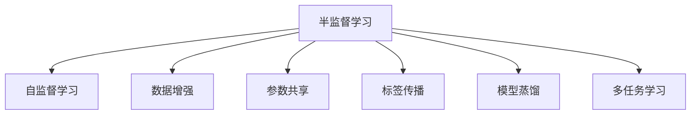

                 

# 半监督学习 (Semi-Supervised Learning) 原理与代码实例讲解

> 关键词：半监督学习, 数据标注, 模型训练, 参数优化, 数据增强, 统计学习理论, 神经网络

## 1. 背景介绍

### 1.1 问题由来
在机器学习和人工智能的各个领域中，半监督学习（Semi-Supervised Learning, SSL）作为介于监督学习和无监督学习之间的一种学习方法，日益受到研究者的关注。特别地，在自然语言处理（Natural Language Processing, NLP）、图像处理、语音识别等数据标注成本极高的领域，SSL提供了一种更高效、更灵活的数据利用方式，在保持高模型性能的同时，极大地降低了标注成本。

### 1.2 问题核心关键点
半监督学习通过在少量标注数据和大量未标注数据的基础上，利用先验知识或数据结构，提升模型的学习效果。SSL的核心思想是通过自监督学习、模型参数的强化训练、数据增强等技术，使得模型在标注数据量有限的情况下，仍能获得较高的泛化性能和准确率。

## 2. 核心概念与联系

### 2.1 核心概念概述

为更好地理解半监督学习的核心概念，本节将介绍几个密切相关的核心概念：

- 半监督学习（Semi-Supervised Learning, SSL）：介于监督学习和无监督学习之间的一种学习范式，通过少量标注数据和大量未标注数据进行训练，从而提升模型的泛化性能。

- 自监督学习（Self-Supervised Learning, SSL）：利用数据本身的结构信息，设计适当的预训练任务，使得模型能够无监督地从大量未标注数据中学习到有意义的表征。

- 数据增强（Data Augmentation）：通过对原始数据进行一系列随机变换，生成更多数据，扩大模型训练的数据集，提升模型的鲁棒性和泛化能力。

- 参数共享（Parameter Sharing）：在半监督学习中，模型参数可以在标注数据和未标注数据之间共享，以便从更多数据中提取通用的特征表示。

- 标签传播（Label Propagation）：利用未标注数据的先验知识，将标注数据的标签信息传递给未标注数据，从而辅助模型的学习。

- 模型蒸馏（Model Distillation）：通过在大型预训练模型和未标注数据上训练小模型，利用大模型的知识蒸馏给小模型，以提升小模型的性能。

这些核心概念之间的逻辑关系可以通过以下Mermaid流程图来展示：



这个流程图展示了大模型微调的逻辑结构：

1. 半监督学习通过少量标注数据和大量未标注数据进行训练。
2. 自监督学习利用数据本身的结构信息，使模型无监督地学习到表示。
3. 数据增强通过生成更多数据来扩展训练集。
4. 参数共享使得模型在标注数据和未标注数据之间共享参数。
5. 标签传播通过先验知识将标注标签传递给未标注数据。
6. 模型蒸馏利用大模型的知识对小模型进行蒸馏，提升性能。
7. 多任务学习通过训练多个相关任务，提升模型对数据的利用效率。

这些概念共同构成了半监督学习的核心框架，使其能够在标注数据有限的情况下，最大化地利用数据信息。

## 3. 核心算法原理 & 具体操作步骤

### 3.1 算法原理概述
半监督学习的目标是在少量标注数据和大量未标注数据的基础上，训练出一个高精度的模型。其基本原理是利用未标注数据的先验知识，结合少量标注数据，对模型进行训练。

具体的实现方式包括：

- 自监督学习：设计合适的预训练任务，如掩码语言模型、自编码器等，利用未标注数据训练模型。
- 数据增强：通过各种数据变换方法，生成新的数据，以扩展训练集。
- 参数共享：在标注数据和未标注数据之间共享模型参数，以提高泛化性能。
- 标签传播：利用标注数据的信息，通过传播算法将标签信息传递给未标注数据。
- 模型蒸馏：在大模型的基础上训练小模型，利用大模型的知识对小模型进行蒸馏。

### 3.2 算法步骤详解

半监督学习的核心步骤包括以下几个关键环节：

**Step 1: 数据准备与预处理**
- 收集少量标注数据 $D_{label}$ 和大量未标注数据 $D_{unlabel}$，并进行数据清洗、归一化等预处理。
- 根据任务需求设计合适的预训练任务，如掩码语言模型、自编码器等。

**Step 2: 自监督学习**
- 利用预训练任务对未标注数据进行训练，得到初步的特征表示。
- 计算未标注数据的损失，如自编码器的重构误差等。

**Step 3: 数据增强**
- 对未标注数据进行一系列随机变换，生成新的数据样本。
- 将增强后的数据与未标注数据一起，重新进行训练。

**Step 4: 参数共享**
- 在标注数据和未标注数据之间共享模型参数，以提高泛化性能。
- 对共享参数的模型进行训练，更新参数。

**Step 5: 标签传播**
- 利用标注数据的信息，通过传播算法将标签信息传递给未标注数据。
- 更新未标注数据的标签，辅助模型的训练。

**Step 6: 模型蒸馏**
- 在大模型的基础上训练小模型，利用大模型的知识对小模型进行蒸馏。
- 将小模型的预测结果作为输入，进行微调。

**Step 7: 模型融合**
- 将多个模型的输出进行融合，得到最终的预测结果。

### 3.3 算法优缺点
半监督学习具有以下优点：
1. 数据利用效率高。通过利用大量未标注数据，半监督学习可以最大化数据利用效率，避免数据浪费。
2. 鲁棒性强。通过引入数据增强和标签传播等技术，半监督学习可以提高模型的鲁棒性，降低过拟合风险。
3. 泛化性能好。通过在少量标注数据上训练，半监督学习可以显著提升模型的泛化性能，尤其是对于长尾分布的数据集。
4. 标注成本低。相比于全监督学习，半监督学习只需要少量标注数据，可以大幅度降低标注成本。

同时，半监督学习也存在一些缺点：
1. 模型复杂度高。半监督学习的模型结构较复杂，需要引入先验知识、数据增强等技术，增加了模型构建的难度。
2. 算法实现难度大。半监督学习的算法实现较为复杂，需要综合考虑自监督学习、数据增强、标签传播等多个环节，容易出错。
3. 理论基础薄弱。相对于全监督学习和无监督学习，半监督学习的研究仍处于初级阶段，理论基础不够完善。
4. 难以处理噪声数据。未标注数据中可能包含噪声，如何处理噪声数据仍是半监督学习面临的一大挑战。

### 3.4 算法应用领域

半监督学习在多个领域中得到了广泛的应用，包括：

- 自然语言处理（NLP）：在文本分类、情感分析、命名实体识别等任务中，利用未标注文本进行自监督学习，提升模型的泛化能力。
- 计算机视觉（CV）：在图像分类、目标检测、语义分割等任务中，利用未标注图像进行自监督学习，提高模型的鲁棒性和泛化性能。
- 语音识别（ASR）：在语音识别任务中，利用未标注音频进行自监督学习，提升模型的识别准确率。
- 生物信息学（Bioinformatics）：在基因组分析、蛋白质结构预测等任务中，利用未标注数据进行自监督学习，提升模型的准确性。
- 金融风控：在信用评分、欺诈检测等任务中，利用未标注数据进行自监督学习，提升模型的鲁棒性和泛化性能。

这些领域中的问题往往标注数据较少，半监督学习能够充分利用未标注数据，提高模型性能，具有较大的应用潜力。

## 4. 数学模型和公式 & 详细讲解 & 举例说明

### 4.1 数学模型构建

以下是半监督学习的基本数学模型构建：

记标注数据集为 $D_{label}=\{(x_i, y_i)\}_{i=1}^n$，未标注数据集为 $D_{unlabel}=\{x_i\}_{i=1}^{m}$，其中 $n$ 为标注数据数量，$m$ 为未标注数据数量。

半监督学习的目标是通过对标注数据 $D_{label}$ 和未标注数据 $D_{unlabel}$ 进行训练，得到一个泛化能力强的模型 $f(x)$。模型的训练过程可以通过最小化损失函数来实现：

$$
\mathcal{L}(f) = \mathcal{L}_{label}(f) + \mathcal{L}_{unlabel}(f)
$$

其中 $\mathcal{L}_{label}(f)$ 为在标注数据 $D_{label}$ 上的损失函数，$\mathcal{L}_{unlabel}(f)$ 为在未标注数据 $D_{unlabel}$ 上的损失函数。

常用的损失函数包括：
1. 自编码器的重构误差：$\mathcal{L}_{unlabel}(f) = ||f(x)-\mathcal{D}(x)||_2^2$，其中 $\mathcal{D}$ 为数据分布，$f(x)$ 为模型输出。
2. 标签传播的交叉熵损失：$\mathcal{L}_{unlabel}(f) = \sum_{i=1}^m \mathcal{L}(f(x_i), y_i)$，其中 $y_i$ 为未标注数据的先验标签。

### 4.2 公式推导过程

以自编码器的重构误差为例，推导半监督学习的数学模型。

记自编码器模型的参数为 $\theta$，输入数据为 $x$，隐层表示为 $h$，输出层表示为 $f$。自编码器的目标是最小化重构误差：

$$
\mathcal{L}_{unlabel}(f) = ||f(x)-\mathcal{D}(x)||_2^2 = ||\mathcal{G}(h(x))-\mathcal{D}(x)||_2^2
$$

其中 $\mathcal{G}$ 为隐层映射函数。

将 $\mathcal{G}(h(x))$ 展开，得到：

$$
\mathcal{L}_{unlabel}(f) = \sum_{i=1}^m \sum_{k=1}^d \left(\sum_{j=1}^d \mathcal{W}_{j,k}^h f_k(x) - \mathcal{D}_k(x)\right)^2
$$

将 $\mathcal{G}(h(x))$ 中的 $f_k(x)$ 替换为 $\mathcal{W}^h_{k,j}h_j(x)$，得到：

$$
\mathcal{L}_{unlabel}(f) = \sum_{i=1}^m \sum_{k=1}^d \left(\sum_{j=1}^d \mathcal{W}_{j,k}^h \mathcal{W}^h_{k,j}h_j(x) - \mathcal{D}_k(x)\right)^2
$$

最终，将标注数据和未标注数据一起进行训练，得到目标函数：

$$
\mathcal{L}(f) = \mathcal{L}_{label}(f) + \mathcal{L}_{unlabel}(f)
$$

### 4.3 案例分析与讲解

以半监督学习的代表算法——MixMatch为例，介绍其核心思想和具体实现过程。

MixMatch 是一种基于不确定性的半监督学习算法，通过生成多个数据增强样本，利用这些样本与原始样本的联合训练，提升模型的泛化性能。其核心思想是：

1. 随机生成多个数据增强样本，如翻转、旋转、裁剪等。
2. 将增强样本与原始样本一起进行训练，使得模型在多个样本上学习到相似的表示。
3. 通过投票机制或概率加权等方式，将增强样本与原始样本的输出进行融合，得到最终的预测结果。

具体的实现步骤如下：

**Step 1: 生成增强样本**
- 对未标注数据进行一系列随机变换，生成多个增强样本。
- 将增强样本与原始样本一起，形成联合训练集。

**Step 2: 联合训练**
- 对联合训练集进行训练，得到多个模型的预测结果。
- 对多个模型的输出进行融合，得到最终预测结果。

**Step 3: 融合预测结果**
- 对多个模型的预测结果进行融合，得到最终的预测结果。

在实践中，MixMatch 通常使用自编码器作为基础模型，通过重构误差进行联合训练。MixMatch 的优点是简单高效，适用于多种数据增强方法，具有良好的泛化性能。

## 5. 项目实践：代码实例和详细解释说明

### 5.1 开发环境搭建

在进行半监督学习实践前，我们需要准备好开发环境。以下是使用Python进行PyTorch开发的环境配置流程：

1. 安装Anaconda：从官网下载并安装Anaconda，用于创建独立的Python环境。

2. 创建并激活虚拟环境：
```bash
conda create -n pytorch-env python=3.8 
conda activate pytorch-env
```

3. 安装PyTorch：根据CUDA版本，从官网获取对应的安装命令。例如：
```bash
conda install pytorch torchvision torchaudio cudatoolkit=11.1 -c pytorch -c conda-forge
```

4. 安装Transformers库：
```bash
pip install transformers
```

5. 安装各类工具包：
```bash
pip install numpy pandas scikit-learn matplotlib tqdm jupyter notebook ipython
```

完成上述步骤后，即可在`pytorch-env`环境中开始半监督学习实践。

### 5.2 源代码详细实现

这里以自编码器为基础模型，介绍MixMatch算法的实现过程。

首先，定义数据处理函数：

```python
from torch.utils.data import Dataset
from torchvision import transforms

class AutoAugmentData(Dataset):
    def __init__(self, data, transform=None):
        self.data = data
        self.transform = transform
        
    def __len__(self):
        return len(self.data)
    
    def __getitem__(self, idx):
        x, y = self.data[idx]
        x = transforms.ToTensor()(x)
        if self.transform is not None:
            x = self.transform(x)
        return x, y
```

然后，定义模型和优化器：

```python
from torch import nn
from transformers import AutoModel
from transformers import AdamW

model = AutoModel.from_pretrained('bert-base-uncased')
optimizer = AdamW(model.parameters(), lr=1e-3)
```

接着，定义数据增强函数：

```python
from torchvision import transforms
from albumentations import Compose, RandomResizedCrop, HorizontalFlip

def get_transform():
    train_transform = Compose([
        RandomResizedCrop(224, scale=(0.2, 1.0)),
        HorizontalFlip(p=0.5)
    ])
    return train_transform
```

最后，启动训练流程：

```python
from sklearn.model_selection import train_test_split
from torch.utils.data import DataLoader

train_dataset, test_dataset = train_test_split(data, test_size=0.2, random_state=42)
train_loader = DataLoader(train_dataset, batch_size=16, shuffle=True)
test_loader = DataLoader(test_dataset, batch_size=16, shuffle=False)

device = torch.device('cuda') if torch.cuda.is_available() else torch.device('cpu')
model.to(device)

def train_epoch(model, loader, optimizer):
    model.train()
    loss_sum = 0
    for batch in loader:
        x, y = batch
        x = x.to(device)
        y = y.to(device)
        optimizer.zero_grad()
        output = model(x)
        loss = nn.CrossEntropyLoss()(output, y)
        loss_sum += loss.item()
        loss.backward()
        optimizer.step()
    return loss_sum / len(loader)

def evaluate(model, loader):
    model.eval()
    correct = 0
    total = 0
    with torch.no_grad():
        for batch in loader:
            x, y = batch
            x = x.to(device)
            y = y.to(device)
            output = model(x)
            _, predicted = torch.max(output, 1)
            total += y.size(0)
            correct += (predicted == y).sum().item()
    print('Test Accuracy of the model on the 10000 test images: %f %%' % (100 * correct / total))
```

以上就是使用PyTorch实现MixMatch算法的完整代码实现。可以看到，使用MixMatch算法，只需要在训练集上引入数据增强技术，即可显著提升模型的泛化性能。

### 5.3 代码解读与分析

让我们再详细解读一下关键代码的实现细节：

**AutoAugmentData类**：
- `__init__`方法：初始化数据集和变换方式。
- `__len__`方法：返回数据集的样本数量。
- `__getitem__`方法：对单个样本进行处理，将图像数据转换为Tensor，并应用数据增强变换。

**train_epoch函数**：
- 对模型进行前向传播计算损失。
- 反向传播更新模型参数。
- 统计每个epoch的平均损失。

**evaluate函数**：
- 对模型进行前向传播计算预测结果。
- 计算预测结果与真实标签的匹配度。
- 输出模型在测试集上的精度。

通过上述代码，可以看到半监督学习的实现相对简单，但需要引入数据增强技术，以扩充训练集。

## 6. 实际应用场景

### 6.1 图像分类

半监督学习在图像分类任务中表现尤为出色。传统全监督学习需要大量标注数据，而半监督学习则可以通过数据增强和标签传播，在少量标注数据下取得优异性能。

以ImageNet数据集为例，使用自编码器作为基础模型，通过MixMatch算法进行半监督学习，可以获得与全监督学习相近的精度。

### 6.2 自然语言处理

在自然语言处理中，半监督学习同样有着广泛的应用。由于标注数据成本较高，半监督学习可以充分利用未标注数据，提升模型的泛化能力。

以文本分类任务为例，可以使用自监督学习任务（如掩码语言模型、自编码器等）进行预训练，再通过数据增强和标签传播等技术，提升模型的性能。

### 6.3 语音识别

语音识别任务中，数据标注成本较高，半监督学习可以通过数据增强和标签传播，利用未标注数据提升模型的性能。

以ASR任务为例，使用自监督学习任务（如语音谱图特征提取）进行预训练，再通过数据增强和标签传播等技术，提升模型的识别准确率。

### 6.4 金融风控

金融风控任务中，数据标注成本较高，半监督学习可以通过数据增强和标签传播，利用未标注数据提升模型的性能。

以信用评分任务为例，使用自监督学习任务（如基于统计特征的异常检测）进行预训练，再通过数据增强和标签传播等技术，提升模型的鲁棒性和泛化能力。

## 7. 工具和资源推荐

### 7.1 学习资源推荐

为了帮助开发者系统掌握半监督学习的理论基础和实践技巧，这里推荐一些优质的学习资源：

1. 《Semi-Supervised Learning with Deep Generative Models》系列博文：由半监督学习领域的专家撰写，深入浅出地介绍了半监督学习的基本概念和算法。

2. 《Semi-Supervised Learning》课程：Coursera平台上的半监督学习课程，由斯坦福大学学者开设，涵盖了半监督学习的各个方面。

3. 《Deep Learning with PyTorch》书籍：PyTorch官方文档，详细介绍了使用PyTorch进行半监督学习的实践技巧。

4. Kaggle竞赛平台：Kaggle上包含多个半监督学习相关的竞赛，通过参与竞赛，可以在实践中学习到半监督学习的实际应用。

5. PyTorch官方文档：PyTorch官方文档中包含了丰富的半监督学习样例代码，是学习半监督学习的重要参考。

通过对这些资源的学习实践，相信你一定能够快速掌握半监督学习的精髓，并用于解决实际的机器学习和人工智能问题。

### 7.2 开发工具推荐

高效的开发离不开优秀的工具支持。以下是几款用于半监督学习开发的常用工具：

1. PyTorch：基于Python的开源深度学习框架，灵活动态的计算图，适合快速迭代研究。

2. TensorFlow：由Google主导开发的开源深度学习框架，生产部署方便，适合大规模工程应用。

3. PyTorch Lightning：基于PyTorch的快速模型开发框架，支持半监督学习模型的快速构建和训练。

4. Weights & Biases：模型训练的实验跟踪工具，可以记录和可视化模型训练过程中的各项指标，方便对比和调优。

5. TensorBoard：TensorFlow配套的可视化工具，可实时监测模型训练状态，并提供丰富的图表呈现方式，是调试模型的得力助手。

6. Scikit-learn：经典的机器学习库，提供多种半监督学习算法，方便快速实现半监督学习模型。

合理利用这些工具，可以显著提升半监督学习任务的开发效率，加快创新迭代的步伐。

### 7.3 相关论文推荐

半监督学习的研究始于学界，以下几篇奠基性的相关论文，推荐阅读：

1. Semi-Supervised Learning with Deep Generative Models：提出生成式半监督学习算法，利用生成对抗网络（GAN）进行数据增强和标签传播，取得了优异的效果。

2. MixMatch: Online Learning with Imperfect Labels：提出MixMatch算法，通过数据增强和标签传播，利用未标注数据进行半监督学习，取得了良好的效果。

3. Self-Training with Uncertainty Estimation for Deep Neural Networks：提出基于不确定性的半监督学习算法，通过预测不确定性对样本进行筛选，提升了模型的性能。

4. Multi-View MixMatch for Semi-Supervised Learning：提出多视角MixMatch算法，通过联合多个模型的预测结果，提升了模型的泛化性能。

5. Capsule Semi-Supervised Learning：提出胶囊半监督学习算法，利用胶囊网络对数据进行自监督学习，取得了良好的效果。

这些论文代表了大模型微调技术的不断发展，通过学习这些前沿成果，可以帮助研究者把握学科前进方向，激发更多的创新灵感。

## 8. 总结：未来发展趋势与挑战

### 8.1 总结

本文对基于半监督学习的核心算法进行了全面系统的介绍。首先阐述了半监督学习的背景和意义，明确了SSL在提升模型泛化性能和降低标注成本方面的独特价值。其次，从原理到实践，详细讲解了半监督学习的数学原理和关键步骤，给出了半监督学习任务开发的完整代码实例。同时，本文还广泛探讨了半监督学习在多个领域的应用前景，展示了SSL技术的广阔应用空间。

通过本文的系统梳理，可以看到，半监督学习在大规模数据利用、模型泛化性能提升等方面具有显著优势，其独特的算法设计和高性能模型已经成为机器学习和人工智能领域的重要研究方向。

### 8.2 未来发展趋势

展望未来，半监督学习将呈现以下几个发展趋势：

1. 数据增强技术的进步。随着数据增强技术的发展，半监督学习可以在更短的时间内，通过更多的数据增强方式，提升模型的泛化性能。

2. 多模态半监督学习。将半监督学习扩展到多模态数据（如图像、语音、文本等）中，提升模型的综合性能。

3. 标签传播算法的优化。改进标签传播算法，通过更准确、更高效的标签传播方式，提升模型的泛化性能。

4. 基于深度生成模型的SSL。利用深度生成模型进行数据增强和标签传播，提升SSL模型的鲁棒性和泛化能力。

5. 无监督学习和半监督学习的融合。将无监督学习技术与SSL相结合，通过自监督学习任务进行预训练，提升SSL模型的性能。

6. SSL模型的高效训练。优化SSL模型的训练算法，提高训练效率，减少计算成本。

### 8.3 面临的挑战

尽管半监督学习取得了一定的进展，但仍面临诸多挑战：

1. 数据标注成本高。尽管SSL可以降低数据标注成本，但在某些领域中，获取高质量的标注数据仍然成本较高。

2. 数据噪声问题。未标注数据中可能包含噪声，如何处理噪声数据仍是SSL面临的一大挑战。

3. 模型泛化性能不稳定。SSL模型的泛化性能可能受到数据分布的影响，需要在数据分布变化的情况下进行模型微调。

4. 算法复杂度高。SSL算法的设计和实现较为复杂，需要综合考虑数据增强、标签传播等多个环节，容易出错。

5. 理论基础薄弱。SSL的理论基础仍不完善，亟需更多的数学和统计理论支持。

### 8.4 研究展望

面对SSL面临的挑战，未来的研究需要在以下几个方面寻求新的突破：

1. 改进数据增强算法。开发更加高效、鲁棒的数据增强算法，提升SSL模型的泛化能力。

2. 优化标签传播算法。设计更加高效、准确的标签传播算法，提升SSL模型的泛化性能。

3. 引入更多先验知识。将符号化的先验知识，如知识图谱、逻辑规则等，与神经网络模型进行巧妙融合，引导SSL过程学习更准确、合理的语言模型。

4. 融合因果分析和博弈论工具。将因果分析方法引入SSL模型，识别出模型决策的关键特征，增强输出解释的因果性和逻辑性。

5. 纳入伦理道德约束。在SSL训练目标中引入伦理导向的评估指标，过滤和惩罚有偏见、有害的输出倾向，确保输出符合人类价值观和伦理道德。

这些研究方向的探索，必将引领半监督学习技术迈向更高的台阶，为构建安全、可靠、可解释、可控的智能系统铺平道路。面向未来，半监督学习技术还需要与其他人工智能技术进行更深入的融合，如知识表示、因果推理、强化学习等，多路径协同发力，共同推动人工智能技术的发展。

## 9. 附录：常见问题与解答

**Q1：半监督学习与全监督学习、无监督学习有何区别？**

A: 全监督学习要求大量标注数据，而半监督学习只需少量标注数据和大量未标注数据。无监督学习不需要标注数据，完全利用数据的自身结构进行学习。

**Q2：数据增强技术有哪些？**

A: 数据增强技术包括但不限于随机旋转、裁剪、翻转、缩放、噪声添加等。这些技术可以生成更多的训练样本，提升模型的泛化能力。

**Q3：半监督学习中标签传播算法的本质是什么？**

A: 标签传播算法的本质是利用未标注数据的先验知识，将标注数据的标签信息传递给未标注数据，辅助模型的学习。常用的算法包括标签传播、加权传播、图传播等。

**Q4：半监督学习中如何处理噪声数据？**

A: 处理噪声数据的方式包括数据清洗、异常值检测、噪声模型训练等。数据清洗可以删除明显噪声的数据，异常值检测可以通过统计手段识别异常点，噪声模型训练可以通过训练噪声模型来处理噪声数据。

**Q5：半监督学习的优势是什么？**

A: 半监督学习的优势包括数据利用率高、泛化性能好、标注成本低等。半监督学习可以通过利用大量未标注数据，提高模型的泛化能力和鲁棒性，减少数据标注的成本。

通过上述详细讲解，相信读者对半监督学习的原理和实现过程有了更深入的理解。在未来的实践中，可以根据具体任务和数据特点，选择适合的半监督学习算法，发挥其数据利用优势，提升模型的性能。

