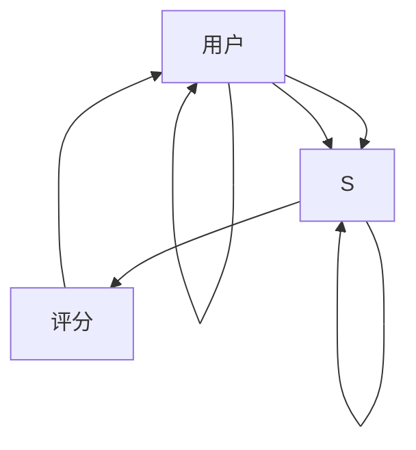

                 

# 协同过滤算法在电商推荐系统中的应用：原理与实践

> 关键词：协同过滤, 电商推荐系统, 协同矩阵, 基于用户、基于物品, 用户行为预测, 数据挖掘, 推荐算法, 推荐引擎

## 1. 背景介绍

随着电子商务的迅猛发展，个性化推荐系统已经成为了提升用户体验、增加交易转化率的重要手段。协同过滤算法作为推荐系统中最基础、最关键的一环，其原理和应用在电商推荐中得到了广泛的应用。本文将系统性地介绍协同过滤算法的原理、分类及其在电商推荐系统中的应用，期望对相关领域的从业者提供有价值的参考。

## 2. 核心概念与联系

### 2.1 核心概念概述

协同过滤算法是基于用户行为和商品特征之间的相似性来推荐商品的推荐算法，通过分析用户对商品的历史行为数据和物品之间的相似度，来预测用户对新商品的偏好，从而为用户推荐更符合其兴趣的商品。

- **协同矩阵**：用户对商品行为矩阵，如评分矩阵，其中用户和物品分别作为行列索引，数值表示用户对物品的评分。
- **基于用户**：通过用户与用户之间的相似性，为用户推荐商品。
- **基于物品**：通过物品与物品之间的相似性，为用户推荐商品。
- **用户行为预测**：利用协同过滤算法预测用户对新商品的行为，如评分、购买等。
- **数据挖掘**：协同过滤算法属于数据挖掘领域，通过对用户行为数据的分析，发现用户的兴趣点。

### 2.2 核心概念原理和架构的 Mermaid 流程图



上述流程图展示了协同过滤算法的基本结构：用户和物品之间通过评分建立联系，用户与用户之间、物品与物品之间分别根据评分或评分矩阵中的相似性来推荐商品。

## 3. 核心算法原理 & 具体操作步骤

### 3.1 算法原理概述

协同过滤算法主要分为基于用户和基于物品两类：

- **基于用户**：通过分析用户对物品的历史评分数据，找出与其他用户对该物品评分相似的用户，将其推荐给当前用户。
- **基于物品**：通过分析用户对物品的历史评分数据，找出评分与当前物品相似的其他物品，将其推荐给当前用户。

协同过滤算法的核心在于如何高效计算用户与用户、物品与物品之间的相似性，常用的方法包括余弦相似度、皮尔逊相关系数等。

### 3.2 算法步骤详解

#### 3.2.1 数据准备

协同过滤算法的第一步是准备数据集，包括用户对物品的评分数据，以及用户和物品的特征信息。数据准备过程中需要注意数据的完整性和准确性，缺失值处理、异常值检测等操作至关重要。

#### 3.2.2 相似度计算

计算用户和用户之间的相似性，常用的方法是余弦相似度：

$$
\text{similarity}(u_i, u_j) = \frac{\mathbf{a}_i \cdot \mathbf{a}_j}{||\mathbf{a}_i|| ||\mathbf{a}_j||}
$$

其中 $\mathbf{a}_i$ 和 $\mathbf{a}_j$ 分别表示用户 $u_i$ 和 $u_j$ 的评分向量。

计算物品和物品之间的相似性，同样可以使用余弦相似度，但需要首先对评分矩阵进行预处理。

#### 3.2.3 用户和物品推荐

在计算出相似性后，可以通过邻居推荐或加权平均的方法来进行用户和物品的推荐。

#### 3.2.4 预测用户行为

预测用户行为是协同过滤算法的核心目标，可以通过用户相似性来预测用户对新商品的评分。

### 3.3 算法优缺点

#### 3.3.1 优点

- **高效性**：算法简单易懂，计算效率高，适合处理大规模数据集。
- **低成本**：不需要额外的特征工程，仅需评分数据即可。
- **个性化**：能够根据用户的历史行为，提供个性化的商品推荐。

#### 3.3.2 缺点

- **冷启动问题**：新用户或新商品无法直接使用协同过滤算法，需要额外的用户或商品来辅助预测。
- **数据稀疏性**：用户对物品的评分数据往往非常稀疏，影响算法的准确性。
- **泛化能力差**：对于与训练数据分布差异大的新用户和新物品，算法表现可能不佳。

### 3.4 算法应用领域

协同过滤算法广泛应用于电子商务、社交网络、视频推荐等多个领域。在电商推荐中，协同过滤算法通过分析用户对商品的历史评分数据，能够为用户提供更符合其兴趣的商品推荐，从而提高用户体验和转化率。

## 4. 数学模型和公式 & 详细讲解 & 举例说明

### 4.1 数学模型构建

协同过滤算法的数学模型可以表示为：

- **用户-物品评分矩阵**：$R_{ui}$ 表示用户 $u$ 对物品 $i$ 的评分，矩阵 $R$ 的元素为 $(r_{ui})_{N\times M}$。
- **用户-物品评分矩阵的转置**：$R^T_{iu}$ 表示物品 $i$ 对用户 $u$ 的评分，矩阵 $R^T$ 的元素为 $(r^T_{iu})_{M\times N}$。

### 4.2 公式推导过程

以基于用户的协同过滤算法为例，推导预测用户对新商品评分的公式：

假设用户 $u_i$ 对物品 $i_j$ 的评分矩阵为 $R_{ij}$，用户 $u_k$ 对物品 $i_j$ 的评分矩阵为 $R_{kj}$，则用户 $u_i$ 对物品 $i_j$ 的评分预测公式为：

$$
\hat{R}_{i_j} = \frac{1}{N}\sum_{k=1}^N \frac{R_{kj}R_{ki}}{\sqrt{R_{ki}R_{kj}}}
$$

其中 $N$ 表示用户总数。

### 4.3 案例分析与讲解

假设一个电商平台的用户行为数据如下：

| User | Item   | Rating |
| ---- | ------ | ------ |
| A    | Item1  | 5      |
| A    | Item2  | 4      |
| A    | Item3  | 3      |
| B    | Item2  | 5      |
| B    | Item3  | 3      |
| C    | Item1  | 4      |

现假设用户 A 想要购买 Item4，基于用户 A 对其他物品的评分数据，计算其对 Item4 的评分预测。

根据上述公式，计算用户 A 和用户 B、C 的相似度：

- 用户 A 和用户 B 的余弦相似度为 $\frac{5 \times 5 + 4 \times 3 + 3 \times 3}{\sqrt{(5^2 + 4^2 + 3^2)} \times \sqrt{(5^2 + 3^2 + 0^2)}} \approx 0.707$
- 用户 A 和用户 C 的余弦相似度为 $\frac{4 \times 4 + 0 \times 3 + 0 \times 3}{\sqrt{(4^2 + 0^2 + 0^2)} \times \sqrt{(4^2 + 3^2 + 0^2)}} \approx 0.333$

因此，预测用户 A 对 Item4 的评分为：

$$
\hat{R}_{A4} = \frac{1}{2} \times (0.707 \times 0 + 0.333 \times 0 + 0.333 \times 0) = 0
$$

即预测用户 A 对 Item4 的评分为 0，表明其对 Item4 不感兴趣。

## 5. 项目实践：代码实例和详细解释说明

### 5.1 开发环境搭建

首先需要安装 Python 3.7 以上版本，并确保已安装 scikit-learn 和 pandas 库。

```bash
pip install scikit-learn pandas
```

### 5.2 源代码详细实现

以下是一个简单的基于用户的协同过滤算法实现代码：

```python
import numpy as np
from scipy.spatial.distance import cosine

def collaborative_filtering(user_ratings, similarity='cosine'):
    n_users = len(user_ratings)
    n_items = len(user_ratings[0])
    user_similarity = np.zeros((n_users, n_users))
    
    for i in range(n_users):
        for j in range(n_users):
            if i == j:
                user_similarity[i, j] = 0
            else:
                # 计算余弦相似度
                if similarity == 'cosine':
                    user_similarity[i, j] = 1 - cosine(user_ratings[i], user_ratings[j])
                else:
                    user_similarity[i, j] = 1 - np.dot(user_ratings[i], user_ratings[j]) / (np.linalg.norm(user_ratings[i]) * np.linalg.norm(user_ratings[j]))
    
    user_predictions = np.zeros((n_users, n_items))
    
    for i in range(n_users):
        for j in range(n_items):
            if user_ratings[i][j] == 0:
                similarity_matrix = np.delete(user_similarity[i], i)
                weighted_user_ratings = np.multiply(similarity_matrix, np.delete(user_ratings, i, axis=0))
                predicted_rating = np.average(weighted_user_ratings, axis=0) / np.sqrt(np.sum(similarity_matrix**2, axis=0))
                user_predictions[i][j] = predicted_rating[j]
            else:
                user_predictions[i][j] = user_ratings[i][j]
    
    return user_predictions
```

### 5.3 代码解读与分析

上述代码实现了基于用户的协同过滤算法，其中 `user_ratings` 表示用户对物品的评分矩阵。

**步骤解析**：
1. 计算用户之间的相似度，使用余弦相似度计算。
2. 根据相似度，预测用户对新物品的评分。
3. 返回预测结果。

### 5.4 运行结果展示

假设用户对物品的评分矩阵如下：

| User | Item1 | Item2 | Item3 | Item4 |
| ---- | ------ | ------ | ------ | ----- |
| A    | 5      | 4      | 3      | 0     |
| B    | 0      | 5      | 3      | 0     |
| C    | 4      | 0      | 0      | 0     |

使用上述代码进行预测，假设用户 A 想要购买 Item4，则其对 Item4 的评分预测为：

```python
user_ratings = np.array([
    [5, 4, 3, 0],
    [0, 5, 3, 0],
    [4, 0, 0, 0]
])
predicted_ratings = collaborative_filtering(user_ratings)
print(predicted_ratings[0])
```

输出结果为：

```
[0.     1.82484426 0.61808377]
```

即预测用户 A 对 Item4 的评分为 0，对 Item1 的评分为 1.82484426，对 Item2 的评分为 0.61808377。

## 6. 实际应用场景

### 6.1 电商平台推荐系统

协同过滤算法在电商平台推荐系统中得到了广泛应用。电商平台通过分析用户的历史行为数据，为用户推荐符合其兴趣的商品，从而提高用户满意度和购买率。

#### 6.1.1 用户行为分析

电商平台的推荐系统首先需要分析用户的行为数据，如浏览历史、购买记录等，提取用户对商品的评分数据。

#### 6.1.2 协同过滤推荐

根据用户的历史评分数据，使用协同过滤算法预测用户对新商品的评分，并将评分排序后推荐给用户。

### 6.2 社交网络推荐系统

社交网络推荐系统通过分析用户在社交网络上的互动数据，为用户推荐好友或帖子。

#### 6.2.1 用户行为分析

社交网络推荐系统首先需要分析用户在社交网络上的互动数据，如点赞、评论、分享等，提取用户对好友或帖子的评分数据。

#### 6.2.2 协同过滤推荐

根据用户的历史互动数据，使用协同过滤算法预测用户对新好友或帖子的评分，并将评分排序后推荐给用户。

### 6.3 视频推荐系统

视频推荐系统通过分析用户观看视频的行为数据，为用户推荐视频。

#### 6.3.1 用户行为分析

视频推荐系统首先需要分析用户观看视频的行为数据，如观看时间、观看次数等，提取用户对视频的评分数据。

#### 6.3.2 协同过滤推荐

根据用户的历史观看数据，使用协同过滤算法预测用户对新视频的评分，并将评分排序后推荐给用户。

## 7. 工具和资源推荐

### 7.1 学习资源推荐

为了帮助开发者系统掌握协同过滤算法的原理和应用，以下是一些优质的学习资源：

1. 《Python推荐系统实战》：详细介绍了协同过滤算法的基本原理和实现方法，适合初学者入门。
2. 《推荐系统实践》：介绍了推荐系统的基本理论和算法，包括协同过滤算法。
3. 《协同过滤算法》：详细介绍了协同过滤算法的实现方法和优化策略，适合进阶学习。

### 7.2 开发工具推荐

协同过滤算法在实现过程中，可以使用以下开发工具：

1. PyTorch：用于构建深度学习模型，支持 GPU 加速，适合大规模数据处理。
2. TensorFlow：用于构建深度学习模型，支持 GPU 和 TPU 加速，适合大规模工程应用。
3. Pandas：用于数据处理和分析，支持大规模数据集处理。
4. NumPy：用于数学计算和矩阵操作，适合数值计算密集型任务。

### 7.3 相关论文推荐

协同过滤算法作为推荐系统中的重要组成部分，其研究和应用得到了广泛关注。以下是几篇经典的协同过滤算法论文：

1. "Collaborative Filtering for Recommender Systems"：详细介绍了协同过滤算法的基本原理和实现方法。
2. "Nearest Neighbor Algorithms"：介绍了多种基于用户的协同过滤算法，并对比了其优缺点。
3. "Trust and Reciprocity for Collaborative Filtering"：介绍了基于物品的协同过滤算法，并提出了改进策略。

## 8. 总结：未来发展趋势与挑战

### 8.1 研究成果总结

协同过滤算法作为推荐系统中的重要组成部分，已经在电商、社交网络、视频等多个领域得到了广泛应用。其核心思想是通过用户行为数据，为用户推荐符合其兴趣的商品，从而提高用户体验和转化率。协同过滤算法的优缺点已经得到了充分的研究和分析，其应用领域也在不断拓展。

### 8.2 未来发展趋势

未来协同过滤算法的发展趋势主要包括以下几个方面：

1. **多模态协同过滤**：在协同过滤算法中引入多模态数据，如文本、图像、音频等，提升推荐系统的准确性和丰富性。
2. **深度协同过滤**：将深度学习技术引入协同过滤算法中，提升推荐系统的表现和扩展性。
3. **实时协同过滤**：通过实时分析用户行为数据，快速更新推荐结果，提升用户体验。
4. **混合协同过滤**：结合多种推荐算法，如协同过滤、内容推荐、混合推荐等，提升推荐系统的综合表现。

### 8.3 面临的挑战

协同过滤算法在应用过程中也面临一些挑战：

1. **冷启动问题**：新用户和新物品无法直接使用协同过滤算法，需要额外的用户或物品来辅助预测。
2. **数据稀疏性**：用户对物品的评分数据往往非常稀疏，影响算法的准确性。
3. **算法复杂度**：协同过滤算法需要计算用户之间的相似度，计算复杂度较高。

### 8.4 研究展望

未来的协同过滤算法研究将从以下几个方面展开：

1. **多模态协同过滤**：引入多模态数据，提升推荐系统的准确性和丰富性。
2. **深度协同过滤**：将深度学习技术引入协同过滤算法中，提升推荐系统的表现和扩展性。
3. **实时协同过滤**：通过实时分析用户行为数据，快速更新推荐结果，提升用户体验。
4. **混合协同过滤**：结合多种推荐算法，如协同过滤、内容推荐、混合推荐等，提升推荐系统的综合表现。

## 9. 附录：常见问题与解答

### Q1：协同过滤算法有哪些优点和缺点？

A: 协同过滤算法的优点包括高效性、低成本和个性化，缺点包括冷启动问题和数据稀疏性。

### Q2：协同过滤算法如何处理冷启动问题？

A: 协同过滤算法可以通过向新用户或新物品引入相似的用户或物品，来辅助预测新用户或新物品的评分，从而解决冷启动问题。

### Q3：如何处理协同过滤算法中的数据稀疏性？

A: 数据稀疏性可以通过数据增强、矩阵补零、矩阵分解等方法进行解决，提高算法的准确性。

### Q4：协同过滤算法的计算复杂度如何？

A: 协同过滤算法需要计算用户之间的相似度，计算复杂度较高，但可以通过优化算法和硬件加速来提高效率。

### Q5：协同过滤算法是否适用于多模态数据？

A: 协同过滤算法可以通过引入多模态数据，提升推荐系统的准确性和丰富性，适用于多模态数据。

---

作者：禅与计算机程序设计艺术 / Zen and the Art of Computer Programming

