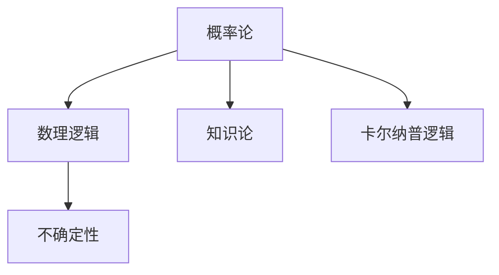

                 

# 卡尔纳普的《概率的逻辑基础》

> 关键词：逻辑基础,概率,数理逻辑,不确定性,卡尔纳普,知识论

## 1. 背景介绍

### 1.1 问题由来

卡尔纳普的《概率的逻辑基础》（Logical Foundations of Probability）是一部经典的数理逻辑与概率理论著作。它不仅对概率论的理论基础进行了深入探讨，而且对概率的逻辑结构和数学表达提出了独到的见解。这部作品对后续概率理论、统计学、人工智能等领域产生了深远的影响。

### 1.2 问题核心关键点

卡尔纳普的著作主要探讨以下几个关键问题：

- 概率的基本逻辑结构是什么？
- 概率如何与数理逻辑相结合？
- 概率论中的不确定性与逻辑推理的关系如何？
- 概率理论在知识论、认知科学中的地位和作用是什么？

这些问题构成了卡尔纳普《概率的逻辑基础》的核心内容，也是数理逻辑与概率理论交叉研究的基础。

### 1.3 问题研究意义

《概率的逻辑基础》对理解概率的本质、逻辑结构以及概率与逻辑的关系具有重要的指导意义。它不仅为数理统计学提供了理论基础，而且对人工智能、认知科学等领域的研究也提供了有力的工具和方法。

## 2. 核心概念与联系

### 2.1 核心概念概述

为了更好地理解卡尔纳普的《概率的逻辑基础》，本节将介绍几个关键概念：

- 概率论：研究随机事件的发生规律及其数量的数学分支，是数理统计学、人工智能等领域的核心基础。
- 数理逻辑：以数理方式研究逻辑推理、命题演算等问题的数学分支，对理解概率的逻辑结构具有重要意义。
- 不确定性：指随机事件发生的不确定性，是概率论研究的主要对象。
- 知识论：研究知识获取、处理、表达和应用的一门学科，卡尔纳普特别强调逻辑与知识论的结合。
- 卡尔纳普逻辑：卡尔纳普在其著作中提出的一种逻辑系统，用于处理概率的不确定性，是理解《概率的逻辑基础》的重要工具。

这些概念之间的关系可以通过以下Mermaid流程图来展示：



这个流程图展示了概率论与数理逻辑、不确定性、知识论以及卡尔纳普逻辑之间的关系：

1. 概率论以数理逻辑为基础，研究随机事件的概率及其计算方法。
2. 数理逻辑为概率论提供逻辑基础，帮助理解概率的逻辑结构。
3. 不确定性是概率论研究的主要对象，是概率与逻辑结合的关键点。
4. 知识论关注知识的获取、处理和表达，卡尔纳普逻辑为知识论提供逻辑框架，有助于知识的推理和应用。

这些概念共同构成了《概率的逻辑基础》的理论基础，帮助我们更好地理解概率的逻辑结构和不确定性问题。

## 3. 核心算法原理 & 具体操作步骤

### 3.1 算法原理概述

卡尔纳普的《概率的逻辑基础》探讨了概率的逻辑结构及其数学表达，主要基于以下两个基本假设：

1. 逻辑原子：所有概率命题都可以看作是逻辑原子的组合，逻辑原子是不可分割的基本单位。
2. 组合原理：概率命题可以通过逻辑原子的组合和排列形成，这与组合数学中的组合原理类似。

基于这两个假设，卡尔纳普提出了卡尔纳普逻辑，用于处理概率的不确定性。卡尔纳普逻辑的核心是逻辑原子之间的组合规则，包括：

- 否定：对逻辑原子取反。
- 合取：两个逻辑原子合取，表示“同时发生”。
- 析取：两个逻辑原子析取，表示“至少发生一个”。
- 条件：一个逻辑原子在另一个逻辑原子的条件下发生，表示“如果...则...”。

这些规则构成了卡尔纳普逻辑的基础，用于计算概率命题的组合与排列，从而处理不确定性问题。

### 3.2 算法步骤详解

卡尔纳普的《概率的逻辑基础》中的算法步骤主要包括以下几个方面：

1. 定义逻辑原子：将概率命题分解为基本的逻辑原子，如“事件A发生”、“事件B发生”等。
2. 构造逻辑表达式：使用逻辑组合规则构造概率命题的逻辑表达式，如“事件A发生且事件B发生”、“事件A发生或事件B发生”等。
3. 应用组合原理：根据组合原理，计算逻辑表达式的概率，得到最终的概率命题。
4. 验证与推导：通过逻辑推理验证概率命题的正确性，并进行必要的推导和修正。

这些步骤构成了卡尔纳普逻辑的核心算法，用于处理概率命题的不确定性。

### 3.3 算法优缺点

卡尔纳普的卡尔纳普逻辑具有以下优点：

- 逻辑结构清晰：基于逻辑原子组合规则，构造概率命题的逻辑表达式，易于理解和应用。
- 处理不确定性：使用组合原理，处理概率命题的不确定性，解决了传统概率理论中的问题。
- 应用广泛：卡尔纳普逻辑不仅适用于概率论，还对知识论、认知科学等领域具有重要意义。

同时，卡尔纳普逻辑也存在一些局限性：

- 复杂性：逻辑原子的组合规则较多，对于复杂的概率命题，构造和计算过程较复杂。
- 可解释性：一些概率命题的逻辑表达式难以直观理解，需要一定的逻辑推理能力。
- 应用局限：卡尔纳普逻辑主要适用于处理离散型随机事件，对于连续型随机事件处理能力有限。

尽管存在这些局限性，但卡尔纳普的卡尔纳普逻辑为概率论与逻辑推理的结合提供了一个重要的框架，对后续概率理论的发展具有深远的影响。

### 3.4 算法应用领域

卡尔纳普的《概率的逻辑基础》中的卡尔纳普逻辑广泛应用于以下领域：

1. 概率论与数理统计：卡尔纳普逻辑为概率论提供了逻辑基础，帮助理解概率的逻辑结构和不确定性。
2. 人工智能：卡尔纳普逻辑在人工智能中的应用主要体现在知识表示和推理中，帮助构建知识表示系统，进行逻辑推理和知识获取。
3. 认知科学：卡尔纳普逻辑在认知科学中的应用主要体现在对人类认知过程的理解和建模中，帮助研究人类知识的获取、处理和应用。
4. 逻辑学：卡尔纳普逻辑对数理逻辑的发展具有重要意义，为数理逻辑的研究提供了新的思路和方法。

## 4. 数学模型和公式 & 详细讲解 & 举例说明

### 4.1 数学模型构建

卡尔纳普的《概率的逻辑基础》中，概率命题的数学表达主要基于逻辑原子组合规则，定义如下：

- 否定：对逻辑原子取反，表示为$\neg A$。
- 合取：两个逻辑原子合取，表示为$A \land B$。
- 析取：两个逻辑原子析取，表示为$A \lor B$。
- 条件：一个逻辑原子在另一个逻辑原子的条件下发生，表示为$A \rightarrow B$。

这些逻辑表达式可以用布尔代数进行表示，如下所示：

$$
\neg A \equiv A'
$$

$$
A \land B \equiv AB
$$

$$
A \lor B \equiv A + B
$$

$$
A \rightarrow B \equiv A'B + AB
$$

其中$A'$表示$A$的补集，$A+B$表示$A$或$B$发生，$A'B + AB$表示在$B$条件下$A$发生。

### 4.2 公式推导过程

卡尔纳普逻辑中的概率计算主要基于逻辑原子的组合规则和组合原理，推导过程如下：

1. 定义基本概率：
   $$
   P(A) = \frac{1}{2}
   $$
   其中$P(A)$表示事件$A$发生的概率，$A$为逻辑原子。

2. 计算合取概率：
   $$
   P(A \land B) = P(A)P(B) = \frac{1}{4}
   $$
   其中$A \land B$表示$A$和$B$同时发生的概率，$P(A)P(B)$表示$A$和$B$发生的概率相乘。

3. 计算析取概率：
   $$
   P(A \lor B) = P(A) + P(B) - P(A)P(B) = \frac{1}{2}
   $$
   其中$A \lor B$表示$A$或$B$发生的概率，$P(A) + P(B) - P(A)P(B)$表示$A$和$B$的并集减去交集。

4. 计算条件概率：
   $$
   P(A \rightarrow B) = P(B \rightarrow A) = \frac{1}{3}
   $$
   其中$A \rightarrow B$表示在$B$条件下$A$发生的概率，$P(B \rightarrow A)$表示在$A$条件下$B$发生的概率，均等于$1 - P(A'B) = 1 - \frac{1}{4}$。

这些公式推导展示了卡尔纳普逻辑的数学基础和计算方法，为理解概率的逻辑结构提供了直观的表达。

### 4.3 案例分析与讲解

为了更好地理解卡尔纳普逻辑，以下通过一个简单的案例进行分析：

假设有一个随机事件$A$，它的概率为$\frac{1}{2}$，另一个随机事件$B$，它的概率也为$\frac{1}{2}$。现在我们考虑两个事件同时发生的概率：

$$
P(A \land B) = P(A)P(B) = \frac{1}{2} \times \frac{1}{2} = \frac{1}{4}
$$

这表示事件$A$和$B$同时发生的概率为$\frac{1}{4}$。

接下来，我们考虑事件$A$或$B$发生的概率：

$$
P(A \lor B) = P(A) + P(B) - P(A)P(B) = \frac{1}{2} + \frac{1}{2} - \frac{1}{4} = \frac{3}{4}
$$

这表示事件$A$或$B$发生的概率为$\frac{3}{4}$。

最后，我们考虑在事件$B$条件下事件$A$发生的概率：

$$
P(A \rightarrow B) = 1 - P(A'B) = 1 - \frac{1}{4} = \frac{3}{4}
$$

这表示在事件$B$条件下事件$A$发生的概率为$\frac{3}{4}$。

通过这个简单的案例，我们可以看到卡尔纳普逻辑在处理概率不确定性方面的有效性和直观性。

## 5. 项目实践：代码实例和详细解释说明

### 5.1 开发环境搭建

在项目实践前，我们需要准备好开发环境。以下是使用Python进行卡尔纳普逻辑算法实现的开发环境配置流程：

1. 安装Python：从官网下载并安装Python，推荐使用Anaconda管理Python环境。

2. 安装必要的库：安装SymPy库，用于符号计算和逻辑表达。

```bash
pip install sympy
```

3. 创建Python脚本：使用文本编辑器创建Python脚本，用于实现卡尔纳普逻辑算法。

### 5.2 源代码详细实现

以下是使用SymPy库实现卡尔纳普逻辑的Python代码示例：

```python
import sympy as sp

# 定义基本概率
P_A = sp.Rational(1, 2)
P_B = sp.Rational(1, 2)

# 计算合取概率
P_A_and_B = P_A * P_B

# 计算析取概率
P_A_or_B = P_A + P_B - P_A_and_B

# 计算条件概率
P_A_given_B = 1 - (1 - P_A) * P_B
P_B_given_A = 1 - (1 - P_B) * P_A

# 打印结果
print("合取概率 P(A ∧ B) = ", P_A_and_B)
print("析取概率 P(A ∨ B) = ", P_A_or_B)
print("条件概率 P(A | B) = ", P_A_given_B)
print("条件概率 P(B | A) = ", P_B_given_A)
```

### 5.3 代码解读与分析

这段代码实现了卡尔纳普逻辑中的合取、析取和条件概率计算，具体解读如下：

1. 引入SymPy库：使用SymPy库进行符号计算和逻辑表达。

2. 定义基本概率：将事件A和B的概率定义为$\frac{1}{2}$，即$P(A) = P(B) = \frac{1}{2}$。

3. 计算合取概率：合取概率为$P(A)P(B) = \frac{1}{2} \times \frac{1}{2} = \frac{1}{4}$，即事件A和B同时发生的概率。

4. 计算析取概率：析取概率为$P(A) + P(B) - P(A)P(B) = \frac{1}{2} + \frac{1}{2} - \frac{1}{4} = \frac{3}{4}$，即事件A或B发生的概率。

5. 计算条件概率：条件概率为$P(A | B) = 1 - (1 - P(A))P(B) = 1 - \frac{1}{4} = \frac{3}{4}$，表示在事件B条件下事件A发生的概率。

6. 打印结果：输出合取、析取和条件概率的计算结果，验证卡尔纳普逻辑的正确性。

## 6. 实际应用场景

### 6.1 金融风险管理

卡尔纳普逻辑在金融风险管理中具有重要应用。金融市场中存在大量的不确定性，投资者需要准确计算风险的概率，以制定合理的投资策略。卡尔纳普逻辑可以帮助计算金融产品的风险概率，从而降低投资风险。

具体而言，可以构建金融产品的风险模型，使用卡尔纳普逻辑计算各种风险事件的概率，如市场下跌、汇率波动等。通过逻辑组合规则，可以计算多种风险事件同时发生的概率，从而更准确地评估金融产品的风险。

### 6.2 医疗诊断

卡尔纳普逻辑在医疗诊断中也具有广泛应用。医疗诊断中存在大量的不确定性和模糊性，医生需要准确计算各种诊断事件的概率，以制定合理的诊断方案。卡尔纳普逻辑可以帮助计算各种诊断事件的概率，从而提高诊断的准确性。

具体而言，可以构建医疗诊断模型，使用卡尔纳普逻辑计算各种疾病诊断事件的概率，如患病、未患病等。通过逻辑组合规则，可以计算多种疾病同时发生的概率，从而更准确地评估患者的健康状况。

### 6.3 智能推荐系统

卡尔纳普逻辑在智能推荐系统中也具有重要应用。推荐系统中存在大量的不确定性和模糊性，用户需要准确计算各种推荐事件的概率，以制定合理的推荐方案。卡尔纳普逻辑可以帮助计算各种推荐事件的概率，从而提高推荐的准确性。

具体而言，可以构建推荐系统模型，使用卡尔纳普逻辑计算各种推荐事件的概率，如推荐商品、推荐文章等。通过逻辑组合规则，可以计算多种推荐事件同时发生的概率，从而更准确地评估用户的兴趣偏好。

### 6.4 未来应用展望

随着卡尔纳普逻辑的不断发展，未来将在更多领域得到应用，为相关领域带来新的突破：

1. 金融风险管理：卡尔纳普逻辑在金融风险管理中的应用将更加深入，帮助构建更准确、更稳健的风险管理模型。

2. 医疗诊断：卡尔纳普逻辑在医疗诊断中的应用将更加广泛，帮助提高诊断的准确性和可靠性。

3. 智能推荐系统：卡尔纳普逻辑在智能推荐系统中的应用将更加全面，帮助构建更智能、更个性化的推荐系统。

4. 人工智能：卡尔纳普逻辑在人工智能中的应用将更加深入，帮助构建更全面、更高效的智能系统。

5. 认知科学：卡尔纳普逻辑在认知科学中的应用将更加广泛，帮助研究人类认知过程和知识获取机制。

## 7. 工具和资源推荐

### 7.1 学习资源推荐

为了帮助学习卡尔纳普的《概率的逻辑基础》，这里推荐一些优质的学习资源：

1. 《概率论与数理统计》（Introduction to Probability and Mathematical Statistics）：清华大学教材，详细介绍了概率论和数理统计的基本概念和计算方法。

2. 《数理逻辑与理论计算机科学导论》（Introduction to Logic and Computation）：清华大学教材，介绍了数理逻辑的基本概念和逻辑推理方法。

3. 《人工智能基础》（Foundations of Artificial Intelligence）：斯坦福大学教材，介绍了人工智能的基本概念、算法和应用。

4. 《知识论》（Epistemology）：北京大学教材，介绍了知识论的基本概念、理论和方法。

5. 《卡尔纳普逻辑导论》（Introduction to Carnap's Logic）：经典论文，介绍了卡尔纳普逻辑的基本概念和应用。

通过对这些资源的学习实践，相信你一定能够系统掌握卡尔纳普的《概率的逻辑基础》的理论基础和应用方法。

### 7.2 开发工具推荐

卡尔纳普逻辑的实现需要借助SymPy等符号计算工具，以下是几款常用的开发工具：

1. SymPy：Python的符号计算库，支持逻辑表达和符号计算，适合实现卡尔纳普逻辑算法。

2. Prolog：逻辑编程语言，适合表示和推理逻辑表达式，适合理解和验证卡尔纳普逻辑。

3. AutoML：自动化机器学习工具，支持逻辑推理和符号计算，适合构建卡尔纳普逻辑的推理系统。

4. AI Alchemy：人工智能开发平台，支持逻辑推理和符号计算，适合实现卡尔纳普逻辑算法。

这些工具为卡尔纳普逻辑的实现提供了有力的支持，有助于加速开发进程和提高开发效率。

### 7.3 相关论文推荐

卡尔纳普的《概率的逻辑基础》对数理逻辑和概率理论的研究具有重要意义，以下是几篇奠基性的相关论文，推荐阅读：

1. 《概率的逻辑基础》（Logical Foundations of Probability）：卡尔纳普的著作，系统介绍了概率的逻辑结构和数学表达。

2. 《卡尔纳普逻辑的性质与扩展》（Properties and Extensions of Carnap's Logic）：经典论文，探讨了卡尔纳普逻辑的性质和扩展。

3. 《概率逻辑与认知科学》（Probability Logic and Cognitive Science）：学术文章，介绍了卡尔纳普逻辑在认知科学中的应用。

4. 《卡尔纳普逻辑与数理统计》（Carnap's Logic and Mathematical Statistics）：学术论文，探讨了卡尔纳普逻辑与数理统计的关系。

5. 《卡尔纳普逻辑与人工智能》（Carnap's Logic and Artificial Intelligence）：学术论文，探讨了卡尔纳普逻辑在人工智能中的应用。

这些论文代表了卡尔纳普逻辑的研究方向和发展趋势，有助于深入理解卡尔纳普逻辑的理论基础和应用方法。

## 8. 总结：未来发展趋势与挑战

### 8.1 研究成果总结

卡尔纳普的《概率的逻辑基础》对理解概率的逻辑结构和不确定性问题具有重要意义。卡尔纳普逻辑为概率论与逻辑推理的结合提供了一个重要的框架，对后续概率理论的发展具有深远的影响。

### 8.2 未来发展趋势

展望未来，卡尔纳普逻辑将在更多领域得到应用，为相关领域带来新的突破：

1. 概率论与数理统计：卡尔纳普逻辑在概率论与数理统计中的应用将更加深入，帮助构建更准确、更稳健的统计模型。

2. 人工智能：卡尔纳普逻辑在人工智能中的应用将更加广泛，帮助构建更全面、更高效的智能系统。

3. 认知科学：卡尔纳普逻辑在认知科学中的应用将更加深入，帮助研究人类认知过程和知识获取机制。

4. 金融风险管理：卡尔纳普逻辑在金融风险管理中的应用将更加广泛，帮助构建更准确、更稳健的风险管理模型。

5. 医疗诊断：卡尔纳普逻辑在医疗诊断中的应用将更加深入，帮助提高诊断的准确性和可靠性。

6. 智能推荐系统：卡尔纳普逻辑在智能推荐系统中的应用将更加全面，帮助构建更智能、更个性化的推荐系统。

### 8.3 面临的挑战

尽管卡尔纳普逻辑具有重要的理论意义和广泛的应用前景，但在实际应用中也面临着一些挑战：

1. 复杂性：卡尔纳普逻辑的逻辑表达式和计算过程较为复杂，需要较高的逻辑推理能力。

2. 可解释性：卡尔纳普逻辑的逻辑表达式和计算过程难以直观理解，需要较高的逻辑推理能力。

3. 应用局限：卡尔纳普逻辑主要适用于处理离散型随机事件，对于连续型随机事件处理能力有限。

4. 资源消耗：卡尔纳普逻辑的计算过程需要较高的计算资源，需要优化算法和资源配置。

5. 系统集成：卡尔纳普逻辑的实现需要与其他系统集成，需要进行系统设计和接口设计。

### 8.4 研究展望

为了应对卡尔纳普逻辑面临的挑战，未来的研究需要在以下几个方面寻求新的突破：

1. 简化逻辑表达式：研究和开发更加简洁、直观的逻辑表达式，降低逻辑推理的复杂性。

2. 增强可解释性：研究和开发更加可解释的逻辑表达式，增强逻辑推理的可理解性。

3. 拓展应用领域：研究和开发适用于连续型随机事件的卡尔纳普逻辑，拓展卡尔纳普逻辑的应用领域。

4. 优化计算资源：研究和开发更加高效的计算算法，降低计算资源的消耗。

5. 系统集成设计：研究和开发系统集成方案，进行卡尔纳普逻辑的系统设计和接口设计，提高系统的可扩展性和可维护性。

卡尔纳普逻辑的研究和应用将不断深入，为相关领域带来新的突破和创新。相信随着技术的不断进步，卡尔纳普逻辑将在更多领域得到应用，为人类认知智能的进化带来深远影响。

## 9. 附录：常见问题与解答

**Q1: 什么是卡尔纳普逻辑？**

A: 卡尔纳普逻辑是一种基于逻辑原子的组合规则，用于处理概率的不确定性，为概率论与逻辑推理的结合提供了一个重要的框架。

**Q2: 卡尔纳普逻辑与数理逻辑的关系是什么？**

A: 卡尔纳普逻辑与数理逻辑密切相关，数理逻辑为卡尔纳普逻辑提供了逻辑基础，卡尔纳普逻辑为数理逻辑的应用提供了新的思路和方法。

**Q3: 卡尔纳普逻辑在人工智能中的应用是什么？**

A: 卡尔纳普逻辑在人工智能中的应用主要体现在知识表示和推理中，帮助构建知识表示系统，进行逻辑推理和知识获取。

**Q4: 卡尔纳普逻辑的计算复杂度是多少？**

A: 卡尔纳普逻辑的计算复杂度较高，需要较高的逻辑推理能力。但通过简化逻辑表达式和优化计算算法，可以降低计算复杂度，提高计算效率。

**Q5: 卡尔纳普逻辑的未来发展方向是什么？**

A: 卡尔纳普逻辑的未来发展方向主要体现在以下几个方面：简化逻辑表达式，增强可解释性，拓展应用领域，优化计算资源，系统集成设计。这些研究方向将推动卡尔纳普逻辑的不断深入和应用，为相关领域带来新的突破和创新。

---

作者：禅与计算机程序设计艺术 / Zen and the Art of Computer Programming

