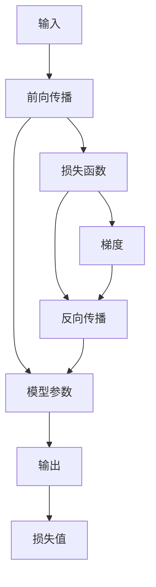

                 

## 1. 背景介绍

反向传播（Backpropagation）是深度学习算法中最关键的一环，用于计算模型参数对损失函数的梯度，从而指导参数更新，使得模型能够最小化预测误差。然而，这个概念的复杂性超出了许多初学者的理解范围，尤其在面对数学公式和算法步骤时。本文旨在深入浅出地讲解反向传播的原理，使用逻辑清晰、结构紧凑、简单易懂的语言，帮助读者理解这一技术背后的核心思想。

## 2. 核心概念与联系

### 2.1 核心概念概述

反向传播算法中涉及以下几个核心概念：

- **损失函数（Loss Function）**：衡量模型预测值与真实值之间的差异。常见的损失函数包括均方误差（MSE）、交叉熵（Cross-Entropy）等。

- **梯度（Gradient）**：损失函数对模型参数的偏导数，表示参数变化对损失函数的影响程度。梯度越大，表示该参数对损失函数的贡献越大，需要更新的幅度也就越大。

- **权重（Weight）**：模型中的可学习参数，包括卷积核、权重矩阵、偏置向量等。

- **反向传播（Backpropagation）**：从输出层到输入层的梯度传递过程。通过链式法则，反向传播计算出每个参数的梯度，用于后续的参数更新。

- **梯度下降（Gradient Descent）**：一种常用的优化算法，通过不断调整模型参数，使得损失函数最小化。

### 2.2 核心概念原理和架构的 Mermaid 流程图



## 3. 核心算法原理 & 具体操作步骤

### 3.1 算法原理概述

反向传播算法基于链式法则，将损失函数对每个参数的梯度进行计算。具体流程如下：

1. 前向传播：将输入数据通过模型，计算出预测值。
2. 计算损失：将预测值与真实值比较，计算出损失函数值。
3. 反向传播：从输出层开始，计算损失函数对每个参数的梯度。
4. 梯度下降：根据计算出的梯度，更新模型参数，使得损失函数最小化。

### 3.2 算法步骤详解

下面以一个简单的线性回归模型为例，详细讲解反向传播算法的具体步骤：

#### Step 1: 定义模型和数据

假设有一个线性回归模型，用于拟合数据 $(x_i, y_i)$：

$$
y_i = \theta_0 + \theta_1 x_i + \epsilon_i
$$

其中，$\theta_0$ 和 $\theta_1$ 是模型参数，$\epsilon_i$ 是随机误差项。

#### Step 2: 定义损失函数

假设使用均方误差（MSE）作为损失函数：

$$
L = \frac{1}{2N} \sum_{i=1}^{N} (y_i - \hat{y}_i)^2
$$

其中，$N$ 是样本数量，$\hat{y}_i$ 是模型预测值。

#### Step 3: 前向传播

输入 $x_i$，计算模型输出：

$$
\hat{y}_i = \theta_0 + \theta_1 x_i
$$

#### Step 4: 反向传播

反向传播的目的是计算损失函数对参数的梯度。假设已经计算出损失函数值 $L$，从输出层开始，依次计算每个参数的梯度：

$$
\frac{\partial L}{\partial \theta_1} = -\frac{2}{N} \sum_{i=1}^{N} (y_i - \hat{y}_i) x_i
$$

$$
\frac{\partial L}{\partial \theta_0} = -\frac{2}{N} \sum_{i=1}^{N} (y_i - \hat{y}_i)
$$

#### Step 5: 梯度下降

根据反向传播计算出的梯度，使用梯度下降算法更新模型参数：

$$
\theta_1 \leftarrow \theta_1 - \alpha \frac{\partial L}{\partial \theta_1}
$$

$$
\theta_0 \leftarrow \theta_0 - \alpha \frac{\partial L}{\partial \theta_0}
$$

其中，$\alpha$ 是学习率，控制每次参数更新的步长。

### 3.3 算法优缺点

#### 优点

- **高效性**：反向传播算法计算梯度的过程非常高效，只需要计算一次前向传播和一次反向传播，就可以完成所有参数的梯度计算。
- **通用性**：适用于各种类型的深度学习模型，包括卷积神经网络、循环神经网络、深度信念网络等。
- **可解释性**：通过反向传播，可以清楚地理解每个参数对损失函数的影响，便于模型的诊断和调试。

#### 缺点

- **计算量大**：反向传播需要计算大量的梯度，对于大规模的深度学习模型，计算量可能非常大，需要耗费大量时间和计算资源。
- **梯度消失或爆炸**：在深度神经网络中，梯度可能消失或爆炸，导致模型难以训练。
- **学习率敏感**：反向传播中的梯度下降算法对学习率的选择非常敏感，若学习率过小，模型收敛速度慢；若学习率过大，模型可能震荡不收敛。

### 3.4 算法应用领域

反向传播算法广泛应用于各种深度学习模型的训练中，包括但不限于：

- 图像分类：如卷积神经网络（CNN）。
- 目标检测：如区域卷积神经网络（R-CNN）。
- 语音识别：如卷积神经网络（CNN）、循环神经网络（RNN）等。
- 自然语言处理：如循环神经网络（RNN）、长短时记忆网络（LSTM）等。
- 推荐系统：如矩阵分解模型等。

## 4. 数学模型和公式 & 详细讲解

### 4.1 数学模型构建

假设有一个深度神经网络模型，包含 $L$ 个隐层：

$$
z^{[l]} = W^{[l]} z^{[l-1]} + b^{[l]}
$$

$$
a^{[l]} = g(z^{[l]})
$$

其中，$z^{[l]}$ 是第 $l$ 层的输入向量，$W^{[l]}$ 是第 $l$ 层的权重矩阵，$b^{[l]}$ 是第 $l$ 层的偏置向量，$a^{[l]}$ 是第 $l$ 层的激活函数。

### 4.2 公式推导过程

以一个简单的三层神经网络为例，进行详细的公式推导：

#### Step 1: 定义损失函数

假设使用交叉熵损失函数：

$$
L = -\frac{1}{N} \sum_{i=1}^{N} y_i \log \hat{y}_i + (1 - y_i) \log (1 - \hat{y}_i)
$$

其中，$y_i$ 是真实标签，$\hat{y}_i$ 是模型预测值。

#### Step 2: 前向传播

输入 $x$，计算模型输出：

$$
z^{[1]} = W^{[1]} x + b^{[1]}
$$

$$
a^{[1]} = g(z^{[1]})
$$

$$
z^{[2]} = W^{[2]} a^{[1]} + b^{[2]}
$$

$$
a^{[2]} = g(z^{[2]})
$$

$$
z^{[3]} = W^{[3]} a^{[2]} + b^{[3]}
$$

$$
\hat{y} = g(z^{[3]})
$$

#### Step 3: 反向传播

计算损失函数对每个参数的梯度。假设已经计算出损失函数值 $L$，从输出层开始，依次计算每个参数的梯度：

$$
\frac{\partial L}{\partial z^{[3]}} = \frac{\partial L}{\partial \hat{y}} \frac{\partial \hat{y}}{\partial z^{[3]}} = \frac{\partial L}{\partial \hat{y}} g'(z^{[3]})
$$

$$
\frac{\partial L}{\partial z^{[2]}} = \frac{\partial L}{\partial a^{[2]}} \frac{\partial a^{[2]}}{\partial z^{[2]}} = \frac{\partial L}{\partial a^{[2]}} g'(z^{[2]}) W^{[3]}
$$

$$
\frac{\partial L}{\partial z^{[1]}} = \frac{\partial L}{\partial a^{[1]}} \frac{\partial a^{[1]}}{\partial z^{[1]}} = \frac{\partial L}{\partial a^{[1]}} g'(z^{[1]}) W^{[2]}
$$

其中，$g'(z)$ 是激活函数的导数。

#### Step 4: 梯度下降

根据反向传播计算出的梯度，使用梯度下降算法更新模型参数：

$$
W^{[l]} \leftarrow W^{[l]} - \alpha \frac{\partial L}{\partial z^{[l]}} a^{[l-1]^T}
$$

$$
b^{[l]} \leftarrow b^{[l]} - \alpha \frac{\partial L}{\partial z^{[l]}}
$$

### 4.3 案例分析与讲解

假设有一个包含两个隐层的神经网络，输入为 $x$，输出为 $\hat{y}$。使用交叉熵损失函数，进行前向传播和反向传播，计算出梯度：

- 前向传播：

$$
z^{[1]} = W^{[1]} x + b^{[1]}
$$

$$
a^{[1]} = g(z^{[1]})
$$

$$
z^{[2]} = W^{[2]} a^{[1]} + b^{[2]}
$$

$$
a^{[2]} = g(z^{[2]})
$$

$$
\hat{y} = W^{[3]} a^{[2]} + b^{[3]}
$$

- 计算损失函数值 $L$：

$$
L = -\frac{1}{N} \sum_{i=1}^{N} y_i \log \hat{y}_i + (1 - y_i) \log (1 - \hat{y}_i)
$$

- 反向传播：

$$
\frac{\partial L}{\partial z^{[3]}} = \frac{\partial L}{\partial \hat{y}} g'(z^{[3]})
$$

$$
\frac{\partial L}{\partial z^{[2]}} = \frac{\partial L}{\partial a^{[2]}} g'(z^{[2]}) W^{[3]}
$$

$$
\frac{\partial L}{\partial z^{[1]}} = \frac{\partial L}{\partial a^{[1]}} g'(z^{[1]}) W^{[2]}
$$

其中，$\frac{\partial L}{\partial \hat{y}}$ 可以通过链式法则计算得到。

## 5. 项目实践：代码实例和详细解释说明

### 5.1 开发环境搭建

假设使用PyTorch进行反向传播算法的实现，首先需要安装PyTorch：

```bash
pip install torch torchvision torchaudio
```

然后，可以使用以下代码搭建一个简单的三层神经网络：

```python
import torch
import torch.nn as nn
import torch.optim as optim

# 定义神经网络
class Net(nn.Module):
    def __init__(self):
        super(Net, self).__init__()
        self.fc1 = nn.Linear(784, 128)
        self.fc2 = nn.Linear(128, 64)
        self.fc3 = nn.Linear(64, 10)
    
    def forward(self, x):
        x = x.view(-1, 784)
        x = nn.functional.relu(self.fc1(x))
        x = nn.functional.relu(self.fc2(x))
        x = self.fc3(x)
        return x

# 加载数据
train_loader = torch.utils.data.DataLoader(train_dataset, batch_size=64, shuffle=True)
test_loader = torch.utils.data.DataLoader(test_dataset, batch_size=64, shuffle=False)
```

### 5.2 源代码详细实现

以下是一个简单的反向传播算法的实现：

```python
# 定义损失函数
criterion = nn.CrossEntropyLoss()

# 定义优化器
optimizer = optim.SGD(net.parameters(), lr=0.01)

# 训练函数
def train():
    net.train()
    for batch_idx, (data, target) in enumerate(train_loader):
        optimizer.zero_grad()
        output = net(data)
        loss = criterion(output, target)
        loss.backward()
        optimizer.step()
```

### 5.3 代码解读与分析

**Net类定义**：
- 定义了一个三层神经网络，包含两个全连接层和一个输出层。

**训练函数**：
- 使用交叉熵损失函数作为损失函数。
- 使用随机梯度下降（SGD）作为优化器。
- 在每次训练迭代中，计算输出、损失、梯度，并使用优化器更新模型参数。

## 6. 实际应用场景

### 6.1 深度学习模型训练

反向传播算法是深度学习模型训练的核心，广泛应用于各种类型的深度神经网络。在图像分类、目标检测、语音识别、自然语言处理等领域，反向传播算法都发挥了关键作用。

### 6.2 实时推理

在实时推理应用中，反向传播算法也可以发挥重要作用。通过反向传播计算梯度，可以对模型进行微调，提升模型性能。例如，在自动驾驶中，可以通过反向传播优化模型的感知和决策能力，提升系统的安全性和稳定性。

### 6.3 数据增强

反向传播算法可以用于数据增强，通过对模型进行微调，生成更多样化的训练数据，提高模型的泛化能力。例如，在医疗影像分析中，可以通过反向传播生成更多的影像数据，提升模型的诊断准确率。

## 7. 工具和资源推荐

### 7.1 学习资源推荐

为了帮助开发者深入理解反向传播算法，以下是一些推荐的学习资源：

- **《深度学习》（Ian Goodfellow, Yoshua Bengio and Aaron Courville）**：这本书全面介绍了深度学习的基础知识和应用，包括反向传播算法的详细讲解。
- **CS231n课程**：斯坦福大学开设的深度学习课程，涵盖了深度神经网络的基础和应用，包括反向传播算法的讲解。
- **PyTorch官方文档**：PyTorch官方文档详细介绍了反向传播算法的实现和使用，是学习反向传播的必备资源。

### 7.2 开发工具推荐

反向传播算法在深度学习中应用广泛，以下是一些常用的开发工具：

- **PyTorch**：基于Python的开源深度学习框架，支持高效的反向传播算法实现。
- **TensorFlow**：由Google主导开发的深度学习框架，支持多种硬件平台，支持反向传播算法的高效实现。
- **MXNet**：一个支持分布式计算的深度学习框架，支持高效的反向传播算法实现。

### 7.3 相关论文推荐

反向传播算法的发展历史悠久，以下是一些推荐的相关论文：

- **《Backpropagation: Applying the chain rule to minimize a loss function》（Seppo Linnainmaa）**：介绍了反向传播算法的思想和实现方法。
- **《Learning representations by back-propagation errors》（Ronald J. Williams）**：首次提出了反向传播算法，并应用于神经网络的训练中。
- **《On the importance of initialization and the dimensionality of the weight space》（Saxe et al.）**：研究了初始化方法和权重维度对反向传播算法的影响。

## 8. 总结：未来发展趋势与挑战

### 8.1 研究成果总结

反向传播算法是深度学习的基础算法之一，广泛应用于各种深度神经网络中。它的高效性和通用性，使得深度学习在各个领域都取得了突破性进展。然而，反向传播算法在深度神经网络中的表现依然存在一些挑战，例如梯度消失或爆炸、学习率敏感等问题，需要进一步研究和改进。

### 8.2 未来发展趋势

未来，反向传播算法将继续在深度学习中发挥重要作用，面临以下趋势：

- **深度神经网络结构的优化**：通过优化网络结构，减少梯度消失和爆炸问题，提升深度学习模型的表现。
- **自适应学习率算法**：研究自适应学习率算法，如Adam、Adagrad等，以提升模型的训练效率和稳定性。
- **分布式训练**：通过分布式训练，提高深度学习模型的训练速度和稳定性，应对大规模数据和模型。

### 8.3 面临的挑战

反向传播算法在深度学习中应用广泛，但也面临一些挑战：

- **梯度消失或爆炸**：在深度神经网络中，梯度可能消失或爆炸，导致模型难以训练。
- **学习率敏感**：反向传播中的梯度下降算法对学习率的选择非常敏感，若学习率过小，模型收敛速度慢；若学习率过大，模型可能震荡不收敛。
- **计算量大**：反向传播需要计算大量的梯度，对于大规模的深度学习模型，计算量可能非常大，需要耗费大量时间和计算资源。

### 8.4 研究展望

未来，反向传播算法的研究需要从以下几个方面进行探索：

- **优化算法的研究**：研究新的优化算法，提升模型的训练效率和收敛速度。
- **梯度消失或爆炸问题的解决**：研究梯度消失或爆炸问题的解决方法，提升深度神经网络模型的稳定性。
- **分布式训练的研究**：研究分布式训练方法，提升深度学习模型的训练效率和可扩展性。

总之，反向传播算法在深度学习中具有重要地位，未来需要进一步研究和改进，以应对深度神经网络中的挑战，提升深度学习模型的表现和稳定性。

## 9. 附录：常见问题与解答

**Q1: 什么是反向传播？**

A: 反向传播是一种计算模型参数梯度的算法，通过链式法则将损失函数对每个参数的梯度传递到前向传播过程中，从而指导参数的更新，使得模型能够最小化预测误差。

**Q2: 反向传播如何计算梯度？**

A: 反向传播通过链式法则计算每个参数的梯度，具体步骤如下：
1. 前向传播计算模型的预测值。
2. 计算损失函数对预测值的梯度。
3. 从输出层开始，计算每个参数的梯度。
4. 使用梯度下降算法更新模型参数。

**Q3: 反向传播的缺点有哪些？**

A: 反向传播的缺点包括：
1. 计算量大，对于大规模的深度学习模型，计算量可能非常大，需要耗费大量时间和计算资源。
2. 梯度消失或爆炸，导致模型难以训练。
3. 学习率敏感，若学习率过小，模型收敛速度慢；若学习率过大，模型可能震荡不收敛。

**Q4: 反向传播在实际应用中有哪些场景？**

A: 反向传播在实际应用中广泛应用于各种深度学习模型，包括但不限于：
1. 图像分类：如卷积神经网络（CNN）。
2. 目标检测：如区域卷积神经网络（R-CNN）。
3. 语音识别：如卷积神经网络（CNN）、循环神经网络（RNN）等。
4. 自然语言处理：如循环神经网络（RNN）、长短时记忆网络（LSTM）等。
5. 推荐系统：如矩阵分解模型等。

**Q5: 反向传播算法需要哪些数学知识？**

A: 反向传播算法需要掌握以下数学知识：
1. 线性代数：矩阵乘法、矩阵求导等。
2. 概率论和统计学：交叉熵损失函数的定义和计算。
3. 微积分：链式法则、偏导数的计算等。

