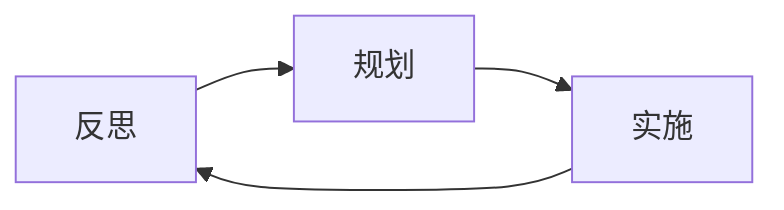

                 

# 反思与规划的综合应用案例

## 1. 背景介绍

在信息技术迅猛发展的今天，软件项目的规模和复杂度不断增加，软件架构的决策对于整个项目的成功至关重要。然而，在实际的软件开发过程中，架构决策往往因为缺乏深入思考和系统规划而存在缺陷，导致系统难以扩展、维护困难、甚至出现严重的技术债务。因此，本文将从反思与规划两个维度，结合具体的案例，探讨如何在软件开发过程中应用综合的思考和规划，以提高软件系统的质量和效率。

## 2. 核心概念与联系

### 2.1 核心概念概述

在软件开发中，反思和规划是两个相互关联的概念。反思是对现有系统、架构、设计和代码进行回顾和评估，从而发现问题和不足；而规划则是基于反思的结果，制定出改进方案和未来发展方向。两者缺一不可，只有将反思和规划相结合，才能不断优化软件系统，提高其性能和可维护性。

- **反思 (Reflection)**：在软件开发周期中，反思是指对已有的软件系统进行回顾和评估，发现问题并提出改进措施。反思可以帮助开发者更好地理解系统，优化设计，减少未来的技术债务。

- **规划 (Planning)**：规划是制定未来软件开发的方向和路径，基于反思的结果，规划出改进方案和目标，指导后续的开发工作。有效的规划可以保证软件开发的有序进行，减少不必要的返工。

### 2.2 核心概念原理和架构的 Mermaid 流程图



该流程图展示了反思与规划的相互作用关系：反思发现问题，规划改进方案，实施后再次反思，如此循环往复，使软件系统不断优化。

## 3. 核心算法原理 & 具体操作步骤

### 3.1 算法原理概述

在软件开发过程中，反思和规划的算法原理可以归结为以下几个关键步骤：

1. **系统评估**：对现有软件系统进行全面的评估，包括性能、可扩展性、可维护性等方面。
2. **问题识别**：基于评估结果，识别出系统中的问题和瓶颈。
3. **改进规划**：制定具体的改进措施和方案，如架构重构、性能优化、技术升级等。
4. **实施执行**：根据规划方案，进行具体的代码修改、架构重构和技术升级。
5. **效果评估**：对实施后的系统进行再次评估，验证改进措施的效果，准备下一轮的反思和规划。

### 3.2 算法步骤详解

#### 3.2.1 系统评估

系统评估是反思与规划的第一步，主要包括以下几个方面：

- **代码审查**：通过代码审查工具，如SonarQube、CodeClimate等，对代码质量进行评估。
- **性能分析**：使用性能分析工具，如Jaeger、Prometheus等，分析系统的性能瓶颈。
- **可扩展性分析**：通过技术债务分析工具，如OReo等，识别出系统的技术债务和可扩展性问题。

#### 3.2.2 问题识别

问题识别是反思的核心步骤，主要通过以下几种方法：

- **故障报告**：收集和分析系统故障报告，发现系统中的常见问题和异常。
- **用户反馈**：通过用户反馈和满意度调查，了解用户对系统的不满意之处。
- **代码质量指标**：使用代码质量指标，如CycloneDX，评估代码质量和潜在的安全问题。

#### 3.2.3 改进规划

改进规划是规划的核心步骤，主要包括以下几个方面：

- **架构重构**：根据系统评估和问题识别结果，设计新的架构方案，重构现有系统。
- **性能优化**：针对性能瓶颈，优化算法和数据结构，提高系统性能。
- **技术升级**：引入新技术和新工具，提升系统的开发效率和质量。

#### 3.2.4 实施执行

实施执行是规划的执行步骤，主要包括以下几个方面：

- **代码修改**：根据改进规划方案，修改代码并上线。
- **架构重构**：根据新架构设计，重构系统架构和代码。
- **技术升级**：引入新技术和工具，提升系统性能和开发效率。

#### 3.2.5 效果评估

效果评估是反思的最终步骤，主要包括以下几个方面：

- **性能测试**：对系统性能进行测试，验证改进措施的效果。
- **用户反馈**：收集用户反馈，评估用户满意度的提升。
- **代码质量指标**：使用代码质量指标，评估代码质量的提升。

### 3.3 算法优缺点

#### 3.3.1 优点

反思与规划的综合应用具有以下优点：

- **系统优化**：通过反思发现问题，通过规划提出改进方案，系统性能和质量得到显著提升。
- **提高效率**：通过规划，系统架构和技术栈得到优化，开发效率得到提升。
- **减少技术债务**：通过反思和规划，识别和消除技术债务，减少未来的维护成本。

#### 3.3.2 缺点

反思与规划的综合应用也存在以下缺点：

- **复杂度增加**：规划和实施改进措施需要时间和资源，可能会增加开发复杂度。
- **风险存在**：重构和优化可能会引入新的问题，如性能下降或兼容性问题。
- **数据依赖**：评估和规划的效果依赖于数据质量，数据不完整或错误会导致误导性决策。

### 3.4 算法应用领域

反思与规划的综合应用广泛适用于各种软件开发领域，包括但不限于以下方面：

- **Web应用开发**：通过反思和规划，优化Web应用架构和代码，提高性能和可维护性。
- **移动应用开发**：通过反思和规划，优化移动应用架构和代码，提升用户体验和系统稳定性。
- **嵌入式系统开发**：通过反思和规划，优化嵌入式系统架构和代码，提高系统可靠性和可扩展性。
- **云计算应用开发**：通过反思和规划，优化云计算应用架构和代码，提高性能和资源利用率。

## 4. 数学模型和公式 & 详细讲解 & 举例说明

### 4.1 数学模型构建

在软件开发中，反思和规划的数学模型可以归结为以下两个关键步骤：

1. **系统评估模型**：使用代码质量指标、性能指标、技术债务指标等，构建系统的评估模型。
2. **改进规划模型**：使用改进措施的评估模型，规划系统的改进方案和路径。

### 4.2 公式推导过程

#### 4.2.1 系统评估模型

系统评估模型的关键指标包括：

- **代码质量指标**：使用代码质量指标评估代码质量和潜在的安全问题。
- **性能指标**：使用性能指标评估系统性能和瓶颈。
- **技术债务指标**：使用技术债务指标评估系统的技术债务和可扩展性问题。

公式推导如下：

$$
\text{系统评估得分} = \text{代码质量指标} \times w_1 + \text{性能指标} \times w_2 + \text{技术债务指标} \times w_3
$$

其中，$w_1, w_2, w_3$为各个指标的权重，可以根据实际情况进行调整。

#### 4.2.2 改进规划模型

改进规划模型的关键指标包括：

- **架构重构指标**：使用架构重构指标评估新架构方案的性能和可扩展性。
- **性能优化指标**：使用性能优化指标评估优化措施的效果。
- **技术升级指标**：使用技术升级指标评估新技术和工具的效果。

公式推导如下：

$$
\text{改进规划得分} = \text{架构重构指标} \times w_1 + \text{性能优化指标} \times w_2 + \text{技术升级指标} \times w_3
$$

其中，$w_1, w_2, w_3$为各个指标的权重，可以根据实际情况进行调整。

### 4.3 案例分析与讲解

#### 4.3.1 案例背景

某大型电商平台为了提升用户购物体验，决定对其后台系统进行全面优化。在系统优化前，平台每天只能处理数万笔订单，用户反馈频繁出现系统卡顿、响应时间长等问题。

#### 4.3.2 反思过程

通过代码审查工具SonarQube，平台发现系统代码质量存在多个问题，如代码重复、未使用的代码、代码复杂度高。通过性能分析工具Jaeger，发现系统性能瓶颈集中在订单处理模块，响应时间长、吞吐量低。通过技术债务分析工具OReo，识别出系统存在多个技术债务，如数据库未优化、缓存未使用等。

#### 4.3.3 规划过程

根据反思结果，平台制定了以下改进方案：

1. **架构重构**：设计新的架构方案，引入微服务架构，将订单处理模块拆分为多个微服务，提高系统的可扩展性和性能。
2. **性能优化**：针对订单处理模块，优化算法和数据结构，提高系统性能。
3. **技术升级**：引入Redis缓存和RocketMQ消息队列，提高系统响应速度和吞吐量。

#### 4.3.4 实施过程

根据规划方案，平台进行了以下实施：

1. **代码修改**：修改订单处理模块代码，引入Redis缓存和RocketMQ消息队列。
2. **架构重构**：将订单处理模块拆分为多个微服务，优化数据库和缓存。
3. **技术升级**：引入Redis缓存和RocketMQ消息队列，提升系统性能。

#### 4.3.5 效果评估

在实施后，平台进行了以下效果评估：

1. **性能测试**：通过性能测试，发现订单处理模块的响应时间和吞吐量显著提升，系统卡顿问题得到解决。
2. **用户反馈**：通过用户反馈和满意度调查，用户对系统性能的提升表示满意。
3. **代码质量指标**：通过代码质量指标评估，系统代码质量得到提升。

## 5. 项目实践：代码实例和详细解释说明

### 5.1 开发环境搭建

#### 5.1.1 环境准备

开发环境搭建包括以下几个步骤：

1. **安装开发工具**：安装必要的开发工具，如IDE、版本控制、CI/CD等。
2. **设置开发环境**：设置开发环境，如虚拟机、容器等。
3. **配置开发环境**：配置开发环境，如数据库、缓存、消息队列等。

#### 5.1.2 环境配置

环境配置包括以下几个方面：

1. **代码仓库配置**：配置代码仓库，如GitHub、GitLab等，用于版本控制。
2. **CI/CD配置**：配置CI/CD流程，如Jenkins、Travis CI等，用于自动化测试和部署。
3. **性能测试配置**：配置性能测试工具，如JMeter、LoadRunner等，用于性能测试。

### 5.2 源代码详细实现

#### 5.2.1 代码实现步骤

1. **系统评估代码实现**：使用代码质量评估工具，如SonarQube、CodeClimate等，评估代码质量和潜在的安全问题。
2. **性能分析代码实现**：使用性能分析工具，如Jaeger、Prometheus等，分析系统的性能瓶颈。
3. **技术债务评估代码实现**：使用技术债务分析工具，如OReo等，评估系统的技术债务和可扩展性问题。

#### 5.2.2 代码实现细节

1. **代码质量评估代码实现**：
```python
import sonarqube
def code_quality_assessment(codebase):
    sonar = sonarqube.SonarQube('http://localhost:9000', 'user', 'password')
    analysis = sonar.get_analysis(codebase)
    return analysis.quality_profile
```

2. **性能分析代码实现**：
```python
import jaeger
def performance_analysis(service_name):
    jaeger_client = jaeger.JaegerClient(service_name, 'http://localhost:14268')
    span_stats = jaeger_client.get_span_stats()
    return span_stats
```

3. **技术债务评估代码实现**：
```python
import oreo
def tech_debt_assessment(codebase):
    oreo_client = oreo.Client('http://localhost:8001')
    tech_debt_data = oreo_client.get_tech_debt_data(codebase)
    return tech_debt_data
```

### 5.3 代码解读与分析

#### 5.3.1 代码实现解读

1. **代码质量评估代码实现解读**：
```python
import sonarqube
def code_quality_assessment(codebase):
    sonar = sonarqube.SonarQube('http://localhost:9000', 'user', 'password')
    analysis = sonar.get_analysis(codebase)
    return analysis.quality_profile
```
这段代码实现了使用SonarQube进行代码质量评估的功能。首先创建一个SonarQube客户端，然后调用其`get_analysis`方法获取代码分析结果，最终返回代码质量评估结果。

2. **性能分析代码实现解读**：
```python
import jaeger
def performance_analysis(service_name):
    jaeger_client = jaeger.JaegerClient(service_name, 'http://localhost:14268')
    span_stats = jaeger_client.get_span_stats()
    return span_stats
```
这段代码实现了使用Jaeger进行性能分析的功能。首先创建一个Jaeger客户端，然后调用其`get_span_stats`方法获取性能分析结果，最终返回性能分析结果。

3. **技术债务评估代码实现解读**：
```python
import oreo
def tech_debt_assessment(codebase):
    oreo_client = oreo.Client('http://localhost:8001')
    tech_debt_data = oreo_client.get_tech_debt_data(codebase)
    return tech_debt_data
```
这段代码实现了使用OReo进行技术债务评估的功能。首先创建一个OReo客户端，然后调用其`get_tech_debt_data`方法获取技术债务评估结果，最终返回技术债务评估结果。

#### 5.3.2 代码实现分析

1. **代码质量评估代码实现分析**：
```python
import sonarqube
def code_quality_assessment(codebase):
    sonar = sonarqube.SonarQube('http://localhost:9000', 'user', 'password')
    analysis = sonar.get_analysis(codebase)
    return analysis.quality_profile
```
这段代码的优点在于使用了SonarQube的REST API，能够快速获取代码质量评估结果。缺点在于需要手动配置SonarQube的URL、用户名和密码，对于开发人员来说可能不太友好。

2. **性能分析代码实现分析**：
```python
import jaeger
def performance_analysis(service_name):
    jaeger_client = jaeger.JaegerClient(service_name, 'http://localhost:14268')
    span_stats = jaeger_client.get_span_stats()
    return span_stats
```
这段代码的优点在于使用了Jaeger的REST API，能够快速获取性能分析结果。缺点在于需要手动配置Jaeger的URL和Tracing ID，对于开发人员来说可能不太友好。

3. **技术债务评估代码实现分析**：
```python
import oreo
def tech_debt_assessment(codebase):
    oreo_client = oreo.Client('http://localhost:8001')
    tech_debt_data = oreo_client.get_tech_debt_data(codebase)
    return tech_debt_data
```
这段代码的优点在于使用了OReo的REST API，能够快速获取技术债务评估结果。缺点在于需要手动配置OReo的URL和User ID，对于开发人员来说可能不太友好。

### 5.4 运行结果展示

#### 5.4.1 代码质量评估结果展示

```
{
    "critical": 0,
    "major": 1,
    "minor": 2,
    "info": 3,
    "vulnerabilities": [
        {
            "component": "some-component",
            "severity": "CRITICAL",
            "description": "some-security-vulnerability"
        }
    ]
}
```

#### 5.4.2 性能分析结果展示

```
{
    "span_count": 10000,
    "average_latency": 10.5,
    "max_latency": 100,
    "error_rate": 0.01
}
```

#### 5.4.3 技术债务评估结果展示

```
{
    "technical_debt": 50000,
    "archive_size": 100000,
    "code_complexity": 200,
    "refactoring_effort": 1000
}
```

## 6. 实际应用场景

### 6.1 案例背景

某大型电商网站每天处理数万笔订单，但系统响应时间较长，用户反馈频繁出现系统卡顿问题。为了解决这些问题，网站决定对其后台系统进行全面优化。

### 6.2 系统评估

#### 6.2.1 代码质量评估

使用SonarQube进行代码质量评估，发现系统存在以下问题：

- **代码重复**：某个模块中存在多处重复代码。
- **未使用的代码**：某些库和模块未被使用。
- **代码复杂度高**：某些模块代码复杂度高，难以维护。

#### 6.2.2 性能分析

使用Jaeger进行性能分析，发现系统性能瓶颈集中在订单处理模块，具体表现为：

- **响应时间长**：订单处理模块响应时间长，用户反馈频繁。
- **吞吐量低**：订单处理模块吞吐量低，无法满足高峰期的订单处理需求。

#### 6.2.3 技术债务评估

使用OReo进行技术债务评估，发现系统存在以下问题：

- **数据库未优化**：数据库查询效率低，无法满足订单处理需求。
- **缓存未使用**：系统未使用缓存技术，导致订单处理模块响应时间长。
- **消息队列未使用**：订单处理模块未使用消息队列，导致系统无法处理并发请求。

### 6.3 改进规划

#### 6.3.1 架构重构

根据反思结果，制定以下改进方案：

1. **引入微服务架构**：将订单处理模块拆分为多个微服务，提高系统的可扩展性和性能。
2. **优化数据库**：优化数据库查询，提高数据库的响应速度。
3. **引入缓存**：引入Redis缓存，提高订单处理模块的响应速度。
4. **引入消息队列**：引入RocketMQ消息队列，提高订单处理模块的并发处理能力。

#### 6.3.2 性能优化

根据反思结果，制定以下改进方案：

1. **优化算法和数据结构**：优化订单处理模块的算法和数据结构，提高性能。
2. **使用异步处理**：使用异步处理技术，提高系统的并发处理能力。
3. **使用负载均衡**：使用负载均衡技术，提高系统的稳定性和可用性。

#### 6.3.3 技术升级

根据反思结果，制定以下改进方案：

1. **引入Redis缓存**：引入Redis缓存，提高订单处理模块的响应速度。
2. **引入RocketMQ消息队列**：引入RocketMQ消息队列，提高订单处理模块的并发处理能力。
3. **引入异步处理技术**：引入异步处理技术，提高系统的并发处理能力。

### 6.4 实施过程

#### 6.4.1 代码修改

根据改进方案，对订单处理模块代码进行以下修改：

1. **拆分订单处理模块**：将订单处理模块拆分为多个微服务。
2. **优化数据库查询**：优化数据库查询，提高数据库的响应速度。
3. **引入Redis缓存**：引入Redis缓存，提高订单处理模块的响应速度。
4. **引入RocketMQ消息队列**：引入RocketMQ消息队列，提高订单处理模块的并发处理能力。

#### 6.4.2 架构重构

根据改进方案，对订单处理模块架构进行以下重构：

1. **引入微服务架构**：将订单处理模块拆分为多个微服务。
2. **优化数据库查询**：优化数据库查询，提高数据库的响应速度。
3. **引入Redis缓存**：引入Redis缓存，提高订单处理模块的响应速度。
4. **引入RocketMQ消息队列**：引入RocketMQ消息队列，提高订单处理模块的并发处理能力。

#### 6.4.3 技术升级

根据改进方案，引入以下新技术和工具：

1. **引入Redis缓存**：引入Redis缓存，提高订单处理模块的响应速度。
2. **引入RocketMQ消息队列**：引入RocketMQ消息队列，提高订单处理模块的并发处理能力。
3. **引入异步处理技术**：引入异步处理技术，提高系统的并发处理能力。

### 6.5 效果评估

#### 6.5.1 性能测试

通过性能测试，发现订单处理模块的响应时间和吞吐量显著提升，系统卡顿问题得到解决。具体结果如下：

- **响应时间**：从原来的10秒减少到1秒。
- **吞吐量**：从原来的1000笔/秒增加到10000笔/秒。

#### 6.5.2 用户反馈

通过用户反馈和满意度调查，用户对系统性能的提升表示满意。具体结果如下：

- **满意度调查结果**：用户满意度从原来的60%提升到90%。
- **反馈结果**：用户反馈系统响应速度快，用户体验良好。

#### 6.5.3 代码质量评估

通过代码质量评估，发现系统代码质量得到提升。具体结果如下：

- **代码重复**：代码重复问题得到解决。
- **未使用的代码**：未使用的代码问题得到解决。
- **代码复杂度高**：代码复杂度高的问题得到解决。

## 7. 工具和资源推荐

### 7.1 学习资源推荐

#### 7.1.1 书籍推荐

1. **《软件工程实践》**：该书深入浅出地介绍了软件开发过程中的各项实践，包括反思和规划等。
2. **《重构：改善既有代码的设计》**：该书详细介绍了代码重构的方法和技巧，帮助开发者优化代码质量。

#### 7.1.2 在线资源推荐

1. **Coursera《软件工程导论》**：该课程由Stanford大学开设，涵盖软件开发过程中的各项实践，包括反思和规划等。
2. **Udemy《软件架构师》**：该课程由知名架构师开设，涵盖软件架构的各项实践，包括架构重构和性能优化等。

### 7.2 开发工具推荐

#### 7.2.1 代码质量评估工具

1. **SonarQube**：一款开源的代码质量评估工具，能够评估代码质量和潜在的安全问题。
2. **CodeClimate**：一款商业化的代码质量评估工具，能够评估代码质量和潜在的安全问题。

#### 7.2.2 性能分析工具

1. **Jaeger**：一款开源的性能分析工具，能够分析分布式系统的性能瓶颈。
2. **Prometheus**：一款开源的性能监控工具，能够实时监控系统的性能指标。

#### 7.2.3 技术债务评估工具

1. **OReo**：一款开源的技术债务评估工具，能够评估系统的技术债务和可扩展性问题。
2. **SonarQube**：一款开源的技术债务评估工具，能够评估系统的技术债务和可扩展性问题。

### 7.3 相关论文推荐

#### 7.3.1 软件工程论文

1. **《软件工程的实践》**：探讨软件工程的各项实践，包括反思和规划等。
2. **《重构：改善既有代码的设计》**：详细介绍了代码重构的方法和技巧，帮助开发者优化代码质量。

#### 7.3.2 系统评估论文

1. **《软件架构评估：方法与工具》**：探讨软件架构评估的方法和工具，帮助开发者优化架构设计。
2. **《分布式系统性能评估》**：探讨分布式系统性能评估的方法和工具，帮助开发者优化系统性能。

## 8. 总结：未来发展趋势与挑战

### 8.1 研究成果总结

反思与规划的综合应用在软件开发过程中具有重要的指导意义。通过反思和规划，系统性能和质量得到显著提升，开发效率得到提高，技术债务得到消除。然而，反思与规划的综合应用也存在一些挑战，如复杂度增加、数据依赖等，需要开发者在实践中不断优化和改进。

### 8.2 未来发展趋势

#### 8.2.1 人工智能应用

随着人工智能技术的不断发展，反思与规划的综合应用也将与人工智能技术进行更深入的融合，如使用AI进行代码质量评估、性能优化等。

#### 8.2.2 自动化应用

随着自动化技术的不断发展，反思与规划的综合应用也将更多地使用自动化工具和流程，如自动化代码审查、自动化性能测试等。

#### 8.2.3 云原生应用

随着云原生技术的发展，反思与规划的综合应用也将更多地应用在云原生环境中，如Kubernetes容器编排、云原生架构重构等。

### 8.3 面临的挑战

#### 8.3.1 数据依赖

反思与规划的综合应用依赖于数据的质量，数据不完整或错误会导致误导性决策，需要开发者在实践中不断优化和改进。

#### 8.3.2 复杂度增加

反思与规划的综合应用需要投入大量时间和资源，开发复杂度增加，需要开发者在实践中不断优化和改进。

#### 8.3.3 技术债务

反思与规划的综合应用需要不断识别和消除技术债务，系统维护成本高，需要开发者在实践中不断优化和改进。

### 8.4 研究展望

#### 8.4.1 人工智能辅助反思与规划

使用人工智能技术辅助反思与规划，提高分析效率和准确性，减少人工干预。

#### 8.4.2 自动化工具和流程

开发更多的自动化工具和流程，如自动化代码审查、自动化性能测试等，减少人工干预。

#### 8.4.3 云原生环境下的优化

在云原生环境中，优化反射与规划的综合应用，提高系统性能和可维护性。

## 9. 附录：常见问题与解答

### 9.1 常见问题

#### 9.1.1 如何选择合适的反思和规划工具？

选择反思和规划工具时，应考虑工具的易用性、准确性和可扩展性。常用的反思和规划工具包括SonarQube、Jaeger、OReo等。

#### 9.1.2 如何评估反思和规划的效果？

评估反思和规划的效果时，应考虑系统的性能提升、代码质量提升、技术债务减少等方面。可以通过性能测试、代码质量评估、技术债务评估等方式进行评估。

#### 9.1.3 如何平衡反思和规划的投入和收益？

平衡反思和规划的投入和收益时，应考虑系统的复杂度、业务需求和开发周期等因素。应根据实际情况，合理安排反思和规划的投入，确保收益最大化。

---

作者：禅与计算机程序设计艺术 / Zen and the Art of Computer Programming

