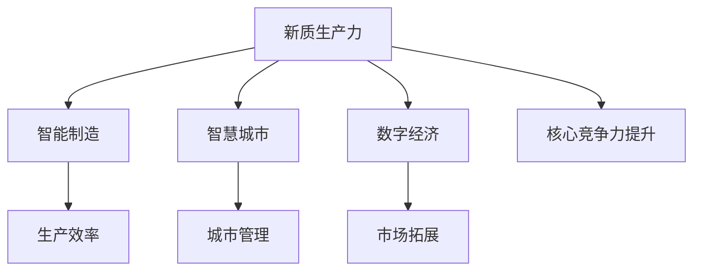

                 

# 发展新质生产力提高核心竞争力

> 关键词：新质生产力,人工智能,核心竞争力,智能制造,产业升级,数字化转型,智慧城市,数字经济

## 1. 背景介绍

### 1.1 问题由来
随着科技的快速发展和全球经济形势的变化，如何在新时代背景下保持和提升企业的核心竞争力，成为全球企业共同关注的话题。在工业4.0时代，机器人和人工智能等新兴技术的应用，推动了制造和服务业的数字化转型，催生了新质生产力（即新生产要素驱动的创新型生产力）。新质生产力不仅涵盖了传统的机械力、能源和劳动力，还包括了计算力、数据力、算力等新型生产要素，为社会经济的发展注入了新的动力。然而，这一新兴生产力的崛起，也带来了新的挑战，如人才短缺、技术更新速度快等。本文将重点讨论如何利用新质生产力，提升企业的核心竞争力。

### 1.2 问题核心关键点
企业如何通过智能制造、智慧城市等项目应用新质生产力，实现生产效率的提升、成本的降低和市场的拓展，成为当前的热点问题。本文将从新质生产力的定义、特征、构成和实践应用等角度，深入探讨其对企业核心竞争力的影响，并提出具体策略建议。

## 2. 核心概念与联系

### 2.1 核心概念概述

为更好地理解新质生产力与企业核心竞争力的关系，本节将介绍几个关键概念：

- **新质生产力（New Form of Productive Forces）**：指以计算力、数据力、算力等为核心生产要素，驱动生产过程实现智能化、自动化、个性化、协同化的新型生产力。新质生产力能够极大提升生产效率，降低成本，推动经济社会的全面转型。

- **核心竞争力（Core Competitive Advantage）**：指企业独特的、不易被复制的资源、技能、知识、文化等，这些要素共同作用，使企业在市场上拥有持续的竞争优势。核心竞争力的提升，是企业长期发展的关键。

- **智能制造（Smart Manufacturing）**：融合物联网、人工智能、大数据等新兴技术，实现生产流程的自动化、智能化和信息集成化。智能制造能够显著提高生产效率，降低能源消耗，提升产品质量。

- **智慧城市（Smart City）**：利用云计算、大数据、物联网等技术，提升城市管理的智能化、精细化水平，改善居民生活质量。智慧城市建设，对城市的可持续发展具有重要意义。

- **数字经济（Digital Economy）**：以数字技术为核心，推动经济发展方式的转变，包括互联网、电子商务、移动支付等新兴业态。数字经济的发展，对提升企业竞争力具有重要推动作用。

这些概念之间的联系，可以通过以下Mermaid流程图来展示：



这个流程图展示了新质生产力与相关概念之间的内在联系：新质生产力通过智能制造、智慧城市、数字经济等具体应用场景，提升生产效率、城市管理水平和市场拓展能力，最终达到核心竞争力的提升。

## 3. 核心算法原理 & 具体操作步骤
### 3.1 算法原理概述

新质生产力的核心是利用先进的计算力、数据力和算力，实现生产过程的智能化、自动化和协同化。其主要原理包括：

- **计算力**：通过高速计算机和高性能算力，实现海量数据的处理和计算。
- **数据力**：通过大数据技术，收集、存储和分析生产过程中的各种数据，为生产决策提供支持。
- **算力**：通过人工智能算法，对生产数据进行深度学习，提取关键信息，优化生产流程。

新质生产力的应用，一般通过以下步骤实现：

1. **数据收集**：采集生产过程中产生的各种数据，包括设备状态、原材料信息、产品质量等。
2. **数据清洗与处理**：对数据进行清洗、去噪、归一化等预处理操作，确保数据质量。
3. **数据建模**：利用机器学习算法，对处理后的数据进行建模，提取关键特征。
4. **智能决策**：通过优化算法，实现生产过程的智能化决策和控制。
5. **效果评估与优化**：对智能决策的效果进行评估，不断优化算法和模型，提升生产效率和产品质量。

### 3.2 算法步骤详解

新质生产力的实施步骤主要包括：

**Step 1: 数据收集与清洗**
- 使用传感器、RFID标签等设备，采集生产过程中的各种数据。
- 对数据进行清洗、去噪、归一化等处理，确保数据的准确性和一致性。

**Step 2: 数据建模与分析**
- 对清洗后的数据进行建模，提取关键特征。常用的建模算法包括线性回归、决策树、随机森林、深度学习等。
- 利用数据可视化工具，分析数据特征，识别生产过程中的关键问题。

**Step 3: 智能决策与控制**
- 通过优化算法，实现生产过程的智能化决策和控制。常用的优化算法包括遗传算法、粒子群算法、强化学习等。
- 部署智能控制系统，实现生产流程的自动化和智能化。

**Step 4: 效果评估与优化**
- 对智能决策的效果进行评估，包括生产效率、成本、质量等指标。
- 根据评估结果，不断优化算法和模型，提升生产效率和产品质量。

### 3.3 算法优缺点

新质生产力的优点包括：

- **高效性**：能够显著提高生产效率，降低成本，提升产品质量。
- **灵活性**：可以根据生产需要，灵活调整生产计划和控制策略。
- **智能化**：通过智能算法和决策，实现生产过程的智能化和协同化。

新质生产力的缺点包括：

- **初始投资高**：需要投入大量的硬件设备和软件系统，初期成本较高。
- **技术要求高**：对企业的数据处理能力和技术积累有较高要求。
- **依赖性强**：对数据质量和算力要求较高，一旦数据或算力出现问题，可能影响生产效率。

### 3.4 算法应用领域

新质生产力的应用领域广泛，主要包括以下几个方面：

- **智能制造**：在生产过程中，利用传感器、物联网、大数据等技术，实现生产流程的智能化和自动化。
- **智慧城市**：在城市管理中，利用云计算、物联网、大数据等技术，实现城市管理的智能化和精细化。
- **数字经济**：在电子商务、移动支付、金融科技等领域，利用大数据、人工智能等技术，实现业务的数字化和智能化。

## 4. 数学模型和公式 & 详细讲解  
### 4.1 数学模型构建

新质生产力的应用，往往依赖于数据建模和算法优化，因此本节将对数据建模和算法优化进行数学建模和公式推导。

假设生产过程生成的数据序列为 $\{x_i\}_{i=1}^N$，其中 $x_i \in \mathbb{R}^d$。为了提高生产效率，需要对数据进行建模，使用机器学习算法预测生产过程中的关键指标。

定义模型为 $f: \mathbb{R}^d \rightarrow \mathbb{R}$，表示输入数据到关键指标的映射关系。假设训练集为 $D=\{(x_i, y_i)\}_{i=1}^N, x_i \in \mathbb{R}^d, y_i \in \mathbb{R}$，其中 $y_i$ 为生产过程中的关键指标。

定义模型的损失函数为 $\mathcal{L}(f)=\frac{1}{N}\sum_{i=1}^N (f(x_i)-y_i)^2$，表示模型预测值与真实值之间的误差平方和。

### 4.2 公式推导过程

为了最小化损失函数 $\mathcal{L}(f)$，需要对模型 $f$ 进行优化。假设 $f$ 使用线性回归模型，即 $f(x)=\theta^Tx$，其中 $\theta \in \mathbb{R}^d$ 为模型参数。

将 $f(x)$ 代入损失函数，得：

$$
\mathcal{L}(\theta)=\frac{1}{N}\sum_{i=1}^N (y_i - \theta^T x_i)^2
$$

为了求解 $\theta$，使用梯度下降算法，得：

$$
\theta \leftarrow \theta - \alpha \nabla_{\theta}\mathcal{L}(\theta)
$$

其中 $\alpha$ 为学习率。

### 4.3 案例分析与讲解

假设某智能制造企业，通过传感器采集生产过程中的设备状态数据 $x_i$，包括设备温度、振动、电流等，并使用机器学习算法预测生产效率 $y_i$。

**Step 1: 数据收集与清洗**
- 使用传感器采集设备状态数据 $x_i$。
- 对数据进行清洗、去噪、归一化等处理，确保数据质量。

**Step 2: 数据建模与分析**
- 使用线性回归模型对设备状态数据进行建模，提取关键特征。
- 利用数据可视化工具，分析数据特征，识别生产过程中的关键问题。

**Step 3: 智能决策与控制**
- 通过优化算法，实现生产过程的智能化决策和控制。
- 部署智能控制系统，实现生产流程的自动化和智能化。

**Step 4: 效果评估与优化**
- 对智能决策的效果进行评估，包括生产效率、成本、质量等指标。
- 根据评估结果，不断优化算法和模型，提升生产效率和产品质量。

## 5. 项目实践：代码实例和详细解释说明
### 5.1 开发环境搭建

在进行新质生产力项目实践前，我们需要准备好开发环境。以下是使用Python进行TensorFlow开发的环境配置流程：

1. 安装Anaconda：从官网下载并安装Anaconda，用于创建独立的Python环境。

2. 创建并激活虚拟环境：
```bash
conda create -n tf-env python=3.8 
conda activate tf-env
```

3. 安装TensorFlow：根据CUDA版本，从官网获取对应的安装命令。例如：
```bash
conda install tensorflow -c conda-forge -c pypi
```

4. 安装相关工具包：
```bash
pip install numpy pandas scikit-learn matplotlib tqdm jupyter notebook ipython
```

完成上述步骤后，即可在`tf-env`环境中开始新质生产力项目的开发。

### 5.2 源代码详细实现

以下是一个简单的线性回归模型代码实现，用于预测生产效率：

```python
import tensorflow as tf
import numpy as np
from sklearn.model_selection import train_test_split
from sklearn.metrics import mean_squared_error

# 构造数据集
x = np.random.randn(100, 10)
y = np.dot(x, [1, 2, 3]) + np.random.randn(100)

# 划分训练集和测试集
x_train, x_test, y_train, y_test = train_test_split(x, y, test_size=0.2)

# 定义模型
model = tf.keras.Sequential([
    tf.keras.layers.Dense(64, activation='relu', input_shape=(10,)),
    tf.keras.layers.Dense(1)
])

# 编译模型
model.compile(optimizer=tf.keras.optimizers.Adam(0.01), loss='mse')

# 训练模型
model.fit(x_train, y_train, epochs=100, batch_size=32, validation_split=0.2)

# 测试模型
y_pred = model.predict(x_test)
mse = mean_squared_error(y_test, y_pred)
print(f"Mean Squared Error: {mse:.4f}")
```

### 5.3 代码解读与分析

这里我们详细解读一下关键代码的实现细节：

**数据构造与划分**：
- 使用NumPy生成随机数据 $x$ 和 $y$。
- 使用Scikit-Learn的train_test_split函数，将数据划分为训练集和测试集。

**模型定义与编译**：
- 定义一个包含两个Dense层的神经网络模型。
- 使用Adam优化器和均方误差损失函数编译模型。

**模型训练与评估**：
- 使用fit函数对模型进行训练，并设置训练轮数和批次大小。
- 在测试集上评估模型性能，使用均方误差作为评价指标。

可以看到，TensorFlow提供了简单易用的API，方便开发者快速搭建和训练模型。在实际应用中，还需要根据具体任务进行模型架构的优化和超参数的调优。

## 6. 实际应用场景
### 6.1 智能制造

智能制造是利用新质生产力提升生产效率的重要应用场景。通过在生产过程中部署传感器、物联网设备，采集设备状态数据，并进行数据建模和智能决策，可以显著提升生产效率和产品质量。

**案例分析**：某智能制造企业通过在生产线上部署温度、振动、电流传感器，采集设备状态数据，并使用机器学习算法预测生产效率。模型通过数据可视化工具分析数据特征，识别生产过程中的关键问题，优化生产流程，实现了生产效率的提升。

### 6.2 智慧城市

智慧城市建设也是新质生产力的重要应用领域。通过云计算、大数据、物联网等技术，可以实现城市管理的智能化和精细化。

**案例分析**：某智慧城市项目通过部署传感器、摄像头、智能路灯等设备，收集城市运行数据，并进行数据分析和智能决策，优化城市管理，提升了城市运行的效率和安全性。

### 6.3 数字经济

数字经济的发展，也离不开新质生产力的支持。通过大数据、人工智能等技术，可以实现业务的数字化和智能化，推动经济转型升级。

**案例分析**：某电商平台通过使用机器学习算法对用户行为进行建模，预测用户购买意向，优化推荐算法，提高了用户转化率和平台销量。

### 6.4 未来应用展望

未来，新质生产力将进一步扩展应用场景，推动更多行业的数字化转型。

- **能源领域**：通过智能电网、智能调度等技术，提高能源的利用效率和稳定性。
- **医疗领域**：利用大数据和人工智能技术，提升医疗诊断和治疗效果。
- **农业领域**：通过智能农业、精准农业等技术，提高农业生产效率和可持续发展能力。

## 7. 工具和资源推荐
### 7.1 学习资源推荐

为了帮助开发者系统掌握新质生产力的理论基础和实践技巧，这里推荐一些优质的学习资源：

1. **《深度学习》**（Ian Goodfellow 著）：深入浅出地介绍了深度学习的基本原理和算法，包括线性回归、神经网络等基础概念。

2. **TensorFlow官方文档**：TensorFlow官方文档提供了详细的API介绍和示例代码，是学习和实践TensorFlow的必备资源。

3. **Kaggle数据竞赛平台**：Kaggle平台提供了丰富的数据集和挑战赛，有助于开发者实践数据建模和机器学习算法。

4. **Coursera《机器学习》课程**（Andrew Ng 主讲）：斯坦福大学开设的机器学习课程，系统介绍了机器学习的基本概念和算法。

5. **《Python深度学习》**（Francois Chollet 著）：介绍了TensorFlow和Keras等深度学习框架的使用，适合实践学习。

通过对这些资源的学习实践，相信你一定能够快速掌握新质生产力的精髓，并用于解决实际的工业生产、城市管理和数字经济等问题。

### 7.2 开发工具推荐

高效的开发离不开优秀的工具支持。以下是几款用于新质生产力项目开发的常用工具：

1. **TensorFlow**：基于Python的开源深度学习框架，支持动态图和静态图，适合快速迭代研究。

2. **Keras**：由Francois Chollet开发的高层次深度学习框架，提供了简单易用的API，适合快速开发原型。

3. **Jupyter Notebook**：一个交互式的开发环境，支持代码和文档的混合编辑，方便分享和协作。

4. **JupyterLab**：一个基于Web的开发环境，支持集成多种编辑器和扩展，适合远程协作和项目管理。

5. **PyCharm**：一个集成开发环境，支持Python和TensorFlow等深度学习框架的调试和部署。

合理利用这些工具，可以显著提升新质生产力项目的开发效率，加快创新迭代的步伐。

### 7.3 相关论文推荐

新质生产力的发展源于学界的持续研究。以下是几篇奠基性的相关论文，推荐阅读：

1. **《深度学习》（Ian Goodfellow 著）**：介绍了深度学习的基本原理和算法，包括线性回归、神经网络等基础概念。

2. **《TensorFlow》（Martín Abadi 等著）**：介绍了TensorFlow的架构和使用方法，适合学习和实践TensorFlow。

3. **《Keras: Fast, flexible, and scalable deep learning with TensorFlow》（Francois Chollet 等著）**：介绍了Keras的架构和使用方法，适合学习和实践Keras。

4. **《Deep Learning with Python》（Francois Chollet 著）**：介绍了TensorFlow和Keras等深度学习框架的使用，适合实践学习。

5. **《Deep Learning Specialization》（Andrew Ng 主讲）**（Coursera课程）：斯坦福大学开设的深度学习课程，系统介绍了深度学习的基本概念和算法。

这些论文代表了大规模机器学习和深度学习的发展脉络。通过学习这些前沿成果，可以帮助研究者把握学科前进方向，激发更多的创新灵感。

## 8. 总结：未来发展趋势与挑战

### 8.1 总结

本文对新质生产力与企业核心竞争力的关系进行了全面系统的介绍。首先阐述了新质生产力的定义、特征、构成和实践应用等角度，深入探讨了其对企业核心竞争力的影响，并提出具体策略建议。其次，从新质生产力的应用领域和案例分析等方面，详细讲解了其在智能制造、智慧城市、数字经济等场景下的具体实践，展示了新质生产力的巨大潜力。最后，提供了学习资源、开发工具和相关论文等推荐，力求为读者提供全方位的技术指引。

通过本文的系统梳理，可以看到，新质生产力是推动企业数字化转型的重要引擎，能够显著提升生产效率和市场竞争力。未来，伴随技术的不断进步，新质生产力将在更多领域发挥重要作用，成为驱动经济社会发展的新动力。

### 8.2 未来发展趋势

展望未来，新质生产力的发展将呈现以下几个趋势：

1. **智能化程度的提升**：新质生产力的智能化程度将进一步提升，实现生产过程的全面自动化和智能化。

2. **跨界融合的深入**：新质生产力将与其他领域的技术进行更深入的融合，如物联网、区块链、5G等，推动技术创新和产业变革。

3. **数据价值的挖掘**：新质生产力将更加重视数据的收集、分析和应用，通过数据挖掘和智能决策，提升生产效率和决策科学性。

4. **可持续发展**：新质生产力将更加注重环保和可持续发展，推动绿色生产和智慧城市建设。

5. **人机协同**：新质生产力将更加注重人机协同，实现机器与人的协作和互补，提升生产效率和用户体验。

这些趋势凸显了新质生产力对未来社会经济的重要影响，具有广阔的应用前景。

### 8.3 面临的挑战

尽管新质生产力的发展前景广阔，但在迈向更加智能化、普适化应用的过程中，它仍面临诸多挑战：

1. **技术更新速度快**：新质生产力依赖于先进的技术支持，技术更新速度快，需要企业持续投入研发资源。

2. **数据安全和隐私**：新质生产力依赖于大规模数据的收集和应用，数据安全和隐私问题将变得尤为突出。

3. **人才短缺**：新质生产力的实施需要跨学科的人才支持，但目前相关人才相对匮乏。

4. **成本高**：新质生产力的实施需要大量的硬件设备和软件系统，初期成本较高。

5. **复杂度高**：新质生产力的实施需要多领域的知识和技术，实施复杂度较高。

这些挑战需要企业和社会共同努力，通过技术创新、人才培养、政策支持等措施，才能克服。

### 8.4 研究展望

新质生产力作为推动经济社会发展的重要引擎，需要进一步研究其应用和推广策略，未来研究可以集中在以下几个方向：

1. **大规模数据治理**：研究如何有效地收集、存储、管理和分析大规模数据，提升数据质量。

2. **智能化决策算法**：研究如何通过机器学习和智能算法，实现生产过程的智能化决策和控制。

3. **跨领域融合**：研究新质生产力与其他领域技术的融合，推动技术创新和产业变革。

4. **可持续发展**：研究新质生产力在环保和可持续发展方面的应用，推动绿色生产和智慧城市建设。

5. **人机协同**：研究新质生产力在提升人机协作和用户体验方面的应用，推动人机协同发展。

这些研究方向的探索，必将引领新质生产力的技术发展，推动企业和社会经济的全面转型。

## 9. 附录：常见问题与解答

**Q1: 新质生产力如何提升企业核心竞争力？**

A: 新质生产力通过计算力、数据力和算力等新型生产要素，实现生产过程的智能化、自动化和协同化，显著提升生产效率和产品质量。通过智能化决策和控制，优化生产流程，降低成本，提升市场竞争力。

**Q2: 新质生产力的实现需要哪些关键步骤？**

A: 新质生产力的实现需要以下关键步骤：数据收集与清洗、数据建模与分析、智能决策与控制、效果评估与优化。通过数据建模和智能算法，实现生产过程的智能化和自动化。

**Q3: 新质生产力的应用领域有哪些？**

A: 新质生产力的应用领域广泛，主要包括以下几个方面：智能制造、智慧城市、数字经济等。通过智能制造实现生产过程的智能化和自动化；通过智慧城市实现城市管理的智能化和精细化；通过数字经济推动业务的数字化和智能化。

**Q4: 新质生产力在实施过程中面临哪些挑战？**

A: 新质生产力的实施面临技术更新速度快、数据安全和隐私问题、人才短缺、成本高、复杂度高等挑战。需要企业和社会共同努力，通过技术创新、人才培养、政策支持等措施，才能克服这些挑战。

**Q5: 如何克服新质生产力的实施挑战？**

A: 通过技术创新、人才培养、政策支持等措施，可以有效克服新质生产力的实施挑战。技术创新可以推动技术进步，人才培养可以补充人才短缺问题，政策支持可以为实施提供保障。

