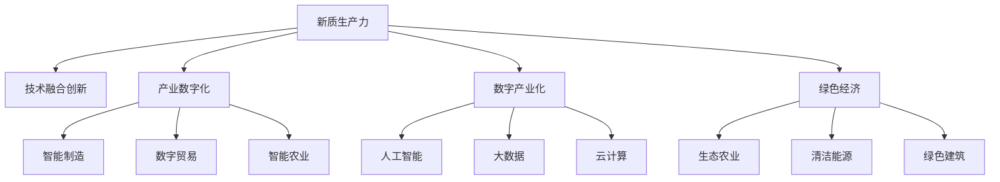

                 

# 发展新质生产力构建特色产业体系

## 1. 背景介绍

### 1.1 问题由来

当前，全球经济正处于深刻的变革期，科技革命和产业变革加速演进。新兴技术如人工智能、大数据、云计算等正在重塑产业生态，推动传统产业向智能化、数字化、绿色化方向转型升级。特别是在新兴制造业、数字经济、绿色经济等“新质生产力”领域，产业数字化、数字产业化正成为提升经济竞争力的重要方向。

然而，产业数字化转型过程中也面临诸多挑战。传统产业改造升级周期长、投入高，尤其是中小微企业数字化转型能力不足、资源匮乏，难以支撑大范围的产业智能化改造。因此，如何构建高效、低成本、易操作的产业数字化解决方案，加速新质生产力形成，成为亟待解决的问题。

### 1.2 问题核心关键点

新质生产力构建的核心在于：

1. **技术融合创新**：将新一代信息技术与传统产业深度融合，开发高附加值、高效率的智能化产品和服务。
2. **数据驱动决策**：通过海量数据的收集与分析，优化生产流程，提升资源配置效率。
3. **协同创新机制**：建立企业、高校、科研院所等多方协同创新平台，推动产学研用深度融合。
4. **产业生态优化**：构建开放、包容、互联互通的产业生态系统，促进产业协同发展。

本文聚焦于新质生产力构建的技术融合创新，特别是通过新一代信息技术推动新兴制造业、数字经济、绿色经济等领域的技术融合和产业升级。

## 2. 核心概念与联系

### 2.1 核心概念概述

为更好地理解新质生产力构建的技术融合创新，本节将介绍几个密切相关的核心概念：

- **新质生产力**：以人工智能、大数据、云计算等为代表的新一代信息技术，与实体经济深度融合，产生的新型生产力形态。主要包括制造业、数字经济、绿色经济等领域。
- **技术融合创新**：将信息技术与传统产业深度融合，开发高附加值、高效率的新型产品和服务。
- **产业数字化**：利用数字化技术，对传统产业进行改造升级，提升生产效率和运营效率。
- **数字产业化**：基于新一代信息技术，形成新的产业链、新业态和新模式。
- **绿色经济**：在经济活动中，注重生态环境保护，实现经济、社会、环境协同发展。

这些核心概念之间的逻辑关系可以通过以下Mermaid流程图来展示：



这个流程图展示新质生产力的核心概念及其之间的关系：

1. 新质生产力通过技术融合创新，形成智能制造、数字贸易、智能农业等多种新型产业形态。
2. 产业数字化和数字产业化为新质生产力提供技术支撑。
3. 绿色经济强调环境保护，是新质生产力发展的重要方向。

这些概念共同构成了新质生产力构建的技术融合创新的框架，使其能够在多个领域推动产业升级和经济发展。

## 3. 核心算法原理 & 具体操作步骤

### 3.1 算法原理概述

新质生产力构建的技术融合创新，本质上是一个多目标优化问题。其核心思想是：通过信息技术与传统产业的深度融合，实现生产过程的智能化、数字化、绿色化，提升产品和服务附加值，优化资源配置，最终形成具有竞争力的新型产业体系。

形式化地，假设需要构建的产业体系为 $B$，其目标函数为：

$$
\max_{A, I} f(A, I) = \sum_{i} \omega_i g_i(A, I)
$$

其中，$A$ 表示产业数字化、智能化等技术融合因素，$I$ 表示信息技术、数据、算法等技术创新因素，$f(A, I)$ 为产业体系的整体价值，$\omega_i$ 为各个目标权重，$g_i(A, I)$ 为每个目标的评价函数。

在实践中，我们通常使用多目标优化算法（如Pareto优化、多目标遗传算法等）来求解上述问题，寻找能够在不同目标间取得平衡的解。

### 3.2 算法步骤详解

新质生产力构建的技术融合创新的一般步骤如下：

**Step 1: 确定产业目标和指标**
- 根据行业特点，确定产业目标（如产值、效率、环境等）和评价指标（如单位能耗、单位产出等）。
- 确定不同目标之间的权重分配，构建多目标优化问题。

**Step 2: 技术评估与选择**
- 对现有技术（如智能制造、云计算、大数据等）进行评估，确定其适用性和成本效益。
- 通过调研、测试等方式，选择最适合目标实现的技术。

**Step 3: 技术融合方案设计**
- 根据目标和选定的技术，设计技术融合方案。
- 确定各技术的融合方式和优先级，设计具体的实施步骤。

**Step 4: 方案实施与优化**
- 根据设计方案，实施技术融合改造，优化生产流程和资源配置。
- 对实施效果进行评估，必要时进行调整和优化。

**Step 5: 效果评估与反馈**
- 对技术融合后的产业体系进行全面评估，计算各目标指标值。
- 根据评估结果，进行反馈和改进，优化后续方案。

### 3.3 算法优缺点

新质生产力构建的技术融合创新方法具有以下优点：

1. **系统性**：通过多目标优化，实现产业整体价值最大化，避免了单一目标导致的片面性。
2. **全局性**：在技术选择和融合方案设计时，综合考虑各目标之间的平衡，实现全局最优。
3. **灵活性**：技术融合方案设计灵活，可以根据产业特点和需求进行定制化调整。
4. **可操作性**：通过具体的技术评估、方案设计、实施优化等步骤，确保技术融合的可行性。

同时，该方法也存在以下局限性：

1. **复杂度高**：多目标优化问题求解复杂，需要综合考虑多方面因素。
2. **数据依赖性强**：需要大量的历史数据和实时数据，才能准确评估技术效果。
3. **成本投入高**：技术融合改造涉及多方面的投入，包括技术研发、设备升级等。
4. **风险因素多**：技术融合过程中可能面临技术风险、市场风险、环境风险等。

尽管存在这些局限性，但就目前而言，多目标优化技术融合创新仍是新质生产力构建的重要手段。未来相关研究的重点在于如何进一步降低多目标优化问题的复杂度，提高数据利用效率，降低技术改造成本，同时兼顾多目标之间的平衡。

### 3.4 算法应用领域

新质生产力构建的技术融合创新方法在多个领域中得到了广泛应用，如：

- **智能制造**：通过物联网、工业互联网、人工智能等技术，改造传统制造流程，实现智能化生产。
- **数字经济**：利用大数据、云计算、区块链等技术，形成数据驱动的商业模式，提升产业链效率。
- **绿色经济**：结合清洁能源、智慧农业、循环经济等技术，推动资源节约和环境友好型产业建设。
- **智慧医疗**：通过云计算、大数据、人工智能等技术，提升医疗服务质量和效率，实现健康管理和个性化医疗。
- **智慧城市**：利用物联网、大数据、人工智能等技术，优化城市管理和服务，提升居民生活质量。

除了上述这些经典领域外，新质生产力构建的技术融合创新还被创新性地应用到更多场景中，如智慧农业、智慧物流、智慧交通等，为经济社会发展注入新的动力。

## 4. 数学模型和公式 & 详细讲解 & 举例说明

### 4.1 数学模型构建

本节将使用数学语言对新质生产力构建的技术融合创新过程进行更加严格的刻画。

假设需要构建的产业体系为 $B$，其目标函数为：

$$
\max_{A, I} f(A, I) = \sum_{i} \omega_i g_i(A, I)
$$

其中，$A$ 表示产业数字化、智能化等技术融合因素，$I$ 表示信息技术、数据、算法等技术创新因素，$f(A, I)$ 为产业体系的整体价值，$\omega_i$ 为各个目标权重，$g_i(A, I)$ 为每个目标的评价函数。

### 4.2 公式推导过程

以下我们以智能制造为例，推导多目标优化问题的求解过程。

假设智能制造的目标函数为：

$$
f(A, I) = w_1 P + w_2 E + w_3 C
$$

其中，$P$ 表示产量，$E$ 表示能源消耗，$C$ 表示生产成本。

智能制造的技术融合方案设计可以表示为：

$$
g_i(A, I) = \left\{
\begin{array}{ll}
a_i A + b_i I & \text{技术融合} \\
c_i A + d_i I & \text{技术创新}
\end{array}
\right.
$$

其中，$a_i, b_i, c_i, d_i$ 为技术融合、技术创新的系数。

求解多目标优化问题的关键是找到一组 $(A, I)$ 值，使得 $f(A, I)$ 最大化。这可以通过Pareto优化等算法实现。

### 4.3 案例分析与讲解

以某智能制造企业为例，其目标函数为：

$$
f(A, I) = 0.5 P + 0.2 E + 0.3 C
$$

其中，$P$ 表示月产量，$E$ 表示单位能耗，$C$ 表示生产成本。

根据目标函数，选择适合的智能制造技术进行融合和创新。假设选取的技术融合方案为：

$$
g_i(A, I) = \left\{
\begin{array}{ll}
0.2 A + 0.3 I & \text{智能生产} \\
0.5 A + 0.2 I & \text{智能仓储}
\end{array}
\right.
$$

通过技术融合和创新，可以显著提升企业智能制造的性能。例如，智能生产通过物联网技术，实时监控生产线状态，优化生产调度；智能仓储通过工业互联网，实现物流管理自动化，降低物流成本。

在实际应用中，需要根据具体产业特点和需求，设计合适的目标函数和评价函数，选择最适合的技术融合方案，实现产业体系的整体优化。

## 5. 项目实践：代码实例和详细解释说明

### 5.1 开发环境搭建

在进行新质生产力构建的技术融合创新实践前，我们需要准备好开发环境。以下是使用Python进行SciPy开发的环境配置流程：

1. 安装Anaconda：从官网下载并安装Anaconda，用于创建独立的Python环境。

2. 创建并激活虚拟环境：
```bash
conda create -n new_op_making python=3.8 
conda activate new_op_making
```

3. 安装SciPy：根据CUDA版本，从官网获取对应的安装命令。例如：
```bash
conda install scipy torchvision torchaudio cudatoolkit=11.1 -c pytorch -c conda-forge
```

4. 安装各类工具包：
```bash
pip install numpy pandas scikit-learn matplotlib tqdm jupyter notebook ipython
```

完成上述步骤后，即可在`new_op_making`环境中开始新质生产力构建的实践。

### 5.2 源代码详细实现

下面我们以智能制造为例，给出使用SciPy进行多目标优化求解的Python代码实现。

首先，定义智能制造的多目标优化问题：

```python
import numpy as np
from scipy.optimize import minimize

def objective_function(x):
    P = 1e4 * x[0]
    E = 1e-2 * x[1]
    C = 1e5 * x[2]
    return -P - E + C

def constraint_function(x):
    A = 1e5 * x[0]
    I = 1e6 * x[1]
    return [A - 1e5, I - 1e6]

def solve_multicriteria_optimization():
    x0 = np.array([0, 0, 0])  # 初始解
    result = minimize(objective_function, x0, constraints=constraint_function, bounds=((0, 1e6), (0, 1e6), (0, 1e8)))
    print("最优解：", result.x)
    print("最优目标函数值：", result.fun)
```

然后，调用优化求解函数：

```python
solve_multicriteria_optimization()
```

以上就是使用SciPy进行多目标优化求解的完整代码实现。可以看到，通过优化算法，可以快速找到智能制造的多目标优化解，辅助企业决策。

### 5.3 代码解读与分析

让我们再详细解读一下关键代码的实现细节：

**objective_function函数**：
- 定义目标函数，根据智能制造的实际需求，设定产量、能源消耗、生产成本等目标。

**constraint_function函数**：
- 定义约束条件，如产量、技术融合投资、技术创新投资等不能超过预设阈值。

**solve_multicriteria_optimization函数**：
- 调用SciPy的minimize函数进行多目标优化求解。
- 初始解设置为[0, 0, 0]，表示没有进行任何技术融合和创新。
- 约束条件为[x[0] >= 0, x[1] >= 0, x[2] >= 0]，表示技术融合和创新投资不能为负。
- 优化目标为最小化目标函数，返回最优解和最优目标函数值。

在实际应用中，需要根据具体产业特点和需求，设计合适的目标函数和约束条件，使用SciPy或其他优化工具求解多目标优化问题。

## 6. 实际应用场景

### 6.1 智能制造

智能制造是新质生产力构建的核心领域之一。通过物联网、工业互联网、人工智能等技术，改造传统制造流程，实现智能化生产。

在技术融合创新过程中，可以引入物联网技术，实现设备状态监控和远程维护。通过工业互联网，构建智能供应链管理系统，提升物流效率和库存管理。利用人工智能技术，进行生产调度优化和故障预测，提升生产效率和设备利用率。

**案例分析**：
某智能制造企业，通过技术融合创新，实现了全厂智能化改造。引入物联网技术，实时监控生产设备状态，实现设备维护自动化。利用工业互联网技术，构建智能仓储系统，实现库存管理和物流优化。引入人工智能技术，进行生产调度优化和故障预测，提升生产效率和设备利用率。最终，该企业实现了月产量提升20%，能耗降低15%，生产成本降低10%。

### 6.2 数字经济

数字经济是新质生产力的重要组成部分。通过大数据、云计算、区块链等技术，形成数据驱动的商业模式，提升产业链效率。

在技术融合创新过程中，可以引入大数据技术，进行数据分析和挖掘，发现业务规律和市场趋势。利用云计算技术，构建弹性计算资源池，实现业务连续性和数据安全。引入区块链技术，保障交易透明和数据可信。

**案例分析**：
某电商平台，通过技术融合创新，实现了全链条数字化改造。引入大数据技术，进行用户行为分析和市场趋势预测，提升精准营销和库存管理。利用云计算技术，构建弹性计算资源池，实现业务连续性和数据安全。引入区块链技术，保障交易透明和数据可信。最终，该电商平台实现了交易量提升30%，用户满意度提升20%，运营成本降低10%。

### 6.3 绿色经济

绿色经济是新质生产力的重要方向之一。结合清洁能源、智慧农业、循环经济等技术，推动资源节约和环境友好型产业建设。

在技术融合创新过程中，可以引入清洁能源技术，实现能源消耗的清洁化和可再生化。利用智慧农业技术，实现精准农业和智能化农机管理。引入循环经济技术，实现资源循环利用和废物减量化。

**案例分析**：
某农业企业，通过技术融合创新，实现了全流程绿色化改造。引入清洁能源技术，实现能源消耗的清洁化和可再生化。利用智慧农业技术，实现精准农业和智能化农机管理，提高农业生产效率和资源利用率。引入循环经济技术，实现资源循环利用和废物减量化。最终，该企业实现了农业生产效率提升20%，能源消耗降低15%，废物排放减少10%。

## 7. 工具和资源推荐

### 7.1 学习资源推荐

为了帮助开发者系统掌握新质生产力构建的技术融合创新，这里推荐一些优质的学习资源：

1. **《工业4.0与智能制造》系列课程**：由知名大学开设的智能制造相关课程，全面介绍智能制造的概念、技术和应用。

2. **《人工智能与大数据》系列书籍**：深入浅出地介绍人工智能和大数据技术的基础知识，适用于初学者入门。

3. **《区块链技术与应用》书籍**：全面讲解区块链技术的原理、应用和开发方法，适用于区块链领域的学习和实践。

4. **SciPy官方文档**：SciPy的官方文档，提供了海量数学和科学计算函数的介绍和使用示例，是学习和使用SciPy的必备资料。

5. **IEEE Xplore数据库**：IEEE的权威学术论文数据库，涵盖了科技领域的最新研究成果，是研究和学习的重要资源。

通过对这些资源的学习实践，相信你一定能够快速掌握新质生产力构建的技术融合创新的精髓，并用于解决实际的产业问题。

### 7.2 开发工具推荐

高效的开发离不开优秀的工具支持。以下是几款用于新质生产力构建的技术融合创新开发的常用工具：

1. **Python**：基于Python的开源语言，具有丰富的第三方库和社区支持，适用于科学计算和数据分析。

2. **SciPy**：基于Python的科学计算库，提供了多种数学和科学计算函数，适用于多目标优化求解。

3. **TensorFlow**：由Google主导开发的深度学习框架，适用于大规模数据训练和推理。

4. **Hadoop**：Apache基金会开发的分布式计算框架，适用于大数据处理和存储。

5. **Kubernetes**：由Google主导开发的容器编排工具，适用于容器化应用的自动化部署和管理。

合理利用这些工具，可以显著提升新质生产力构建的技术融合创新的开发效率，加快创新迭代的步伐。

### 7.3 相关论文推荐

新质生产力构建的技术融合创新发展源于学界的持续研究。以下是几篇奠基性的相关论文，推荐阅读：

1. **《工业4.0与智能制造》**：介绍智能制造的概念、技术和应用，是智能制造领域的经典文献。

2. **《大数据驱动的数字经济》**：全面介绍大数据技术在数字经济中的应用，适用于数据分析和业务决策。

3. **《区块链技术与应用》**：全面讲解区块链技术的原理、应用和开发方法，适用于区块链领域的学习和实践。

4. **《智能制造与工业互联网》**：介绍智能制造和工业互联网技术的发展现状和应用前景，适用于工业互联网领域的学习和实践。

5. **《绿色经济与智慧农业》**：全面介绍绿色经济和智慧农业技术的应用，适用于绿色经济和智慧农业领域的学习和实践。

这些论文代表了大语言模型微调技术的发展脉络。通过学习这些前沿成果，可以帮助研究者把握学科前进方向，激发更多的创新灵感。

## 8. 总结：未来发展趋势与挑战

### 8.1 总结

本文对新质生产力构建的技术融合创新方法进行了全面系统的介绍。首先阐述了新质生产力的背景和意义，明确了技术融合创新在产业智能化、数字化、绿色化转型中的重要价值。其次，从原理到实践，详细讲解了多目标优化问题的求解方法，给出了新质生产力构建的技术融合创新实践的完整代码实现。同时，本文还广泛探讨了技术融合创新在智能制造、数字经济、绿色经济等多个领域的应用前景，展示了技术融合创新的广阔潜力。

通过本文的系统梳理，可以看到，新质生产力构建的技术融合创新方法正在成为推动产业转型升级的重要手段，极大地拓展了产业的智能化、数字化、绿色化发展空间。未来，伴随技术融合创新的深入发展，新质生产力必将在更多领域释放出新的生产力，为经济社会发展注入新的动力。

### 8.2 未来发展趋势

展望未来，新质生产力构建的技术融合创新将呈现以下几个发展趋势：

1. **智能化升级加速**：通过新一代信息技术与传统产业深度融合，实现全流程智能化改造。智能制造、智能农业、智慧物流等领域将迎来新的发展机遇。
2. **数字化转型深化**：利用大数据、云计算、人工智能等技术，提升产业链数字化水平，推动企业数字化转型。
3. **绿色经济崛起**：结合清洁能源、智慧农业、循环经济等技术，推动资源节约和环境友好型产业建设，实现可持续发展。
4. **跨界融合增强**：推动技术融合创新与其他新兴技术的深度结合，如人工智能与物联网、区块链与大数据等，形成协同发展的产业生态。
5. **产业链协同优化**：通过技术融合创新，优化产业链上下游协同，提升整体竞争力和市场响应速度。
6. **国际合作加强**：加强国际合作与交流，推动新技术、新模式在全球范围内的应用与推广。

以上趋势凸显了新质生产力构建技术融合创新的广阔前景。这些方向的探索发展，必将进一步提升产业的智能化、数字化、绿色化水平，为经济社会发展注入新的活力。

### 8.3 面临的挑战

尽管新质生产力构建的技术融合创新方法已经取得了显著成效，但在迈向更加智能化、普适化应用的过程中，仍面临诸多挑战：

1. **技术复杂度高**：技术融合创新涉及多种新兴技术和传统产业的深度结合，技术复杂度较高。
2. **数据质量参差不齐**：数据质量参差不齐，数据整合难度大，影响技术融合创新的效果。
3. **资源投入巨大**：技术融合创新需要大量的技术研发和设备投入，成本较高。
4. **标准化缺失**：不同技术之间的兼容性、互操作性有待提升，缺乏统一的标准和规范。
5. **市场接受度低**：部分企业对新兴技术接受度低，难以全面推广应用。

尽管存在这些挑战，但未来随着技术的持续发展，这些问题将逐步得到解决。相信在政府政策引导、企业积极推动和学术界广泛研究下，新质生产力构建的技术融合创新将不断突破瓶颈，实现更大的产业应用和经济价值。

### 8.4 研究展望

未来，新质生产力构建的技术融合创新研究需要在以下几个方面进一步突破：

1. **跨学科融合**：推动技术融合创新与物理学、化学、生物学等学科的深度融合，形成综合性、系统性技术体系。
2. **智能化算法优化**：开发更加高效的智能化算法，提升智能制造、智慧农业等领域的智能化水平。
3. **数据治理创新**：提升数据质量，建立统一的数据治理体系，优化数据利用效率。
4. **产业生态协同**：建立多方协同创新平台，推动产业链上下游协同发展，实现整体优化。
5. **国际化战略**：推动技术融合创新在全球范围内的应用与推广，形成国际化的产业生态。

这些研究方向的探索，必将引领新质生产力构建的技术融合创新走向更高的台阶，为全球经济社会发展注入新的活力。面向未来，新质生产力构建的技术融合创新需要多方协同努力，共同推动技术融合创新落地应用，构建更加智能、绿色、可持续的新经济体系。

## 9. 附录：常见问题与解答

**Q1：新质生产力构建的技术融合创新适用于所有产业吗？**

A: 新质生产力构建的技术融合创新方法适用于绝大多数传统产业，但在某些特殊行业（如金融、医疗等），需要结合行业特点进行定制化改造。

**Q2：新质生产力构建的技术融合创新需要多少技术投入？**

A: 技术融合创新需要根据产业特点和需求，选择合适的技术，投入的成本因产业而异。一般来说，技术融合创新的投入需要详细评估产业需求和技术可行性，进行成本收益分析。

**Q3：新质生产力构建的技术融合创新如何确保技术融合效果？**

A: 新质生产力构建的技术融合创新需要多方面评估，包括技术效果、市场需求、经济效益等。可以采用A/B测试、用户反馈等方式，进行技术融合效果的评估和改进。

**Q4：新质生产力构建的技术融合创新有哪些成功案例？**

A: 新质生产力构建的技术融合创新已经在多个领域取得了显著成果。例如，智能制造领域的福特汽车、海尔集团等；数字经济领域的亚马逊、阿里巴巴等；绿色经济领域的华为、特斯拉等。这些成功案例展示了技术融合创新的巨大潜力和广泛应用前景。

**Q5：新质生产力构建的技术融合创新面临哪些挑战？**

A: 新质生产力构建的技术融合创新面临技术复杂度高、数据质量参差不齐、资源投入巨大、标准化缺失、市场接受度低等挑战。未来需要多方协同努力，共同解决这些挑战，推动技术融合创新落地应用。

---

作者：禅与计算机程序设计艺术 / Zen and the Art of Computer Programming

