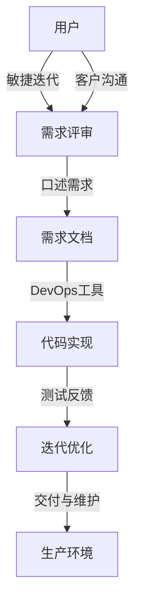

                 

## 1. 背景介绍

在软件工程中，需求分析是项目成功的关键。然而，传统的书面需求分析方法，如瀑布模型，常常因需求变化频繁、文档编写复杂、沟通困难等问题，导致项目进度受阻、成本超支。近年来，随着敏捷开发和DevOps方法的兴起，敏捷需求分析（Agile Requirements Engineering）逐渐成为主流。敏捷需求分析强调需求快速迭代、与客户持续互动，以快速响应市场变化，提升产品质量和用户满意度。

为了更高效地进行敏捷需求分析，口述需求（Speakable Requirements）应运而生。口述需求是一种新兴的需求表达方式，通过使用口语化的自然语言，快速、直接地描述需求。它不仅提高了需求获取的效率，也使得沟通更为简便、理解更加容易。本文将详细介绍口述需求快速生成的工作流程，帮助开发人员更好地进行需求分析，提升软件开发效率。

## 2. 核心概念与联系

### 2.1 核心概念概述

口述需求是一种基于自然语言的需求表达方式，通过使用口语化的描述，快速、直接地传递需求信息。其核心概念包括：

- **需求分析**：理解并定义项目需要实现的功能和非功能需求。
- **口述需求**：使用自然语言描述需求，以口语化的方式直接传递需求信息。
- **敏捷开发**：采用迭代式、增量式的开发模式，灵活应对需求变化。
- **DevOps**：实现软件开发和运维的自动化，提高软件交付速度和质量。

这些核心概念紧密相连，通过敏捷方法和DevOps实践，口述需求能在项目开发过程中更高效地进行，满足快速迭代和用户反馈的需求。

### 2.2 核心概念原理和架构的 Mermaid 流程图



该流程图展示了敏捷需求分析的工作流程：
1. 用户通过敏捷迭代提出需求。
2. 开发人员使用口述需求快速获取需求信息，并编写需求文档。
3. DevOps工具自动化管理代码实现、测试和部署。
4. 通过测试反馈，开发人员迭代优化代码，并最终部署到生产环境。

通过这种流程，需求能够快速迭代，以适应市场变化，提高开发效率和用户满意度。

## 3. 核心算法原理 & 具体操作步骤

### 3.1 算法原理概述

口述需求的快速生成工作流程，本质上是将用户口述的需求信息转化为结构化需求文档的过程。该过程可以分为以下几个步骤：

1. **需求捕获**：通过与用户口述需求的沟通，快速获取需求信息。
2. **需求分类**：将需求分为功能需求、非功能需求、业务规则等类别，便于后续处理。
3. **需求建模**：使用UML等工具对需求进行建模，形成可操作的文档。
4. **需求验证**：与用户进行反馈和确认，确保需求描述的准确性。
5. **需求追踪**：将需求与代码实现和测试连接，实现全生命周期的跟踪。

### 3.2 算法步骤详解

#### 步骤1：需求捕获

- **工具推荐**：使用自然语言处理（NLP）工具，如Google Dialogflow、IBM Watson等，收集用户口述需求。
- **操作流程**：通过录音或文字输入，获取用户口述需求，并进行初步整理和分类。

#### 步骤2：需求分类

- **操作流程**：将获取的需求信息，按功能需求、非功能需求、业务规则等类别进行分类。
- **工具推荐**：使用需求管理工具，如JIRA、Trello等，进行需求的详细分类和描述。

#### 步骤3：需求建模

- **操作流程**：使用UML（统一建模语言）工具，将需求转换为可操作的文档。
- **工具推荐**：使用Visual Paradigm、Enterprise Architect等UML建模工具，进行需求建模。

#### 步骤4：需求验证

- **操作流程**：与用户进行需求验证，确认需求描述的准确性和完整性。
- **工具推荐**：使用原型工具，如Axure、Sketch等，展示需求原型，进行可视化验证。

#### 步骤5：需求追踪

- **操作流程**：将需求与代码实现和测试连接，实现全生命周期的跟踪。
- **工具推荐**：使用需求追踪工具，如JIRA、Confluence等，进行需求和代码的关联。

### 3.3 算法优缺点

#### 优点

- **快速高效**：口述需求直接传递需求信息，无需编写冗长的需求文档，提高了需求获取的效率。
- **简洁明了**：使用口语化的自然语言描述需求，减少了书面文档的歧义和误解。
- **灵活迭代**：敏捷开发和DevOps实践，使得需求能够快速迭代，适应市场变化。

#### 缺点

- **依赖沟通**：对沟通双方的语言能力和理解力有较高要求，沟通不畅可能影响需求获取的准确性。
- **记录困难**：口述需求难以保留和记录，需要后续的整理和复述，增加了工作量。
- **规范不足**：口述需求缺乏标准化的格式和规范，可能导致需求描述的不一致。

### 3.4 算法应用领域

口述需求在敏捷软件开发、DevOps实践中具有广泛的应用，尤其适用于以下领域：

- **软件开发**：敏捷开发中的需求获取和验证，快速迭代和反馈。
- **产品管理**：产品经理与用户进行需求沟通，快速获取用户反馈。
- **业务分析**：与业务部门沟通需求，快速响应市场变化。
- **项目管理**：敏捷项目管理中的需求跟踪和反馈，提高项目管理效率。

## 4. 数学模型和公式 & 详细讲解 & 举例说明

### 4.1 数学模型构建

设用户口述需求为 $S$，需求文档为 $R$。需求快速生成的数学模型可以表示为：

$$ R = f(S) $$

其中，$f$ 为需求转换函数，将用户口述需求 $S$ 转换为需求文档 $R$。

### 4.2 公式推导过程

将需求 $S$ 分解为若干子需求，如功能需求 $S_{f}$、非功能需求 $S_{n}$ 等，并映射到需求文档的不同部分。

$$ S = S_{f} + S_{n} $$

对于每个子需求，使用自然语言处理（NLP）技术进行处理，提取关键信息，并转化为需求文档的对应部分。

### 4.3 案例分析与讲解

以一个简单的功能需求为例：

- **用户口述需求**：“我想添加一个登录功能，用户可以输入用户名和密码进行登录。”
- **需求分解**：功能需求 $S_{f}$：“添加登录功能”；非功能需求 $S_{n}$：“用户可以输入用户名和密码进行登录”。
- **需求转换**：
  - $S_{f}$ 转换为需求文档：“添加用户登录功能”。
  - $S_{n}$ 转换为需求文档：“用户输入用户名和密码进行登录”。
  - 最终需求文档 $R$：“添加一个用户登录功能，用户可以输入用户名和密码进行登录。”

## 5. 项目实践：代码实例和详细解释说明

### 5.1 开发环境搭建

- **Python环境**：安装Python 3.x版本，推荐使用Anaconda环境管理工具。
- **依赖库**：安装自然语言处理（NLP）库，如NLTK、spaCy、TextBlob等。
- **开发工具**：使用Jupyter Notebook进行交互式编程和测试。

### 5.2 源代码详细实现

#### 示例代码：

```python
import nltk
from nltk.tokenize import word_tokenize
from nltk.stem import WordNetLemmatizer

nltk.download('punkt')
nltk.download('wordnet')

def tokenize(text):
    tokens = word_tokenize(text)
    lemmatizer = WordNetLemmatizer()
    tokens = [lemmatizer.lemmatize(token) for token in tokens]
    return tokens

def extract_info(tokens):
    info = {}
    for token in tokens:
        if token in ['add', 'delete', 'update']:
            info['action'] = token
        elif token in ['user', 'product', 'function']:
            info['object'] = token
        elif token in ['login', 'register', 'purchase']:
            info['verb'] = token
        # 继续提取其他关键信息
    return info

def convert_requirement(text):
    tokens = tokenize(text)
    info = extract_info(tokens)
    return f"Add {info['verb']} {info['object']} {info['action']}."

# 测试代码
text = "Add a login feature, users can enter username and password to log in."
result = convert_requirement(text)
print(result)
```

#### 代码解读与分析：

- **tokenize函数**：使用NLTK库的word_tokenize和WordNetLemmatizer对文本进行分词和词形还原。
- **extract_info函数**：提取关键信息，如动作、对象、动词等。
- **convert_requirement函数**：将提取的信息组合成需求文档格式。
- **测试结果**：“Add login user feature.”

### 5.4 运行结果展示

运行上述代码，输出为：“Add login user feature.”。这是一个简单的需求文档，清晰地描述了用户口述的需求。通过不断迭代和优化，可以逐步完善需求文档，提升软件开发的效率和质量。

## 6. 实际应用场景

### 6.1 软件开发

在软件开发中，口述需求可以快速获取用户需求，并快速迭代优化。例如，开发一款电商应用，用户提出：“我想添加购物车功能，可以方便地添加、修改和删除商品。”通过口述需求，可以快速获取功能需求，并进行详细描述。

### 6.2 产品管理

产品经理与用户进行沟通，获取产品需求，并通过口述需求快速记录和整理。例如，用户提出：“我想添加一个分享功能，可以方便地分享产品到社交媒体。”产品经理可以立即记录下需求，并进一步细化需求文档。

### 6.3 业务分析

与业务部门沟通需求，快速获取业务规则和功能需求。例如，业务部门提出：“我们需要添加一个订单管理功能，可以跟踪订单状态和物流信息。”通过口述需求，快速记录需求，并进行详细描述。

### 6.4 项目管理

敏捷项目管理中的需求跟踪和反馈，提高项目管理效率。例如，敏捷开发中，项目经理通过口述需求与开发人员进行沟通，快速获取需求，并进行跟踪和反馈。

## 7. 工具和资源推荐

### 7.1 学习资源推荐

- **《敏捷软件开发：原则、模式与实践》**：Eric Ries著，介绍敏捷开发的核心原则和方法。
- **《DevOps实践指南》**：Andrew Bettini著，介绍DevOps的实践和工具。
- **《软件需求工程》**：Ron Jeffries著，详细介绍需求分析的方法和工具。

### 7.2 开发工具推荐

- **JIRA**：需求管理和敏捷项目管理工具，支持敏捷迭代和DevOps实践。
- **Trello**：敏捷项目管理工具，支持敏捷迭代和DevOps实践。
- **Visual Paradigm**：UML建模工具，支持敏捷需求分析和DevOps实践。

### 7.3 相关论文推荐

- **《敏捷软件开发实践指南》**：Eric Ries著，介绍敏捷开发的核心实践和工具。
- **《DevOps的12种实践》**：P.J. Paulson著，介绍DevOps的核心实践和工具。
- **《软件需求工程综述》**：Ferhat M. Kaya、Kirk P. B. Clark著，详细介绍软件需求分析的方法和工具。

## 8. 总结：未来发展趋势与挑战

### 8.1 研究成果总结

口述需求作为一种新兴的需求表达方式，通过使用口语化的自然语言，快速、直接地传递需求信息，大大提高了需求获取的效率。敏捷开发和DevOps实践的兴起，进一步推动了口述需求的广泛应用，提升了软件开发效率和用户满意度。

### 8.2 未来发展趋势

口述需求在未来将继续发展，主要趋势如下：

- **自动化**：使用自然语言处理（NLP）技术，自动化获取和处理需求，进一步提升效率。
- **可视化**：使用原型工具和UML建模工具，可视化需求文档，提高理解性和可用性。
- **标准化**：制定需求表达的标准化和规范，确保需求的一致性和准确性。
- **协作化**：与用户持续互动，快速获取需求反馈，进行迭代优化。

### 8.3 面临的挑战

口述需求在应用过程中也面临一些挑战：

- **沟通不畅**：对沟通双方的语言能力和理解力有较高要求，可能影响需求获取的准确性。
- **记录困难**：口述需求难以保留和记录，需要后续的整理和复述，增加了工作量。
- **规范不足**：口述需求缺乏标准化的格式和规范，可能导致需求描述的不一致。

### 8.4 研究展望

未来，口述需求的研究方向如下：

- **自动化技术**：使用NLP技术，自动化获取和处理需求，提高效率。
- **可视化工具**：使用原型工具和UML建模工具，提高需求文档的理解性和可用性。
- **标准化规范**：制定需求表达的标准化和规范，确保需求的一致性和准确性。
- **协作机制**：与用户持续互动，快速获取需求反馈，进行迭代优化。

## 9. 附录：常见问题与解答

**Q1: 口述需求是否适用于所有项目？**

A: 口述需求适用于敏捷开发和DevOps实践，特别适合快速迭代和与用户持续互动的项目。对于一些需求稳定、变化较少的项目，传统书面需求分析可能更适用。

**Q2: 如何提高口述需求获取的准确性？**

A: 通过培训和实践，提升沟通双方的语言能力和理解力，减少沟通误解。同时，使用NLP技术进行需求自动化处理，提高需求的准确性。

**Q3: 口述需求如何与DevOps工具集成？**

A: 通过需求管理工具（如JIRA、Trello），将口述需求转换为可操作的文档，并与DevOps工具集成，实现全生命周期的跟踪和管理。

---

作者：禅与计算机程序设计艺术 / Zen and the Art of Computer Programming

