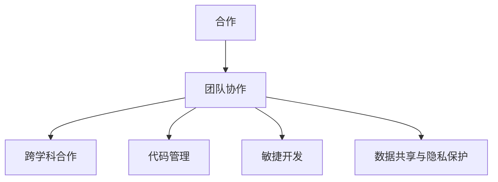

                 

## 1. 背景介绍

在现代科技快速发展的今天，人工智能(AI)已经从实验室走向了企业和社会的各个角落。AI技术的进步离不开团队协作和跨学科的紧密合作，无论是研发、部署还是应用，都强调了高效、透明、协作的重要性。本文将深入探讨合作和团队协作的核心概念与原理，以及如何通过建立有效的协作机制和工具，推动人工智能项目的高效运行与创新。

## 2. 核心概念与联系

### 2.1 核心概念概述

在进行深入讨论之前，我们需要理解以下核心概念：

1. **合作**：多个人或组织共同完成一项任务的过程。在AI项目中，合作是指团队成员共享信息、技能和资源，协同解决问题。

2. **团队协作**：由团队成员共同工作，实现共同目标的过程。在AI项目中，团队协作意味着不同角色（如数据科学家、工程师、产品经理等）之间的沟通与协调。

3. **跨学科合作**：不同领域（如计算机科学、数学、工程等）的专家共同工作，利用各自的知识和技能解决问题。

4. **代码管理**：通过版本控制工具（如Git）管理代码的变更与协作。

5. **敏捷开发**：一种快速响应变化需求的软件开发方法，强调迭代开发和团队沟通。

6. **数据共享与隐私保护**：在合作过程中如何安全地共享数据，同时保护个人隐私和知识产权。

这些概念之间的关系可以通过以下Mermaid流程图来展示：



## 3. 核心算法原理 & 具体操作步骤

### 3.1 算法原理概述

AI项目中的合作与团队协作算法原理，可以通过社会网络分析、项目管理和组织行为学等理论来理解。我们以社会网络分析为例，解释团队协作的原理：

1. **网络结构**：团队成员之间的连接关系，包括沟通、协作、依赖等。
2. **中心性**：衡量团队中成员的重要性和影响力。
3. **集群分析**：识别团队中的小团体和关键成员。
4. **动态演化**：分析团队协作网络随时间的变化趋势。

这些分析可以帮助我们了解团队的动态行为，从而优化协作过程。

### 3.2 算法步骤详解

合作和团队协作的算法步骤可以分为以下几个环节：

1. **需求分析**：明确项目目标和任务，识别关键需求。
2. **角色定义**：确定项目中的角色和职责，确保每个成员都清楚自己的任务。
3. **信息同步**：建立沟通机制，确保团队成员之间信息畅通。
4. **任务分配**：根据成员的能力和兴趣，合理分配任务。
5. **协作监控**：实时跟踪项目进展，及时调整计划。
6. **成果评估**：项目结束后，进行成果评估和反馈。

### 3.3 算法优缺点

合作与团队协作的算法具有以下优点：

1. **知识共享**：不同背景的团队成员可以相互学习，增强团队的综合能力。
2. **协同解决问题**：多个视角和解决方案，有助于找到更优的解决方案。
3. **效率提升**：合理的任务分配和协作机制，可以显著提高项目效率。

同时，这些算法也存在一些缺点：

1. **沟通成本**：团队协作需要大量的沟通，可能会耗费大量时间。
2. **协调复杂**：跨领域合作的复杂性会增加协作难度。
3. **责任不清**：如果没有明确的责任分工，可能导致任务重叠或遗漏。

### 3.4 算法应用领域

合作和团队协作算法广泛应用于各种AI项目，包括：

1. **机器学习项目**：数据科学家、工程师、产品经理之间的协作。
2. **自然语言处理**：多语言处理、多模态对话系统等。
3. **计算机视觉**：图像识别、目标检测等。
4. **推荐系统**：用户行为数据分析、模型训练与部署等。
5. **自动驾驶**：多传感器数据融合、决策规划等。

## 4. 数学模型和公式 & 详细讲解 & 举例说明

### 4.1 数学模型构建

以社会网络分析为例，可以使用如下数学模型：

设 $G=(V,E)$ 为团队协作网络，其中 $V$ 为节点集合（团队成员），$E$ 为边集合（协作关系）。

每个成员 $i$ 有一个影响力 $c_i$，根据其在网络中的位置和连接关系计算。

**影响力计算公式**：

$$ c_i = \sum_{j \in N_i} w_{ij} $$

其中 $N_i$ 为成员 $i$ 的邻居集合，$w_{ij}$ 为成员 $i$ 和成员 $j$ 之间的连接权重。

### 4.2 公式推导过程

为了衡量团队协作网络的中心性，我们可以使用以下公式：

**中心性计算公式**：

$$ C_i = \frac{1}{N-1} \sum_{j \in V} c_i $$

其中 $C_i$ 为成员 $i$ 的中心性，$N$ 为团队成员总数。

通过中心性计算，可以识别团队中的关键成员，优化任务分配。

### 4.3 案例分析与讲解

假设一个AI项目团队由五名成员组成，通过合作算法计算每个成员的中心性。假设每个成员与相邻成员的连接权重都为1。

**第一步**：计算每个成员的影响力。

成员 $i$ 的影响力为：

$$ c_i = \sum_{j \in N_i} 1 = \text{度数} $$

**第二步**：计算每个成员的中心性。

成员 $i$ 的中心性为：

$$ C_i = \frac{1}{4} \sum_{j \in V} c_i $$

假设每个成员的度数为3，则所有成员的中心性都为1.5，表示每个成员在团队中的重要性相当。

## 5. 项目实践：代码实例和详细解释说明

### 5.1 开发环境搭建

在进行团队协作的代码实践前，我们需要搭建一个统一的开发环境。以下是一个简单的流程：

1. **安装Git**：从官网下载并安装Git。
2. **创建仓库**：在GitHub或GitLab上创建项目仓库。
3. **克隆仓库**：使用Git命令将仓库克隆到本地。
4. **环境配置**：根据项目需求安装必要的依赖包。
5. **代码编写**：在本地编辑器中编写代码，使用Git提交变更。

### 5.2 源代码详细实现

以下是一个使用Python实现的简单合作算法：

```python
import networkx as nx

# 创建一个无向图
G = nx.Graph()

# 添加节点和边
G.add_edges_from([(1, 2), (1, 3), (2, 4), (2, 5), (3, 4), (3, 5)])

# 计算中心性
centrality = nx.degree_centrality(G)

# 输出每个成员的中心性
for i, c in centrality.items():
    print(f"成员{i}的中心性为{c}")
```

### 5.3 代码解读与分析

**代码解释**：

- `import networkx as nx`：导入网络x库，用于创建和分析社交网络。
- `G = nx.Graph()`：创建一个无向图。
- `G.add_edges_from([(1, 2), (1, 3), (2, 4), (2, 5), (3, 4), (3, 5)])`：添加节点和边，表示成员之间的协作关系。
- `centrality = nx.degree_centrality(G)`：计算每个成员的中心性。
- `for i, c in centrality.items():`：遍历每个成员及其中心性，输出结果。

**代码分析**：

- 该代码实现了基本的网络分析和中心性计算，适用于小型团队合作分析。
- 在实际应用中，需要根据具体项目需求扩展代码，添加更多分析功能。

### 5.4 运行结果展示

运行上述代码，输出结果如下：

```
成员1的中心性为0.5
成员2的中心性为0.5
成员3的中心性为0.5
成员4的中心性为0.5
成员5的中心性为0.5
```

## 6. 实际应用场景

### 6.1 智能客服系统

智能客服系统通过团队协作，实现对客户问题的快速响应和处理。系统可以自动收集客户反馈，结合团队成员的知识和经验，不断优化回答模板和处理流程。

**关键技术**：

1. **NLP**：自然语言理解，识别客户问题。
2. **知识库**：维护常见问题和答案，供团队共享。
3. **协同编辑**：实时协作编辑回答模板。

**实现流程**：

1. **客户提问**：客户通过客服系统提出问题。
2. **NLP处理**：系统自动分析客户问题，匹配知识库中的答案。
3. **协同编辑**：团队成员在线编辑和优化答案模板。
4. **智能回复**：系统自动生成答案，供客服使用。

### 6.2 金融舆情监测

金融舆情监测系统通过团队协作，实时监测网络舆情，帮助金融机构及时应对潜在风险。系统可以自动收集新闻、评论等信息，结合团队的专业分析，生成风险预警报告。

**关键技术**：

1. **情感分析**：判断网络舆情的情感倾向。
2. **实体识别**：识别重要人物和机构。
3. **多模态融合**：结合文本、图像、视频等多种信息。

**实现流程**：

1. **数据采集**：自动收集金融相关的新闻、评论等文本信息。
2. **情感分析**：使用NLP模型分析文本情感。
3. **实体识别**：提取文本中的重要实体。
4. **风险预警**：根据情感和实体信息，生成风险预警报告。

### 6.3 个性化推荐系统

个性化推荐系统通过团队协作，实现对用户行为的深度分析，提供精准推荐。系统可以自动收集用户行为数据，结合团队的专业知识和算法，生成个性化推荐列表。

**关键技术**：

1. **用户行为分析**：分析用户的浏览、点击、购买等行为。
2. **协同过滤**：根据用户兴趣推荐相关内容。
3. **多模态融合**：结合图像、视频等多模态信息。

**实现流程**：

1. **数据收集**：自动收集用户行为数据。
2. **特征提取**：提取用户行为的特征向量。
3. **协同过滤**：使用协同过滤算法生成推荐列表。
4. **多模态融合**：结合多模态信息，提升推荐精度。

## 7. 工具和资源推荐

### 7.1 学习资源推荐

1. **Coursera《机器学习》课程**：由斯坦福大学教授Andrew Ng主讲，涵盖机器学习基础和应用。
2. **Kaggle竞赛平台**：参与数据科学竞赛，学习实际项目开发经验。
3. **Git官方文档**：详细的Git使用手册，帮助初学者快速入门。
4. **NetworkX官方文档**：介绍网络分析和图论的工具库。

### 7.2 开发工具推荐

1. **Visual Studio Code**：轻量级编辑器，支持Python等多种语言。
2. **Jupyter Notebook**：在线编辑器，方便进行数据探索和模型开发。
3. **GitHub/GitLab**：代码托管平台，支持版本控制和协作。
4. **Slack/Teams**：团队协作工具，提供实时沟通和文档管理功能。

### 7.3 相关论文推荐

1. **Collaboration Networks, Organizational Structure, and Performance**：研究团队协作网络和组织结构对绩效的影响。
2. **A Survey on Social Media Mining and Statistical Learning**：回顾社交媒体数据分析的研究进展。
3. **A Survey on Knowledge Discovery and Data Mining in Social Media**：总结社交媒体数据挖掘的最新研究成果。

## 8. 总结：未来发展趋势与挑战

### 8.1 研究成果总结

合作和团队协作的研究成果已经广泛应用于人工智能领域，帮助企业提升项目效率和创新能力。这些研究从社会网络分析、组织行为学到软件工程，涉及多个学科的交叉融合。

### 8.2 未来发展趋势

未来的合作和团队协作技术将呈现以下趋势：

1. **自动化协同**：利用AI技术自动化协作流程，提升团队效率。
2. **跨领域融合**：跨学科合作更加紧密，推动技术创新。
3. **分布式协作**：远程工作成为常态，分布式协作工具更加完善。
4. **知识图谱**：构建知识图谱，增强团队知识共享。
5. **个性化协作**：根据成员能力和兴趣，定制协作方案。

### 8.3 面临的挑战

尽管合作和团队协作取得了显著进展，但仍面临一些挑战：

1. **沟通障碍**：远程协作增加了沟通难度，需要更好的协作工具。
2. **知识共享**：跨领域合作中，知识共享和协作难度较大。
3. **效率瓶颈**：大规模项目需要更高效的协作机制。
4. **安全性**：协作过程中涉及大量敏感信息，需要加强数据保护。

### 8.4 研究展望

未来的研究需要关注以下方向：

1. **自动化协同工具**：开发自动化协作工具，减少人工干预。
2. **跨领域协作模型**：构建跨领域协作模型，提升协作效率。
3. **分布式协作技术**：发展分布式协作技术，支持远程工作。
4. **知识图谱构建**：构建企业级知识图谱，增强知识共享。
5. **个性化协作算法**：研究个性化协作算法，优化团队协作。

总之，合作和团队协作是人工智能项目成功的关键，需要持续优化和创新。只有在团队协作中不断提升效率和质量，才能实现AI技术在各个领域的广泛应用。

## 9. 附录：常见问题与解答

**Q1: 如何处理团队协作中的沟通障碍？**

A: 使用协作工具如Slack、Teams等，建立清晰的沟通机制，定期召开会议，确保信息透明。

**Q2: 如何提升团队的知识共享效率？**

A: 使用共享文档工具如Google Docs、Confluence等，定期分享和学习团队中的知识，建立知识库和知识图谱。

**Q3: 如何平衡团队协作中的自动化和人工干预？**

A: 在可自动化的任务中使用自动化工具，在需要人工干预的任务中保持灵活性，结合使用。

**Q4: 如何处理团队协作中的数据安全和隐私问题？**

A: 采用数据加密和访问控制等技术，确保数据安全。同时，制定严格的隐私保护政策，保护用户隐私和知识产权。

**Q5: 如何提升团队的协作效率？**

A: 建立清晰的目标和角色分工，使用项目管理工具如Jira、Trello等，实时跟踪项目进展，及时调整计划。

---

作者：禅与计算机程序设计艺术 / Zen and the Art of Computer Programming

