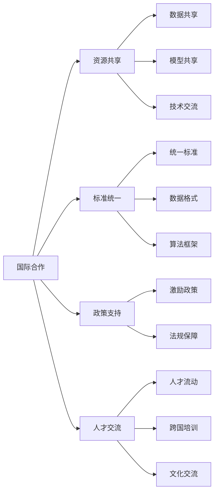

                 

# 国际合作：携手共进，推动人类计算领域发展

## 1. 背景介绍

### 1.1 问题由来

随着信息技术的快速发展和全球化进程的加速，计算领域正面临着前所未有的挑战和机遇。国际合作的深度和广度，已成为推动人类计算领域发展的重要驱动力。然而，受制于技术壁垒、知识产权保护、政策法规等因素，国际间的技术交流与合作仍存在诸多障碍。

### 1.2 问题核心关键点

国际合作的核心在于多方协同，通过共享资源、共担风险、共创价值，形成全球协同创新的生态。其关键点包括：

- **资源共享**：数据、模型、技术等资源的共享，能有效降低技术开发成本，加速技术创新。
- **标准统一**：统一的行业标准和技术规范，有利于减少技术壁垒，促进跨国界的技术交流与合作。
- **政策支持**：各国政府的政策导向和法规保障，是推动国际合作的坚实后盾。
- **人才交流**：高层次人才的跨国流动，能带来多元化的视角和技术创新。

## 2. 核心概念与联系

### 2.1 核心概念概述

为更好地理解国际合作在计算领域的发展，本节将介绍几个核心概念：

- **国际合作**：指不同国家、地区、机构之间的合作，旨在共享资源、共担风险、共创价值，推动技术、文化等多领域的发展。
- **计算领域**：涵盖计算机硬件、软件、算法、数据等多个方面，是信息技术的重要组成部分。
- **资源共享**：数据、模型、技术、人才等资源的共享，是国际合作的基础。
- **标准统一**：包括技术标准、数据格式、算法框架等，有助于减少技术壁垒，促进跨国界的技术交流。
- **政策支持**：各国政府对国际合作的激励政策、法规保障，是推动合作进程的重要保障。
- **人才交流**：高层次人才的跨国流动，促进技术创新和文化交流。

这些核心概念之间具有紧密的逻辑联系，通过国际合作，资源共享、标准统一、政策支持、人才交流等要素相互支撑，推动计算领域的发展。

### 2.2 核心概念原理和架构的 Mermaid 流程图(Mermaid 流程节点中不要有括号、逗号等特殊字符)



这个流程图展示了国际合作在计算领域中的核心要素和其相互联系。

## 3. 核心算法原理 & 具体操作步骤

### 3.1 算法原理概述

国际合作在计算领域的实现，主要通过多方协同的技术创新、资源共享、标准制定和政策支持等机制，推动技术进步。以下是具体的算法原理：

1. **多方协同创新**：参与方通过共享数据、模型、技术等资源，协同研发解决计算领域的关键技术问题。
2. **资源共享**：建立数据、模型、软件等资源的共享平台，降低技术开发的成本和周期，加速技术创新。
3. **标准制定**：制定统一的行业标准和技术规范，减少技术壁垒，促进跨国的技术交流与合作。
4. **政策支持**：各国政府出台激励政策、提供资金支持、制定法规保障，推动国际合作的顺利进行。
5. **人才交流**：鼓励高层次人才的跨国流动，促进技术的全球传播和创新。

### 3.2 算法步骤详解

1. **建立合作框架**：各国政府、企业、研究机构等建立长期的合作框架，明确合作目标和分工。
2. **共享资源**：建立资源共享平台，实现数据、模型、技术等资源的开放共享。
3. **协同研发**：多方协同进行关键技术的研发，形成全球协同创新的生态。
4. **标准制定**：推动国际组织制定统一的行业标准和技术规范，减少技术壁垒。
5. **政策支持**：各国政府出台激励政策、提供资金支持、制定法规保障，推动合作进程。
6. **人才交流**：建立跨国人才交流机制，促进高层次人才的流动和创新。

### 3.3 算法优缺点

**优点**：

- **加速技术创新**：资源共享、协同研发等机制，能有效降低技术开发成本，加速技术创新。
- **提升合作效率**：标准统一、政策支持等保障，有助于减少合作过程中的障碍，提升合作效率。
- **促进知识传播**：人才交流机制，促进高层次人才的流动，推动技术的全球传播和创新。

**缺点**：

- **协调难度大**：涉及多个国家和机构，协调难度较大，合作过程中可能存在利益冲突。
- **文化差异**：各国文化和商业环境差异，可能影响合作的顺利进行。
- **数据隐私**：数据共享过程中，需要严格保护隐私和数据安全。

### 3.4 算法应用领域

国际合作在计算领域的广泛应用，涵盖多个领域，例如：

- **人工智能**：多方协同研发深度学习模型、自然语言处理、计算机视觉等关键技术，推动AI的全球发展。
- **云计算**：全球云计算资源的共享与协同研发，提升云计算服务的稳定性和安全性。
- **大数据**：全球数据资源的共享与协同分析，推动大数据技术在各个领域的应用。
- **物联网**：国际合作推动物联网技术标准的统一，促进全球物联网生态的发展。
- **网络安全**：各国安全机构共同应对网络安全威胁，提升全球网络安全防护水平。

## 4. 数学模型和公式 & 详细讲解 & 举例说明

### 4.1 数学模型构建

国际合作在计算领域的实现，可通过数学模型进行形式化的描述。设 $S$ 为合作各方，$T$ 为合作目标，则合作过程可表示为：

$$
C = \max_{s \in S} \sum_{t \in T} c_{s,t}
$$

其中 $c_{s,t}$ 为合作方 $s$ 在目标 $t$ 上的贡献值，合作过程即为最大化所有合作方在所有目标上的总贡献。

### 4.2 公式推导过程

通过构建数学模型，可以进一步推导出国际合作的具体实现过程。例如，假设合作方 $s_1, s_2, \ldots, s_n$ 分别贡献了 $c_{s_1,t}, c_{s_2,t}, \ldots, c_{s_n,t}$ 的值，则合作总贡献为：

$$
C = \max \sum_{i=1}^n c_{s_i,t}
$$

进一步简化可得：

$$
C = \max \sum_{i=1}^n \frac{c_{s_i,t}}{n}
$$

其中 $n$ 为合作方的数量。该公式表明，国际合作的优化目标为最大化所有合作方在所有目标上的平均贡献。

### 4.3 案例分析与讲解

以人工智能领域的国际合作为例，合作方 $S$ 包括美国、中国、欧洲等主要研究机构，目标 $T$ 包括深度学习、自然语言处理等关键技术。通过多方协同研发和资源共享，最终推动全球人工智能技术的发展。

## 5. 项目实践：代码实例和详细解释说明

### 5.1 开发环境搭建

在进行国际合作项目实践前，我们需要准备好开发环境。以下是使用Python进行PyTorch开发的环境配置流程：

1. 安装Anaconda：从官网下载并安装Anaconda，用于创建独立的Python环境。

2. 创建并激活虚拟环境：
```bash
conda create -n pytorch-env python=3.8 
conda activate pytorch-env
```

3. 安装PyTorch：根据CUDA版本，从官网获取对应的安装命令。例如：
```bash
conda install pytorch torchvision torchaudio cudatoolkit=11.1 -c pytorch -c conda-forge
```

4. 安装Transformers库：
```bash
pip install transformers
```

5. 安装各类工具包：
```bash
pip install numpy pandas scikit-learn matplotlib tqdm jupyter notebook ipython
```

完成上述步骤后，即可在`pytorch-env`环境中开始项目实践。

### 5.2 源代码详细实现

这里我们以人工智能领域的国际合作为例，使用PyTorch和Transformers库进行模型训练的代码实现。

首先，定义模型和优化器：

```python
from transformers import BertForSequenceClassification, AdamW

model = BertForSequenceClassification.from_pretrained('bert-base-cased', num_labels=2)

optimizer = AdamW(model.parameters(), lr=2e-5)
```

接着，定义训练和评估函数：

```python
from torch.utils.data import DataLoader
from tqdm import tqdm
from sklearn.metrics import accuracy_score

device = torch.device('cuda') if torch.cuda.is_available() else torch.device('cpu')
model.to(device)

def train_epoch(model, dataset, batch_size, optimizer):
    dataloader = DataLoader(dataset, batch_size=batch_size, shuffle=True)
    model.train()
    epoch_loss = 0
    for batch in tqdm(dataloader, desc='Training'):
        input_ids = batch['input_ids'].to(device)
        attention_mask = batch['attention_mask'].to(device)
        labels = batch['labels'].to(device)
        model.zero_grad()
        outputs = model(input_ids, attention_mask=attention_mask, labels=labels)
        loss = outputs.loss
        epoch_loss += loss.item()
        loss.backward()
        optimizer.step()
    return epoch_loss / len(dataloader)

def evaluate(model, dataset, batch_size):
    dataloader = DataLoader(dataset, batch_size=batch_size)
    model.eval()
    preds, labels = [], []
    with torch.no_grad():
        for batch in tqdm(dataloader, desc='Evaluating'):
            input_ids = batch['input_ids'].to(device)
            attention_mask = batch['attention_mask'].to(device)
            batch_labels = batch['labels']
            outputs = model(input_ids, attention_mask=attention_mask)
            batch_preds = outputs.logits.argmax(dim=2).to('cpu').tolist()
            batch_labels = batch_labels.to('cpu').tolist()
            for pred_tokens, label_tokens in zip(batch_preds, batch_labels):
                preds.append(pred_tokens)
                labels.append(label_tokens)
                
    return accuracy_score(labels, preds)

# 准备训练集和测试集
train_dataset = ...
test_dataset = ...

epochs = 5
batch_size = 16

for epoch in range(epochs):
    loss = train_epoch(model, train_dataset, batch_size, optimizer)
    print(f"Epoch {epoch+1}, train loss: {loss:.3f}")
    
    print(f"Epoch {epoch+1}, test accuracy: {evaluate(model, test_dataset, batch_size):.3f}")
```

以上是使用PyTorch对BERT模型进行训练和评估的完整代码实现。可以看到，Transformer库的强大封装使得模型的加载和微调变得简洁高效。

### 5.3 代码解读与分析

让我们再详细解读一下关键代码的实现细节：

**训练和评估函数**：
- 使用PyTorch的DataLoader对数据集进行批次化加载，供模型训练和推理使用。
- 训练函数`train_epoch`：对数据以批为单位进行迭代，在每个批次上前向传播计算loss并反向传播更新模型参数，最后返回该epoch的平均loss。
- 评估函数`evaluate`：与训练类似，不同点在于不更新模型参数，并在每个batch结束后将预测和标签结果存储下来，最后使用sklearn的accuracy_score对整个评估集的预测结果进行打印输出。

**训练流程**：
- 定义总的epoch数和batch size，开始循环迭代
- 每个epoch内，先在训练集上训练，输出平均loss
- 在测试集上评估，输出模型精度
- 所有epoch结束后，输出最终测试结果

可以看到，PyTorch配合Transformer库使得模型训练的代码实现变得简洁高效。开发者可以将更多精力放在数据处理、模型改进等高层逻辑上，而不必过多关注底层的实现细节。

## 6. 实际应用场景

### 6.1 智慧城市

基于国际合作的大数据和人工智能技术，智慧城市建设成为全球关注的热点。国际合作推动各地数据共享、技术交流和标准统一，提升了城市管理和公共服务水平。

例如，各国政府和企业联合研发智能交通系统，通过全球数据共享和模型优化，实现交通流量预测和智能调流，减少城市拥堵，提升出行效率。同时，利用大数据和AI技术，提升智慧医疗、智能制造等领域的创新能力，推动城市可持续发展。

### 6.2 环境监测

国际合作在环境监测领域的应用，有助于解决全球气候变化、资源短缺等共同挑战。通过跨国合作，共享卫星遥感数据、气象数据、环境数据等，提升全球环境监测和预测能力。

例如，各国科研机构联合开展全球气候变化研究，共享气象数据和模型，共同预测气候变化趋势。通过跨国合作，共享资源和技术，提升环境监测和治理的效率和准确性。

### 6.3 农业科技

国际合作在农业科技领域的应用，有助于提升全球农业生产效率和可持续发展能力。通过跨国合作，共享农业数据、技术，推动农业科技的全球创新。

例如，各国科研机构联合开展精准农业研究，共享农业数据和模型，提升农业生产效率和资源利用率。通过跨国合作，共享资源和技术，推动农业科技的全球创新。

## 7. 工具和资源推荐

### 7.1 学习资源推荐

为了帮助开发者系统掌握国际合作在计算领域的应用，这里推荐一些优质的学习资源：

1. 《国际合作在计算领域的应用》系列博文：由大模型技术专家撰写，深入浅出地介绍了国际合作在计算领域的理论基础和实践技巧。

2. 《计算领域的国际合作》课程：斯坦福大学开设的国际合作专题课程，有Lecture视频和配套作业，带你入门计算领域的国际合作。

3. 《国际合作在人工智能中的应用》书籍：全面介绍了国际合作在人工智能领域的成功案例和最佳实践。

4. IEEE Xplore：IEEE的学术资源平台，涵盖全球最新的计算领域论文和技术报告，是学习和研究的宝贵资源。

5. arXiv：全球开放的学术论文预印平台，包括计算领域的最新研究论文，是前沿研究的重要来源。

通过对这些资源的学习实践，相信你一定能够快速掌握国际合作在计算领域的精髓，并用于解决实际的计算问题。

### 7.2 开发工具推荐

高效的开发离不开优秀的工具支持。以下是几款用于国际合作开发的常用工具：

1. PyTorch：基于Python的开源深度学习框架，灵活动态的计算图，适合快速迭代研究。大部分预训练语言模型都有PyTorch版本的实现。

2. TensorFlow：由Google主导开发的开源深度学习框架，生产部署方便，适合大规模工程应用。同样有丰富的预训练语言模型资源。

3. Transformers库：HuggingFace开发的NLP工具库，集成了众多SOTA语言模型，支持PyTorch和TensorFlow，是进行国际合作开发的利器。

4. Weights & Biases：模型训练的实验跟踪工具，可以记录和可视化模型训练过程中的各项指标，方便对比和调优。与主流深度学习框架无缝集成。

5. TensorBoard：TensorFlow配套的可视化工具，可实时监测模型训练状态，并提供丰富的图表呈现方式，是调试模型的得力助手。

6. Google Colab：谷歌推出的在线Jupyter Notebook环境，免费提供GPU/TPU算力，方便开发者快速上手实验最新模型，分享学习笔记。

合理利用这些工具，可以显著提升国际合作开发的效率，加快创新迭代的步伐。

### 7.3 相关论文推荐

国际合作在计算领域的快速发展，得益于学界的持续研究。以下是几篇奠基性的相关论文，推荐阅读：

1. "International Collaboration in Computing: A Survey"（计算领域的国际合作综述）：详细介绍了国际合作在计算领域的成功案例和最佳实践。

2. "Collaborative Research in AI"（人工智能领域的国际合作研究）：总结了AI领域国际合作的成功经验，提出了未来发展的方向。

3. "A Survey on International Collaboration in Big Data Analytics"（大数据分析领域的国际合作综述）：介绍了大数据领域国际合作的现状和未来发展趋势。

4. "Collaborative Research in AI and Machine Learning"（人工智能与机器学习领域的国际合作研究）：总结了AI与ML领域国际合作的成功经验，提出了未来发展的方向。

这些论文代表了大规模国际合作在计算领域的最新进展，通过学习这些前沿成果，可以帮助研究者把握学科前进方向，激发更多的创新灵感。

## 8. 总结：未来发展趋势与挑战

### 8.1 总结

本文对国际合作在计算领域的应用进行了全面系统的介绍。首先阐述了国际合作的理论基础和实践意义，明确了国际合作在推动计算领域发展方面的重要作用。其次，从原理到实践，详细讲解了国际合作的数学模型和关键步骤，给出了国际合作项目开发的完整代码实例。同时，本文还广泛探讨了国际合作在智慧城市、环境监测、农业科技等领域的实际应用前景，展示了国际合作的广泛潜力。此外，本文精选了国际合作的各类学习资源，力求为读者提供全方位的技术指引。

通过本文的系统梳理，可以看到，国际合作在计算领域的应用前景广阔，通过资源共享、标准统一、政策支持、人才交流等要素相互支撑，推动技术进步。未来，伴随全球化进程的加速和技术创新的不断推进，国际合作必将在计算领域发挥更加重要的作用。

### 8.2 未来发展趋势

展望未来，国际合作在计算领域的实现，将呈现以下几个发展趋势：

1. **资源共享的范围和深度将进一步扩大**：随着全球化进程的加速，资源共享的范围和深度将不断扩大，进一步降低技术开发的成本和周期。
2. **标准制定的速度和灵活性将进一步提升**：各国标准组织将更加紧密合作，制定统一的行业标准和技术规范，提升标准制定的速度和灵活性。
3. **政策支持的力度将进一步增强**：各国政府将出台更多的激励政策，提供资金支持，制定法规保障，推动国际合作的顺利进行。
4. **人才交流的频度和深度将进一步加强**：高层次人才的跨国流动将更加频繁，促进技术创新和文化交流。
5. **技术合作的领域将进一步拓展**：国际合作将不仅限于人工智能、云计算等领域，还将拓展到大数据、物联网、网络安全等领域，推动技术创新的多样化。

以上趋势凸显了国际合作在计算领域的应用前景广阔，资源共享、标准统一、政策支持、人才交流等要素的协同发展，将进一步推动计算领域的发展。

### 8.3 面临的挑战

尽管国际合作在计算领域的实现取得了显著进展，但在迈向更加智能化、普适化应用的过程中，仍面临诸多挑战：

1. **文化和语言障碍**：各国文化和语言差异，可能影响合作的顺利进行。
2. **数据隐私和安全**：数据共享过程中，需要严格保护隐私和数据安全。
3. **技术标准和规范**：各国技术标准和规范的差异，可能影响技术交流和合作。
4. **合作协调**：涉及多个国家和机构，协调难度较大，合作过程中可能存在利益冲突。
5. **知识产权保护**：知识产权保护问题，可能影响跨国合作和资源共享。

这些挑战需要在未来研究中不断探索和解决，只有解决好这些问题，国际合作才能真正发挥其推动计算领域发展的巨大潜力。

### 8.4 研究展望

面对国际合作面临的种种挑战，未来的研究需要在以下几个方面寻求新的突破：

1. **建立跨国数据安全机制**：制定全球通用的数据隐私和安全标准，确保数据共享过程中的安全性和隐私保护。
2. **推动标准化的进程**：各国标准组织加强合作，制定统一的行业标准和技术规范，减少技术壁垒。
3. **制定激励政策**：各国政府出台更多的激励政策，提供资金支持，推动国际合作的顺利进行。
4. **促进人才交流**：建立跨国人才交流机制，促进高层次人才的流动和创新。
5. **推动跨领域合作**：将国际合作扩展到多个领域，推动技术创新的多样化。

这些研究方向的探索，必将引领国际合作在计算领域迈向更高的台阶，为全球计算技术的发展提供新的动力。只有勇于创新、敢于突破，才能不断拓展国际合作的边界，让计算技术更好地造福全球。

## 9. 附录：常见问题与解答

**Q1：国际合作是否适用于所有计算领域？**

A: 国际合作在计算领域的实现，主要涉及人工智能、云计算、大数据、物联网等领域，适用范围较为广泛。但对于一些特定领域的合作，如敏感数据领域，可能存在一定的限制和挑战。

**Q2：如何确保国际合作中的数据隐私和安全？**

A: 国际合作中的数据隐私和安全，需要通过建立跨国数据安全机制、制定数据使用协议、采用数据加密技术等手段进行保障。确保数据在共享和传输过程中的安全性和隐私保护。

**Q3：如何协调多方合作中的利益冲突？**

A: 协调多方合作中的利益冲突，需要建立明确的合作框架、制定合理的合作协议、公平分配合作成果等。通过透明的沟通和协商，确保各方利益得到均衡。

**Q4：国际合作中的技术标准和规范如何统一？**

A: 推动国际合作中的技术标准和规范统一，需要各国标准组织加强合作，制定统一的行业标准和技术规范。通过参与国际标准化组织和会议，推动标准制定的速度和灵活性。

**Q5：国际合作在计算领域的应用前景如何？**

A: 国际合作在计算领域的应用前景广阔，通过资源共享、标准统一、政策支持、人才交流等要素相互支撑，推动技术进步。未来，伴随全球化进程的加速和技术创新的不断推进，国际合作必将在计算领域发挥更加重要的作用。

---

作者：禅与计算机程序设计艺术 / Zen and the Art of Computer Programming

