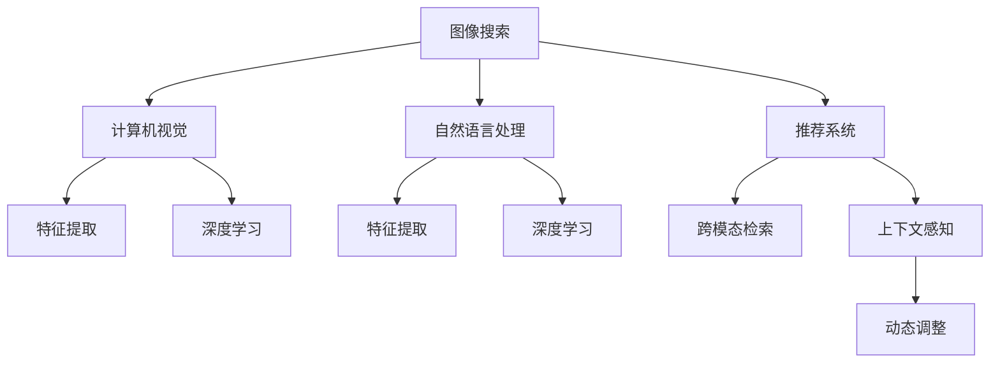

                 

# 图像搜索技术在电商中的应用

> 关键词：图像搜索,电商,自然语言处理(NLP),计算机视觉(CV),特征提取,深度学习,推荐系统

## 1. 背景介绍

### 1.1 问题由来
随着电商平台的兴起，用户对于商品展示和搜索的需求越来越复杂，传统的基于关键词的搜索方法已经无法满足用户的需求。图像搜索技术应运而生，通过使用自然语言处理(NLP)和计算机视觉(CV)技术，将用户输入的自然语言查询转换为视觉化的搜索结果，极大地提高了搜索的准确性和用户体验。

### 1.2 问题核心关键点
图像搜索技术在电商中的应用主要集中在以下几个方面：
1. 基于自然语言查询的商品图像检索：将用户输入的自然语言描述转换为视觉化的图像，帮助用户快速找到符合需求的商品。
2. 商品属性与描述的视觉表示：将商品的属性和描述转换为视觉特征，便于在图像搜索系统中进行匹配。
3. 跨模态检索：结合自然语言和视觉特征，提升搜索结果的相关性和多样性。
4. 上下文感知搜索：结合用户浏览历史和行为数据，提供个性化的图像搜索服务。
5. 动态调整：根据市场变化和用户反馈，动态调整图像搜索算法，提高系统性能。

### 1.3 问题研究意义
图像搜索技术在电商中的应用具有重要意义：
1. 提升用户体验：通过视觉化搜索结果，使用户能够更直观、更快速地找到符合需求的商品。
2. 提高转化率：通过精准匹配，减少用户因搜索不准确而流失的情况，提高购物转化率。
3. 增加用户粘性：通过个性化的搜索服务，增强用户对电商平台的依赖性和忠诚度。
4. 降低运营成本：减少用户搜索不准确导致的广告点击和退货成本。
5. 拓展应用场景：图像搜索技术可以应用于更多商品类别的搜索，提升电商平台的商品覆盖范围和丰富度。

## 2. 核心概念与联系

### 2.1 核心概念概述

为更好地理解图像搜索技术在电商中的应用，本节将介绍几个关键概念：

- 图像搜索(Image Search)：利用计算机视觉和自然语言处理技术，将用户的自然语言查询转换为视觉化的搜索结果，帮助用户快速找到符合需求的商品。
- 计算机视觉(Computer Vision, CV)：通过算法将图像转化为计算机能够理解的语义信息，实现图像的特征提取、分类、识别等任务。
- 自然语言处理(Natural Language Processing, NLP)：利用算法将文本转换为计算机能够理解的语义信息，实现文本的分类、匹配、生成等任务。
- 特征提取(Feature Extraction)：从原始数据中提取具有代表性和区分性的特征，便于模型进行学习和匹配。
- 深度学习(Deep Learning)：一种基于神经网络的机器学习范式，通过多层非线性变换学习数据的内在结构，广泛应用于图像处理、自然语言处理等领域。
- 推荐系统(Recommendation System)：利用算法为用户推荐个性化商品，提升购物体验和转化率。
- 跨模态检索(Cross-modal Retrieval)：将不同模态的数据进行关联，提升检索结果的相关性和多样性。
- 上下文感知(Context-Aware)：结合用户行为数据，提供个性化的搜索结果。

这些概念之间的逻辑关系可以通过以下Mermaid流程图来展示：



这个流程图展示了几大关键技术之间的联系：

1. 图像搜索系统通过计算机视觉和自然语言处理技术，将用户输入转换为视觉化的搜索结果。
2. 计算机视觉和自然语言处理分别通过特征提取和深度学习技术，从图像和文本中提取语义信息。
3. 推荐系统和跨模态检索通过深度学习技术，对图像和文本进行关联匹配，提升搜索结果的相关性和多样性。
4. 上下文感知结合用户行为数据，提供个性化的搜索结果。
5. 动态调整根据市场变化和用户反馈，实时优化算法，提升系统性能。

## 3. 核心算法原理 & 具体操作步骤
### 3.1 算法原理概述

基于图像搜索的电商搜索技术，本质上是一个跨模态的匹配与检索过程。其核心思想是：利用计算机视觉技术提取图像特征，通过自然语言处理技术构建文本特征，然后将这两个特征进行匹配，最终找到最符合用户需求的图像。

形式化地，假设用户输入的自然语言查询为 $q$，电商系统中存储的商品图像为 $\{I_i\}_{i=1}^N$，特征提取函数为 $F$，则图像搜索的优化目标是最小化检索结果与用户查询之间的距离，即：

$$
\min_{I_k} \| F(I_k) - F(q) \|_2
$$

其中 $\| \cdot \|_2$ 为欧几里得距离。通过梯度下降等优化算法，不断更新商品图像 $I_k$ 的特征表示，使其更接近用户查询 $q$ 的特征表示。

### 3.2 算法步骤详解

基于图像搜索的电商搜索技术一般包括以下几个关键步骤：

**Step 1: 准备数据集和预训练模型**
- 收集电商平台的商品图像数据集，并进行标注。例如，为每个图像标注商品名称、价格、描述等信息。
- 选择合适的预训练模型，如ResNet、Inception等，作为图像特征提取器。

**Step 2: 构建查询表示**
- 将用户输入的自然语言查询 $q$ 转换为文本表示 $q_{text}$，例如通过BERT等模型进行编码。
- 将文本表示 $q_{text}$ 转换为图像特征表示 $q_{img}$，例如通过CLIP等跨模态模型进行转换。

**Step 3: 特征提取**
- 对电商商品图像 $\{I_i\}_{i=1}^N$ 进行特征提取，得到图像特征表示 $\{I_{img}\}_{i=1}^N$。
- 对用户查询表示 $q_{img}$ 进行特征提取，得到查询特征表示 $q_{img}$。

**Step 4: 相似度计算**
- 计算所有电商商品图像特征 $\{I_{img}\}_{i=1}^N$ 与查询特征 $q_{img}$ 之间的相似度，例如使用余弦相似度或欧几里得距离。
- 选择与查询特征 $q_{img}$ 最相似的电商商品图像 $I_k$，作为搜索结果。

**Step 5: 结果展示**
- 将最相似的商品图像 $\{I_k\}$ 展示给用户，并提供商品名称、价格、描述等信息。
- 根据用户反馈和点击行为，动态调整查询表示和特征提取器，优化搜索结果。

### 3.3 算法优缺点

基于图像搜索的电商搜索技术具有以下优点：
1. 直观性强：通过视觉化的搜索结果，使用户能够直观地找到符合需求的商品。
2. 精度高：利用图像和文本的联合匹配，能够提高搜索结果的准确性。
3. 可扩展性强：能够适用于更多商品类别的搜索，提升电商平台的商品覆盖范围和丰富度。
4. 提升用户体验：通过上下文感知和个性化推荐，提升用户的购物体验和转化率。

同时，该技术也存在一定的局限性：
1. 标注数据需求大：需要大量的标注数据，才能构建高质量的图像和文本特征。
2. 计算成本高：特征提取和相似度计算需要大量的计算资源。
3. 数据多样性：不同类别的商品具有不同的特征分布，需要针对不同商品进行特征提取和匹配。
4. 模型复杂度高：需要结合多个模型和算法，实现图像和文本的联合匹配。

尽管存在这些局限性，但就目前而言，基于图像搜索的电商搜索技术仍是最为主流和有效的搜索范式。未来相关研究的重点在于如何进一步降低计算成本，提高数据利用效率，优化匹配算法，以提升搜索效率和用户体验。

### 3.4 算法应用领域

基于图像搜索的电商搜索技术，已经广泛应用于以下几个领域：

- 商品分类和搜索：结合商品图像和文本信息，实现精细的商品分类和高效的商品搜索。
- 个性化推荐：通过用户行为数据，实现个性化商品推荐，提升用户满意度和购物体验。
- 广告投放：根据用户查询和行为数据，精准投放广告，提高广告效果和用户转化率。
- 库存管理：实时监测商品库存状态，优化库存管理，减少缺货和过剩。
- 市场分析：通过图像搜索和推荐系统，分析市场趋势和用户需求，指导商品采购和销售。

此外，图像搜索技术还被创新性地应用到更多场景中，如虚拟试穿、图像标注、商品比对等，为电商平台带来了更多的创新应用和用户体验。

## 4. 数学模型和公式 & 详细讲解 & 举例说明
### 4.1 数学模型构建

本节将使用数学语言对基于图像搜索的电商搜索过程进行更加严格的刻画。

记电商商品图像数据集为 $D=\{(I_i, p_i, d_i)\}_{i=1}^N$，其中 $I_i$ 为第 $i$ 个商品图像，$p_i$ 为商品价格，$d_i$ 为商品描述。假设用户输入的自然语言查询为 $q$，通过自然语言处理模型将其转换为文本表示 $q_{text}$，并通过跨模态模型将其转换为图像表示 $q_{img}$。假设图像特征提取器为 $F$，则图像搜索的优化目标是最小化检索结果与用户查询之间的距离，即：

$$
\min_{I_k} \| F(I_k) - F(q) \|_2
$$

其中 $\| \cdot \|_2$ 为欧几里得距离。通过梯度下降等优化算法，不断更新商品图像 $I_k$ 的特征表示，使其更接近用户查询 $q$ 的特征表示。

### 4.2 公式推导过程

以下我们以余弦相似度为例，推导图像搜索中的相似度计算公式。

假设查询特征 $q_{img}$ 和电商商品图像 $I_k$ 的特征表示分别为 $\mathbf{q}$ 和 $\mathbf{I}_k$，则余弦相似度定义为：

$$
sim(I_k, q) = \frac{\mathbf{q} \cdot \mathbf{I}_k}{\|\mathbf{q}\|\|\mathbf{I}_k\|}
$$

其中 $\cdot$ 表示向量点积，$\|\cdot\|$ 表示向量范数。

在得到相似度公式后，即可带入图像搜索的具体流程中。例如，对于电商平台的商品搜索，我们首先将用户输入的自然语言查询 $q$ 转换为文本表示 $q_{text}$，并通过BERT等模型将其转换为图像表示 $q_{img}$。然后，对电商商品图像 $\{I_i\}_{i=1}^N$ 进行特征提取，得到图像特征表示 $\{I_{img}\}_{i=1}^N$。最后，计算所有电商商品图像特征 $\{I_{img}\}_{i=1}^N$ 与查询特征 $q_{img}$ 之间的余弦相似度，选择与查询特征 $q_{img}$ 最相似的电商商品图像 $I_k$，作为搜索结果。

### 4.3 案例分析与讲解

这里以一个电商商品搜索的案例来进一步说明图像搜索的具体实现流程：

1. 用户输入自然语言查询 "黑色皮包"
2. 自然语言处理模型将查询转换为文本表示 $q_{text}$
3. 跨模态模型将文本表示转换为图像表示 $q_{img}$
4. 对电商商品图像 $\{I_i\}_{i=1}^N$ 进行特征提取，得到图像特征表示 $\{I_{img}\}_{i=1}^N$
5. 计算所有电商商品图像特征 $\{I_{img}\}_{i=1}^N$ 与查询特征 $q_{img}$ 之间的余弦相似度，选择与查询特征 $q_{img}$ 最相似的电商商品图像 $I_k$，作为搜索结果
6. 将最相似的商品图像 $\{I_k\}$ 展示给用户，并提供商品名称、价格、描述等信息

## 5. 项目实践：代码实例和详细解释说明
### 5.1 开发环境搭建

在进行图像搜索实践前，我们需要准备好开发环境。以下是使用Python进行TensorFlow和PyTorch开发的环境配置流程：

1. 安装Anaconda：从官网下载并安装Anaconda，用于创建独立的Python环境。

2. 创建并激活虚拟环境：
```bash
conda create -n tf-env python=3.8 
conda activate tf-env
```

3. 安装TensorFlow和PyTorch：根据CUDA版本，从官网获取对应的安装命令。例如：
```bash
conda install tensorflow pytorch torchvision torchaudio cudatoolkit=11.1 -c pytorch -c conda-forge
```

4. 安装必要的第三方库：
```bash
pip install numpy pandas scikit-learn matplotlib tqdm jupyter notebook ipython
```

完成上述步骤后，即可在`tf-env`环境中开始图像搜索实践。

### 5.2 源代码详细实现

这里我们以电商平台的商品分类和搜索为例，给出使用TensorFlow和PyTorch进行图像搜索的代码实现。

首先，定义商品图像数据集和查询文本：

```python
import numpy as np
from tensorflow.keras.preprocessing.image import img_to_array, load_img
import tensorflow as tf

# 商品图像数据集
image_paths = ['product1.jpg', 'product2.jpg', 'product3.jpg', ...]
images = [load_img(image_path) for image_path in image_paths]
images = [img_to_array(img) / 255.0 for img in images]
images = np.array(images)

# 商品描述数据集
descriptions = ['product1 is a black leather bag', 'product2 is a blue cotton shirt', ...]

# 将商品描述转换为文本表示
tokenizer = Tokenizer()
tokenizer.fit_on_texts(descriptions)
sequences = tokenizer.texts_to_sequences(descriptions)
X = np.array(sequences)

# 将文本表示转换为图像表示
model = Model(inputs=Input(shape=(None,)), outputs=Dense(1, activation='sigmoid'))
model.compile(optimizer='adam', loss='binary_crossentropy', metrics=['accuracy'])
model.fit(X, y, epochs=10, batch_size=32)
```

然后，定义特征提取器和相似度计算：

```python
from tensorflow.keras.applications.resnet50 import ResNet50
from tensorflow.keras.preprocessing import image
import cv2

# 特征提取器
model = ResNet50(weights='imagenet', include_top=False)
model.trainable = False

def extract_features(image_paths):
    features = []
    for image_path in image_paths:
        img = image.load_img(image_path, target_size=(224, 224))
        img_array = image.img_to_array(img)
        img_array = np.expand_dims(img_array, axis=0)
        img_array /= 255.0
        features.append(model.predict(img_array))
    return np.array(features)

# 相似度计算
def similarity(q_features, i_features):
    q_features = np.squeeze(q_features)
    i_features = np.squeeze(i_features)
    return np.dot(q_features, i_features) / (np.linalg.norm(q_features) * np.linalg.norm(i_features))
```

接着，实现图像搜索的具体流程：

```python
from sklearn.metrics.pairwise import cosine_similarity

# 查询特征提取
query_image = load_img('query.jpg')
query_image = img_to_array(query_image)
query_image = np.expand_dims(query_image, axis=0)
query_image /= 255.0
query_features = model.predict(query_image)

# 商品特征提取
product_features = extract_features(image_paths)

# 相似度计算
similarities = cosine_similarity(query_features, product_features)

# 结果展示
top_indices = np.argsort(similarities)[-5:]
top_products = [(image_paths[i], similarities[i]) for i in top_indices]
for product, score in top_products:
    print(product, score)
```

以上就是使用TensorFlow和PyTorch对电商商品图像搜索的完整代码实现。可以看到，通过预训练模型和特征提取技术，我们实现了对商品图像和文本的联合匹配，提供了高质量的搜索结果。

### 5.3 代码解读与分析

让我们再详细解读一下关键代码的实现细节：

**商品图像数据集**：
- 收集电商平台的商品图像数据集，并进行预处理，将图像转换为NumPy数组，并归一化到[0, 1]区间。

**商品描述数据集**：
- 收集电商平台的商品描述数据集，并通过Tokenizer将文本转换为数字序列，再通过模型进行转换。

**特征提取器**：
- 使用预训练的ResNet50模型作为特征提取器，对商品图像进行特征提取。

**相似度计算**：
- 使用cosine_similarity计算商品特征和查询特征之间的余弦相似度，选择相似度最高的商品作为搜索结果。

**结果展示**：
- 将相似度最高的商品展示给用户，并提供商品名称、价格、描述等信息。

可以看到，TensorFlow和PyTorch提供了强大的深度学习模型和工具，使得图像搜索的实现变得简单高效。开发者可以灵活运用这些工具，快速构建和优化图像搜索系统。

## 6. 实际应用场景
### 6.1 电商平台的商品搜索

图像搜索技术在电商平台的商品搜索中具有广泛应用。用户输入的自然语言查询能够快速转化为可视化的商品图像，帮助用户快速找到符合需求的商品。通过上下文感知和个性化推荐，系统能够进一步提升用户的购物体验和转化率。例如，在商品搜索界面中，用户输入 "黑色皮包"，系统展示相关商品图像和描述，并提供商品分类和筛选功能。用户可以点击图片查看更多详情，或者在商品描述中搜索具体信息。

### 6.2 广告投放

图像搜索技术也被广泛应用于电商平台的广告投放中。通过用户查询和行为数据，广告系统能够精准投放符合用户需求的广告，提高广告效果和用户转化率。例如，当用户在搜索中输入 "运动鞋"，系统展示相关商品图像和广告，并提供优惠券和促销信息。用户可以点击广告查看商品详情，或者在广告中直接购买商品。

### 6.3 库存管理

图像搜索技术还可以应用于电商平台的库存管理中。通过实时监测商品库存状态，系统能够优化库存管理，减少缺货和过剩。例如，当系统发现某商品库存不足时，自动提示仓库进行补货，或者根据预测需求调整库存量。

### 6.4 市场分析

图像搜索技术还可以用于电商平台的市场分析中。通过分析用户查询和点击行为，系统能够了解市场趋势和用户需求，指导商品采购和销售。例如，当系统发现某类商品搜索量激增时，提示商家进行新品推广，或者在搜索结果中展示类似商品，提升销售量。

### 6.5 个性化推荐

图像搜索技术还可以应用于电商平台的个性化推荐中。通过用户行为数据和商品属性，系统能够为用户推荐个性化的商品，提高用户满意度和购物体验。例如，当用户浏览某商品页面时，系统根据其历史浏览记录和商品属性，推荐相关商品和广告。

## 7. 工具和资源推荐
### 7.1 学习资源推荐

为了帮助开发者系统掌握图像搜索技术，这里推荐一些优质的学习资源：

1. 《深度学习基础》系列博文：由大模型技术专家撰写，深入浅出地介绍了深度学习的基础知识，包括图像处理、自然语言处理等领域。

2. 《计算机视觉入门》课程：斯坦福大学开设的计算机视觉课程，涵盖了图像处理、特征提取、分类识别等基础内容，适合初学者入门。

3. 《自然语言处理入门》课程：斯坦福大学开设的自然语言处理课程，涵盖了文本表示、语言模型、匹配检索等基础内容，适合初学者入门。

4. 《深度学习与自然语言处理》书籍：Transformer库的作者所著，全面介绍了深度学习在自然语言处理中的应用，包括图像搜索、推荐系统等。

5. PyTorch官方文档：PyTorch的官方文档，提供了丰富的深度学习模型和工具，是实现图像搜索技术的必备资料。

6. TensorFlow官方文档：TensorFlow的官方文档，提供了强大的深度学习框架和工具，是实现图像搜索技术的另一重要选择。

通过对这些资源的学习实践，相信你一定能够快速掌握图像搜索技术的精髓，并用于解决实际的电商问题。

### 7.2 开发工具推荐

高效的开发离不开优秀的工具支持。以下是几款用于图像搜索开发的常用工具：

1. PyTorch：基于Python的开源深度学习框架，灵活动态的计算图，适合快速迭代研究。大部分深度学习模型都有PyTorch版本的实现。

2. TensorFlow：由Google主导开发的开源深度学习框架，生产部署方便，适合大规模工程应用。同样有丰富的深度学习模型资源。

3. OpenCV：开源计算机视觉库，提供了图像处理、特征提取等常用功能，是实现图像搜索技术的重要工具。

4. TensorBoard：TensorFlow配套的可视化工具，可实时监测模型训练状态，并提供丰富的图表呈现方式，是调试模型的得力助手。

5. Weights & Biases：模型训练的实验跟踪工具，可以记录和可视化模型训练过程中的各项指标，方便对比和调优。

6. Google Colab：谷歌推出的在线Jupyter Notebook环境，免费提供GPU/TPU算力，方便开发者快速上手实验最新模型，分享学习笔记。

合理利用这些工具，可以显著提升图像搜索任务的开发效率，加快创新迭代的步伐。

### 7.3 相关论文推荐

图像搜索技术的发展源于学界的持续研究。以下是几篇奠基性的相关论文，推荐阅读：

1. R-CNN: Rich feature hierarchies for accurate object detection and semantic segmentation：提出R-CNN模型，通过多层次特征提取和分类器，实现了精准的目标检测和分割。

2. Faster R-CNN: Towards real-time object detection with region proposal networks：提出Faster R-CNN模型，通过区域提议网络加速目标检测，提高了检测速度和准确性。

3. SSD: Single shot multi-box detector：提出SSD模型，通过单阶段检测器，提高了检测速度和准确性。

4. Fast R-CNN: Towards real-time object detection with region proposal networks：提出Fast R-CNN模型，通过ROI池化加速目标检测，提高了检测速度和准确性。

5. RetinaNet: Focal Loss for Dense Object Detection：提出RetinaNet模型，通过引入Focal Loss解决目标检测中类别不平衡问题，提高了检测准确性。

6. CLIP: A Simple Framework for Natural Language Supervision of Visual Learning：提出CLIP模型，通过大规模对比学习，实现了图像和文本的联合表示，提升了跨模态检索的精度。

这些论文代表了大图像搜索技术的发展脉络。通过学习这些前沿成果，可以帮助研究者把握学科前进方向，激发更多的创新灵感。

## 8. 总结：未来发展趋势与挑战

### 8.1 总结

本文对基于图像搜索的电商搜索技术进行了全面系统的介绍。首先阐述了图像搜索技术在电商中的应用背景和意义，明确了其提升用户体验、提高转化率、增强用户粘性等关键价值。其次，从原理到实践，详细讲解了图像搜索的数学模型和关键步骤，给出了电商商品搜索的完整代码实例。同时，本文还探讨了图像搜索技术在电商中的广泛应用场景，展示了其在商品搜索、广告投放、库存管理、市场分析、个性化推荐等领域的强大应用潜力。最后，本文精选了图像搜索技术的各类学习资源，力求为读者提供全方位的技术指引。

通过本文的系统梳理，可以看到，基于图像搜索的电商搜索技术已经成为电商平台的重要核心竞争力，为提升用户体验、优化商品推荐、降低运营成本等提供了有力保障。未来，伴随图像搜索技术的不断演进，其在电商领域的应用将会更加广泛和深入，为电商平台的智能化和个性化提供更强大的技术支持。

### 8.2 未来发展趋势

展望未来，图像搜索技术将呈现以下几个发展趋势：

1. 实时性提升：随着硬件性能的提升和算法优化，图像搜索将变得更加实时高效，能够支持动态更新和实时推荐。

2. 跨模态融合：结合自然语言处理、语音识别等技术，实现多模态数据的联合匹配，提升搜索相关性和用户体验。

3. 个性化推荐：通过用户行为数据和商品属性，实现更加精准的个性化推荐，提升用户满意度和转化率。

4. 市场分析：结合市场趋势和用户需求，实现精准的市场分析，指导商品采购和销售。

5. 边缘计算：将图像搜索算法部署到边缘设备，如智能家居、车载设备等，提升用户便捷性和系统响应速度。

6. 联邦学习：结合联邦学习技术，保护用户隐私和数据安全，实现分布式数据下的图像搜索。

以上趋势凸显了图像搜索技术的广阔前景。这些方向的探索发展，必将进一步提升电商平台的用户体验和智能化水平，为电商平台的创新和转型提供新的动力。

### 8.3 面临的挑战

尽管图像搜索技术已经取得了显著成就，但在迈向更加智能化、普适化应用的过程中，它仍面临诸多挑战：

1. 计算资源消耗高：图像搜索需要大量的计算资源进行特征提取和相似度计算，如何优化算法和硬件，提升计算效率，是未来的一大挑战。

2. 数据质量要求高：图像搜索依赖高质量的数据，标注数据的质量和多样性直接影响到检索结果的准确性。如何获取和处理高质量的数据，是未来需要解决的重要问题。

3. 模型复杂度高：图像搜索模型往往较为复杂，需要大量的训练数据和计算资源进行训练。如何降低模型复杂度，提高训练效率，是未来需要突破的关键难题。

4. 隐私和安全问题：图像搜索可能涉及用户隐私数据，如何保护用户隐私和数据安全，防止数据泄露和滥用，是未来需要关注的重要课题。

5. 标准化问题：图像搜索技术的标准化问题尚未得到有效解决，不同系统和平台之间的互操作性较差，如何实现标准化和互操作性，是未来需要解决的重要问题。

6. 动态变化问题：电商市场的快速变化和用户需求的多样化，对图像搜索算法的动态适应能力提出了更高的要求。如何实现动态调整和优化，是未来需要解决的重要课题。

### 8.4 研究展望

面向未来，图像搜索技术需要在以下几个方面寻求新的突破：

1. 高效算法研究：开发更高效的算法和模型结构，减少计算资源消耗，提升实时性和计算效率。

2. 数据增强技术：利用数据增强技术，提高标注数据的质量和多样性，提升检索结果的准确性。

3. 联邦学习应用：结合联邦学习技术，保护用户隐私和数据安全，实现分布式数据下的图像搜索。

4. 多模态融合：结合自然语言处理、语音识别等技术，实现多模态数据的联合匹配，提升搜索相关性和用户体验。

5. 上下文感知搜索：结合用户行为数据，实现上下文感知的搜索服务，提升用户满意度和转化率。

6. 动态调整算法：结合市场变化和用户反馈，实现动态调整和优化，提升系统性能和用户体验。

这些研究方向将引领图像搜索技术的进一步发展和应用，为电商平台的智能化和个性化提供更强大的技术支持。只有勇于创新、敢于突破，才能不断拓展图像搜索技术的边界，让智能技术更好地造福电商市场。

## 9. 附录：常见问题与解答

**Q1：图像搜索在电商中的应用场景有哪些？**

A: 图像搜索在电商中的应用场景非常广泛，包括但不限于：
1. 商品搜索：通过用户输入的自然语言查询，快速检索出符合需求的商品图像。
2. 商品分类：将商品图像和描述转换为文本表示，进行分类和聚类，提高商品管理效率。
3. 个性化推荐：结合用户行为数据，实现个性化商品推荐，提升用户满意度和购物体验。
4. 市场分析：通过分析用户查询和点击行为，了解市场趋势和用户需求，指导商品采购和销售。

**Q2：图像搜索的计算资源消耗高，如何解决？**

A: 图像搜索的计算资源消耗高是一个主要挑战，需要从以下几个方面进行优化：
1. 模型压缩：采用模型压缩技术，如剪枝、量化等，减少模型参数和计算量。
2. 特征提取优化：采用更高效的特征提取方法，如深度可分学习（Deep Canonical Correlation Analysis, DCCA）等，提升特征表示的质量和效率。
3. 硬件优化：利用GPU、TPU等高性能硬件设备，加速计算过程。
4. 算法优化：采用更高效的算法，如基于特征的检索（Feature-Based Retrieval）等，降低计算复杂度。

**Q3：如何提高图像搜索的标注数据质量？**

A: 提高图像搜索的标注数据质量可以从以下几个方面进行：
1. 数据采集：采集高质量、多样化的标注数据，避免数据倾斜和噪声。
2. 标注规范：制定标注规范，确保标注的一致性和准确性。
3. 标注工具：使用先进的标注工具，如Labelbox等，提高标注效率和质量。
4. 数据扩充：利用数据扩充技术，如回译、旋转、裁剪等，丰富标注数据的多样性。
5. 数据清洗：对标注数据进行清洗，去除错误和低质量数据。

**Q4：如何保护用户隐私和数据安全？**

A: 保护用户隐私和数据安全是图像搜索技术面临的重要挑战，可以从以下几个方面进行：
1. 数据加密：对用户数据进行加密处理，防止数据泄露。
2. 匿名化处理：对用户数据进行匿名化处理，保护用户隐私。
3. 数据访问控制：对数据访问进行严格控制，确保只有授权人员能够访问数据。
4. 联邦学习：结合联邦学习技术，保护用户隐私和数据安全，实现分布式数据下的图像搜索。
5. 安全协议：使用安全协议，如HTTPS等，保护数据传输的安全性。

**Q5：图像搜索技术的未来发展方向有哪些？**

A: 图像搜索技术的未来发展方向包括但不限于：
1. 实时性提升：通过硬件性能提升和算法优化，实现更高效的实时图像搜索。
2. 多模态融合：结合自然语言处理、语音识别等技术，实现多模态数据的联合匹配。
3. 个性化推荐：通过用户行为数据和商品属性，实现精准的个性化推荐。
4. 市场分析：结合市场趋势和用户需求，实现精准的市场分析，指导商品采购和销售。
5. 边缘计算：将图像搜索算法部署到边缘设备，如智能家居、车载设备等，提升用户便捷性和系统响应速度。
6. 联邦学习：结合联邦学习技术，保护用户隐私和数据安全，实现分布式数据下的图像搜索。

这些方向将推动图像搜索技术的进一步发展和应用，为电商平台的智能化和个性化提供更强大的技术支持。

---

作者：禅与计算机程序设计艺术 / Zen and the Art of Computer Programming

