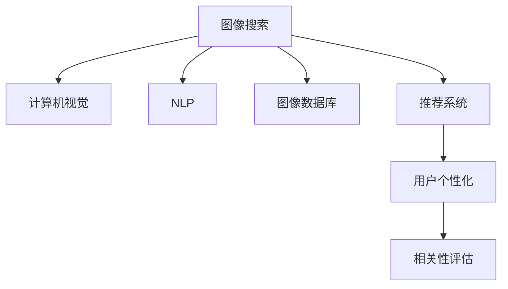

                 

# 图像搜索技术在电商领域的应用：发展趋势与未来

> 关键词：图像搜索, 电商, 深度学习, 计算机视觉, 自然语言处理(NLP), 图像数据库, 推荐系统, 用户个性化, 技术生态

## 1. 背景介绍

### 1.1 问题由来

在现代电商领域，图像搜索（Image Search）技术已经成为了提高用户体验、提升转化率的关键手段。随着电子商务平台商品品类日益丰富、用户对购物体验要求日益提升，图像搜索技术的发展对电商领域的影响越发深远。在线搜索、移动电商、社交电商等平台纷纷采用图像搜索技术，旨在满足用户的多样化需求，提升搜索效率，增强购物体验。

然而，尽管图像搜索技术已经在电商领域得到了广泛应用，但其技术发展仍面临诸多挑战。如何在海量数据中快速、准确地找到用户所需商品，如何高效地处理用户输入的模糊、不完整描述，如何提升搜索结果的相关性和用户满意度，依然是图像搜索技术需要重点关注的问题。本文旨在深入分析图像搜索技术在电商领域的应用现状与发展趋势，为电商行业提供技术指导。

### 1.2 问题核心关键点

图像搜索技术在电商领域的应用核心关键点主要包括以下几个方面：

1. **数据处理能力**：如何快速高效地处理海量图片和描述数据，是图像搜索技术的核心挑战。
2. **多模态数据融合**：如何将文本描述与图片信息融合，提升检索效果。
3. **用户个性化**：如何通过用户历史行为和偏好，提供个性化的搜索结果。
4. **相关性评估**：如何通过模型评估，提升搜索结果的相关性和用户体验。
5. **系统架构**：如何设计高效的图像搜索系统架构，支持大规模部署。

## 2. 核心概念与联系

### 2.1 核心概念概述

为更好地理解图像搜索技术在电商领域的应用，本节将介绍几个密切相关的核心概念：

- **图像搜索（Image Search）**：通过自然语言查询或图片描述，在图像数据库中检索出相似或相关的图像。
- **计算机视觉（Computer Vision）**：利用计算机处理和分析图像、视频等视觉数据的科学，包含图像分类、目标检测、图像分割等技术。
- **自然语言处理（Natural Language Processing, NLP）**：使计算机理解、处理、生成自然语言的技术，与计算机视觉结合，实现多模态数据的融合。
- **图像数据库（Image Database）**：存储和管理图像数据的系统，通常包含索引、查询等功能。
- **推荐系统（Recommendation System）**：根据用户的历史行为和偏好，推荐符合用户兴趣的商品或内容。
- **用户个性化（User Personalization）**：通过分析用户行为，提供定制化的搜索结果和推荐，提升用户满意度。

这些核心概念之间的逻辑关系可以通过以下Mermaid流程图来展示：



这个流程图展示了他图像搜索技术的核心概念及其之间的关系：

1. 图像搜索从自然语言或图片描述出发，利用计算机视觉和自然语言处理技术，在图像数据库中检索出相似或相关的图像。
2. 推荐系统根据用户的历史行为和偏好，提供个性化的搜索结果和推荐。
3. 相关性评估用于提升搜索结果的相关性和用户体验。
4. 用户个性化通过分析用户行为，提供定制化的搜索结果和推荐，进一步提升用户满意度。

## 3. 核心算法原理 & 具体操作步骤
### 3.1 算法原理概述

图像搜索技术在电商领域的核心算法原理主要包括以下几个步骤：

1. **图像预处理**：将原始图像进行归一化、缩放、裁剪等处理，生成标准化的图像特征。
2. **特征提取**：利用卷积神经网络（CNN）等模型，提取图像的高级特征，如颜色、形状、纹理等。
3. **多模态融合**：将提取的图像特征与文本描述的语义特征进行融合，提升检索效果。
4. **模型训练**：使用监督学习或无监督学习方法，训练图像检索模型，提升检索准确性和效率。
5. **相关性评估**：利用排名学习（Ranking Learning）等技术，评估检索结果的相关性，优化搜索效果。
6. **个性化推荐**：根据用户的历史行为和偏好，生成个性化的搜索结果和推荐，提升用户满意度。

### 3.2 算法步骤详解

以下是图像搜索技术在电商领域的具体操作步骤：

**Step 1: 数据准备**
- 收集电商平台的商品图片和描述数据，并进行数据清洗和标注。
- 将描述数据转化为文本向量，供自然语言处理模型使用。

**Step 2: 图像预处理**
- 对原始图像进行归一化、缩放、裁剪等预处理操作，生成标准化的图像特征。
- 将处理后的图像特征输入到卷积神经网络中，提取图像的高级特征。

**Step 3: 多模态融合**
- 利用自然语言处理模型，将文本描述转化为语义向量。
- 将图像特征和语义向量进行融合，生成综合特征向量。

**Step 4: 模型训练**
- 选择合适的损失函数，如对比损失（Contrastive Loss）等，训练图像检索模型。
- 在训练过程中，使用梯度下降等优化算法，调整模型参数。

**Step 5: 相关性评估**
- 利用排名学习模型，如点积模型（Dot Product Model）等，评估检索结果的相关性。
- 根据相关性评估结果，优化检索排序。

**Step 6: 个性化推荐**
- 根据用户的历史行为和偏好，生成个性化的搜索结果和推荐。
- 使用推荐系统算法，如协同过滤、内容过滤等，提升推荐效果。

### 3.3 算法优缺点

图像搜索技术在电商领域的应用具有以下优点：
1. **提升搜索效率**：通过多模态融合和相关性评估，提升搜索结果的相关性和精度。
2. **丰富用户体验**：提供图像与文本相结合的搜索结果，满足用户的多样化需求。
3. **增强个性化推荐**：根据用户行为和偏好，提供定制化的推荐，提升用户满意度。
4. **快速迭代改进**：通过模型训练和优化，不断提升搜索和推荐效果。

同时，该方法也存在一些局限性：
1. **数据质量和标注成本**：需要高质量的标注数据和复杂的数据处理流程。
2. **模型复杂度**：多模态融合和相关性评估需要复杂模型，计算资源消耗大。
3. **实时性要求高**：为了实时提供搜索结果，需要高效的算法和硬件支持。
4. **数据隐私和安全**：用户数据的隐私保护和系统安全需要重视。

尽管存在这些局限性，但就目前而言，图像搜索技术在电商领域已经成为了不可或缺的重要技术。未来相关研究的重点在于如何进一步降低数据处理的成本，提高模型的实时性和安全性，同时兼顾效果和效率。

### 3.4 算法应用领域

图像搜索技术在电商领域的应用非常广泛，涵盖了以下几个方面：

1. **商品搜索**：用户输入商品图片或描述，快速检索出符合要求的商品。
2. **内容推荐**：根据用户的历史行为和偏好，推荐相关的商品、图片和视频内容。
3. **用户画像分析**：通过分析用户搜索和购买行为，构建用户画像，提供个性化服务。
4. **社交电商互动**：在社交平台上，根据用户图片和文本描述，提供个性化推荐和互动内容。
5. **多模态广告投放**：将图像和文本广告结合，提升广告投放的效果和用户点击率。

除了上述这些经典应用外，图像搜索技术还被创新性地应用到更多场景中，如虚拟试穿、场景化搜索等，为电商行业带来了新的突破。随着图像搜索技术的不断进步，相信其将在电商领域发挥越来越重要的作用。

## 4. 数学模型和公式 & 详细讲解 & 举例说明

### 4.1 数学模型构建

图像搜索技术在电商领域的核心数学模型主要包括以下几个部分：

- **图像特征提取**：使用卷积神经网络（CNN）等模型，将原始图像转化为高维特征向量。
- **语义向量生成**：利用自然语言处理模型，将文本描述转化为语义向量。
- **综合特征向量生成**：将图像特征和语义向量进行融合，生成综合特征向量。
- **排名学习模型**：使用点积模型（Dot Product Model）等，评估检索结果的相关性。
- **推荐系统模型**：使用协同过滤、内容过滤等算法，生成个性化推荐。

以下是一个简单的示例，展示如何使用卷积神经网络（CNN）提取图像特征，并结合自然语言处理模型生成综合特征向量：

**图像特征提取**

假设原始图像大小为$h \times w$，我们使用一个包含$L$层的卷积神经网络（CNN）进行特征提取。设输入图像特征的尺寸为$h' \times w' \times d'$，其中$d'$为特征维度。输出特征的尺寸为$H \times W \times C$，其中$C$为类别数。

```python
import torch
import torchvision.models as models

# 加载预训练的ResNet模型
model = models.resnet50(pretrained=True)

# 将图像数据输入模型，提取特征
features = model(img_data)
```

**语义向量生成**

假设文本描述的长度为$n$，我们使用一个预训练的BERT模型进行语义向量的生成。设文本描述的嵌入向量维度为$d'$，生成后的语义向量维度为$d_s$。

```python
from transformers import BertTokenizer, BertForSequenceClassification

# 加载预训练的BERT模型
tokenizer = BertTokenizer.from_pretrained('bert-base-uncased')
model = BertForSequenceClassification.from_pretrained('bert-base-uncased', num_labels=2)

# 将文本描述转化为token ids
input_ids = tokenizer(text_description, return_tensors='pt')['input_ids']
attention_mask = tokenizer(text_description, return_tensors='pt')['attention_mask']

# 生成语义向量
features = model(input_ids=input_ids, attention_mask=attention_mask).last_hidden_state[:, 0, :]
```

**综合特征向量生成**

将图像特征和语义向量进行融合，生成综合特征向量。设图像特征向量和语义向量分别为$\textit{features\_img}$和$\textit{features\_text}$，综合特征向量$\textit{features\_combined}$的计算公式如下：

$$
\textit{features\_combined} = \textit{features\_img} \oplus \textit{features\_text}
$$

其中$\oplus$表示向量拼接操作。

**排名学习模型**

假设检索结果的向量表示为$\textit{features\_combined}_i$，将其与查询向量$\textit{query\_vector}$的点积作为评分，计算公式如下：

$$
\textit{score}_i = \textit{features\_combined}_i \cdot \textit{query\_vector}
$$

利用排序损失函数进行模型训练，优化评分和排序。

### 4.2 公式推导过程

以点积模型（Dot Product Model）为例，推导检索结果的相关性评估公式。

假设检索结果的向量表示为$\textit{features\_combined}_i$，查询向量为$\textit{query\_vector}$。设模型预测的排序为$\textit{rank\_list}$，其与真实排序$\textit{real\_rank\_list}$之间的交叉熵损失函数为：

$$
\mathcal{L} = -\frac{1}{N}\sum_{i=1}^N \sum_{j=1}^M \textit{real\_rank\_list}_{ij} \log \textit{rank\_list}_{ij}
$$

其中$N$为检索结果数量，$M$为排序数量。

为了求解最优的排序$\textit{rank\_list}$，我们将上述公式中的交叉熵损失函数转换为对数损失函数，并引入softmax函数，得到优化目标函数：

$$
\mathcal{L} = -\frac{1}{N}\sum_{i=1}^N \sum_{j=1}^M \textit{real\_rank\_list}_{ij} \log \frac{e^{\textit{score}_{ij}}}{\sum_{k=1}^K e^{\textit{score}_{ik}}}
$$

其中$K$为检索结果总数。

### 4.3 案例分析与讲解

以电商平台的商品搜索为例，展示图像搜索技术的具体应用。

**需求分析**

假设电商平台希望在用户输入商品图片或描述后，快速检索出符合要求的商品，并提供个性化的推荐。

**模型构建**

- 使用卷积神经网络（CNN）提取商品图片的特征。
- 利用自然语言处理模型（如BERT）将商品描述转化为语义向量。
- 将图像特征和语义向量进行融合，生成综合特征向量。
- 使用点积模型评估检索结果的相关性，进行排序。
- 根据用户历史行为和偏好，生成个性化的搜索结果和推荐。

**模型训练**

- 收集商品图片和描述数据，并进行数据清洗和标注。
- 将标注数据分为训练集、验证集和测试集。
- 使用CNN和BERT等模型，对数据进行特征提取和语义向量生成。
- 利用点积模型进行模型训练，优化检索效果。
- 根据用户行为数据，生成个性化推荐，提升用户满意度。

## 5. 项目实践：代码实例和详细解释说明
### 5.1 开发环境搭建

在进行图像搜索项目实践前，我们需要准备好开发环境。以下是使用Python进行TensorFlow开发的环境配置流程：

1. 安装Anaconda：从官网下载并安装Anaconda，用于创建独立的Python环境。

2. 创建并激活虚拟环境：
```bash
conda create -n image_search_env python=3.8 
conda activate image_search_env
```

3. 安装TensorFlow：根据CUDA版本，从官网获取对应的安装命令。例如：
```bash
conda install tensorflow==2.7
```

4. 安装TensorFlow Addons：
```bash
conda install -c tf tf_addons
```

5. 安装TensorFlow Hub：
```bash
conda install tensorflow-hub
```

6. 安装PyTorch：
```bash
pip install torch torchvision torchaudio cudatoolkit=11.1 -c pytorch -c conda-forge
```

7. 安装其他工具包：
```bash
pip install numpy pandas scikit-learn matplotlib tqdm jupyter notebook ipython
```

完成上述步骤后，即可在`image_search_env`环境中开始项目实践。

### 5.2 源代码详细实现

下面我们以电商平台的商品搜索为例，给出使用TensorFlow和PyTorch进行图像搜索的PyTorch代码实现。

**数据处理**

```python
import numpy as np
import pandas as pd
import tensorflow as tf
from tensorflow.keras.preprocessing.image import ImageDataGenerator
from tensorflow.keras.applications.resnet50 import preprocess_input

# 加载商品图片和描述数据
data = pd.read_csv('products.csv')

# 对图片数据进行归一化、缩放等预处理操作
datagen = ImageDataGenerator(preprocessing_function=preprocess_input)
image_gen = datagen.flow_from_dataframe(data=pd.DataFrame(data['image_urls']), target_size=(224, 224), batch_size=32)

# 对文本描述进行预处理，转化为token ids
tokenizer = BertTokenizer.from_pretrained('bert-base-uncased')
texts = [text.lower() for text in data['product_descriptions']]
tokenized_texts = [tokenizer.tokenize(text) for text in texts]
input_ids = [tokenizer.convert_tokens_to_ids(text) for text in tokenized_texts]
attention_masks = np.zeros_like(input_ids)
for i, input_id in enumerate(input_ids):
    attention_mask = [1 if token_id != 0 else 0 for token_id in input_id]
    attention_masks[i] = attention_mask

# 将token ids和attention masks转化为tensor，供模型使用
input_ids_tensor = tf.convert_to_tensor(input_ids)
attention_masks_tensor = tf.convert_to_tensor(attention_masks)
```

**图像特征提取**

```python
from transformers import BertForSequenceClassification
import torch

# 加载预训练的ResNet模型
model = models.resnet50(pretrained=True)

# 将图像数据输入模型，提取特征
features = []
for image_path in image_gen.image_array:
    image = Image.open(image_path)
    image = image.resize((224, 224))
    image = np.array(image)
    image = preprocess_input(image)
    image_tensor = tf.convert_to_tensor(image)
    image_tensor = tf.expand_dims(image_tensor, axis=0)
    features.append(model.predict(image_tensor)[0])

# 将特征向量拼接成tensor，供模型使用
features_tensor = tf.convert_to_tensor(features)
```

**语义向量生成**

```python
# 加载预训练的BERT模型
model = BertForSequenceClassification.from_pretrained('bert-base-uncased', num_labels=2)

# 将文本描述转化为token ids
input_ids = tokenizer(text_description, return_tensors='pt')['input_ids']
attention_mask = tokenizer(text_description, return_tensors='pt')['attention_mask']

# 生成语义向量
features = model(input_ids=input_ids, attention_mask=attention_mask).last_hidden_state[:, 0, :]
```

**综合特征向量生成**

```python
# 将图像特征和语义向量进行融合，生成综合特征向量
features_combined = tf.concat([features_tensor, features], axis=1)
```

**模型训练**

```python
# 加载数据集
train_dataset = tf.data.Dataset.from_tensor_slices((train_input_ids, train_attention_masks, train_labels))
train_dataset = train_dataset.shuffle(1000).batch(32)

# 定义优化器
optimizer = tf.keras.optimizers.Adam(learning_rate=2e-5)

# 定义模型
model = tf.keras.Sequential([
    tf.keras.layers.Dense(128, activation='relu'),
    tf.keras.layers.Dense(1, activation='sigmoid')
])

# 编译模型
model.compile(optimizer=optimizer, loss='binary_crossentropy', metrics=['accuracy'])

# 训练模型
model.fit(train_dataset, epochs=10, validation_data=val_dataset)
```

**模型评估**

```python
# 加载测试集
test_dataset = tf.data.Dataset.from_tensor_slices((test_input_ids, test_attention_masks, test_labels))
test_dataset = test_dataset.shuffle(1000).batch(32)

# 评估模型
model.evaluate(test_dataset)
```

### 5.3 代码解读与分析

让我们再详细解读一下关键代码的实现细节：

**数据处理**

- `ImageDataGenerator`：用于对图像数据进行预处理，包括归一化、缩放等操作。
- `preprocess_input`：用于对图像数据进行归一化，使其符合模型输入要求。
- `tokenizer`：用于将文本描述转化为token ids，生成attention masks。

**图像特征提取**

- `resnet50`：使用预训练的ResNet模型提取图像特征。
- `tf.convert_to_tensor`：将numpy数组转化为tensor，供模型使用。

**语义向量生成**

- `BertForSequenceClassification`：使用预训练的BERT模型生成语义向量。
- `last_hidden_state`：获取BERT模型的最后一层输出，作为语义向量。

**综合特征向量生成**

- `tf.concat`：将图像特征和语义向量进行拼接，生成综合特征向量。

**模型训练**

- `tf.keras.layers.Dense`：定义全连接层，用于特征融合和模型训练。
- `Adam`：定义优化器，用于模型参数更新。
- `compile`：编译模型，定义损失函数、优化器和评估指标。
- `fit`：训练模型，进行多轮迭代。

**模型评估**

- `evaluate`：评估模型，计算准确率和损失值。

## 6. 实际应用场景

### 6.1 智能搜索系统

电商平台的智能搜索系统是图像搜索技术的重要应用场景。传统搜索系统往往基于关键词匹配，对图片搜索的支持有限。而使用图像搜索技术，可以在用户输入商品图片或描述后，快速检索出符合要求的商品。智能搜索系统通过集成图像搜索技术，提供更丰富、更直观的搜索结果，提升用户体验。

在技术实现上，智能搜索系统通常包括以下几个关键模块：

1. **输入处理**：将用户输入的图片或描述转化为标准化的格式，供模型使用。
2. **特征提取**：利用卷积神经网络提取图像特征，利用BERT等模型生成语义向量。
3. **多模态融合**：将图像特征和语义向量进行融合，生成综合特征向量。
4. **检索排序**：利用点积模型等评估检索结果的相关性，进行排序。
5. **个性化推荐**：根据用户历史行为和偏好，生成个性化的搜索结果和推荐。

**实际案例**

阿里巴巴的淘宝商品搜索系统通过集成图像搜索技术，提升了用户的搜索体验。用户在搜索中输入商品图片或描述，系统会快速检索出符合要求的图片和商品，并提供个性化的推荐。淘宝系统的智能搜索功能，不仅提升了搜索效率，还满足了用户的多样化需求，提升了平台的用户黏性和交易转化率。

### 6.2 内容推荐系统

内容推荐系统是电商平台的另一大重要应用场景。利用图像搜索技术，可以从用户上传的图片和描述中提取丰富的信息，为用户提供个性化的商品推荐。

在技术实现上，内容推荐系统通常包括以下几个关键模块：

1. **用户画像生成**：根据用户历史行为和偏好，生成用户画像，供个性化推荐使用。
2. **商品数据采集**：采集平台上的商品图片和描述数据，进行预处理和特征提取。
3. **相似度计算**：利用图像搜索技术，计算商品图片和描述的相似度，生成推荐列表。
4. **推荐排序**：利用协同过滤、内容过滤等算法，对推荐列表进行排序，提升推荐效果。
5. **推荐结果展示**：将推荐结果展示给用户，提供丰富的购物体验。

**实际案例**

亚马逊的推荐系统通过集成图像搜索技术，提升了用户的购物体验。用户上传商品图片和描述后，系统能够快速检索出相关商品，并提供个性化的推荐。亚马逊的推荐系统通过不断的迭代优化，已经能够根据用户行为和偏好，提供精准的商品推荐，提升了平台的用户黏性和交易转化率。

### 6.3 社交电商互动

社交电商互动是电商平台的另一重要应用场景。利用图像搜索技术，可以在社交平台上提供个性化的推荐和互动内容，增强用户粘性，提升平台活跃度。

在技术实现上，社交电商互动通常包括以下几个关键模块：

1. **用户互动数据采集**：采集用户在社交平台上的互动数据，供推荐系统使用。
2. **用户画像生成**：根据用户互动数据，生成用户画像，供个性化推荐使用。
3. **商品数据采集**：采集平台上的商品图片和描述数据，进行预处理和特征提取。
4. **相似度计算**：利用图像搜索技术，计算商品图片和描述的相似度，生成推荐列表。
5. **推荐排序**：利用协同过滤、内容过滤等算法，对推荐列表进行排序，提升推荐效果。
6. **推荐结果展示**：将推荐结果展示给用户，提供丰富的购物体验。

**实际案例**

抖音短视频平台的社交电商功能通过集成图像搜索技术，提升了用户的购物体验。用户在抖音上浏览商品图片和描述，系统能够快速检索出相关商品，并提供个性化的推荐。抖音的社交电商功能通过不断的迭代优化，已经能够根据用户行为和偏好，提供精准的商品推荐，提升了平台的活跃度和用户粘性。

## 7. 工具和资源推荐
### 7.1 学习资源推荐

为了帮助开发者系统掌握图像搜索技术在电商领域的应用，这里推荐一些优质的学习资源：

1. 《深度学习基础》课程：斯坦福大学开设的深度学习入门课程，介绍了深度学习的核心概念和常用算法。

2. 《TensorFlow实战》书籍：由Google官方编写，全面介绍了TensorFlow的使用方法和实战案例。

3. 《自然语言处理综述》论文：综述了自然语言处理领域的经典算法和技术，供深入学习参考。

4. 《图像搜索与推荐系统》书籍：全面介绍了图像搜索和推荐系统的核心技术，供实践参考。

5. 《自然语言处理与深度学习》课程：由Coursera平台开设，深入浅出地介绍了自然语言处理和深度学习的相关知识。

通过这些资源的学习实践，相信你一定能够快速掌握图像搜索技术在电商领域的应用，并用于解决实际的电商问题。
###  7.2 开发工具推荐

高效的开发离不开优秀的工具支持。以下是几款用于图像搜索开发常用的工具：

1. TensorFlow：基于Python的开源深度学习框架，灵活动态的计算图，适合快速迭代研究。支持图像搜索任务的开发和部署。

2. PyTorch：基于Python的开源深度学习框架，支持动态计算图，灵活性高。同样适合图像搜索任务的开发。

3. TensorFlow Hub：提供各种预训练模型，方便快速构建图像搜索系统。

4. TensorBoard：TensorFlow配套的可视化工具，可实时监测模型训练状态，提供丰富的图表呈现方式。

5. Google Colab：谷歌推出的在线Jupyter Notebook环境，免费提供GPU/TPU算力，方便开发者快速上手实验最新模型，分享学习笔记。

合理利用这些工具，可以显著提升图像搜索任务的开发效率，加快创新迭代的步伐。

### 7.3 相关论文推荐

图像搜索技术在电商领域的发展得益于学界的持续研究。以下是几篇奠基性的相关论文，推荐阅读：

1. Google的Image Search：提出基于深度学习的多模态图像搜索技术，提升了检索效果。

2. Microsoft的Visual Search：利用图像和文本的联合表示，提升搜索相关性。

3. IBM的Semantic Image Annotation：通过图像和文本的联合学习，提升图像搜索的精度和覆盖率。

4. Facebook的Deep Image Retrieval with Bounded Supervision：利用有界的监督学习，提升图像搜索效果。

5. NVIDIA的Real-time Object Tracking with Objectness Ranking：利用目标检测和对象排序，提升图像搜索的实时性。

这些论文代表了大规模图像搜索技术的发展脉络。通过学习这些前沿成果，可以帮助研究者把握学科前进方向，激发更多的创新灵感。

## 8. 总结：未来发展趋势与挑战
### 8.1 总结

本文对图像搜索技术在电商领域的应用进行了全面系统的介绍。首先阐述了图像搜索技术的背景和应用现状，明确了其在电商领域的重要性。其次，从原理到实践，详细讲解了图像搜索技术的核心算法原理和具体操作步骤，给出了项目实践的完整代码实例。同时，本文还广泛探讨了图像搜索技术在电商领域的应用场景，展示了技术的广泛应用前景。最后，本文精选了图像搜索技术的各类学习资源，力求为开发者提供全方位的技术指引。

通过本文的系统梳理，可以看到，图像搜索技术在电商领域的应用已经初具规模，并在商品搜索、内容推荐、社交电商等诸多场景中发挥着重要作用。伴随技术的不断进步，相信图像搜索技术将在电商领域发挥更大的作用，推动电商行业不断创新发展。

### 8.2 未来发展趋势

展望未来，图像搜索技术在电商领域的发展趋势主要包括以下几个方面：

1. **深度学习技术进一步发展**：深度学习技术的不断进步，将推动图像搜索技术的进一步提升，提升检索效果和实时性。
2. **多模态数据的融合**：通过图像、文本、语音等多种模态数据的融合，提升检索效果和用户满意度。
3. **个性化推荐技术的发展**：利用用户行为和偏好，生成个性化的搜索结果和推荐，提升用户体验。
4. **推荐系统算法的创新**：通过协同过滤、内容过滤等算法的创新，提升推荐效果和用户满意度。
5. **实时性要求提高**：为了提升用户体验，图像搜索系统需要具备更高的实时性，对硬件资源和算法优化提出了更高的要求。
6. **系统架构的优化**：为了支持大规模部署，需要优化系统架构，提高系统的可扩展性和稳定性。

这些趋势凸显了图像搜索技术的广阔前景。未来的研究需要不断探索新技术、新方法，进一步提升图像搜索系统的性能和用户体验。

### 8.3 面临的挑战

尽管图像搜索技术在电商领域已经取得了一定成果，但仍面临诸多挑战：

1. **数据质量和标注成本**：高质量的标注数据和复杂的标注流程，是图像搜索技术的瓶颈。
2. **计算资源需求高**：大规模的深度学习模型和复杂的图像处理操作，需要大量的计算资源。
3. **实时性要求高**：为了提供实时搜索结果，需要优化算法和硬件资源配置。
4. **系统安全性和隐私保护**：用户数据的隐私保护和系统安全需要重视。
5. **算法复杂度**：多模态融合和推荐系统的复杂算法，增加了系统的开发和维护难度。

尽管存在这些挑战，但通过不断优化算法、改进系统架构、提升计算资源，可以逐步克服这些困难，推动图像搜索技术在电商领域的发展。

### 8.4 研究展望

面对图像搜索技术所面临的挑战，未来的研究需要在以下几个方面寻求新的突破：

1. **高效特征提取技术**：开发更加高效的图像特征提取技术，降低计算资源消耗，提升检索速度。
2. **多模态数据融合算法**：研究更加高效的图像和文本融合算法，提升检索效果。
3. **推荐系统算法优化**：通过协同过滤、内容过滤等算法的创新，提升推荐效果。
4. **实时性优化技术**：优化算法和硬件资源配置，提升系统的实时性。
5. **系统安全性和隐私保护**：引入数据加密、隐私保护等技术，保障用户数据安全。
6. **跨模态数据融合**：研究图像、文本、语音等多种模态数据的融合，提升系统的智能化水平。

这些研究方向的探索，必将引领图像搜索技术迈向更高的台阶，为电商行业带来更大的创新和突破。面向未来，图像搜索技术需要与其他人工智能技术进行更深入的融合，如知识表示、因果推理、强化学习等，多路径协同发力，共同推动电商行业的发展。

## 9. 附录：常见问题与解答

**Q1：如何优化图像搜索系统的实时性？**

A: 为了提升图像搜索系统的实时性，可以采取以下优化措施：

1. **多级缓存机制**：利用多级缓存技术，缓存热门商品和热门查询结果，提高查询速度。
2. **异步处理机制**：利用异步处理技术，并行处理多个查询请求，提高系统吞吐量。
3. **负载均衡机制**：利用负载均衡技术，均衡系统负载，避免过载。
4. **硬件优化**：利用GPU、TPU等高性能硬件，提升计算效率。

**Q2：如何选择适合的图像搜索算法？**

A: 选择适合的图像搜索算法需要考虑以下几个因素：

1. **数据类型**：根据数据类型（图像、文本、语音等）选择适合的算法。
2. **应用场景**：根据应用场景（商品搜索、内容推荐、社交电商等）选择适合的算法。
3. **数据量和规模**：根据数据量和规模选择适合的算法，大规模数据需要高效的算法。
4. **实时性要求**：根据实时性要求选择适合的算法，实时性要求高的系统需要选择高效的算法。
5. **算法复杂度**：根据算法复杂度选择适合的算法，复杂算法需要更多的计算资源。

**Q3：如何提高图像搜索系统的准确性？**

A: 为了提高图像搜索系统的准确性，可以采取以下措施：

1. **多模态数据融合**：通过图像和文本的联合学习，提升检索效果。
2. **深度学习技术**：利用深度学习技术，提升图像特征提取的准确性。
3. **模型优化**：通过模型优化，提升检索效果和准确性。
4. **标注数据优化**：优化标注数据，提升模型的学习效果。
5. **多级反馈机制**：引入多级反馈机制，不断优化模型。

**Q4：如何处理图像搜索系统中的噪声数据？**

A: 为了处理图像搜索系统中的噪声数据，可以采取以下措施：

1. **数据清洗**：对数据进行清洗，去除噪声数据。
2. **数据筛选**：对数据进行筛选，保留高质量数据。
3. **异常检测**：利用异常检测算法，识别和处理噪声数据。
4. **多模态数据融合**：利用多模态数据融合，提高系统的鲁棒性。
5. **模型优化**：通过模型优化，提高系统的鲁棒性和准确性。

这些措施可以有效提高图像搜索系统的鲁棒性和准确性，提升用户体验和系统性能。

---

作者：禅与计算机程序设计艺术 / Zen and the Art of Computer Programming

