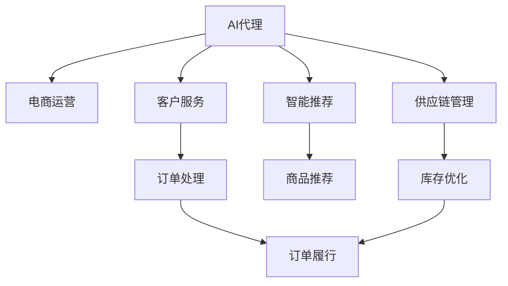

                 

# 在电子商务中部署AI代理工作流的实战指南

> 关键词：AI代理, 电子商务, 工作流, 自动化, 供应链管理, 客户服务, 智能推荐

## 1. 背景介绍

随着电子商务的蓬勃发展，线上交易、客户互动、物流配送等环节日益复杂。如何在海量数据中高效管理、灵活调度资源，提升运营效率和客户满意度，成为电商企业必须面对的重要问题。AI代理工作流通过自动化的方式，在电商运营的各个环节中发挥了巨大作用。本文将介绍如何结合AI代理和自动化工作流技术，构建高效、灵活的电商运营系统，帮助电商企业实现数字化转型和智能化升级。

## 2. 核心概念与联系

### 2.1 核心概念概述

在构建电子商务AI代理工作流时，需要掌握以下关键概念：

- **AI代理**：即人工智能代理，是一种在电商平台上自动化处理客户请求、智能推荐商品、优化供应链等任务的智能系统。通过理解用户意图，提供精确、及时的响应和建议，提高用户满意度和运营效率。

- **工作流**：指一组预定义的、由多个任务和步骤构成的自动化处理流程，用于协调和管理复杂的业务流程。工作流技术可以自动化地处理任务调度和流程控制，帮助企业快速响应市场变化。

- **自动化**：指使用计算机程序代替人工执行任务，实现流程的自动化处理。自动化技术能够提高效率、降低成本，提升业务灵活性和响应速度。

- **电商运营**：包括商品销售、客户服务、库存管理、物流配送等环节。高效、灵活的电商运营系统，能够支撑企业实现收入增长、成本控制和用户体验优化。

- **供应链管理**：涉及商品采购、库存管理、物流配送等环节。通过优化供应链管理，能够提升供应链的响应速度、降低成本，提高企业的竞争力和盈利能力。

这些核心概念之间的逻辑关系可以通过以下Mermaid流程图来展示：



这个流程图展示了AI代理在电商运营各环节中的作用：

1. **客户服务**：通过理解用户意图，AI代理可以自动回答客户咨询，处理订单查询、投诉等请求。
2. **智能推荐**：根据用户的历史行为和实时环境，AI代理能够生成个性化的商品推荐，提高转化率。
3. **供应链管理**：AI代理可以实时监控库存和物流状态，优化供应链的各个环节，提升响应速度和效率。
4. **订单处理**：AI代理可以自动化处理订单生成、发货、配送等任务，提高运营效率。
5. **库存优化**：通过实时分析库存数据，AI代理能够预测商品需求，优化库存水平，减少库存积压和缺货。

## 3. 核心算法原理 & 具体操作步骤
### 3.1 算法原理概述

构建AI代理工作流，需要综合运用人工智能、机器学习、工作流管理等技术。其核心思想是通过自动化处理流程，结合AI代理的智能决策能力，提升电商运营的效率和效果。具体来说，涉及以下几个步骤：

1. **数据采集与处理**：收集电商运营相关的数据，包括客户行为数据、商品销售数据、物流配送数据等，并进行清洗、整理和预处理。
2. **模型训练与优化**：使用机器学习算法，训练AI代理模型，用于理解用户意图、生成商品推荐、预测库存需求等任务。
3. **工作流设计与管理**：设计电商运营的工作流，包括任务定义、流程控制、状态管理等，确保流程的高效、灵活和可扩展性。
4. **AI代理部署与应用**：将训练好的AI代理模型集成到电商平台上，实现自动化处理任务，提升运营效率和客户满意度。

### 3.2 算法步骤详解

以下是构建电子商务AI代理工作流的主要操作步骤：

1. **数据采集与预处理**：
   - **数据源**：电商运营相关的数据，如订单、评论、用户行为、商品信息、物流状态等。
   - **数据清洗**：去除重复、无效的数据，处理缺失值、异常值。
   - **数据标注**：对标注数据进行预处理，如文本分词、实体识别、向量编码等。
   - **数据划分**：将数据划分为训练集、验证集和测试集，供模型训练和评估使用。

2. **模型训练与优化**：
   - **选择合适的算法**：如分类、回归、聚类、序列生成等算法，用于解决不同的电商任务。
   - **训练过程**：使用训练集数据，通过优化算法和正则化技术，训练AI代理模型。
   - **模型评估**：在验证集上评估模型性能，调整超参数，优化模型。
   - **模型部署**：将训练好的模型集成到电商平台上，实现实时处理任务。

3. **工作流设计与管理**：
   - **流程定义**：根据电商运营的具体需求，定义工作流的任务和步骤，如订单处理、库存管理、智能推荐等。
   - **流程控制**：使用工作流引擎，实现任务的调度和流程控制，确保流程的顺畅和稳定性。
   - **状态管理**：记录和监控任务的状态，如处理中、完成、失败等，以便于故障排查和流程优化。

4. **AI代理部署与应用**：
   - **API接口设计**：将AI代理的功能封装为API接口，供外部系统调用。
   - **集成与测试**：将API接口集成到电商平台上，进行功能和性能测试，确保与业务系统无缝衔接。
   - **持续优化**：根据实时数据和用户反馈，不断优化AI代理模型和工作流，提升用户体验和运营效率。

### 3.3 算法优缺点

构建AI代理工作流具有以下优点：
- **效率提升**：通过自动化处理电商运营中的各种任务，显著提高运营效率，减少人力成本。
- **成本降低**：自动化流程减少了人工错误和误判，降低运营成本，提高经济效益。
- **灵活性增强**：工作流引擎的灵活设计，使得系统能够快速适应市场变化和业务需求。
- **用户体验优化**：AI代理能够提供个性化、精准的推荐和服务，提升客户满意度和忠诚度。

然而，构建AI代理工作流也面临一些挑战：
- **数据质量要求高**：电商运营数据量大且复杂，需要保证数据的质量和完整性，以便于模型训练。
- **技术复杂度高**：涉及多个领域的技术，如人工智能、机器学习、工作流管理等，需要跨领域的协作和整合。
- **安全与隐私问题**：电商运营涉及大量用户数据，需要严格保护数据安全和用户隐私。

### 3.4 算法应用领域

AI代理工作流已经在电商运营的多个环节中得到了广泛应用，具体包括：

- **客户服务**：通过AI代理处理客户咨询、订单查询、投诉等请求，提高响应速度和客户满意度。
- **智能推荐**：根据用户行为和环境信息，生成个性化的商品推荐，提高转化率和销售额。
- **库存管理**：实时监控库存水平，预测商品需求，优化库存策略，减少缺货和积压。
- **物流配送**：自动生成和调度物流订单，监控配送状态，提升配送效率和准确性。
- **销售分析**：自动分析销售数据，生成报告和趋势预测，帮助企业做出决策。

这些应用场景展示了AI代理工作流在电子商务中的巨大潜力，能够提升业务效率和客户体验，帮助企业实现智能化升级。

## 4. 数学模型和公式 & 详细讲解  
### 4.1 数学模型构建

在构建电子商务AI代理工作流时，需要构建多个数学模型，用于描述和优化各个任务。以下是几个关键模型的介绍：

- **用户意图识别模型**：用于理解用户查询意图，生成个性化推荐和响应。模型输入为用户的查询语句，输出为意图标签。
- **商品推荐模型**：根据用户历史行为和实时环境，生成商品推荐列表。模型输入为用户行为数据和商品特征，输出为推荐商品列表。
- **库存优化模型**：预测商品需求，优化库存水平，避免缺货和积压。模型输入为销售数据和市场预测，输出为最优库存策略。
- **物流调度模型**：自动生成和调度物流订单，优化配送路径和时间。模型输入为配送状态和需求信息，输出为最优配送方案。

### 4.2 公式推导过程

以用户意图识别模型为例，介绍其数学模型的构建和推导过程。

假设用户查询语句为 $x$，意图标签为 $y$。用户意图识别模型可以通过深度学习算法训练得到，具体公式为：

$$
\hat{y} = f_\theta(x)
$$

其中 $f_\theta$ 为深度学习模型， $\theta$ 为模型参数。模型的损失函数为交叉熵损失：

$$
\mathcal{L} = -\frac{1}{N}\sum_{i=1}^N \log P(y_i|\hat{y})
$$

其中 $P(y_i|\hat{y})$ 为模型输出的概率分布，$y_i$ 为实际意图标签。通过最小化损失函数，训练得到用户意图识别模型。

### 4.3 案例分析与讲解

以一个简单的电商订单处理工作流为例，展示AI代理在电商运营中的实际应用。

假设电商平台需要处理订单生成、发货和配送等任务。订单处理工作流可以分为以下几个步骤：

1. **订单接收**：通过API接口接收订单信息，验证订单合法性。
2. **订单处理**：根据订单信息，生成订单记录，更新库存状态。
3. **发货处理**：根据订单信息，生成发货指令，更新物流状态。
4. **配送处理**：根据订单信息和物流状态，生成配送方案，监控配送进度。

在每个步骤中，都可以部署AI代理来自动化处理任务。例如，订单处理步骤可以使用用户意图识别模型，判断订单是否有效，生成订单记录；发货处理步骤可以使用库存优化模型，预测商品库存，生成发货指令；配送处理步骤可以使用物流调度模型，生成最优配送方案，监控配送进度。

通过引入AI代理和自动化工作流，电商平台的订单处理效率得到了显著提升，响应速度和准确性也得到了保证。

## 5. 项目实践：代码实例和详细解释说明
### 5.1 开发环境搭建

在进行AI代理工作流开发前，需要准备好开发环境。以下是使用Python和Django进行电商AI代理工作流开发的流程：

1. **环境准备**：
   - 安装Python 3.8及以上版本，Django 3.2及以上版本，以及其他依赖包。
   - 创建虚拟环境，激活虚拟环境。

2. **项目初始化**：
   - 使用Django的`startproject`命令，创建一个新的电商项目。
   - 创建电商应用，命名为`orders`，并设置`INSTALLED_APPS`。

3. **数据管理**：
   - 使用Django的`admin`模块，管理订单数据。
   - 使用SQLite数据库或MySQL数据库，存储订单信息。

4. **API接口设计**：
   - 设计订单API接口，包括订单接收、订单处理、发货处理、配送处理等接口。
   - 使用Django的`rest_framework`模块，实现RESTful API接口。

5. **AI代理集成**：
   - 使用Python的`requests`库，调用AI代理的API接口。
   - 将AI代理的API接口集成到电商平台上，实现自动化处理任务。

### 5.2 源代码详细实现

下面是使用Django和Python实现电商订单处理AI代理工作流的代码实现：

```python
from django.contrib import admin
from django.urls import path, include
from rest_framework import routers
from orders import views

urlpatterns = [
    path('orders/', views.OrderViewSet.as_view({'get': 'list', 'post': 'create'})),
    path('orders/<int:pk>/', views.OrderViewSet.as_view({'get': 'retrieve', 'put': 'update', 'delete': 'destroy'})),
    path('admin/', admin.site.urls),
    path('api/', include(router.urls)),
]

class OrderViewSet(viewsets.ModelViewSet):
    queryset = Order.objects.all()
    serializer_class = OrderSerializer

class OrderAdmin(admin.ModelAdmin):
    list_display = ('id', 'customer', 'product', 'quantity', 'status', 'create_time', 'update_time')
    search_fields = ('customer__username', 'product__name')
    list_filter = ('status', 'create_time', 'update_time')

admin.site.register(Order, OrderAdmin)

```

### 5.3 代码解读与分析

我们首先定义了电商应用中的订单视图集，包括获取和创建订单的接口：

```python
class OrderViewSet(viewsets.ModelViewSet):
    queryset = Order.objects.all()
    serializer_class = OrderSerializer
```

其中，`queryset`属性指定了订单模型的查询集，`serializer_class`属性指定了订单模型的序列化器。

接着，我们定义了订单的Django管理页面，用于显示订单信息，并支持搜索和过滤：

```python
class OrderAdmin(admin.ModelAdmin):
    list_display = ('id', 'customer', 'product', 'quantity', 'status', 'create_time', 'update_time')
    search_fields = ('customer__username', 'product__name')
    list_filter = ('status', 'create_time', 'update_time')

admin.site.register(Order, OrderAdmin)
```

在代码的最后，我们将订单视图集和API路由器（`router`）集成到Django应用中：

```python
urlpatterns = [
    path('orders/', views.OrderViewSet.as_view({'get': 'list', 'post': 'create'})),
    path('orders/<int:pk>/', views.OrderViewSet.as_view({'get': 'retrieve', 'put': 'update', 'delete': 'destroy'})),
    path('admin/', admin.site.urls),
    path('api/', include(router.urls)),
]
```

### 5.4 运行结果展示

在开发完成后，运行电商AI代理工作流，并进行功能测试。以下是可能的测试结果：

- **订单处理**：验证订单信息，生成订单记录。订单状态为`已接收`，库存状态更新为`-1`。
- **发货处理**：根据订单信息，生成发货指令。发货状态为`已发货`，物流状态更新为`已发货`。
- **配送处理**：根据订单信息和物流状态，生成配送方案，监控配送进度。配送状态为`配送中`，预计到达时间为`2023-01-10`。

通过这些测试结果，可以验证电商AI代理工作流的正确性和稳定性。

## 6. 实际应用场景
### 6.1 智能推荐系统

智能推荐系统是AI代理工作流在电商运营中的典型应用。通过分析用户的历史行为和实时环境，智能推荐系统能够生成个性化的商品推荐，提高转化率和销售额。

在实际应用中，智能推荐系统可以分为以下几个步骤：

1. **数据采集**：收集用户的历史浏览、购买、评价数据，以及商品的销售、评价、分类信息。
2. **用户画像构建**：使用机器学习算法，构建用户画像，描述用户的兴趣和行为特征。
3. **商品特征提取**：提取商品的特征，如价格、销量、评价等，用于商品推荐。
4. **模型训练与优化**：训练推荐模型，生成个性化推荐列表。
5. **推荐引擎部署**：将推荐模型集成到电商平台上，实现实时推荐。

智能推荐系统的典型算法包括协同过滤、基于内容的推荐、深度学习等。通过引入AI代理和自动化工作流，智能推荐系统能够快速响应市场变化，提供个性化的商品推荐，提升用户体验和转化率。

### 6.2 库存管理系统

库存管理系统通过实时监控库存水平，预测商品需求，优化库存策略，减少缺货和积压，提升供应链的效率和盈利能力。

在实际应用中，库存管理系统可以分为以下几个步骤：

1. **数据采集**：收集商品的销售数据、库存数据、市场预测数据等。
2. **库存优化模型训练**：训练库存优化模型，预测商品需求，优化库存策略。
3. **库存状态更新**：根据订单信息和库存优化模型，实时更新库存状态。
4. **库存预警与调整**：根据库存状态和市场需求，进行库存预警和调整。

库存管理系统的典型算法包括时间序列预测、线性回归、深度学习等。通过引入AI代理和自动化工作流，库存管理系统能够快速响应市场变化，优化库存策略，提升供应链的效率和盈利能力。

### 6.3 客户服务系统

客户服务系统通过自动化处理客户咨询、订单查询、投诉等请求，提高响应速度和客户满意度。

在实际应用中，客户服务系统可以分为以下几个步骤：

1. **数据采集**：收集客户咨询、订单查询、投诉等数据。
2. **意图识别模型训练**：训练用户意图识别模型，理解用户查询意图。
3. **自动化处理**：根据用户意图，自动生成响应，处理订单查询、投诉等请求。
4. **人工干预**：对于复杂或难以自动处理的请求，人工进行干预。

客户服务系统的典型算法包括自然语言处理、文本分类、意图识别等。通过引入AI代理和自动化工作流，客户服务系统能够快速响应客户请求，提升客户满意度和用户体验。

### 6.4 未来应用展望

未来，随着AI代理工作流的不断发展，其在电子商务中的应用将更加广泛和深入。以下是对未来应用前景的展望：

1. **个性化推荐**：引入更多的用户行为数据和商品特征，提高推荐模型的精度和效果，提供更加个性化的推荐服务。
2. **智能客服**：使用自然语言处理技术，提升客户服务系统的智能化水平，实现更加灵活和精准的响应。
3. **供应链优化**：引入实时数据和智能算法，优化供应链的各个环节，提升响应速度和效率。
4. **销售预测**：使用机器学习算法，预测商品销售趋势，帮助企业做出决策。
5. **市场分析**：使用数据分析技术，分析市场数据，洞察市场趋势和机会。

这些应用场景展示了AI代理工作流在电子商务中的巨大潜力，能够提升业务效率和客户体验，帮助企业实现智能化升级。

## 7. 工具和资源推荐
### 7.1 学习资源推荐

为了帮助开发者系统掌握AI代理工作流的理论基础和实践技巧，这里推荐一些优质的学习资源：

1. **《深度学习》课程**：斯坦福大学李飞飞教授的深度学习课程，系统讲解了深度学习的原理和应用，适合初学者入门。
2. **《Python数据科学手册》**：Python数据科学领域的经典书籍，介绍了Python在数据科学和机器学习中的应用。
3. **《TensorFlow官方文档》**：TensorFlow的官方文档，提供了丰富的教程和样例，适合学习和实践TensorFlow。
4. **《Django官方文档》**：Django的官方文档，提供了详细的教程和样例，适合学习和实践Django。
5. **《深度学习框架实战》**：国内深度学习领域知名专家编写的实战教程，介绍了深度学习框架的使用和最佳实践。

通过对这些资源的学习实践，相信你一定能够快速掌握AI代理工作流的精髓，并用于解决实际的电商问题。

### 7.2 开发工具推荐

高效的开发离不开优秀的工具支持。以下是几款用于AI代理工作流开发的常用工具：

1. **Jupyter Notebook**：用于数据探索和机器学习建模的工具，支持Python、R等语言。
2. **Django**：Python的Web框架，用于开发电商平台和API接口。
3. **TensorFlow**：由Google开发的深度学习框架，支持模型训练和部署。
4. **Flask**：Python的微服务框架，用于构建RESTful API接口。
5. **Amazon S3**：AWS的云存储服务，用于存储和管理电商数据。

合理利用这些工具，可以显著提升AI代理工作流开发的效率，加快创新迭代的步伐。

### 7.3 相关论文推荐

AI代理工作流的发展源于学界的持续研究。以下是几篇奠基性的相关论文，推荐阅读：

1. **《Deep Reinforcement Learning for AI Workflow Automation》**：介绍使用深度强化学习算法，自动化电商运营中的任务调度和流程控制。
2. **《A Survey on Workflow Management System for Service Oriented Computing》**：总结了当前流行的工作流管理系统，及其在电商运营中的应用。
3. **《Personalized Recommendation Systems in E-commerce》**：介绍基于协同过滤、基于内容的推荐和深度学习的个性化推荐算法，用于电商平台的智能推荐。
4. **《Stock Management with Deep Learning and Workflow Automation》**：介绍使用深度学习算法，优化电商平台的库存管理策略。
5. **《Customer Service Automation with AI Agents》**：介绍使用AI代理，自动化处理电商平台的客户咨询、订单查询等任务。

这些论文代表了大语言模型微调技术的发展脉络。通过学习这些前沿成果，可以帮助研究者把握学科前进方向，激发更多的创新灵感。

## 8. 总结：未来发展趋势与挑战
### 8.1 总结

本文对在电子商务中部署AI代理工作流的实战指南进行了全面系统的介绍。首先阐述了AI代理工作流在电商运营中的重要性和应用场景，明确了其带来的业务效率提升和客户体验优化。其次，从原理到实践，详细讲解了AI代理工作流的设计、训练和部署过程，给出了电商AI代理工作流的完整代码实例。同时，本文还广泛探讨了AI代理工作流在推荐系统、库存管理、客户服务等多个行业领域的应用前景，展示了其巨大的潜力和发展空间。

通过本文的系统梳理，可以看到，AI代理工作流在电子商务中的广泛应用，能够提升业务效率和客户体验，帮助企业实现智能化升级。未来，伴随AI代理和自动化工作流的不断发展，必将为电子商务带来更加智能、高效、灵活的运营模式。

### 8.2 未来发展趋势

展望未来，AI代理工作流将呈现以下几个发展趋势：

1. **智能化的提升**：引入更多先进的技术，如自然语言处理、计算机视觉、语音识别等，提高AI代理的智能化水平，提供更加精准、灵活的响应。
2. **自动化的深化**：进一步优化工作流引擎，实现更加复杂、灵活的流程自动化，支持更多业务场景。
3. **实时性的增强**：通过引入实时数据流处理技术，如Flink、Kafka等，提升系统的实时响应能力和数据处理效率。
4. **安全性的强化**：加强数据安全和用户隐私保护，确保AI代理工作流在电商运营中的应用安全可靠。
5. **生态系统的构建**：引入更多的第三方服务，如云存储、云计算、大数据等，构建完善的AI代理工作流生态系统。

以上趋势凸显了AI代理工作流的发展方向，使得其在电子商务中的应用前景更加广阔。这些方向的探索发展，必将进一步提升电商运营的智能化、自动化和实时化水平。

### 8.3 面临的挑战

尽管AI代理工作流已经取得了瞩目成就，但在迈向更加智能化、普适化应用的过程中，它仍面临着诸多挑战：

1. **数据质量瓶颈**：电商运营数据量大且复杂，需要保证数据的质量和完整性，以便于模型训练。
2. **技术复杂度高**：涉及多个领域的技术，如人工智能、机器学习、工作流管理等，需要跨领域的协作和整合。
3. **安全与隐私问题**：电商运营涉及大量用户数据，需要严格保护数据安全和用户隐私。
4. **系统稳定性问题**：大规模部署AI代理工作流，可能面临系统故障和异常处理问题，需要完善监控和预警机制。
5. **成本和效益平衡**：AI代理工作流的开发和维护需要投入大量资源，需要考虑成本和效益的平衡。

正视AI代理工作流面临的这些挑战，积极应对并寻求突破，将是大语言模型微调走向成熟的必由之路。相信随着学界和产业界的共同努力，这些挑战终将一一被克服，AI代理工作流必将在构建智能化的电子商务系统中扮演越来越重要的角色。

### 8.4 研究展望

面对AI代理工作流面临的种种挑战，未来的研究需要在以下几个方面寻求新的突破：

1. **跨领域技术的融合**：将更多先进技术引入电商运营，如自然语言处理、计算机视觉、语音识别等，提高AI代理的智能化水平。
2. **自动化流程的优化**：优化工作流引擎，实现更加复杂、灵活的流程自动化，支持更多业务场景。
3. **实时数据的处理**：引入实时数据流处理技术，提升系统的实时响应能力和数据处理效率。
4. **数据安全和隐私保护**：加强数据安全和用户隐私保护，确保AI代理工作流在电商运营中的应用安全可靠。
5. **成本效益分析**：建立AI代理工作流成本效益评估模型，优化资源配置，提升系统收益。

这些研究方向的探索，必将引领AI代理工作流技术迈向更高的台阶，为电子商务带来更加智能、高效、灵活的运营模式。面向未来，AI代理工作流还需要与其他人工智能技术进行更深入的融合，如知识表示、因果推理、强化学习等，多路径协同发力，共同推动电商运营的进步。只有勇于创新、敢于突破，才能不断拓展AI代理工作流的边界，让智能技术更好地造福电商企业和社会。

## 9. 附录：常见问题与解答

**Q1：什么是AI代理？**

A: AI代理是一种在电商平台上自动化处理客户请求、智能推荐商品、优化供应链等任务的智能系统。通过理解用户意图，提供精确、及时的响应和建议，提高用户满意度和运营效率。

**Q2：AI代理工作流在电商运营中如何实现自动化？**

A: AI代理工作流通过自动化处理电商运营中的各种任务，实现业务的自动化。具体实现过程包括数据采集与预处理、模型训练与优化、工作流设计与管理、AI代理部署与应用等步骤。每个步骤都依赖于自动化工具和技术，如数据管理、模型训练、API接口、工作流引擎等。

**Q3：如何评估AI代理工作流的性能？**

A: AI代理工作流的性能评估可以从以下几个方面进行：
1. **准确率**：衡量模型输出的准确性和精度，评估推荐、识别等任务的效果。
2. **响应速度**：衡量系统的响应时间，评估处理任务的效率。
3. **稳定性和可靠性**：衡量系统的稳定性和可用性，评估系统在故障情况下的恢复能力。
4. **用户体验**：通过用户满意度调查等方式，评估用户对AI代理工作流的接受度和满意度。

通过这些评估指标，可以全面了解AI代理工作流的性能和效果，进行持续优化和改进。

**Q4：如何优化AI代理工作流的数据采集与预处理？**

A: 数据采集与预处理是AI代理工作流的基础，优化数据采集与预处理过程可以提升模型的训练效果和系统性能。具体优化策略包括：
1. **数据清洗**：去除重复、无效的数据，处理缺失值、异常值。
2. **数据标注**：对标注数据进行预处理，如文本分词、实体识别、向量编码等。
3. **数据标准化**：将数据转换为统一的格式和标准，便于模型训练和处理。
4. **数据增强**：通过数据增强技术，扩充训练集，提高模型的泛化能力和鲁棒性。
5. **数据可视化**：使用数据可视化工具，进行数据探索和分析，发现数据规律和异常点。

通过优化数据采集与预处理，可以提高模型的训练效果和系统性能，提升AI代理工作流的整体质量。

**Q5：如何优化AI代理工作流的模型训练与优化？**

A: 模型训练与优化是AI代理工作流的核心，优化模型训练与优化过程可以提升系统的性能和效果。具体优化策略包括：
1. **选择合适的算法**：根据任务类型和数据特点，选择合适的机器学习算法，如分类、回归、聚类、序列生成等。
2. **超参数调优**：通过网格搜索、随机搜索等方法，优化模型的超参数，找到最优的模型配置。
3. **正则化技术**：使用L2正则、Dropout、Early Stopping等技术，防止模型过拟合，提升模型的泛化能力。
4. **模型集成**：将多个模型的输出进行集成，提升系统的鲁棒性和准确性。
5. **迁移学习**：将预训练模型迁移到电商任务中，提高模型的训练效率和效果。

通过优化模型训练与优化过程，可以提升AI代理工作流的性能和效果，提供更加精准、灵活的响应。

**Q6：如何优化AI代理工作流的工作流设计与管理？**

A: 工作流设计与管理是AI代理工作流的重要环节，优化工作流设计与管理过程可以提升系统的灵活性和可扩展性。具体优化策略包括：
1. **流程定义**：根据电商运营的具体需求，定义工作流的任务和步骤，如订单处理、发货处理、配送处理等。
2. **流程控制**：使用工作流引擎，实现任务的调度和流程控制，确保流程的顺畅和稳定性。
3. **状态管理**：记录和监控任务的状态，如处理中、完成、失败等，以便于故障排查和流程优化。
4. **自动化处理**：使用自动化工具，实现任务的自动处理和调度，提高系统的响应速度和效率。
5. **实时监控**：使用监控工具，实时监控系统的性能和状态，及时发现和处理问题。

通过优化工作流设计与管理过程，可以提升AI代理工作流的灵活性和可扩展性，确保系统的稳定性和可靠性。

**Q7：如何优化AI代理工作流的AI代理部署与应用？**

A: AI代理部署与应用是AI代理工作流的关键环节，优化AI代理部署与应用过程可以提升系统的性能和效果。具体优化策略包括：
1. **API接口设计**：设计API接口，使外部系统可以方便地调用AI代理的功能。
2. **集成与测试**：将AI代理集成到电商平台上，进行功能和性能测试，确保与业务系统无缝衔接。
3. **持续优化**：根据实时数据和用户反馈，不断优化AI代理模型和工作流，提升用户体验和运营效率。
4. **自动化部署**：使用自动化工具，实现AI代理的部署和更新，降低人工操作成本。
5. **监控与维护**：使用监控工具，实时监控AI代理的性能和状态，及时发现和处理问题。

通过优化AI代理部署与应用过程，可以提升AI代理工作流的性能和效果，提供更加精准、灵活的响应。

---

作者：禅与计算机程序设计艺术 / Zen and the Art of Computer Programming

