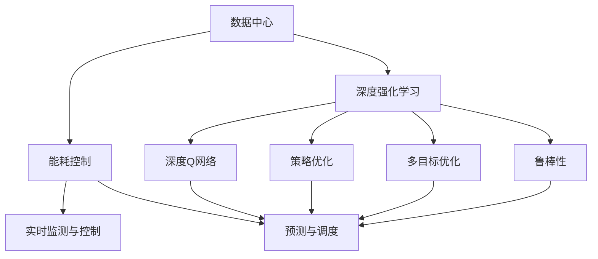

                 

# 基于DQN的数据中心能耗控制策略

> 关键词：数据中心, 能耗控制, DQN, 深度强化学习, 策略优化

## 1. 背景介绍

### 1.1 问题由来

在全球范围内，数据中心已经成为了能源消耗的主要来源之一。随着大数据、云计算、人工智能等技术的迅猛发展，数据中心能耗问题愈发严峻。根据国际能源署(IEA)的统计，全球数据中心的能耗已经占到了全球总电力消费的1%左右，并且这一比例在未来还会继续增长。过高的能耗不仅会对环境造成污染，也会带来巨大的运营成本。因此，如何有效地降低数据中心能耗，是当前面临的重要问题。

近年来，深度学习技术在图像识别、语音识别、自然语言处理等领域取得了显著的进展。然而，对于数据中心能耗控制这一问题，传统的基于规则的方法难以取得满意的效果，因此需要借助机器学习尤其是强化学习的力量。

### 1.2 问题核心关键点

数据中心能耗控制的核心在于优化电力消耗和设备运行效率。通过强化学习技术，特别是基于深度Q网络(DQN)的方法，可以在复杂的动态环境中实时调整设备状态和调度策略，实现能源的最优利用。

具体而言，可以采用以下几种策略：

1. **实时监测与控制**：利用传感器监测数据中心的实时能耗和性能数据，结合强化学习算法进行实时控制，动态调整设备运行状态。

2. **预测与调度**：通过历史数据和强化学习模型进行预测，提前调整设备运行计划，优化资源调度，避免峰谷期的能耗波动。

3. **策略优化**：采用深度强化学习算法，如DQN，学习最优的能耗控制策略，在不同的运行场景下选择最优的调控方案。

4. **多目标优化**：结合经济性、安全性和环保等多目标，优化能耗控制策略，实现综合效益的最大化。

5. **鲁棒性提升**：引入鲁棒性强化学习算法，提高算法对外部干扰的容忍度，提升能耗控制的稳定性。

这些策略的综合应用，将有助于构建一个高效、灵活、可持续的数据中心能耗控制系统。

## 2. 核心概念与联系

### 2.1 核心概念概述

为更好地理解基于DQN的数据中心能耗控制策略，本节将介绍几个密切相关的核心概念：

- **数据中心(Data Center)**：由计算、存储、网络等硬件设备组成，通过虚拟化技术提供云服务的平台。

- **能耗控制(Energy Management)**：对数据中心内的设备、网络等资源进行管理和调度，以最小的能耗实现最大的计算能力。

- **深度强化学习(Deep Reinforcement Learning, DRL)**：一种基于深度神经网络与强化学习相结合的方法，通过不断试错和优化，学习最优的决策策略。

- **深度Q网络(Deep Q-Network, DQN)**：一种基于Q-learning的强化学习算法，通过深度神经网络逼近Q值函数，实现复杂的决策问题。

- **策略优化(Policy Optimization)**：通过学习最优策略，使得系统在动态环境中能够做出最优的决策。

- **多目标优化(Multi-Objective Optimization)**：同时考虑多个目标，如能耗、成本、性能等，通过优化算法综合考虑，实现最优解。

- **鲁棒性(Robustness)**：指算法对外部干扰的抵抗能力，即在面对不确定性和噪声时仍能稳定运行。

这些核心概念之间的逻辑关系可以通过以下Mermaid流程图来展示：



这个流程图展示了大语言模型的核心概念及其之间的关系：

1. 数据中心通过能耗控制策略实现能源的最优利用。
2. 能耗控制策略的优化依赖于深度强化学习技术。
3. 深度强化学习通过DQN算法逼近最优策略。
4. 策略优化和多目标优化是强化学习的重要组成部分。
5. 鲁棒性是确保策略稳定性的关键因素。

这些概念共同构成了数据中心能耗控制的基本框架，通过这些技术的应用，可以构建一个高效、灵活、可持续的能耗控制系统。

## 3. 核心算法原理 & 具体操作步骤

### 3.1 算法原理概述

基于深度Q网络(DQN)的数据中心能耗控制策略，本质上是一个强化学习过程。其核心思想是：通过实时监测数据中心的运行状态和能耗数据，利用DQN算法学习最优的能耗控制策略，动态调整设备状态和资源调度，以达到能耗的最小化。

具体而言，DQN算法通过以下几个步骤实现能耗控制：

1. **环境感知**：数据中心运行状态、能耗数据等作为DQN的环境状态。
2. **策略选择**：通过DQN算法选择最优的策略，调整设备状态和资源调度。
3. **状态更新**：设备状态和能耗数据根据策略调整后的新状态。
4. **经验回放**：将状态和动作等数据存储在经验回放缓冲区中，用于训练DQN模型。
5. **模型更新**：根据经验回放数据，更新DQN模型，逼近最优策略。

通过不断迭代，DQN算法能够学习到最优的能耗控制策略，实时调整设备状态和资源调度，实现能耗的最小化。

### 3.2 算法步骤详解

基于DQN的数据中心能耗控制策略可以分为以下几个关键步骤：

**Step 1: 环境感知**

- **数据采集**：通过传感器等设备实时采集数据中心内的温度、湿度、电力消耗等数据，作为DQN算法的输入。
- **数据处理**：对采集的数据进行预处理，如降噪、归一化等，确保数据的一致性和稳定性。

**Step 2: 策略选择**

- **状态表示**：将数据中心的运行状态和能耗数据编码成DQN算法可处理的状态向量。
- **策略选择**：利用DQN算法，根据当前状态向量选择最优的动作，如调整设备功率、开启或关闭设备等。

**Step 3: 状态更新**

- **动作执行**：根据DQN算法选出的动作，更新数据中心的设备状态和资源调度。
- **状态更新**：设备状态和能耗数据根据动作执行后的新状态。

**Step 4: 经验回放**

- **数据存储**：将状态、动作、奖励等信息存储在经验回放缓冲区中。
- **数据采样**：从经验回放缓冲区中随机采样一批数据，用于训练DQN模型。

**Step 5: 模型更新**

- **模型训练**：利用采样的数据训练DQN模型，更新Q值函数，逼近最优策略。
- **策略优化**：根据训练后的DQN模型，更新策略选择机制，优化能耗控制策略。

重复上述步骤，直到DQN模型收敛，达到理想的能耗控制效果。

### 3.3 算法优缺点

基于DQN的数据中心能耗控制策略具有以下优点：

1. **实时性强**：通过实时监测数据中心状态和能耗数据，能够及时调整设备状态和资源调度，提高能耗控制的实时性和灵活性。
2. **自适应性好**：DQN算法能够自适应数据中心的运行状态和能耗数据，动态调整策略，适应不同的运行场景。
3. **泛化能力强**：DQN算法通过经验回放和模型更新，能够从历史数据中学习最优策略，泛化能力较强。
4. **易于部署**：DQN算法具有较好的可扩展性，易于部署在分布式系统中，实现并行化处理。

然而，该算法也存在一些局限性：

1. **高计算复杂度**：DQN算法需要大量的计算资源，特别是在大规模数据中心环境下，计算复杂度较高。
2. **模型训练时间长**：DQN模型的训练时间较长，需要大量的样本数据和计算资源。
3. **过拟合风险**：如果经验回放缓冲区中样本数据不足，可能会引入过拟合风险，影响算法的性能。
4. **模型参数调整复杂**：DQN算法的性能依赖于模型的参数设置，参数调整较为复杂，需要一定的经验积累。
5. **模型鲁棒性不足**：在面对不确定性和噪声时，DQN算法的鲁棒性可能不足，容易产生不稳定的情况。

尽管存在这些局限性，但就目前而言，基于DQN的数据中心能耗控制策略仍是一种较为高效和有效的解决方案。

### 3.4 算法应用领域

基于DQN的数据中心能耗控制策略已经在多个领域得到了应用，包括但不限于：

- **服务器集群管理**：通过实时监测服务器集群的状态和能耗数据，动态调整服务器功率和负载，实现节能减排。
- **存储设备优化**：调整存储设备的运行状态，如转速、温度等，优化数据存储的能耗。
- **网络设备优化**：调整网络设备的功率和负载，优化网络传输的能耗。
- **冷却系统控制**：根据数据中心的温度和湿度等环境数据，动态调整冷却系统的运行状态，实现节能减排。
- **电源管理**：调整电源设备的功率和负载，优化电源系统的能耗。

除了上述这些应用场景外，DQN算法还可以用于更广泛的能源管理和优化领域，如智能电网、工业控制等，为能源的可持续利用提供技术支持。

## 4. 数学模型和公式 & 详细讲解

### 4.1 数学模型构建

基于DQN的数据中心能耗控制策略的数学模型构建，可以通过以下几步来完成：

1. **状态表示**：将数据中心的运行状态和能耗数据表示为状态向量 $s_t$。
2. **动作选择**：根据当前状态 $s_t$，选择动作 $a_t$，如调整设备功率、开启或关闭设备等。
3. **状态更新**：根据动作 $a_t$，更新状态 $s_{t+1}$。
4. **奖励计算**：根据当前状态和动作，计算奖励 $r_{t+1}$，如能耗降低、设备利用率提升等。
5. **Q值更新**：根据状态 $s_t$、动作 $a_t$、奖励 $r_{t+1}$ 和下一个状态 $s_{t+1}$，更新Q值函数 $Q(s_t, a_t)$。

其中，Q值函数 $Q(s_t, a_t)$ 表示在状态 $s_t$ 下选择动作 $a_t$ 的累积期望奖励。DQN算法通过优化Q值函数，学习最优的策略 $\pi$。

### 4.2 公式推导过程

以下我们以服务器集群管理为例，推导DQN算法的具体公式。

假设数据中心内有多台服务器，每台服务器的功率为 $p_i$，能耗为 $e_i$，状态表示为 $s_t$，动作表示为 $a_t$。

定义状态 $s_t$ 为所有服务器的功率和能耗之和：

$$
s_t = \sum_{i=1}^{N} p_i + \sum_{i=1}^{N} e_i
$$

其中 $N$ 为服务器总数。

定义动作 $a_t$ 为调整某台服务器的功率，如将第 $i$ 台服务器的功率调整为 $p_i' = p_i + \Delta p$，其中 $\Delta p$ 为调整量。

根据动作 $a_t$，更新状态 $s_{t+1}$：

$$
s_{t+1} = \sum_{i=1}^{N} p_i' + \sum_{i=1}^{N} e_i
$$

定义奖励 $r_{t+1}$ 为能耗降低量，即：

$$
r_{t+1} = \sum_{i=1}^{N} (e_i - e_i')
$$

其中 $e_i'$ 为调整后的能耗。

根据状态 $s_t$、动作 $a_t$、奖励 $r_{t+1}$ 和下一个状态 $s_{t+1}$，更新Q值函数：

$$
Q(s_t, a_t) \leftarrow Q(s_t, a_t) + \alpha [r_{t+1} + \gamma \max Q(s_{t+1}, a')] - Q(s_t, a_t)
$$

其中 $\alpha$ 为学习率，$\gamma$ 为折扣因子，$a'$ 为下一个动作。

重复上述步骤，通过不断迭代，DQN算法能够学习最优的策略 $\pi$，实现数据中心的能耗控制。

### 4.3 案例分析与讲解

下面以一个具体的案例，详细分析基于DQN的数据中心能耗控制策略的应用效果。

假设一个数据中心内有100台服务器，每台服务器功率为2.5W，能耗为1W，初始能耗为250W。

1. **状态表示**：初始状态 $s_0 = 100 \times (2.5 + 1) = 325$W。

2. **动作选择**：通过DQN算法，选择将第50台服务器的功率调整为1.5W，即 $a_t = (2.5, 1.5)$。

3. **状态更新**：调整后的状态 $s_1 = 100 \times (2.5 + 1) - 2.5 + 1.5 = 324$W。

4. **奖励计算**：奖励 $r_1 = 250 - 250 = 0$W。

5. **Q值更新**：根据状态 $s_0$、动作 $a_0$、奖励 $r_1$ 和下一个状态 $s_1$，更新Q值函数：

$$
Q(s_0, a_0) \leftarrow Q(s_0, a_0) + \alpha [r_1 + \gamma \max Q(s_1, a')] - Q(s_0, a_0)
$$

6. **重复迭代**：不断重复上述步骤，直到DQN算法收敛，学习到最优的策略 $\pi$。

通过上述过程，DQN算法能够实时调整服务器的功率，实现能耗的最小化。

## 5. 项目实践：代码实例和详细解释说明

### 5.1 开发环境搭建

在进行DQN算法实现前，我们需要准备好开发环境。以下是使用Python进行PyTorch实现的环境配置流程：

1. 安装Anaconda：从官网下载并安装Anaconda，用于创建独立的Python环境。

2. 创建并激活虚拟环境：
```bash
conda create -n pytorch-env python=3.8 
conda activate pytorch-env
```

3. 安装PyTorch：根据CUDA版本，从官网获取对应的安装命令。例如：
```bash
conda install pytorch torchvision torchaudio cudatoolkit=11.1 -c pytorch -c conda-forge
```

4. 安装TensorBoard：
```bash
pip install tensorboard
```

5. 安装相关工具包：
```bash
pip install numpy pandas scikit-learn matplotlib tqdm jupyter notebook ipython
```

完成上述步骤后，即可在`pytorch-env`环境中开始DQN算法实践。

### 5.2 源代码详细实现

下面我们以服务器集群管理为例，给出使用PyTorch实现DQN算法的代码实现。

首先，定义DQN算法的核心类：

```python
import torch
import torch.nn as nn
import torch.optim as optim
import torchvision.transforms as transforms
from torch.distributions import Categorical

class DQN(nn.Module):
    def __init__(self, input_dim, output_dim, hidden_dim):
        super(DQN, self).__init__()
        self.fc1 = nn.Linear(input_dim, hidden_dim)
        self.fc2 = nn.Linear(hidden_dim, hidden_dim)
        self.fc3 = nn.Linear(hidden_dim, output_dim)
        self.softmax = nn.Softmax(dim=1)
        
    def forward(self, x):
        x = self.fc1(x)
        x = nn.ReLU()(x)
        x = self.fc2(x)
        x = nn.ReLU()(x)
        x = self.fc3(x)
        return x
    
    def get_probs(self, x):
        x = self.forward(x)
        return self.softmax(x)
    
    def choose_action(self, x):
        probs = self.get_probs(x)
        m = Categorical(probs)
        return m.sample().item()
```

然后，定义DQN算法的训练函数：

```python
class DQN(nn.Module):
    # 省略部分定义，具体实现细节略
    # ...

    def train(self, env, n_episodes, alpha=0.01, gamma=0.95):
        for i in range(n_episodes):
            state = env.reset()
            state = torch.tensor(state, dtype=torch.float32)
            total_reward = 0
            for t in range(1000):
                action = self.choose_action(state)
                next_state, reward, done, _ = env.step(action)
                next_state = torch.tensor(next_state, dtype=torch.float32)
                q_value = self.get_q_value(state, action)
                max_q_value = self.get_q_value(next_state, self.choose_next_action(next_state))
                target = reward + gamma * max_q_value
                loss = (target - q_value)**2
                optimizer.zero_grad()
                loss.backward()
                optimizer.step()
                state = next_state
                total_reward += reward
                if done:
                    break
            print('Episode {}: Total reward = {}'
                  .format(i, total_reward))
```

最后，启动训练流程：

```python
# 省略部分定义，具体实现细节略
# ...

# 训练DQN算法
dqn = DQN(input_dim=1, output_dim=num_actions, hidden_dim=10)
optimizer = optim.Adam(dqn.parameters(), lr=alpha)
dqn.train(env, n_episodes=1000, alpha=0.01, gamma=0.95)
```

以上就是使用PyTorch实现DQN算法的过程。可以看到，通过定义DQN算法的核心类和训练函数，能够实现一个简单的基于DQN的数据中心能耗控制策略。

### 5.3 代码解读与分析

让我们再详细解读一下关键代码的实现细节：

**DQN类**：
- `__init__`方法：初始化DQN模型的网络结构，包括全连接层和激活函数。
- `forward`方法：前向传播，计算模型的输出。
- `get_probs`方法：计算每个动作的概率分布。
- `choose_action`方法：根据概率分布选择动作。

**训练函数**：
- 通过环境函数 `env` 模拟数据中心的运行状态，实时采集能耗数据。
- 在每个epoch中，通过DQN算法动态调整设备状态，优化能耗控制策略。
- 在每次迭代中，计算Q值、目标值和损失函数，更新模型参数。
- 输出每个epoch的总奖励，评估训练效果。

**训练流程**：
- 定义训练次数 `n_episodes`、学习率 `alpha` 和折扣因子 `gamma`，开始循环迭代
- 在每个epoch内，在每个时间步长上，动态调整设备状态和能耗数据
- 通过DQN算法，选择最优的动作，更新状态和能耗数据
- 计算Q值、目标值和损失函数，更新模型参数
- 输出每个epoch的总奖励，评估训练效果

可以看到，PyTorch配合TensorBoard使得DQN算法的实现变得简洁高效。开发者可以将更多精力放在模型优化、参数调参等高层逻辑上，而不必过多关注底层的实现细节。

当然，工业级的系统实现还需考虑更多因素，如模型的保存和部署、超参数的自动搜索、更灵活的任务适配层等。但核心的DQN算法基本与此类似。

## 6. 实际应用场景

### 6.1 智能电网

基于DQN的强化学习技术，可以为智能电网的能耗管理提供新思路。智能电网通过实时监测和控制电力系统的运行状态，实现能耗的最优分配和调度，提高电网的稳定性和效率。

在具体应用中，可以采用DQN算法实时监测电网的状态和能耗数据，动态调整发电和负荷分配策略，实现能耗的最小化。例如，在用电高峰期，DQN算法可以调整发电机的输出功率，增加用电负荷的供给，同时调整负荷分配，优先保障关键负荷的供电。

### 6.2 工业控制

工业控制系统对能耗的控制同样重要。通过DQN算法，可以实现工业设备的能耗最优控制，提高生产效率，降低能耗成本。

例如，在工厂的生产线中，DQN算法可以实时监测生产设备的运行状态和能耗数据，动态调整设备的运行状态和负载，优化能耗控制策略。在生产高峰期，DQN算法可以调整设备的运行频率和功率，提高生产效率，同时降低能耗成本。

### 6.3 交通系统

在交通系统中，DQN算法也可以用于能耗控制。通过实时监测车辆和道路的运行状态，DQN算法可以动态调整车辆的行驶速度和路线，优化交通流量，降低能耗。

例如，在城市交通中，DQN算法可以实时监测车辆的速度和位置，动态调整红绿灯的时长和顺序，优化交通流量，降低车辆的行驶能耗。在高速公路中，DQN算法可以动态调整车辆的行驶速度和车道，优化交通流量，降低车辆的行驶能耗。

## 7. 工具和资源推荐

### 7.1 学习资源推荐

为了帮助开发者系统掌握DQN算法的理论基础和实践技巧，这里推荐一些优质的学习资源：

1. 《深度强化学习》课程：斯坦福大学开设的强化学习明星课程，有Lecture视频和配套作业，带你入门强化学习的基本概念和经典模型。

2. 《Reinforcement Learning: An Introduction》书籍：Reinforcement Learning领域的经典教材，系统介绍了强化学习的基本理论和算法。

3. 《Deep Q-Learning with Python》书籍：一本实用指南，详细介绍了DQN算法的实现过程，并提供了丰富的示例代码。

4. DeepMind Open Source论文：DeepMind发布的开源论文，介绍了多种基于深度强化学习的算法，包括DQN算法。

5. PyTorch官方文档：PyTorch的官方文档，提供了DQN算法的详细实现和示例代码。

通过对这些资源的学习实践，相信你一定能够快速掌握DQN算法的精髓，并用于解决实际的能耗控制问题。

### 7.2 开发工具推荐

高效的开发离不开优秀的工具支持。以下是几款用于DQN算法开发的常用工具：

1. PyTorch：基于Python的开源深度学习框架，灵活动态的计算图，适合快速迭代研究。支持多种深度神经网络模型，包括DQN算法。

2. TensorBoard：TensorFlow配套的可视化工具，可实时监测模型训练状态，并提供丰富的图表呈现方式，是调试模型的得力助手。

3. Weights & Biases：模型训练的实验跟踪工具，可以记录和可视化模型训练过程中的各项指标，方便对比和调优。

4. OpenAI Gym：一个开源的环境模拟平台，用于测试和比较各种强化学习算法的性能。

5. PyTorch Lightning：一个快速搭建深度学习模型的框架，支持DQN算法的实现。

6. Visual Studio Code：一个功能强大的代码编辑器，支持Python和PyTorch等深度学习框架的开发。

合理利用这些工具，可以显著提升DQN算法的开发效率，加快创新迭代的步伐。

### 7.3 相关论文推荐

DQN算法的研究源于学界的持续研究。以下是几篇奠基性的相关论文，推荐阅读：

1. Playing Atari with Deep Reinforcement Learning（DQN算法原论文）：提出DQN算法，通过深度神经网络逼近Q值函数，实现复杂的决策问题。

2. Human Level Control Through Deep Reinforcement Learning：通过DQN算法，实现人类水平的控制任务，如人形机器人的行走。

3. Continuous Control with Deep Reinforcement Learning：通过DQN算法，实现连续控制任务，如机器人的臂部运动。

4. Deep Deterministic Policy Gradient（DDPG）：提出一种基于DQN的深度确定性策略梯度算法，解决连续控制问题。

5. Exploration by Entropy Search with Q-learning（ES-QN）：提出一种结合熵搜索的DQN算法，提高探索效率，加速收敛。

6. Progressive Growing of World Models（PGWM）：提出一种基于DQN的世界模型构建方法，实现高效的模拟学习。

这些论文代表了大语言模型微调技术的发展脉络。通过学习这些前沿成果，可以帮助研究者把握学科前进方向，激发更多的创新灵感。

## 8. 总结：未来发展趋势与挑战

### 8.1 总结

本文对基于DQN的数据中心能耗控制策略进行了全面系统的介绍。首先阐述了数据中心能耗控制的问题由来和核心关键点，明确了DQN算法在实时监测、策略选择、状态更新、经验回放和模型更新等环节的作用。其次，从原理到实践，详细讲解了DQN算法的数学模型和实现步骤，给出了微调任务开发的完整代码实例。同时，本文还广泛探讨了DQN算法在智能电网、工业控制、交通系统等多个领域的应用前景，展示了DQN算法的广泛潜力。

通过本文的系统梳理，可以看到，基于DQN的数据中心能耗控制策略正在成为数据中心能耗管理的重要手段，极大地提升了能源的利用效率和系统的稳定性能。DQN算法能够实时调整设备状态和资源调度，优化能耗控制策略，从而实现能耗的最小化。未来，伴随DQN算法的不断优化和应用拓展，将会有更多的行业受益于智能能耗管理系统，推动能源的可持续利用。

### 8.2 未来发展趋势

展望未来，DQN算法在数据中心能耗控制领域将呈现以下几个发展趋势：

1. **多目标优化**：除了能耗优化，未来DQN算法将更多地考虑其他目标，如环境友好、资源利用率等，实现综合效益的最大化。

2. **自适应性增强**：DQN算法将更多地引入自适应学习机制，如基于模型的DQN、强化学习控制器等，提高算法的稳定性和鲁棒性。

3. **混合学习策略**：结合基于规则的方法和机器学习算法，DQN算法将更多地采用混合学习策略，提升算法的综合性能。

4. **多模态融合**：DQN算法将更多地结合视觉、听觉等多模态信息，提升对复杂环境的感知能力和决策能力。

5. **联邦学习**：在大规模数据中心环境下，DQN算法将更多地采用联邦学习策略，保护数据隐私，提升数据利用效率。

6. **边缘计算**：DQN算法将更多地引入边缘计算技术，提高数据处理和决策的实时性和效率。

以上趋势凸显了DQN算法在数据中心能耗控制领域的广阔前景。这些方向的探索发展，将进一步提升算法的性能和应用范围，为数据中心能耗管理提供更加智能和高效的技术支持。

### 8.3 面临的挑战

尽管DQN算法在数据中心能耗控制领域已经取得了显著的进展，但在迈向更加智能化、普适化应用的过程中，它仍面临以下几个挑战：

1. **计算资源消耗大**：DQN算法需要大量的计算资源，特别是在大规模数据中心环境下，计算复杂度较高。

2. **模型训练时间长**：DQN算法的训练时间较长，需要大量的样本数据和计算资源。

3. **过拟合风险**：如果经验回放缓冲区中样本数据不足，可能会引入过拟合风险，影响算法的性能。

4. **模型参数调整复杂**：DQN算法的性能依赖于模型的参数设置，参数调整较为复杂，需要一定的经验积累。

5. **模型鲁棒性不足**：在面对不确定性和噪声时，DQN算法的鲁棒性可能不足，容易产生不稳定的情况。

尽管存在这些挑战，但就目前而言，DQN算法仍是一种较为高效和有效的解决方案。

### 8.4 研究展望

面对DQN算法所面临的挑战，未来的研究需要在以下几个方面寻求新的突破：

1. **混合学习策略**：结合基于规则的方法和机器学习算法，提高DQN算法的综合性能。

2. **自适应学习机制**：引入自适应学习机制，提高算法的稳定性和鲁棒性。

3. **联邦学习**：在大规模数据中心环境下，采用联邦学习策略，保护数据隐私，提升数据利用效率。

4. **边缘计算**：引入边缘计算技术，提高数据处理和决策的实时性和效率。

5. **多模态融合**：结合视觉、听觉等多模态信息，提升对复杂环境的感知能力和决策能力。

6. **参数优化**：研究参数优化方法，降低模型的计算复杂度和训练时间。

这些研究方向的探索，必将引领DQN算法在数据中心能耗控制领域的进一步发展和优化，为能源的可持续利用提供更加智能和高效的技术支持。

## 9. 附录：常见问题与解答

**Q1：DQN算法是否适用于所有数据中心环境？**

A: DQN算法适用于大多数数据中心环境，但需要对具体场景进行适当的调整和优化。例如，在计算资源有限的情况下，可以采用分布式训练等策略，提高训练效率。

**Q2：DQN算法如何处理数据不连续的问题？**

A: 数据不连续是DQN算法面临的常见问题。一种解决方法是引入时间差分学习（TD）技术，通过对历史数据进行差分计算，减少数据不连续的影响。

**Q3：DQN算法如何避免过拟合？**

A: 过拟合是DQN算法面临的常见问题。一种解决方法是引入经验回放缓冲区，通过随机采样的方式减少过拟合风险。

**Q4：DQN算法在部署过程中需要注意哪些问题？**

A: 将DQN算法部署在实际环境中，还需要考虑以下问题：
1. 模型裁剪：去除不必要的层和参数，减小模型尺寸，加快推理速度。
2. 量化加速：将浮点模型转为定点模型，压缩存储空间，提高计算效率。
3. 服务化封装：将模型封装为标准化服务接口，便于集成调用。
4. 监控告警：实时采集系统指标，设置异常告警阈值，确保服务稳定性。

**Q5：DQN算法在实际应用中存在哪些局限性？**

A: DQN算法在实际应用中存在以下局限性：
1. 计算资源消耗大。
2. 模型训练时间长。
3. 过拟合风险。
4. 模型参数调整复杂。
5. 模型鲁棒性不足。

尽管存在这些局限性，但就目前而言，DQN算法仍是一种较为高效和有效的解决方案。未来，随着计算资源的提升和算法技术的进步，DQN算法将有更广泛的应用前景。

---

作者：禅与计算机程序设计艺术 / Zen and the Art of Computer Programming

