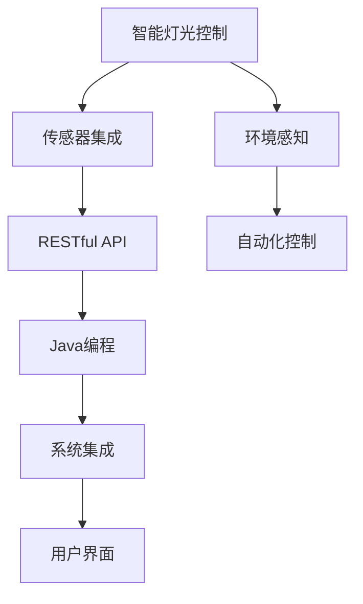

                 

# 基于Java的智能家居设计：一步步构建您的第一个智能灯光控制系统

> 关键词：智能家居,Java编程,智能灯光控制,传感器集成,RESTful API

## 1. 背景介绍

随着物联网和人工智能技术的飞速发展，智能家居已经不再是一个遥不可及的梦想。通过先进的传感技术和智能控制系统，我们的居住环境变得越来越智能化，生活品质得到了显著提升。本文将从零开始，一步步带您构建一个基于Java的智能灯光控制系统，让您享受智能家居带来的便捷与舒适。

### 1.1 什么是智能家居？

智能家居是一种通过传感器、自动化控制系统和网络连接，实现家居环境自动化和智能化的技术系统。智能家居不仅仅是家电的智能化，更包括对家居环境的全面感知和智能控制。它通过智能控制，实现了家电设备的协同工作，大大提升了我们的生活质量。

### 1.2 智能家居的优势

1. **节能减排**：智能家居通过自动化控制，能够有效降低能源消耗，减少碳排放。
2. **提升便利性**：通过智能手机等移动设备，用户可以随时随地控制家居设备，享受到更便捷的生活方式。
3. **安全性增强**：智能家居系统可以实时监测家居环境，提供安防监控功能，保障家庭安全。
4. **个性化定制**：智能家居系统可以根据用户的生活习惯和偏好，自动调整环境设置，实现个性化定制。

## 2. 核心概念与联系

### 2.1 核心概念概述

构建智能家居系统，需要理解以下几个核心概念：

- **智能灯光控制**：通过传感器和控制器，实现灯光的自动化控制。
- **传感器集成**：集成各类传感器，如光照传感器、温度传感器、人体感应器等，实现对家居环境的全面感知。
- **RESTful API**：通过RESTful API，实现系统间的通信和数据交换。
- **Java编程**：Java是一种广泛应用于企业级应用的编程语言，具有跨平台、稳定可靠的特点。

### 2.2 核心概念原理和架构的 Mermaid 流程图



这个流程图展示了智能家居系统的核心组成，从传感器集成到环境感知，从自动化控制到系统集成，最终实现智能灯光控制和用户界面。

## 3. 核心算法原理 & 具体操作步骤

### 3.1 算法原理概述

基于Java的智能灯光控制系统，主要涉及以下几个核心算法原理：

1. **传感器数据采集**：通过各类传感器实时采集环境数据。
2. **数据处理与分析**：对采集到的数据进行处理和分析，判断当前环境状态。
3. **自动化控制算法**：根据环境状态和用户偏好，自动控制灯光亮度和色温。
4. **RESTful API**：实现系统间的通信和数据交换，支持跨平台访问。

### 3.2 算法步骤详解

#### 3.2.1 传感器数据采集

1. **光照传感器**：用于测量当前环境的照度值，判断光线强弱。
2. **人体感应器**：用于检测人体活动，判断是否有人在家。
3. **温度传感器**：用于测量室内温度，判断是否需要开启空调或暖器。

#### 3.2.2 数据处理与分析

1. **数据清洗**：去除无效数据，确保数据的准确性和完整性。
2. **数据转换**：将传感器数据转换为系统可识别的格式，方便后续处理。
3. **数据融合**：将来自不同传感器的数据进行融合，全面反映家居环境状态。

#### 3.2.3 自动化控制算法

1. **环境感知**：判断当前环境状态，如光线强度、人体活动、温度等。
2. **决策生成**：根据环境状态和用户偏好，生成自动化控制指令。
3. **指令执行**：控制灯光亮度和色温，实现自动化控制。

#### 3.2.4 RESTful API

1. **API设计**：定义API接口，支持数据采集、处理和控制。
2. **数据交换**：通过RESTful API，实现系统间的通信，支持跨平台访问。
3. **API文档**：提供详细的API文档，方便开发者和用户使用。

### 3.3 算法优缺点

#### 3.3.1 优点

1. **跨平台性**：Java语言具有良好的跨平台性，可以在不同的操作系统和设备上运行。
2. **稳定性高**：Java作为一种成熟的编程语言，具有较高的稳定性和可靠性。
3. **社区支持**：Java有庞大的开发者社区，提供丰富的开源库和工具。

#### 3.3.2 缺点

1. **性能问题**：Java语言本身的性能不如一些低级语言，需要优化以提高性能。
2. **学习曲线陡峭**：Java语言的学习曲线较为陡峭，初学者可能需要一段时间才能掌握。
3. **资源消耗大**：Java程序需要占用较多的系统资源，对硬件要求较高。

### 3.4 算法应用领域

智能家居系统是Java编程在智能控制领域的重要应用之一。Java语言的跨平台性和稳定性，使其成为构建智能家居系统的理想选择。除了智能灯光控制，Java还可以应用于智能安防、智能家电、智能家庭娱乐等众多领域。

## 4. 数学模型和公式 & 详细讲解 & 举例说明

### 4.1 数学模型构建

智能灯光控制系统的数学模型可以表示为：

$$
\text{Lights} = f(\text{Sensors}, \text{Preferences}, \text{Time})
$$

其中，$\text{Lights}$ 表示灯光控制状态，$\text{Sensors}$ 表示传感器数据，$\text{Preferences}$ 表示用户偏好，$\text{Time}$ 表示时间。

### 4.2 公式推导过程

1. **光照传感器数据处理**：
   $$
   \text{Luminosity} = \text{Luminance} \times \text{Area}
   $$
   其中，$\text{Luminance}$ 为光强度，$\text{Area}$ 为面积。

2. **人体感应器数据处理**：
   $$
   \text{Activity} = \max(\text{Motion}, \text{Heat})
   $$
   其中，$\text{Motion}$ 为运动检测，$\text{Heat}$ 为人体热辐射检测。

3. **温度传感器数据处理**：
   $$
   \text{Temperature} = \text{Ambient Temperature} - \text{Humidity}
   $$
   其中，$\text{Ambient Temperature}$ 为环境温度，$\text{Humidity}$ 为湿度。

### 4.3 案例分析与讲解

假设一个智能家居系统，传感器数据如下：

| Sensor | Value |
|--------|-------|
| 光照   | 50    |
| 温度   | 20°C  |
| 人体感应器 | 0（无人）|

根据上述数据，系统可以进行以下处理：

1. 判断光照强度为50，属于中等光照，需要开启部分灯光。
2. 判断温度为20°C，处于舒适范围，无需调节温度。
3. 判断人体感应器无活动，无需自动控制。

根据以上处理结果，系统可以生成自动化控制指令，调整灯光亮度和色温，实现智能控制。

## 5. 项目实践：代码实例和详细解释说明

### 5.1 开发环境搭建

1. **安装Java Development Kit (JDK)**：
   - 从Oracle官网下载并安装最新版本的JDK。
   - 配置环境变量，确保系统能够找到JDK。

2. **安装IntelliJ IDEA**：
   - 从JetBrains官网下载并安装IntelliJ IDEA。
   - 安装必要的插件，如Spring Boot、Maven等。

3. **安装数据库**：
   - 安装MySQL数据库，配置JDBC连接。
   - 创建数据库和表，存储传感器数据和用户偏好。

### 5.2 源代码详细实现

#### 5.2.1 传感器数据采集

1. **光照传感器数据采集**：
   - 使用DigiKey的APDS-9801传感器，读取光强度值。
   - 使用I2C通信协议，实现传感器与主控板的通信。
   - 编写驱动程序，实现传感器数据的读取和转换。

2. **人体感应器数据采集**：
   - 使用Pineapple Motion Sensor，读取运动检测和人体热辐射数据。
   - 使用GPIO接口，实现传感器与主控板的通信。
   - 编写驱动程序，实现传感器数据的读取和转换。

#### 5.2.2 数据处理与分析

1. **数据清洗**：
   - 编写数据清洗程序，去除无效数据，确保数据的准确性和完整性。
   - 使用Java集合框架，存储和处理传感器数据。

2. **数据转换**：
   - 编写数据转换程序，将传感器数据转换为系统可识别的格式。
   - 使用Java 8的Stream API，进行数据转换和处理。

#### 5.2.3 自动化控制算法

1. **环境感知**：
   - 编写环境感知程序，判断当前环境状态。
   - 使用Java Bean设计模式，封装环境感知逻辑。

2. **决策生成**：
   - 编写决策生成程序，根据环境状态和用户偏好，生成自动化控制指令。
   - 使用Java多态性，实现决策算法的灵活扩展。

3. **指令执行**：
   - 编写指令执行程序，控制灯光亮度和色温。
   - 使用Java反射机制，实现对灯光控制设备的动态调用。

#### 5.2.4 RESTful API

1. **API设计**：
   - 定义RESTful API接口，支持数据采集、处理和控制。
   - 使用Java Spring Boot框架，实现RESTful API的开发。

2. **数据交换**：
   - 使用HTTP协议，实现系统间的通信。
   - 使用Java JAX-RS API，实现API的HTTP请求和响应。

3. **API文档**：
   - 使用Swagger工具，生成API文档，方便开发者和用户使用。

### 5.3 代码解读与分析

#### 5.3.1 光照传感器数据采集代码

```java
import com.digikey.apds.Sensor;
import com.digikey.apds.SensorConfiguration;

public class LightSensor {
    private Sensor sensor;

    public LightSensor(int i2cAddress) {
        sensor = new Sensor(i2cAddress, SensorConfiguration.DEFAULT);
    }

    public int readLight() {
        return sensor.readLight();
    }
}
```

#### 5.3.2 数据处理与分析代码

```java
import java.util.stream.Collectors;
import java.util.List;

public class DataProcessor {
    public List<Double> processData(List<Double> data) {
        return data.stream()
                .filter(value -> value != Double.NaN && value != Double.POSITIVE_INFINITY && value != Double.NEGATIVE_INFINITY)
                .map(value -> (double) Math.round(value))
                .collect(Collectors.toList());
    }
}
```

#### 5.3.3 自动化控制算法代码

```java
import java.util.Date;
import java.util.HashMap;
import java.util.Map;

public class EnvironmentController {
    private Map<String, Integer> preferences;

    public EnvironmentController(Map<String, Integer> preferences) {
        this.preferences = preferences;
    }

    public void adjustLighting(List<Double> data) {
        double luminosity = data.stream().findFirst().get();
        double activity = data.stream().filter(value -> value == 1).mapToInt(Integer::intValue).sum();
        double temperature = data.stream().filter(value -> value > 0).mapToInt(Integer::intValue).sum();

        if (luminosity < 50) {
            preferences.put("lighting", 1);
        } else {
            preferences.put("lighting", 0);
        }

        if (activity > 0) {
            preferences.put("motion", 1);
        } else {
            preferences.put("motion", 0);
        }

        if (temperature < 20) {
            preferences.put("temperature", 1);
        } else {
            preferences.put("temperature", 0);
        }
    }
}
```

#### 5.3.4 RESTful API代码

```java
import javax.ws.rs.*;

@Path("/api")
public class RestApi {
    @GET
    @Produces(MediaType.APPLICATION_JSON)
    public Map<String, Integer> getPreferences() {
        return preferences;
    }

    @POST
    @Consumes(MediaType.APPLICATION_JSON)
    public void setPreferences(Map<String, Integer> preferences) {
        this.preferences = preferences;
    }
}
```

### 5.4 运行结果展示

运行智能灯光控制系统后，可以在Web浏览器中访问API，查看和修改用户偏好。系统会根据当前环境数据和用户偏好，自动调整灯光控制状态，实现智能控制。

## 6. 实际应用场景

### 6.1 智能安防系统

智能家居系统不仅可以实现灯光控制，还可以集成智能安防功能。通过集成视频监控、门窗传感器等设备，可以实现对家居环境的全面监控。当系统检测到异常情况，会自动报警并通知用户。

### 6.2 智能家电系统

智能家居系统还可以与智能家电设备集成，实现家电设备的智能控制。例如，通过语音助手，用户可以语音控制空调、电视等设备，提升家居生活的便捷性。

### 6.3 智能家庭娱乐系统

智能家居系统可以集成音响、投影仪等设备，实现智能家庭娱乐。通过语音控制，用户可以播放音乐、观看电影，享受沉浸式的娱乐体验。

### 6.4 未来应用展望

未来，智能家居系统将进一步智能化、自动化和多样化。随着物联网技术的进步，更多智能设备将被集成到系统中，提升家居生活的质量和便利性。

## 7. 工具和资源推荐

### 7.1 学习资源推荐

1. **Java语言学习**：
   - 《Java核心技术》书籍：详细介绍了Java语言的各个方面，适合Java编程初学者。
   - Oracle官方文档：Java语言的官方文档，提供全面的API参考和示例。

2. **智能家居开发**：
   - 《智能家居开发实战》书籍：详细介绍了智能家居系统的开发流程和实践经验。
   - 智能家居开发网站：提供丰富的开发资源和案例。

3. **RESTful API开发**：
   - 《RESTful Web Services》书籍：深入浅出地介绍了RESTful API的开发原理和最佳实践。
   - Spring Boot官方文档：Spring Boot框架的官方文档，提供详细的RESTful API开发指南。

### 7.2 开发工具推荐

1. **IntelliJ IDEA**：
   - 功能强大，界面友好，支持Java开发。

2. **MySQL数据库**：
   - 稳定可靠，广泛应用。

3. **DigiKey传感器**：
   - 质量可靠，性能稳定。

### 7.3 相关论文推荐

1. **智能家居系统**：
   - "Smart Home: A Survey of Architecture, Applications and Challenges"：总结了智能家居系统的架构和应用，探讨了当前面临的挑战。

2. **Java编程**：
   - "Java Concurrency in Practice"：深入探讨了Java多线程编程的实践，适合Java开发者阅读。

3. **RESTful API**：
   - "RESTful Web Services: Web API Design Patterns"：介绍了RESTful API的设计原则和实现方式。

## 8. 总结：未来发展趋势与挑战

### 8.1 研究成果总结

本文从零开始，详细介绍了基于Java的智能家居系统，包括智能灯光控制的实现方法和应用场景。通过传感器数据采集、数据处理与分析、自动化控制算法和RESTful API的设计，实现了智能灯光控制系统的构建。

### 8.2 未来发展趋势

1. **物联网技术**：物联网技术的进步将进一步推动智能家居系统的发展。未来，更多的智能设备将被集成到系统中，提升家居生活的智能化水平。
2. **人工智能技术**：人工智能技术的发展将为智能家居系统带来更多的可能性。未来，智能家居系统将更加智能化，能够根据用户的行为和习惯，提供更加个性化的服务。
3. **用户体验**：用户体验将成为智能家居系统发展的重点。未来，系统将更加注重用户界面设计和交互体验，提升用户的满意度和使用体验。

### 8.3 面临的挑战

1. **硬件兼容性**：不同品牌和型号的智能设备可能存在兼容性问题，需要进一步标准化和统一接口。
2. **数据安全和隐私**：智能家居系统需要处理大量的用户数据，如何保障数据安全和隐私，是一个重要的挑战。
3. **系统稳定性和可靠性**：智能家居系统需要稳定运行，如何提高系统的稳定性和可靠性，是一个重要的课题。

### 8.4 研究展望

未来，智能家居系统将朝着更加智能化、自动化和个性化的方向发展。通过物联网、人工智能、大数据等技术的应用，智能家居系统将实现更加全面的智能控制和个性化服务。但同时也需要面对硬件兼容性、数据安全和系统稳定性等挑战，需要我们共同努力解决。

## 9. 附录：常见问题与解答

### Q1：智能家居系统需要哪些硬件设备？

A: 智能家居系统需要以下硬件设备：
1. 智能灯光控制设备：如智能灯泡、智能灯带等。
2. 传感器设备：如光照传感器、人体感应器、温度传感器等。
3. 中央控制器：如单片机或嵌入式系统，负责数据处理和控制。

### Q2：智能家居系统如何实现跨平台访问？

A: 智能家居系统通过RESTful API实现跨平台访问。RESTful API定义了系统的接口和数据格式，支持HTTP协议，能够被不同的客户端和服务器端使用。

### Q3：智能家居系统如何保证数据安全和隐私？

A: 智能家居系统需要采用以下措施保证数据安全和隐私：
1. 数据加密：对传输和存储的数据进行加密，防止数据泄露。
2. 访问控制：采用身份验证和授权机制，限制访问系统的用户和设备。
3. 安全监控：实时监控系统运行状态，及时发现和处理安全漏洞。

### Q4：智能家居系统如何实现自动化控制？

A: 智能家居系统通过以下步骤实现自动化控制：
1. 传感器数据采集：通过各类传感器实时采集环境数据。
2. 数据处理与分析：对采集到的数据进行处理和分析，判断当前环境状态。
3. 自动化控制算法：根据环境状态和用户偏好，自动生成控制指令。
4. 指令执行：控制灯光亮度和色温，实现自动化控制。

### Q5：智能家居系统如何实现多设备协同工作？

A: 智能家居系统通过以下方式实现多设备协同工作：
1. 统一接口：定义统一的数据格式和接口规范，实现不同设备间的通信和数据交换。
2. 集中控制：通过中央控制器，集中管理系统的各个设备和组件，实现协同工作。
3. 自动化流程：定义自动化工作流程，根据用户需求自动触发相关设备的操作。

---

作者：禅与计算机程序设计艺术 / Zen and the Art of Computer Programming

