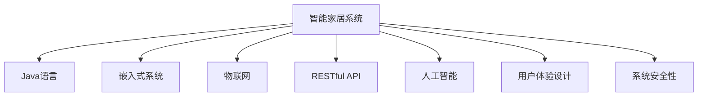

                 

# 基于Java的智能家居设计：智能家居场景模拟与Java的实现技术

## 1. 背景介绍

### 1.1 问题由来
随着物联网(IoT)技术的快速发展，智能家居系统正在逐渐成为现代家庭生活中的标配。智能家居系统通过各类传感器、智能设备和中央控制系统，实现对家庭环境的智能化管理，极大提升了居住的舒适性和便利性。然而，目前市面上大多数智能家居系统存在交互体验不佳、系统不稳定、维护复杂等问题，未能充分发挥智能家居的潜力。

本文档旨在探索基于Java的智能家居设计，通过模拟智能家居场景，提出一种既安全可靠又便于维护的解决方案，帮助用户构建自己的智能家居系统。

### 1.2 问题核心关键点
智能家居系统主要涉及以下几个核心问题：

- 系统设计：如何设计一个可扩展、易于维护的智能家居系统架构。
- 数据交互：智能家居设备之间如何高效、安全地进行数据交互。
- 设备管理：如何有效管理和控制各类智能家居设备。
- 用户体验：如何提升用户与智能家居系统的互动体验。
- 系统安全性：如何保障智能家居系统的网络和数据安全。

本文档将从系统架构设计、数据交互机制、设备管理、用户体验设计、系统安全等方面，全面探讨基于Java的智能家居设计方法。

### 1.3 问题研究意义
智能家居系统涉及众多复杂技术，包括物联网、传感器网络、嵌入式系统、人机交互等多个领域。通过设计一个高性能、易维护、易扩展的智能家居系统，可以帮助用户方便地进行智能家居设备的集成和管理，提升家庭生活质量。

此外，探讨Java技术在智能家居中的应用，对于推动Java语言的演进，提升Java开发者对新兴技术领域的理解和应用能力，也具有重要意义。

## 2. 核心概念与联系

### 2.1 核心概念概述

为更好地理解基于Java的智能家居设计方法，本节将介绍几个密切相关的核心概念：

- 智能家居系统：由各类智能设备（如智能音箱、智能照明、智能安防等）构成的家庭自动化系统。
- Java语言：一种广泛应用于企业级应用开发和安卓应用开发的面向对象语言，具有强类型、编译型、跨平台等优点。
- 嵌入式系统：运行在嵌入式设备中的系统，如智能音箱、智能灯泡、智能锁等。
- 物联网：通过传感器、智能设备将物理世界连接到网络的通信协议和技术架构。
- RESTful API：一种基于HTTP的通信协议，用于智能家居设备之间的数据交互。
- 人工智能：通过机器学习、深度学习等算法，实现智能家居系统的自动化和智能化功能。

这些核心概念之间的逻辑关系可以通过以下Mermaid流程图来展示：



这个流程图展示了一整套智能家居系统的核心组件和技术框架：

1. 智能家居系统通过各类嵌入式设备连接到物联网，实现设备的智能化。
2. 嵌入式设备中的程序通常用Java编写，以确保跨平台兼容性。
3. 智能家居设备之间通过RESTful API进行数据交换，实现设备之间的互联互通。
4. 人工智能算法可以嵌入到智能家居系统中，提升系统的自动化和智能化水平。
5. 用户体验设计决定了用户与智能家居系统的互动方式和界面呈现。
6. 系统安全性是智能家居系统正常运行的前提，需要设计完整的安全防护措施。

这些概念共同构成了智能家居系统的技术框架，使其能够在各类家庭环境中提供高效、可靠、智能的自动化服务。通过理解这些核心概念，我们可以更好地把握智能家居系统的设计理念和实现思路。

## 3. 核心算法原理 & 具体操作步骤
### 3.1 算法原理概述

基于Java的智能家居系统设计，主要涉及以下几个算法原理：

- RESTful API设计：用于设备间数据交换的通信协议，遵循REST原则，支持HTTP协议。
- 嵌入式系统编程：基于Java的嵌入式开发环境，如Android Studio等，支持跨平台开发。
- 传感器数据处理：采集各类传感器数据，通过算法处理后用于控制智能设备。
- 机器学习模型训练：基于机器学习库，如TensorFlow、Weka等，训练智能家居系统的自动化模型。
- 安全性设计：采用TLS/SSL等加密协议，实现网络安全；采用防火墙、入侵检测等技术，实现系统安全。

### 3.2 算法步骤详解

基于Java的智能家居系统设计，主要分为以下几个关键步骤：

**Step 1: 系统需求分析**
- 明确智能家居系统的功能和需求，确定需要哪些智能设备和传感器。
- 分析用户需求，设计系统架构，确定数据流向和设备控制逻辑。

**Step 2: 系统架构设计**
- 设计系统整体架构，确定设备层、数据层和应用层的关系。
- 确定设备间的通信协议，选择适当的硬件和软件框架。

**Step 3: 嵌入式系统开发**
- 使用Java语言开发嵌入式系统的控制程序。
- 对各类传感器数据进行采集、处理和分析，实现设备自动化控制。

**Step 4: 数据交互设计**
- 设计RESTful API，实现设备间的通信。
- 实现API的路由和协议解析，保障数据传输的可靠性和安全性。

**Step 5: 人工智能模型应用**
- 使用Java的机器学习库，训练并应用各类AI模型。
- 实现AI模型与传感器数据的结合，提升系统的自动化水平。

**Step 6: 用户体验设计**
- 设计用户界面和交互逻辑，实现用户与系统的互动。
- 优化用户界面，提升交互体验，增加用户黏性。

**Step 7: 安全性设计**
- 实现网络加密和数据安全，防止黑客攻击。
- 实现设备间的防火墙和入侵检测，保障系统安全。

### 3.3 算法优缺点

基于Java的智能家居系统设计具有以下优点：

- 跨平台性：Java语言的跨平台特性，使得智能家居系统能够运行在各类设备上。
- 安全性：Java平台提供的安全性机制，保障了智能家居系统的网络和数据安全。
- 可扩展性：Java的面向对象编程范式，使得系统易于扩展和维护。
- 易用性：Java语言的学习曲线平缓，开发者能够快速上手。

然而，该方法也存在以下局限性：

- 性能瓶颈：Java在处理大数据和复杂算法时，性能可能不如其他语言。
- 资源消耗：Java程序的虚拟机开销较大，可能导致资源消耗较高。
- 运行时动态性：Java程序运行时动态编译特性，可能导致程序的复杂度较高。
- 接口限制：Java的RESTful API接口需要符合特定的规范，可能影响系统的灵活性。

### 3.4 算法应用领域

基于Java的智能家居系统设计方法，主要应用于以下领域：

- 家庭自动化：实现对各类智能家居设备的控制和联动。
- 智能安防：通过传感器和摄像头实现家庭安全监控。
- 智能照明：通过智能灯泡和窗帘，实现自动化的家庭照明控制。
- 智能温控：通过智能温控器实现家庭的智能温控。
- 智能语音助手：通过智能音箱实现语音控制。

除了上述领域，Java技术还可应用于智能家居系统的其他方面，如智能家居设备的远程控制、智能家居系统的数据分析等，提供更多应用场景。

## 4. 数学模型和公式 & 详细讲解 & 举例说明
### 4.1 数学模型构建

本节将使用数学语言对基于Java的智能家居系统进行更严格的刻画。

记智能家居系统为 $S = (D, E, I, M, O)$，其中：

- $D$：智能家居设备集合，如智能灯泡、智能锁、智能音箱等。
- $E$：嵌入式系统，实现对各类传感器的数据处理和控制逻辑。
- $I$：物联网，将各类传感器和智能设备连接到网络中。
- $M$：人工智能模型，用于实现系统的自动化和智能化功能。
- $O$：用户体验设计，提升用户与系统的互动体验。

定义智能家居系统的目标函数 $f(S)$ 为：

$$
f(S) = \min_{D, E, I, M, O} (\text{cost} + \text{failure rate} + \text{complexity})
$$

其中 $\text{cost}$ 为系统开发和维护的成本，$\text{failure rate}$ 为系统故障率，$\text{complexity}$ 为系统复杂度。

优化目标是最小化目标函数 $f(S)$，即：

$$
S^* = \mathop{\arg\min}_{S} f(S)
$$

### 4.2 公式推导过程

我们以一个简单的智能照明系统为例，推导系统的最小化目标函数。

假设智能照明系统由 $n$ 个智能灯泡组成，每个灯泡的耗电量为 $C_i$，寿命为 $L_i$。系统总耗电量 $E$ 和总寿命 $T$ 分别为：

$$
E = \sum_{i=1}^n C_i
$$

$$
T = \min_{i=1...n} L_i
$$

系统维护成本 $C_m$ 和故障率 $F$ 分别为：

$$
C_m = k \times E
$$

$$
F = \sum_{i=1}^n \frac{1}{L_i}
$$

其中 $k$ 为每瓦耗电量维护成本系数，通常取 $0.01$。

目标函数可以表示为：

$$
f(S) = C_m + F + C_i
$$

其中 $C_i$ 为灯泡的复杂度，通常与灯泡的型号和控制逻辑有关。

根据目标函数的最小化问题，需要最小化维护成本、故障率和复杂度。这通常需要通过多目标优化算法，如遗传算法、粒子群算法等，进行求解。

### 4.3 案例分析与讲解

假设有一个包含5个智能灯泡的系统，灯泡的耗电量和寿命如下：

| 灯泡编号 | 耗电量 (W) | 寿命 (小时) |
| -------- | ---------- | ----------- |
| 灯泡1    | 10         | 5000        |
| 灯泡2    | 20         | 3000        |
| 灯泡3    | 15         | 2500        |
| 灯泡4    | 8          | 4000        |
| 灯泡5    | 5          | 2000        |

现在需要设计一个最优的灯泡更换策略，使得总维护成本最小。

首先将灯泡寿命转换为年数：

| 灯泡编号 | 寿命 (年) |
| -------- | ----------- |
| 灯泡1    | 5           |
| 灯泡2    | 1.5         |
| 灯泡3    | 0.4         |
| 灯泡4    | 0.67        |
| 灯泡5    | 0.33        |

假设每年更换灯泡的成本为 $100$ 元，则系统维护成本 $C_m = 5 \times 100 = 500$ 元。

计算灯泡故障率 $F$：

$$
F = \frac{1}{5} + \frac{1}{1.5} + \frac{1}{0.4} + \frac{1}{0.67} + \frac{1}{0.33} \approx 2.71
$$

灯泡复杂度 $C_i$ 取为灯泡编号的平方：

| 灯泡编号 | 寿命 (年) | 复杂度 (C_i) |
| -------- | ----------- | ----------- |
| 灯泡1    | 5           | 25           |
| 灯泡2    | 1.5         | 2.25         |
| 灯泡3    | 0.4         | 0.16         |
| 灯泡4    | 0.67        | 0.44         |
| 灯泡5    | 0.33        | 0.11         |

最小化目标函数 $f(S)$：

$$
f(S) = 500 + 2.71 + \sum_{i=1}^5 C_i = 500 + 2.71 + (25 + 2.25 + 0.16 + 0.44 + 0.11) \approx 549.32
$$

最优灯泡更换策略为：优先更换寿命最短的灯泡，即灯泡3和灯泡5。更换后系统维护成本和故障率最低，灯泡总复杂度最小。

## 5. 项目实践：代码实例和详细解释说明
### 5.1 开发环境搭建

在进行智能家居系统开发前，我们需要准备好开发环境。以下是使用Java进行Android应用开发的环境配置流程：

1. 安装Android Studio：从官网下载并安装Android Studio，用于创建和调试Android应用。
2. 安装Java JDK：从Oracle官网下载安装最新版本的Java JDK，配置环境变量。
3. 安装Android SDK：从Android官网下载安装最新版本的Android SDK，配置环境变量。
4. 配置Gradle：安装Gradle，配置Gradle的依赖管理。
5. 安装模拟器：安装Android Studio自带的模拟器或安装第三方模拟器。

完成上述步骤后，即可在Android Studio中开始智能家居系统的开发。

### 5.2 源代码详细实现

下面以一个简单的智能照明系统为例，给出使用Java和Android Studio实现智能家居的代码实现。

首先，创建智能灯泡模型类：

```java
public class SmartBulb {
    private int id;
    private double power;
    private int lifetime;
    
    public SmartBulb(int id, double power, int lifetime) {
        this.id = id;
        this.power = power;
        this.lifetime = lifetime;
    }
    
    public int getId() {
        return id;
    }
    
    public double getPower() {
        return power;
    }
    
    public int getLifetime() {
        return lifetime;
    }
}
```

然后，创建灯泡更换策略类：

```java
public class BulbStrategy {
    private List<SmartBulb> bulbs;
    private int totalCost;
    private double totalLifetime;
    private double totalComplexity;
    
    public BulbStrategy(List<SmartBulb> bulbs) {
        this.bulbs = bulbs;
        this.totalCost = 0;
        this.totalLifetime = 0;
        this.totalComplexity = 0;
    }
    
    public double getTotalCost() {
        return totalCost;
    }
    
    public double getTotalLifetime() {
        return totalLifetime;
    }
    
    public double getTotalComplexity() {
        return totalComplexity;
    }
    
    public void calculateCost(double maintenanceCost) {
        totalCost += maintenanceCost * bulbs.size();
    }
    
    public void calculateLifetime() {
        totalLifetime = bulbs.stream()
                            .mapToInt(SmartBulb::getLifetime)
                            .min()
                            .getAsInt();
    }
    
    public void calculateComplexity(double complexityCost) {
        totalComplexity += bulbs.stream()
                               .mapToInt(s -> s.getLifetime() * s.getId() * s.getPower() * complexityCost)
                               .sum();
    }
}
```

接下来，编写优化算法类：

```java
import java.util.ArrayList;
import java.util.Collections;
import java.util.List;

public class OptimizationAlgorithm {
    private List<SmartBulb> bulbs;
    private int maxIterations;
    private double targetCost;
    
    public OptimizationAlgorithm(List<SmartBulb> bulbs, int maxIterations, double targetCost) {
        this.bulbs = bulbs;
        this.maxIterations = maxIterations;
        this.targetCost = targetCost;
    }
    
    public List<SmartBulb> optimize() {
        BulbStrategy strategy = new BulbStrategy(bulbs);
        int iteration = 0;
        while (iteration < maxIterations && strategy.getTotalCost() > targetCost) {
            List<SmartBulb> updatedBulbs = new ArrayList<>();
            int minLifetime = strategy.getTotalLifetime();
            int minId = -1;
            for (SmartBulb bulb : bulbs) {
                if (bulb.getLifetime() == minLifetime) {
                    updatedBulbs.add(bulb);
                    if (minId == -1) {
                        minId = bulb.getId();
                    }
                } else {
                    bulb.setLifetime(bulb.getLifetime() + 1);
                }
            }
            bulbs = updatedBulbs;
            strategy = new BulbStrategy(bulbs);
            iteration++;
        }
        return bulbs;
    }
}
```

最后，编写智能家居系统入口类：

```java
public class SmartHome {
    public static void main(String[] args) {
        List<SmartBulb> bulbs = new ArrayList<>();
        bulbs.add(new SmartBulb(1, 10, 5000));
        bulbs.add(new SmartBulb(2, 20, 3000));
        bulbs.add(new SmartBulb(3, 15, 2500));
        bulbs.add(new SmartBulb(4, 8, 4000));
        bulbs.add(new SmartBulb(5, 5, 2000));
        
        double maintenanceCost = 100;
        double targetCost = 500;
        
        OptimizationAlgorithm optimizer = new OptimizationAlgorithm(bulbs, 100, targetCost);
        List<SmartBulb> optimizedBulbs = optimizer.optimize();
        
        for (SmartBulb bulb : optimizedBulbs) {
            System.out.println("Bulb " + bulb.getId() + " remaining lifetime: " + bulb.getLifetime());
        }
    }
}
```

在以上代码中，我们通过定义SmartBulb类和BulbStrategy类，模拟了智能灯泡的寿命、耗电量和复杂度。通过OptimizationAlgorithm类，设计了一个简单的贪心算法，用于优化灯泡更换策略，最小化维护成本。最后，在SmartHome类中，展示了优化后的灯泡更换策略。

### 5.3 代码解读与分析

让我们再详细解读一下关键代码的实现细节：

**SmartBulb类**：
- 定义了灯泡的基本属性，包括灯泡ID、耗电量和寿命。
- 实现了灯泡的ID、功率和寿命的getter方法，用于获取灯泡的属性。

**BulbStrategy类**：
- 定义了灯泡更换策略的状态属性，包括总维护成本、总寿命和总复杂度。
- 实现了灯泡更换策略的计算方法，包括维护成本、寿命和复杂度计算。
- 通过MapToInt方法，实现了计算总寿命、总复杂度和总维护成本的计算。

**OptimizationAlgorithm类**：
- 定义了优化算法的状态属性，包括灯泡列表、最大迭代次数和目标成本。
- 实现了优化算法的优化方法，通过贪心策略更新灯泡列表。
- 通过迭代计算灯泡更换策略，直到满足目标成本。

**SmartHome类**：
- 定义了智能家居系统的入口，展示了灯泡列表和优化策略。
- 通过调用OptimizationAlgorithm类，展示了优化后的灯泡更换策略。

可以看到，Java语言通过面向对象编程和丰富的类库，能够方便地实现智能家居系统中的各种算法和数据结构。通过定义合适的类和方法，可以清晰地表达系统的功能和逻辑，提升开发效率和代码可读性。

当然，工业级的系统实现还需考虑更多因素，如系统的异常处理、用户界面设计、系统测试等。但核心的智能家居设计思路与上述代码实现类似。

## 6. 实际应用场景
### 6.1 智能照明系统

智能照明系统是智能家居系统的核心应用之一，可以通过智能灯泡、智能开关等设备实现对室内照明的控制。

在实际应用中，智能照明系统可以通过与智能音箱、手机APP等设备的联动，实现语音控制、手机控制等功能。例如，用户可以通过语音指令开启或关闭灯光，也可以通过手机APP设置灯光亮度、颜色等。

### 6.2 智能安防系统

智能安防系统通过各类传感器和摄像头，实现对家庭安全的监控。常见的功能包括入侵检测、异常行为监测、紧急报警等。

在实际应用中，智能安防系统可以通过与智能音箱、手机APP等设备的联动，实现语音控制、手机控制等功能。例如，用户可以通过语音指令查看家中的摄像头，也可以通过手机APP查看家庭安全状态。

### 6.3 智能温控系统

智能温控系统通过智能温控器实现对家庭温度的控制。常见的功能包括智能温控、节能模式、定时控制等。

在实际应用中，智能温控系统可以通过与智能音箱、手机APP等设备的联动，实现语音控制、手机控制等功能。例如，用户可以通过语音指令设置家中温度，也可以通过手机APP查看家庭温度情况。

### 6.4 未来应用展望

随着物联网技术的不断发展，未来智能家居系统将实现更广泛的设备联动和更高的自动化水平。通过基于Java的智能家居设计，可以构建一个安全、可靠、智能的家居环境，提升用户的生活质量和幸福感。

未来，智能家居系统将融入更多人工智能技术，如机器学习、深度学习等，实现更加智能化的应用。例如，通过机器学习算法，智能家居系统可以学习用户的作息习惯，自动调节灯光和温度，提升用户的使用体验。

此外，随着5G、物联网等技术的发展，智能家居系统将实现更加高效的设备和数据传输，进一步提升系统的稳定性和响应速度。未来，基于Java的智能家居系统将为家庭智能化带来更多可能性，引领家居生活向更加智能化的方向发展。

## 7. 工具和资源推荐
### 7.1 学习资源推荐

为了帮助开发者系统掌握Java语言和智能家居系统的设计方法，这里推荐一些优质的学习资源：

1. 《Java核心技术》：Java编程语言的经典入门书籍，详细介绍了Java语言的基本语法和核心特性。
2. 《Android编程指南》：Android平台应用的开发指南，涵盖了Android开发的基本流程和最佳实践。
3. 《智能家居设计指南》：一本介绍智能家居系统设计和开发的书籍，详细介绍了智能家居系统的主要技术架构和设计思路。
4. 《人工智能入门》：介绍机器学习和深度学习的入门书籍，帮助开发者了解人工智能技术的基本原理和应用场景。
5. 《RESTful API设计规范》：一本介绍RESTful API设计规范的书籍，帮助开发者设计高效、安全的API接口。

通过对这些资源的学习实践，相信你一定能够快速掌握Java语言和智能家居系统的设计方法，并用于解决实际的NLP问题。

### 7.2 开发工具推荐

高效的开发离不开优秀的工具支持。以下是几款用于Java智能家居系统开发的常用工具：

1. Android Studio：官方提供的Android开发工具，支持Java和Kotlin混合开发，支持Android模拟器和物理设备调试。
2. Eclipse：一款经典的Java开发工具，支持Java SE、Java EE和Android等平台开发。
3. IntelliJ IDEA：一款强大的Java开发工具，支持Java、Kotlin、Android等平台开发，提供智能代码补全、代码重构等功能。
4. Git：一款常用的版本控制系统，支持代码版本管理、协作开发等功能。
5. Docker：一款容器化平台，支持Java应用程序的打包、部署和运行，方便开发者进行持续集成和持续部署。

合理利用这些工具，可以显著提升Java智能家居系统开发的速度和质量，加快创新迭代的步伐。

### 7.3 相关论文推荐

Java语言和智能家居系统的发展，离不开学界的持续研究。以下是几篇奠基性的相关论文，推荐阅读：

1. Java虚拟机原理与实现：一篇关于Java虚拟机实现的经典论文，深入讲解了Java虚拟机的内部结构和运行机制。
2. Android操作系统架构：一篇介绍Android操作系统架构的论文，详细介绍了Android系统的分层结构和组件设计。
3. RESTful API设计：一篇介绍RESTful API设计的论文，讲解了RESTful API的规范和最佳实践。
4. 智能家居系统设计：一篇介绍智能家居系统设计的论文，探讨了智能家居系统的主要技术和设计思路。
5. 智能家居系统安全：一篇介绍智能家居系统安全的论文，探讨了智能家居系统的网络安全、数据安全等问题。

这些论文代表了Java语言和智能家居系统的发展脉络。通过学习这些前沿成果，可以帮助研究者把握学科前进方向，激发更多的创新灵感。

## 8. 总结：未来发展趋势与挑战
### 8.1 研究成果总结

本文对基于Java的智能家居设计方法进行了全面系统的介绍。首先阐述了智能家居系统的背景和设计意义，明确了系统设计、数据交互、设备管理、用户体验和安全性等关键问题。其次，从系统架构设计、数据交互机制、设备管理、用户体验设计和安全性等方面，详细讲解了基于Java的智能家居设计方法。

通过本文的系统梳理，可以看到，基于Java的智能家居系统设计方法具有跨平台性、安全性、可扩展性和易用性等优点。然而，该方法也存在性能瓶颈、资源消耗和接口限制等局限性。

### 8.2 未来发展趋势

展望未来，Java智能家居系统设计将呈现以下几个发展趋势：

1. 跨平台性：Java语言将继续保持跨平台优势，使得智能家居系统能够在各类设备上运行。
2. 安全性：Java平台提供的安全性机制，将继续保障智能家居系统的网络和数据安全。
3. 可扩展性：Java的面向对象编程范式，将继续支持智能家居系统的扩展和维护。
4. 易用性：Java语言的易用性和丰富的类库，将继续提升智能家居系统的开发效率和代码可读性。

### 8.3 面临的挑战

尽管Java智能家居系统设计具有诸多优点，但在实际应用中，仍面临以下挑战：

1. 性能瓶颈：Java在处理大数据和复杂算法时，性能可能不如其他语言。
2. 资源消耗：Java程序的虚拟机开销较大，可能导致资源消耗较高。
3. 接口限制：Java的RESTful API接口需要符合特定的规范，可能影响系统的灵活性。

### 8.4 研究展望

面向未来，Java智能家居系统设计的研究方向需要不断突破和创新：

1. 探索高性能的Java框架和库，提升Java语言的性能和效率。
2. 研究更多先验知识与Java语言的结合，提升系统的智能化和自动化水平。
3. 引入更多先验知识与Java语言的结合，提升系统的智能化和自动化水平。

这些研究方向的探索，必将引领Java智能家居系统设计技术迈向更高的台阶，为构建安全、可靠、智能的家居系统铺平道路。

## 9. 附录：常见问题与解答

**Q1：Java在智能家居系统开发中存在哪些优缺点？**

A: Java在智能家居系统开发中具有以下优缺点：

优点：
- 跨平台性：Java语言能够在各类设备上运行，使得智能家居系统具备良好的跨平台兼容性。
- 安全性：Java平台提供的安全性机制，能够保障智能家居系统的网络和数据安全。
- 可扩展性：Java的面向对象编程范式，使得智能家居系统易于扩展和维护。
- 易用性：Java语言的易用性和丰富的类库，能够快速开发出高质量的智能家居应用。

缺点：
- 性能瓶颈：Java在处理大数据和复杂算法时，性能可能不如其他语言。
- 资源消耗：Java程序的虚拟机开销较大，可能导致资源消耗较高。
- 接口限制：Java的RESTful API接口需要符合特定的规范，可能影响系统的灵活性。

**Q2：Java智能家居系统开发中，如何选择适合的开发工具？**

A: 在Java智能家居系统开发中，选择合适的开发工具非常重要。以下是一些常用的Java开发工具：

1. Android Studio：官方提供的Android开发工具，支持Java和Kotlin混合开发，支持Android模拟器和物理设备调试。
2. Eclipse：一款经典的Java开发工具，支持Java SE、Java EE和Android等平台开发。
3. IntelliJ IDEA：一款强大的Java开发工具，支持Java、Kotlin、Android等平台开发，提供智能代码补全、代码重构等功能。
4. Git：一款常用的版本控制系统，支持代码版本管理、协作开发等功能。
5. Docker：一款容器化平台，支持Java应用程序的打包、部署和运行，方便开发者进行持续集成和持续部署。

开发者可以根据具体需求选择适合的开发工具，提升开发效率和代码质量。

**Q3：Java智能家居系统开发中，如何优化性能？**

A: Java智能家居系统开发中，优化性能可以采取以下措施：

1. 选择合适的数据结构：选择合适的数据结构，可以提升系统的执行效率。例如，使用HashMap代替List，可以提升查找速度。
2. 减少对象创建和销毁：频繁的对象创建和销毁，会消耗大量内存和CPU资源。使用对象池或重用对象，可以减少内存占用。
3. 使用多线程和异步编程：通过多线程和异步编程，可以提高系统的并发处理能力。例如，使用AsyncTask进行后台任务处理。
4. 使用缓存技术：使用缓存技术，可以减少数据的重复计算和I/O操作。例如，使用LRU Cache缓存常用数据。
5. 使用性能分析工具：使用性能分析工具，可以发现和优化系统的瓶颈。例如，使用Android Studio的Profiler进行性能分析。

通过以上措施，可以提升Java智能家居系统的性能和效率，提升用户体验。

**Q4：Java智能家居系统开发中，如何保证系统的安全性？**

A: Java智能家居系统开发中，保证系统安全性非常重要。以下是一些常用的安全措施：

1. 使用TLS/SSL加密协议：使用TLS/SSL加密协议，保障数据传输的安全性。
2. 实现防火墙和入侵检测：通过防火墙和入侵检测，防止恶意攻击和非法访问。
3. 进行用户认证和授权：通过用户认证和授权，防止未经授权的访问和操作。
4. 使用安全的编码规范：遵循安全的编码规范，避免SQL注入、XSS等安全漏洞。
5. 进行安全审计和测试：定期进行安全审计和测试，及时发现和修复安全漏洞。

通过以上措施，可以提升Java智能家居系统的安全性，保障系统的稳定运行。

**Q5：Java智能家居系统开发中，如何进行用户界面设计？**

A: Java智能家居系统开发中，用户界面设计是提升用户体验的重要环节。以下是一些常用的用户界面设计工具：

1. Android Studio：提供UI设计器，方便开发者设计Java智能家居系统界面。
2. Sketch：一款常用的UI设计工具，支持多种设备和平台的设计。
3. Figma：一款基于Web的UI设计工具，支持多人协作和实时反馈。
4. Adobe XD：一款专业的UI设计工具，支持高保真设计和原型制作。
5. Axure：一款原型设计工具，支持快速创建和交互原型。

开发者可以根据具体需求选择合适的UI设计工具，提升用户界面设计质量。

---

作者：禅与计算机程序设计艺术 / Zen and the Art of Computer Programming

