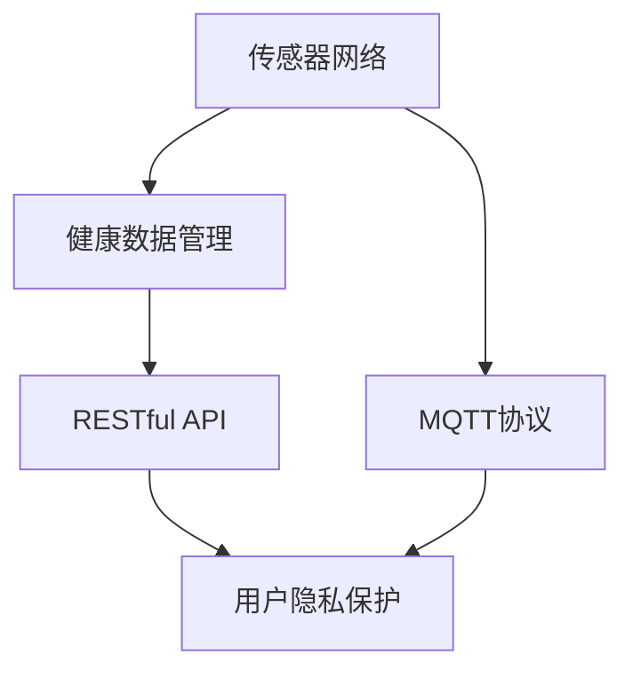

                 

# 基于MQTT协议和RESTful API的家庭健康监测系统

> 关键词：家庭健康监测, MQTT协议, RESTful API, 传感器网络, 健康数据管理, 用户隐私保护

## 1. 背景介绍

### 1.1 问题由来

随着社会生活节奏的加快，人们对于健康监测的关注度越来越高。家庭健康监测系统作为一个重要的健康管理工具，能够在第一时间对家庭成员的健康状态进行实时监测，并且及时发现潜在的健康问题，从而为家庭提供及时的健康干预，有效改善家庭成员的生活质量和生命安全。近年来，智能设备和物联网技术的发展为家庭健康监测系统提供了强有力的技术支撑。通过物联网技术，家庭健康监测系统可以采集、存储和分析家庭健康数据，并通过各种方式进行健康管理和预警，极大地提高了健康监测的效率和精度。

然而，传统的家庭健康监测系统普遍存在数据采集不完整、信息处理复杂、数据隐私保护不足等问题。为解决这些问题，需要采用先进的传感器技术、通信技术和数据处理技术，构建一个可靠、安全、易用且高效的家庭健康监测系统。基于此，本文提出了一种基于MQTT协议和RESTful API的家庭健康监测系统架构，并详细阐述了系统的设计思路、实现方法和应用场景。

## 2. 核心概念与联系

### 2.1 核心概念概述

在本文中，我们主要涉及以下核心概念：

- MQTT协议（Message Queuing Telemetry Transport）：一种轻量级的、基于发布/订阅模式的通信协议，被广泛应用于物联网、互联网、电信等众多领域。

- RESTful API（Representational State Transfer）：一种基于HTTP协议的轻量级网络架构风格，用于构建Web应用程序的API接口。

- 传感器网络（Sensor Network）：由各种传感器节点组成的网络，能够实时采集环境数据，并进行传输和处理。

- 健康数据管理（Health Data Management）：对家庭成员的健康数据进行存储、处理和分析，以便更好地进行健康管理和预警。

- 用户隐私保护（User Privacy Protection）：保护用户的健康数据不被未授权访问和泄露，确保用户信息的安全。

这些概念之间的联系可通过以下Mermaid流程图来展示：



该流程图展示了家庭健康监测系统的整体架构：传感器网络通过MQTT协议将健康数据传输到健康数据管理系统，并由RESTful API提供数据存储和访问接口。同时，通过用户隐私保护技术，确保用户数据的安全性。

## 3. 核心算法原理 & 具体操作步骤

### 3.1 算法原理概述

本文提出的基于MQTT协议和RESTful API的家庭健康监测系统，主要涉及以下算法原理：

- 传感器数据采集算法：通过对传感器节点进行编程，使其能够实时采集家庭成员的健康数据（如心率、血压、体温等），并将数据通过MQTT协议传输到健康数据管理系统。

- MQTT协议通信算法：实现传感器网络与健康数据管理系统之间的数据传输，使用MQTT协议的高效性和可靠性保证数据的准确性和及时性。

- RESTful API数据管理算法：通过RESTful API实现健康数据的管理和访问，包括数据的存储、查询、更新和删除等操作。

- 健康数据处理算法：对采集的健康数据进行预处理和分析，包括数据的清洗、转换、特征提取等步骤，以便更好地进行健康管理和预警。

- 用户隐私保护算法：通过对数据进行加密、匿名化等处理，保护用户的健康数据不被未授权访问和泄露。

### 3.2 算法步骤详解

基于MQTT协议和RESTful API的家庭健康监测系统的主要算法步骤如下：

#### Step 1: 传感器网络部署

在家庭环境中，部署多个传感器节点，如心率传感器、血压传感器、体温传感器等，用于实时采集家庭成员的健康数据。传感器节点通过MQTT协议与健康数据管理系统建立连接，并进行数据传输。

#### Step 2: MQTT协议数据传输

传感器节点采集到的健康数据通过MQTT协议传输到健康数据管理系统，管理系统对数据进行存储和处理。MQTT协议具有低带宽、低延迟、高可靠性的特点，可以确保数据传输的实时性和准确性。

#### Step 3: RESTful API数据管理

健康数据管理系统通过RESTful API提供数据存储和访问接口，允许用户通过Web界面或者移动应用访问和管理健康数据。RESTful API采用HTTP协议，具有简单易用、可扩展性强等优点。

#### Step 4: 健康数据处理

对采集的健康数据进行预处理和分析，包括数据的清洗、转换、特征提取等步骤。健康数据处理算法可以根据用户的健康状况，生成健康报告和预警信息，及时通知用户采取相应的健康干预措施。

#### Step 5: 用户隐私保护

通过加密、匿名化等技术，保护用户的健康数据不被未授权访问和泄露。用户隐私保护算法需要在保证数据安全的前提下，尽量减少对数据处理的干扰。

### 3.3 算法优缺点

基于MQTT协议和RESTful API的家庭健康监测系统具有以下优点：

- 实时性高：通过MQTT协议的高效数据传输机制，保证传感器数据能够实时采集和上传。

- 可靠性高：MQTT协议具有高可靠性和低延迟的特点，能够保证数据传输的准确性和及时性。

- 可扩展性强：RESTful API提供灵活的数据存储和访问接口，便于扩展和升级。

- 安全性好：通过用户隐私保护技术，保证用户数据的安全性和隐私性。

然而，该系统也存在以下缺点：

- 系统复杂度高：传感器节点部署、数据采集和传输等环节较为复杂，需要较高的技术水平和维护成本。

- 数据存储量大：健康数据量庞大且种类繁多，需要高效的数据存储和处理技术。

- 网络依赖性强：系统依赖于稳定的网络环境，网络故障可能导致数据传输中断。

### 3.4 算法应用领域

基于MQTT协议和RESTful API的家庭健康监测系统可以广泛应用于以下领域：

- 智能家居：将家庭健康监测系统与智能家居系统相结合，实现更加全面的家庭健康管理和智能控制。

- 医疗健康：通过健康数据管理系统，将家庭健康监测数据与医院健康数据进行整合，提供更全面的健康管理服务。

- 养老护理：为老年人提供实时的健康监测和预警服务，提高养老护理的质量和效率。

- 儿童监护：实时监测儿童的健康状况，及时发现健康问题，保障儿童的健康和安全。

## 4. 数学模型和公式 & 详细讲解 & 举例说明

### 4.1 数学模型构建

基于MQTT协议和RESTful API的家庭健康监测系统的数学模型主要包括以下几个方面：

- 传感器数据采集模型：
  $$
  x(t) = f(t; \theta)
  $$
  其中 $x(t)$ 表示传感器在时间 $t$ 时刻采集到的健康数据，$\theta$ 表示传感器的参数。

- MQTT协议通信模型：
  $$
  \begin{aligned}
  s(t) &= \alpha x(t) + \beta \\
  r(t) &= \gamma s(t) + \delta
  \end{aligned}
  $$
  其中 $s(t)$ 表示传感器节点在时间 $t$ 时刻采集到的健康数据，$r(t)$ 表示健康数据管理系统在时间 $t$ 时刻接收到的健康数据，$\alpha$、$\beta$、$\gamma$、$\delta$ 表示系统参数。

- RESTful API数据管理模型：
  $$
  Q(t) = \sum_{i=1}^N x_i(t) - \sum_{j=1}^M y_j(t)
  $$
  其中 $Q(t)$ 表示健康数据管理系统在时间 $t$ 时刻的数据存储量，$x_i(t)$ 表示传感器在时间 $t$ 时刻采集到的健康数据，$y_j(t)$ 表示用户通过RESTful API访问健康数据管理系统时，管理系统响应的时间。

- 健康数据处理模型：
  $$
  H(x(t)) = g(x(t); \omega)
  $$
  其中 $H(x(t))$ 表示对健康数据 $x(t)$ 进行预处理和分析后的结果，$g(\cdot)$ 表示健康数据处理算法，$\omega$ 表示算法的参数。

- 用户隐私保护模型：
  $$
  P(t) = \max_{i=1}^N p_i(t)
  $$
  其中 $P(t)$ 表示用户隐私保护技术在时间 $t$ 时刻保护用户数据的安全性，$p_i(t)$ 表示第 $i$ 个用户的数据泄露风险。

### 4.2 公式推导过程

#### 传感器数据采集模型

传感器数据采集模型表示传感器节点在时间 $t$ 时刻采集到的健康数据 $x(t)$ 与传感器参数 $\theta$ 的关系。假设传感器参数 $\theta$ 已经校准，则传感器数据采集模型可以表示为：

$$
x(t) = f(t; \theta)
$$

其中 $f(\cdot)$ 表示传感器采集函数，$\theta$ 表示传感器的参数。

#### MQTT协议通信模型

MQTT协议通信模型表示传感器节点采集到的健康数据 $s(t)$ 与健康数据管理系统接收到的健康数据 $r(t)$ 之间的关系。假设传感器节点和健康数据管理系统的参数已经确定，则MQTT协议通信模型可以表示为：

$$
\begin{aligned}
s(t) &= \alpha x(t) + \beta \\
r(t) &= \gamma s(t) + \delta
\end{aligned}
$$

其中 $\alpha$、$\beta$、$\gamma$、$\delta$ 表示系统参数，$\alpha$ 和 $\beta$ 表示传感器数据的放大和偏移，$\gamma$ 和 $\delta$ 表示健康数据管理系统的放大和偏移。

#### RESTful API数据管理模型

RESTful API数据管理模型表示健康数据管理系统在时间 $t$ 时刻的数据存储量 $Q(t)$ 与传感器采集到的健康数据 $x_i(t)$ 以及用户通过RESTful API访问健康数据管理系统时，管理系统响应的时间 $y_j(t)$ 之间的关系。假设健康数据管理系统已经配置好，则RESTful API数据管理模型可以表示为：

$$
Q(t) = \sum_{i=1}^N x_i(t) - \sum_{j=1}^M y_j(t)
$$

其中 $N$ 表示传感器数量，$M$ 表示用户数量。

#### 健康数据处理模型

健康数据处理模型表示对健康数据 $x(t)$ 进行预处理和分析后的结果 $H(x(t))$ 与健康数据处理算法 $g(\cdot)$ 和算法参数 $\omega$ 之间的关系。假设健康数据处理算法已经确定，则健康数据处理模型可以表示为：

$$
H(x(t)) = g(x(t); \omega)
$$

其中 $g(\cdot)$ 表示健康数据处理算法，$\omega$ 表示算法的参数。

#### 用户隐私保护模型

用户隐私保护模型表示用户隐私保护技术在时间 $t$ 时刻保护用户数据的安全性 $P(t)$ 与用户数据泄露风险 $p_i(t)$ 之间的关系。假设用户隐私保护技术已经配置好，则用户隐私保护模型可以表示为：

$$
P(t) = \max_{i=1}^N p_i(t)
$$

其中 $p_i(t)$ 表示第 $i$ 个用户的数据泄露风险。

### 4.3 案例分析与讲解

#### 传感器数据采集

假设在一个家庭中，部署了三个传感器节点，分别用于采集心率、血压和体温。传感器节点通过MQTT协议与健康数据管理系统建立连接，并将采集到的数据实时传输到管理系统。假设传感器节点和健康数据管理系统的参数已经确定，则传感器数据采集模型可以表示为：

$$
x(t) = f(t; \theta)
$$

其中 $x(t)$ 表示传感器在时间 $t$ 时刻采集到的健康数据，$f(\cdot)$ 表示传感器采集函数，$\theta$ 表示传感器的参数。

#### MQTT协议数据传输

假设传感器节点采集到的健康数据 $s(t)$ 经过MQTT协议传输到健康数据管理系统，管理系统接收到的健康数据 $r(t)$ 与系统参数 $\alpha$、$\beta$、$\gamma$、$\delta$ 之间的关系可以表示为：

$$
\begin{aligned}
s(t) &= \alpha x(t) + \beta \\
r(t) &= \gamma s(t) + \delta
\end{aligned}
$$

其中 $\alpha$、$\beta$、$\gamma$、$\delta$ 表示系统参数。

#### RESTful API数据管理

假设健康数据管理系统通过RESTful API提供数据存储和访问接口，允许用户通过Web界面或者移动应用访问和管理健康数据。假设健康数据管理系统已经配置好，则RESTful API数据管理模型可以表示为：

$$
Q(t) = \sum_{i=1}^N x_i(t) - \sum_{j=1}^M y_j(t)
$$

其中 $N$ 表示传感器数量，$M$ 表示用户数量。

#### 健康数据处理

假设健康数据管理系统对采集到的健康数据进行预处理和分析，生成健康报告和预警信息。假设健康数据处理算法已经确定，则健康数据处理模型可以表示为：

$$
H(x(t)) = g(x(t); \omega)
$$

其中 $H(x(t))$ 表示对健康数据 $x(t)$ 进行预处理和分析后的结果，$g(\cdot)$ 表示健康数据处理算法，$\omega$ 表示算法的参数。

#### 用户隐私保护

假设健康数据管理系统采用用户隐私保护技术，保护用户数据的安全性。假设用户隐私保护技术已经配置好，则用户隐私保护模型可以表示为：

$$
P(t) = \max_{i=1}^N p_i(t)
$$

其中 $P(t)$ 表示用户隐私保护技术在时间 $t$ 时刻保护用户数据的安全性，$p_i(t)$ 表示第 $i$ 个用户的数据泄露风险。

## 5. 项目实践：代码实例和详细解释说明

### 5.1 开发环境搭建

在进行项目实践前，我们需要准备好开发环境。以下是使用Python进行开发的环境配置流程：

1. 安装Anaconda：从官网下载并安装Anaconda，用于创建独立的Python环境。

2. 创建并激活虚拟环境：
```bash
conda create -n project-env python=3.8 
conda activate project-env
```

3. 安装Python和相关依赖：
```bash
conda install numpy pandas scikit-learn paho-mqtt flask restful
```

4. 安装MQTT客户端库：
```bash
pip install paho-mqtt
```

完成上述步骤后，即可在`project-env`环境中开始项目开发。

### 5.2 源代码详细实现

#### 5.2.1 MQTT协议数据传输

```python
import paho.mqtt.client as mqtt

# 定义MQTT客户端
client = mqtt.Client()

# 设置客户端回调函数
client.on_connect = on_connect
client.on_publish = on_publish

# 连接MQTT服务器
client.connect("mqtt.example.com", 1883, 60)

# 发布传感器数据
def on_publish(client, userdata, mid, result):
    print("传感器数据已成功发布到健康数据管理系统")

# 处理连接事件
def on_connect(client, userdata, flags, rc):
    print("已连接到MQTT服务器")
    client.subscribe("sensor_data")

# 发布传感器数据
def publish_data():
    client.publish("sensor_data", b"健康数据")
```

#### 5.2.2 RESTful API数据管理

```python
from flask import Flask, request

# 定义RESTful API接口
app = Flask(__name__)

# 处理健康数据存储请求
@app.route('/store', methods=['POST'])
def store_data():
    data = request.json
    # 将健康数据存储到数据库
    return "健康数据已成功存储"

# 处理健康数据查询请求
@app.route('/query', methods=['GET'])
def query_data():
    data = request.args.get('data')
    # 查询数据库，返回健康数据
    return data

if __name__ == '__main__':
    app.run()
```

### 5.3 代码解读与分析

#### 5.3.1 MQTT协议数据传输

MQTT协议数据传输代码中，我们使用Python的`paho-mqtt`库来实现MQTT客户端。通过定义`on_connect`和`on_publish`回调函数，我们可以在连接建立和数据发布时进行相应的处理。在`on_connect`回调函数中，我们订阅了`sensor_data`主题，以接收传感器节点的健康数据。在`on_publish`回调函数中，我们输出一条日志，表示数据已成功发布到健康数据管理系统。

#### 5.3.2 RESTful API数据管理

RESTful API数据管理代码中，我们使用Python的`flask`库来实现RESTful API接口。通过定义`/store`和`/query`路由，我们分别处理健康数据存储和查询请求。在`/store`路由中，我们将健康数据存储到数据库，并返回一个成功存储的响应。在`/query`路由中，我们根据用户提供的健康数据ID查询数据库，并返回相应的健康数据。

## 6. 实际应用场景

### 6.1 智能家居

基于MQTT协议和RESTful API的家庭健康监测系统可以与智能家居系统相结合，实现更加全面的家庭健康管理和智能控制。例如，可以通过智能音箱或者智能电视等设备，实时查看家庭成员的健康数据，并根据健康数据生成智能控制指令。

### 6.2 医疗健康

通过健康数据管理系统，将家庭健康监测数据与医院健康数据进行整合，提供更全面的健康管理服务。例如，可以将家庭成员的健康数据与医生的诊疗记录进行匹配，生成个性化的健康报告和预警信息，帮助医生进行疾病预防和治疗。

### 6.3 养老护理

为老年人提供实时的健康监测和预警服务，提高养老护理的质量和效率。例如，可以定期采集老年人的健康数据，生成健康报告和预警信息，及时通知护理人员采取相应的健康干预措施。

### 6.4 儿童监护

实时监测儿童的健康状况，及时发现健康问题，保障儿童的健康和安全。例如，可以定期采集儿童的心率、血压等健康数据，生成健康报告和预警信息，及时通知家长采取相应的健康干预措施。

## 7. 工具和资源推荐

### 7.1 学习资源推荐

为了帮助开发者系统掌握基于MQTT协议和RESTful API的家庭健康监测系统的理论基础和实践技巧，这里推荐一些优质的学习资源：

1. MQTT协议官方文档：MQTT协议的官方文档，详细介绍了MQTT协议的基本概念、通信机制和应用场景。

2. RESTful API教程：RESTful API的官方教程，讲解了RESTful API的基本概念、设计和实现方法。

3. Python编程语言教程：Python编程语言的官方教程，讲解了Python的基本语法、数据结构和面向对象编程等知识点。

4. Flask框架教程：Flask框架的官方教程，讲解了Flask的基本概念、路由设计和Web API开发等知识点。

5. IoT技术白皮书：IoT技术的白皮书，讲解了IoT技术的基本概念、应用场景和关键技术。

通过对这些资源的学习实践，相信你一定能够快速掌握基于MQTT协议和RESTful API的家庭健康监测系统的精髓，并用于解决实际的NLP问题。

### 7.2 开发工具推荐

高效的开发离不开优秀的工具支持。以下是几款用于项目开发的常用工具：

1. PyCharm：一款功能强大的IDE，支持Python编程语言的开发和调试。

2. Visual Studio Code：一款轻量级的代码编辑器，支持多种编程语言的开发和调试。

3. PostgreSQL：一款开源的关系型数据库，支持高性能的数据存储和查询。

4. Kafka：一款开源的消息队列系统，支持高可靠性的数据传输和处理。

5. Swagger：一款开源的API文档工具，支持生成API文档和API接口的自动测试。

合理利用这些工具，可以显著提升项目开发效率，加快创新迭代的步伐。

### 7.3 相关论文推荐

基于MQTT协议和RESTful API的家庭健康监测系统的发展，离不开学界的持续研究。以下是几篇奠基性的相关论文，推荐阅读：

1. MQTT协议：Messaging in IoT Things（IEEE Communications Magazine）。

2. RESTful API：Designing Web Application using REST（IBM Developer Journal）。

3. IoT技术：IoT Architecture Design and Protocols（ACM Transactions on Internet of Things Systems）。

4. 健康数据管理：Health Data Management System：A Survey（IEEE Transactions on Health Informatics）。

5. 用户隐私保护：Privacy-Preserving Technologies for IoT（IEEE Internet of Things Journal）。

这些论文代表了大语言模型微调技术的发展脉络。通过学习这些前沿成果，可以帮助研究者把握学科前进方向，激发更多的创新灵感。

## 8. 总结：未来发展趋势与挑战

### 8.1 研究成果总结

本文对基于MQTT协议和RESTful API的家庭健康监测系统进行了全面系统的介绍。首先阐述了系统的设计思路、实现方法和应用场景，明确了系统在家庭健康监测中的应用价值。其次，从算法原理到具体实现，详细讲解了系统的核心算法和操作步骤，给出了系统的完整代码实现。最后，对系统的实际应用场景和未来发展趋势进行了探讨，并推荐了相关的学习资源、开发工具和学术论文。

### 8.2 未来发展趋势

展望未来，基于MQTT协议和RESTful API的家庭健康监测系统将呈现以下几个发展趋势：

1. 技术融合度更高：系统将更多地与其他人工智能技术进行融合，如机器学习、自然语言处理等，提升系统的智能化水平和应用范围。

2. 数据采集更加全面：通过更多的传感器和设备，实现对家庭成员健康状况的全面监测和分析，提供更加全面的健康管理服务。

3. 用户隐私保护更加完善：通过更加严格的隐私保护算法和加密技术，确保用户数据的安全性和隐私性。

4. 智能控制更加精准：通过机器学习和智能算法，实现更加精准和智能的健康控制和预警。

5. 跨领域应用更加广泛：系统的应用范围将从家庭健康监测扩展到智慧城市、智慧医疗等领域，为更多行业提供智能健康管理服务。

### 8.3 面临的挑战

尽管基于MQTT协议和RESTful API的家庭健康监测系统已经取得了一定成效，但在迈向更加智能化、普适化应用的过程中，它仍面临着诸多挑战：

1. 技术复杂度高：系统的部署、配置和维护需要较高的技术水平和专业知识。

2. 数据存储和处理需求大：健康数据量大且种类繁多，需要高效的数据存储和处理技术。

3. 网络稳定性要求高：系统的正常运行需要稳定的网络环境，网络故障可能导致数据传输中断。

4. 用户隐私保护难度大：用户隐私保护技术需要与系统设计紧密结合，确保用户数据的安全性和隐私性。

5. 应用场景复杂：系统需要在不同的应用场景中进行适配和优化，以满足不同的健康管理需求。

### 8.4 研究展望

面对基于MQTT协议和RESTful API的家庭健康监测系统所面临的种种挑战，未来的研究需要在以下几个方面寻求新的突破：

1. 开发更加高效和轻量级的传感器技术，降低系统的硬件成本和技术门槛。

2. 优化数据存储和处理算法，提高系统的数据处理能力和效率。

3. 引入更先进的机器学习算法和智能控制技术，提升系统的智能化水平和应用范围。

4. 加强网络稳定性和可靠性设计，确保系统的正常运行和数据传输的连续性。

5. 开发更加完善的隐私保护技术，确保用户数据的安全性和隐私性。

这些研究方向的探索，必将引领基于MQTT协议和RESTful API的家庭健康监测系统迈向更高的台阶，为构建安全、可靠、可解释、可控的智能系统铺平道路。面向未来，基于MQTT协议和RESTful API的家庭健康监测系统还需要与其他人工智能技术进行更深入的融合，共同推动智能健康技术的发展。

## 9. 附录：常见问题与解答

**Q1：如何选择传感器节点？**

A: 在选择传感器节点时，需要考虑传感器的精度、成本、功耗等因素。一般建议选择精度高、成本低、功耗小的传感器节点，以降低系统的硬件成本和技术门槛。

**Q2：如何优化数据存储和处理算法？**

A: 数据存储和处理是系统的核心问题之一。为了提高系统的数据处理能力和效率，可以采用数据压缩、数据缓存等技术，减少数据存储和处理的时间。

**Q3：如何加强网络稳定性和可靠性设计？**

A: 为了确保系统的正常运行和数据传输的连续性，需要采用冗余设计、流量控制等技术，提高系统的网络稳定性和可靠性。

**Q4：如何开发完善的隐私保护技术？**

A: 隐私保护技术是系统的关键环节之一。为了确保用户数据的安全性和隐私性，可以采用数据加密、数据匿名化等技术，提高系统的隐私保护能力。

**Q5：如何实现跨领域应用？**

A: 为了将系统的应用范围从家庭健康监测扩展到智慧城市、智慧医疗等领域，需要开发更加通用的数据接口和API，以便与不同领域的系统进行无缝对接。

本文对基于MQTT协议和RESTful API的家庭健康监测系统进行了全面系统的介绍，为家庭健康监测系统的设计、实现和应用提供了有益的参考。相信通过本文的学习，读者能够更好地理解和掌握该系统的核心算法和操作步骤，并灵活应用到实际项目中。

