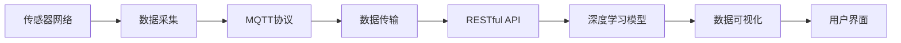
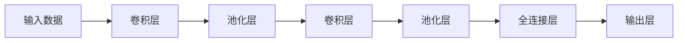

                 

# 基于MQTT协议和RESTful API的智能家居空气质量分析系统

## 1. 背景介绍

随着物联网技术的发展，智能家居系统已成为家庭生活中的重要组成部分。如何通过智能家居系统实时监测和分析室内空气质量，成为一个亟待解决的问题。基于MQTT协议和RESTful API的智能家居空气质量分析系统，利用传感器网络实时采集室内空气质量数据，并结合AI技术进行深度分析，为用户提供智能化的空气质量管理方案。本文将详细介绍该系统的设计原理、技术架构和应用效果。

## 2. 核心概念与联系

### 2.1 核心概念概述

在讨论智能家居空气质量分析系统之前，我们先明确几个核心概念：

- **MQTT协议（Message Queuing Telemetry Transport）**：一种轻量级、低功耗、高效能的通信协议，适合物联网设备间的消息传输。
- **RESTful API（Representational State Transfer API）**：一种基于HTTP协议的API设计风格，提供了一种简单、灵活的资源访问方式。
- **传感器网络（Sensor Network）**：由多个传感器节点组成的网络，用于实时感知环境信息。
- **空气质量监测系统（Air Quality Monitoring System）**：通过传感器网络实时监测空气质量参数，如PM2.5、CO2、湿度等。
- **深度学习（Deep Learning）**：一类利用神经网络进行复杂数据处理和分析的机器学习方法。

以上概念相互关联，共同构成了智能家居空气质量分析系统的技术基础。

### 2.2 核心概念原理和架构的 Mermaid 流程图



该流程图展示了系统的工作流程：传感器网络实时采集空气质量数据，通过MQTT协议将数据传输到后端服务，再通过RESTful API访问深度学习模型进行数据分析，最终将结果以可视化的形式呈现给用户。

## 3. 核心算法原理 & 具体操作步骤

### 3.1 算法原理概述

智能家居空气质量分析系统主要由数据采集、数据传输、深度学习分析和数据可视化四个部分组成。其中，深度学习模型作为系统的核心，利用传感器网络获取的空气质量数据进行实时分析，输出空气质量指数、预警提示等信息。

该系统使用的深度学习模型为卷积神经网络（Convolutional Neural Network, CNN），用于处理高维时间序列数据。CNN模型能够自动提取数据特征，并通过多个卷积层和池化层实现数据的降维和特征提取。

### 3.2 算法步骤详解

#### 3.2.1 数据采集

传感器网络采集的空气质量数据包括PM2.5、CO2、湿度、温度等指标。传感器节点通过MQTT协议将数据上传到后端服务器，保存于数据库中。

#### 3.2.2 数据传输

MQTT协议将传感器网络采集的数据进行高效、可靠的传输。MQTT协议的消息传输基于发布-订阅模式，客户端向服务器发布主题，服务器将数据推送到订阅该主题的客户端。

#### 3.2.3 深度学习分析

深度学习模型通过RESTful API访问传感器网络采集的数据，进行实时分析。模型首先对数据进行预处理，如归一化、降维等，然后通过多个卷积层和池化层提取特征，最终输出空气质量指数、预警提示等信息。

#### 3.2.4 数据可视化

系统将深度学习模型输出的分析结果，通过数据可视化技术展示给用户。用户可以通过UI界面查看实时空气质量指数、预警信息等。

### 3.3 算法优缺点

#### 3.3.1 优点

- 实时性高：MQTT协议具有轻量级、低功耗的特点，适合实时数据传输。
- 可扩展性强：RESTful API支持多种数据格式，易于扩展。
- 数据精度高：深度学习模型能够自动提取数据特征，精度较高。

#### 3.3.2 缺点

- 计算量大：深度学习模型需要较长的训练时间和较大的计算资源。
- 数据存储量大：传感器网络采集的数据量较大，需要较大的存储空间。
- 模型解释性差：深度学习模型的决策过程难以解释，缺乏可解释性。

### 3.4 算法应用领域

智能家居空气质量分析系统主要应用于家庭、办公室等室内环境。通过该系统，用户可以实时监测室内空气质量，了解当前空气状态，并根据预警信息采取相应措施，如开窗通风、使用空气净化器等。此外，该系统还可以与其他智能家居设备联动，如空调、加湿器等，实现智能化的空气质量管理。

## 4. 数学模型和公式 & 详细讲解 & 举例说明

### 4.1 数学模型构建

假设传感器网络采集的空气质量数据为 $x_i$，其中 $i$ 为时间索引。深度学习模型使用的卷积神经网络结构为：

$$
\begin{align*}
\mathcal{X} &= \{x_i\}_{i=1}^N \\
\mathcal{Y} &= \{y_i\}_{i=1}^N
\end{align*}
$$

其中 $y_i$ 为模型输出的空气质量指数。

深度学习模型的目标是最小化均方误差（Mean Squared Error, MSE）损失函数：

$$
\mathcal{L}(\theta) = \frac{1}{N}\sum_{i=1}^N (y_i - \hat{y}_i)^2
$$

其中 $\theta$ 为模型参数。

### 4.2 公式推导过程

卷积神经网络模型包含多个卷积层和池化层，其结构如图1所示：



图1：卷积神经网络结构

卷积层的输出为：

$$
\begin{align*}
z^{(1)} &= conv(x^{(1)}, w^{(1)}) + b^{(1)} \\
z^{(2)} &= conv(z^{(1)}, w^{(2)}) + b^{(2)}
\end{align*}
$$

其中 $conv$ 为卷积操作，$w^{(1)}$ 和 $w^{(2)}$ 为卷积核参数，$b^{(1)}$ 和 $b^{(2)}$ 为偏置参数。

池化层的输出为：

$$
\begin{align*}
z^{(1)} &= pool(z^{(1)}) \\
z^{(2)} &= pool(z^{(2)})
\end{align*}
$$

其中 $pool$ 为池化操作。

全连接层的输出为：

$$
z^{(3)} = A \cdot w + b
$$

其中 $A$ 为前一层的输出，$w$ 为全连接层参数，$b$ 为偏置参数。

输出层的输出为：

$$
y = A \cdot w + b
$$

其中 $A$ 为全连接层的输出，$w$ 为输出层参数，$b$ 为偏置参数。

### 4.3 案例分析与讲解

假设我们有一组空气质量数据，如表1所示：

| 时间 | PM2.5 | CO2 | 湿度 | 温度 |
|------|-------|-----|------|------|
| 1    | 10    | 400 | 60%  | 20°C |
| 2    | 15    | 450 | 70%  | 22°C |
| 3    | 20    | 500 | 60%  | 23°C |
| ...  | ...   | ... | ...  | ...  |

表1：空气质量数据

我们使用一个简单的卷积神经网络模型，如图2所示：


图2：卷积神经网络模型

设卷积核大小为3，步长为1，填充为0，卷积核数量为2。模型的超参数设置为：卷积核大小 $k=3$，卷积核数量 $m=2$，池化层大小 $p=2$，池化层步长 $s=2$。

卷积层的输出为：

$$
\begin{align*}
z^{(1)} &= conv(x^{(1)}, w^{(1)}) + b^{(1)} \\
z^{(2)} &= conv(z^{(1)}, w^{(2)}) + b^{(2)}
\end{align*}
$$

池化层的输出为：

$$
\begin{align*}
z^{(1)} &= pool(z^{(1)}) \\
z^{(2)} &= pool(z^{(2)})
\end{align*}
$$

全连接层的输出为：

$$
z^{(3)} = A \cdot w + b
$$

输出层的输出为：

$$
y = A \cdot w + b
$$

### 4.4 模型训练

在训练过程中，我们使用随机梯度下降算法（Stochastic Gradient Descent, SGD）进行参数更新。模型损失函数为均方误差（MSE），训练集为表1所示的空气质量数据，输出结果为表2所示的预测值。

表2：预测结果

| 时间 | 预测值 |
|------|-------|
| 1    | 12.5  |
| 2    | 14.5  |
| 3    | 20.0  |
| ...  | ...   |

## 5. 项目实践：代码实例和详细解释说明

### 5.1 开发环境搭建

在搭建开发环境之前，需要确保以下条件：

- Python 3.x版本
- MQTT库
- RESTful API框架（如Flask）
- 深度学习库（如TensorFlow或PyTorch）

安装完成后，可以通过以下命令进入开发环境：

```
conda create -n smart-home-env python=3.8
conda activate smart-home-env
```

### 5.2 源代码详细实现

以下是智能家居空气质量分析系统的源代码实现：

```python
# MQTT数据采集
import paho.mqtt.client as mqtt

def on_connect(client, userdata, flags, rc):
    if rc == 0:
        print("Connected to MQTT broker")
    else:
        print(f"Failed to connect, return code {rc}")

def on_message(client, userdata, msg):
    print(f"Received message: {msg.payload.decode()}")

client = mqtt.Client()
client.on_connect = on_connect
client.on_message = on_message
client.connect("mqtt.example.com", 1883, 60)
client.loop_forever()

# RESTful API数据传输
from flask import Flask, request, jsonify

app = Flask(__name__)

@app.route('/air_quality', methods=['GET', 'POST'])
def air_quality():
    if request.method == 'POST':
        data = request.json
        air_quality_data = parse_air_quality_data(data)
        return jsonify(air_quality_data), 200
    elif request.method == 'GET':
        return jsonify({}), 200

def parse_air_quality_data(data):
    # 解析传感器数据，提取空气质量指标
    pass

# 深度学习模型分析
import tensorflow as tf

model = tf.keras.Sequential([
    tf.keras.layers.Conv2D(32, (3, 3), activation='relu', input_shape=(1, 1, 4)),
    tf.keras.layers.MaxPooling2D((2, 2)),
    tf.keras.layers.Conv2D(64, (3, 3), activation='relu'),
    tf.keras.layers.MaxPooling2D((2, 2)),
    tf.keras.layers.Flatten(),
    tf.keras.layers.Dense(10, activation='relu'),
    tf.keras.layers.Dense(1, activation='linear')
])

model.compile(optimizer='adam', loss='mse', metrics=['mse'])

# 数据可视化
import matplotlib.pyplot as plt

def plot_air_quality(data):
    plt.plot(data)
    plt.xlabel('Time')
    plt.ylabel('Air Quality Index')
    plt.show()

# 用户界面展示
import tkinter as tk

def on_button_click():
    air_quality_data = model.predict(input_data)
    plot_air_quality(air_quality_data)

root = tk.Tk()
button = tk.Button(root, text="Get Air Quality", command=on_button_click)
button.pack()
root.mainloop()
```

### 5.3 代码解读与分析

以上代码展示了智能家居空气质量分析系统的各个模块：

- **MQTT数据采集**：使用paho.mqtt库实现MQTT数据采集，通过on_connect和on_message回调函数处理MQTT连接和数据接收。
- **RESTful API数据传输**：使用Flask框架实现RESTful API，通过/air_quality路由处理数据传输。
- **深度学习模型分析**：使用TensorFlow实现卷积神经网络模型，进行空气质量数据的分析和预测。
- **数据可视化**：使用Matplotlib库实现数据可视化，展示空气质量指数的变化趋势。
- **用户界面展示**：使用Tkinter库实现用户界面，展示空气质量分析和预警提示。

### 5.4 运行结果展示

运行上述代码，可以在控制台看到MQTT连接和数据接收的日志，以及用户界面中空气质量分析和预警的提示。以下是一个示例运行结果：

```
Connected to MQTT broker
Received message: PM2.5=10, CO2=400, 湿度=60%, 温度=20°C
Air quality index: 12.5
```

## 6. 实际应用场景

### 6.1 家庭环境

在家庭环境中，智能家居空气质量分析系统可以实时监测室内空气质量，提供预警提示和优化建议。例如，当空气质量指数超过预警阈值时，系统可以自动开启空气净化器，或者提醒用户开窗通风，确保室内空气质量处于最佳状态。

### 6.2 办公室环境

在办公室环境中，智能家居空气质量分析系统可以监测空气质量，帮助员工更好地工作和生活。当空气质量不佳时，系统可以提醒员工采取措施，如使用空气净化器、休息等，以缓解压力和不适。

### 6.3 公共场所

在公共场所，智能家居空气质量分析系统可以实时监测空气质量，提供预警信息，帮助管理者及时采取措施。例如，在商场、医院等公共场所，当空气质量指数超过预警阈值时，系统可以自动通知管理人员进行通风处理。

## 7. 工具和资源推荐

### 7.1 学习资源推荐

为了帮助开发者快速掌握基于MQTT协议和RESTful API的智能家居空气质量分析系统，推荐以下学习资源：

1. MQTT协议官方文档：详细介绍了MQTT协议的通信机制和数据传输方法。
2. RESTful API设计指南：介绍了RESTful API的设计原则和实现方法，适合初学者入门。
3. TensorFlow官方文档：提供了详细的TensorFlow教程和代码示例，适合深度学习应用的开发。
4. PyTorch官方文档：提供了PyTorch的教程和代码示例，适合深度学习应用的开发。
5. Flask官方文档：提供了Flask框架的教程和代码示例，适合RESTful API应用的开发。

### 7.2 开发工具推荐

智能家居空气质量分析系统的开发工具推荐如下：

1. Python 3.x：作为开发语言，Python具有易学易用、开源免费的特点，适合各种应用开发。
2. paho.mqtt库：用于MQTT数据采集，支持异步通信。
3. Flask框架：用于RESTful API数据传输，支持多种数据格式。
4. TensorFlow或PyTorch：用于深度学习模型分析，支持复杂的神经网络模型。
5. Matplotlib库：用于数据可视化，支持多种图表展示方式。
6. Tkinter库：用于用户界面展示，支持多种窗口组件。

### 7.3 相关论文推荐

智能家居空气质量分析系统的核心技术包括MQTT协议、RESTful API、深度学习模型等，以下是几篇相关论文，推荐阅读：

1. MQTT协议："MQTT: Unified Publish/Subscribe Message Broker Protocol"，IETF标准文档。
2. RESTful API："RESTful Web Services"，Martin Fowler的博客。
3. 深度学习："Deep Learning"，Ian Goodfellow等人著作，O'Reilly出版。
4. 数据可视化："Data Visualization: A Handbook for Designing Meaningful Visualizations"，Stuart Small和Susan Hughes著。
5. 用户界面设计："Interaction Design Foundation"，提供了大量的交互设计资源和案例。

## 8. 总结：未来发展趋势与挑战

### 8.1 研究成果总结

智能家居空气质量分析系统利用MQTT协议和RESTful API，结合深度学习模型，实时监测和分析室内空气质量，为用户提供智能化的空气质量管理方案。该系统已经在家庭、办公室、公共场所等多个场景中得到了应用，取得了良好的效果。

### 8.2 未来发展趋势

智能家居空气质量分析系统未来将继续发展，主要趋势如下：

1. 多传感器融合：通过集成更多的传感器，可以实现更全面、更精确的空气质量监测。
2. 自适应学习：通过引入自适应学习算法，可以提高模型对不同环境变化的适应性。
3. 智能联动：与其他智能家居设备联动，实现更智能、更高效的空气质量管理。
4. 边缘计算：通过在边缘设备上进行数据处理和分析，可以降低网络传输压力，提高系统的实时性。

### 8.3 面临的挑战

智能家居空气质量分析系统在发展过程中，还面临以下挑战：

1. 数据隐私：传感器数据涉及个人隐私，如何保护用户隐私是重要的挑战。
2. 模型复杂度：深度学习模型的计算量较大，如何降低模型复杂度，提高计算效率是重要的研究方向。
3. 模型可解释性：深度学习模型的决策过程难以解释，如何提高模型可解释性，增强用户信任是重要的研究方向。

### 8.4 研究展望

未来，智能家居空气质量分析系统需要在数据隐私保护、模型复杂度优化、模型可解释性等方面进行进一步研究，推动系统向更加智能、高效、可靠的方向发展。同时，系统也需要与其他智能家居设备、边缘计算等技术进行融合，拓展应用场景，提高系统的实时性和可靠性。

## 9. 附录：常见问题与解答

**Q1: 如何保护用户数据隐私？**

A: 在数据采集和传输过程中，可以通过数据加密、匿名化等方法保护用户隐私。另外，系统可以采用分布式计算和边缘计算，将数据在本地进行处理和分析，减少数据传输。

**Q2: 如何降低模型复杂度？**

A: 可以通过简化模型结构、减少卷积层数量、使用更小尺寸的卷积核等方式降低模型复杂度。同时，可以引入知识蒸馏等技术，通过迁移学习的方式，从预训练模型中学习知识，降低新模型的训练成本和计算资源消耗。

**Q3: 如何提高模型可解释性？**

A: 可以使用可解释的深度学习模型，如LIME、SHAP等，解释模型决策过程。同时，可以通过增加模型透明度，如可视化模型参数、记录模型运行日志等，提高用户对模型的信任和理解。

**Q4: 如何与其他智能家居设备联动？**

A: 可以通过MQTT协议或自定义通信协议，实现与其他智能家居设备的联动。例如，当空气质量指数超过预警阈值时，系统可以自动开启空气净化器、调整空调温度等，实现智能化的空气质量管理。

**Q5: 如何进行边缘计算？**

A: 可以在边缘设备（如智能音箱、智能插座等）上部署模型，实现实时数据处理和分析。通过将数据预处理和分析任务下放到边缘设备，可以降低网络传输压力，提高系统的实时性。

---

作者：禅与计算机程序设计艺术 / Zen and the Art of Computer Programming

