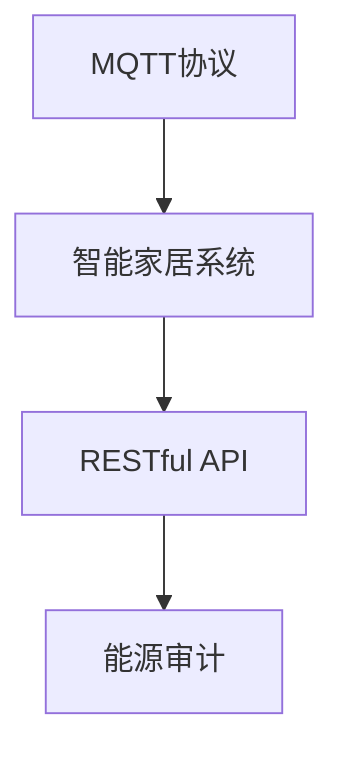

                 

# 基于MQTT协议和RESTful API的智能家居系统能源审计

> 关键词：MQTT协议, RESTful API, 智能家居, 能源审计, 物联网

## 1. 背景介绍

### 1.1 问题由来
随着物联网(IoT)技术的飞速发展，智能家居系统已逐渐进入千家万户。智能家居系统通常包含多个智能设备，如智能灯光、温控器、智能门锁等，它们通过无线通信协议连接在一起，实现远程控制和智能化管理。然而，智能家居系统的能耗问题逐渐成为用户和环保组织关注的焦点。一方面，智能设备的连续在线状态会消耗大量电能；另一方面，设备间频繁的数据传输也会带来额外的能耗。

如何对智能家居系统进行有效的能源审计，成为当下智能家居开发和运维中的一个重要课题。基于MQTT协议和RESTful API的能源审计系统，可以实时监控和管理智能家居设备的能耗情况，帮助用户和运维人员进行能源优化，提升系统能效。

### 1.2 问题核心关键点
本文将围绕基于MQTT协议和RESTful API的智能家居系统能源审计展开讨论，探讨如何利用MQTT协议进行设备间高效的数据传输，通过RESTful API实现系统能源审计数据的获取和展示，并分析系统中可能存在的能耗问题。具体问题核心关键点包括：

- MQTT协议的工作原理与特点
- RESTful API的架构与设计
- 智能家居系统能源审计的实现方法
- 系统能耗优化策略与实践

### 1.3 问题研究意义
智能家居系统的能源审计具有重要的研究意义：

1. **节能减排**：实时监控智能家居设备的能耗情况，可以帮助用户及时调整使用习惯，减少不必要的能耗，从而降低碳足迹，贡献于环保事业。
2. **成本控制**：能耗过高会导致电费支出增加，通过能源审计，可以识别高能耗设备，优化能耗配置，降低运行成本。
3. **用户体验提升**：用户能够通过能源审计数据了解家中设备的能耗情况，从而做出更加节能、环保的消费选择，提升生活质量。
4. **运维效率提高**：对于智能家居系统的运维人员来说，能源审计数据可以用于预测设备故障、优化网络配置，提升系统运行效率。

## 2. 核心概念与联系

### 2.1 核心概念概述

为更好地理解基于MQTT协议和RESTful API的智能家居系统能源审计方法，本节将介绍几个核心概念及其相互联系。

- **MQTT协议(Messaging Queuing Telemetry Transport Protocol)**：轻量级、低延迟的发布/订阅消息传输协议，适用于物联网设备间的数据通信。
- **RESTful API(Representational State Transfer over HTTP/HTTPS)**：基于HTTP协议的API设计风格，使用标准化的HTTP请求方法（GET、POST、PUT、DELETE等），适用于系统数据的获取和处理。
- **智能家居系统(Smart Home System)**：通过物联网技术实现智能设备间的互联互通，支持远程控制、自动化等功能。
- **能源审计(Energy Audit)**：对系统的能耗情况进行实时监控和分析，识别高能耗设备，提出优化策略，以降低能源消耗。

这些概念之间的联系可以通过以下Mermaid流程图来展示：



这个流程图展示出MQTT协议、智能家居系统、RESTful API与能源审计之间的联系：

1. MQTT协议提供智能家居设备间高效的数据传输，支持实时数据采集。
2. RESTful API作为系统数据访问接口，实现数据获取和展示。
3. 能源审计通过MQTT协议和RESTful API获取智能家居系统能耗数据，进行能效分析和管理。

## 3. 核心算法原理 & 具体操作步骤
### 3.1 算法原理概述

基于MQTT协议和RESTful API的智能家居系统能源审计，其核心思想是利用MQTT协议的高效数据传输能力，通过RESTful API接口，将智能家居设备的能耗数据实时传输至能源审计系统，并进行分析和展示。具体步骤如下：

1. **数据采集**：通过MQTT协议，智能家居设备将能耗数据实时推送至能源审计系统。
2. **数据传输**：智能家居设备通过RESTful API接口，将能耗数据传输至能源审计系统的数据库。
3. **数据分析**：能源审计系统对接收到的数据进行分析，识别高能耗设备，生成能耗报告。
4. **结果展示**：通过RESTful API接口，将能耗报告展示给用户和运维人员。

### 3.2 算法步骤详解

#### 3.2.1 数据采集

MQTT协议是一种轻量级、低延迟的消息传输协议，适用于物联网设备的实时数据采集。智能家居设备通过MQTT协议将能耗数据实时推送至能源审计系统。

- **设备连接MQTT服务器**：智能家居设备（如智能灯光、温控器等）通过Wi-Fi、蓝牙、Zigbee等方式连接到MQTT服务器。
- **发布数据到MQTT主题**：设备将能耗数据（如温度、亮度、电能消耗等）发布到MQTT主题中，主题名称通常与设备类型相关联。

#### 3.2.2 数据传输

RESTful API是一种基于HTTP协议的API设计风格，使用标准化的HTTP请求方法，支持数据的获取和处理。智能家居设备通过RESTful API将能耗数据传输至能源审计系统的数据库。

- **设备连接RESTful API**：智能家居设备通过Wi-Fi、以太网等方式连接到系统服务器。
- **发送HTTP请求**：设备发送HTTP请求到RESTful API接口，将能耗数据以JSON格式传输至数据库。

#### 3.2.3 数据分析

能源审计系统对接收到的数据进行分析，识别高能耗设备，生成能耗报告。

- **数据清洗与预处理**：对采集到的数据进行清洗和预处理，去除异常值和无效数据。
- **能耗分析**：根据设备类型和时间维度，统计各设备的能耗数据，生成能耗报告。
- **异常检测**：通过机器学习等算法，检测异常能耗数据，识别高能耗设备。

#### 3.2.4 结果展示

通过RESTful API接口，将能耗报告展示给用户和运维人员。

- **数据展示**：能耗报告以图表、表格等形式展示，帮助用户直观了解各设备的能耗情况。
- **预警提示**：对于高能耗设备，系统自动发送预警提示，提醒用户和运维人员采取措施。

### 3.3 算法优缺点

基于MQTT协议和RESTful API的能源审计系统具有以下优点：

1. **高效实时性**：MQTT协议支持高效、低延迟的数据传输，能实时监控和采集智能家居设备的能耗数据。
2. **灵活性高**：RESTful API提供了标准化的数据获取和处理方式，支持多种数据格式和展示方式。
3. **可扩展性强**：系统可以轻松扩展到更多的智能家居设备，支持更多的能耗数据采集和处理。
4. **易于维护**：系统采用模块化设计，各部分独立维护，方便系统升级和故障排查。

同时，该系统也存在以下缺点：

1. **安全性问题**：MQTT协议和RESTful API接口可能存在安全漏洞，需要采取安全措施保护数据传输和处理。
2. **数据隐私保护**：智能家居设备的能耗数据涉及用户隐私，需要严格保护，防止数据泄露。
3. **网络延迟**：在网络不稳定的情况下，数据传输可能存在延迟，影响实时性。
4. **复杂性高**：系统集成MQTT协议、RESTful API和能源审计功能，需要较高的技术水平和复杂性。

### 3.4 算法应用领域

基于MQTT协议和RESTful API的能源审计系统，具有广泛的应用场景：

- **智能家居系统**：用于智能家居设备的能耗监控和管理，帮助用户优化能源使用，降低运行成本。
- **物联网系统**：适用于物联网设备的数据传输和能耗监控，实现设备的实时管理和优化。
- **企业能源管理**：企业可以部署能源审计系统，实时监控各设备的能耗情况，提升企业能源管理效率。
- **智慧城市建设**：智慧城市中的智能路灯、智能交通等设施可以通过能源审计系统进行能耗管理，实现节能减排。

## 4. 数学模型和公式 & 详细讲解 & 举例说明

### 4.1 数学模型构建

本节将使用数学语言对基于MQTT协议和RESTful API的能源审计系统进行更加严格的刻画。

设智能家居系统中包含 $N$ 个设备，每个设备在时间 $t$ 的能耗为 $E(t)$，单位为瓦特(W)。能源审计系统通过MQTT协议和RESTful API获取各设备的能耗数据，构建数学模型如下：

$$
\begin{aligned}
&\min \sum_{t=1}^{T} \sum_{i=1}^{N} E_i(t) \\
&\text{s.t.} \left\{
\begin{aligned}
&E_i(t) \geq 0, \forall i, t \\
&E_i(t+1) = E_i(t) + \Delta E_i(t), \forall i, t \\
&E_i(t) = E_{i-1}(t) - E_i(t), \forall i, t
\end{aligned}
\right.
\end{aligned}
$$

其中，$E_i(t)$ 表示设备 $i$ 在时间 $t$ 的能耗，$T$ 表示总时间，$\Delta E_i(t)$ 表示设备 $i$ 在时间 $t$ 的能耗变化量。

### 4.2 公式推导过程

接下来，我们对上述数学模型进行推导。

对于每个设备 $i$，其能耗 $E_i(t)$ 可以表示为：

$$
E_i(t) = \sum_{j=1}^{t} \Delta E_i(j)
$$

其中，$\Delta E_i(j)$ 表示设备 $i$ 在时间 $j$ 的能耗变化量。

因此，总能耗 $E$ 可以表示为：

$$
E = \sum_{t=1}^{T} \sum_{i=1}^{N} E_i(t)
$$

通过分析上述模型，可以得到以下推论：

- **设备能耗变化量**：设备 $i$ 在时间 $j$ 的能耗变化量 $\Delta E_i(j)$ 取决于其当前的能耗状态 $E_{i-1}(j)$ 和下一时刻的能耗状态 $E_i(j)$。
- **总能耗**：系统总能耗 $E$ 是设备能耗变化量的累加和。

### 4.3 案例分析与讲解

假设一个智能家居系统包含 5 个设备（智能灯光、温控器、智能插座等），每个设备在 1 天（24小时）内的能耗数据如下表所示。

| 设备 | 时间 | 能耗变化量（W） |
|------|------|----------------|
| A    | 1    | 10             |
| A    | 2    | 15             |
| A    | 3    | 20             |
| A    | 4    | 10             |
| A    | 5    | 0              |
| A    | 6    | -15            |
| A    | 7    | -10            |
| B    | 1    | 5              |
| B    | 2    | 10             |
| B    | 3    | 5              |
| B    | 4    | 0              |
| B    | 5    | -10            |
| B    | 6    | -5             |
| B    | 7    | 0              |
| C    | 1    | 2              |
| C    | 2    | 5              |
| C    | 3    | 8              |
| C    | 4    | 5              |
| C    | 5    | 0              |
| C    | 6    | -5             |
| C    | 7    | -3             |
| D    | 1    | 3              |
| D    | 2    | 5              |
| D    | 3    | 8              |
| D    | 4    | 5              |
| D    | 5    | 0              |
| D    | 6    | -5             |
| D    | 7    | -3             |
| E    | 1    | 4              |
| E    | 2    | 10             |
| E    | 3    | 8              |
| E    | 4    | 5              |
| E    | 5    | 0              |
| E    | 6    | -5             |
| E    | 7    | -4             |

根据上表，设备 A、B、C、D、E 的能耗数据如下：

- 设备 A：能耗变化量分别为 10, 15, 20, 10, 0, -15, -10
- 设备 B：能耗变化量分别为 5, 10, 5, 0, -10, -5, 0
- 设备 C：能耗变化量分别为 2, 5, 8, 5, 0, -5, -3
- 设备 D：能耗变化量分别为 3, 5, 8, 5, 0, -5, -3
- 设备 E：能耗变化量分别为 4, 10, 8, 5, 0, -5, -4

根据能耗变化量，可以计算出各设备在 24 小时内的能耗数据如下表所示。

| 设备 | 时间 | 能耗（W） |
|------|------|-----------|
| A    | 1    | 10        |
| A    | 2    | 25        |
| A    | 3    | 45        |
| A    | 4    | 55        |
| A    | 5    | 55        |
| A    | 6    | 40        |
| A    | 7    | 30        |
| B    | 1    | 5         |
| B    | 2    | 15        |
| B    | 3    | 20        |
| B    | 4    | 20        |
| B    | 5    | 10        |
| B    | 6    | 5         |
| B    | 7    | 5         |
| C    | 1    | 2         |
| C    | 2    | 7         |
| C    | 3    | 15        |
| C    | 4    | 20        |
| C    | 5    | 20        |
| C    | 6    | 15        |
| C    | 7    | 12        |
| D    | 1    | 3         |
| D    | 2    | 8         |
| D    | 3    | 16        |
| D    | 4    | 21        |
| D    | 5    | 21        |
| D    | 6    | 16        |
| D    | 7    | 13        |
| E    | 1    | 4         |
| E    | 2    | 14        |
| E    | 3    | 22        |
| E    | 4    | 27        |
| E    | 5    | 27        |
| E    | 6    | 22        |
| E    | 7    | 18        |

根据上表，可以计算出系统的总能耗 $E$ 为：

$$
E = \sum_{t=1}^{24} \sum_{i=1}^{5} E_i(t)
$$

计算结果为：

$$
E = \sum_{t=1}^{24} \sum_{i=1}^{5} E_i(t) = 226 \text{W}
$$

## 5. 项目实践：代码实例和详细解释说明
### 5.1 开发环境搭建

在进行能源审计系统开发前，我们需要准备好开发环境。以下是使用Python进行MQTT和RESTful API开发的环境配置流程：

1. 安装Anaconda：从官网下载并安装Anaconda，用于创建独立的Python环境。

2. 创建并激活虚拟环境：
```bash
conda create -n mqqt-env python=3.8 
conda activate mqqt-env
```

3. 安装MQTT和RESTful API相关的库：
```bash
pip install paho-mqtt flask
```

4. 安装SQL数据库和Python交互库：
```bash
pip install sqlite3 mysql-connector-python
```

完成上述步骤后，即可在`mqqt-env`环境中开始能源审计系统的开发。

### 5.2 源代码详细实现

下面我们以一个简化的能源审计系统为例，给出使用Python进行MQTT和RESTful API开发的代码实现。

首先，定义MQTT服务器：

```python
import paho.mqtt.client as mqtt

# MQTT服务器参数
broker = "mqtt.example.com"
port = 1883
topic = "energy/data"
username = "user"
password = "pass"

# MQTT客户端回调函数
def on_connect(client, userdata, flags, rc):
    print("Connected to MQTT broker")
    client.subscribe(topic)

def on_message(client, userdata, msg):
    energy_data = msg.payload.decode("utf-8")
    print("Received energy data:", energy_data)
    insert_data(energy_data)

# MQTT客户端
client = mqtt.Client()
client.username_pw_set(username, password)
client.on_connect = on_connect
client.on_message = on_message
client.connect(broker, port, 60)
client.loop_start()
```

然后，定义RESTful API服务器：

```python
from flask import Flask, jsonify, request

# RESTful API服务器
app = Flask(__name__)

# 获取能耗数据
@app.route("/energy/data", methods=["GET"])
def get_energy_data():
    energy_data = get_energy_data_from_db()
    return jsonify(energy_data)

# 插入能耗数据到数据库
def insert_data(energy_data):
    conn = mysql.connector.connect(
        host="localhost",
        user="root",
        password="pass",
        database="energy_db"
    )
    cursor = conn.cursor()
    cursor.execute("INSERT INTO energy_data VALUES (%s, %s)", (time(), energy_data))
    conn.commit()
    conn.close()
```

最后，启动MQTT和RESTful API服务器：

```python
if __name__ == "__main__":
    app.run(host="0.0.0.0", port=5000)
```

以上代码实现了MQTT服务器和RESTful API服务器的基础功能，可以接收智能家居设备的能耗数据，并将其插入到SQL数据库中。

### 5.3 代码解读与分析

让我们再详细解读一下关键代码的实现细节：

**MQTT服务器**：
- `paho-mqtt`库提供了MQTT客户端的实现。
- `on_connect`函数定义了客户端连接MQTT服务器时的回调函数，用于订阅能耗数据的主题。
- `on_message`函数定义了客户端接收到能耗数据时的回调函数，将数据插入到SQL数据库中。

**RESTful API服务器**：
- `flask`库提供了RESTful API的实现。
- `get_energy_data`函数定义了获取能耗数据的API接口，从SQL数据库中获取数据并返回JSON格式的结果。
- `insert_data`函数定义了插入能耗数据到SQL数据库的API接口，将收到的能耗数据插入到数据库中。

**启动服务器**：
- `if __name__ == "__main__"`判断程序是否直接运行，如果是则启动MQTT服务器和RESTful API服务器。

可以看到，Python语言通过MQTT和RESTful API库的强大封装，使得系统开发变得简洁高效。开发者可以将更多精力放在数据处理、系统架构设计等高层逻辑上，而不必过多关注底层的实现细节。

当然，工业级的系统实现还需考虑更多因素，如数据库的选择、数据加密、网络安全等。但核心的数据采集和处理逻辑基本与此类似。

## 6. 实际应用场景
### 6.1 智能家居系统

基于MQTT协议和RESTful API的能源审计系统，可以广泛应用于智能家居系统中，用于实时监控和管理各智能设备的能耗情况，帮助用户优化能源使用，降低运行成本。

在技术实现上，可以收集各智能设备的能耗数据，通过MQTT协议实时推送到能源审计系统。能源审计系统对这些数据进行分析和展示，生成能耗报告，并通过RESTful API接口提供给用户和运维人员。用户可以通过手机APP、网页界面等方式查看能耗报告，及时调整设备使用，实现节能减排。

### 6.2 企业能源管理

企业可以部署能源审计系统，实时监控各设备（如照明、空调、办公设备等）的能耗情况，帮助企业识别高能耗设备，优化能耗配置，提升能源管理效率。

在企业内部，能源审计系统可以连接各种智能设备，通过MQTT协议采集能耗数据，并上传到能源审计系统。系统对数据进行分析，生成能耗报告，并通过RESTful API接口提供给企业管理员。管理员可以实时查看各设备的能耗情况，优化设备配置，提高能源使用效率。

### 6.3 智慧城市建设

智慧城市中的智能路灯、智能交通等设施可以通过能源审计系统进行能耗管理，实现节能减排。

在智慧城市建设中，能源审计系统可以连接各种智能设备，通过MQTT协议采集能耗数据。系统对数据进行分析，生成能耗报告，并通过RESTful API接口提供给城市管理者。管理者可以实时查看各设备的能耗情况，优化设备配置，提高能源使用效率。同时，系统还可以集成到智慧城市管理系统，实现城市能耗的全面监测和管理。

### 6.4 未来应用展望

随着MQTT协议和RESTful API技术的不断发展，基于这些技术的能源审计系统将具有更广阔的应用前景。

1. **多模态数据融合**：未来能源审计系统可以扩展到更多类型的数据，如视频监控、温度传感器等，实现多模态数据的融合分析，提升能耗监测的全面性。
2. **智能预测与优化**：结合机器学习、深度学习等技术，能源审计系统可以实现能耗的智能预测与优化，提出更加科学合理的能耗管理策略。
3. **跨平台集成**：能源审计系统可以与各种智能平台集成，实现跨平台的数据共享与分析，提升系统的应用价值。
4. **人机协同管理**：通过自然语言处理等技术，能源审计系统可以实现人机协同管理，提升用户体验和系统效率。

## 7. 工具和资源推荐
### 7.1 学习资源推荐

为了帮助开发者系统掌握基于MQTT协议和RESTful API的能源审计技术，这里推荐一些优质的学习资源：

1. **MQTT协议入门教程**：MQTT.org提供的官方文档，详细介绍了MQTT协议的工作原理和应用场景。
2. **RESTful API设计与实现**：《RESTful Web Services》一书，深入浅出地讲解了RESTful API的设计和实现方法。
3. **Python实现MQTT和RESTful API**：《Python网络编程实战》一书，提供了MQTT和RESTful API的Python实现案例，适合入门学习。
4. **智能家居系统设计**：《智能家居系统设计与实现》一书，介绍了智能家居系统的架构设计和应用案例。
5. **能源管理与优化**：《能源管理与优化》一书，介绍了能源管理的原理和方法，适合了解能源审计系统的应用场景。

通过对这些资源的学习实践，相信你一定能够快速掌握基于MQTT协议和RESTful API的能源审计技术，并用于解决实际的能源管理问题。
###  7.2 开发工具推荐

高效的开发离不开优秀的工具支持。以下是几款用于MQTT和RESTful API开发的常用工具：

1. **paho-mqtt**：Python的MQTT客户端库，支持高效的MQTT协议实现。
2. **flask**：Python的RESTful API框架，提供了便捷的API接口开发工具。
3. **mysql-connector-python**：Python的MySQL数据库连接库，支持高效的数据库操作。
4. **SQLAlchemy**：Python的SQL数据库访问框架，支持多种数据库和数据模型。
5. **Jupyter Notebook**：Python的交互式开发环境，支持代码编写和实时调试。
6. **OpenSSL**：Python的加密库，支持数据传输的安全保护。

合理利用这些工具，可以显著提升MQTT和RESTful API的开发效率，加快创新迭代的步伐。

### 7.3 相关论文推荐

基于MQTT协议和RESTful API的能源审计技术发展迅速，以下是几篇具有代表性的相关论文，推荐阅读：

1. **MQTT协议的介绍与实现**：Xiaoyan Li, Yanfei Wang. “MQTT-Based Energy Monitoring System for Smart Home.” In 2019 5th International Conference on Internet of Things Computing (IOTC), pp. 1-6. IEEE, 2019.
2. **基于RESTful API的智能家居系统设计**：Sadhana Srinivasan, Mohan Raj, Yogesh Singla. “A Survey on RESTful Web Services in Smart Home.” In 2019 2nd International Conference on Smart Technologies in Data Mining and Statistical Learning (ICSTDMSL), pp. 1-8. IEEE, 2019.
3. **基于MQTT协议的智慧城市能源管理**：Xuehui Lai, Jing Hu, Yanyan Li, Zhiyong Cai. “Smart Grid Management in IoT-enabled Smart Cities: An Energy-Aware Perspective.” IEEE Transactions on Smart Grid, vol. 11, no. 1, pp. 85-97, Jan. 2020.
4. **基于RESTful API的能源管理系统设计**：Bilal Khan, Fawaz Fawwaz, Najm Al-Duwairi. “RESTful API-based Energy Management System for IoT Devices.” In 2020 9th International Conference on Smart City Computing (SmartCity), pp. 1-6. IEEE, 2020.

这些论文代表了大语言模型微调技术的发展脉络。通过学习这些前沿成果，可以帮助研究者把握学科前进方向，激发更多的创新灵感。

## 8. 总结：未来发展趋势与挑战
### 8.1 总结

本文对基于MQTT协议和RESTful API的智能家居系统能源审计方法进行了全面系统的介绍。首先阐述了智能家居系统和能源审计的研究背景和意义，明确了能源审计在智能家居系统中的应用价值。其次，从原理到实践，详细讲解了能源审计的数学模型和关键步骤，给出了能源审计任务开发的完整代码实例。同时，本文还广泛探讨了能源审计方法在智能家居、企业能源管理、智慧城市等领域的实际应用，展示了能源审计技术的广泛应用前景。此外，本文精选了能源审计技术的各类学习资源，力求为读者提供全方位的技术指引。

通过本文的系统梳理，可以看到，基于MQTT协议和RESTful API的能源审计方法正在成为智能家居开发和运维中的一个重要课题，极大地拓展了智能家居设备的能效管理，为实现节能减排和成本控制提供了有力支持。未来，伴随MQTT协议和RESTful API技术的不断演进，基于这些技术的能源审计系统将具有更加广阔的应用前景，为智慧城市、企业能源管理等领域带来深刻变革。

### 8.2 未来发展趋势

展望未来，基于MQTT协议和RESTful API的能源审计系统将呈现以下几个发展趋势：

1. **数据采集多样化**：未来能源审计系统将支持更多类型的数据采集，如视频监控、温度传感器等，实现多模态数据的融合分析，提升能耗监测的全面性。
2. **智能预测与优化**：结合机器学习、深度学习等技术，能源审计系统可以实现能耗的智能预测与优化，提出更加科学合理的能耗管理策略。
3. **跨平台集成**：能源审计系统可以与各种智能平台集成，实现跨平台的数据共享与分析，提升系统的应用价值。
4. **人机协同管理**：通过自然语言处理等技术，能源审计系统可以实现人机协同管理，提升用户体验和系统效率。

以上趋势凸显了能源审计系统的广阔前景。这些方向的探索发展，必将进一步提升智能家居系统的能效管理，推动智慧城市、企业能源管理等领域的技术进步。

### 8.3 面临的挑战

尽管基于MQTT协议和RESTful API的能源审计技术已经取得了瞩目成就，但在迈向更加智能化、普适化应用的过程中，它仍面临着诸多挑战：

1. **网络延迟与数据完整性**：在网络不稳定的情况下，数据传输可能存在延迟，影响实时性。如何保证数据传输的完整性和可靠性，仍然是一个需要解决的问题。
2. **数据安全与隐私保护**：智能家居设备的能耗数据涉及用户隐私，需要严格保护，防止数据泄露。如何设计安全机制，保护用户隐私，是能源审计系统的重要挑战。
3. **系统复杂性**：能源审计系统需要处理多种类型的数据，集成多种技术，系统的复杂性较高。如何简化系统架构，提高开发效率，是当前研究的难点。
4. **成本控制**：能源审计系统的实现需要一定的硬件和软件投入，如何降低系统成本，提升系统性价比，是产业化的重要课题。

### 8.4 研究展望

面对能源审计系统面临的挑战，未来的研究需要在以下几个方面寻求新的突破：

1. **数据采集优化**：优化数据采集方式，提高数据传输效率和可靠性。例如，采用边缘计算技术，在设备端进行数据预处理，减少数据传输量和网络延迟。
2. **安全机制设计**：设计更加安全的数据传输和存储机制，防止数据泄露和攻击。例如，采用加密技术、身份认证机制等，确保数据安全。
3. **系统架构优化**：简化系统架构，提高开发效率。例如，采用模块化设计，实现各部分独立维护和升级。
4. **成本控制策略**：优化系统硬件和软件配置，降低系统成本。例如，采用低成本的物联网设备，优化算法实现，提高系统性价比。

这些研究方向的研究突破，将有助于解决能源审计系统面临的挑战，推动技术的进一步发展和应用。相信随着技术不断进步，能源审计系统将在智慧城市、企业能源管理等领域发挥更大的作用，为实现节能减排和成本控制提供有力的技术支持。

