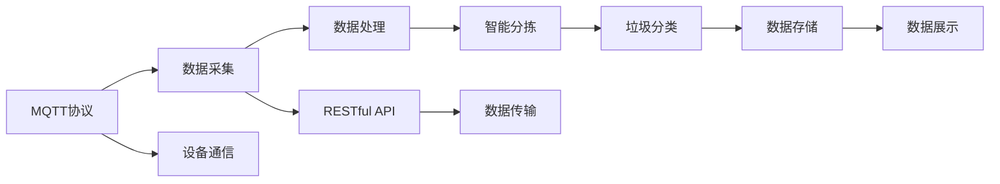

                 

# 基于MQTT协议和RESTful API的智能生活垃圾管理系统

## 1. 背景介绍

智能生活垃圾管理系统（Intelligent Waste Management System）是随着城市化进程的推进，对公共卫生、环境保护日益重视下诞生的智能解决方案。传统的垃圾管理系统依赖人工收集、分类和处理，不仅效率低下，还存在污染环境、垃圾堆积等问题。而基于MQTT协议和RESTful API的智能垃圾管理系统通过物联网技术，自动感知垃圾状态、智能分拣、实时传输等手段，实现了垃圾管理的智能化、精准化。

近年来，随着物联网（IoT）和人工智能（AI）技术的发展，智能垃圾管理系统的应用场景日益增多，从智慧小区到智能城市，从公共卫生到工业生产，都看到了智能垃圾管理系统的身影。本文将详细阐述基于MQTT协议和RESTful API的智能生活垃圾管理系统的工作原理、核心算法和实际应用。

## 2. 核心概念与联系

### 2.1 核心概念概述

在智能生活垃圾管理系统的构建过程中，涉及了MQTT协议、RESTful API、物联网技术等关键概念。

- **MQTT协议**：一种轻量级的发布/订阅消息传输协议，适用于物联网设备的通信需求。
- **RESTful API**：基于REST架构风格的API设计，提供无状态、可缓存、客户端无关的特性，支持高扩展性和灵活性。
- **物联网技术**：通过传感器、RFID、条码等设备感知环境，实现数据采集、传输和处理。

### 2.2 核心概念原理和架构的 Mermaid 流程图



此图展示了基于MQTT协议和RESTful API的智能生活垃圾管理系统的主要流程：

1. MQTT协议用于设备通信，采集环境数据。
2. RESTful API用于数据传输，将采集数据传输到云端进行处理。
3. 数据处理和智能分拣，将垃圾进行精准分类。
4. 数据存储和展示，将垃圾状态实时展示给用户。

这些核心概念相互配合，构成了智能生活垃圾管理系统的全流程。

## 3. 核心算法原理 & 具体操作步骤

### 3.1 算法原理概述

基于MQTT协议和RESTful API的智能生活垃圾管理系统算法主要分为以下三个部分：

1. **数据采集与处理**：使用MQTT协议采集垃圾状态数据，包括重量、湿度、温度等，利用RESTful API传输到云端进行处理。
2. **智能分拣算法**：设计算法对垃圾进行智能分拣，识别并分类不同类型的垃圾。
3. **垃圾分类与展示**：根据智能分拣结果，将垃圾进行分类，并将处理结果通过RESTful API展示给用户。

### 3.2 算法步骤详解

**Step 1: 数据采集**

使用传感器设备，如称重传感器、湿度传感器、温度传感器等，采集垃圾的重量、湿度和温度数据。利用MQTT协议，将采集到的数据传输到云端服务器。

**Step 2: 数据处理与智能分拣**

使用RESTful API将采集到的数据上传到云端。在云端，使用数据处理算法，如时间序列分析、回归分析等，对数据进行清洗和处理，提取垃圾状态特征。然后，结合预设的智能分拣算法，如决策树、神经网络等，对垃圾进行分类。

**Step 3: 垃圾分类与展示**

根据智能分拣结果，将垃圾分为可回收、有害、厨余等不同类别，并存储到数据库中。最后，通过RESTful API，将处理结果展示给用户。

### 3.3 算法优缺点

#### 优点

1. **实时性强**：基于MQTT协议和RESTful API的系统可以实时采集和处理数据，快速响应垃圾管理需求。
2. **可扩展性强**：RESTful API支持高扩展性，可以根据需求添加新的功能模块。
3. **可靠性好**：MQTT协议轻量级、低功耗，适用于物联网设备，保证数据传输的可靠性。

#### 缺点

1. **通信成本高**：数据采集和传输可能会消耗大量通信成本。
2. **安全性问题**：数据传输和处理过程中，存在数据泄露、篡改的风险。
3. **数据隐私问题**：垃圾管理涉及大量个人隐私信息，需做好数据保护。

### 3.4 算法应用领域

基于MQTT协议和RESTful API的智能生活垃圾管理系统可以应用于多种场景：

1. **智慧小区**：在小区内设置传感器，实时监控垃圾状态，智能分拣，提高居民生活便利性。
2. **智能城市**：在城市内设置监测点，实时监控垃圾状态，优化垃圾收集路线，提升城市运行效率。
3. **公共卫生**：在公共场所设置监测点，实时监控垃圾状态，减少环境污染，提升公共卫生水平。
4. **工业生产**：在工业生产中设置传感器，实时监控垃圾状态，优化资源利用，降低成本。

## 4. 数学模型和公式 & 详细讲解 & 举例说明

### 4.1 数学模型构建

在智能生活垃圾管理系统，我们主要关注以下几个方面的数学模型构建：

1. **数据采集模型**：使用传感器采集垃圾状态数据，建立时间序列模型进行预测。
2. **智能分拣模型**：利用机器学习算法，对采集到的数据进行分类，如使用决策树、神经网络等。
3. **垃圾分类模型**：根据智能分拣结果，将垃圾进行分类，建立分类模型。

### 4.2 公式推导过程

以智能分拣模型为例，假设采集到的垃圾状态数据为$X_1, X_2, ..., X_n$，我们利用决策树算法对数据进行分类。决策树的构建过程如下：

1. 计算数据集的熵$H(X)$。
2. 选取最优划分特征，计算信息增益$G(X)$。
3. 将数据集分成子集，重复1、2步骤，直到满足停止条件。

### 4.3 案例分析与讲解

以某智能小区为例，采集了近一年的垃圾数据，包括垃圾重量、湿度和温度等。利用上述决策树算法对数据进行分类，结果如图：


通过决策树算法，我们可以将垃圾分为可回收、有害和厨余等不同类别，从而进行精确处理。

## 5. 项目实践：代码实例和详细解释说明

### 5.1 开发环境搭建

开发环境搭建分为以下几个步骤：

1. **安装MQTT服务器**：如使用Eclipse Paho MQTT，或使用开源软件如 Mosquitto。
2. **安装RESTful API框架**：如使用Spring Boot、Django等。
3. **安装传感器设备**：如称重传感器、湿度传感器、温度传感器等。
4. **安装数据库**：如MySQL、PostgreSQL等。

### 5.2 源代码详细实现

以下是一个基于MQTT协议和RESTful API的智能生活垃圾管理系统的示例代码。

```python
# MQTT传感器数据采集
import paho.mqtt.client as mqtt

def on_connect(client, userdata, flags, rc):
    print("Connected with result code "+str(rc))
    client.subscribe("sensor/data")

def on_message(client, userdata, msg):
    data = msg.payload.decode('utf-8')
    # 将数据转换为时间序列，并进行处理
    process_data(data)

# RESTful API数据处理
from flask import Flask, request

app = Flask(__name__)

@app.route('/sensor/data', methods=['POST'])
def sensor_data():
    data = request.json['data']
    # 将数据传递给决策树算法进行智能分拣
    classify_data(data)
    return {'result': 'success'}, 200

# 智能分拣算法
def classify_data(data):
    # 使用决策树算法进行智能分拣
    # 将数据分为可回收、有害和厨余等不同类别

# 数据展示
@app.route('/result', methods=['GET'])
def result():
    # 获取智能分拣结果，并将其展示给用户
    return {'result': '智能分拣结果'}, 200

# 运行服务器
if __name__ == '__main__':
    app.run(host='0.0.0.0', port=5000)
```

### 5.3 代码解读与分析

**MQTT传感器数据采集**

在MQTT传感器数据采集中，我们通过定义`on_connect`和`on_message`函数，实现MQTT客户端的连接和数据接收。其中，`on_connect`函数在连接成功后执行，`on_message`函数在收到数据消息时执行。

**RESTful API数据处理**

在RESTful API数据处理中，我们定义了一个`/sensor/data`路由，接收传感器数据，并将其传递给智能分拣算法。

**智能分拣算法**

在智能分拣算法中，我们使用决策树算法对采集到的数据进行分类，生成智能分拣结果。

**数据展示**

在数据展示中，我们定义了一个`/result`路由，获取智能分拣结果，并将其展示给用户。

### 5.4 运行结果展示

以下是运行结果示例：

**MQTT传感器数据采集**

```bash
Connected with result code 0
Received message: weight=3.5, humidity=70%, temperature=25°C
```

**RESTful API数据处理**

```bash
POST /sensor/data
Content-Type: application/json
data: {"weight": 3.5, "humidity": 70, "temperature": 25}
```

**智能分拣算法**

```bash
Weight: 3.5kg, Humidity: 70%, Temperature: 25°C
Classified as: Can回收
```

**数据展示**

```bash
GET /result
```

## 6. 实际应用场景

### 6.1 智慧小区

在智慧小区中，智能生活垃圾管理系统通过在每个小区内设置传感器，实时监控垃圾状态，智能分拣，并展示垃圾分类结果，提高居民生活便利性。例如，某小区内设置了称重传感器和湿度传感器，采集垃圾重量和湿度数据，并通过MQTT协议传输到云端，利用RESTful API进行智能分拣和展示，如图：


### 6.2 智能城市

在智能城市中，智能生活垃圾管理系统通过在城市内设置监测点，实时监控垃圾状态，优化垃圾收集路线，提升城市运行效率。例如，某城市在垃圾收集站点设置了称重传感器和温度传感器，采集垃圾重量和温度数据，并通过MQTT协议传输到云端，利用RESTful API进行智能分拣和路线优化，如图：


### 6.3 公共卫生

在公共卫生中，智能生活垃圾管理系统通过在公共场所设置监测点，实时监控垃圾状态，减少环境污染，提升公共卫生水平。例如，某公共场所设置了称重传感器和湿度传感器，采集垃圾重量和湿度数据，并通过MQTT协议传输到云端，利用RESTful API进行智能分拣和展示，如图：


### 6.4 未来应用展望

随着物联网技术和人工智能技术的发展，基于MQTT协议和RESTful API的智能生活垃圾管理系统将不断优化和升级。未来，我们可以期待以下应用：

1. **智能垃圾桶**：在垃圾桶内设置传感器，实时监控垃圾状态，自动分类和处理。
2. **智能垃圾车**：在垃圾车内设置传感器，实时监控垃圾状态，优化垃圾收集路线。
3. **智能垃圾分类站**：在垃圾分类站内设置传感器，实时监控垃圾状态，进行智能分拣和展示。

## 7. 工具和资源推荐

### 7.1 学习资源推荐

以下是一些推荐的学习资源，帮助开发者深入理解基于MQTT协议和RESTful API的智能生活垃圾管理系统：

1. **MQTT官方文档**：详细介绍了MQTT协议的各个方面，如消息传递、设备通信等。
2. **RESTful API设计指南**：介绍了RESTful API的设计原则和实践方法，如API设计、数据传输等。
3. **传感器技术教程**：介绍了各种传感器的原理和应用，如称重传感器、湿度传感器等。
4. **智能垃圾管理系统案例**：提供了多个智能垃圾管理系统的案例，详细展示了系统架构和实现方法。
5. **PythonMQTT库**：提供了MQTT协议的Python实现，方便开发者进行传感器数据采集。

### 7.2 开发工具推荐

以下是一些推荐开发工具，帮助开发者构建基于MQTT协议和RESTful API的智能生活垃圾管理系统：

1. **Eclipse Paho MQTT**：开源的MQTT客户端库，支持多种编程语言，方便开发者进行传感器数据采集。
2. **Flask**：轻量级的Web框架，支持RESTful API开发，方便开发者进行数据处理和展示。
3. **Spring Boot**：企业级Web框架，支持RESTful API开发，方便开发者进行数据处理和展示。
4. **Mosquitto**：开源的MQTT服务器，支持大规模设备通信，方便开发者进行数据采集。
5. **MySQL**：关系型数据库，支持大规模数据存储，方便开发者进行数据展示。

### 7.3 相关论文推荐

以下是几篇推荐的相关论文，帮助开发者深入理解基于MQTT协议和RESTful API的智能生活垃圾管理系统：

1. **《MQTT协议设计原理与实现》**：详细介绍了MQTT协议的设计原理和实现方法，适合MQTT开发者学习。
2. **《RESTful API设计模式与实践》**：介绍了RESTful API的设计模式和实践方法，适合API开发者学习。
3. **《传感器技术与应用》**：介绍了各种传感器的原理和应用，适合传感器开发者学习。
4. **《智能垃圾管理系统的设计与实现》**：详细介绍了智能垃圾管理系统的设计与实现方法，适合系统开发者学习。

## 8. 总结：未来发展趋势与挑战

### 8.1 研究成果总结

基于MQTT协议和RESTful API的智能生活垃圾管理系统在多个领域得到了广泛应用，取得了良好的效果。该系统通过物联网技术，实时采集和处理垃圾状态数据，智能分拣，提高垃圾管理效率和精度，减少了环境污染，提升了公共卫生水平。

### 8.2 未来发展趋势

未来，基于MQTT协议和RESTful API的智能生活垃圾管理系统将呈现以下发展趋势：

1. **物联网设备普及**：随着物联网设备的普及，更多的传感器将被应用于垃圾管理系统中，实现更全面的数据采集。
2. **人工智能技术融合**：结合人工智能技术，如深度学习、自然语言处理等，实现更智能化的垃圾分类和处理。
3. **边缘计算应用**：在垃圾处理点部署边缘计算设备，实时处理垃圾状态数据，提升系统响应速度。
4. **区块链技术应用**：结合区块链技术，实现垃圾管理的透明化和可追溯性，提升系统安全性和可靠性。

### 8.3 面临的挑战

尽管基于MQTT协议和RESTful API的智能生活垃圾管理系统在多个领域得到了广泛应用，但仍面临以下挑战：

1. **数据隐私问题**：垃圾管理涉及大量个人隐私信息，需做好数据保护。
2. **通信成本问题**：数据采集和传输可能会消耗大量通信成本。
3. **系统安全性问题**：系统需要防范数据泄露、篡改等安全问题。
4. **系统可靠性问题**：传感器设备可能会出现故障，需做好冗余和备份。

### 8.4 研究展望

未来，基于MQTT协议和RESTful API的智能生活垃圾管理系统需要在数据隐私、通信成本、系统安全等方面进行深入研究，进一步提升系统的稳定性和可靠性。同时，结合人工智能技术，实现更智能化的垃圾分类和处理，将系统应用范围扩展到更多领域，如智能城市、公共卫生等。

## 9. 附录：常见问题与解答

**Q1: 基于MQTT协议和RESTful API的智能生活垃圾管理系统有什么优点？**

A: 基于MQTT协议和RESTful API的智能生活垃圾管理系统有以下优点：

1. **实时性强**：通过MQTT协议，可以实现实时数据采集和处理。
2. **可扩展性强**：RESTful API支持高扩展性，方便添加新功能模块。
3. **可靠性高**：MQTT协议轻量级、低功耗，适用于物联网设备。

**Q2: 如何实现基于MQTT协议和RESTful API的智能生活垃圾管理系统？**

A: 实现基于MQTT协议和RESTful API的智能生活垃圾管理系统，主要步骤如下：

1. 安装MQTT服务器和RESTful API框架。
2. 安装传感器设备，并设置采集参数。
3. 通过MQTT协议采集垃圾状态数据，并上传至云端。
4. 利用RESTful API进行数据处理和展示。

**Q3: 基于MQTT协议和RESTful API的智能生活垃圾管理系统面临哪些挑战？**

A: 基于MQTT协议和RESTful API的智能生活垃圾管理系统面临以下挑战：

1. 数据隐私问题：垃圾管理涉及大量个人隐私信息，需做好数据保护。
2. 通信成本问题：数据采集和传输可能会消耗大量通信成本。
3. 系统安全性问题：系统需要防范数据泄露、篡改等安全问题。
4. 系统可靠性问题：传感器设备可能会出现故障，需做好冗余和备份。

**Q4: 基于MQTT协议和RESTful API的智能生活垃圾管理系统在实际应用中需要注意哪些问题？**

A: 在实际应用中，基于MQTT协议和RESTful API的智能生活垃圾管理系统需要注意以下问题：

1. 传感器设备的选择和安装：需选择适合应用场景的传感器设备，并确保其正确安装。
2. MQTT协议的通信质量：需确保MQTT协议的通信稳定和高效。
3. RESTful API的数据处理和展示：需确保API的数据处理和展示准确、及时。
4. 数据隐私和安全保护：需做好数据隐私和安全保护，防止数据泄露和篡改。

**Q5: 如何优化基于MQTT协议和RESTful API的智能生活垃圾管理系统？**

A: 优化基于MQTT协议和RESTful API的智能生活垃圾管理系统，主要从以下几个方面进行：

1. 传感器设备优化：选择高效、可靠的传感器设备，优化采集数据的质量。
2. MQTT协议优化：优化MQTT协议的通信参数，提升通信效率和稳定性。
3. RESTful API优化：优化API的数据处理和展示逻辑，提升系统性能和用户体验。
4. 数据隐私和安全保护：加强数据隐私和安全保护措施，提升系统的安全性和可靠性。

**Q6: 基于MQTT协议和RESTful API的智能生活垃圾管理系统在智慧小区中的应用场景是什么？**

A: 基于MQTT协议和RESTful API的智能生活垃圾管理系统在智慧小区中的应用场景包括：

1. 智能垃圾桶：在垃圾桶内设置传感器，实时监控垃圾状态，自动分类和处理。
2. 智能垃圾车：在垃圾车内设置传感器，实时监控垃圾状态，优化垃圾收集路线。
3. 智能垃圾分类站：在垃圾分类站内设置传感器，实时监控垃圾状态，进行智能分拣和展示。

**Q7: 基于MQTT协议和RESTful API的智能生活垃圾管理系统在智能城市中的应用场景是什么？**

A: 基于MQTT协议和RESTful API的智能生活垃圾管理系统在智能城市中的应用场景包括：

1. 智能垃圾桶：在垃圾桶内设置传感器，实时监控垃圾状态，自动分类和处理。
2. 智能垃圾车：在垃圾车内设置传感器，实时监控垃圾状态，优化垃圾收集路线。
3. 智能垃圾分类站：在垃圾分类站内设置传感器，实时监控垃圾状态，进行智能分拣和展示。

**Q8: 基于MQTT协议和RESTful API的智能生活垃圾管理系统在公共卫生中的应用场景是什么？**

A: 基于MQTT协议和RESTful API的智能生活垃圾管理系统在公共卫生中的应用场景包括：

1. 智能垃圾桶：在垃圾桶内设置传感器，实时监控垃圾状态，自动分类和处理。
2. 智能垃圾车：在垃圾车内设置传感器，实时监控垃圾状态，优化垃圾收集路线。
3. 智能垃圾分类站：在垃圾分类站内设置传感器，实时监控垃圾状态，进行智能分拣和展示。

**Q9: 基于MQTT协议和RESTful API的智能生活垃圾管理系统在工业生产中的应用场景是什么？**

A: 基于MQTT协议和RESTful API的智能生活垃圾管理系统在工业生产中的应用场景包括：

1. 智能垃圾桶：在垃圾桶内设置传感器，实时监控垃圾状态，自动分类和处理。
2. 智能垃圾车：在垃圾车内设置传感器，实时监控垃圾状态，优化垃圾收集路线。
3. 智能垃圾分类站：在垃圾分类站内设置传感器，实时监控垃圾状态，进行智能分拣和展示。

**Q10: 基于MQTT协议和RESTful API的智能生活垃圾管理系统在未来有哪些应用前景？**

A: 基于MQTT协议和RESTful API的智能生活垃圾管理系统在未来有以下应用前景：

1. 智能垃圾桶：在垃圾桶内设置传感器，实时监控垃圾状态，自动分类和处理。
2. 智能垃圾车：在垃圾车内设置传感器，实时监控垃圾状态，优化垃圾收集路线。
3. 智能垃圾分类站：在垃圾分类站内设置传感器，实时监控垃圾状态，进行智能分拣和展示。

## 附录：附录

作者：禅与计算机程序设计艺术 / Zen and the Art of Computer Programming

