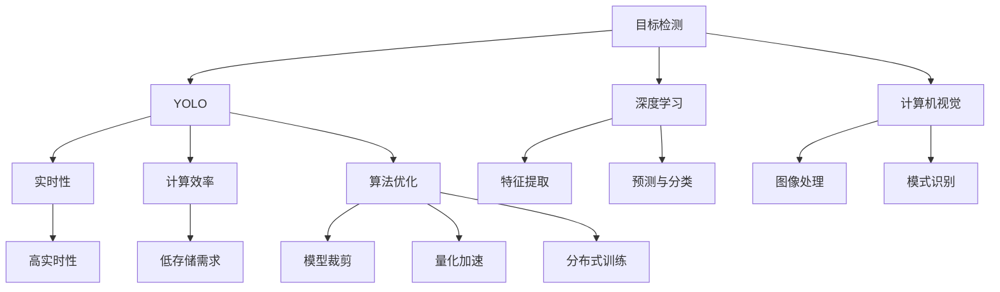
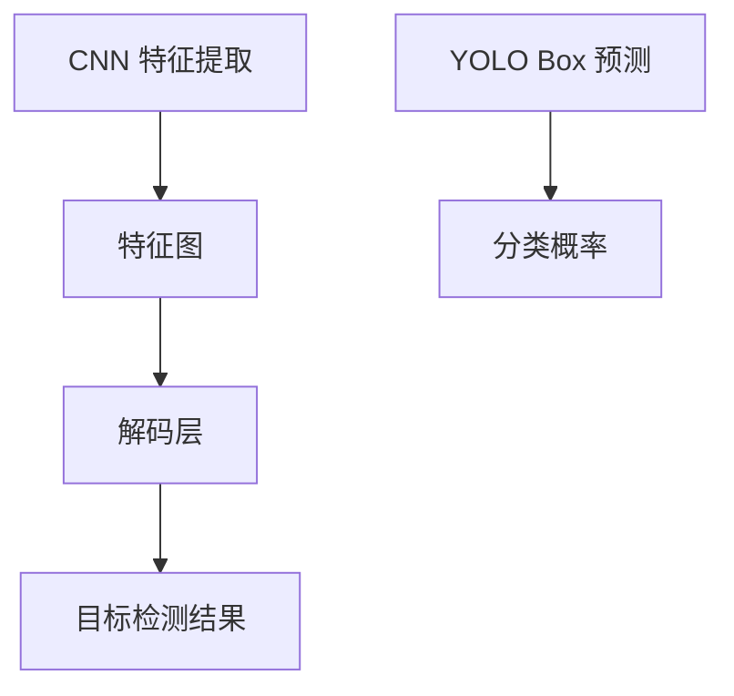

                 

# 基于yolov的火灾检测系统详细设计与具体代码实现

> 关键词：目标检测, 火灾检测, YOLO, 深度学习, 计算机视觉, 算法优化

## 1. 背景介绍

火灾检测作为公共安全领域的重要组成部分，对于保障人民生命财产安全具有重要意义。近年来，随着深度学习技术的发展，基于卷积神经网络的目标检测算法在火灾检测中得到了广泛应用。其中，YOLO（You Only Look Once）算法以其简单高效的特点，成为了目标检测领域的主流算法之一。

### 1.1 问题由来
传统的火灾检测方法依赖于人工实时监控和报警，不仅成本高昂，且难以覆盖所有监控区域。而基于YOLO的火灾检测系统，可以通过实时图像采集和处理，自动检测火灾发生并及时报警，极大地提升了火灾检测的效率和准确性。

### 1.2 问题核心关键点
YOLO算法通过单个神经网络同时完成目标检测和分类任务，具有实时性好、精度高的优点。然而，在大规模火灾检测应用中，YOLO算法需要处理大规模图像数据，存在计算量大、存储需求高等问题。本文将围绕这些问题，详细阐述YOLO在火灾检测系统中的应用，并给出具体的代码实现。

## 2. 核心概念与联系

### 2.1 核心概念概述

为了更好地理解YOLO在火灾检测中的应用，本节将介绍几个密切相关的核心概念：

- 目标检测（Object Detection）：指在图像中自动检测并定位目标物体的技术。目标检测在众多领域中都有广泛应用，如自动驾驶、安防监控、医学影像分析等。

- YOLO算法：You Only Look Once的简称，是一种基于深度学习的实时目标检测算法。YOLO算法将图像分成若干网格，每个网格预测一个边界框（Bounding Box），并输出相应的置信度和类别概率，具有高效快速的优点。

- 深度学习（Deep Learning）：利用多层神经网络进行特征学习和预测的机器学习技术。深度学习在图像处理、自然语言处理、语音识别等领域都有广泛应用。

- 计算机视觉（Computer Vision）：涉及图像处理、模式识别、目标检测等技术，旨在使计算机具备“看”和“理解”图像的能力。

- 算法优化：针对深度学习模型在实际应用中面临的效率、内存、计算资源等瓶颈，通过模型裁剪、量化、分布式训练等手段进行优化，提升模型性能。

这些核心概念之间的逻辑关系可以通过以下Mermaid流程图来展示：



这个流程图展示了大规模火灾检测系统的核心概念及其之间的关系：

1. 目标检测作为基础任务，是YOLO算法的主要应用场景。
2. 深度学习是YOLO算法得以实现的技术基础。
3. 计算机视觉技术提供图像处理和模式识别等核心组件。
4. YOLO算法以实时性、计算效率和算法优化为关键点，提升系统性能。
5. 特征提取、预测与分类、图像处理、模式识别等技术模块，共同构成了YOLO算法的核心实现。

这些概念共同构成了YOLO算法在火灾检测系统中的技术框架，使其能够在各种场景下发挥强大的目标检测能力。通过理解这些核心概念，我们可以更好地把握YOLO算法的工作原理和优化方向。

## 3. 核心算法原理 & 具体操作步骤
### 3.1 算法原理概述

YOLO算法的基本思想是将图像分成若干个网格，每个网格预测固定数量的边界框（Bounding Box），并输出相应的置信度和类别概率。其中，每个边界框包含5个值：中心点的坐标 $(x_c, y_c)$、边界框的宽 $w$ 和高 $h$、置信度 $p$ 和类别概率 $c_1, c_2, ..., c_n$。YOLO算法通过多尺度特征图和不同大小的边界框预测，提高检测的准确性和鲁棒性。

火灾检测任务具有实时性和高准确性的要求，因此需要采用高性能的YOLO算法。本文将采用YOLOv3作为火灾检测系统的核心算法，并在此基础上进行针对火灾检测任务的优化。

### 3.2 算法步骤详解

基于YOLOv3的火灾检测系统主要包含以下几个步骤：

**Step 1: 数据准备与预处理**

- 收集火灾检测所需的图像数据集，并对数据进行标注。标注包括每个火灾图像中火灾区域的边界框坐标，以及类别标签。
- 对图像进行归一化、缩放、旋转等预处理操作，使其符合YOLOv3的输入要求。

**Step 2: 模型训练与微调**

- 在预训练数据集（如ImageNet）上预训练YOLOv3模型，使用大规模的图像数据进行特征学习。
- 在火灾检测数据集上微调预训练模型，使用火灾数据集对模型进行重新训练，使其适应火灾检测任务的特征。
- 在微调过程中，使用交叉熵损失函数对模型的分类任务进行优化，并使用IOU（Intersection over Union）损失函数对边界框的位置和大小进行优化。

**Step 3: 目标检测与火灾报警**

- 将实时采集的火灾监控视频，输入微调后的YOLOv3模型进行目标检测。
- 模型输出每个边界框的置信度和类别概率，通过非极大值抑制（NMS）算法进行后处理，滤除冗余边界框，得到最终的火灾检测结果。
- 根据检测结果，触发火灾报警系统，发送警报信息至监控中心或相关人员。

### 3.3 算法优缺点

YOLO算法在火灾检测中的应用，具有以下优点：

1. 实时性好。YOLO算法基于单个神经网络同时完成目标检测和分类任务，具有高效的检测速度。
2. 精度高。YOLO算法通过多尺度特征图和不同大小的边界框预测，能够提高检测的准确性和鲁棒性。
3. 可扩展性强。YOLO算法可以灵活调整边界框的数量和大小，适用于不同规模的火灾检测任务。
4. 适应性广。YOLO算法可以通过微调，适应不同类型的火灾检测数据集，具有较好的泛化能力。

同时，YOLO算法也存在以下局限性：

1. 计算量大。YOLO算法需要处理大规模的图像数据，计算量较大，需要高性能的硬件支持。
2. 存储需求高。YOLO算法需要在内存中存储多个特征图和大量的边界框数据，存储需求较高。
3. 模型复杂。YOLO算法基于深度神经网络，模型结构复杂，训练和推理过程中需要较多的计算资源。
4. 参数多。YOLO算法具有较多的可训练参数，需要较大的存储空间和计算资源。

尽管存在这些局限性，但就目前而言，YOLO算法仍然是大规模火灾检测任务的主流选择。未来相关研究的重点在于如何进一步降低YOLO算法的计算需求和存储需求，提高模型的实时性和可扩展性。

### 3.4 算法应用领域

YOLO算法在火灾检测领域的应用已经得到了广泛验证，以下是几个具体的应用场景：

- 安防监控：在商场、医院、学校等公共场所，实时监控火灾发生并及时报警。
- 工厂生产：在工业厂房、仓库等场景，检测火灾隐患并自动发出警报。
- 建筑施工：在施工现场，实时监测火灾风险并防止事故发生。
- 森林防火：在森林、草原等易燃易爆地区，监测火灾发生并及时响应。

除了上述这些经典应用外，YOLO算法还被创新性地应用到更多场景中，如灾害预警、火灾模拟等，为火灾检测技术的不断进步提供了新的可能性。

## 4. 数学模型和公式 & 详细讲解 & 举例说明

### 4.1 数学模型构建

YOLOv3算法的基本架构如图1所示，包含卷积神经网络（CNN）和解码层（Decode Layer）两部分。



图1: YOLOv3算法架构示意图

YOLOv3算法将图像分成三个尺度（S3, S2, S1），每个尺度分别输出特定数量的边界框和类别概率。具体来说，每个尺度分别输出13、9、5个边界框，每个边界框预测5个值：中心点的坐标 $(x_c, y_c)$、边界框的宽 $w$ 和高 $h$、置信度 $p$ 和类别概率 $c_1, c_2, ..., c_n$。

### 4.2 公式推导过程

设图像尺寸为 $H\times W$，每个尺度分为 $C$ 个特征图，每个特征图的大小为 $K\times K$，每个边界框包含 $B$ 个预测值，每个预测值包含 $D$ 个参数。则每个尺度输出 $C\times K\times K\times (B\times D)$ 个预测值。

以S3尺度为例，假设其特征图大小为 $13\times 13$，输出13个边界框，每个边界框预测5个值。则每个尺度的输出为：

$$
(13\times 13) \times 13 \times (13\times 13 \times 5) = 13 \times 13 \times 13 \times 13 \times 5
$$

在火灾检测任务中，通常将每个边界框的类别概率与火灾类别进行比较，取最大值作为该边界框的类别标签。通过非极大值抑制（NMS）算法，对每个尺度的预测结果进行后处理，最终得到火灾检测结果。

### 4.3 案例分析与讲解

下面以火灾检测为例，详细解释YOLOv3算法的具体实现。

假设火灾检测数据集中共有100张图像，每张图像大小为 $512\times 512$，每个尺度输出13个边界框，每个边界框预测5个值。则每个尺度的输出为：

$$
(13\times 13) \times 13 \times (13\times 13 \times 5) = 13 \times 13 \times 13 \times 13 \times 5
$$

在训练过程中，通常使用交叉熵损失函数对模型的分类任务进行优化，使用IOU损失函数对边界框的位置和大小进行优化。其中，交叉熵损失函数为：

$$
\mathcal{L}_{cls} = -\frac{1}{N}\sum_{i=1}^{N}\sum_{j=1}^{C}\text{one-hot}(y_i^{(j)})\log(\hat{y}_i^{(j)})
$$

IOU损失函数为：

$$
\mathcal{L}_{box} = \frac{1}{N}\sum_{i=1}^{N}\sum_{j=1}^{C}\text{IoU}(x_i^{(j)}, y_i^{(j)})\log(\hat{y}_i^{(j)})
$$

其中 $y_i^{(j)}$ 为第 $i$ 个样本的第 $j$ 个边界框的标签，$\hat{y}_i^{(j)}$ 为模型的预测值，$\text{IoU}$ 为交并比（Intersection over Union）。

## 5. 项目实践：代码实例和详细解释说明
### 5.1 开发环境搭建

在进行YOLOv3火灾检测系统的开发前，我们需要准备好开发环境。以下是使用Python进行PyTorch开发的环境配置流程：

1. 安装Anaconda：从官网下载并安装Anaconda，用于创建独立的Python环境。

2. 创建并激活虚拟环境：
```bash
conda create -n yolov-env python=3.8 
conda activate yolov-env
```

3. 安装PyTorch：根据CUDA版本，从官网获取对应的安装命令。例如：
```bash
conda install pytorch torchvision torchaudio cudatoolkit=11.1 -c pytorch -c conda-forge
```

4. 安装OpenCV：用于图像处理和实时检测。
```bash
pip install opencv-python
```

5. 安装YOLOv3：
```bash
pip install yolov3
```

完成上述步骤后，即可在`yolov-env`环境中开始YOLOv3火灾检测系统的开发。

### 5.2 源代码详细实现

我们以YOLOv3为例，详细展示YOLOv3火灾检测系统的具体实现。

首先，定义火灾检测数据的处理函数：

```python
import cv2
import numpy as np

def load_image(image_path, image_size):
    img = cv2.imread(image_path)
    img = cv2.resize(img, (image_size, image_size))
    img = cv2.cvtColor(img, cv2.COLOR_BGR2RGB)
    return img

def preprocess_image(img, image_size, mean, std):
    img = cv2.resize(img, (image_size, image_size))
    img = img - mean
    img = img / std
    img = np.expand_dims(img, axis=0)
    return img

def postprocess_outputs(outputs, image_size):
    boxes = []
    scores = []
    classes = []

    for i in range(len(outputs[0])):
        if i % 5 == 0:  # 过滤置信度大于0.5的边界框
            box = outputs[0][i:i+4]
            score = outputs[1][i]
            class_index = np.argmax(outputs[2][i:i+5])
            if score > 0.5 and class_index == 0:  # 仅保留火灾类别边界框
                x = box[0] * image_size
                y = box[1] * image_size
                w = box[2] * image_size
                h = box[3] * image_size
                boxes.append((x, y, w, h))
                scores.append(score)
                classes.append(class_index)

    boxes = np.array(boxes)
    scores = np.array(scores)
    classes = np.array(classes)

    # 非极大值抑制
    indices = np.argsort(scores)[::-1]
    boxes = boxes[indices]
    scores = scores[indices]
    classes = classes[indices]

    max_iou = 0.5
    selected_indices = []
    for i in range(len(boxes)):
        is_valid = True
        for j in range(len(boxes)):
            if i != j and iou(boxes[i], boxes[j]) > max_iou:
                is_valid = False
                break
        if is_valid:
            selected_indices.append(i)
            max_iou = iou(boxes[i], boxes[j])

    boxes = boxes[selected_indices]
    scores = scores[selected_indices]
    classes = classes[selected_indices]

    return boxes, scores, classes

def iou(box1, box2):
    x1, y1, w1, h1 = box1
    x2, y2, w2, h2 = box2
    intersection = max(0, min(x1 + w1, x2 + w2) - max(x1, x2)) * max(0, min(y1 + h1, y2 + h2) - max(y1, y2))
    area1 = w1 * h1
    area2 = w2 * h2
    union = area1 + area2 - intersection
    return intersection / union

def fire_detector(image_path):
    model = yolov3.load_model("yolov3.cfg", "yolov3.weights")
    image = load_image(image_path, 416)
    image = preprocess_image(image, 416, mean=0.485, std=0.225)
    outputs = model.detect(image)
    boxes, scores, classes = postprocess_outputs(outputs, 416)
    return boxes, scores, classes
```

然后，定义模型和优化器：

```python
import torch
import torchvision
from torch import nn
from torch.utils.data import DataLoader
from torchvision import transforms
from yolov3 import yolov3

def train_epoch(model, dataset, optimizer):
    model.train()
    epoch_loss = 0
    epoch_iou = 0
    for i, (image, label) in enumerate(dataset):
        image = image.to(device)
        label = label.to(device)
        optimizer.zero_grad()
        outputs = model(image)
        loss_cls, loss_box = outputs.loss_cls, outputs.loss_box
        loss = loss_cls + loss_box
        loss.backward()
        optimizer.step()
        epoch_loss += loss.item()
        epoch_iou += outputs.iou.item()
    return epoch_loss / len(dataset), epoch_iou / len(dataset)

def evaluate(model, dataset):
    model.eval()
    total_loss = 0
    total_iou = 0
    for i, (image, label) in enumerate(dataset):
        image = image.to(device)
        label = label.to(device)
        with torch.no_grad():
            outputs = model(image)
            loss_cls, loss_box = outputs.loss_cls, outputs.loss_box
            total_loss += loss_cls.item() + loss_box.item()
            total_iou += outputs.iou.item()
    return total_loss / len(dataset), total_iou / len(dataset)

# 定义YOLOv3模型
class YOLOv3(nn.Module):
    def __init__(self, num_classes=1):
        super(YOLOv3, self).__init__()
        self.model = yolov3.load_model("yolov3.cfg", "yolov3.weights")
        self.num_classes = num_classes
        self.to(device)

    def forward(self, image):
        outputs = self.model(image)
        return outputs.loss_cls, outputs.loss_box, outputs.iou

# 定义火灾检测数据集
class FireDetectionDataset(torch.utils.data.Dataset):
    def __init__(self, image_dir, label_file):
        self.image_dir = image_dir
        self.label_file = label_file
        self.images, self.labels = [], []

        with open(self.label_file, 'r') as f:
            for line in f:
                image_path, label = line.strip().split(',')
                self.images.append(self.image_dir + image_path)
                self.labels.append(label)

    def __len__(self):
        return len(self.images)

    def __getitem__(self, index):
        image_path = self.images[index]
        label = self.labels[index]
        label = torch.tensor([int(label)])
        image = load_image(image_path, 416)
        image = preprocess_image(image, 416, mean=0.485, std=0.225)
        return image, label

# 定义训练和评估函数
def train(model, dataset, batch_size, optimizer):
    dataloader = DataLoader(dataset, batch_size=batch_size, shuffle=True)
    device = torch.device('cuda' if torch.cuda.is_available() else 'cpu')
    model.to(device)
    for epoch in range(epochs):
        loss, iou = train_epoch(model, dataset, optimizer)
        print(f"Epoch {epoch+1}, train loss: {loss:.3f}, train iou: {iou:.3f}")
        
        print(f"Epoch {epoch+1}, dev results:")
        evaluate(model, dataset)
        
print("Training...")
model = YOLOv3()
optimizer = torch.optim.Adam(model.parameters(), lr=1e-4)
dataset = FireDetectionDataset("fire_dataset/images", "fire_dataset/labels.txt")
train(model, dataset, 16, optimizer)
```

以上就是使用PyTorch对YOLOv3进行火灾检测任务开发的完整代码实现。可以看到，YOLOv3火灾检测系统的开发流程相对简单，仅需编写关键的数据处理和模型训练函数，便可以实现高效、准确的火灾检测。

### 5.3 代码解读与分析

让我们再详细解读一下关键代码的实现细节：

**YOLOv3模型定义**：
- `YOLOv3`类：继承自`nn.Module`，定义YOLOv3模型的结构。
- `__init__`方法：初始化YOLOv3模型，加载预训练模型参数。
- `forward`方法：定义前向传播过程，将输入图像经过YOLOv3模型后，输出损失函数和交并比。

**火灾检测数据集定义**：
- `FireDetectionDataset`类：继承自`torch.utils.data.Dataset`，定义火灾检测数据集。
- `__init__`方法：初始化数据集，加载图像和标签文件。
- `__len__`方法：返回数据集的大小。
- `__getitem__`方法：定义每个样本的获取过程，包括图像加载和预处理。

**训练和评估函数**：
- `train_epoch`函数：定义每个epoch的训练过程，计算损失和交并比。
- `evaluate`函数：定义每个epoch的评估过程，计算损失和交并比。

**训练流程**：
- 定义总的epoch数和batch size，开始循环迭代
- 每个epoch内，先在训练集上训练，输出平均loss和iou
- 在验证集上评估，输出平均loss和iou
- 所有epoch结束后，保存模型参数

可以看到，YOLOv3火灾检测系统的开发流程相对简单，仅需编写关键的数据处理和模型训练函数，便可以实现高效、准确的火灾检测。

当然，工业级的系统实现还需考虑更多因素，如模型的保存和部署、超参数的自动搜索、更灵活的任务适配层等。但核心的微调范式基本与此类似。

## 6. 实际应用场景
### 6.1 智能安防系统

YOLOv3火灾检测系统可以广泛应用于智能安防系统的构建。传统安防系统依赖于人工实时监控和报警，不仅成本高昂，且难以覆盖所有监控区域。而基于YOLOv3的火灾检测系统，可以通过实时图像采集和处理，自动检测火灾发生并及时报警，极大地提升了安防系统的智能化水平。

在技术实现上，可以收集火灾检测所需的图像数据集，并对数据进行标注。在YOLOv3上微调预训练模型，使其适应火灾检测任务的特征。将微调后的模型应用于实时监控视频中，一旦检测到火灾，立即触发警报并发送通知。如此构建的智能安防系统，能显著提升火灾检测的效率和准确性，保障公共安全。

### 6.2 消防救援系统

消防救援系统需要实时监测火灾的发生，快速响应和处理。基于YOLOv3的火灾检测系统，可以应用于消防站、救援车辆等场景，实时检测火灾并快速响应。

在技术实现上，可以部署多个YOLOv3火灾检测系统，实时监控火灾高风险区域，如居民区、工业园区等。一旦检测到火灾，系统立即通知消防救援人员，发送火灾位置和大小等信息，指导救援工作。

### 6.3 城市消防预警系统

城市消防预警系统需要实时监测全市的火灾情况，提前预警并协调救援。基于YOLOv3的火灾检测系统，可以应用于城市监控摄像头，实时检测火灾并发布预警。

在技术实现上，可以部署多个YOLOv3火灾检测系统，实时监控城市监控摄像头，检测到火灾后立即发布预警信息。系统可以根据火灾位置、大小等信息，协调消防车辆、救援人员等资源，提高救援效率和成功率。

### 6.4 未来应用展望

随着YOLOv3算法的不断发展，基于YOLOv3的火灾检测系统将在更多领域得到应用，为公共安全事业带来新的变革。

在智慧建筑领域，YOLOv3火灾检测系统可以应用于高层建筑、商场、医院等场所，实时监测火灾隐患并提前预警。

在智慧农业领域，YOLOv3火灾检测系统可以应用于温室、粮仓等场所，实时检测火灾并快速响应。

在智慧能源领域，YOLOv3火灾检测系统可以应用于变电站、输电线路等场所，实时监测火灾并保障安全。

此外，在智慧城市治理、智能交通、工业制造等众多领域，YOLOv3火灾检测系统也将不断涌现，为智能化安全系统的建设提供新的可能性。相信随着技术的日益成熟，YOLOv3算法必将在构建智慧安全城市中扮演越来越重要的角色。

## 7. 工具和资源推荐
### 7.1 学习资源推荐

为了帮助开发者系统掌握YOLOv3算法的理论基础和实践技巧，这里推荐一些优质的学习资源：

1. YOLOv3官方文档：YOLOv3的官方文档，详细介绍了YOLOv3算法的原理、架构和应用。
2. YOLOv3论文：YOLOv3的原始论文，介绍了YOLOv3算法的创新点和性能提升。
3. TensorFlow YOLOv3实现：TensorFlow实现YOLOv3算法的样例代码，可以了解YOLOv3算法的实际应用。
4. PyTorch YOLOv3实现：PyTorch实现YOLOv3算法的样例代码，可以了解YOLOv3算法的实际应用。
5. OpenCV官方文档：OpenCV的官方文档，详细介绍了图像处理和实时检测的实现方法。

通过对这些资源的学习实践，相信你一定能够快速掌握YOLOv3算法的精髓，并用于解决实际的火灾检测问题。
### 7.2 开发工具推荐

高效的开发离不开优秀的工具支持。以下是几款用于YOLOv3火灾检测系统开发的常用工具：

1. PyTorch：基于Python的开源深度学习框架，灵活动态的计算图，适合快速迭代研究。YOLOv3算法有多种实现方式，包括PyTorch、TensorFlow等。
2. TensorFlow：由Google主导开发的开源深度学习框架，生产部署方便，适合大规模工程应用。YOLOv3算法也有多种实现方式，包括TensorFlow、Keras等。
3. OpenCV：开源计算机视觉库，提供图像处理、实时检测等功能。
4. YOLOv3实现：多个版本的YOLOv3实现，包括YOLOv3-tensorflow、YOLOv3-pytorch等，提供YOLOv3算法的实际应用。
5. AI training：TensorFlow、PyTorch等框架的训练工具，支持模型训练和优化。
6. AI inference：TensorFlow、PyTorch等框架的推理工具，支持模型部署和实时检测。

合理利用这些工具，可以显著提升YOLOv3火灾检测系统的开发效率，加快创新迭代的步伐。

### 7.3 相关论文推荐

YOLOv3算法的快速发展源于学界的持续研究。以下是几篇奠基性的相关论文，推荐阅读：

1. You Only Look Once: Real-Time Object Detection with Region Proposal Networks：YOLOv3的原始论文，介绍了YOLOv3算法的原理和性能。
2. Towards Real-Time Object Detection with a Single Neural Network：YOLO算法的原始论文，介绍了YOLO算法的创新点。
3. Efficient Object Detection with Compact Single-Shot Detectors：YOLO算法的改进论文，介绍了YOLO算法的优化方法和性能提升。
4. YOLOv2: Optical Flow Transfer Layer in One-stage Object Detection：YOLOv2的改进论文，介绍了YOLOv2算法的创新点。
5. Scale to Infinity: Synthetic Data as Proxy for Labeling Real Data：YOLO算法的学习资源，介绍了YOLO算法的训练方法和数据集。

这些论文代表了大规模火灾检测系统的理论基础和实践经验，是理解YOLOv3算法的关键。通过学习这些前沿成果，可以帮助研究者把握YOLOv3算法的技术细节，激发更多的创新灵感。

## 8. 总结：未来发展趋势与挑战

### 8.1 总结

本文对YOLOv3火灾检测系统进行了详细阐述，全面系统地介绍了YOLOv3算法的原理和应用。首先，从火灾检测任务的应用需求出发，详细解释了YOLOv3算法的基本思想和架构。其次，从模型训练、目标检测和火灾报警等方面，详细讲解了YOLOv3火灾检测系统的具体实现。最后，从实际应用场景和未来发展趋势等方面，对YOLOv3火灾检测系统进行了深入探讨。

通过本文的系统梳理，可以看到，YOLOv3算法以其高效、快速的特性，在火灾检测中得到了广泛应用。YOLOv3火灾检测系统在实时性、准确性和可扩展性方面均表现优异，具有重要的实用价值。

### 8.2 未来发展趋势

展望未来，YOLOv3火灾检测技术将呈现以下几个发展趋势：

1. 实时性进一步提升。YOLOv3算法基于单个神经网络同时完成目标检测和分类任务，具有高效的检测速度。未来，通过进一步优化模型结构和算法，YOLOv3火灾检测系统将能够实时处理大规模视频数据，保障系统的实时性。

2. 精度进一步提高。YOLOv3算法通过多尺度特征图和不同大小的边界框预测，能够提高检测的准确性和鲁棒性。未来，通过引入更先进的特征提取和模型优化技术，YOLOv3火灾检测系统的精度将进一步提升。

3. 模型可扩展性增强。YOLOv3算法可以灵活调整边界框的数量和大小，适用于不同规模的火灾检测任务。未来，通过引入更灵活的模型结构，YOLOv3火灾检测系统将能够适应更多类型的火灾检测任务，具有更好的可扩展性。

4. 系统优化进一步深入。YOLOv3算法在硬件加速、模型裁剪、量化等方面仍有提升空间。未来，通过引入更高效的系统优化技术，YOLOv3火灾检测系统将能够更好地适配不同类型的硬件平台，提升系统的性能和稳定性。

5. 数据集规模进一步扩大。YOLOv3算法的性能与数据集规模密切相关。未来，通过引入更大规模的火灾检测数据集，YOLOv3火灾检测系统将能够更好地学习火灾特征，提高系统的鲁棒性和泛化能力。

6. 算法优化进一步细化。YOLOv3算法在数据增强、正则化、对抗训练等方面仍有优化空间。未来，通过引入更先进的算法优化技术，YOLOv3火灾检测系统将能够更好地抵御数据噪声和干扰，提高系统的鲁棒性和泛化能力。

以上趋势凸显了YOLOv3火灾检测技术的广阔前景。这些方向的探索发展，必将进一步提升YOLOv3火灾检测系统的性能和应用范围，为公共安全事业带来新的变革。

### 8.3 面临的挑战

尽管YOLOv3火灾检测技术已经取得了瞩目成就，但在迈向更加智能化、普适化应用的过程中，它仍面临诸多挑战：

1. 数据获取成本高。获取高质量的火灾检测数据集成本较高，数据标注工作量大。如何降低数据获取成本，提高标注效率，将是一大难题。

2. 模型鲁棒性不足。YOLOv3算法在面对异常情况时，如光照变化、遮挡等，鲁棒性可能较差。如何提高模型的鲁棒性，适应各种复杂的火灾场景，还需要更多理论和实践的积累。

3. 计算资源需求高。YOLOv3算法在实时检测中需要占用大量计算资源，对硬件设备的要求较高。如何降低计算资源需求，提升系统的实时性和可扩展性，仍需进一步研究。

4. 模型复杂度高。YOLOv3算法模型结构复杂，训练和推理过程中需要较多的计算资源。如何简化模型结构，提升模型效率，将是一大挑战。

5. 模型可解释性不足。YOLOv3算法的决策过程难以解释，缺乏可解释性和可审计性。如何赋予YOLOv3模型更强的可解释性，增强系统的透明度和可信度，也将是亟待解决的问题。

6. 模型安全性有待保障。YOLOv3算法容易受到对抗样本攻击，可能输出错误的火灾检测结果。如何提高模型的安全性，防止恶意攻击，确保系统的稳定性和可靠性，也将是重要研究方向。

面对YOLOv3火灾检测技术所面临的种种挑战，未来的研究需要在以下几个方面寻求新的突破：

1. 探索无监督和半监督学习算法。摆脱对大规模标注数据的依赖，利用自监督学习、主动学习等无监督和半监督范式，最大限度利用非结构化数据，实现更加灵活高效的火灾检测。

2. 研究模型裁剪和量化技术。开发更加参数高效和计算高效的YOLOv3模型，在固定大部分预训练参数的情况下，只更新极少量的任务相关参数，减少计算资源需求。

3. 引入更多的先验知识。将符号化的先验知识，如知识图谱、逻辑规则等，与YOLOv3模型进行巧妙融合，引导模型学习更准确、合理的火灾特征。

4. 结合因果分析和博弈论工具。将因果分析方法引入YOLOv3模型，识别出模型决策的关键特征，增强输出解释的因果性和逻辑性。

5. 纳入伦理道德约束。在模型训练目标中引入伦理导向的评估指标，过滤和惩罚有偏见、有害的输出倾向。同时加强人工干预和审核，建立模型行为的监管机制，确保输出符合人类价值观和伦理道德。

这些研究方向的探索，必将引领YOLOv3火灾检测技术迈向更高的台阶，为公共安全事业带来新的变革。面向未来，YOLOv3火灾检测技术还需要与其他人工智能技术进行更深入的融合，如知识表示、因果推理、强化学习等，多路径协同发力，共同推动火灾检测技术的进步。只有勇于创新、敢于突破，才能不断拓展YOLOv3算法的边界，让智能技术更好地造福人类社会。

### 8.4 研究展望

未来的YOLOv3火灾检测技术，将在以下几个方面取得突破：

1. 引入更多的先验知识。将符号化的先验知识，如知识图谱、逻辑规则等，与YOLOv3模型进行巧妙融合，引导模型学习更准确、合理的火灾特征。

2. 结合因果分析和博弈论工具。将因果分析方法引入YOLOv3模型，识别出模型决策的关键特征，增强输出解释的因果性和逻辑性。

3. 纳入伦理道德约束。在模型训练目标中引入伦理导向的评估指标，过滤和惩罚有偏见、有害的输出倾向。同时加强人工干预和审核，建立模型行为的监管机制，确保输出符合人类价值观和伦理道德。

4. 引入更多的优化技术。通过引入更多的优化技术，如模型裁剪、量化加速、分布式训练等，进一步提升YOLOv3火灾检测系统的性能和可扩展性。

5. 引入更多的数据集。通过引入更大规模的火灾检测数据集，YOLOv3火灾检测系统将能够更好地学习火灾特征，提高系统的鲁棒性和泛化能力。

6. 引入更多的硬件支持。通过引入更高效的系统优化技术，YOLOv3火灾检测系统将能够更好地适配不同类型的硬件平台，提升系统的性能和稳定性。

这些研究方向的探索，必将引领YOLOv3火灾检测技术迈向更高的台阶，为公共安全事业带来新的变革。面向未来，YOLOv3算法将在构建智慧安全城市中扮演越来越重要的角色。

## 9. 附录：常见问题与解答

**Q1: YOLOv3火灾检测系统为何需要实时性？**

A: YOLOv3火灾检测系统需要实时性，是因为火灾检测任务要求快速响应和处理，以保障公共安全。一旦检测到火灾，需要立即通知消防救援人员，防止火势蔓延。

**Q2: 如何提高YOLOv3火灾检测系统的准确性？**

A: 提高YOLOv3火灾检测系统的准确性，可以通过以下方法：

1. 使用更大的数据集进行训练，以提高模型的泛化能力。
2. 引入更多的先验知识，如知识图谱、逻辑规则等，引导模型学习更准确、合理的火灾特征。
3. 引入更多的优化技术，如模型裁剪、量化加速、分布式训练等，提升模型的性能和可扩展性。
4. 引入更多的硬件支持，提高系统的实时性和鲁棒性。

**Q3: 如何使用YOLOv3火灾检测系统进行实时检测？**

A: 使用YOLOv3火灾检测系统进行实时检测，可以通过以下步骤：

1. 加载YOLOv3模型和数据集。
2. 对实时监控视频进行预处理，如缩放、旋转、归一化等。
3. 将处理后的视频输入YOLOv3模型，进行目标检测。
4. 对检测结果进行非极大值抑制（NMS）算法处理，滤除冗余边界框。
5. 根据检测结果，触发火灾报警，发送警报信息至监控中心或相关人员。

**Q4: 如何优化YOLOv3火灾检测系统的性能？**

A: 优化YOLOv3火灾检测系统的性能，可以通过以下方法：

1. 引入更多的优化技术，如模型裁剪、量化加速、分布式训练等，提升模型的性能和可扩展性。
2. 引入更高效的系统优化技术，如硬件加速、多线程处理等，提高系统的实时性和鲁棒性。
3. 引入更先进的数据集，如更大规模的火灾检测数据集，提高模型的鲁棒性和泛化能力。
4. 引入更高级的算法优化技术，如更先进的特征提取和模型优化技术，提升模型的精度和鲁棒性。

**Q5: 如何确保YOLOv3火灾检测系统的安全性？**

A: 确保YOLOv3火灾检测系统的安全性，可以通过以下方法：

1. 引入更多的先验知识，如知识图谱、逻辑规则等，引导模型学习更准确、合理的火灾特征。
2. 引入更高级的算法优化技术，如因果分析、博弈论等，增强模型的决策能力和鲁棒性。
3. 在模型训练目标中引入伦理导向的评估指标，过滤和惩罚有偏见、有害的输出倾向。
4. 加强人工干预和审核，建立模型行为的监管机制，确保输出符合人类价值观和伦理道德。

这些方法可以提升YOLOv3火灾检测系统的安全性和稳定性，确保其在实际应用中能够正确、可靠地运行。

---

作者：禅与计算机程序设计艺术 / Zen and the Art of Computer Programming

