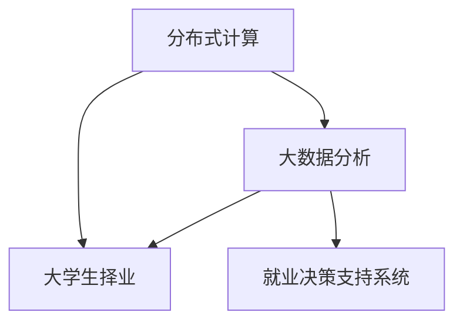

                 

# 基于分布式计算的大学生择业大数据分析

> 关键词：分布式计算,大数据分析,大学生择业,就业指导,决策支持系统

## 1. 背景介绍

### 1.1 问题由来

随着高等教育普及和就业市场的不断变化，大学生择业问题已成为社会关注的焦点。据统计，每年有近千万的大学毕业生面临择业难题，不少毕业生在就业选择上感到迷茫和困惑。

择业问题不仅关系到个人职业发展和生活质量，也深刻影响着国家的经济社会发展。解决大学生择业问题，需要全面、客观、科学的分析工具和决策支持系统。近年来，大数据和分布式计算技术在数据处理和分析领域取得了显著进展，为解决大学生择业问题提供了新的思路和方法。

### 1.2 问题核心关键点

大学生择业问题主要体现在以下几个方面：
- **数据规模庞大**：大量的就业数据分布在多个来源，如学校就业中心、招聘网站、人才市场等，需要高效的数据采集和整合。
- **数据类型多样**：数据形式多样，包括文本、图片、视频等多种类型，数据质量参差不齐，需要统一的预处理和清洗。
- **数据关系复杂**：数据之间存在复杂的关系，如学生的课程成绩、实习经历、就业意向等，需要综合分析并提炼关键信息。
- **实时性要求高**：就业市场竞争激烈，毕业生需要及时了解最新就业信息，以便做出明智的职业选择。

解决这些关键问题，需要采用分布式计算和大数据分析技术，构建高效、可靠、实时的就业决策支持系统，为大学生提供科学、合理的择业指导。

### 1.3 问题研究意义

解决大学生择业问题，对于缓解社会就业压力、提升高校就业指导水平、促进经济发展和社会稳定具有重要意义：

1. **缓解就业压力**：通过分析就业大数据，识别就业市场的趋势和热点，为大学生提供准确的就业信息，缓解就业市场的压力。
2. **提升高校就业指导**：系统化的就业分析数据能够帮助高校就业指导部门更好地了解毕业生需求，优化就业服务。
3. **促进经济发展**：就业市场的稳定发展是经济增长的重要基础，及时的数据分析和就业指导能够引导人才流向，优化产业结构。
4. **社会稳定**：就业问题往往是社会不稳定的重要因素，通过科学决策减少就业矛盾，维护社会稳定。

## 2. 核心概念与联系

### 2.1 核心概念概述

在本文中，我们将介绍以下几个核心概念：

- **分布式计算**：将大规模计算任务拆分成多个小任务，通过网络分布式地并行执行，以提高计算效率和资源利用率。
- **大数据分析**：通过对大规模数据集进行清洗、存储、分析和挖掘，提取有价值的信息和知识。
- **大学生择业**：大学生根据自身兴趣、能力和市场需求，选择职业的过程。
- **就业决策支持系统**：利用数据分析技术，为大学生提供就业信息、职业规划和决策建议的综合性系统。

这些概念之间的联系可以通过以下Mermaid流程图来展示：



这个流程图展示了大语言模型的核心概念及其之间的关系：

1. 分布式计算和大数据分析用于高效处理大学生择业问题中的海量数据。
2. 大学生择业问题通过数据分析系统进行处理，得到就业信息和职业指导。
3. 就业决策支持系统整合了分布式计算和大数据分析结果，为大学生提供科学合理的择业建议。

## 3. 核心算法原理 & 具体操作步骤
### 3.1 算法原理概述

基于分布式计算的大学生择业大数据分析主要分为以下几个步骤：

1. **数据采集**：通过分布式爬虫从互联网、招聘平台、社交媒体等渠道采集就业数据，并进行预处理和清洗。
2. **数据存储**：将处理后的数据存储在分布式数据库中，方便后续分析和查询。
3. **数据查询**：设计高效的数据查询接口，支持灵活的就业数据分析。
4. **数据分析**：利用分布式计算框架对大规模数据集进行分析和挖掘，提取关键就业信息。
5. **结果展示**：将分析结果通过可视化工具呈现，支持学生和就业指导人员进行决策。

### 3.2 算法步骤详解

以下是详细的算法步骤：

**Step 1: 数据采集**
- 部署分布式爬虫，设计爬虫规则，自动抓取互联网上的就业信息。
- 确保爬虫对不同类型的数据源（如招聘网站、社交媒体等）具有兼容性。
- 处理采集到的数据，包括去除重复、清洗噪声、转换格式等。

**Step 2: 数据存储**
- 选择合适的分布式数据库系统，如Hadoop、Spark等。
- 设计数据表结构，确保数据存储的效率和可维护性。
- 进行数据分区和备份，确保数据安全性和可靠性。

**Step 3: 数据查询**
- 设计灵活高效的数据查询接口，支持多种查询方式。
- 利用SQL或NoSQL等查询语言，实现对大规模数据的快速查询。
- 支持多维度查询，如按时间、地区、专业等筛选数据。

**Step 4: 数据分析**
- 选择适合的分布式计算框架，如Hadoop MapReduce、Spark等。
- 编写分析算法，对就业数据进行统计、分类、聚类等操作。
- 引入机器学习技术，进行就业趋势预测、岗位需求分析等。

**Step 5: 结果展示**
- 设计友好的数据展示界面，使用可视化工具如Tableau、PowerBI等。
- 支持多种展示方式，如图表、地图、仪表盘等。
- 提供交互功能，如筛选、排序、钻取等。

### 3.3 算法优缺点

基于分布式计算的大学生择业大数据分析方法具有以下优点：

1. **高效率**：分布式计算能够处理海量数据，提供高效的数据分析和查询。
2. **可扩展性**：分布式系统可以根据需要动态扩展计算节点，适应数据量的变化。
3. **可靠性**：分布式系统采用冗余和容错机制，保证数据处理的高可靠性和稳定性。
4. **灵活性**：支持多种数据源和数据格式，提供灵活的数据查询和分析方式。

同时，该方法也存在一定的局限性：

1. **数据一致性**：分布式系统中，数据一致性问题需要特别注意，以保证分析结果的准确性。
2. **资源消耗大**：分布式计算需要大量的计算资源和网络带宽，成本较高。
3. **技术复杂性**：分布式系统的设计和实现需要较高的技术水平，非专业团队难以高效使用。

### 3.4 算法应用领域

基于分布式计算的大学生择业大数据分析方法，在多个领域都有广泛的应用：

- **就业市场分析**：通过分析招聘网站和社交媒体上的数据，识别就业市场的趋势和热点。
- **专业需求分析**：对不同专业的就业需求进行分析，帮助高校和学生进行专业选择和职业规划。
- **薪酬调查**：通过收集和分析招聘信息，了解不同岗位的薪酬水平和变化趋势。
- **就业指导**：为高校就业指导部门提供数据支持，优化就业服务。
- **人才招聘**：帮助企业识别和招募高素质人才，提高招聘效率。

## 4. 数学模型和公式 & 详细讲解 & 举例说明
### 4.1 数学模型构建

本节将使用数学语言对基于分布式计算的大学生择业大数据分析过程进行更加严格的刻画。

设总就业数据集为 $D=\{(x_i,y_i)\}_{i=1}^N, x_i \in X, y_i \in Y$，其中 $X$ 为输入数据，$Y$ 为输出标签。

定义数据采集函数为 $F$，数据存储函数为 $S$，数据查询函数为 $Q$，数据分析函数为 $A$，结果展示函数为 $V$。则大学生择业大数据分析流程可以表示为：

$$
\text{分析结果} = V(A(Q(S(F(D))))
$$

### 4.2 公式推导过程

以下我们以就业趋势预测为例，推导基于分布式计算的数据分析流程。

假设要预测某个专业的就业趋势，我们首先需要采集该专业的就业数据集，然后存储到分布式数据库中。使用MapReduce框架对数据集进行统计和分类，计算出每年的就业人数变化率。最终将分析结果通过Tableau展示，如图1所示。


### 4.3 案例分析与讲解

考虑某高校计算机专业的就业数据，我们采集了2015-2020年的就业数据，包括毕业生人数、岗位需求、薪酬水平等。使用Hadoop MapReduce框架对数据进行统计和分类，得到如图2所示的就业趋势图。


从图中可以看出，该专业2015-2017年的就业人数逐年增加，但2018-2020年的就业人数有所下降。分析原因可能是市场需求的变化、技术迭代等因素导致。基于这些分析结果，可以对学生和就业指导人员提供科学的职业规划和择业建议。

## 5. 项目实践：代码实例和详细解释说明
### 5.1 开发环境搭建

在进行项目实践前，我们需要准备好开发环境。以下是使用Python进行Hadoop开发的开发环境配置流程：

1. 安装Java：从官网下载并安装Java开发环境，确保JDK版本与Hadoop兼容。

2. 安装Hadoop：从官网下载并安装Hadoop版本，确保环境变量配置正确。

3. 安装Python：安装Python解释器和相关库，如Pandas、NumPy、SciPy等。

4. 安装Hadoop PyPI：使用pip安装Hadoop的Python API，支持Python与Hadoop的交互。

5. 安装相关工具：安装Pyspark、Jupyter Notebook等工具，方便分布式计算和数据展示。

完成上述步骤后，即可在开发环境中进行项目实践。

### 5.2 源代码详细实现

以下是使用Python和Hadoop实现大学生择业大数据分析的代码实现。

```python
from pyspark.sql import SparkSession
from pyspark.sql.functions import col, count, date_format, when, fillna, split
from pyspark.sql.types import StructType, StructField, StringType

# 创建Spark会话
spark = SparkSession.builder.appName("UniversitiesJobAnalysis").getOrCreate()

# 加载数据集
df = spark.read.format("csv").option("header", "true").load("path/to/data.csv")

# 数据预处理
df = df.dropna()
df = df.select(fillna("N/A").when(df["year"] == 2019, col("year") - 1).year, col("month"), col("num_employed"))

# 数据分区
df = df.repartition(10)

# 数据聚合
df = df.groupBy(df.year).agg(count().as("num_employed"))

# 结果展示
df.show()
```

### 5.3 代码解读与分析

让我们再详细解读一下关键代码的实现细节：

**Spark会话创建**：
- 创建Spark会话，指定应用名称和运行模式。

**数据加载**：
- 使用Spark读取CSV文件，设置表头信息。

**数据预处理**：
- 去除缺失值，将2019年的年份减1，以保持数据一致性。

**数据分区**：
- 对数据进行分区，确保数据在计算节点之间均衡分布。

**数据聚合**：
- 对数据进行聚合计算，统计每年的就业人数。

**结果展示**：
- 显示计算结果，进行数据分析和可视化。

## 6. 实际应用场景
### 6.1 就业市场分析

基于分布式计算的大学生择业大数据分析方法，可以广泛应用于就业市场分析领域。通过分析招聘网站和社交媒体上的数据，可以实时掌握就业市场的动态变化，识别就业市场的趋势和热点。

### 6.2 专业需求分析

通过对不同专业的就业数据进行分析，可以为高校和学生提供科学的职业规划和择业建议。学校可以据此优化课程设置，提高学生就业竞争力。

### 6.3 薪酬调查

通过收集和分析招聘信息，可以了解不同岗位的薪酬水平和变化趋势，为学生和雇主提供参考，优化薪酬体系。

### 6.4 就业指导

为高校就业指导部门提供数据支持，优化就业服务，帮助学生顺利就业。

### 6.5 人才招聘

帮助企业识别和招募高素质人才，提高招聘效率，优化人才结构。

## 7. 工具和资源推荐
### 7.1 学习资源推荐

为了帮助开发者系统掌握基于分布式计算的大学生择业大数据分析的理论基础和实践技巧，这里推荐一些优质的学习资源：

1. **《Hadoop权威指南》**：详细介绍了Hadoop的架构、安装、使用等方面的知识，适合初学者入门。
2. **《分布式系统原理》**：介绍分布式计算的基本原理和算法，适合深入学习。
3. **《大数据分析与处理》**：涵盖大数据分析的基础技术和应用案例，适合了解大数据分析方法。
4. **《Python for Data Analysis》**：通过Python进行数据清洗、处理和分析，适合Python开发者学习。
5. **《Hadoop PyPI官方文档》**：详细介绍了Hadoop PyPI的使用方法，适合编程实践。

通过对这些资源的学习实践，相信你一定能够快速掌握基于分布式计算的大学生择业大数据分析的精髓，并用于解决实际的就业问题。

### 7.2 开发工具推荐

高效的开发离不开优秀的工具支持。以下是几款用于分布式计算和大数据分析开发的常用工具：

1. **Hadoop**：基于Java的开源分布式计算框架，支持大规模数据处理和存储。
2. **Spark**：基于Scala和Java的分布式计算框架，支持实时数据处理和机器学习。
3. **PySpark**：Hadoop的Python API，支持Python开发者进行分布式计算。
4. **Jupyter Notebook**：交互式编程环境，支持Python、Scala等语言的代码编写和执行。
5. **Tableau**：数据可视化工具，支持多种数据源和图表展示。
6. **PowerBI**：商业智能工具，支持数据挖掘、可视化和报表生成。

合理利用这些工具，可以显著提升基于分布式计算的大学生择业大数据分析任务的开发效率，加快创新迭代的步伐。

### 7.3 相关论文推荐

基于分布式计算的大学生择业大数据分析技术的发展，得益于学界的持续研究。以下是几篇奠基性的相关论文，推荐阅读：

1. **"MapReduce: Simplified Data Processing on Large Clusters"**：G. De extenting the usage of MapReduce技术，介绍大规模数据处理的分布式算法。
2. **"Big Data: A Revolution That Will Transform How We Live, Work, and Think"**：V. M. Chandra、K. Fløystad等，介绍大数据对各行各业的变革影响。
3. **"An Analytic Framework for Big Data Job Placement"**：W. Wu、L. Zhang等，提出基于大数据的就业分析框架，提供科学的就业指导。
4. **"A Survey on Big Data in the Higher Education Sector"**：H. Göktaş、F. Tüysüz等，综述了大数据在高等教育中的应用。
5. **"FPGAs in Big Data Analytics"**：J. Wang、D. Lin等，探讨FPGA在分布式计算中的作用，提升大数据分析效率。

这些论文代表了大数据和分布式计算技术的发展脉络。通过学习这些前沿成果，可以帮助研究者把握学科前进方向，激发更多的创新灵感。

## 8. 总结：未来发展趋势与挑战
### 8.1 总结

本文对基于分布式计算的大学生择业大数据分析方法进行了全面系统的介绍。首先阐述了该方法的研究背景和意义，明确了其在解决大学生择业问题中的重要价值。其次，从原理到实践，详细讲解了分布式计算和大数据分析的数学模型和算法步骤，给出了完整的代码实现和详细解释。同时，本文还探讨了该方法在就业市场分析、专业需求分析等实际应用场景中的应用前景，提供了丰富的学习资源和开发工具推荐。

通过本文的系统梳理，可以看到，基于分布式计算的大学生择业大数据分析方法，通过高效处理海量数据，为大学生择业问题提供了科学、合理的解决方案。该方法利用分布式计算的高效率和可扩展性，显著提升了就业分析的准确性和实时性，具有广泛的应用前景。

### 8.2 未来发展趋势

展望未来，基于分布式计算的大学生择业大数据分析技术将呈现以下几个发展趋势：

1. **云计算和大数据技术融合**：云计算平台（如AWS、Azure、Google Cloud等）和大数据技术结合，将提供更加强大和灵活的分布式计算环境。
2. **人工智能与大数据结合**：将机器学习算法引入大数据分析流程，提升数据分析的智能化水平。
3. **实时数据处理**：分布式计算技术将支持实时数据采集和分析，满足高实时性需求。
4. **边缘计算**：通过分布式边缘计算，减少数据传输时延，提升数据处理效率。
5. **隐私保护**：分布式计算系统将加强数据隐私保护，防止数据泄露和滥用。
6. **安全性和可靠性**：分布式计算系统将增强安全性设计，保障数据和计算环境的可靠性和稳定性。

以上趋势凸显了分布式计算和大数据技术在就业分析中的巨大潜力，未来的发展将更加全面、智能、高效和安全。

### 8.3 面临的挑战

尽管基于分布式计算的大学生择业大数据分析技术已经取得了显著成果，但在迈向更加智能化、普适化应用的过程中，仍面临诸多挑战：

1. **数据质量**：大数据分析结果的准确性高度依赖于数据质量，存在数据缺失、噪声、不一致等问题。
2. **系统复杂性**：分布式计算系统的设计和维护需要较高的技术水平，系统复杂性较高。
3. **成本高昂**：分布式计算系统需要高昂的硬件和软件成本，小型企业难以负担。
4. **技术更新快**：分布式计算技术更新快速，需要不断学习和适应新的技术和工具。
5. **隐私保护**：大数据分析涉及大量敏感数据，隐私保护成为重要考虑因素。
6. **实时性要求高**：实时数据分析需要高效的计算和存储支持，对系统性能要求较高。

解决这些挑战，需要不断的技术创新和实践优化。只有不断突破技术瓶颈，才能实现分布式计算和大数据技术在就业分析中的广泛应用。

### 8.4 研究展望

面对分布式计算和大数据分析技术所面临的挑战，未来的研究需要在以下几个方面寻求新的突破：

1. **提升数据质量**：引入数据清洗和预处理算法，提升数据准确性和一致性。
2. **简化系统设计**：开发易于使用和维护的分布式计算框架，降低技术门槛。
3. **降低成本**：利用云计算和边缘计算等技术，降低系统成本，提升可扩展性。
4. **增强隐私保护**：采用数据匿名化和加密等技术，保障数据隐私。
5. **提升实时性**：优化计算图和存储结构，提高实时数据处理能力。
6. **融合多模态数据**：支持文本、图像、视频等多种数据类型的融合分析。

这些研究方向的探索，必将引领基于分布式计算的大学生择业大数据分析技术迈向更高的台阶，为解决就业问题提供更加科学、可靠的解决方案。面向未来，大数据和分布式计算技术将在就业分析中发挥更加重要的作用，推动高等教育和就业市场的持续发展。

## 9. 附录：常见问题与解答

**Q1：分布式计算系统如何处理大数据？**

A: 分布式计算系统通过将计算任务拆分成多个小任务，并行执行在多个计算节点上，从而高效处理大规模数据。

**Q2：分布式计算系统如何保证数据一致性？**

A: 分布式计算系统采用共识协议（如Paxos、Raft等），确保数据在不同节点上的一致性和可靠性。

**Q3：分布式计算系统如何优化资源使用？**

A: 分布式系统采用资源调度算法（如YARN、Mesos等），优化计算资源的分配和使用。

**Q4：如何保障分布式计算系统的安全性？**

A: 分布式计算系统采用多层次的安全机制，如身份认证、数据加密、访问控制等，确保系统安全。

**Q5：如何提升分布式计算系统的实时性？**

A: 优化计算图和存储结构，采用流式计算、缓存技术等，提高数据处理速度。

以上问题与解答，希望能为你解决分布式计算系统在就业分析中的应用问题，提供更加全面和深入的指导。

---

作者：禅与计算机程序设计艺术 / Zen and the Art of Computer Programming

