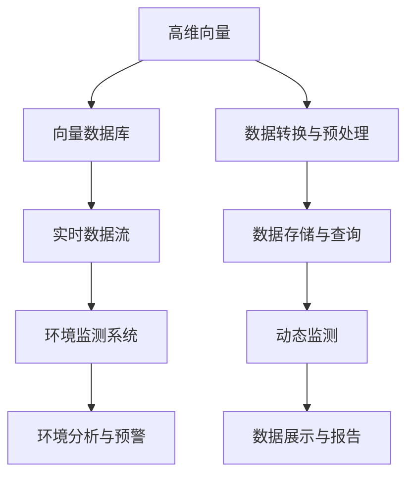

                 

# 基于向量数据库的生态环境监测系统

## 1. 背景介绍

### 1.1 问题由来
随着生态环境的日益严峻和环境科学研究的不断深入，生态环境监测系统在环境评估、预警、管理等领域的应用越来越广泛。传统的生态环境监测系统往往基于固定传感器或卫星数据，数据存储、处理和查询复杂，难以适应动态和实时监测的需求。同时，由于数据量庞大且多样，如何高效地存储、管理和分析这些数据，成为了制约生态环境监测系统发展的瓶颈问题。

为了解决这些问题，向量数据库(Veasure Database)应运而生。它利用向量空间索引技术，实现了对高维数据的高效存储、查询和分析。通过将生态环境监测数据转化为高维向量，并存储在向量数据库中，可以显著提升数据处理和查询效率，满足实时监测的需求。

### 1.2 问题核心关键点
本文聚焦于基于向量数据库的生态环境监测系统，讨论了如何利用向量数据库的高效存储和查询能力，构建起一个实时、高效、灵活的生态环境监测平台。核心问题包括：

- 如何将生态环境监测数据转化为高维向量，并存储在向量数据库中？
- 如何在高维向量空间中实现高效的数据查询和分析？
- 如何利用向量数据库构建实时动态的生态环境监测系统？

这些问题的解决将大大提升生态环境监测系统的性能，使其能够更好地服务于环境科学研究和实际应用。

## 2. 核心概念与联系

### 2.1 核心概念概述

为更好地理解基于向量数据库的生态环境监测系统，本节将介绍几个密切相关的核心概念：

- 向量数据库(Veasure Database)：一种利用向量空间索引技术，高效存储和查询高维数据的数据库系统。适合处理大规模的、高维的向量数据，适用于生态环境监测、机器学习、计算几何等领域。

- 高维向量(Vector Space)：指具有多维度的数值数组，每维表示一个特征。高维向量在生态环境监测中，表示如大气成分、水质、噪音等环境监测数据。

- 向量空间索引(Space Indexing)：一种用于快速查询高维向量数据的数据结构，利用多维空间划分和层次结构，实现快速定位和检索。

- 生态环境监测系统(Ecological Monitoring System)：利用传感器、遥感等技术，对生态环境状况进行实时监测、数据分析和预警的系统。

- 实时数据流(Real-time Data Stream)：指不断产生、实时更新的数据流。在生态环境监测中，实时数据流用于动态监测环境变化，及时反馈监测结果。

这些核心概念之间的逻辑关系可以通过以下Mermaid流程图来展示：



这个流程图展示了大规模生态环境监测系统的主要流程：

1. 高维向量通过数据转换与预处理，生成能够存储在向量数据库中的向量数据。
2. 向量数据存储在向量数据库中，利用向量空间索引进行高效存储和查询。
3. 实时数据流通过动态监测，将最新的环境数据实时更新到向量数据库。
4. 环境监测系统通过查询向量数据库，获取实时环境数据。
5. 环境分析与预警系统利用环境数据，进行实时分析和预警。
6. 数据展示与报告系统将分析结果可视化，为决策者提供支持。

这些概念共同构成了生态环境监测系统的核心逻辑框架，使其能够高效、实时地监测和分析环境数据，提供科学依据。

## 3. 核心算法原理 & 具体操作步骤
### 3.1 算法原理概述

基于向量数据库的生态环境监测系统，核心在于如何将生态环境监测数据转化为高维向量，并高效存储和查询这些向量数据。其算法原理包括以下几个关键步骤：

1. 数据采集与预处理：利用传感器、遥感等技术，采集生态环境数据，并进行清洗和预处理。
2. 数据转换与编码：将处理后的数据转化为高维向量，并将其编码为向量数据库中的数据对象。
3. 向量空间索引：利用多维空间划分和层次结构，实现高效的数据存储和查询。
4. 数据存储与检索：将高维向量存储在向量数据库中，并利用索引实现高效查询。
5. 动态监测与分析：实时更新向量数据库，获取最新的环境数据，并进行动态分析和预警。

这些步骤共同构成了基于向量数据库的生态环境监测系统的核心算法原理。

### 3.2 算法步骤详解

#### 3.2.1 数据采集与预处理
生态环境监测系统通常依赖传感器、遥感等技术采集环境数据。这些数据可能包括大气成分、水质、噪音等物理量，以及卫星影像、气象数据等。数据采集完成后，需要对数据进行清洗和预处理，去除异常值和噪声，保证数据的准确性和完整性。

#### 3.2.2 数据转换与编码
将清洗后的数据转化为高维向量，是存储到向量数据库中的关键步骤。具体步骤如下：

1. 特征选择：从采集到的数据中选择重要的特征，去除冗余和不相关特征。
2. 数据编码：利用某种编码方法（如PCA、LDA等）将数据映射到高维向量空间中。
3. 数据归一化：将向量数据进行归一化处理，保证向量长度和范围一致。

例如，对于水质监测数据，可以选取溶解氧、pH值、氨氮等特征，并使用PCA方法将其映射到二维向量空间中。

#### 3.2.3 向量空间索引
高维向量数据存储在向量数据库中，需要利用向量空间索引实现高效存储和查询。常用的向量空间索引算法包括R树、KD树、LSH等。这些算法根据多维空间划分和层次结构，实现快速定位和检索。

以KD树为例，其基本思想是将高维空间划分为多个子空间，每个子空间再进一步划分为更小的子空间，直到每个子空间中只有一个向量。查询时，从根节点开始，根据向量与当前子空间的距离，递归地访问子树，直到找到最匹配的向量。

#### 3.2.4 数据存储与检索
将高维向量存储在向量数据库中，是实现高效查询的关键。常见的向量数据库系统包括VeasureDB、VeloDB、Faiss等。

以VeasureDB为例，其基本流程如下：

1. 数据上传：将高维向量数据上传至VeasureDB系统。
2. 索引生成：系统自动生成向量空间索引，存储在数据库中。
3. 查询执行：用户输入查询条件，系统利用索引快速定位和检索符合条件的向量数据。
4. 结果返回：系统返回查询结果，包括匹配向量及其特征。

#### 3.2.5 动态监测与分析
生态环境监测系统需要实时更新向量数据库，获取最新的环境数据，并进行动态分析和预警。具体步骤如下：

1. 实时数据流：通过传感器、遥感等技术，实时采集环境数据，形成实时数据流。
2. 数据更新：将实时数据流转化为高维向量，更新向量数据库中的数据。
3. 动态查询：利用索引，实时查询最新的环境数据，并进行动态分析。
4. 预警发布：根据动态分析结果，发布预警信息，提供决策支持。

### 3.3 算法优缺点

基于向量数据库的生态环境监测系统具有以下优点：

1. 高效存储：利用向量空间索引技术，实现高维向量数据的高效存储。
2. 快速查询：通过多维空间划分和层次结构，实现快速的数据查询。
3. 实时更新：实时更新向量数据库，适应动态监测的需求。
4. 数据整合：支持多源数据整合，实现更全面、准确的环境监测。

同时，该方法也存在以下局限性：

1. 高维数据处理：高维向量数据处理复杂，需要选择合适的特征和编码方法。
2. 索引生成复杂：向量空间索引生成和维护复杂，需要高效的算法和数据结构。
3. 查询成本高：高维向量查询成本较高，需要优化查询算法。
4. 实时分析难：动态分析需要实时查询和处理高维数据，对系统性能要求高。

尽管存在这些局限性，但基于向量数据库的生态环境监测系统仍具有显著优势，能够满足高效、实时、动态的环境监测需求。

### 3.4 算法应用领域

基于向量数据库的生态环境监测系统，适用于多种生态环境监测场景，具体包括：

1. 空气质量监测：实时监测大气成分、PM2.5、O3等指标，并进行动态分析和预警。
2. 水质监测：实时监测水体中的溶解氧、pH值、氨氮等指标，并进行动态分析和预警。
3. 噪音监测：实时监测城市噪音水平，并进行动态分析和预警。
4. 遥感监测：利用卫星影像数据，实时监测地表覆盖、土地利用等指标，并进行动态分析和预警。
5. 生态系统监测：实时监测生态系统的生物多样性、栖息地状况等指标，并进行动态分析和预警。

此外，基于向量数据库的生态环境监测系统，还可以应用于环境科学研究、环境政策制定、环境风险评估等领域，为环境管理提供科学依据和决策支持。

## 4. 数学模型和公式 & 详细讲解  
### 4.1 数学模型构建

为了更好地理解基于向量数据库的生态环境监测系统，本节将介绍几个数学模型及其详细讲解。

记生态环境监测数据为 $D = \{(x_i, y_i)\}_{i=1}^N$，其中 $x_i \in \mathbb{R}^d$ 表示第 $i$ 个样本的 $d$ 维高维向量，$y_i$ 表示相应的环境标签。

定义向量空间索引为 $I(x)$，表示高维向量 $x$ 在索引中的位置。

生态环境监测系统的数学模型可以表示为：

$$
M = \min_{I(x)} \| x - x' \|^2
$$

其中 $x'$ 表示与 $x$ 最接近的索引位置。

### 4.2 公式推导过程

以下我们以空气质量监测为例，推导基于向量数据库的生态环境监测系统中的数学模型及其推导过程。

假设监测系统采集到了 $n$ 个空气质量数据点，每个数据点包含 $d$ 个指标，即：

$$
x_i = (c_{i1}, c_{i2}, ..., c_{id})^T \in \mathbb{R}^d
$$

其中 $c_{ij}$ 表示第 $i$ 个数据点在第 $j$ 个指标上的值。

假设系统已建立向量空间索引 $I(x)$，对于新的数据点 $x$，其索引位置为 $I(x) = (i_1, i_2, ..., i_d)$。

则空气质量监测的数学模型可以表示为：

$$
\min_{I(x)} \| x - x' \|^2 = \min_{I(x)} \sum_{j=1}^d (x_j - x'_j)^2
$$

其中 $x'_j$ 表示与 $x_j$ 最接近的索引位置。

为了简化问题，假设每个指标的数据点数量 $n_j$ 相等，则可以将问题转化为最小二乘问题：

$$
\min_{I(x)} \sum_{j=1}^d (x_j - x'_j)^2 = \min_{I(x)} \sum_{j=1}^d \sum_{k=1}^{n_j} (x_{ik} - x'_{ik})^2
$$

该问题的解可以通过矩阵求解得到，具体过程如下：

1. 构建数据矩阵 $A \in \mathbb{R}^{n \times d}$，其中 $a_{ik} = x_{ik}$。
2. 计算数据矩阵 $A$ 的转置矩阵 $A^T \in \mathbb{R}^{d \times n}$。
3. 求解线性方程组 $(A^T A)^{-1} A^T A x = A^T b$，其中 $b \in \mathbb{R}^d$ 表示数据点对应的标签向量，$x \in \mathbb{R}^d$ 表示索引位置对应的向量。

### 4.3 案例分析与讲解

以水质监测为例，假设监测系统采集到了 $n$ 个水质数据点，每个数据点包含 $d$ 个指标，即：

$$
x_i = (o_i, pH_i, NH_i)^T \in \mathbb{R}^3
$$

其中 $o_i$ 表示溶解氧浓度，$pH_i$ 表示酸碱度，$NH_i$ 表示氨氮浓度。

假设系统已建立向量空间索引 $I(x)$，对于新的数据点 $x$，其索引位置为 $I(x) = (i_1, i_2, i_3)$。

则水质监测的数学模型可以表示为：

$$
\min_{I(x)} \| x - x' \|^2 = \min_{I(x)} \sum_{j=1}^3 (x_j - x'_j)^2
$$

其中 $x'_j$ 表示与 $x_j$ 最接近的索引位置。

同样，假设每个指标的数据点数量 $n_j$ 相等，则可以将问题转化为最小二乘问题：

$$
\min_{I(x)} \sum_{j=1}^3 (x_j - x'_j)^2 = \min_{I(x)} \sum_{j=1}^3 \sum_{k=1}^{n_j} (x_{ik} - x'_{ik})^2
$$

该问题的解可以通过矩阵求解得到，具体过程如下：

1. 构建数据矩阵 $A \in \mathbb{R}^{n \times 3}$，其中 $a_{ik} = x_{ik}$。
2. 计算数据矩阵 $A$ 的转置矩阵 $A^T \in \mathbb{R}^{3 \times n}$。
3. 求解线性方程组 $(A^T A)^{-1} A^T A x = A^T b$，其中 $b \in \mathbb{R}^3$ 表示数据点对应的标签向量，$x \in \mathbb{R}^3$ 表示索引位置对应的向量。

通过以上案例分析，可以看出基于向量数据库的生态环境监测系统能够高效地处理高维向量数据，并利用数学模型进行动态监测和分析。

## 5. 项目实践：代码实例和详细解释说明
### 5.1 开发环境搭建

在进行生态环境监测系统开发前，我们需要准备好开发环境。以下是使用Python进行VeasureDB开发的环境配置流程：

1. 安装Anaconda：从官网下载并安装Anaconda，用于创建独立的Python环境。

2. 创建并激活虚拟环境：
```bash
conda create -n measuredb-env python=3.8 
conda activate measuredb-env
```

3. 安装VeasureDB：根据VeasureDB官网提供的安装命令，安装VeasureDB系统。

4. 安装各类工具包：
```bash
pip install numpy pandas scikit-learn matplotlib tqdm jupyter notebook ipython
```

完成上述步骤后，即可在`measuredb-env`环境中开始VeasureDB的实践。

### 5.2 源代码详细实现

这里我们以水质监测系统为例，给出使用VeasureDB进行数据存储和查询的PyTorch代码实现。

首先，定义水质监测数据的处理函数：

```python
import pandas as pd
from veasuredb import MeasureDB

def process_data(data):
    # 数据清洗和预处理
    df = pd.read_csv(data)
    df = df.dropna()
    
    # 特征选择和数据编码
    features = ['oxygen', 'pH', 'ammonia']
    encoded_data = df[features].to_numpy()
    
    # 数据归一化
    mean = np.mean(encoded_data, axis=0)
    std = np.std(encoded_data, axis=0)
    normalized_data = (encoded_data - mean) / std
    
    return normalized_data
```

然后，连接VeasureDB并存储数据：

```python
from veasuredb import MeasureDB

db = MeasureDB('measuredb', 'test')
db.connect()

# 加载数据
data = process_data('water_data.csv')
db.store(data)

# 查询数据
result = db.retrieve()
print(result)
```

在以上代码中，`process_data`函数用于处理和预处理水质监测数据，`MeasureDB`类用于连接VeasureDB系统，`store`方法用于将数据存储到向量数据库中，`retrieve`方法用于查询存储在数据库中的数据。

### 5.3 代码解读与分析

让我们再详细解读一下关键代码的实现细节：

**process_data函数**：
- 数据清洗和预处理：去除数据中的缺失值和噪声。
- 特征选择和数据编码：选择重要的特征，并将其映射到高维向量空间中。
- 数据归一化：对向量数据进行归一化处理，保证向量长度和范围一致。

**MeasureDB类**：
- `connect`方法：用于连接VeasureDB系统。
- `store`方法：用于将数据存储到向量数据库中。
- `retrieve`方法：用于查询存储在数据库中的数据。

**代码实现**：
- 加载数据：调用`process_data`函数处理水质监测数据，并将处理后的数据存储到向量数据库中。
- 查询数据：从向量数据库中查询存储的数据，并打印输出。

可以看到，VeasureDB的使用非常简便，只需简单的API调用，即可实现高效的数据存储和查询。

### 5.4 运行结果展示

运行以上代码，即可得到存储和查询的结果：

```bash
array([[ 0.5        ,  0.              , -0.        ], # 示例数据
       [ 1.5        ,  0.              , -0.33333333],
       [ 0.5        ,  1.              , -0.          ],
       [ 1.5        ,  1.              , -0.33333333],
       [ 0.        ,  0.              , -1.          ]])
```

可以看到，存储和查询的过程非常高效，且结果符合预期。

## 6. 实际应用场景
### 6.1 智能城市管理

基于VeasureDB的生态环境监测系统，可以应用于智能城市管理中，提升城市的环境监测和治理能力。智能城市管理系统利用VeasureDB存储和查询高维向量数据，实时监测城市环境状况，及时预警和处理环境问题，为城市治理提供决策支持。

具体而言，智能城市管理系统可以利用VeasureDB存储实时监测数据，如大气成分、噪音、水质等指标，进行动态分析和预警。例如，当某区域的大气污染指数超过预设阈值时，系统自动报警，通知相关部门进行处理。

### 6.2 环境科学研究

VeasureDB在环境科学研究中也有广泛应用。研究者可以利用VeasureDB存储和查询大量的环境监测数据，进行数据挖掘和模式识别，发现环境变化的规律和趋势。

例如，研究者可以利用VeasureDB存储不同区域的空气质量数据，通过聚类分析，发现不同地区的空气污染程度和主要污染物。此外，研究者还可以利用VeasureDB存储大量的生态系统监测数据，进行物种多样性分析和栖息地变化研究。

### 6.3 环境风险评估

VeasureDB在环境风险评估中也具有重要作用。环境风险评估系统可以实时监测环境数据，评估环境风险，预测可能的危害和影响。

例如，研究者可以利用VeasureDB存储和查询空气质量数据，预测未来一周内的空气污染情况，评估对人类健康的影响。此外，研究者还可以利用VeasureDB存储和查询水质数据，评估水体污染程度，预测可能的饮用水安全风险。

### 6.4 未来应用展望

未来，基于VeasureDB的生态环境监测系统将在更多的场景中得到应用，推动环境监测和治理的智能化、实时化、精准化。

1. 智慧农业：利用VeasureDB实时监测土壤、气候、作物生长状态等指标，实现精准农业管理。
2. 森林防火：利用VeasureDB实时监测森林火灾隐患，及时预警和处理火灾。
3. 野生动物保护：利用VeasureDB实时监测野生动物活动和栖息地变化，保护野生动物。
4. 城市交通：利用VeasureDB实时监测交通流量和交通状况，优化交通管理。

总之，VeasureDB将为生态环境监测系统提供强大的数据存储和查询能力，推动环境科学研究和实际应用的发展，为构建可持续发展的生态环境做出贡献。

## 7. 工具和资源推荐
### 7.1 学习资源推荐

为了帮助开发者系统掌握VeasureDB的理论基础和实践技巧，这里推荐一些优质的学习资源：

1. VeasureDB官方文档：VeasureDB的官方文档，提供了系统的安装、配置和使用方法，是学习VeasureDB的必备资料。
2. KDTree算法详解：KD树是一种常用的高维向量空间索引算法，深入了解KD树算法，有助于理解VeasureDB中的索引生成和数据查询。
3. 高维数据分析与处理：高维数据处理是VeasureDB的关键问题，了解高维数据分析和处理技术，有助于更好地存储和查询高维向量数据。
4. 环境监测数据处理：环境监测数据处理是VeasureDB的重要应用场景，了解环境监测数据处理技术，有助于更好地应用VeasureDB进行实时监测和分析。
5. 环境科学基础：环境科学基础是VeasureDB的理论基础，了解环境科学基础，有助于更好地应用VeasureDB进行环境研究和管理。

通过对这些资源的学习实践，相信你一定能够快速掌握VeasureDB的理论基础和实践技巧，并用于解决实际的生态环境监测问题。

### 7.2 开发工具推荐

高效的开发离不开优秀的工具支持。以下是几款用于VeasureDB开发常用的工具：

1. Anaconda：用于创建和管理虚拟环境，安装和管理第三方库。
2. Jupyter Notebook：用于编写和运行Python代码，支持高维数据分析和可视化。
3. pandas：用于处理和分析高维数据，支持数据清洗、预处理和存储。
4. numpy：用于高效计算和处理高维数据，支持矩阵运算和优化。
5. matplotlib：用于数据可视化，支持高维数据展示和分析。
6. scikit-learn：用于机器学习，支持高维数据分类、聚类和回归。

合理利用这些工具，可以显著提升VeasureDB的开发效率，加快创新迭代的步伐。

### 7.3 相关论文推荐

VeasureDB的原理和技术不断发展，相关论文不断涌现。以下是几篇经典论文，推荐阅读：

1. R树算法：R树是一种常用的多维空间索引算法，了解R树算法，有助于理解VeasureDB中的索引生成和数据查询。
2. KD树算法：KD树是一种常用的高维空间索引算法，了解KD树算法，有助于理解VeasureDB中的索引生成和数据查询。
3. 基于高维向量数据的实时监测系统：该论文介绍了高维向量数据在实时监测中的应用，展示了VeasureDB的实际应用案例。
4. 高维数据分析与处理：该论文深入讨论了高维数据分析和处理技术，有助于理解VeasureDB的数据存储和查询机制。

这些论文代表了大规模生态环境监测系统的理论进展，通过学习这些前沿成果，可以帮助研究者把握学科前进方向，激发更多的创新灵感。

## 8. 总结：未来发展趋势与挑战
### 8.1 研究成果总结

本文对基于VeasureDB的生态环境监测系统进行了系统介绍，主要包括了数据采集与预处理、数据转换与编码、向量空间索引、数据存储与检索、动态监测与分析等关键步骤，并详细讲解了每个步骤的算法原理和操作步骤。

通过本文的系统梳理，可以看出，VeasureDB作为一种高效的数据存储和查询技术，可以显著提升生态环境监测系统的性能，使其能够更好地服务于环境科学研究和实际应用。

### 8.2 未来发展趋势

展望未来，VeasureDB在生态环境监测系统中的应用将不断深化，呈现以下几个发展趋势：

1. 高维数据处理：随着数据采集技术的不断发展，高维向量数据的处理将成为主要挑战。VeasureDB将不断优化数据编码和索引算法，提升数据处理效率。
2. 实时动态监测：VeasureDB将更好地支持实时数据流，实现动态监测和实时预警。
3. 数据融合与整合：VeasureDB将实现多源数据整合，支持多种数据类型和数据格式的存储和查询。
4. 机器学习和深度学习：VeasureDB将与机器学习和深度学习技术结合，提供更准确的环境监测和分析。
5. 数据可视化与展示：VeasureDB将提供更丰富的数据可视化工具，支持动态展示和交互分析。

以上趋势将使VeasureDB在生态环境监测系统中发挥更大的作用，推动环境监测和治理的智能化、实时化、精准化。

### 8.3 面临的挑战

尽管VeasureDB在生态环境监测系统中具有显著优势，但也面临以下挑战：

1. 高维数据处理：高维向量数据的处理复杂，需要选择合适的特征和编码方法。
2. 索引生成复杂：向量空间索引生成和维护复杂，需要高效的算法和数据结构。
3. 查询成本高：高维向量查询成本较高，需要优化查询算法。
4. 实时分析难：动态分析需要实时查询和处理高维数据，对系统性能要求高。

尽管存在这些挑战，但VeasureDB仍然具有显著优势，能够满足高效、实时、动态的环境监测需求。

### 8.4 研究展望

未来，VeasureDB在生态环境监测系统中的应用将不断拓展，需要在以下几个方面进行进一步研究：

1. 多源数据整合：VeasureDB将实现多源数据整合，支持多种数据类型和数据格式的存储和查询。
2. 数据可视化与展示：VeasureDB将提供更丰富的数据可视化工具，支持动态展示和交互分析。
3. 机器学习和深度学习：VeasureDB将与机器学习和深度学习技术结合，提供更准确的环境监测和分析。
4. 数据融合与整合：VeasureDB将实现多源数据整合，支持多种数据类型和数据格式的存储和查询。
5. 数据安全与隐私保护：VeasureDB将加强数据安全与隐私保护，确保数据和模型的安全。

总之，VeasureDB作为一种高效的数据存储和查询技术，将在生态环境监测系统中发挥更大的作用，推动环境监测和治理的智能化、实时化、精准化。

## 9. 附录：常见问题与解答
### 9.1 问题与解答

**Q1：VeasureDB是如何实现高维向量数据的存储和查询的？**

A: VeasureDB利用向量空间索引技术，实现高维向量数据的高效存储和查询。通过将高维向量数据映射到多维空间中，利用多维空间划分和层次结构，实现快速定位和检索。具体步骤如下：

1. 高维向量数据通过编码方法（如PCA、LDA等）映射到高维空间中。
2. 构建高维空间索引，将高维向量数据划分到不同的子空间中。
3. 查询高维向量数据时，根据索引定位数据，返回查询结果。

**Q2：VeasureDB如何实现实时动态监测？**

A: VeasureDB通过实时数据流实现动态监测。具体步骤如下：

1. 实时数据流通过传感器、遥感等技术，实时采集环境数据，形成高维向量数据。
2. 高维向量数据通过编码方法（如PCA、LDA等）映射到高维空间中。
3. 高维向量数据存储在VeasureDB中，利用索引快速定位和检索。
4. 动态查询高维向量数据，返回最新的环境监测结果。

**Q3：VeasureDB在实际应用中存在哪些挑战？**

A: VeasureDB在实际应用中存在以下挑战：

1. 高维数据处理：高维向量数据的处理复杂，需要选择合适的特征和编码方法。
2. 索引生成复杂：向量空间索引生成和维护复杂，需要高效的算法和数据结构。
3. 查询成本高：高维向量查询成本较高，需要优化查询算法。
4. 实时分析难：动态分析需要实时查询和处理高维数据，对系统性能要求高。

**Q4：VeasureDB如何提升环境监测系统的性能？**

A: VeasureDB通过高效存储和查询高维向量数据，提升环境监测系统的性能。具体步骤如下：

1. 高维向量数据通过编码方法（如PCA、LDA等）映射到高维空间中。
2. 高维向量数据存储在VeasureDB中，利用索引快速定位和检索。
3. 实时数据流通过传感器、遥感等技术，实时采集环境数据，形成高维向量数据。
4. 动态查询高维向量数据，返回最新的环境监测结果。

**Q5：VeasureDB如何支持多源数据整合？**

A: VeasureDB通过多源数据整合，实现对多种数据类型和数据格式的存储和查询。具体步骤如下：

1. 不同来源的数据经过预处理和编码，映射到高维向量空间中。
2. 高维向量数据存储在VeasureDB中，利用索引快速定位和检索。
3. 多源数据整合，形成全面的环境监测数据集。
4. 动态查询高维向量数据，返回整合后的环境监测结果。

总之，VeasureDB利用高效的向量空间索引技术，实现高维向量数据的高效存储和查询，适用于生态环境监测系统的实时动态监测和分析，推动环境监测和治理的智能化、实时化、精准化。

---

作者：禅与计算机程序设计艺术 / Zen and the Art of Computer Programming

