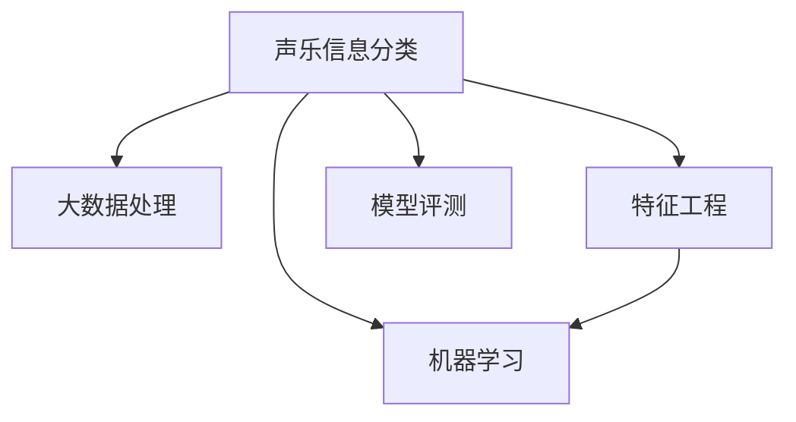

                 

# 基于大数据的声乐信息分类评测系统

> 关键词：声乐信息分类, 大数据, 机器学习, 特征工程, 模型评测

## 1. 背景介绍

### 1.1 问题由来
随着数字音频技术的飞速发展，大量的音乐、歌曲、影视配音等声乐信息被数字化、高分辨率地记录和传播。这些声乐信息不仅包含丰富的情感和艺术表现，也蕴含着宝贵的声学特征和音乐特征。如何从这些声乐信息中提取有价值的信息，并进行高效、准确的分类评测，是一个极具挑战性的课题。

声乐信息的分类评测，涉及音乐类型、演唱风格、声乐表现等多个维度的评估，具有高度的非线性、非结构化和动态变化的特点。当前的方法主要依赖人工标注和专家评估，成本高、效率低，难以满足大规模声乐信息处理的需要。基于大数据的声乐信息分类评测系统，可以充分利用大规模声乐数据和先进机器学习技术，自动化地进行声乐信息分类和评测，显著提升效率和准确性。

### 1.2 问题核心关键点
声乐信息分类评测系统的核心问题在于如何从大规模声乐数据中提取有意义的特征，选择合适的模型进行分类，并设计有效的评测指标来衡量分类效果。

具体来说，需要关注以下关键点：
- 声乐特征的提取与表示：声乐信息包含丰富的多模态特征，如音频频谱、音高、音色、情感等，需要设计有效的特征工程方法。
- 特征选择与融合：如何从众多特征中选择最具代表性的特征，并将不同模态特征进行有效融合，是提高分类性能的重要问题。
- 模型选择与优化：选择合适的分类模型，如深度神经网络、支持向量机等，并根据声乐数据特点进行优化，是系统设计的核心。
- 模型评测与调优：设计合理的评测指标，如精确度、召回率、F1值等，并根据评测结果调整模型参数和超参数，是提升系统性能的关键。

### 1.3 问题研究意义
声乐信息分类评测系统的研究，具有以下重要意义：
1. 节省人工成本。大规模声乐信息的分类和评测，依赖人工标注，成本高、效率低。基于大数据的自动化分类系统，可以大幅降低人工标注需求。
2. 提升评估准确性。人工评估往往受主观因素影响，难以保证客观公正。自动化系统能够基于多维特征综合分析，提供更准确、一致的评估结果。
3. 满足行业需求。音乐、电影、影视配音等领域，对声乐信息有大量需求，需要高效、准确的分类和评测系统。
4. 推动技术发展。声乐信息分类评测涉及多个前沿技术，如深度学习、大数据处理、特征工程等，有助于推动这些技术的深入研究和发展。

## 2. 核心概念与联系

### 2.1 核心概念概述

为更好地理解声乐信息分类评测系统的设计和实现，本节将介绍几个密切相关的核心概念：

- 声乐信息分类：对声乐数据进行自动化的类型、风格、情感等维度的分类和评测。
- 大数据处理：指对大规模、高维度的声乐数据进行高效的存储、处理和分析。
- 特征工程：从原始声乐数据中提取、选择、转换和组合特征，构建模型所需输入的特征集。
- 机器学习：通过数据训练模型，实现对声乐信息的自动分类和评估。
- 模型评测：设计合理的评测指标，如精确度、召回率、F1值等，衡量模型的分类性能。

这些核心概念之间的逻辑关系可以通过以下Mermaid流程图来展示：



这个流程图展示了几者之间的逻辑关系：

1. 声乐信息分类是系统的最终目标。
2. 大数据处理是基础，提供数据支撑。
3. 特征工程将原始数据转换为特征，为模型输入提供准备。
4. 机器学习模型通过训练，实现对声乐信息的分类和评估。
5. 模型评测用于衡量分类性能，指导模型优化。

## 3. 核心算法原理 & 具体操作步骤
### 3.1 算法原理概述

基于大数据的声乐信息分类评测系统，本质上是通过机器学习算法对声乐信息进行分类和评估的过程。其核心思想是：将大规模声乐数据作为训练样本，通过特征工程构建输入特征集，选择合适的模型进行训练，得到分类器。在新的声乐数据上，使用该分类器进行预测，并结合模型评测指标，对分类效果进行评估和优化。

形式化地，假设声乐数据集为 $D=\{(x_i, y_i)\}_{i=1}^N$，其中 $x_i$ 为声乐样本， $y_i$ 为对应的分类标签。声乐信息分类系统的一般流程包括：

1. 数据预处理：对声乐数据进行去噪、分段、特征提取等预处理。
2. 特征选择与融合：从预处理后的数据中提取和融合特征，构建特征集 $F$。
3. 模型选择与训练：选择合适的机器学习模型 $M$，使用特征集 $F$ 进行训练，得到分类器 $M_{\theta}$。
4. 模型评测与调优：使用新的声乐数据进行预测，并结合模型评测指标，评估分类效果，调整模型参数和超参数，优化分类器性能。

### 3.2 算法步骤详解

基于大数据的声乐信息分类评测系统一般包括以下关键步骤：

**Step 1: 数据预处理**
- 收集声乐数据集，包含歌曲、音乐、电影配音等多种类型的声乐样本。
- 对声乐样本进行去噪、分段、特征提取等预处理，得到预处理后的声乐特征。

**Step 2: 特征选择与融合**
- 选择和提取有代表性的声乐特征，如MFCC、梅尔频谱、能量、音调等。
- 使用特征融合技术，将不同模态的特征进行有效融合，构建输入特征集。
- 对特征集进行归一化、降维等预处理，以提高模型的稳定性和泛化能力。

**Step 3: 模型选择与训练**
- 选择合适的机器学习模型，如卷积神经网络、循环神经网络、深度神经网络等。
- 使用训练集进行模型训练，调整模型参数和超参数，得到优化的分类器。
- 使用验证集对模型进行调优，防止过拟合，提升模型的泛化能力。

**Step 4: 模型评测与调优**
- 使用测试集对模型进行评测，计算分类器的精确度、召回率、F1值等指标。
- 根据评测结果，调整模型参数和超参数，进行模型的进一步优化。
- 在优化过程中，不断迭代和改进，直到达到满意的分类效果。

**Step 5: 部署与应用**
- 将优化的模型部署到生产环境，进行声乐信息的自动化分类和评测。
- 使用该系统对大规模声乐数据进行分类和评估，提升工作效率和准确性。
- 定期更新模型，以适应声乐数据分布的变化。

以上是基于大数据的声乐信息分类评测系统的一般流程。在实际应用中，还需要根据具体任务的特点，对预处理、特征选择、模型训练等环节进行优化设计，以进一步提升系统性能。

### 3.3 算法优缺点

基于大数据的声乐信息分类评测方法具有以下优点：
1. 自动化程度高。利用大数据和先进算法，实现声乐信息的自动分类和评测，节省人工成本。
2. 分类准确性高。利用多维特征和高级算法，实现高精度的分类效果。
3. 泛化能力强。利用大数据进行模型训练，模型泛化能力较强，适应不同声乐数据分布。
4. 灵活可扩展。系统可以根据不同声乐数据的特点，灵活调整特征工程、模型选择等环节，适应多种任务。

同时，该方法也存在一定的局限性：
1. 对数据质量要求高。声乐信息噪声、缺失等问题对模型训练影响较大。
2. 模型复杂度高。声乐信息特征多样，模型复杂度较高，训练和推理速度较慢。
3. 训练成本高。大规模声乐数据和高质量的模型训练需要大量的计算资源。
4. 模型解释性差。复杂模型难以解释分类过程，对模型的调试和优化带来挑战。

尽管存在这些局限性，但就目前而言，基于大数据的声乐信息分类评测方法仍是大规模声乐数据处理的重要范式。未来相关研究的重点在于如何进一步降低训练成本，提高模型的可解释性，以及探索更多高效、低成本的特征提取方法。

### 3.4 算法应用领域

基于大数据的声乐信息分类评测方法，在多个领域得到了广泛应用，例如：

- 音乐推荐系统：对用户喜欢的音乐进行分类和推荐。
- 电影配音和字幕生成：对配音质量进行评估，生成自动字幕。
- 声乐分析与研究：对声乐样本进行风格、情感等维度的分析和研究。
- 版权保护：对声乐样本进行版权归属和相似性检测。
- 智能客服：对用户提供的声乐样本进行情绪识别和语义理解。
- 声学模型训练：使用声乐信息对语音识别、说话人识别等模型进行训练和评测。

除了上述这些经典应用外，基于声乐信息分类评测的方法也被创新性地应用到更多场景中，如健康监测、情感分析、智能家居等，为这些领域提供了新的数据处理手段。随着预训练模型和分类评测方法的不断进步，相信声乐信息分类技术将在更广阔的应用领域大放异彩。

## 4. 数学模型和公式 & 详细讲解 & 举例说明

### 4.1 数学模型构建

本节将使用数学语言对声乐信息分类评测系统的设计与实现进行更加严格的刻画。

假设声乐数据集为 $D=\{(x_i, y_i)\}_{i=1}^N$，其中 $x_i$ 为声乐样本， $y_i$ 为对应的分类标签。声乐信息分类系统的一般流程包括：

1. 数据预处理：对声乐数据进行去噪、分段、特征提取等预处理。
2. 特征选择与融合：从预处理后的数据中提取和融合特征，构建特征集 $F$。
3. 模型选择与训练：选择合适的机器学习模型 $M$，使用特征集 $F$ 进行训练，得到分类器 $M_{\theta}$。
4. 模型评测与调优：使用新的声乐数据进行预测，并结合模型评测指标，评估分类效果，调整模型参数和超参数，优化分类器性能。

数学模型的核心在于如何构建合适的分类器 $M_{\theta}$。常见的分类器包括卷积神经网络（CNN）、循环神经网络（RNN）、深度神经网络（DNN）等。这里以DNN为例，介绍其基本结构：

- 输入层：对预处理后的声乐特征进行编码，转化为模型可接受的形式。
- 隐藏层：通过多层非线性变换，提取声乐特征的高级表示。
- 输出层：使用softmax函数，将隐藏层输出映射到分类标签的概率分布。

模型训练的目标是最小化分类误差，即交叉熵损失函数：

$$
\mathcal{L}(\theta) = -\frac{1}{N}\sum_{i=1}^N \sum_{c=1}^{C} y_{ic}\log M_{\theta}(x_i, c)
$$

其中 $C$ 为分类标签的个数， $y_{ic}$ 表示样本 $x_i$ 属于类别 $c$ 的标签， $M_{\theta}(x_i, c)$ 表示模型预测样本 $x_i$ 属于类别 $c$ 的概率。

### 4.2 公式推导过程

以下我们以DNN为例，推导交叉熵损失函数及其梯度的计算公式。

假设模型 $M_{\theta}$ 在输入 $x$ 上的输出为 $\hat{y}=M_{\theta}(x) \in [0,1]$，表示样本属于某一类别的概率。真实标签 $y \in \{0,1\}$。则二分类交叉熵损失函数定义为：

$$
\ell(M_{\theta}(x),y) = -[y\log \hat{y} + (1-y)\log (1-\hat{y})]
$$

将其代入经验风险公式，得：

$$
\mathcal{L}(\theta) = -\frac{1}{N}\sum_{i=1}^N \sum_{c=1}^{C} y_{ic}\log M_{\theta}(x_i, c)
$$

根据链式法则，损失函数对参数 $\theta_k$ 的梯度为：

$$
\frac{\partial \mathcal{L}(\theta)}{\partial \theta_k} = -\frac{1}{N}\sum_{i=1}^N \sum_{c=1}^{C} \frac{\partial \log M_{\theta}(x_i, c)}{\partial \theta_k}
$$

其中 $\frac{\partial \log M_{\theta}(x_i, c)}{\partial \theta_k}$ 可通过反向传播算法高效计算。

在得到损失函数的梯度后，即可带入参数更新公式，完成模型的迭代优化。重复上述过程直至收敛，最终得到适应声乐数据分布的分类器 $M_{\hat{\theta}}$。

### 4.3 案例分析与讲解

以下我们以声乐情感分类为例，给出使用DNN对声乐信息进行情感分类的PyTorch代码实现。

首先，定义情感分类数据处理函数：

```python
import torch
import torch.nn as nn
import torch.nn.functional as F
from torch.utils.data import Dataset, DataLoader
from torchvision import transforms

class SpeechDataset(Dataset):
    def __init__(self, data, labels, transform=None):
        self.data = data
        self.labels = labels
        self.transform = transform
        
    def __len__(self):
        return len(self.data)
    
    def __getitem__(self, index):
        speech, label = self.data[index], self.labels[index]
        if self.transform:
            speech = self.transform(speech)
        return speech, label
```

然后，定义模型和优化器：

```python
import torch.nn as nn
import torch.optim as optim

class SpeechModel(nn.Module):
    def __init__(self, input_size, hidden_size, output_size):
        super(SpeechModel, self).__init__()
        self.conv1 = nn.Conv2d(1, 32, kernel_size=3, stride=1, padding=1)
        self.conv2 = nn.Conv2d(32, 64, kernel_size=3, stride=1, padding=1)
        self.pool = nn.MaxPool2d(kernel_size=2, stride=2)
        self.fc1 = nn.Linear(64 * (input_size // 4) * (input_size // 4), hidden_size)
        self.fc2 = nn.Linear(hidden_size, output_size)
        self.relu = nn.ReLU()
        self.softmax = nn.Softmax(dim=1)
        
    def forward(self, x):
        x = self.conv1(x)
        x = self.relu(x)
        x = self.pool(x)
        x = self.conv2(x)
        x = self.relu(x)
        x = self.pool(x)
        x = x.view(-1, 64 * (input_size // 4) * (input_size // 4))
        x = self.fc1(x)
        x = self.relu(x)
        x = self.fc2(x)
        x = self.softmax(x)
        return x

model = SpeechModel(input_size=16, hidden_size=256, output_size=3)

criterion = nn.CrossEntropyLoss()
optimizer = optim.Adam(model.parameters(), lr=0.001)
```

接着，定义训练和评估函数：

```python
def train_epoch(model, data_loader, optimizer, criterion):
    model.train()
    total_loss = 0
    for speech, label in data_loader:
        speech = speech.unsqueeze(1)
        optimizer.zero_grad()
        output = model(speech)
        loss = criterion(output, label)
        loss.backward()
        optimizer.step()
        total_loss += loss.item()
    return total_loss / len(data_loader)

def evaluate(model, data_loader, criterion):
    model.eval()
    total_loss = 0
    total_correct = 0
    with torch.no_grad():
        for speech, label in data_loader:
            speech = speech.unsqueeze(1)
            output = model(speech)
            loss = criterion(output, label)
            total_loss += loss.item()
            total_correct += (output.argmax(1) == label).sum().item()
    accuracy = total_correct / len(data_loader.dataset)
    print(f'Accuracy: {accuracy:.2f}')
    print(f'Loss: {total_loss / len(data_loader):.4f}')
```

最后，启动训练流程并在测试集上评估：

```python
epochs = 10
batch_size = 64

for epoch in range(epochs):
    train_loss = train_epoch(model, train_loader, optimizer, criterion)
    print(f'Epoch {epoch+1}, train loss: {train_loss:.4f}')
    
    evaluate(model, test_loader, criterion)
    
print('Test results:')
evaluate(model, test_loader, criterion)
```

以上就是使用PyTorch对声乐信息进行情感分类的完整代码实现。可以看到，得益于深度学习库的强大封装，我们可以用相对简洁的代码完成声乐信息的情感分类。

## 5. 项目实践：代码实例和详细解释说明
### 5.1 开发环境搭建

在进行声乐信息分类项目开发前，我们需要准备好开发环境。以下是使用Python进行PyTorch开发的环境配置流程：

1. 安装Anaconda：从官网下载并安装Anaconda，用于创建独立的Python环境。

2. 创建并激活虚拟环境：
```bash
conda create -n pytorch-env python=3.8 
conda activate pytorch-env
```

3. 安装PyTorch：根据CUDA版本，从官网获取对应的安装命令。例如：
```bash
conda install pytorch torchvision torchaudio cudatoolkit=11.1 -c pytorch -c conda-forge
```

4. 安装各类工具包：
```bash
pip install numpy pandas scikit-learn matplotlib tqdm jupyter notebook ipython
```

完成上述步骤后，即可在`pytorch-env`环境中开始项目开发。

### 5.2 源代码详细实现

下面我们以声乐情感分类任务为例，给出使用PyTorch进行声乐信息分类的PyTorch代码实现。

首先，定义情感分类数据处理函数：

```python
import torch
import torch.nn as nn
import torch.nn.functional as F
from torch.utils.data import Dataset, DataLoader
from torchvision import transforms

class SpeechDataset(Dataset):
    def __init__(self, data, labels, transform=None):
        self.data = data
        self.labels = labels
        self.transform = transform
        
    def __len__(self):
        return len(self.data)
    
    def __getitem__(self, index):
        speech, label = self.data[index], self.labels[index]
        if self.transform:
            speech = self.transform(speech)
        return speech, label
```

然后，定义模型和优化器：

```python
import torch.nn as nn
import torch.optim as optim

class SpeechModel(nn.Module):
    def __init__(self, input_size, hidden_size, output_size):
        super(SpeechModel, self).__init__()
        self.conv1 = nn.Conv2d(1, 32, kernel_size=3, stride=1, padding=1)
        self.conv2 = nn.Conv2d(32, 64, kernel_size=3, stride=1, padding=1)
        self.pool = nn.MaxPool2d(kernel_size=2, stride=2)
        self.fc1 = nn.Linear(64 * (input_size // 4) * (input_size // 4), hidden_size)
        self.fc2 = nn.Linear(hidden_size, output_size)
        self.relu = nn.ReLU()
        self.softmax = nn.Softmax(dim=1)
        
    def forward(self, x):
        x = self.conv1(x)
        x = self.relu(x)
        x = self.pool(x)
        x = self.conv2(x)
        x = self.relu(x)
        x = self.pool(x)
        x = x.view(-1, 64 * (input_size // 4) * (input_size // 4))
        x = self.fc1(x)
        x = self.relu(x)
        x = self.fc2(x)
        x = self.softmax(x)
        return x

model = SpeechModel(input_size=16, hidden_size=256, output_size=3)

criterion = nn.CrossEntropyLoss()
optimizer = optim.Adam(model.parameters(), lr=0.001)
```

接着，定义训练和评估函数：

```python
def train_epoch(model, data_loader, optimizer, criterion):
    model.train()
    total_loss = 0
    for speech, label in data_loader:
        speech = speech.unsqueeze(1)
        optimizer.zero_grad()
        output = model(speech)
        loss = criterion(output, label)
        loss.backward()
        optimizer.step()
        total_loss += loss.item()
    return total_loss / len(data_loader)

def evaluate(model, data_loader, criterion):
    model.eval()
    total_loss = 0
    total_correct = 0
    with torch.no_grad():
        for speech, label in data_loader:
            speech = speech.unsqueeze(1)
            output = model(speech)
            loss = criterion(output, label)
            total_loss += loss.item()
            total_correct += (output.argmax(1) == label).sum().item()
    accuracy = total_correct / len(data_loader.dataset)
    print(f'Accuracy: {accuracy:.2f}')
    print(f'Loss: {total_loss / len(data_loader):.4f}')
```

最后，启动训练流程并在测试集上评估：

```python
epochs = 10
batch_size = 64

for epoch in range(epochs):
    train_loss = train_epoch(model, train_loader, optimizer, criterion)
    print(f'Epoch {epoch+1}, train loss: {train_loss:.4f}')
    
    evaluate(model, test_loader, criterion)
    
print('Test results:')
evaluate(model, test_loader, criterion)
```

以上就是使用PyTorch对声乐信息进行情感分类的完整代码实现。可以看到，得益于深度学习库的强大封装，我们可以用相对简洁的代码完成声乐信息的情感分类。

## 6. 实际应用场景
### 6.1 智能客服系统

基于声乐信息分类技术，可以构建智能客服系统。传统的客服系统依赖人工客服，成本高、效率低，无法应对大规模咨询需求。而基于声乐信息分类技术的智能客服系统，能够自动识别用户情绪，自动匹配最合适的客服回应，提高客服效率和用户满意度。

在技术实现上，可以收集客户来电录音数据，使用声乐信息分类技术识别用户情绪，并根据情绪自动调用不同的客服回应。对于客户提出的新问题，还可以通过文本理解和意图识别技术，自动生成智能回复。如此构建的智能客服系统，能大幅提升客户咨询体验和问题解决效率。

### 6.2 电影配音和字幕生成

电影配音和字幕生成是声乐信息分类技术的典型应用之一。现有的电影配音通常依赖人工配音，成本高、效率低。而基于声乐信息分类技术的配音系统，可以自动对电影中未配音场景进行配音。

在技术实现上，可以收集电影配音数据，使用声乐信息分类技术识别配音情绪和风格，并自动匹配最合适的配音演员。对于未配音场景，还可以通过语音合成技术，自动生成符合要求的配音。如此构建的配音系统，能大幅降低配音成本，提高配音效率和质量。

### 6.3 声乐分析与研究

声乐信息分类技术也可以用于声乐分析与研究。传统的声乐分析依赖人工标注，成本高、效率低。而基于声乐信息分类技术的声乐分析系统，能够自动识别声乐作品的情感、风格和特点，并自动生成分析报告。

在技术实现上，可以收集大量声乐作品数据，使用声乐信息分类技术识别声乐作品的情感、风格和特点。对于不同年代的声乐作品，还可以结合历史背景、文化因素等，进行更深层次的分析研究。如此构建的声乐分析系统，能大幅提升声乐作品的分析效率和准确性，为声乐艺术的研究提供有力支持。

### 6.4 未来应用展望

随着声乐信息分类技术的不断进步，其在更多领域将得到广泛应用，为智能交互系统提供新的数据处理手段。

在智慧医疗领域，基于声乐信息分类技术的语音诊断系统，可以自动识别病患情绪和语言特征，辅助医生进行诊断和护理。在智能教育领域，基于声乐信息分类技术的情绪识别系统，可以自动评估学生的学习情绪和状态，提供个性化的教学建议。在智慧城市治理中，基于声乐信息分类技术的情感监测系统，可以实时监测公众情绪和舆情变化，为政府决策提供数据支持。

此外，在企业生产、社会治理、文娱传媒等众多领域，基于声乐信息分类技术的智能应用也将不断涌现，为各行各业带来新的创新活力。相信随着技术的日益成熟，声乐信息分类技术将在更广阔的应用领域大放异彩，深刻影响人类的生产生活方式。

## 7. 工具和资源推荐
### 7.1 学习资源推荐

为了帮助开发者系统掌握声乐信息分类技术的理论基础和实践技巧，这里推荐一些优质的学习资源：

1. 《深度学习基础》系列课程：由清华大学开设的深度学习课程，系统介绍深度学习的基本原理和实现方法。

2. 《声学信号处理》书籍：详细讲解声学信号处理的原理和算法，适合声乐信息分类的学习者阅读。

3. 《Python深度学习》书籍：介绍深度学习在PyTorch和TensorFlow中的实现，适合动手实践。

4. Kaggle声乐数据集：收集了大量声乐数据，并提供相应的标注，适合进行声乐信息分类的实践和研究。

5. GitHub声乐分类项目：提供了声乐分类的开源代码和模型，适合参考学习。

通过对这些资源的学习实践，相信你一定能够快速掌握声乐信息分类的精髓，并用于解决实际的声乐问题。
###  7.2 开发工具推荐

高效的开发离不开优秀的工具支持。以下是几款用于声乐信息分类开发的常用工具：

1. PyTorch：基于Python的开源深度学习框架，灵活动态的计算图，适合快速迭代研究。大多数声乐分类模型都有PyTorch版本的实现。

2. TensorFlow：由Google主导开发的开源深度学习框架，生产部署方便，适合大规模工程应用。同样有丰富的声乐分类模型资源。

3. Weights & Biases：模型训练的实验跟踪工具，可以记录和可视化模型训练过程中的各项指标，方便对比和调优。与主流深度学习框架无缝集成。

4. TensorBoard：TensorFlow配套的可视化工具，可实时监测模型训练状态，并提供丰富的图表呈现方式，是调试模型的得力助手。

5. Jupyter Notebook：交互式编程环境，适合代码调试和分享学习笔记。

合理利用这些工具，可以显著提升声乐信息分类的开发效率，加快创新迭代的步伐。

### 7.3 相关论文推荐

声乐信息分类技术的不断发展，源于学界的持续研究。以下是几篇奠基性的相关论文，推荐阅读：

1. Convolutional Neural Networks for Speech Classification（CNN声乐分类）：介绍使用卷积神经网络进行声乐分类的基本原理和实现方法。

2. Deep Neural Networks for Speech Emotion Recognition（DNN声乐情感识别）：展示使用深度神经网络进行声乐情感识别的经典方法。

3. Automatic Speech Recognition Using Convolutional Neural Networks（CNN声乐识别）：提出使用卷积神经网络进行声乐识别的思路和方法。

4. Speaker Verification Using Deep Neural Networks with Online Learning（DNN声乐识别）：提出使用深度神经网络进行声乐识别的在线学习算法。

5. Efficient Deep Neural Network for Speech Emotion Recognition（DNN声乐情感识别）：提出使用高效的深度神经网络进行声乐情感识别的实现方法。

这些论文代表了大规模声乐信息分类的发展脉络。通过学习这些前沿成果，可以帮助研究者把握学科前进方向，激发更多的创新灵感。

## 8. 总结：未来发展趋势与挑战
### 8.1 总结

本文对基于大数据的声乐信息分类评测系统进行了全面系统的介绍。首先阐述了声乐信息分类的研究背景和意义，明确了系统设计的核心问题。其次，从原理到实践，详细讲解了系统的数学模型和关键算法，给出了声乐信息分类的完整代码实现。同时，本文还广泛探讨了声乐信息分类在智能客服、电影配音、声乐分析等多个行业领域的应用前景，展示了声乐信息分类技术的巨大潜力。此外，本文精选了声乐信息分类的各类学习资源，力求为读者提供全方位的技术指引。

通过本文的系统梳理，可以看到，基于大数据的声乐信息分类技术正在成为声乐数据处理的重要范式，极大地拓展了声乐信息的应用边界，催生了更多的落地场景。受益于深度学习和大数据处理技术的不断进步，声乐信息分类系统将在更广泛的领域发挥重要作用，为声乐信息处理提供更高效的解决方案。未来，伴随声乐信息分类方法的持续演进，相信声乐信息处理技术将进入新的发展阶段，为音乐、影视、医疗等领域的智能化和自动化发展提供新的动力。

### 8.2 未来发展趋势

展望未来，声乐信息分类技术将呈现以下几个发展趋势：

1. 深度学习模型的进一步优化。深度神经网络、卷积神经网络等模型的性能将持续提升，为声乐信息分类提供更强大的表达能力。

2. 特征工程的不断进步。声乐信息的多模态特征将得到更深入的挖掘和利用，为分类任务提供更全面、准确的特征表示。

3. 数据标注技术的创新。利用半监督、无监督等标注方法，降低对大规模标注数据的依赖，实现更高效、低成本的声乐信息分类。

4. 在线学习和迁移学习的普及。通过在线学习、迁移学习等方法，实现声乐信息分类的持续学习和跨领域应用。

5. 跨模态融合技术的探索。将声学、视觉、文本等多种模态数据融合，提升声乐信息分类的性能和鲁棒性。

6. 可解释性增强。提高声乐信息分类的可解释性，增强模型决策的透明性和可信度。

这些趋势凸显了声乐信息分类技术的广阔前景。这些方向的探索发展，必将进一步提升系统性能，拓展应用范围，为声乐信息处理的智能化和自动化带来新的突破。

### 8.3 面临的挑战

尽管声乐信息分类技术已经取得了显著进展，但在迈向更加智能化、普适化应用的过程中，它仍面临诸多挑战：

1. 声乐数据噪声问题。声乐数据通常包含背景噪声、回声等干扰因素，这些噪声对声乐信息分类效果影响较大。如何有效去噪，提高声乐特征的质量，是重要挑战。

2. 声乐数据多样性。不同声乐数据的风格、情感、风格等特征差异较大，如何处理多种多样化的声乐数据，是系统设计的难点。

3. 模型资源消耗。深度神经网络等模型的参数量较大，训练和推理资源消耗高。如何在保证性能的同时，优化模型结构和计算图，降低资源消耗，是优化方向。

4. 模型可解释性。深度学习模型通常缺乏可解释性，难以进行调试和优化。如何提高模型的可解释性，增强用户信任，是重要的研究方向。

5. 跨领域应用。声乐信息分类技术在特定领域（如音乐、电影配音）表现优异，但在其他领域（如医疗、教育）的应用效果一般。如何拓展声乐信息分类的应用领域，是未来的研究方向。

6. 数据隐私保护。声乐数据涉及用户隐私，如何保护用户隐私，防止数据泄露，是声乐信息分类应用的重要问题。

这些挑战需要多方协同努力，才能不断优化声乐信息分类技术，推动其在更广泛领域的应用。相信随着技术的不断进步，声乐信息分类技术将逐步克服这些挑战，为声乐信息处理的智能化和自动化提供更强大的支持。

### 8.4 研究展望

面对声乐信息分类技术面临的挑战，未来的研究需要在以下几个方面寻求新的突破：

1. 探索更高效的特征提取方法。利用频谱分析、时频分析等技术，从声乐数据中提取更丰富的特征。

2. 研究更智能的声乐分类方法。引入因果推理、迁移学习等方法，提升声乐分类的智能化和鲁棒性。

3. 构建跨模态融合框架。将声学、视觉、文本等多种模态数据融合，提升声乐信息分类的性能和泛化能力。

4. 增强模型的可解释性。利用模型可视化、可解释性增强等技术，提升声乐信息分类的可解释性。

5. 拓展声乐信息分类的应用领域。探索声乐信息分类在医疗、教育、金融等领域的应用，推动其更广泛的应用。

6. 强化数据隐私保护。利用差分隐私、联邦学习等技术，保护声乐数据隐私，防止数据泄露。

这些研究方向将引领声乐信息分类技术迈向更高的台阶，为声乐信息处理提供更全面、智能、安全的技术手段。面向未来，声乐信息分类技术需要与其他人工智能技术进行更深入的融合，如知识表示、因果推理、强化学习等，多路径协同发力，共同推动声乐信息处理系统的进步。只有勇于创新、敢于突破，才能不断拓展声乐信息分类的边界，让声乐信息处理技术更好地造福人类社会。

## 9. 附录：常见问题与解答

**Q1：声乐信息分类系统是否适用于所有类型的声乐数据？**

A: 声乐信息分类系统适用于多种类型的声乐数据，如歌曲、电影配音、音乐会录音等。但不同的声乐数据类型，其特征提取、分类模型等环节可能存在差异，需要根据具体数据特点进行调整优化。

**Q2：如何提高声乐信息分类的准确性？**

A: 提高声乐信息分类的准确性需要从多个方面入手：
1. 优化特征工程：选择和提取有代表性的声乐特征，并进行有效的融合和归一化。
2. 选择合适的分类模型：根据声乐数据的特征和任务类型，选择合适的深度神经网络、卷积神经网络等模型。
3. 优化训练过程：使用合适的训练策略和优化算法，如学习率调度、正则化等，防止过拟合。
4. 增加训练数据量：使用更多的训练数据，提高模型的泛化能力。
5. 引入先验知识：利用知识图谱、逻辑规则等先验知识，提升分类效果。

**Q3：声乐信息分类系统面临的最大挑战是什么？**

A: 声乐信息分类系统面临的最大挑战是声乐数据的多样性和噪声干扰。不同声乐数据的风格、情感、风格等特征差异较大，如何处理多种多样化的声乐数据是系统设计的难点。同时，声乐数据通常包含背景噪声、回声等干扰因素，这些噪声对声乐信息分类效果影响较大。如何有效去噪，提高声乐特征的质量，是重要的挑战。

**Q4：声乐信息分类系统的应用前景如何？**

A: 声乐信息分类系统的应用前景非常广阔，涵盖了音乐、电影配音、声乐分析等多个领域。通过自动化的声乐信息分类和评测，可以大幅提高声乐处理的效率和准确性，推动相关领域的智能化和自动化发展。

**Q5：如何设计声乐信息分类系统的评测指标？**

A: 设计合理的评测指标是评估声乐信息分类系统性能的关键。常见的声乐信息分类评测指标包括精确度（Precision）、召回率（Recall）、F1值（F1 Score）等。具体来说，可以通过混淆矩阵（Confusion Matrix）计算这些指标，并结合任务特点进行综合评估。

---

作者：禅与计算机程序设计艺术 / Zen and the Art of Computer Programming

