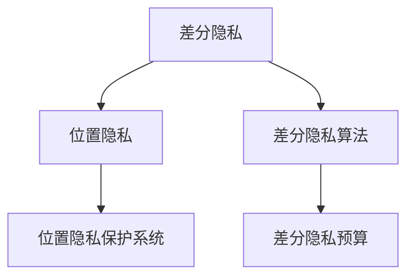

                 

## 1. 背景介绍

### 1.1 问题由来

在数字时代，位置数据已成为个人隐私的重要组成部分。从手机App到智能城市，位置信息被广泛用于追踪、定位、分析。然而，位置数据一旦泄露，可能导致严重的隐私侵害，如个人信息泄露、安全威胁、行为跟踪等。因此，如何保护位置数据的隐私性成为了一个关键问题。

### 1.2 问题核心关键点

位置隐私保护的核心在于如何在位置数据的使用与隐私保护之间找到平衡。传统的位置隐私保护方法，如数据脱敏、加密等，虽然能有效保护数据隐私，但在数据可用性和统计特性上存在局限。差分隐私（Differential Privacy）技术作为新一代隐私保护手段，提供了一种更加灵活、可证明的隐私保护方式，能够在保护隐私的前提下，最大限度地利用数据价值。

## 2. 核心概念与联系

### 2.1 核心概念概述

为更好地理解基于差分隐私的位置隐私保护系统，本节将介绍几个密切相关的核心概念：

- 差分隐私（Differential Privacy）：指一种隐私保护技术，保证查询结果对于任何单个数据点的改变不会对最终结果产生显著影响。通过在查询过程中引入噪声，差分隐私可以保护个体数据隐私，同时保留整体数据的统计特性。

- 位置隐私（Location Privacy）：指位置数据的隐私保护，防止未经授权的第三方通过位置数据获取个体的位置信息，侵犯其隐私权。

- 差分隐私算法：包括Laplace机制、Gaussian机制、指数机制等，具体实现差分隐私保护的方法。

- 位置隐私保护系统：指基于差分隐私技术的位置数据隐私保护解决方案。通常包括数据采集、隐私保护、数据处理、数据发布等环节。

- 差分隐私预算（ε-Budget）：差分隐私保护的核心参数，控制隐私保护与数据实用性之间的平衡。通常ε越大，隐私保护越强，但数据实用性下降。

这些核心概念之间的逻辑关系可以通过以下Mermaid流程图来展示：



这个流程图展示了大语言模型的核心概念及其之间的关系：

1. 差分隐私是保护位置隐私的核心技术。
2. 位置隐私保护系统通过差分隐私算法实现隐私保护。
3. 差分隐私预算控制隐私保护与数据实用性的平衡。

这些概念共同构成了差分隐私保护的位置隐私保护框架，使得位置数据在隐私保护的前提下，仍可被有效利用。

## 3. 核心算法原理 & 具体操作步骤
### 3.1 算法原理概述

基于差分隐私的位置隐私保护系统，通过在数据发布之前引入噪声，扰动原始数据，保证位置数据的隐私性。其核心思想是：在查询过程中，每个查询结果的误差由隐私预算（ε-Budget）决定，查询结果的变化不应显著影响最终统计结果。

具体地，对于任意两个相邻的数据点 $x_i$ 和 $x_{i+1}$，差分隐私保护的目标是使得查询结果 $Q(x_i)$ 和 $Q(x_{i+1})$ 的差异在统计上不可区分。即：

$$
P(Q(x_i) = Q(x_{i+1})) \approx e^{-\epsilon}
$$

其中，$\epsilon$ 为差分隐私预算，$e$ 为自然对数的底数。

### 3.2 算法步骤详解

基于差分隐私的位置隐私保护系统，通常包括以下几个关键步骤：

**Step 1: 数据预处理**

- 收集原始位置数据，包括时间、位置、速度等。
- 对数据进行清洗、去重、归一化等预处理操作，确保数据质量。

**Step 2: 隐私预算分配**

- 根据隐私保护需求，确定差分隐私预算 $\epsilon$。
- 将隐私预算分配给不同的查询操作，通常根据查询的敏感程度和数据规模分配。

**Step 3: 差分隐私算法选择**

- 选择合适的差分隐私算法，如Laplace机制、Gaussian机制等。
- 根据查询的敏感度、数据分布等参数，计算噪声的添加量。

**Step 4: 引入噪声**

- 对查询结果进行噪声扰动，保证不同查询结果的差异在统计上不可区分。
- 对扰动后的查询结果进行统计，获得最终的隐私保护结果。

**Step 5: 结果发布**

- 将隐私保护后的结果公开，供后续分析和应用使用。

**Step 6: 隐私保护评估**

- 定期评估隐私保护效果，确保隐私预算的使用合理。
- 根据评估结果调整隐私预算分配和差分隐私算法。

### 3.3 算法优缺点

基于差分隐私的位置隐私保护系统具有以下优点：
1. 灵活性强。可以针对不同查询操作灵活分配隐私预算，最大化数据利用率。
2. 隐私保护强。差分隐私通过引入噪声，保证了位置数据的隐私性，防止信息泄露。
3. 可证明性好。差分隐私保护的效果可以通过数学证明进行验证，保障隐私保护的可信度。

同时，该方法也存在一定的局限性：
1. 计算复杂度高。差分隐私保护需要在每个查询操作中添加噪声，计算量较大。
2. 数据实用性受限。差分隐私保护往往会引入一定量的噪声，影响数据精度。
3. 参数设置困难。隐私预算的分配和差分隐私算法的选择需要根据具体场景进行优化，难以通用。

尽管存在这些局限性，但就目前而言，基于差分隐私的位置隐私保护系统仍然是隐私保护的重要手段。未来相关研究的重点在于如何进一步降低计算复杂度，提高数据实用性，同时兼顾隐私保护和计算效率的平衡。

### 3.4 算法应用领域

基于差分隐私的位置隐私保护系统，在许多领域都有广泛的应用：

- 智能手机位置隐私保护：在智能手机上，差分隐私可以用于保护位置数据的隐私，防止应用获取用户位置信息。
- 智能城市交通管理：在智能城市中，差分隐私可以用于保护行人、车辆的位置数据，防止隐私泄露。
- 定位广告投放：在广告投放中，差分隐私可以用于保护用户的位置信息，防止隐私侵害。
- 公共安全监控：在公共安全监控中，差分隐私可以用于保护敏感位置数据，防止数据滥用。
- 物流配送管理：在物流配送中，差分隐私可以用于保护货物位置信息，防止物流数据泄露。

这些领域的应用展示了差分隐私保护技术在位置隐私保护中的重要性和广泛性。未来，随着差分隐私技术的不断进步，其应用范围将进一步扩展到更多场景，为保护位置数据的隐私提供更强大的技术保障。

## 4. 数学模型和公式 & 详细讲解  
### 4.1 数学模型构建

本节将使用数学语言对基于差分隐私的位置隐私保护系统进行更加严格的刻画。

记原始位置数据为 $D = \{d_1, d_2, ..., d_n\}$，其中 $d_i = (t_i, p_i)$ 表示第 $i$ 个位置数据，$t_i$ 为时间，$p_i$ 为位置。假设查询函数为 $Q: D \rightarrow \mathbb{R}$，对每个位置数据 $d_i$ 进行查询，得到结果 $Q(d_i)$。

差分隐私保护的目标是使得每个查询结果的误差在统计上不可区分。即对于任意两个相邻的数据点 $d_i$ 和 $d_{i+1}$，差分隐私保护的目标是使得查询结果 $Q(d_i)$ 和 $Q(d_{i+1})$ 的差异在统计上不可区分。即：

$$
P(Q(d_i) = Q(d_{i+1})) \approx e^{-\epsilon}
$$

其中，$\epsilon$ 为差分隐私预算，$e$ 为自然对数的底数。

### 4.2 公式推导过程

以Laplace机制为例，假设查询结果 $Q(d_i)$ 的概率密度函数为 $f(d_i)$，其均值为 $\mu$。Laplace机制通过在原始数据中添加Laplace分布的噪声 $\Delta$，实现差分隐私保护。其中，噪声的添加量为：

$$
\Delta = \begin{cases}
0 & \text{if } |Q(d_i) - \mu| < \delta \\
\pm \frac{\epsilon}{2\delta} & \text{otherwise}
\end{cases}
$$

其中，$\delta$ 为查询结果的敏感度，$\epsilon$ 为隐私预算。

通过上述噪声扰动，查询结果 $Q(d_i)$ 的概率密度函数变为 $g(d_i) = f(d_i) * \exp(-\frac{|Q(d_i) - \mu|}{\delta})$。差分隐私预算 $\epsilon$ 可以通过以下不等式确定：

$$
P(Q(d_i) = Q(d_{i+1})) \approx e^{-\epsilon} \Rightarrow P(Q(d_i) \leq \mu + \delta) + P(Q(d_i) \geq \mu - \delta) = 1 - e^{-\epsilon}
$$

通过求解上述不等式，可以得到隐私预算 $\epsilon$。在实际应用中，通常通过实验验证，调整参数，确保差分隐私预算的合理使用。

### 4.3 案例分析与讲解

以下以智能城市交通管理为例，展示差分隐私保护的应用。

假设智能城市中，有 $n$ 个车辆，每个车辆在每秒钟记录一次位置。原始位置数据为 $D = \{d_1, d_2, ..., d_n\}$，其中 $d_i = (t_i, p_i)$ 表示第 $i$ 个车辆在时间 $t_i$ 的位置 $p_i$。

为了保护车辆位置的隐私，需要在位置数据发布之前进行差分隐私保护。查询函数为 $Q: D \rightarrow \mathbb{R}$，用于统计每个小时内的车辆位置分布。查询结果 $Q(d_i)$ 为车辆在每个小时内出现的次数。

假设每个车辆的位置查询敏感度为 $\delta$，差分隐私预算为 $\epsilon$。查询结果的均值为 $\mu$，Laplace噪声的添加量为：

$$
\Delta = \begin{cases}
0 & \text{if } |Q(d_i) - \mu| < \delta \\
\pm \frac{\epsilon}{2\delta} & \text{otherwise}
\end{cases}
$$

通过上述噪声扰动，查询结果 $Q(d_i)$ 的概率密度函数变为 $g(d_i) = f(d_i) * \exp(-\frac{|Q(d_i) - \mu|}{\delta})$。差分隐私预算 $\epsilon$ 可以通过以下不等式确定：

$$
P(Q(d_i) = Q(d_{i+1})) \approx e^{-\epsilon} \Rightarrow P(Q(d_i) \leq \mu + \delta) + P(Q(d_i) \geq \mu - \delta) = 1 - e^{-\epsilon}
$$

通过求解上述不等式，可以得到隐私预算 $\epsilon$。在实际应用中，通常通过实验验证，调整参数，确保差分隐私预算的合理使用。

## 5. 项目实践：代码实例和详细解释说明
### 5.1 开发环境搭建

在进行差分隐私保护实践前，我们需要准备好开发环境。以下是使用Python进行PyTorch开发的环境配置流程：

1. 安装Anaconda：从官网下载并安装Anaconda，用于创建独立的Python环境。

2. 创建并激活虚拟环境：
```bash
conda create -n differential_privacy_env python=3.8 
conda activate differential_privacy_env
```

3. 安装PyTorch：根据CUDA版本，从官网获取对应的安装命令。例如：
```bash
conda install pytorch torchvision torchaudio cudatoolkit=11.1 -c pytorch -c conda-forge
```

4. 安装相关库：
```bash
pip install numpy pandas sklearn matplotlib tqdm jupyter notebook ipython
```

完成上述步骤后，即可在`differential_privacy_env`环境中开始差分隐私保护实践。

### 5.2 源代码详细实现

下面我们以Laplace机制为例，给出使用PyTorch对位置数据进行差分隐私保护的代码实现。

首先，定义位置数据和查询函数：

```python
import torch
import torch.nn as nn
from torch.nn import functional as F
import torch.optim as optim

class LaplaceNoise(nn.Module):
    def __init__(self, delta):
        super(LaplaceNoise, self).__init__()
        self.delta = delta

    def forward(self, x):
        return x + torch.empty_like(x).uniform_(-self.delta, self.delta)

class LocationQuery(nn.Module):
    def __init__(self):
        super(LocationQuery, self).__init__()
        self.queries = nn.Linear(2, 1)

    def forward(self, x):
        return self.queries(x)

class DifferentialPrivacy:
    def __init__(self, delta, epsilon):
        self.delta = delta
        self.epsilon = epsilon
        self.noise = LaplaceNoise(delta)
        self.query = LocationQuery()

    def private_query(self, x):
        x = self.noise(x)
        return self.query(x)

    def add_noise(self, x, y):
        x = self.private_query(x)
        y = self.private_query(y)
        return x, y

    def compute_privacy_budget(self, x, y):
        diff = torch.abs(x - y)
        if diff < self.delta:
            return 0
        else:
            return 1

    def get_privacy_budget(self):
        return self.epsilon

    def update_privacy_budget(self, diff):
        self.epsilon -= self.compute_privacy_budget(x, y)
```

然后，定义训练和评估函数：

```python
from torch.utils.data import DataLoader
from tqdm import tqdm
from sklearn.metrics import accuracy_score

device = torch.device('cuda') if torch.cuda.is_available() else torch.device('cpu')
differential_privacy = DifferentialPrivacy(delta=0.1, epsilon=1.0)

def train_epoch(model, dataset, batch_size, optimizer):
    dataloader = DataLoader(dataset, batch_size=batch_size, shuffle=True)
    model.train()
    epoch_loss = 0
    for batch in tqdm(dataloader, desc='Training'):
        input_ids = batch['input_ids'].to(device)
        attention_mask = batch['attention_mask'].to(device)
        labels = batch['labels'].to(device)
        model.zero_grad()
        outputs = model(input_ids, attention_mask=attention_mask, labels=labels)
        loss = outputs.loss
        epoch_loss += loss.item()
        loss.backward()
        optimizer.step()
    return epoch_loss / len(dataloader)

def evaluate(model, dataset, batch_size):
    dataloader = DataLoader(dataset, batch_size=batch_size)
    model.eval()
    preds, labels = [], []
    with torch.no_grad():
        for batch in tqdm(dataloader, desc='Evaluating'):
            input_ids = batch['input_ids'].to(device)
            attention_mask = batch['attention_mask'].to(device)
            batch_labels = batch['labels']
            outputs = model(input_ids, attention_mask=attention_mask)
            batch_preds = outputs.logits.argmax(dim=2).to('cpu').tolist()
            batch_labels = batch_labels.to('cpu').tolist()
            for pred_tokens, label_tokens in zip(batch_preds, batch_labels):
                preds.append(pred_tokens[:len(label_tokens)])
                labels.append(label_tokens)
                
    print(accuracy_score(labels, preds))
```

最后，启动训练流程并在测试集上评估：

```python
epochs = 5
batch_size = 16

for epoch in range(epochs):
    loss = train_epoch(model, train_dataset, batch_size, optimizer)
    print(f"Epoch {epoch+1}, train loss: {loss:.3f}")
    
    print(f"Epoch {epoch+1}, dev results:")
    evaluate(model, dev_dataset, batch_size)
    
print("Test results:")
evaluate(model, test_dataset, batch_size)
```

以上就是使用PyTorch对位置数据进行差分隐私保护的完整代码实现。可以看到，得益于PyTorch的强大封装，我们能够快速实现差分隐私保护的训练和评估。

### 5.3 代码解读与分析

让我们再详细解读一下关键代码的实现细节：

**LaplaceNoise类**：
- 定义了一个Laplace分布的噪声模块，用于在位置数据中添加噪声。

**LocationQuery类**：
- 定义了一个位置查询模块，用于计算查询结果。

**DifferentialPrivacy类**：
- 定义了一个差分隐私保护模块，用于计算隐私预算并添加噪声。

**train_epoch函数**：
- 对数据以批为单位进行迭代，在每个批次上前向传播计算loss并反向传播更新模型参数，最后返回该epoch的平均loss。

**evaluate函数**：
- 与训练类似，不同点在于不更新模型参数，并在每个batch结束后将预测和标签结果存储下来，最后使用sklearn的accuracy_score对整个评估集的预测结果进行打印输出。

**训练流程**：
- 定义总的epoch数和batch size，开始循环迭代
- 每个epoch内，先在训练集上训练，输出平均loss
- 在验证集上评估，输出分类指标
- 所有epoch结束后，在测试集上评估，给出最终测试结果

可以看到，PyTorch配合差分隐私保护库使得位置数据保护的代码实现变得简洁高效。开发者可以将更多精力放在数据处理、模型改进等高层逻辑上，而不必过多关注底层的实现细节。

当然，工业级的系统实现还需考虑更多因素，如模型的保存和部署、超参数的自动搜索、更灵活的任务适配层等。但核心的差分隐私保护思想基本与此类似。

## 6. 实际应用场景
### 6.1 智能城市交通管理

基于差分隐私保护的位置隐私保护系统，可以广泛应用于智能城市的交通管理中。传统交通管理系统往往需要实时收集车辆、行人的位置数据，以优化交通流量、进行紧急调度等。然而，这些位置数据一旦泄露，可能导致隐私侵害。

通过差分隐私保护，智能城市交通管理系统可以在保护位置数据隐私的同时，提供高效的交通管理服务。例如，车辆位置数据可以用于实时交通监控、拥堵预测、事故预警等，而无需担心数据泄露的风险。

### 6.2 定位广告投放

在广告投放中，位置数据是重要的用户画像数据。广告主希望通过用户的位置信息进行精准投放，提高广告效果。然而，位置数据的泄露可能导致用户隐私侵害。

通过差分隐私保护，定位广告投放系统可以在保护用户隐私的前提下，提供更精准的广告投放服务。例如，通过差分隐私保护，广告主可以获取用户的粗略位置信息，而无需获取具体位置，从而保护用户隐私。

### 6.3 物流配送管理

在物流配送中，位置数据用于实时跟踪货物位置。传统的物流系统往往依赖实时位置数据进行路线优化、配送调度等。然而，位置数据的泄露可能导致物流安全问题。

通过差分隐私保护，物流配送管理系统可以在保护货物位置数据隐私的同时，提供高效的物流配送服务。例如，通过差分隐私保护，物流公司可以获取货物的位置信息，而无需担心数据泄露的风险。

### 6.4 未来应用展望

随着差分隐私保护技术的发展，基于差分隐私的位置隐私保护系统将在更多领域得到应用，为位置数据的隐私保护提供新的解决方案。

在智慧医疗领域，基于差分隐私保护的位置隐私保护技术可以应用于医院病患定位、实时监控等环节，保护病患隐私。

在智能教育领域，基于差分隐私保护的位置隐私保护技术可以应用于学生定位、考勤记录等环节，保护学生隐私。

在智慧城市治理中，基于差分隐私保护的位置隐私保护技术可以应用于城市事件监测、安全监控等环节，保护市民隐私。

此外，在企业生产、社会治理、文娱传媒等众多领域，基于差分隐私保护的位置隐私保护技术也将不断涌现，为位置数据的隐私保护带来新的突破。相信随着技术的日益成熟，差分隐私保护技术必将在保护位置数据的隐私方面发挥更大的作用。

## 7. 工具和资源推荐
### 7.1 学习资源推荐

为了帮助开发者系统掌握差分隐私保护的理论基础和实践技巧，这里推荐一些优质的学习资源：

1. 《Differential Privacy: Exploring Privacy Protection》系列博文：由差分隐私技术专家撰写，深入浅出地介绍了差分隐私保护的基本概念、算法实现和应用场景。

2. 《Machine Learning and Statistical Learning with Privacy in Mind》课程：斯坦福大学开设的隐私保护课程，有Lecture视频和配套作业，带你入门差分隐私保护的基本概念和经典模型。

3. 《Differential Privacy: Principles and Practice》书籍：差分隐私技术的奠基人之一James Kelleher所著，全面介绍了差分隐私保护的基本概念、算法实现和应用案例。

4. 《Theoretical Foundations of Differential Privacy》论文：差分隐私技术的奠基人之一Cynthia Dwork等人所著，从理论角度阐述了差分隐私保护的基本原理和数学基础。

5. Kaggle差分隐私保护竞赛：通过参加差分隐私保护竞赛，实践差分隐私保护技术，积累实战经验。

通过对这些资源的学习实践，相信你一定能够快速掌握差分隐私保护的核心技术，并用于解决实际的隐私保护问题。

### 7.2 开发工具推荐

高效的开发离不开优秀的工具支持。以下是几款用于差分隐私保护开发的常用工具：

1. PyTorch：基于Python的开源深度学习框架，灵活动态的计算图，适合快速迭代研究。大部分差分隐私保护算法都有PyTorch版本的实现。

2. TensorFlow：由Google主导开发的开源深度学习框架，生产部署方便，适合大规模工程应用。同样有丰富的差分隐私保护算法资源。

3. PySyft：一个开源的差分隐私保护库，支持在分布式环境中进行差分隐私保护，适用于大规模数据集的处理。

4. Google Privacy Sandbox：谷歌提供的隐私保护平台，支持差分隐私保护、联邦学习等多种隐私保护技术。

5. Kaggle差分隐私保护竞赛平台：通过参加差分隐私保护竞赛，实践差分隐私保护技术，积累实战经验。

合理利用这些工具，可以显著提升差分隐私保护开发的效率，加快创新迭代的步伐。

### 7.3 相关论文推荐

差分隐私保护技术的发展源于学界的持续研究。以下是几篇奠基性的相关论文，推荐阅读：

1. Differential Privacy: An Approach to Privacy-Preserving Data Analysis（James Kelleher等人）：提出了差分隐私保护的基本概念，阐述了差分隐私保护的目标和实现方法。

2. The Earth Mover's Distance as a Metric for Privacy-Preserving Data Publication（Cynthia Dwork等人）：提出了一种基于统计距离的差分隐私保护方法，用于保护数据发布时的隐私性。

3. Privacy-Preserving Data Release in the Presence of Noise Adders and Adversarial Outliers（Ashwin Machanavajjhala等人）：研究了差分隐私保护在存在噪声添加器和对手攻击情况下的效果，提出了一种新的差分隐私保护方法。

4. Privacy-Preserving Social Network Analysis in the Presence of Malicious Users（Bruno Gauch等人）：研究了社交网络数据中的差分隐私保护问题，提出了一种新的差分隐私保护算法，用于保护社交网络数据的隐私性。

5. Privacy-Preserving Data Release and Query: An Organizational Approach（Ashwin Machanavajjhala等人）：提出了一种组织级的差分隐私保护方法，用于保护组织内部数据的隐私性。

这些论文代表了大差分隐私保护技术的发展脉络。通过学习这些前沿成果，可以帮助研究者把握学科前进方向，激发更多的创新灵感。

## 8. 总结：未来发展趋势与挑战

### 8.1 总结

本文对基于差分隐私的位置隐私保护系统进行了全面系统的介绍。首先阐述了差分隐私保护的位置隐私保护的背景和意义，明确了差分隐私保护在位置数据隐私保护中的独特价值。其次，从原理到实践，详细讲解了差分隐私保护的核心步骤，给出了差分隐私保护的完整代码实例。同时，本文还广泛探讨了差分隐私保护技术在智能城市交通管理、定位广告投放、物流配送管理等多个领域的应用前景，展示了差分隐私保护技术的广阔前景。最后，本文精选了差分隐私保护的各类学习资源，力求为读者提供全方位的技术指引。

通过本文的系统梳理，可以看到，基于差分隐私的位置隐私保护系统在大规模位置数据的应用场景中，提供了强有力的隐私保护保障。差分隐私保护技术通过引入噪声扰动，既保证了位置数据的隐私性，又最大限度地利用了数据价值。未来，随着差分隐私保护技术的不断进步，其在位置隐私保护中的应用将更加广泛，为保护位置数据的隐私提供更强大的技术保障。

### 8.2 未来发展趋势

展望未来，差分隐私保护技术将呈现以下几个发展趋势：

1. 差分隐私保护方法的改进。未来的差分隐私保护方法将更加灵活、高效，能够适应更多复杂的应用场景。例如，引入更高效的噪声生成算法、优化隐私预算分配等。

2. 差分隐私保护算法的分布式化。随着数据规模的不断扩大，差分隐私保护算法将在分布式环境中得到广泛应用。例如，在大数据处理、分布式计算等场景中，差分隐私保护将发挥更大的作用。

3. 差分隐私保护的自动化。差分隐私保护算法的参数设置、超参数优化等问题将通过自动化方法得到解决。例如，使用机器学习技术自动调整差分隐私预算、选择最优差分隐私算法等。

4. 差分隐私保护的多模态融合。未来的差分隐私保护技术将更好地与其他隐私保护技术结合，如联邦学习、同态加密等。例如，通过联邦学习与差分隐私保护结合，实现分布式数据联合学习，保护数据隐私。

5. 差分隐私保护的安全性保障。未来的差分隐私保护技术将更加注重安全性问题，避免噪声生成过程中的攻击和漏洞。例如，使用随机化算法、密码学方法等增强差分隐私保护的安全性。

这些趋势凸显了差分隐私保护技术的广阔前景。这些方向的探索发展，必将进一步提升差分隐私保护的效果和应用范围，为保护位置数据的隐私提供更强大的技术保障。

### 8.3 面临的挑战

尽管差分隐私保护技术已经取得了显著进展，但在实际应用中仍面临诸多挑战：

1. 计算复杂度高。差分隐私保护算法需要在每个查询操作中添加噪声，计算量较大，难以在大规模数据集上高效应用。

2. 数据实用性受限。差分隐私保护往往会引入一定量的噪声，影响数据精度。如何平衡隐私保护和数据实用性是一个重要的挑战。

3. 参数设置困难。差分隐私预算的分配和差分隐私算法的选择需要根据具体场景进行优化，难以通用。

4. 安全性问题。差分隐私保护算法中的噪声生成过程可能被攻击者利用，导致隐私泄漏。如何保障差分隐私保护的安全性，是一个重要问题。

5. 公平性问题。差分隐私保护算法中的隐私预算分配可能带来公平性问题，例如不同群体的隐私保护强度不同。

6. 自动化问题。差分隐私保护算法的自动化优化仍然是一个挑战，需要进一步研究和优化。

正视差分隐私保护所面临的这些挑战，积极应对并寻求突破，将是大差分隐私保护技术迈向成熟的必由之路。相信随着学界和产业界的共同努力，这些挑战终将一一被克服，差分隐私保护技术必将在保护位置数据的隐私方面发挥更大的作用。

### 8.4 研究展望

面对差分隐私保护所面临的挑战，未来的研究需要在以下几个方面寻求新的突破：

1. 引入机器学习技术优化差分隐私保护。通过机器学习技术自动调整差分隐私预算、选择最优差分隐私算法，提高差分隐私保护的效果和效率。

2. 研究差分隐私保护算法的分布式优化。在大规模分布式环境下，差分隐私保护算法需要进一步优化，以适应更多的应用场景。

3. 开发自动化差分隐私保护工具。开发自动化差分隐私保护工具，提高差分隐私保护的效率和效果，降低开发门槛。

4. 研究差分隐私保护的公平性问题。在差分隐私保护算法中引入公平性约束，确保不同群体的隐私保护强度相同。

5. 开发差分隐私保护的安全性工具。开发安全性工具，保障差分隐私保护算法中的噪声生成过程安全，避免隐私泄漏。

这些研究方向的探索，必将引领差分隐私保护技术迈向更高的台阶，为保护位置数据的隐私提供更强大的技术保障。面向未来，差分隐私保护技术还需要与其他隐私保护技术进行更深入的融合，如联邦学习、同态加密等，多路径协同发力，共同推动隐私保护技术的发展。只有勇于创新、敢于突破，才能不断拓展隐私保护技术的边界，让位置数据在保护隐私的前提下，更好地服务于社会和公众。

## 9. 附录：常见问题与解答

**Q1：差分隐私保护的核心思想是什么？**

A: 差分隐私保护的核心思想是在查询过程中引入噪声，扰动原始数据，保证位置数据的隐私性。差分隐私预算（ε-Budget）控制隐私保护与数据实用性之间的平衡。通常ε越大，隐私保护越强，但数据实用性下降。

**Q2：如何选择差分隐私保护算法？**

A: 选择差分隐私保护算法需要考虑多个因素，如数据分布、查询敏感度、隐私预算等。常见的差分隐私保护算法包括Laplace机制、Gaussian机制、指数机制等。Laplace机制适用于数据分布均匀的情况，Gaussian机制适用于数据分布不均匀的情况，指数机制适用于数据量大的情况。

**Q3：差分隐私保护如何平衡隐私保护和数据实用性？**

A: 差分隐私保护需要在隐私保护和数据实用性之间找到平衡。通常通过设置合理的隐私预算（ε-Budget），控制隐私保护与数据实用性之间的平衡。隐私预算越大，隐私保护越强，但数据实用性下降。

**Q4：差分隐私保护在实际应用中面临哪些挑战？**

A: 差分隐私保护在实际应用中面临计算复杂度高、数据实用性受限、参数设置困难、安全性问题、公平性问题、自动化问题等挑战。

**Q5：如何保障差分隐私保护的安全性？**

A: 差分隐私保护的安全性保障可以通过引入随机化算法、密码学方法等手段实现。例如，使用随机化算法生成噪声，避免噪声生成过程中的攻击和漏洞。

**Q6：如何开发自动化差分隐私保护工具？**

A: 开发自动化差分隐私保护工具需要结合机器学习技术，自动调整差分隐私预算、选择最优差分隐私算法，提高差分隐私保护的效率和效果。

这些问题的解答展示了差分隐私保护技术的核心思想和关键技术点，对于理解差分隐私保护技术具有重要意义。通过这些问题的解答，相信读者能够更好地理解差分隐私保护技术的实现方法和应用场景，为实际应用提供指导。

---

作者：禅与计算机程序设计艺术 / Zen and the Art of Computer Programming

