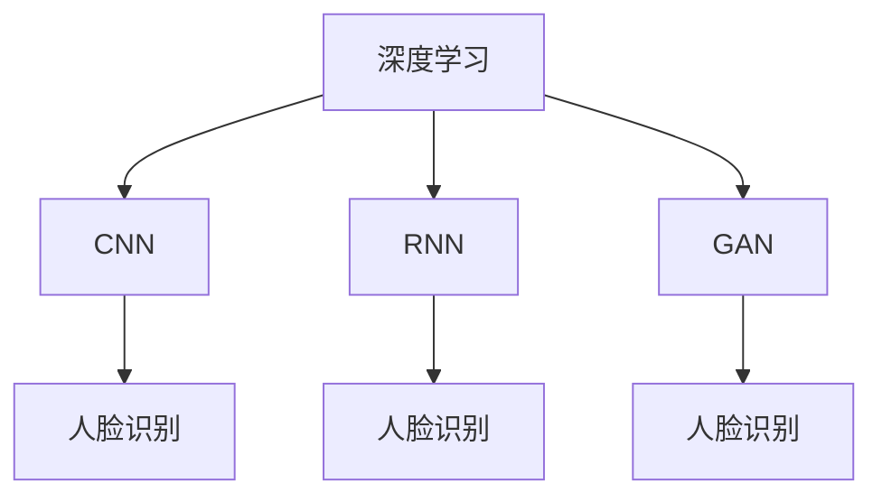

                 

# 基于深度学习的人脸识别

## 1. 背景介绍

### 1.1 问题由来
随着科技的不断进步，人脸识别技术成为了安全、身份验证等领域的重要工具。传统的基于特征提取和模板匹配的人脸识别方法，虽然有一定的识别准确率，但存在算法复杂度高、易受光照、姿态、表情变化影响等问题。基于深度学习的人脸识别方法，利用卷积神经网络(CNN)、循环神经网络(RNN)、生成对抗网络(GAN)等模型，可以从原始图像中学习更高级别的特征表示，并构建更加鲁棒的分类器，从而大幅提升识别精度和鲁棒性。

近年来，深度学习在人脸识别领域取得了显著进展，开源深度学习框架如TensorFlow、PyTorch等，提供了丰富的预训练模型和高效的训练接口，使得基于深度学习的人脸识别应用变得更加容易实现和部署。

### 1.2 问题核心关键点
人脸识别问题的核心在于如何将高维、复杂的图像数据，映射到低维、可区分的特征空间。主要的技术挑战包括：

- 数据多样性：人脸在不同光照、姿态、表情、遮挡等条件下的变化，对模型提出了较高的适应性要求。
- 特征表示：如何从原始像素级特征中学习到对识别任务有帮助的高级特征表示，是深度学习模型面临的重要问题。
- 模型设计：选择合适的深度学习架构和训练策略，提高模型的泛化能力和鲁棒性。
- 实际应用：如何将深度学习模型与实际场景结合，进行高效、准确的人脸识别。

这些关键点构成了人脸识别技术的研究主线，驱动着相关算法和模型的不懈探索。

## 2. 核心概念与联系

### 2.1 核心概念概述

为更好地理解基于深度学习的人脸识别方法，本节将介绍几个密切相关的核心概念：

- 深度学习：一种模拟人脑神经网络的学习算法，通过多层神经元之间的非线性映射，从大量数据中学习到高层次的特征表示。
- 卷积神经网络(CNN)：一种专门处理图像数据的网络结构，通过卷积操作提取局部特征，并通过池化操作降低特征维度，适合于图像分类、目标检测等任务。
- 循环神经网络(RNN)：一种处理序列数据的神经网络结构，通过记忆单元和门控机制，能够捕捉数据的时序关系，适合于语音识别、文本生成等任务。
- 生成对抗网络(GAN)：一种生成模型和判别模型相互博弈的结构，能够生成逼真的人脸图像，增强数据样本的多样性，提高模型泛化能力。
- 人脸识别：利用深度学习模型，从图像中提取高层次特征，并进行分类识别，从而实现身份验证、监控等任务。

这些核心概念之间的逻辑关系可以通过以下Mermaid流程图来展示：



这个流程图展示了几大核心概念之间的关联：

1. 深度学习是CNN、RNN、GAN等模型的基础。
2. CNN、RNN、GAN等模型都可以用于人脸识别，通过不同的特征表示和模型设计，提升识别精度和鲁棒性。
3. 人脸识别是人脸验证、监控等实际应用的重要技术。

## 3. 核心算法原理 & 具体操作步骤
### 3.1 算法原理概述

基于深度学习的人脸识别，主要依赖于深度神经网络模型来提取和分类人脸特征。其核心思想是：利用大量带标签的人脸数据，通过反向传播算法优化模型参数，使得模型能够从原始像素级特征中学习到对识别任务有帮助的高级特征表示，并构建一个有效的分类器，以区分不同的人脸。

具体而言，人脸识别可以分为两个主要步骤：

1. 特征提取：利用卷积神经网络等模型，将原始人脸图像映射到高维特征空间，提取有用的特征表示。
2. 分类识别：利用全连接层或支持向量机等模型，对提取的特征进行分类，实现对不同人脸的识别。

### 3.2 算法步骤详解

基于深度学习的人脸识别主要包括以下几个关键步骤：

**Step 1: 数据预处理**
- 收集大量带标签的人脸数据集，通常包括不同光照、姿态、表情、遮挡等条件下的正面、侧面和倾斜角度的人脸图像。
- 对图像进行预处理，包括尺寸归一化、灰度化、裁剪等操作，以提升后续模型的输入质量。

**Step 2: 网络设计**
- 选择合适的深度学习网络架构，如卷积神经网络(CNN)、循环神经网络(RNN)、生成对抗网络(GAN)等，用于提取人脸特征。
- 设计合适的网络层结构，包括卷积层、池化层、激活函数、归一化层等，以确保模型的特征提取能力。
- 选择适当的正则化方法，如Dropout、L2正则化等，防止模型过拟合。

**Step 3: 模型训练**
- 准备训练集和验证集，将数据集划分为训练集和验证集。
- 使用反向传播算法和随机梯度下降等优化算法，对模型进行训练。
- 在验证集上评估模型的性能，根据评估结果调整模型参数。

**Step 4: 模型评估与测试**
- 准备测试集，将模型在未见过的数据上进行测试，评估模型的泛化能力。
- 计算模型的识别准确率、误判率等性能指标，进行结果分析。

**Step 5: 实际应用**
- 将训练好的模型部署到实际应用场景中，进行人脸验证、监控等任务。
- 实时采集图像数据，对采集的人脸图像进行特征提取和分类，输出识别结果。

以上是基于深度学习的人脸识别的一般流程。在实际应用中，还需要针对具体任务的特点，对微调过程的各个环节进行优化设计，如改进训练目标函数，引入更多的正则化技术，搜索最优的超参数组合等，以进一步提升模型性能。

### 3.3 算法优缺点

基于深度学习的人脸识别方法具有以下优点：
1. 高识别精度：深度学习模型可以从高维数据中学习到丰富的特征表示，提高人脸识别的准确率。
2. 鲁棒性较好：深度模型能够适应不同光照、姿态、表情、遮挡等变化，具有一定的鲁棒性。
3. 可扩展性强：基于深度学习的人脸识别模型，可以通过添加更多层、更宽的网络架构等手段，提高识别精度。
4. 可迁移性好：深度学习模型可以作为预训练模型，应用于不同场景、不同任务中。

同时，该方法也存在一些局限性：
1. 数据需求高：深度学习模型需要大量标注数据进行训练，标注成本较高。
2. 模型复杂度高：深度神经网络模型较复杂，计算资源和训练时间需求较高。
3. 鲁棒性仍有不足：面对极端光照、姿态、表情变化时，深度模型的鲁棒性仍有待提升。
4. 可解释性差：深度学习模型是"黑盒"系统，难以解释其内部工作机制和决策逻辑。

尽管存在这些局限性，但就目前而言，基于深度学习的人脸识别方法仍是最主流范式。未来相关研究的重点在于如何进一步降低数据需求，提高模型的迁移能力，同时兼顾可解释性和鲁棒性等因素。

### 3.4 算法应用领域

基于深度学习的人脸识别方法在多个领域得到了广泛应用，例如：

- 安防监控：在公共场所部署人脸识别系统，进行身份验证、异常检测、报警等功能。
- 身份验证：应用于金融、司法、移民等场景，进行身份验证和授权。
- 人脸解锁：应用于智能手机、智能门锁等设备，实现快速解锁和防盗。
- 人脸搜索：在社交媒体、电商平台等场景中，进行人脸搜索和推荐。
- 视频监控：在智能视频监控中，进行人脸识别和行为分析。

除了上述这些经典应用外，基于深度学习的人脸识别技术还在越来越多的场景中发挥作用，为人们的生活带来了便利和安全保障。

## 4. 数学模型和公式 & 详细讲解  
### 4.1 数学模型构建

本节将使用数学语言对基于深度学习的人脸识别过程进行更加严格的刻画。

设原始人脸图像为 $I \in \mathbb{R}^{H \times W \times C}$，其中 $H$、$W$、$C$ 分别为图像的高、宽、通道数。人脸识别任务的目标是将 $I$ 映射到一个 $D$ 维的特征向量 $F \in \mathbb{R}^{D}$，并根据 $F$ 进行分类识别。

定义卷积神经网络模型为 $F = \mathcal{C}(I)$，其中 $\mathcal{C}$ 为卷积神经网络模型，$I$ 为输入图像，$F$ 为特征向量。假设 $F$ 经过归一化层、池化层、全连接层等处理后，输入到一个Softmax层 $S$，用于分类识别：

$$
\text{Prob}(\text{Person}_k|I) = S(F)
$$

其中 $\text{Prob}(\text{Person}_k|I)$ 表示输入图像 $I$ 属于第 $k$ 个人脸的概率。

在模型训练阶段，我们通常使用交叉熵损失函数来衡量预测结果与真实标签之间的差异：

$$
\mathcal{L}(\theta) = -\frac{1}{N}\sum_{i=1}^N \sum_{k=1}^K y_k \log \text{Prob}(\text{Person}_k|I_i)
$$

其中 $y_k$ 表示第 $i$ 个人的标签，$K$ 表示类别数。目标是最小化损失函数 $\mathcal{L}$，即：

$$
\theta^* = \mathop{\arg\min}_{\theta} \mathcal{L}(\theta)
$$

在模型评估阶段，我们通常使用准确率(Accuracy)来衡量模型的识别性能：

$$
\text{Accuracy} = \frac{1}{N}\sum_{i=1}^N \sum_{k=1}^K \delta(\text{Person}_k|I_i)
$$

其中 $\delta(\text{Person}_k|I_i) = 1$ 表示预测正确，$0$ 表示预测错误。

### 4.2 公式推导过程

以下是人脸识别中常用的交叉熵损失函数及其梯度计算公式：

$$
\mathcal{L}(\theta) = -\frac{1}{N}\sum_{i=1}^N \sum_{k=1}^K y_k \log \text{Prob}(\text{Person}_k|I_i)
$$

对损失函数 $\mathcal{L}$ 对模型参数 $\theta$ 求导，得到梯度：

$$
\frac{\partial \mathcal{L}(\theta)}{\partial \theta} = -\frac{1}{N}\sum_{i=1}^N \sum_{k=1}^K y_k \frac{\partial \log \text{Prob}(\text{Person}_k|I_i)}{\partial \theta}
$$

由于 $\text{Prob}(\text{Person}_k|I_i)$ 的计算依赖于卷积神经网络模型的输出，因此需要利用自动微分技术，递归计算其对模型参数的梯度。

## 5. 项目实践：代码实例和详细解释说明
### 5.1 开发环境搭建

在进行人脸识别开发前，我们需要准备好开发环境。以下是使用Python进行TensorFlow开发的环境配置流程：

1. 安装Anaconda：从官网下载并安装Anaconda，用于创建独立的Python环境。

2. 创建并激活虚拟环境：
```bash
conda create -n tf-env python=3.8 
conda activate tf-env
```

3. 安装TensorFlow：
```bash
pip install tensorflow
```

4. 安装TensorBoard：
```bash
pip install tensorboard
```

5. 安装PIL和OpenCV：
```bash
pip install Pillow opencv-python
```

完成上述步骤后，即可在`tf-env`环境中开始人脸识别实践。

### 5.2 源代码详细实现

下面我们以基于CNN的人脸识别任务为例，给出使用TensorFlow实现人脸识别的代码实现。

首先，定义CNN模型：

```python
import tensorflow as tf
from tensorflow.keras import layers

model = tf.keras.Sequential([
    layers.Conv2D(32, (3, 3), activation='relu', input_shape=(64, 64, 3)),
    layers.MaxPooling2D((2, 2)),
    layers.Conv2D(64, (3, 3), activation='relu'),
    layers.MaxPooling2D((2, 2)),
    layers.Flatten(),
    layers.Dense(128, activation='relu'),
    layers.Dense(7, activation='softmax')
])
```

然后，加载训练数据：

```python
import os
import numpy as np
from tensorflow.keras.preprocessing.image import ImageDataGenerator

train_datagen = ImageDataGenerator(rescale=1./255, validation_split=0.2)
train_generator = train_datagen.flow_from_directory(
        'train', 
        target_size=(64, 64),
        batch_size=32,
        class_mode='categorical',
        subset='training')

val_generator = train_datagen.flow_from_directory(
        'train', 
        target_size=(64, 64),
        batch_size=32,
        class_mode='categorical',
        subset='validation')
```

接着，定义损失函数和优化器：

```python
model.compile(optimizer='adam', loss='categorical_crossentropy', metrics=['accuracy'])

# 定义模型输入输出
x = tf.keras.layers.Input(shape=(64, 64, 3))
y = tf.keras.layers.Input(shape=(7,))
model = tf.keras.Model(inputs=[x, y], outputs=model(x))

# 定义数据增强
train_datagen = ImageDataGenerator(rescale=1./255, shear_range=0.2, zoom_range=0.2, horizontal_flip=True)
val_datagen = ImageDataGenerator(rescale=1./255)
```

最后，进行模型训练和评估：

```python
epochs = 20

model.fit(
        train_generator,
        steps_per_epoch=train_generator.n // train_generator.batch_size,
        epochs=epochs,
        validation_data=val_generator,
        validation_steps=val_generator.n // val_generator.batch_size)

test_datagen = ImageDataGenerator(rescale=1./255)
test_generator = test_datagen.flow_from_directory(
        'test', 
        target_size=(64, 64),
        batch_size=32,
        class_mode='categorical')

score = model.evaluate(test_generator, steps=test_generator.n // test_generator.batch_size)
print('Test loss:', score[0])
print('Test accuracy:', score[1])
```

以上就是使用TensorFlow实现基于CNN的人脸识别的完整代码实现。可以看到，TensorFlow的Keras API使得模型的构建和训练变得非常简单。

### 5.3 代码解读与分析

让我们再详细解读一下关键代码的实现细节：

**CNN模型定义**：
- 定义了包含卷积层、池化层、全连接层的标准CNN结构，用于提取人脸特征。
- 最后一层采用softmax激活函数，用于分类识别。

**数据加载**：
- 使用ImageDataGenerator进行数据增强，包括数据归一化、随机剪切、随机缩放、水平翻转等操作。
- 使用flow_from_directory方法，从目录中读取图像数据，并将其分为训练集和验证集。

**模型编译**：
- 使用adam优化器进行梯度更新，交叉熵损失函数用于衡量预测结果与真实标签之间的差异。
- 定义输入和输出，构建模型。

**训练和评估**：
- 指定训练轮数和验证集。
- 使用fit方法进行模型训练，并在验证集上评估模型性能。
- 加载测试集，进行模型评估，输出测试结果。

可以看到，TensorFlow提供了丰富的API，使得基于CNN的人脸识别模型的开发和训练变得非常简单。开发者可以专注于模型结构和训练策略的设计，而不必过多关注底层实现细节。

## 6. 实际应用场景
### 6.1 安防监控

基于深度学习的人脸识别技术在安防监控领域得到了广泛应用。通过在监控摄像头上部署人脸识别系统，可以实现实时身份验证、异常检测、实时报警等功能，大幅提升监控系统的安全性和智能性。

具体而言，可以将监控摄像头拍摄到的图像输入到人脸识别模型中，对采集的人脸图像进行特征提取和分类，实现对不同人脸的识别。对于识别出的可疑人员，系统可以实时报警，并提供更详细的信息进行追踪和分析。

### 6.2 身份验证

身份验证是深度学习在人脸识别中最为常见的应用场景之一。通过将待验证图像输入到训练好的模型中，可以实时进行人脸比对，快速验证用户身份，应用于金融、司法、移民等场景。

在金融行业，可以利用人脸识别技术进行用户身份验证，防止金融欺诈和钓鱼攻击。在司法行业，可以利用人脸识别技术进行罪犯识别和取证。在移民管理中，可以利用人脸识别技术进行入境人员的身份验证和身份认证。

### 6.3 人脸解锁

人脸解锁技术已经成为智能手机、智能门锁等设备的标配功能之一。通过采集用户的面部图像，输入到训练好的模型中进行比对，可以实现快速解锁，提高用户体验。

基于深度学习的人脸解锁技术具有高效、方便、安全等优点。相比于传统的密码解锁方式，人脸解锁技术可以减少密码泄漏和遗忘的风险，同时具有更高的安全性和准确性。

### 6.4 人脸搜索

人脸搜索技术已经在社交媒体、电商平台等场景中得到广泛应用。通过将待搜索人员的图像输入到人脸识别模型中，可以实时匹配到匹配度较高的照片，实现快速人脸搜索和识别。

例如，在社交媒体中，可以利用人脸搜索技术帮助用户快速找到朋友、家人等熟人。在电商平台中，可以利用人脸搜索技术实现商品推荐和广告投放。

### 6.5 视频监控

在智能视频监控中，人脸识别技术也得到了广泛应用。通过将监控摄像头拍摄到的视频流输入到人脸识别模型中，可以实现实时人脸检测、跟踪和识别。

例如，在公共场所的监控系统中，可以利用人脸识别技术识别可疑人员，防止暴力犯罪和偷窃等行为。在交通管理中，可以利用人脸识别技术识别车辆牌照和行人，实现交通流量分析和行为分析。

## 7. 工具和资源推荐
### 7.1 学习资源推荐

为了帮助开发者系统掌握基于深度学习的人脸识别技术，这里推荐一些优质的学习资源：

1. Deep Learning for Computer Vision by Christopher M. Bishop：讲解了深度学习在计算机视觉中的应用，包括人脸识别等任务。
2. Hands-On Machine Learning with Scikit-Learn, Keras, and TensorFlow by Aurélien Géron：介绍了机器学习和深度学习的基础知识和实现技术，适合初学者和进阶者。
3. Introduction to Deep Learning by Sanjay Ranka：深入浅出地介绍了深度学习的原理和应用，适合深度学习爱好者和从业者。
4. TensorFlow官方文档：提供了完整的TensorFlow教程和API文档，适合开发者快速上手实践。
5. PyTorch官方文档：提供了丰富的PyTorch教程和API文档，适合开发者使用深度学习框架进行开发。

通过这些资源的学习，相信你一定能够快速掌握基于深度学习的人脸识别技术，并用于解决实际的图像识别问题。

### 7.2 开发工具推荐

高效的开发离不开优秀的工具支持。以下是几款用于基于深度学习的人脸识别开发的常用工具：

1. TensorFlow：由Google主导开发的开源深度学习框架，生产部署方便，适合大规模工程应用。
2. PyTorch：基于Python的开源深度学习框架，灵活动态的计算图，适合快速迭代研究。
3. Keras：基于TensorFlow和Theano的高级深度学习API，简单易用，适合初学者快速上手。
4. OpenCV：开源计算机视觉库，提供了丰富的图像处理和分析工具，适合进行人脸图像的前处理和特征提取。
5. PIL：Python图像处理库，提供了丰富的图像处理和增强功能，适合进行图像预处理和后处理。

合理利用这些工具，可以显著提升基于深度学习的人脸识别任务的开发效率，加快创新迭代的步伐。

### 7.3 相关论文推荐

人脸识别技术的研究源于学界的持续探索。以下是几篇奠基性的相关论文，推荐阅读：

1. DeepFace：Face Recognition with Deep Feature Embeddings：提出了基于深度学习的人脸识别算法DeepFace，利用深度卷积网络进行特征提取和分类，刷新了人脸识别的精度记录。
2. FaceNet: A Unified Embedding for Face Recognition and Clustering：提出了FaceNet算法，通过将人脸特征映射到高维空间中，实现了高精度的全局人脸识别。
3. MLPM-based Face Recognition with Cross-modal Constraints：提出了MLPM方法，将特征表示和跨模态约束相结合，进一步提升了人脸识别的鲁棒性和泛化能力。
4. Global Pooling versus Global Averaging in Deep Face Recognition：探讨了特征池化方法对人脸识别的影响，证明了全局平均池化方法的优越性。
5. Enhancing Face Recognition via Anti-spoofing Training：提出了一种基于对抗学习的训练方法，通过生成对抗样本来增强人脸识别的鲁棒性和泛化能力。

这些论文代表了大规模深度学习模型在人脸识别领域的发展脉络。通过学习这些前沿成果，可以帮助研究者把握学科前进方向，激发更多的创新灵感。

## 8. 总结：未来发展趋势与挑战

### 8.1 总结

本文对基于深度学习的人脸识别方法进行了全面系统的介绍。首先阐述了人脸识别技术的研究背景和意义，明确了深度学习在人脸识别中的应用价值。其次，从原理到实践，详细讲解了人脸识别模型构建和训练的数学原理和关键步骤，给出了人脸识别任务开发的完整代码实例。同时，本文还广泛探讨了人脸识别技术在安防监控、身份验证、人脸解锁等多个行业领域的应用前景，展示了深度学习技术在人脸识别中的强大威力。

通过本文的系统梳理，可以看到，基于深度学习的人脸识别技术正在成为计算机视觉领域的重要范式，极大地拓展了人脸识别的应用边界，催生了更多的落地场景。得益于深度神经网络的强大特征提取能力，人脸识别技术能够在各种复杂环境中实现高效、准确的身份验证。未来，伴随深度学习模型的不断演进，人脸识别技术必将在更多领域得到广泛应用，为人们的生活带来更多便利和安全保障。

### 8.2 未来发展趋势

展望未来，基于深度学习的人脸识别技术将呈现以下几个发展趋势：

1. 模型规模持续增大。随着算力成本的下降和数据规模的扩张，深度学习模型的参数量还将持续增长。超大规模模型蕴含的丰富特征表示，将进一步提升人脸识别的精度和鲁棒性。
2. 多模态融合增强。除了图像数据外，未来的人脸识别系统还将融合语音、视频等多模态信息，形成更加全面、准确的人脸识别模型。
3. 隐私保护技术发展。人脸识别技术的应用将越来越注重隐私保护，未来将引入更多数据匿名化、差分隐私等技术，确保用户信息安全。
4. 对抗攻击防御。面对对抗样本攻击，未来的人脸识别系统将引入对抗训练、鲁棒性优化等手段，增强系统的鲁棒性和安全性。
5. 联邦学习推广。在数据隐私保护需求日益增长的背景下，联邦学习技术将得到更广泛的应用，通过分布式训练提升人脸识别模型的性能和鲁棒性。

这些趋势凸显了人脸识别技术的发展方向，为人工智能技术的应用提供了新的思路和路径。

### 8.3 面临的挑战

尽管基于深度学习的人脸识别技术已经取得了显著进展，但在迈向更加智能化、普适化应用的过程中，它仍面临着诸多挑战：

1. 数据需求高。深度学习模型需要大量标注数据进行训练，标注成本较高，且数据采集过程中涉及隐私和伦理问题。
2. 鲁棒性仍有不足。面对极端光照、姿态、表情变化时，深度模型的鲁棒性仍有待提升。对抗攻击和鲁棒性优化是未来的重要研究方向。
3. 可解释性差。深度学习模型是"黑盒"系统，难以解释其内部工作机制和决策逻辑，这限制了其在高风险领域的应用。
4. 计算资源需求高。深度学习模型计算复杂度高，对硬件资源需求较高，如何优化模型结构和计算效率，是未来的重要研究方向。
5. 隐私保护和伦理问题。人脸识别技术的应用过程中，需要重视数据隐私和用户隐私，建立良好的伦理规范。

这些挑战需要我们不断探索和解决，才能将人脸识别技术更好地应用于实际场景中，为人们的生活带来更多便利和安全保障。

### 8.4 研究展望

面对人脸识别技术面临的挑战，未来的研究需要在以下几个方面寻求新的突破：

1. 低数据量学习。探索无监督学习、半监督学习等方法，降低对人脸数据的依赖，提升模型在小样本情况下的鲁棒性和泛化能力。
2. 深度与浅层结合。结合浅层特征提取方法，如SIFT、HOG等，与深度神经网络模型进行互补，提升模型的鲁棒性和泛化能力。
3. 对抗攻击防御。引入对抗样本生成和对抗训练技术，增强人脸识别模型的鲁棒性和安全性。
4. 隐私保护技术。引入差分隐私、联邦学习等技术，保障人脸识别过程中用户隐私的安全。
5. 模型压缩与优化。采用模型压缩、稀疏化存储等技术，降低模型计算复杂度和内存占用，提升人脸识别系统的实时性和可扩展性。

这些研究方向将推动人脸识别技术的发展，促进其更广泛的应用。

## 9. 附录：常见问题与解答

**Q1：人脸识别技术能否应对多种光照、姿态、表情变化？**

A: 人脸识别技术可以通过多模态融合、对抗样本生成等手段，增强对光照、姿态、表情变化的适应能力。例如，结合深度学习模型和浅层特征提取方法，可以在不同光照、姿态下取得良好的识别效果。

**Q2：如何保护人脸识别过程中的隐私和伦理？**

A: 人脸识别技术的应用过程中，需要重视数据隐私和用户隐私，建立良好的伦理规范。建议采用差分隐私、联邦学习等技术，保障用户数据的安全性和隐私性。同时，建立透明、公正的使用规则，确保人脸识别技术的公正性和可解释性。

**Q3：深度学习模型在训练过程中如何避免过拟合？**

A: 深度学习模型在训练过程中，可以通过以下手段避免过拟合：
1. 数据增强：通过随机剪切、缩放、旋转、翻转等操作，扩充训练集。
2. 正则化：使用L2正则、Dropout等方法，防止模型过拟合。
3. 早停策略：在验证集上监测模型性能，当性能不再提升时停止训练。
4. 模型集成：通过集成多个模型的预测结果，提升模型的泛化能力。

这些方法可以结合使用，最大化提升深度学习模型的泛化能力和鲁棒性。

**Q4：如何优化基于深度学习的人脸识别系统的计算效率？**

A: 优化基于深度学习的人脸识别系统的计算效率，可以采用以下手段：
1. 模型压缩：通过剪枝、量化、蒸馏等方法，减少模型参数和计算量。
2. 模型并行：通过分布式训练、混合精度训练等方法，提高计算效率。
3. 硬件加速：利用GPU、TPU等硬件设备，提升模型计算速度。
4. 算法优化：通过优化算法实现，如激活函数优化、梯度优化等，提高模型训练和推理效率。

这些方法可以结合使用，提升基于深度学习的人脸识别系统的计算效率和实时性。

---

作者：禅与计算机程序设计艺术 / Zen and the Art of Computer Programming

