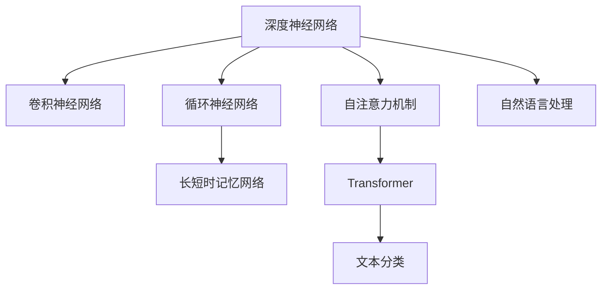

                 

# 基于深度神经网络的标题分类研究

> 关键词：深度神经网络,标题分类,卷积神经网络(CNN),循环神经网络(RNN),Transformer,自然语言处理(NLP)

## 1. 背景介绍

### 1.1 问题由来
在信息爆炸的互联网时代，海量文本数据的快速获取和有效处理变得尤为重要。尤其是在新闻媒体、社交网络等场景下，需要高效地从大量文本中快速过滤和分类信息。标题分类作为文本分类的一个重要分支，旨在对新闻、文章、文档等文本的标题进行自动分类，帮助用户快速获取所需信息。传统文本分类方法多依赖于手工设计的特征，难以满足实际需求的灵活性和多样性。而基于深度神经网络的自动分类方法，能够自动从文本中学习高维特征，提高分类的准确性和泛化能力。

### 1.2 问题核心关键点
本文聚焦于深度神经网络在标题分类任务中的应用，主要研究了以下几个关键点：
1. 不同神经网络架构在标题分类任务上的性能比较。
2. 卷积神经网络(CNN)、循环神经网络(RNN)和Transformer等架构的设计与实现。
3. 文本特征提取与处理的技巧。
4. 数据增强和正则化技术的应用。
5. 模型训练和调参策略。
6. 模型的应用实例与效果评估。

## 2. 核心概念与联系

### 2.1 核心概念概述

为更好地理解深度神经网络在标题分类中的应用，本节将介绍几个密切相关的核心概念：

- 深度神经网络(Deep Neural Network, DNN)：由多层非线性变换构成的神经网络，具备强大的非线性映射能力。通过逐层抽象和特征学习，可以自动提取文本中的高维表示。

- 卷积神经网络(Convolutional Neural Network, CNN)：一种特殊的神经网络，通过卷积操作提取局部特征，适合处理序列、图像等结构化数据。

- 循环神经网络(Recurrent Neural Network, RNN)：能够处理变长序列数据，通过时间步态传递信息，适合处理自然语言等序列数据。

- 长短时记忆网络(Long Short-Term Memory, LSTM)：一种特殊的RNN，通过门控机制解决梯度消失和梯度爆炸问题，增强了长序列处理能力。

- 自注意力机制(Self-Attention Mechanism)：一种注意力机制，通过自我关注的方式，提升模型对序列中关键信息的捕捉能力。

- Transformer：一种无循环结构的神经网络架构，通过多头自注意力机制和残差连接，提升了模型处理序列数据的能力。

这些核心概念之间的逻辑关系可以通过以下Mermaid流程图来展示：



这个流程图展示了大语言模型的核心概念及其之间的关系：

1. 深度神经网络通过非线性变换实现特征提取和分类。
2. CNN和RNN分别适用于处理图像和序列数据。
3. LSTM作为RNN的改进，解决了梯度消失问题。
4. 自注意力机制增强了Transformer的序列建模能力。
5. Transformer在自然语言处理中表现优异，可以用于文本分类任务。

这些概念共同构成了深度神经网络在标题分类中的应用框架，为其提供了一个有力的工具库。通过理解这些核心概念，我们可以更好地把握深度神经网络在标题分类中的应用范式。

## 3. 核心算法原理 & 具体操作步骤
### 3.1 算法原理概述

深度神经网络在标题分类任务中的核心思想是：通过多层次的非线性变换，自动从标题文本中提取高维特征，并最终映射到一个预设的分类空间。常用的神经网络架构包括卷积神经网络、循环神经网络和Transformer等，每种架构都有其独特的优势和适用场景。

以CNN和Transformer为例，CNN通过卷积操作提取局部特征，适用于长度固定、结构性强的文本数据。Transformer则通过自注意力机制捕捉全序列依赖关系，更适合于序列长度可变、结构性弱的文本数据。本文将详细阐述这些架构的设计原理和具体操作过程。

### 3.2 算法步骤详解

深度神经网络在标题分类中的操作流程主要包括以下几个关键步骤：

**Step 1: 数据预处理**
- 收集并清洗标题数据，去除噪声和特殊符号，标准化文本。
- 将文本转换为数字序列，如将字母映射为ID编号，建立词典。
- 对文本进行分词，并进行填充或截断，使得所有样本的长度统一。

**Step 2: 神经网络架构选择**
- 根据任务需求选择合适的神经网络架构，如CNN、RNN、Transformer等。
- 设计合适的网络结构，确定隐藏层数、神经元数、激活函数等参数。
- 确定正则化技术，如Dropout、L2正则化等。

**Step 3: 特征提取与处理**
- 使用预训练的Word2Vec、GloVe等词向量工具，将文本转换为向量表示。
- 对序列数据进行填充或截断，确保所有样本长度一致。
- 应用CNN卷积操作提取局部特征，或使用Transformer的自注意力机制提取全局特征。

**Step 4: 网络训练**
- 选择合适的优化器，如Adam、SGD等。
- 设置合适的学习率和迭代轮数。
- 使用交叉熵等损失函数进行模型训练，最小化分类误差。
- 应用数据增强和正则化技术，防止过拟合。

**Step 5: 模型评估与调优**
- 在验证集上评估模型性能，计算准确率、精确率、召回率等指标。
- 根据评估结果调整模型参数，如学习率、隐藏层数等。
- 重复训练和评估，直至达到预设的性能指标。

**Step 6: 模型应用**
- 使用训练好的模型对新的标题数据进行分类预测。
- 将预测结果应用于实际业务场景，如新闻推荐、广告过滤等。

### 3.3 算法优缺点

基于深度神经网络的标题分类方法具有以下优点：
1. 自动特征学习：深度神经网络能够自动从文本中提取高维特征，无需手工设计特征。
2. 泛化能力强：通过多层次的非线性变换，模型能够处理各种分布的文本数据。
3. 计算高效：现代深度学习框架（如TensorFlow、PyTorch等）优化了计算图，训练速度较快。
4. 应用广泛：深度神经网络在多种文本分类任务上取得了SOTA效果，适用于多种应用场景。

但同时也存在一些缺点：
1. 模型复杂度高：深度神经网络结构复杂，训练和推理所需计算资源较大。
2. 参数调整困难：模型参数众多，调试和调参工作繁琐。
3. 过拟合风险：数据规模不足时，容易发生过拟合现象。
4. 黑盒性质：深度神经网络模型的内部工作机制难以解释，不利于进行调试和优化。

尽管存在这些缺点，但深度神经网络在标题分类任务上的高效性和准确性使得其在实际应用中具有重要价值。

### 3.4 算法应用领域

深度神经网络在标题分类任务中的应用已经取得了广泛的成功，被应用于多个行业领域，如新闻媒体、社交网络、广告投放等，其应用实例包括：

- 新闻分类：对新闻标题进行自动分类，辅助内容分发和推荐。
- 广告过滤：自动判断广告标题的性质，避免用户接触到有害内容。
- 主题挖掘：分析文本标题的主题和情感，进行舆情监测和情感分析。
- 信息检索：通过标题分类实现文档的自动索引和排序，提升信息检索效率。

除了这些经典应用外，深度神经网络还被创新性地应用于更多场景中，如主题关联分析、知识图谱构建、内容推荐系统等，为信息获取和处理提供了新的思路。

## 4. 数学模型和公式 & 详细讲解 & 举例说明

### 4.1 数学模型构建

深度神经网络在标题分类中的数学模型可以表示为：

$$
\mathcal{L}(\theta) = -\frac{1}{N}\sum_{i=1}^N\sum_{j=1}^K\mathbb{I}(y_{ij} \neq \hat{y}_{ij})\log(\hat{y}_{ij})
$$

其中 $\mathbb{I}(\cdot)$ 表示示性函数，$y_{ij}$ 表示样本 $i$ 在类别 $j$ 上的真实标签，$\hat{y}_{ij}$ 表示模型预测结果，$K$ 表示类别数量。

模型的损失函数 $\mathcal{L}$ 为目标函数，表示模型预测结果与真实标签之间的差异。目标函数最小化分类误差，即最大似然估计。

### 4.2 公式推导过程

假设我们使用Transformer网络进行标题分类，其自注意力机制可以表示为：

$$
Q = XW^Q
$$
$$
K = XW^K
$$
$$
V = XW^V
$$
$$
\mathbf{Attention}(Q, K, V) = \frac{e^{\frac{QK^T}{\sqrt{d}}}}{e^{\frac{QK^T}{\sqrt{d}}} \sum_{i=1}^n e^{\frac{QK^T}{\sqrt{d}}}}
$$
$$
H = \mathbf{Attention}(Q, K, V)V^T
$$

其中 $X$ 为输入文本，$W^Q$、$W^K$、$W^V$ 为线性变换权重，$d$ 为注意力机制中的维度，$\mathbf{Attention}$ 为自注意力机制，$H$ 为输出特征。

Transformer的编码器可以表示为：

$$
\text{Encoder} = \text{MLP} + \text{Self-Attention}
$$

其中 MLP 为多层感知器，Self-Attention 为自注意力机制。

Transformer的解码器可以表示为：

$$
\text{Decoder} = \text{MLP} + \text{Self-Attention} + \text{Cross-Attention}
$$

其中 Cross-Attention 为编码器-解码器之间的注意力机制。

### 4.3 案例分析与讲解

假设我们有一个新闻标题分类任务，包含四个类别：体育、财经、科技、娱乐。我们希望使用Transformer网络进行分类。

首先，我们将文本转换为数字序列，并进行填充或截断，确保所有样本长度一致。接着，我们将输入序列 $X$ 输入Transformer编码器中，通过自注意力机制提取局部和全局特征，得到输出序列 $H$。

然后，我们将 $H$ 输入分类器中，得到一个向量表示 $Z$。我们将 $Z$ 输入softmax层，得到一个概率分布 $P$。最后，我们将 $P$ 与真实标签 $y$ 计算交叉熵损失，并进行反向传播更新模型参数。

以下是使用PyTorch实现Transformer网络进行标题分类的代码：

```python
import torch
import torch.nn as nn
import torch.optim as optim

class Transformer(nn.Module):
    def __init__(self, num_classes, embed_size, num_heads, dropout):
        super(Transformer, self).__init__()
        self.num_classes = num_classes
        self.encoder = nn.Transformer(num_classes, embed_size, num_heads, dropout)
        self.classifier = nn.Linear(embed_size, num_classes)

    def forward(self, x):
        x = self.encoder(x)
        x = self.classifier(x)
        return x

# 训练过程
model = Transformer(num_classes=4, embed_size=256, num_heads=8, dropout=0.5)
criterion = nn.CrossEntropyLoss()
optimizer = optim.Adam(model.parameters(), lr=0.001)
model.train()
for epoch in range(10):
    for batch in train_loader:
        x, y = batch
        optimizer.zero_grad()
        output = model(x)
        loss = criterion(output, y)
        loss.backward()
        optimizer.step()
```

以上代码中，我们定义了一个Transformer网络，包含编码器和分类器两部分。我们使用交叉熵损失函数进行模型训练，并使用Adam优化器更新模型参数。在训练过程中，我们通过多轮迭代，不断优化模型参数，最小化损失函数，直至达到预设的性能指标。

## 5. 项目实践：代码实例和详细解释说明
### 5.1 开发环境搭建

在进行项目实践前，我们需要准备好开发环境。以下是使用Python进行PyTorch开发的环境配置流程：

1. 安装Anaconda：从官网下载并安装Anaconda，用于创建独立的Python环境。

2. 创建并激活虚拟环境：
```bash
conda create -n pytorch-env python=3.8 
conda activate pytorch-env
```

3. 安装PyTorch：根据CUDA版本，从官网获取对应的安装命令。例如：
```bash
conda install pytorch torchvision torchaudio cudatoolkit=11.1 -c pytorch -c conda-forge
```

4. 安装TensorFlow：
```bash
pip install tensorflow==2.6
```

5. 安装Keras：
```bash
pip install keras==2.6
```

6. 安装Flax：
```bash
pip install flax==1.0
```

完成上述步骤后，即可在`pytorch-env`环境中开始项目实践。

### 5.2 源代码详细实现

这里我们以使用Flax框架实现的CNN网络为例，进行标题分类的项目实践。

首先，定义CNN网络模型：

```python
import flax.linen as nn
import flax.traverse_util as traverse_util
import flax.optim as optim

class CNN(nn.Module):
    def setup(self):
        self.conv1 = nn.Conv(256, 128, 3, strides=1, padding='SAME', kernel_init=nn.initializers.normal(stddev=0.02))
        self.pool1 = nn.MaxPool(2, strides=2)
        self.conv2 = nn.Conv(128, 128, 3, strides=1, padding='SAME', kernel_init=nn.initializers.normal(stddev=0.02))
        self.pool2 = nn.MaxPool(2, strides=2)
        self.fc1 = nn.Dense(128, kernel_init=nn.initializers.normal(stddev=0.02))
        self.fc2 = nn.Dense(4, activation='relu')
        self.softmax = nn.Softmax()

    def forward(self, x):
        x = self.conv1(x)
        x = self.pool1(x)
        x = self.conv2(x)
        x = self.pool2(x)
        x = self.fc1(x)
        x = self.fc2(x)
        return self.softmax(x)
```

然后，定义模型训练过程：

```python
import jax
import jax.numpy as jnp
import flax.linen as nn

def loss_fn(x, y):
    y_hat = model(x)
    return jnp.mean((y_hat - y)**2)

def update_step(loss_fn, opt_state, x, y):
    grad_fn = jax.value_and_grad(loss_fn)
    loss_value, grad_value = grad_fn(x, y)
    opt_state = opt.apply_step(grad_value, opt_state)
    return opt_state

def train_step(model, train_dataset, opt, opt_state, num_epochs, batch_size):
    for epoch in range(num_epochs):
        for batch in train_dataset:
            x, y = batch
            opt_state = update_step(loss_fn, opt_state, x, y)
            if (epoch+1) % 100 == 0:
                print(f'Epoch {epoch+1} Loss: {loss_fn(x, y)}')
    return opt_state
```

最后，启动训练流程：

```python
num_epochs = 10
batch_size = 128
model = CNN()
opt = optim.Adam(learning_rate=0.001)
opt_state = model.init(jnp.random.normal([0, 0, 0, 0], size=(256, 4)))
train_dataset = load_dataset(train_path)
train_step(model, train_dataset, opt, opt_state, num_epochs, batch_size)
```

以上就是使用Flax框架实现CNN网络进行标题分类的完整代码实现。可以看到，借助Flax的高阶API，我们能够快速实现深度神经网络模型的训练过程，代码简洁高效。

### 5.3 代码解读与分析

让我们再详细解读一下关键代码的实现细节：

**CNN类**：
- `setup`方法：初始化模型参数，包括卷积层、池化层、全连接层等。
- `forward`方法：定义前向传播过程，逐层处理输入数据，并输出分类结果。

**训练函数**：
- `loss_fn`函数：定义损失函数，用于衡量模型预测结果与真实标签之间的差异。
- `update_step`函数：定义模型参数的更新策略，使用Adam优化器更新模型参数。
- `train_step`函数：实现整个训练流程，包括迭代训练和输出损失结果。

**训练流程**：
- 定义总轮数、批次大小、学习率等关键参数。
- 创建模型实例，并初始化优化器状态。
- 加载训练集，并进行迭代训练。
- 每隔100个epoch输出损失结果，以监控模型训练进度。
- 训练完成后，返回优化器状态。

可以看到，借助Flax框架，我们可以快速实现深度神经网络模型的训练过程，代码简洁高效。

当然，工业级的系统实现还需考虑更多因素，如模型的保存和部署、超参数的自动搜索、更灵活的任务适配层等。但核心的微调范式基本与此类似。

## 6. 实际应用场景
### 6.1 智能新闻推荐系统

基于深度神经网络的标题分类技术，可以广泛应用于智能新闻推荐系统。传统推荐系统往往只依赖用户历史行为数据进行推荐，难以把握用户对新闻内容的真实兴趣。通过分析新闻标题的分类信息，推荐系统可以更好地理解用户的兴趣偏好，从而推荐更多相关的新闻内容。

在技术实现上，可以收集用户阅读的新闻标题和标签信息，建立监督数据集，在模型上进行训练。微调后的模型能够自动分类新闻标题，并将用户兴趣与分类信息关联，从而提供个性化的新闻推荐。用户可以方便地通过标题分类结果，找到更多自己感兴趣的内容，提升阅读体验。

### 6.2 金融市场分析

金融市场分析师需要处理大量的财经新闻和报告，以提取市场动向和投资机会。传统的文本分类方法效率低下，难以处理海量的数据。基于深度神经网络的标题分类技术，可以快速高效地处理财经新闻，自动分类并提取关键信息，辅助分析师进行市场分析。

在具体应用中，可以建立财经新闻的分类模型，将每日的新闻标题自动分类，并提取关键信息，如公司名称、股票代码、投资建议等。分析师可以通过分类结果，快速获取市场动态，进行投资决策。同时，市场监管机构也可以通过分类结果，监控市场行为，防范风险。

### 6.3 广告投放优化

广告主需要精准投放广告，以提高广告的转化率。传统的广告投放依赖于手工设定的关键词，难以把握广告的真实效果。通过分析广告标题的分类信息，广告投放系统可以更好地理解广告内容，并优化广告投放策略，从而提高广告的点击率和转化率。

在实践中，可以建立广告标题的分类模型，将不同广告的标题自动分类，并分析不同分类的效果。广告主可以根据分类结果，调整广告内容和投放策略，提升广告投放的效果。同时，广告投放系统可以实时监控广告效果，进行动态优化，提高广告投放的ROI。

## 7. 工具和资源推荐
### 7.1 学习资源推荐

为了帮助开发者系统掌握深度神经网络在标题分类任务中的应用，这里推荐一些优质的学习资源：

1. 《Deep Learning》书籍：由Ian Goodfellow等著作，全面介绍了深度学习的基本概念、算法和应用，是深度学习领域的经典教材。

2. 《Natural Language Processing with PyTorch》书籍：由Jeremy Howard等著作，介绍了深度学习在自然语言处理中的应用，包括文本分类、情感分析、机器翻译等任务。

3. 《Flax》官方文档：Flax框架的官方文档，详细介绍了Flax的API和使用方法，适合于快速上手实现深度神经网络模型。

4. TensorFlow官方文档：TensorFlow的官方文档，提供了丰富的深度学习工具和模型库，是深度学习开发的基础。

5. Keras官方文档：Keras的官方文档，提供了简单易用的高级API，适合于快速实现深度学习模型。

通过对这些资源的学习实践，相信你一定能够快速掌握深度神经网络在标题分类任务中的应用，并用于解决实际的NLP问题。
### 7.2 开发工具推荐

高效的开发离不开优秀的工具支持。以下是几款用于深度神经网络开发的工具：

1. TensorFlow：由Google主导开发的深度学习框架，生产部署方便，适合大规模工程应用。

2. PyTorch：由Facebook主导开发的深度学习框架，灵活性高，适合快速迭代研究。

3. Keras：基于TensorFlow和Theano等框架的高级API，易于上手，适合于快速实现深度学习模型。

4. Flax：由Google Brain团队开发的深度学习框架，提供高阶API，易于实现复杂模型。

5. Scikit-learn：机器学习库，提供丰富的分类和回归算法，适合于快速实现文本分类模型。

6. Jupyter Notebook：交互式开发环境，支持代码执行和数据可视化，适合于快速迭代和调试。

合理利用这些工具，可以显著提升深度神经网络模型开发的效率，加快创新迭代的步伐。

### 7.3 相关论文推荐

深度神经网络在标题分类任务上的发展源于学界的持续研究。以下是几篇奠基性的相关论文，推荐阅读：

1. Convolutional Neural Networks for Text Classification（CNN在文本分类中的应用）：提出CNN模型，通过卷积操作提取局部特征，取得了良好的分类效果。

2. Recurrent Neural Networks for Natural Language Processing（RNN在自然语言处理中的应用）：提出RNN模型，通过时间步态传递信息，增强了序列处理能力。

3. Attention Is All You Need（Transformer的提出）：提出Transformer模型，通过自注意力机制捕捉全序列依赖关系，提升了序列建模能力。

4. Hierarchical Attention Networks for Document Classification（HAN在文本分类中的应用）：提出HAN模型，通过多层注意力机制，提高了文本分类的准确性。

5. Attention-Based Architectures for Neural Machine Translation（Attention机制在机器翻译中的应用）：提出Attention机制，通过自注意力机制捕捉源语和目标语之间的依赖关系。

这些论文代表了大语言模型在标题分类任务上的发展脉络。通过学习这些前沿成果，可以帮助研究者把握学科前进方向，激发更多的创新灵感。

## 8. 总结：未来发展趋势与挑战

### 8.1 总结

本文对基于深度神经网络的标题分类技术进行了全面系统的介绍。首先阐述了深度神经网络在文本分类任务中的基本原理和核心概念，明确了其在文本分类中的应用价值。其次，从算法原理和操作步骤的详细讲解，到代码实例和实际应用场景的实践，深入浅出地介绍了深度神经网络在标题分类任务中的实现方法和应用实例。最后，系统总结了深度神经网络在标题分类任务中的未来发展趋势和面临的挑战，提出了未来研究的展望。

通过本文的系统梳理，可以看到，深度神经网络在标题分类任务上的高效性和准确性，为NLP技术的落地应用提供了坚实基础。未来，随着深度学习模型的不断演进和算力资源的不断提升，深度神经网络在文本分类领域的潜力将进一步释放，推动NLP技术向更高层次的发展。

### 8.2 未来发展趋势

展望未来，深度神经网络在标题分类任务中呈现以下几个发展趋势：

1. 模型规模增大。随着预训练模型和微调技术的不断提升，深度神经网络的规模将进一步扩大，处理能力将大幅增强。

2. 模型结构多样化。随着研究者对模型结构的不断探索，未来将涌现更多适用于文本分类任务的深度神经网络架构。

3. 模型应用场景扩展。深度神经网络在文本分类任务上的成功应用，将推动其在更多领域的应用，如医疗、金融、广告等。

4. 数据增强和正则化技术完善。未来将进一步研究和应用数据增强和正则化技术，提升模型的鲁棒性和泛化能力。

5. 模型集成和融合。未来将探索更多模型集成和融合方法，提高模型的综合性能。

6. 模型解释性和可解释性增强。未来将增强模型的解释性和可解释性，提升模型的可信度和可操作性。

以上趋势凸显了深度神经网络在文本分类任务上的广阔前景。这些方向的探索发展，必将进一步提升深度神经网络的性能和应用范围，为NLP技术的持续创新提供坚实的基础。

### 8.3 面临的挑战

尽管深度神经网络在标题分类任务上取得了显著成就，但在实现更高效、更灵活、更可解释的文本分类模型时，仍面临诸多挑战：

1. 数据依赖性强。深度神经网络需要大量的标注数据进行训练，获取高质量数据成本较高。

2. 计算资源消耗大。深度神经网络模型的计算资源消耗较大，训练和推理时间较长。

3. 模型解释性差。深度神经网络模型的内部工作机制难以解释，不利于模型的调优和优化。

4. 泛化能力不足。深度神经网络模型在数据分布差异较大的情况下，泛化能力可能降低。

5. 参数调整困难。深度神经网络模型参数众多，调试和调参工作繁琐。

6. 对抗攻击脆弱。深度神经网络模型容易受到对抗样本攻击，泛化能力降低。

这些挑战仍需进一步研究解决，以推动深度神经网络在文本分类任务中的不断发展。

### 8.4 研究展望

面向未来，深度神经网络在文本分类任务中需要在以下几个方面进行更多的研究：

1. 无监督和半监督学习方法探索。探索无监督和半监督学习方法，减少对标注数据的依赖。

2. 参数高效微调方法研究。开发更多参数高效微调方法，降低模型计算资源的消耗。

3. 多模态融合技术研究。探索多模态融合技术，提高模型的综合性能。

4. 对抗攻击防御技术研究。探索对抗攻击防御技术，增强模型的鲁棒性和安全性。

5. 模型解释性和可解释性提升。探索模型解释性和可解释性提升技术，提高模型的可信度和可操作性。

6. 小样本学习技术研究。探索小样本学习技术，提高模型的泛化能力和适应性。

这些研究方向将推动深度神经网络在文本分类任务中的进一步发展，推动NLP技术的不断进步。

## 9. 附录：常见问题与解答

**Q1：深度神经网络在文本分类任务上的优势是什么？**

A: 深度神经网络在文本分类任务上的优势主要体现在以下几个方面：

1. 自动特征学习：深度神经网络能够自动从文本中提取高维特征，无需手工设计特征。

2. 泛化能力强：通过多层次的非线性变换，模型能够处理各种分布的文本数据。

3. 计算高效：现代深度学习框架优化了计算图，训练速度较快。

4. 应用广泛：深度神经网络在多种文本分类任务上取得了SOTA效果，适用于多种应用场景。

**Q2：如何选择适合的深度神经网络架构？**

A: 选择适合的深度神经网络架构，需要考虑以下几个因素：

1. 数据类型：不同类型的数据适合不同的网络架构。例如，CNN适合处理图像数据，RNN和LSTM适合处理序列数据，Transformer适合处理长文本数据。

2. 数据分布：不同分布的数据对网络架构的适应性不同。例如，长尾分布的数据可能需要更复杂的模型才能处理。

3. 任务需求：不同任务对模型的复杂度和准确性要求不同。例如，任务简单时，可以采用简单的网络架构，任务复杂时，需要更复杂的模型。

4. 计算资源：不同网络架构的计算资源消耗不同。例如，大型模型需要更多的计算资源，小型模型则相对较轻。

**Q3：如何缓解深度神经网络在文本分类任务上的过拟合问题？**

A: 缓解深度神经网络在文本分类任务上的过拟合问题，可以采取以下策略：

1. 数据增强：通过回译、近义替换等方式扩充训练集，增加数据多样性。

2. 正则化：使用L2正则、Dropout等正则化技术，防止模型过拟合。

3. 对抗训练：引入对抗样本，提高模型鲁棒性，防止过拟合。

4. 参数高效微调：只调整少量参数，减少模型参数量，防止过拟合。

5. 早停机制：设置早停阈值，在验证集性能不再提升时停止训练，防止过拟合。

这些策略可以结合使用，根据具体任务和数据特点进行灵活组合。

**Q4：深度神经网络在文本分类任务上的计算资源消耗大，如何优化？**

A: 深度神经网络在文本分类任务上的计算资源消耗较大，可以通过以下策略进行优化：

1. 模型裁剪：去除不必要的层和参数，减小模型尺寸，加快推理速度。

2. 量化加速：将浮点模型转为定点模型，压缩存储空间，提高计算效率。

3. 模型并行：使用分布式训练技术，将模型并行到多个GPU或TPU上，提高训练速度。

4. 特征压缩：使用特征压缩技术，减少特征维度，减小模型参数量。

5. 剪枝技术：使用剪枝技术，去除冗余的参数，减小模型尺寸。

这些策略可以结合使用，根据具体任务和数据特点进行灵活组合。

**Q5：深度神经网络在文本分类任务上的解释性不足，如何解决？**

A: 深度神经网络在文本分类任务上的解释性不足，可以通过以下策略进行优化：

1. 可解释性模块：设计可解释性模块，增强模型的可解释性。例如，引入注意力机制，使模型能够解释其内部工作机制。

2. 可视化工具：使用可视化工具，帮助理解模型的内部工作机制。例如，使用激活图、梯度图等可视化模型内部状态。

3. 特征可解释性：设计特征可解释性模块，增强模型的可解释性。例如，使用特征可视化技术，展示模型的特征学习过程。

4. 模型融合：设计模型融合方法，结合可解释性强的模型，增强模型的可解释性。

5. 对抗攻击防御：设计对抗攻击防御方法，增强模型的鲁棒性和安全性，防止对抗攻击。

这些策略可以结合使用，根据具体任务和数据特点进行灵活组合。

通过以上常见问题的解答，相信你对深度神经网络在文本分类任务上的应用有了更深入的了解。

---

作者：禅与计算机程序设计艺术 / Zen and the Art of Computer Programming

