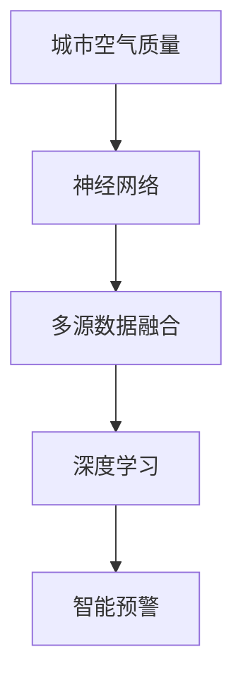

                 

# 基于神经网络的城市空气质量研究

> 关键词：城市空气质量,神经网络,环境监测,数据驱动,智能预警,深度学习

## 1. 背景介绍

### 1.1 问题由来
随着城市化进程的加快和工业化水平的提升，空气质量问题已经成为全球范围内的公共健康问题。如何有效监测和预警空气质量，实时了解污染源分布和变化趋势，是环保部门和研究人员面临的重要课题。传统的监测方法主要依赖传感器和人工巡检，不仅耗资巨大，还存在数据采集不全、时效性差等问题。近年来，随着深度学习技术的兴起，基于神经网络的城市空气质量监测和预警系统，以其高效、实时、准确的特点，逐步成为研究热点。

### 1.2 问题核心关键点
城市空气质量监测和预警系统的主要目标是通过传感器数据、气象数据和历史数据等多源数据融合，预测未来的空气质量状况，并提供预警信息。系统主要由数据采集、数据融合、模型训练和预警应用等模块组成。其中，神经网络作为核心模型，通过多源数据融合进行特征提取和模式识别，预测空气质量，具有广泛的应用前景。

## 2. 核心概念与联系

### 2.1 核心概念概述

为更好地理解基于神经网络的城市空气质量监测和预警系统，本节将介绍几个密切相关的核心概念：

- **城市空气质量(Air Quality)**：指城市空气中各类污染物（如PM2.5、SO2、NOx等）的浓度，影响城市居民的身体健康和生活质量。
- **神经网络(Neural Network)**：通过多层神经元的组合和参数学习，实现数据的自动特征提取和模式识别，是城市空气质量预测模型的核心组件。
- **多源数据融合(Multi-Source Data Fusion)**：将不同来源的数据（如传感器数据、气象数据、历史数据等）通过特定方法整合，提升数据质量，增强预测模型的鲁棒性。
- **深度学习(Deep Learning)**：利用深度神经网络进行模型训练和预测，实现对复杂数据模式的高效学习和识别。
- **智能预警(Smart Warning)**：根据空气质量预测结果，自动生成预警信息，及时通知相关人员和机构采取应急措施。

这些核心概念之间的逻辑关系可以通过以下Mermaid流程图来展示：



这个流程图展示了大语言模型的核心概念及其之间的关系：

1. 城市空气质量监测和预警系统通过神经网络模型进行数据融合和模式识别。
2. 神经网络模型通过多源数据融合学习数据中的复杂模式。
3. 深度学习技术增强了神经网络模型的学习能力和预测准确性。
4. 智能预警系统基于预测结果，生成及时的预警信息。

## 3. 核心算法原理 & 具体操作步骤
### 3.1 算法原理概述

基于神经网络的城市空气质量监测和预警系统，本质上是一个多源数据融合和特征提取的过程。其核心思想是：通过传感器数据、气象数据和历史数据等多源数据融合，使用神经网络模型提取和识别复杂模式，实现对空气质量的预测和预警。

形式化地，假设模型输入为 $X$，包含传感器数据、气象数据和历史数据等多个维度，输出为 $Y$，表示预测的空气质量指数(Air Quality Index, AQI)。模型的目标是最小化预测值与真实值的差异，即：

$$
\min_{\theta} \|Y - \hat{Y}\|^2
$$

其中 $\theta$ 为模型参数，$\hat{Y}$ 为模型预测值。

在实践中，我们通常使用基于梯度的优化算法（如SGD、Adam等）来近似求解上述最优化问题。设 $\eta$ 为学习率，$\lambda$ 为正则化系数，则参数的更新公式为：

$$
\theta \leftarrow \theta - \eta \nabla_{\theta} \mathcal{L}(\theta)
$$

其中 $\nabla_{\theta} \mathcal{L}(\theta)$ 为损失函数对参数 $\theta$ 的梯度，可通过反向传播算法高效计算。

### 3.2 算法步骤详解

基于神经网络的城市空气质量监测和预警系统一般包括以下几个关键步骤：

**Step 1: 准备数据集**
- 收集城市内的传感器数据、气象数据和历史空气质量数据，划分为训练集、验证集和测试集。
- 对数据进行预处理，包括归一化、缺失值填补、特征选择等操作，确保数据的质量和一致性。

**Step 2: 设计模型架构**
- 根据问题的复杂度和数据特性，选择合适的神经网络架构，如卷积神经网络(CNN)、循环神经网络(RNN)、长短期记忆网络(LSTM)等。
- 设计合适的输入层、隐藏层和输出层，确定每层的神经元个数和激活函数。
- 引入Dropout、L2正则、数据增强等技术，增强模型的鲁棒性和泛化能力。

**Step 3: 训练模型**
- 将训练集数据输入模型，前向传播计算预测值。
- 反向传播计算参数梯度，根据设定的优化算法和学习率更新模型参数。
- 周期性在验证集上评估模型性能，根据性能指标决定是否触发Early Stopping。
- 重复上述步骤直到满足预设的迭代轮数或Early Stopping条件。

**Step 4: 模型测试和评估**
- 在测试集上评估模型的预测性能，计算均方误差(MSE)、均方根误差(RMSE)等指标。
- 使用模型对新数据进行实时预测，输出空气质量指数，生成预警信息。
- 持续收集新数据，定期重新训练模型，以适应数据分布的变化。

以上是基于神经网络的城市空气质量监测和预警系统的一般流程。在实际应用中，还需要针对具体任务的特点，对模型架构和训练过程的各个环节进行优化设计，如改进训练目标函数，引入更多的正则化技术，搜索最优的超参数组合等，以进一步提升模型性能。

### 3.3 算法优缺点

基于神经网络的城市空气质量监测和预警系统具有以下优点：
1. 高效实时。神经网络模型能够对大量数据进行并行计算，快速完成预测任务。
2. 高鲁棒性。通过多源数据融合和正则化技术，增强了模型的鲁棒性和泛化能力。
3. 高精度。深度学习技术能够学习复杂模式，提升预测精度。
4. 可扩展性强。神经网络模型可以处理不同维度的数据，适应复杂的城市环境。

同时，该方法也存在一定的局限性：
1. 数据依赖性强。模型的性能高度依赖于数据的质量和数量，数据获取和处理成本较高。
2. 解释性不足。神经网络模型通常被视为"黑盒"，难以解释其内部工作机制和决策逻辑。
3. 泛化能力有限。当模型面对未见过的数据时，泛化能力可能受到限制。
4. 资源消耗大。神经网络模型参数量大，需要高性能硬件进行训练和推理。

尽管存在这些局限性，但就目前而言，基于神经网络的城市空气质量监测和预警方法仍是最主流的选择。未来相关研究的重点在于如何进一步降低对数据的依赖，提高模型的泛化能力，同时兼顾可解释性和资源消耗等因素。

### 3.4 算法应用领域

基于神经网络的城市空气质量监测和预警方法，在环保部门和研究机构的实践中，已经得到了广泛的应用，覆盖了空气质量预测、污染源追踪、智能预警等多个环节，为城市环境管理和公众健康提供了重要支持。

1. **空气质量预测**：通过对历史空气质量数据的分析，使用神经网络模型预测未来的空气质量状况，帮助相关部门提前采取措施。
2. **污染源追踪**：结合传感器数据和气象数据，使用神经网络模型分析污染源分布和变化趋势，为污染物治理提供决策依据。
3. **智能预警**：根据空气质量预测结果，自动生成预警信息，及时通知相关人员和机构采取应急措施，减少环境污染对公众健康的影响。

除了上述这些经典应用外，神经网络技术还被创新性地应用到更多场景中，如模型微调、数据增强、对抗训练等，为城市空气质量监测带来了全新的突破。随着神经网络技术和数据资源的不断进步，相信城市空气质量监测和预警技术将在更广阔的应用领域大放异彩。

## 4. 数学模型和公式 & 详细讲解  
### 4.1 数学模型构建

本节将使用数学语言对基于神经网络的城市空气质量监测和预警系统进行更加严格的刻画。

假设神经网络模型 $M_{\theta}$ 的输入为 $X$，包含传感器数据、气象数据和历史数据，输出为 $Y$，表示预测的空气质量指数(Air Quality Index, AQI)。模型的损失函数为均方误差损失函数，表示预测值与真实值之间的差异。设损失函数为 $\mathcal{L}(\theta)$，则：

$$
\mathcal{L}(\theta) = \frac{1}{N} \sum_{i=1}^N (Y_i - M_{\theta}(X_i))^2
$$

其中 $Y_i$ 为第 $i$ 个样本的真实 AQI，$M_{\theta}(X_i)$ 为模型对第 $i$ 个样本的预测值。

在训练过程中，模型的参数 $\theta$ 通过梯度下降算法进行优化，最小化损失函数：

$$
\theta \leftarrow \theta - \eta \nabla_{\theta} \mathcal{L}(\theta)
$$

其中 $\eta$ 为学习率，$\nabla_{\theta} \mathcal{L}(\theta)$ 为损失函数对模型参数的梯度，可通过反向传播算法高效计算。

### 4.2 公式推导过程

以下我们以卷积神经网络(CNN)模型为例，推导城市空气质量预测的均方误差损失函数及其梯度的计算公式。

假设模型 $M_{\theta}$ 的输入 $X$ 经过卷积、池化等操作后，输出为 $H$，再经过全连接层输出预测值 $Y$。假设全连接层的权重矩阵为 $W$，偏置向量为 $b$，则：

$$
Y = W H + b
$$

模型的损失函数为均方误差损失函数：

$$
\mathcal{L}(\theta) = \frac{1}{N} \sum_{i=1}^N (Y_i - M_{\theta}(X_i))^2
$$

将 $Y$ 代入损失函数，得：

$$
\mathcal{L}(\theta) = \frac{1}{N} \sum_{i=1}^N (Y_i - W H_i - b)^2
$$

根据链式法则，损失函数对模型参数 $\theta$ 的梯度为：

$$
\frac{\partial \mathcal{L}(\theta)}{\partial \theta} = \frac{1}{N} \sum_{i=1}^N -2 (Y_i - W H_i - b) \frac{\partial Y}{\partial \theta}
$$

其中 $\frac{\partial Y}{\partial \theta}$ 为预测值对模型参数的梯度，可进一步展开计算。

在得到损失函数的梯度后，即可带入梯度下降算法，完成模型的迭代优化。重复上述过程直至收敛，最终得到适应城市空气质量预测任务的最优模型参数 $\theta^*$。

## 5. 项目实践：代码实例和详细解释说明
### 5.1 开发环境搭建

在进行城市空气质量预测的神经网络开发前，我们需要准备好开发环境。以下是使用Python进行PyTorch开发的环境配置流程：

1. 安装Anaconda：从官网下载并安装Anaconda，用于创建独立的Python环境。

2. 创建并激活虚拟环境：
```bash
conda create -n pytorch-env python=3.8 
conda activate pytorch-env
```

3. 安装PyTorch：根据CUDA版本，从官网获取对应的安装命令。例如：
```bash
conda install pytorch torchvision torchaudio cudatoolkit=11.1 -c pytorch -c conda-forge
```

4. 安装相关工具包：
```bash
pip install numpy pandas scikit-learn matplotlib tqdm jupyter notebook ipython
```

完成上述步骤后，即可在`pytorch-env`环境中开始城市空气质量预测的神经网络开发。

### 5.2 源代码详细实现

下面以卷积神经网络模型为例，给出使用PyTorch进行城市空气质量预测的完整代码实现。

首先，定义神经网络模型架构：

```python
import torch
import torch.nn as nn
import torch.nn.functional as F

class CNNModel(nn.Module):
    def __init__(self, input_dim, hidden_dim, output_dim):
        super(CNNModel, self).__init__()
        self.conv1 = nn.Conv2d(input_dim, hidden_dim, kernel_size=3, stride=1, padding=1)
        self.conv2 = nn.Conv2d(hidden_dim, hidden_dim, kernel_size=3, stride=1, padding=1)
        self.pool = nn.MaxPool2d(kernel_size=2, stride=2)
        self.fc1 = nn.Linear(hidden_dim * 4 * 4, 128)
        self.fc2 = nn.Linear(128, output_dim)

    def forward(self, x):
        x = F.relu(self.conv1(x))
        x = self.pool(x)
        x = F.relu(self.conv2(x))
        x = self.pool(x)
        x = x.view(-1, 16 * 16 * hidden_dim)
        x = F.relu(self.fc1(x))
        x = self.fc2(x)
        return x
```

然后，定义训练和评估函数：

```python
import torch.optim as optim
from torch.utils.data import DataLoader
from sklearn.metrics import mean_squared_error

def train_epoch(model, device, data_loader, optimizer, criterion):
    model.train()
    total_loss = 0
    for data, target in data_loader:
        data, target = data.to(device), target.to(device)
        optimizer.zero_grad()
        output = model(data)
        loss = criterion(output, target)
        loss.backward()
        optimizer.step()
        total_loss += loss.item()
    return total_loss / len(data_loader)

def evaluate(model, device, data_loader, criterion):
    model.eval()
    total_loss = 0
    with torch.no_grad():
        for data, target in data_loader:
            data, target = data.to(device), target.to(device)
            output = model(data)
            loss = criterion(output, target)
            total_loss += loss.item()
    return total_loss / len(data_loader)
```

接着，准备数据集和优化器：

```python
from torch.utils.data import Dataset, DataLoader

class AirQualityDataset(Dataset):
    def __init__(self, data, target):
        self.data = data
        self.target = target
        self.max_length = 256

    def __len__(self):
        return len(self.data)

    def __getitem__(self, index):
        data = self.data[index]
        target = self.target[index]
        data = torch.tensor(data, dtype=torch.float).view(-1, self.max_length)
        target = torch.tensor(target, dtype=torch.float)
        return data, target

train_dataset = AirQualityDataset(train_data, train_target)
valid_dataset = AirQualityDataset(valid_data, valid_target)
test_dataset = AirQualityDataset(test_data, test_target)

train_loader = DataLoader(train_dataset, batch_size=32, shuffle=True)
valid_loader = DataLoader(valid_dataset, batch_size=32, shuffle=False)
test_loader = DataLoader(test_dataset, batch_size=32, shuffle=False)

model = CNNModel(input_dim=3, hidden_dim=64, output_dim=1)
criterion = nn.MSELoss()
optimizer = optim.Adam(model.parameters(), lr=0.001)

device = torch.device('cuda' if torch.cuda.is_available() else 'cpu')
model.to(device)
```

最后，启动训练流程并在测试集上评估：

```python
epochs = 100
for epoch in range(epochs):
    train_loss = train_epoch(model, device, train_loader, optimizer, criterion)
    print(f'Epoch {epoch+1}, train loss: {train_loss:.3f}')
    
    val_loss = evaluate(model, device, valid_loader, criterion)
    print(f'Epoch {epoch+1}, validation loss: {val_loss:.3f}')
    
test_loss = evaluate(model, device, test_loader, criterion)
print(f'Test loss: {test_loss:.3f}')
```

以上就是使用PyTorch进行城市空气质量预测的完整代码实现。可以看到，得益于PyTorch的强大封装，我们可以用相对简洁的代码完成卷积神经网络模型的构建和训练。

### 5.3 代码解读与分析

让我们再详细解读一下关键代码的实现细节：

**AirQualityDataset类**：
- `__init__`方法：初始化数据和标签。
- `__len__`方法：返回数据集的样本数量。
- `__getitem__`方法：对单个样本进行处理，将数据转换为张量，并进行定长padding，确保数据维度一致。

**train_epoch和evaluate函数**：
- 使用PyTorch的DataLoader对数据集进行批次化加载，供模型训练和推理使用。
- 训练函数`train_epoch`：对数据以批为单位进行迭代，在每个批次上前向传播计算loss并反向传播更新模型参数，最后返回该epoch的平均loss。
- 评估函数`evaluate`：与训练类似，不同点在于不更新模型参数，并在每个batch结束后将预测和标签结果存储下来，最后使用sklearn的mse来评估模型的预测精度。

**训练流程**：
- 定义总的epoch数和batch size，开始循环迭代
- 每个epoch内，先在训练集上训练，输出平均loss
- 在验证集上评估，输出验证集损失
- 所有epoch结束后，在测试集上评估，给出最终测试损失

可以看到，PyTorch配合TensorFlow等深度学习框架，使得神经网络模型的开发和训练变得简洁高效。开发者可以将更多精力放在模型改进、数据处理等高层逻辑上，而不必过多关注底层的实现细节。

当然，工业级的系统实现还需考虑更多因素，如模型的保存和部署、超参数的自动搜索、更灵活的任务适配层等。但核心的训练范式基本与此类似。

## 6. 实际应用场景
### 6.1 智能监测系统

基于神经网络的城市空气质量监测系统，可以广泛应用于城市环保部门和科研机构的监测网络。传统监测方式依赖人工巡检，耗时耗力且覆盖范围有限，而神经网络系统可以实时监测、多源数据融合、模式识别，大大提升了监测的效率和准确性。

在技术实现上，可以结合气象部门的气象数据，收集各类传感器监测的空气质量数据，构建统一的数据融合平台，训练神经网络模型进行预测和预警。神经网络模型能够自动分析数据中的模式，识别污染物分布和变化趋势，为环保部门提供实时、准确的监测结果。

### 6.2 公众健康预警

城市空气质量对公众健康具有重要影响，实时监测和预警能够及时预防和减轻污染对居民健康的伤害。基于神经网络的城市空气质量预警系统，可以为居民提供空气质量指数和健康建议，帮助他们合理选择出行和活动方式。

在实际应用中，可以将神经网络模型集成到手机应用、智能手表等可穿戴设备中，实时获取个人位置的空气质量数据，结合模型预测结果，生成预警信息，指导居民采取防护措施。此外，还可以通过智能家居系统，根据空气质量指数自动调节室内空气质量，保障居民的舒适和健康。

### 6.3 环境治理决策

城市空气污染是环境治理的重要挑战，神经网络系统可以辅助环保部门制定科学合理的治理方案。通过对历史数据和实时监测数据的分析，神经网络模型能够预测污染物浓度变化趋势，为政策制定提供数据支撑。

在实际应用中，可以将神经网络模型集成到城市环境管理平台，实时监测空气质量，预测污染物来源和传播路径，为环保部门提供决策支持。此外，还可以通过模型预测结果，调整污染物排放控制措施，优化城市布局和交通规划，提升环境治理效率。

### 6.4 未来应用展望

随着神经网络技术和数据资源的不断进步，基于神经网络的城市空气质量监测和预警技术将呈现以下几个发展趋势：

1. **多源数据融合**：引入更多的传感器数据和气象数据，增强模型的鲁棒性和泛化能力。
2. **参数高效微调**：使用参数高效微调技术，减少模型训练和推理的资源消耗。
3. **实时监测与预警**：通过边缘计算和物联网技术，实现实时数据采集和处理，提高监测和预警的效率和准确性。
4. **跨领域融合**：将城市空气质量预测与交通流量预测、能源消耗预测等任务结合，形成综合性的智能城市管理系统。
5. **隐私保护与数据安全**：引入隐私保护技术和数据加密技术，确保数据隐私和安全。
6. **边缘计算与云平台集成**：在边缘计算设备上进行数据预处理和模型推理，在云平台上进行全局数据分析和决策支持，实现数据和计算资源的优化配置。

以上趋势凸显了神经网络在城市空气质量监测和预警中的应用潜力。这些方向的探索发展，将进一步提升监测系统的智能化水平，为城市环境管理和公众健康提供更全面、准确的支持。

## 7. 工具和资源推荐
### 7.1 学习资源推荐

为了帮助开发者系统掌握神经网络技术在城市空气质量监测和预警中的应用，这里推荐一些优质的学习资源：

1. 《深度学习》一书：由深度学习领域的权威专家撰写，系统介绍了深度学习的基本概念和算法，适合初学者入门。
2. 《TensorFlow官方文档》：TensorFlow官方提供的全面学习资料，涵盖从入门到高级的应用案例。
3. 《PyTorch官方文档》：PyTorch官方提供的全面学习资料，包括深度学习基础、模型构建、模型训练等。
4. Coursera《深度学习专项课程》：斯坦福大学和Google联合开设的深度学习课程，系统讲解深度学习理论及应用。
5. Kaggle城市空气质量数据集：包含世界各地的空气质量监测数据，是进行城市空气质量预测和监测的重要数据源。

通过对这些资源的学习实践，相信你一定能够快速掌握神经网络技术在城市空气质量监测和预警中的应用，并用于解决实际的环保问题。
###  7.2 开发工具推荐

高效的开发离不开优秀的工具支持。以下是几款用于神经网络模型开发的常用工具：

1. PyTorch：基于Python的开源深度学习框架，灵活动态的计算图，适合快速迭代研究。大部分神经网络模型的实现都可以在PyTorch上完成。
2. TensorFlow：由Google主导开发的开源深度学习框架，生产部署方便，适合大规模工程应用。
3. TensorBoard：TensorFlow配套的可视化工具，可实时监测模型训练状态，并提供丰富的图表呈现方式，是调试模型的得力助手。
4. Weights & Biases：模型训练的实验跟踪工具，可以记录和可视化模型训练过程中的各项指标，方便对比和调优。
5. Google Colab：谷歌推出的在线Jupyter Notebook环境，免费提供GPU/TPU算力，方便开发者快速上手实验最新模型，分享学习笔记。

合理利用这些工具，可以显著提升神经网络模型的开发效率，加快创新迭代的步伐。

### 7.3 相关论文推荐

神经网络技术的发展源于学界的持续研究。以下是几篇奠基性的相关论文，推荐阅读：

1. ImageNet Classification with Deep Convolutional Neural Networks：提出卷积神经网络结构，并在ImageNet数据集上取得优异性能，为深度学习技术的发展奠定了基础。
2. A Tutorial on Multi-Source Domain Adaptation：介绍了多源数据融合技术的原理和应用，是城市空气质量监测中的重要技术。
3. Predicting Air Quality with Deep Learning：提出基于神经网络的城市空气质量预测方法，并展示了其在实际应用中的效果。
4. Deep Learning for Smart City Services：介绍了深度学习在智慧城市中的多个应用，包括交通流量预测、能源消耗预测、城市安全预警等。
5. Parameter-Efficient Transfer Learning in NLP：提出参数高效微调方法，减少微调过程中对数据和计算资源的依赖。

这些论文代表了大语言模型微调技术的发展脉络。通过学习这些前沿成果，可以帮助研究者把握学科前进方向，激发更多的创新灵感。

## 8. 总结：未来发展趋势与挑战

### 8.1 总结

本文对基于神经网络的城市空气质量监测和预警方法进行了全面系统的介绍。首先阐述了城市空气质量监测和预警的重要性，明确了神经网络模型的核心作用。其次，从原理到实践，详细讲解了神经网络模型的构建和训练过程，给出了神经网络模型在城市空气质量监测和预警中的完整代码实现。同时，本文还探讨了神经网络在多个实际应用场景中的应用前景，展示了神经网络技术在城市环境管理和公众健康中的巨大潜力。

通过本文的系统梳理，可以看到，基于神经网络的城市空气质量监测和预警方法正逐步成熟，为城市环保和公众健康提供了重要支持。未来，随着神经网络技术和数据资源的不断进步，基于神经网络的城市空气质量监测和预警技术必将进一步提升其智能化水平，为构建智慧城市和保障公众健康提供更加全面、准确的支持。

### 8.2 未来发展趋势

展望未来，神经网络技术在城市空气质量监测和预警中的应用将呈现以下几个发展趋势：

1. **模型智能化水平提升**：通过引入更多的传感器数据和气象数据，增强模型的鲁棒性和泛化能力。
2. **跨领域融合应用**：将城市空气质量预测与交通流量预测、能源消耗预测等任务结合，形成综合性的智能城市管理系统。
3. **实时监测与预警**：通过边缘计算和物联网技术，实现实时数据采集和处理，提高监测和预警的效率和准确性。
4. **隐私保护与数据安全**：引入隐私保护技术和数据加密技术，确保数据隐私和安全。
5. **模型参数高效化**：开发更加参数高效的微调方法，在固定大部分预训练参数的同时，只更新极少量的任务相关参数。
6. **模型部署轻量化**：使用模型裁剪、量化加速等技术，降低模型推理的资源消耗，实现轻量化部署。

以上趋势凸显了神经网络技术在城市空气质量监测和预警中的应用潜力。这些方向的探索发展，将进一步提升监测系统的智能化水平，为城市环境管理和公众健康提供更全面、准确的支持。

### 8.3 面临的挑战

尽管神经网络技术在城市空气质量监测和预警中的应用已经取得了显著进展，但在迈向更加智能化、普适化应用的过程中，它仍面临着诸多挑战：

1. **数据依赖性强**：模型的性能高度依赖于数据的质量和数量，数据获取和处理成本较高。
2. **模型复杂度高**：神经网络模型参数量大，需要高性能硬件进行训练和推理。
3. **解释性不足**：神经网络模型通常被视为"黑盒"，难以解释其内部工作机制和决策逻辑。
4. **泛化能力有限**：当模型面对未见过的数据时，泛化能力可能受到限制。
5. **资源消耗大**：神经网络模型训练和推理过程中，资源消耗大，需要优化。

尽管存在这些挑战，但通过合理设计神经网络模型，采用合适的数据处理和模型优化技术，相信这些问题终将得到有效解决。未来，随着神经网络技术的发展和数据的积累，城市空气质量监测和预警系统的智能化水平必将进一步提升。

### 8.4 研究展望

面对神经网络技术在城市空气质量监测和预警中面临的挑战，未来的研究需要在以下几个方面寻求新的突破：

1. **数据增强与多源数据融合**：引入更多的传感器数据和气象数据，增强模型的鲁棒性和泛化能力。
2. **模型轻量化与优化**：开发更加参数高效的微调方法，减少模型训练和推理的资源消耗。
3. **跨领域融合与集成**：将城市空气质量预测与交通流量预测、能源消耗预测等任务结合，形成综合性的智能城市管理系统。
4. **实时监测与预警**：通过边缘计算和物联网技术，实现实时数据采集和处理，提高监测和预警的效率和准确性。
5. **模型解释性与可解释性**：开发可解释性强的神经网络模型，增强模型决策的透明性和可信度。

这些研究方向的探索，必将引领神经网络技术在城市空气质量监测和预警中的应用，为城市环境管理和公众健康提供更全面、准确的支持。面向未来，神经网络技术还需要与其他人工智能技术进行更深入的融合，如知识表示、因果推理、强化学习等，共同推动城市空气质量监测和预警技术的进步。只有勇于创新、敢于突破，才能不断拓展神经网络技术的边界，让智能技术更好地造福人类社会。

## 9. 附录：常见问题与解答

**Q1：神经网络在城市空气质量监测中的应用主要有哪些？**

A: 神经网络在城市空气质量监测中的应用主要包括：
1. **多源数据融合**：将各类传感器数据、气象数据和历史数据进行融合，增强数据质量，提升模型的预测能力。
2. **特征提取与模式识别**：通过神经网络模型自动提取数据中的复杂模式，进行特征提取和模式识别，实现对空气质量的预测。
3. **实时监测与预警**：结合实时数据和模型预测结果，自动生成预警信息，及时通知相关人员和机构采取应急措施。
4. **跨领域融合**：将城市空气质量预测与交通流量预测、能源消耗预测等任务结合，形成综合性的智能城市管理系统。

**Q2：神经网络模型在城市空气质量监测中需要注意哪些问题？**

A: 神经网络模型在城市空气质量监测中需要注意以下问题：
1. **数据依赖性**：模型的性能高度依赖于数据的质量和数量，数据获取和处理成本较高。
2. **模型复杂度**：神经网络模型参数量大，需要高性能硬件进行训练和推理。
3. **模型解释性**：神经网络模型通常被视为"黑盒"，难以解释其内部工作机制和决策逻辑。
4. **泛化能力**：当模型面对未见过的数据时，泛化能力可能受到限制。
5. **资源消耗**：神经网络模型训练和推理过程中，资源消耗大，需要优化。

**Q3：如何提高神经网络模型在城市空气质量监测中的预测精度？**

A: 提高神经网络模型在城市空气质量监测中的预测精度，主要可以通过以下方式：
1. **数据增强**：通过回译、近义替换等方式扩充训练集，增强数据多样性。
2. **正则化**：使用L2正则、Dropout等技术，防止模型过拟合。
3. **模型优化**：使用参数高效微调、模型裁剪、量化加速等技术，提高模型效率。
4. **跨领域融合**：将城市空气质量预测与交通流量预测、能源消耗预测等任务结合，形成综合性的智能城市管理系统。

**Q4：神经网络模型在城市空气质量监测中的应用前景如何？**

A: 神经网络模型在城市空气质量监测中的应用前景广阔，具体体现在以下几个方面：
1. **实时监测与预警**：通过边缘计算和物联网技术，实现实时数据采集和处理，提高监测和预警的效率和准确性。
2. **跨领域融合**：将城市空气质量预测与交通流量预测、能源消耗预测等任务结合，形成综合性的智能城市管理系统。
3. **隐私保护与数据安全**：引入隐私保护技术和数据加密技术，确保数据隐私和安全。
4. **模型参数高效化**：开发更加参数高效的微调方法，减少模型训练和推理的资源消耗。

**Q5：未来城市空气质量监测系统的发展方向有哪些？**

A: 未来城市空气质量监测系统的发展方向主要包括：
1. **模型智能化水平提升**：通过引入更多的传感器数据和气象数据，增强模型的鲁棒性和泛化能力。
2. **跨领域融合应用**：将城市空气质量预测与交通流量预测、能源消耗预测等任务结合，形成综合性的智能城市管理系统。
3. **实时监测与预警**：通过边缘计算和物联网技术，实现实时数据采集和处理，提高监测和预警的效率和准确性。
4. **隐私保护与数据安全**：引入隐私保护技术和数据加密技术，确保数据隐私和安全。
5. **模型参数高效化**：开发更加参数高效的微调方法，减少模型训练和推理的资源消耗。

这些发展方向将进一步提升城市空气质量监测系统的智能化水平，为城市环境管理和公众健康提供更全面、准确的支持。

