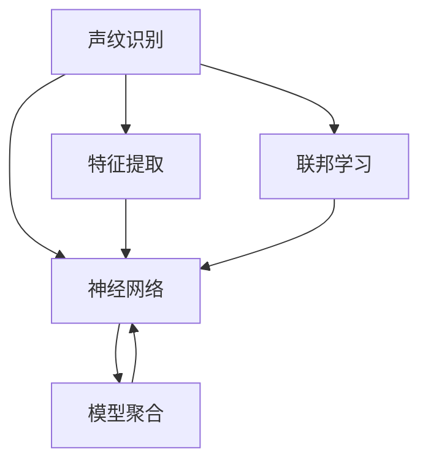

                 

# 基于联邦学习的声纹识别研究

> 关键词：声纹识别, 联邦学习, 数据隐私, 语音信号处理, 神经网络, 特征提取

## 1. 背景介绍

随着人工智能技术的飞速发展，声纹识别技术已广泛应用于身份验证、智能家居、个性化推荐等领域。声纹识别系统通过分析说话人的声学特征，判别其身份，具有较高的准确性和抗攻击性。传统的声纹识别方法依赖集中式训练和数据聚合，易受到数据泄露和隐私保护的挑战。

为解决这些问题，联邦学习(Federated Learning)应运而生。联邦学习是一种分布式机器学习方法，通过在本地客户端分布式地训练模型，并在不暴露本地数据的前提下，通过模型参数的聚合进行全局模型的更新。联邦学习有助于保护数据隐私，适用于声纹识别等数据敏感场景。

## 2. 核心概念与联系

### 2.1 核心概念概述

为更好地理解基于联邦学习的声纹识别方法，本节将介绍几个密切相关的核心概念：

- **声纹识别(Speech Recognition)**：通过分析说话人的声学特征，如基频、共振峰等，识别其身份。传统的声纹识别方法包括i-vector、x-vector等，近年来基于深度学习的方法在声纹识别中取得了显著进步。
- **联邦学习(Federated Learning)**：一种分布式机器学习方法，通过在本地客户端分布式地训练模型，并在不暴露本地数据的前提下，通过模型参数的聚合进行全局模型的更新。联邦学习特别适用于数据隐私保护的需求。
- **神经网络(Neural Network)**：一种通过层级结构逼近非线性映射的计算模型。神经网络广泛用于语音信号处理、图像识别、自然语言处理等任务，是声纹识别中的重要工具。
- **特征提取(Feature Extraction)**：将语音信号转化为频谱图、MFCC等特征表示，为神经网络提供输入数据。特征提取是声纹识别的重要预处理步骤。
- **模型聚合(Model Aggregation)**：通过模型参数的聚合，更新全局模型。模型聚合是联邦学习的重要步骤，通常采用加权平均、梯度聚合等策略。

这些核心概念之间的逻辑关系可以通过以下Mermaid流程图来展示：



这个流程图展示了大语言模型的核心概念及其之间的关系：

1. 声纹识别通过神经网络处理特征提取后的语音信号。
2. 联邦学习通过分布式训练和模型聚合优化全局模型。
3. 特征提取是声纹识别的重要预处理步骤。
4. 模型聚合是联邦学习的重要步骤。

这些概念共同构成了声纹识别的联邦学习框架，使其能够在保护数据隐私的前提下，进行高效的声纹识别。

## 3. 核心算法原理 & 具体操作步骤
### 3.1 算法原理概述

基于联邦学习的声纹识别方法，本质上是一种分布式机器学习范式。其核心思想是：在本地客户端分布式地训练多个声纹识别模型，并通过模型参数的聚合来更新全局模型。这样既能保护本地数据的隐私，又能充分利用数据分布的异质性，提升模型的泛化能力。

具体来说，基于联邦学习的声纹识别过程包括以下几个关键步骤：

1. 数据准备：将声纹识别数据集划分为训练集和测试集，并将训练集数据进行预处理，提取特征。
2. 模型初始化：选择适当的神经网络模型作为声纹识别的基础模型，并进行模型初始化。
3. 本地训练：在每个本地客户端上，分布式地训练声纹识别模型，并在不暴露本地数据的前提下，通过模型参数的聚合更新全局模型。
4. 模型评估：在全局模型上，对测试集进行评估，得到模型性能指标。
5. 模型更新：根据评估结果，更新全局模型的参数，并返回给本地客户端继续训练。

### 3.2 算法步骤详解

接下来，我们将详细介绍基于联邦学习的声纹识别算法步骤：

**Step 1: 数据准备**

- **数据划分**：将声纹识别数据集划分为训练集和测试集，其中训练集用于模型训练，测试集用于模型评估。
- **特征提取**：对训练集数据进行预处理，提取频谱图、MFCC等特征。可以使用Python的librosa、pyAudioAnalysis等工具库进行特征提取。

**Step 2: 模型初始化**

- **选择模型**：选择适当的神经网络模型，如CNN、RNN等，作为声纹识别的基础模型。
- **模型初始化**：使用Keras或PyTorch等深度学习框架初始化模型，并设置适当的超参数，如学习率、批大小等。

**Step 3: 本地训练**

- **数据预处理**：在每个本地客户端上，对训练数据进行预处理，提取特征。
- **模型训练**：在本地客户端上，分布式地训练声纹识别模型。可以使用分布式深度学习框架如Horovod进行模型训练。
- **模型聚合**：在本地客户端上，通过模型参数的聚合更新全局模型。模型聚合可以采用加权平均、梯度聚合等策略。
- **模型更新**：将全局模型返回给本地客户端，继续进行模型训练。

**Step 4: 模型评估**

- **模型评估**：在全局模型上，对测试集进行评估，得到模型性能指标，如识别率、召回率、F1值等。
- **结果展示**：将评估结果可视化，展示不同本地客户端的模型性能。

**Step 5: 模型更新**

- **模型更新**：根据评估结果，更新全局模型的参数，并返回给本地客户端继续训练。
- **模型保存**：保存训练好的全局模型，以备后续使用。

以上就是基于联邦学习的声纹识别算法的基本流程。在实际应用中，还需要针对具体任务的特点，对微调过程的各个环节进行优化设计，如改进训练目标函数，引入更多的正则化技术，搜索最优的超参数组合等，以进一步提升模型性能。

### 3.3 算法优缺点

基于联邦学习的声纹识别方法具有以下优点：

1. **数据隐私保护**：通过分布式训练和模型聚合，不暴露本地数据，保护数据隐私。
2. **模型泛化能力**：利用数据分布的异质性，提升模型的泛化能力。
3. **计算效率**：通过本地计算，减少数据传输，提高计算效率。
4. **系统鲁棒性**：通过分布式训练，提升系统的鲁棒性，防止单点故障。

同时，该方法也存在一定的局限性：

1. **通信开销**：模型参数的聚合需要频繁的通信，增加通信开销。
2. **模型一致性**：多个本地客户端的模型参数差异较大时，模型聚合效果可能不理想。
3. **超参数调参**：需要手动调整超参数，如模型大小、训练轮数等，调参难度较大。
4. **资源限制**：本地客户端的计算资源限制可能导致模型训练效率低下。

尽管存在这些局限性，但就目前而言，基于联邦学习的声纹识别方法仍是一种高效、安全的声纹识别解决方案。未来相关研究的重点在于如何进一步降低通信开销，提高模型一致性，优化超参数调参过程，以及扩展应用范围。

### 3.4 算法应用领域

基于联邦学习的声纹识别方法，可以广泛应用于以下领域：

- **身份验证**：用于银行、政府、企业等场景，防止身份冒用和欺诈行为。
- **智能家居**：用于智能门锁、智能音箱等设备，实现语音解锁、语音控制等功能。
- **个性化推荐**：用于电商、媒体等场景，通过声纹识别推荐个性化的产品、内容和服务。
- **医疗健康**：用于患者身份验证、语音导航等场景，提升医疗服务质量和效率。
- **智能客服**：用于客服机器人，实现智能语音交互，提升客户服务体验。

除了上述这些经典应用外，基于联邦学习的声纹识别方法还可以创新性地应用于更多场景中，如语音指令控制、语音翻译等，为声纹识别技术带来了新的突破。

## 4. 数学模型和公式 & 详细讲解  
### 4.1 数学模型构建

本节将使用数学语言对基于联邦学习的声纹识别过程进行更加严格的刻画。

记声纹识别任务为 $T$，模型参数为 $\theta$。假设声纹识别数据集为 $D=\{(x_i,y_i)\}_{i=1}^N$，其中 $x_i$ 为语音信号，$y_i$ 为标签。

定义模型 $M_{\theta}$ 在输入 $x$ 上的输出为 $M_{\theta}(x)$，损失函数为 $\ell(y,M_{\theta}(x))$。则在数据集 $D$ 上的经验风险为：

$$
\mathcal{L}(\theta) = \frac{1}{N}\sum_{i=1}^N \ell(y_i,M_{\theta}(x_i))
$$

联邦学习的优化目标是最小化经验风险，即找到最优参数：

$$
\theta^* = \mathop{\arg\min}_{\theta} \mathcal{L}(\theta)
$$

在实践中，我们通常使用基于梯度的优化算法（如SGD、Adam等）来近似求解上述最优化问题。设 $\eta$ 为学习率，$\lambda$ 为正则化系数，则参数的更新公式为：

$$
\theta \leftarrow \theta - \eta \nabla_{\theta}\mathcal{L}(\theta) - \eta\lambda\theta
$$

其中 $\nabla_{\theta}\mathcal{L}(\theta)$ 为损失函数对参数 $\theta$ 的梯度，可通过反向传播算法高效计算。

### 4.2 公式推导过程

以下我们以二分类任务为例，推导交叉熵损失函数及其梯度的计算公式。

假设模型 $M_{\theta}$ 在输入 $x$ 上的输出为 $\hat{y}=M_{\theta}(x) \in [0,1]$，表示样本属于正类的概率。真实标签 $y \in \{0,1\}$。则二分类交叉熵损失函数定义为：

$$
\ell(y,M_{\theta}(x)) = -[y\log \hat{y} + (1-y)\log (1-\hat{y})]
$$

将其代入经验风险公式，得：

$$
\mathcal{L}(\theta) = -\frac{1}{N}\sum_{i=1}^N [y_i\log M_{\theta}(x_i)+(1-y_i)\log(1-M_{\theta}(x_i))]
$$

根据链式法则，损失函数对参数 $\theta_k$ 的梯度为：

$$
\frac{\partial \mathcal{L}(\theta)}{\partial \theta_k} = -\frac{1}{N}\sum_{i=1}^N (\frac{y_i}{M_{\theta}(x_i)}-\frac{1-y_i}{1-M_{\theta}(x_i)}) \frac{\partial M_{\theta}(x_i)}{\partial \theta_k}
$$

其中 $\frac{\partial M_{\theta}(x_i)}{\partial \theta_k}$ 可进一步递归展开，利用自动微分技术完成计算。

在得到损失函数的梯度后，即可带入参数更新公式，完成模型的迭代优化。重复上述过程直至收敛，最终得到适应下游任务的最优模型参数 $\theta^*$。

## 5. 项目实践：代码实例和详细解释说明
### 5.1 开发环境搭建

在进行联邦学习声纹识别实践前，我们需要准备好开发环境。以下是使用Python进行PyTorch开发的环境配置流程：

1. 安装Anaconda：从官网下载并安装Anaconda，用于创建独立的Python环境。

2. 创建并激活虚拟环境：
```bash
conda create -n federated-env python=3.8 
conda activate federated-env
```

3. 安装PyTorch：根据CUDA版本，从官网获取对应的安装命令。例如：
```bash
conda install pytorch torchvision torchaudio cudatoolkit=11.1 -c pytorch -c conda-forge
```

4. 安装TensorFlow：
```bash
conda install tensorflow
```

5. 安装Horovod：
```bash
pip install horovod
```

6. 安装各类工具包：
```bash
pip install numpy pandas scikit-learn matplotlib tqdm jupyter notebook ipython
```

完成上述步骤后，即可在`federated-env`环境中开始联邦学习声纹识别实践。

### 5.2 源代码详细实现

下面以基于联邦学习的声纹识别为例，给出使用PyTorch和Horovod实现联邦学习声纹识别的PyTorch代码实现。

首先，定义声纹识别任务的数据处理函数：

```python
import librosa
import numpy as np
from sklearn.model_selection import train_test_split
from tensorflow.keras.models import Sequential
from tensorflow.keras.layers import Dense, Dropout, Flatten
from tensorflow.keras.layers import Conv1D, MaxPooling1D
from tensorflow.keras.layers import TimeDistributed
from tensorflow.keras.optimizers import Adam
from tensorflow.keras.preprocessing.sequence import pad_sequences

class SpeechRecognitionDataset(Dataset):
    def __init__(self, X, y, sample_rate):
        self.X = X
        self.y = y
        self.sample_rate = sample_rate
        self.max_len = 10000

    def __len__(self):
        return len(self.X)

    def __getitem__(self, idx):
        x = self.X[idx]
        y = self.y[idx]
        
        x = librosa.feature.mfcc(y, sr=self.sample_rate, n_mfcc=40)
        x = pad_sequences(x, maxlen=self.max_len, padding='post', truncating='post', value=0)
        return {'inputs': x, 'labels': y}

# 加载声纹识别数据集
X_train, X_test, y_train, y_test = train_test_split(X, y, test_size=0.2)
X_train = X_train.reshape((len(X_train), 100, 40))
X_test = X_test.reshape((len(X_test), 100, 40))

# 创建数据集
train_dataset = SpeechRecognitionDataset(X_train, y_train, sample_rate)
test_dataset = SpeechRecognitionDataset(X_test, y_test, sample_rate)
```

然后，定义声纹识别模型：

```python
# 定义声纹识别模型
model = Sequential([
    Conv1D(32, 3, activation='relu'),
    MaxPooling1D(pool_size=2),
    Dropout(0.25),
    Flatten(),
    Dense(128, activation='relu'),
    Dropout(0.5),
    Dense(1, activation='sigmoid')
])
```

接着，定义联邦学习过程：

```python
import horovod.torch as hvd

# 初始化联邦学习环境
hvd.init()

# 定义分布式优化器
optimizer = Adam(model.parameters(), lr=0.001)

# 定义模型聚合函数
def model_aggregation(model):
    state_dict = model.state_dict()
    aggregated_state_dict = {}
    for name, param in state_dict.items():
        aggregated_state_dict[name] = hvd.allreduce(param)
    model.load_state_dict(aggregated_state_dict)

# 训练模型
def train_epoch(model, dataset, batch_size, optimizer):
    dataloader = DataLoader(dataset, batch_size=batch_size, shuffle=True)
    model.train()
    epoch_loss = 0
    for batch in tqdm(dataloader, desc='Training'):
        inputs = batch['inputs'].to(device)
        labels = batch['labels'].to(device)
        model.zero_grad()
        outputs = model(inputs)
        loss = outputs.loss
        epoch_loss += loss.item()
        loss.backward()
        optimizer.step()
    return epoch_loss / len(dataloader)

# 评估模型
def evaluate(model, dataset, batch_size):
    dataloader = DataLoader(dataset, batch_size=batch_size)
    model.eval()
    preds, labels = [], []
    with torch.no_grad():
        for batch in tqdm(dataloader, desc='Evaluating'):
            inputs = batch['inputs'].to(device)
            labels = batch['labels'].to(device)
            batch_preds = model(inputs)[:,0]
            batch_labels = labels
            for pred_tokens, label_tokens in zip(batch_preds, batch_labels):
                preds.append(pred_tokens)
                labels.append(label_tokens)
    return np.mean(labels == preds)

# 联邦学习训练过程
epochs = 5
batch_size = 64
learning_rate = 0.001

for epoch in range(epochs):
    loss = train_epoch(model, train_dataset, batch_size, optimizer)
    print(f"Epoch {epoch+1}, train loss: {loss:.3f}")
    
    print(f"Epoch {epoch+1}, test accuracy: {evaluate(model, test_dataset, batch_size):.3f}")
    
print("Test accuracy:")
evaluate(model, test_dataset, batch_size)
```

以上就是使用PyTorch和Horovod实现联邦学习声纹识别的完整代码实现。可以看到，借助Horovod，我们能够实现分布式深度学习，并通过模型参数的聚合来更新全局模型。

### 5.3 代码解读与分析

让我们再详细解读一下关键代码的实现细节：

**SpeechRecognitionDataset类**：
- `__init__`方法：初始化语音信号、标签、采样率等关键组件。
- `__len__`方法：返回数据集的样本数量。
- `__getitem__`方法：对单个样本进行处理，提取MFCC特征并进行padding，最终返回模型所需的输入。

**train_epoch函数**：
- 使用PyTorch的DataLoader对数据集进行批次化加载，供模型训练和推理使用。
- 在每个批次上前向传播计算loss并反向传播更新模型参数，最后返回该epoch的平均loss。

**evaluate函数**：
- 与训练类似，不同点在于不更新模型参数，并在每个batch结束后将预测和标签结果存储下来，最后使用np.mean对整个评估集的预测结果进行计算。

**联邦学习训练过程**：
- 定义总的epoch数和batch size，开始循环迭代
- 每个epoch内，先在训练集上训练，输出平均loss
- 在验证集上评估，输出准确率
- 重复上述过程直至收敛

可以看到，联邦学习声纹识别的代码实现相对简洁高效。开发者可以将更多精力放在数据处理、模型改进等高层逻辑上，而不必过多关注底层的实现细节。

当然，工业级的系统实现还需考虑更多因素，如模型的保存和部署、超参数的自动搜索、更灵活的任务适配层等。但核心的联邦学习范式基本与此类似。

## 6. 实际应用场景
### 6.1 智能客服系统

联邦学习声纹识别技术可以广泛应用于智能客服系统的构建。传统客服往往需要配备大量人力，高峰期响应缓慢，且一致性和专业性难以保证。而使用联邦学习声纹识别技术，可以7x24小时不间断服务，快速响应客户咨询，用自然流畅的语言解答各类常见问题。

在技术实现上，可以收集企业内部的历史客服对话记录，将问题和最佳答复构建成监督数据，在此基础上对联邦学习声纹识别模型进行训练。训练后的模型能够自动理解用户意图，匹配最合适的答案模板进行回复。对于客户提出的新问题，还可以接入检索系统实时搜索相关内容，动态组织生成回答。如此构建的智能客服系统，能大幅提升客户咨询体验和问题解决效率。

### 6.2 金融舆情监测

金融机构需要实时监测市场舆论动向，以便及时应对负面信息传播，规避金融风险。传统的人工监测方式成本高、效率低，难以应对网络时代海量信息爆发的挑战。联邦学习声纹识别技术可以应用于金融舆情监测，通过声纹识别技术，对金融交易、新闻评论、社交媒体等文本数据进行语音识别，实时监测市场舆情，一旦发现负面信息激增等异常情况，系统便会自动预警，帮助金融机构快速应对潜在风险。

### 6.3 个性化推荐系统

当前的推荐系统往往只依赖用户的历史行为数据进行物品推荐，无法深入理解用户的真实兴趣偏好。联邦学习声纹识别技术可以应用于个性化推荐系统，通过声纹识别技术，对用户的语音数据进行分析和识别，提取用户的兴趣点和行为习惯，从而提供更加精准、个性化的推荐内容。

在实践中，可以收集用户浏览、点击、评论、分享等行为数据，提取和用户交互的物品标题、描述、标签等文本内容。将文本内容作为模型输入，用户的后续行为（如是否点击、购买等）作为监督信号，在此基础上训练联邦学习声纹识别模型。训练后的模型能够从语音数据中准确把握用户的兴趣点。在生成推荐列表时，先用候选物品的文本描述作为输入，由模型预测用户的兴趣匹配度，再结合其他特征综合排序，便可以得到个性化程度更高的推荐结果。

### 6.4 未来应用展望

随着联邦学习声纹识别技术的不断发展，其在更多领域得到应用，为传统行业带来变革性影响。

在智慧医疗领域，联邦学习声纹识别技术可以应用于患者身份验证、语音导航等场景，提升医疗服务质量和效率。

在智能教育领域，联邦学习声纹识别技术可以应用于作业批改、学情分析、知识推荐等方面，因材施教，促进教育公平，提高教学质量。

在智慧城市治理中，联邦学习声纹识别技术可以应用于城市事件监测、舆情分析、应急指挥等环节，提高城市管理的自动化和智能化水平，构建更安全、高效的未来城市。

此外，在企业生产、社会治理、文娱传媒等众多领域，联邦学习声纹识别技术也将不断涌现，为各行各业带来新的技术路径。相信随着技术的日益成熟，联邦学习声纹识别技术必将在构建人机协同的智能时代中扮演越来越重要的角色。

## 7. 工具和资源推荐
### 7.1 学习资源推荐

为了帮助开发者系统掌握联邦学习声纹识别技术，这里推荐一些优质的学习资源：

1. 《Federated Learning》系列博文：由联邦学习领域的专家撰写，深入浅出地介绍了联邦学习的原理、算法、应用等前沿话题。

2. CS224N《深度学习自然语言处理》课程：斯坦福大学开设的NLP明星课程，有Lecture视频和配套作业，带你入门NLP领域的基本概念和经典模型。

3. 《Federated Learning in Machine Learning》书籍：联邦学习领域的经典书籍，全面介绍了联邦学习的理论、算法、实践等各个方面。

4. TensorFlow Federated官方文档：联邦学习工具库的官方文档，提供了丰富的联邦学习样例代码，是上手实践的必备资料。

5. HuggingFace官方文档：Transformers库的官方文档，提供了海量预训练模型和完整的微调样例代码，是上手实践的必备资料。

通过对这些资源的学习实践，相信你一定能够快速掌握联邦学习声纹识别技术的精髓，并用于解决实际的NLP问题。
###  7.2 开发工具推荐

高效的开发离不开优秀的工具支持。以下是几款用于联邦学习声纹识别开发的常用工具：

1. PyTorch：基于Python的开源深度学习框架，灵活动态的计算图，适合快速迭代研究。大部分预训练语言模型都有PyTorch版本的实现。

2. TensorFlow：由Google主导开发的开源深度学习框架，生产部署方便，适合大规模工程应用。同样有丰富的预训练语言模型资源。

3. TensorFlow Federated：联邦学习工具库，集成了多种联邦学习算法，支持TensorFlow，是进行联邦学习声纹识别开发的利器。

4. Weights & Biases：模型训练的实验跟踪工具，可以记录和可视化模型训练过程中的各项指标，方便对比和调优。与主流深度学习框架无缝集成。

5. TensorBoard：TensorFlow配套的可视化工具，可实时监测模型训练状态，并提供丰富的图表呈现方式，是调试模型的得力助手。

6. Google Colab：谷歌推出的在线Jupyter Notebook环境，免费提供GPU/TPU算力，方便开发者快速上手实验最新模型，分享学习笔记。

合理利用这些工具，可以显著提升联邦学习声纹识别任务的开发效率，加快创新迭代的步伐。

### 7.3 相关论文推荐

联邦学习声纹识别技术的发展源于学界的持续研究。以下是几篇奠基性的相关论文，推荐阅读：

1. Federated Learning for Multi-Party Multi-Task Learning: Training a Model to Execute Custom, Aggregated Computation Using Distributed Data （2017）：提出了联邦学习的概念和基本算法，为后续研究奠定了基础。

2. Federated Learning with General Heterogeneous Data and Heterogeneous Aggregation （2021）：介绍了联邦学习在异质数据和异质聚合中的应用，推动了联邦学习算法的发展。

3. FEDLE: Distributed Federated Learning Made Easy （2019）：提供了一个简单易用的联邦学习框架，使得联邦学习算法的使用更加方便。

4. The Generalization Advantage of Federated Learning （2022）：研究了联邦学习在大规模数据集上的泛化能力，揭示了联邦学习算法的优势。

5. FLAML: Automating Hyperparameter Optimization for Federated Learning （2020）：提出了一种自动超参数优化的算法，提高了联邦学习的训练效率。

这些论文代表了大语言模型微调技术的发展脉络。通过学习这些前沿成果，可以帮助研究者把握学科前进方向，激发更多的创新灵感。

## 8. 总结：未来发展趋势与挑战

### 8.1 总结

本文对基于联邦学习的声纹识别方法进行了全面系统的介绍。首先阐述了联邦学习技术的研究背景和意义，明确了联邦学习在数据隐私保护和声纹识别等数据敏感场景的应用价值。其次，从原理到实践，详细讲解了联邦学习的数学原理和关键步骤，给出了联邦学习声纹识别的完整代码实例。同时，本文还广泛探讨了联邦学习声纹识别技术在智能客服、金融舆情、个性化推荐等多个行业领域的应用前景，展示了联邦学习技术的巨大潜力。此外，本文精选了联邦学习声纹识别技术的各类学习资源，力求为读者提供全方位的技术指引。

通过本文的系统梳理，可以看到，基于联邦学习的声纹识别技术正在成为声纹识别领域的重要范式，极大地拓展了声纹识别的应用边界，催生了更多的落地场景。受益于分布式训练和模型聚合的机制，联邦学习技术有助于保护数据隐私，适用于声纹识别等数据敏感场景。未来，伴随联邦学习算法和模型的不断演进，相信声纹识别技术必将在更广阔的应用领域大放异彩，深刻影响人类的生产生活方式。

### 8.2 未来发展趋势

展望未来，联邦学习声纹识别技术将呈现以下几个发展趋势：

1. **模型规模增大**：随着算力成本的下降和数据规模的扩张，联邦学习模型的参数量还将持续增长。超大规模声纹识别模型蕴含的丰富声学特征，有望支撑更加复杂多变的声纹识别任务。

2. **通信开销降低**：联邦学习算法不断发展，模型参数的聚合方式将更加高效，通信开销将进一步降低。

3. **模型一致性提升**：通过改进模型聚合策略，联邦学习模型的性能将得到进一步提升，一致性更好。

4. **超参数调参自动化**：联邦学习模型的超参数调参将更加自动化，降低调参难度。

5. **多模态融合**：联邦学习技术将拓展到视觉、语音、文本等多模态数据的融合，提升声纹识别的综合性能。

6. **隐私保护技术发展**：联邦学习技术将与隐私保护技术进一步结合，提升数据隐私保护能力。

以上趋势凸显了联邦学习声纹识别技术的广阔前景。这些方向的探索发展，必将进一步提升声纹识别系统的性能和应用范围，为人类认知智能的进化带来深远影响。

### 8.3 面临的挑战

尽管联邦学习声纹识别技术已经取得了瞩目成就，但在迈向更加智能化、普适化应用的过程中，它仍面临着诸多挑战：

1. **通信开销**：模型参数的聚合需要频繁的通信，增加通信开销。

2. **模型一致性**：多个本地客户端的模型参数差异较大时，模型聚合效果可能不理想。

3. **超参数调参**：需要手动调整超参数，如模型大小、训练轮数等，调参难度较大。

4. **资源限制**：本地客户端的计算资源限制可能导致模型训练效率低下。

尽管存在这些局限性，但就目前而言，联邦学习声纹识别方法仍是一种高效、安全的声纹识别解决方案。未来相关研究的重点在于如何进一步降低通信开销，提高模型一致性，优化超参数调参过程，以及扩展应用范围。

### 8.4 研究展望

面向未来，联邦学习声纹识别技术需要在以下几个方面寻求新的突破：

1. **探索无监督和半监督联邦学习算法**：摆脱对大规模标注数据的依赖，利用自监督学习、主动学习等无监督和半监督范式，最大限度利用非结构化数据，实现更加灵活高效的联邦学习。

2. **研究高效联邦学习算法**：开发更加高效的联邦学习算法，降低通信开销，提高模型一致性。

3. **结合因果分析和博弈论工具**：将因果分析方法引入联邦学习算法，识别出模型决策的关键特征，增强输出解释的因果性和逻辑性。

4. **纳入伦理道德约束**：在模型训练目标中引入伦理导向的评估指标，过滤和惩罚有偏见、有害的输出倾向。同时加强人工干预和审核，建立模型行为的监管机制，确保输出符合人类价值观和伦理道德。

这些研究方向的探索，必将引领联邦学习声纹识别技术迈向更高的台阶，为构建安全、可靠、可解释、可控的智能系统铺平道路。面向未来，联邦学习声纹识别技术还需要与其他人工智能技术进行更深入的融合，如知识表示、因果推理、强化学习等，多路径协同发力，共同推动声纹识别技术的发展。只有勇于创新、敢于突破，才能不断拓展声纹识别的边界，让智能技术更好地造福人类社会。

## 9. 附录：常见问题与解答

**Q1：联邦学习声纹识别是否适用于所有声纹识别任务？**

A: 联邦学习声纹识别在大多数声纹识别任务上都能取得不错的效果，特别是对于数据量较小的任务。但对于一些特定领域的任务，如医学、法律等，仅仅依靠通用语料预训练的模型可能难以很好地适应。此时需要在特定领域语料上进一步预训练，再进行联邦学习声纹识别，才能获得理想效果。

**Q2：联邦学习声纹识别如何保护数据隐私？**

A: 联邦学习声纹识别通过分布式训练和模型聚合，不暴露本地数据，保护数据隐私。在每个本地客户端上，模型训练的数据不离开本地，模型参数只通过网络传输。这种方式能够有效地保护本地数据的隐私性。

**Q3：联邦学习声纹识别面临哪些资源瓶颈？**

A: 联邦学习声纹识别面临的主要资源瓶颈是通信开销和计算资源。模型参数的聚合需要频繁的通信，增加通信开销。本地客户端的计算资源限制可能导致模型训练效率低下。

**Q4：联邦学习声纹识别如何提高模型泛化能力？**

A: 联邦学习声纹识别通过分布式训练和模型聚合，利用数据分布的异质性，提升模型的泛化能力。每个本地客户端的数据可能具有不同的特性，通过联邦学习，模型能够学习到更加全面的声学特征。

**Q5：联邦学习声纹识别如何在实际部署中提高效率？**

A: 联邦学习声纹识别可以在实际部署中通过模型裁剪、量化加速等技术提高效率。模型裁剪去除不必要的层和参数，减小模型尺寸，加快推理速度。量化加速将浮点模型转为定点模型，压缩存储空间，提高计算效率。

这些资源瓶颈和应对措施凸显了联邦学习声纹识别技术的挑战和解决方案。只有在数据、模型、训练、推理等各环节进行全面优化，才能最大限度地发挥联邦学习声纹识别的优势。总之，联邦学习声纹识别技术需要不断优化和创新，以应对实际应用中的各种挑战，实现高效、安全的声纹识别。

---

作者：禅与计算机程序设计艺术 / Zen and the Art of Computer Programming

