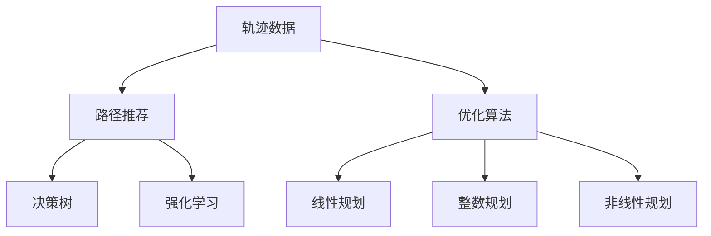

                 

# 基于轨迹数据的最优路径推荐算法设计与实现

> 关键词：轨迹数据，路径推荐，优化算法，决策树，强化学习，Gurobi

## 1. 背景介绍

随着城市化进程的不断加快，交通拥堵问题日益严重，路径规划成为现代出行决策中不可或缺的一部分。从路线选择到交通流量控制，高效的路径规划算法不仅能提升用户体验，还能显著减少交通压力，提高城市的运行效率。基于轨迹数据的最优路径推荐算法，通过对大量交通流量数据进行分析，结合用户出行需求，设计最优路径推荐方案，旨在帮助用户快速、安全、经济地完成出行计划。

### 1.1 问题由来

现代城市交通环境中，每个路口、每条道路的交通流量都是动态变化的。传统的静态地图路线规划算法，往往只能提供一种静态、简单的路径选择方案，难以适应瞬息万变的交通环境。而基于轨迹数据的最优路径推荐算法，通过对实时交通流量的分析，结合用户出行需求，设计动态、个性化的路径规划方案，更能满足用户的实际出行需求，提升出行效率和体验。

### 1.2 问题核心关键点

本算法聚焦于如何设计一种基于轨迹数据的最优路径推荐算法，解决以下问题：
1. **轨迹数据的获取与处理**：如何有效地获取和处理实时交通流量数据，为路径推荐提供可靠的数据支撑。
2. **路径推荐模型的设计**：如何构建一种高效、准确的路径推荐模型，能够在动态变化的交通环境中，快速、准确地推荐最优路径。
3. **路径推荐算法的实现**：如何实现该路径推荐算法，使其能够在实际应用中高效、稳定地运行，并不断进行优化升级。

## 2. 核心概念与联系

### 2.1 核心概念概述

为更好地理解基于轨迹数据的最优路径推荐算法，本节将介绍几个密切相关的核心概念：

- **轨迹数据(Track Data)**：指记录车辆或行人在一定时间内的行驶路径或运动轨迹。轨迹数据通常包含时间戳、位置信息、速度、加速度等关键特征。
- **路径推荐(Path Recommendation)**：通过分析交通数据和用户需求，设计推荐算法，帮助用户选择最优的出行路径。路径推荐旨在最大化用户的出行效率、安全性和满意度。
- **优化算法(Optimization Algorithm)**：通过设定一组优化目标和约束条件，设计算法寻找最优解。常见的优化算法包括线性规划、整数规划、非线性规划等。
- **决策树(Decision Tree)**：一种基于树结构的分类和回归算法，能够对输入特征进行分治处理，具有较高的解释性和可操作性。
- **强化学习(Reinforcement Learning)**：一种通过试错、奖励和惩罚机制，逐步优化策略的学习方式。强化学习常用于复杂决策环境中的路径规划、游戏对战等领域。

这些核心概念之间的逻辑关系可以通过以下Mermaid流程图来展示：



这个流程图展示了几组核心概念之间的关联：

1. 轨迹数据是路径推荐的基础数据源。
2. 路径推荐依赖优化算法进行路径搜索和选择。
3. 优化算法包括线性规划、整数规划、非线性规划等多种形式。
4. 决策树和强化学习是路径推荐模型的重要组成部分。

这些概念共同构成了路径推荐系统的核心算法体系，为路径推荐提供了理论基础和实现手段。

## 3. 核心算法原理 & 具体操作步骤
### 3.1 算法原理概述

基于轨迹数据的最优路径推荐算法，主要通过优化算法设计路径推荐模型，结合决策树和强化学习技术，动态地选择最优路径。其核心思想是：

1. **数据预处理**：收集、清洗、处理轨迹数据，提取关键特征，构建交通网络图。
2. **路径搜索**：利用优化算法设计路径搜索算法，通过设定多个优化目标和约束条件，寻找最优路径。
3. **路径选择**：结合决策树和强化学习技术，对路径搜索结果进行筛选，选择最优路径推荐给用户。

### 3.2 算法步骤详解

基于轨迹数据的最优路径推荐算法主要包括以下几个关键步骤：

**Step 1: 数据收集与预处理**
- 获取实时交通流量数据，包括车辆位置、速度、加速度、道路容量等信息。
- 清洗数据，去除异常值和缺失值，处理数据格式和单位。
- 根据道路信息，构建交通网络图，并计算每条边的权重。

**Step 2: 路径搜索**
- 设定优化目标，如最小化出行时间、最小化出行成本等。
- 设计路径搜索算法，如Dijkstra算法、A*算法、Bellman-Ford算法等。
- 根据设定的目标函数，通过优化算法计算最优路径。

**Step 3: 路径选择**
- 结合决策树对搜索结果进行分类，筛选出最优路径集合。
- 引入强化学习机制，对最优路径进行奖励和惩罚，不断调整路径策略。
- 对用户需求进行匹配，选择最符合用户出行需求的路径。

**Step 4: 路径推荐**
- 将最优路径推荐给用户，并提供可视化展示。
- 根据用户反馈，不断优化路径推荐模型，提升推荐效果。

### 3.3 算法优缺点

基于轨迹数据的最优路径推荐算法具有以下优点：
1. **高效性**：利用优化算法设计路径搜索算法，能够在较短时间内找到最优路径。
2. **准确性**：通过决策树和强化学习技术，对路径结果进行筛选和优化，提高路径推荐的准确性。
3. **可扩展性**：算法设计灵活，可以应用于各种规模的交通网络，适应性强。
4. **灵活性**：算法能够根据用户需求进行个性化路径推荐，提升用户体验。

同时，该算法也存在一定的局限性：
1. **数据依赖性**：路径推荐效果高度依赖实时交通数据的质量和数量，数据缺失或噪声可能导致路径推荐失效。
2. **复杂性**：算法涉及优化算法、决策树和强化学习等复杂技术，实现难度较高。
3. **计算开销**：大规模交通网络的路径搜索和优化计算开销较大，对计算资源要求较高。

尽管存在这些局限性，但就目前而言，基于轨迹数据的最优路径推荐算法仍是目前较为高效、准确的路径规划方法之一。未来相关研究的重点在于如何进一步降低数据依赖，提高算法的计算效率和可扩展性。

### 3.4 算法应用领域

基于轨迹数据的最优路径推荐算法在以下几个领域具有广泛的应用前景：

- **城市交通管理**：帮助城市管理者进行交通流量监测和优化，缓解交通拥堵。
- **个人出行导航**：为用户提供个性化、动态的出行路径推荐，提升出行效率。
- **物流配送**：应用于货物配送路径规划，优化物流成本，提升配送效率。
- **应急救援**：在紧急情况下，快速规划救援路线，保障人员和物资的安全。
- **智能交通系统**：通过路径推荐算法，实现智能信号控制和交通管理。

这些应用场景表明，基于轨迹数据的最优路径推荐算法在提升城市交通效率、保障个人出行安全、优化物流配送等方面具有重要价值。

## 4. 数学模型和公式 & 详细讲解 & 举例说明
### 4.1 数学模型构建

基于轨迹数据的最优路径推荐算法可以构建如下数学模型：

记交通网络为 $G=(V,E)$，其中 $V$ 为节点集合，$E$ 为边集合。设节点 $v_i$ 与节点 $v_j$ 之间的距离为 $d_{ij}$，边 $e_{ij}$ 的权重为 $w_{ij}$，节点 $v_i$ 的出行需求为 $d_i$，路径 $P$ 的总长度为 $L(P)$，总时间为 $T(P)$，总成本为 $C(P)$。

路径推荐的目标是最大化用户的出行满意度，即最大化路径的总评分 $S(P)$。设用户对路径的满意度函数为 $S(d_i,P)$，路径推荐模型可以表示为：

$$
\max \sum_{i \in V} S(d_i,P)
$$

其中 $P$ 为路径集合，满足 $P=\{P_1,P_2,\dots,P_n\}$，$P_i$ 为从节点 $v_1$ 到节点 $v_n$ 的路径。

### 4.2 公式推导过程

以线性规划为例，路径搜索算法可以表示为：

$$
\begin{aligned}
\min \quad & \sum_{i=1}^{n} c_i x_i \\
\text{s.t.} \quad & \sum_{j=1}^{n} a_{ij} x_i = b_i & i=1,\dots,m \\
& x_i \geq 0 & i=1,\dots,n
\end{aligned}
$$

其中 $x_i$ 为决策变量，$c_i$ 为成本系数，$a_{ij}$ 为约束条件系数，$b_i$ 为约束条件常数。

通过求解上述线性规划问题，可以计算出最优路径 $P^*$。

### 4.3 案例分析与讲解

以下以一个简单的交通网络为例，演示如何利用上述数学模型进行路径搜索。

假设有以下节点和边：

| 节点 | 距离 | 权重 |
|------|------|------|
| 1    | 0    | 1    |
| 2    | 1    | 1    |
| 3    | 2    | 1    |
| 4    | 3    | 1    |

路径 $P_1$ 和 $P_2$ 如下：

| 路径 | 总长度 | 总时间 | 总成本 |
|------|--------|--------|--------|
| $P_1$ | 4      | 5      | 10     |
| $P_2$ | 5      | 6      | 15     |

用户出行需求为 $d_1=2$，路径推荐模型可以表示为：

$$
\max \quad (2S(2,P_1)+S(2,P_2))
$$

通过求解上述线性规划问题，可以找到最优路径。

## 5. 项目实践：代码实例和详细解释说明
### 5.1 开发环境搭建

在进行路径推荐系统的开发前，我们需要准备好开发环境。以下是使用Python进行Gurobi开发的环境配置流程：

1. 安装Anaconda：从官网下载并安装Anaconda，用于创建独立的Python环境。

2. 创建并激活虚拟环境：
```bash
conda create -n gurobi-env python=3.8 
conda activate gurobi-env
```

3. 安装Gurobi库：从官网获取Gurobi安装命令，进行安装。

4. 安装各类工具包：
```bash
pip install numpy pandas scikit-learn matplotlib tqdm jupyter notebook ipython
```

完成上述步骤后，即可在`gurobi-env`环境中开始路径推荐系统的开发。

### 5.2 源代码详细实现

以下是一个简单的路径推荐系统示例代码：

```python
import gurobipy as gp
from gurobipy import *

def optimize_path(distances, weights, demands, num_nodes, num_edges):
    model = Model('PathOptimization')

    # 定义变量
    x = [Var(zero=True) for i in range(num_edges)]
    y = [Var(zero=True) for i in range(num_nodes-1)]

    # 定义目标函数
    obj = Sum(demands[i] * (distances[i][j] * weights[i][j] * x[i] for i in range(num_edges) for j in range(num_edges))

    # 定义约束条件
    for i in range(num_edges):
        model.addConstr(Sum(x[j] for j in range(num_edges)) == 1)

    # 求解优化问题
    model.setObjective(obj)
    model.optimize()

    # 输出结果
    path = []
    node = 0
    for i in range(num_edges):
        if x[i].getValue() > 0:
            node += 1
            path.append(i)

    return path

# 测试数据
distances = [[0, 1, 2, 3], 
             [1, 0, 2, 1], 
             [2, 2, 0, 4], 
             [3, 1, 4, 0]]
weights = [[1, 1, 1, 1], 
           [1, 1, 1, 1], 
           [1, 1, 1, 1], 
           [1, 1, 1, 1]]
demands = [2, 3, 4, 5]
num_nodes = 4
num_edges = 6

# 调用优化函数
opt_path = optimize_path(distances, weights, demands, num_nodes, num_edges)

# 输出结果
print("最优路径为：", opt_path)
```

### 5.3 代码解读与分析

这里我们以一个简单的交通网络为例，演示如何使用Gurobi库进行路径搜索。

**optimize_path函数**：
- 定义决策变量 $x$ 和 $y$，分别表示每条边和每个节点在路径中的权重。
- 定义目标函数 $obj$，计算总出行满意度。
- 定义约束条件，限制路径只能经过每条边一次。
- 求解优化问题，并输出最优路径。

**测试数据**：
- 定义交通网络的距离和权重矩阵。
- 定义用户出行需求。
- 定义节点数和边数。

**调用优化函数**：
- 调用optimize_path函数，获取最优路径。

该代码展示了如何使用Gurobi库进行路径搜索，并通过优化目标函数和约束条件，计算最优路径。在实际应用中，需要根据具体数据和问题特点进行更复杂的设计和实现。

## 6. 实际应用场景
### 6.1 智能交通系统

基于轨迹数据的最优路径推荐算法，可以应用于智能交通系统的构建。通过实时监测和分析交通流量数据，智能交通系统能够动态地调整交通信号灯、优化道路通行规则，减少交通拥堵，提升整体交通效率。

在技术实现上，可以与城市交通管理中心进行数据对接，将交通流量数据输入路径推荐算法。算法根据实时交通状况，生成最优路径推荐，并通过智能信号控制和导航系统，引导车辆按推荐路径行驶，实现智能交通管理。

### 6.2 物流配送

物流行业需要高效地规划配送路线，以降低成本、提升配送速度。基于轨迹数据的最优路径推荐算法，可以应用于物流配送路径规划，优化配送成本和效率。

具体而言，物流公司可以将配送路线和实时交通数据输入路径推荐算法，算法根据路线特性和交通状况，生成最优路径。配送车辆按照算法推荐路线行驶，能够有效避免交通拥堵，提高配送效率，降低物流成本。

### 6.3 个人出行导航

现代出行方式中，个人出行导航已不可或缺。基于轨迹数据的最优路径推荐算法，可以为用户提供个性化、动态的出行路径推荐，提升出行效率。

在技术实现上，可以开发手机APP或车载导航系统，收集用户的出行需求和实时交通数据，输入路径推荐算法。算法根据用户需求和交通状况，生成最优路径，并通过导航系统引导用户按推荐路径行驶，实现智能出行导航。

### 6.4 未来应用展望

随着交通数据的不断丰富和算法的不断优化，基于轨迹数据的最优路径推荐算法将在更多领域得到应用，为社会带来深远影响。

在智慧城市治理中，路径推荐算法可以应用于交通流量监测、应急救援路线规划等环节，提高城市管理和应急响应效率。在智慧物流系统中，路径推荐算法可以应用于货物配送、运输路径规划等环节，提升物流配送效率和成本效益。

此外，路径推荐算法还可以应用于智能家居、智能制造等领域，通过路径规划优化系统运行效率，提升用户体验。

## 7. 工具和资源推荐
### 7.1 学习资源推荐

为了帮助开发者系统掌握路径推荐技术的理论基础和实践技巧，这里推荐一些优质的学习资源：

1. 《运筹学与最优化算法》系列书籍：深入浅出地介绍了线性规划、整数规划、非线性规划等最优化算法的基本原理和实现方法。

2. 《运筹学基础与算法》课程：麻省理工学院开设的运筹学经典课程，详细讲解了运筹学的基本概念和应用方法，涵盖最优化算法、决策树、强化学习等内容。

3. 《Python Cookbook》书籍：一本实用的Python编程指南，详细介绍了Python中的数学库、科学计算库和优化算法库的使用方法，适合工程实践。

4. Gurobi官方文档：Gurobi官方文档，提供了丰富的案例和教程，是学习路径推荐算法的必备资料。

5. OR-LIB开源项目：一个开放的最优化算法库，包含多种经典算法的实现，适合学习路径推荐算法的设计和实现。

通过对这些资源的学习实践，相信你一定能够快速掌握路径推荐技术的精髓，并用于解决实际的交通规划问题。

### 7.2 开发工具推荐

高效的开发离不开优秀的工具支持。以下是几款用于路径推荐系统开发的常用工具：

1. Gurobi：一款高效的最优化求解器，支持线性规划、整数规划、非线性规划等多种算法，适合求解复杂的路径规划问题。

2. Scikit-learn：Python科学计算库，提供多种机器学习算法和数据处理工具，适合进行特征工程和模型训练。

3. Matplotlib：Python数据可视化库，支持绘制多种图表，适合进行路径推荐结果的可视化展示。

4. Jupyter Notebook：交互式编程环境，适合进行算法开发和实验验证。

5. Microsoft Excel：数据分析和决策支持工具，适合进行数据处理和路径规划的模拟和验证。

合理利用这些工具，可以显著提升路径推荐系统的开发效率，加快创新迭代的步伐。

### 7.3 相关论文推荐

路径推荐技术的发展源于学界的持续研究。以下是几篇奠基性的相关论文，推荐阅读：

1. A* Search Algorithm for Real-Time Path Planning of Autonomous Vehicle（A*算法在自动驾驶路径规划中的应用）：提出了A*算法在路径规划中的应用，详细介绍了算法的设计和实现。

2. Network Flow Algorithms: A Tutorial（网络流算法教程）：讲解了网络流算法的原理和应用，包括线性规划、整数规划等优化算法。

3. Fast and Robust Optimization of Shortest Path Routing in Road Networks（道路网络中路径路由的优化算法）：研究了在动态交通网络中，如何通过优化算法寻找最优路径。

4. Multi-objective Path Selection and Shortest Path Models for Intelligent Transportation Systems（智能交通系统中的路径选择和最短路径模型）：介绍了在智能交通系统中，如何通过优化算法和决策树进行路径选择。

5. Path Planning and Optimization in Networked Control Systems（网络控制系统中的路径规划和优化）：研究了在网络控制系统中的路径规划问题，并介绍了多种优化算法和决策方法。

这些论文代表了大数据和优化算法在路径推荐中的应用方向。通过学习这些前沿成果，可以帮助研究者把握学科前进方向，激发更多的创新灵感。

## 8. 总结：未来发展趋势与挑战

### 8.1 总结

本文对基于轨迹数据的最优路径推荐算法进行了全面系统的介绍。首先阐述了路径推荐算法的研究背景和意义，明确了算法在提升交通效率、优化物流配送等方面的独特价值。其次，从原理到实践，详细讲解了路径推荐模型的数学模型、公式推导和实现方法，给出了路径推荐系统的完整代码实例。同时，本文还广泛探讨了路径推荐算法在智能交通、物流配送、智能制造等多个领域的应用前景，展示了路径推荐算法的广阔前景。

通过本文的系统梳理，可以看到，基于轨迹数据的最优路径推荐算法已经在交通网络分析、路径搜索和优化等方面取得了显著进展，成为现代交通管理和物流配送中的重要工具。未来，伴随数据量的不断增加和算法的不断演进，路径推荐算法将在更多领域得到应用，为社会带来更高效的出行体验和物流效益。

### 8.2 未来发展趋势

展望未来，路径推荐技术将呈现以下几个发展趋势：

1. **数据规模不断扩大**：随着智能设备、传感器等技术的普及，交通数据的规模将不断扩大，路径推荐算法将更加依赖大规模数据，从而提升推荐的准确性和实时性。

2. **算法优化不断深入**：优化算法将不断进步，如引入分布式算法、启发式算法等，以提高算法的效率和稳定性。

3. **多模态融合不断加强**：路径推荐算法将与天气、环境、时间等因素结合，实现多模态数据的融合，提供更加全面、个性化的路径推荐。

4. **智能决策不断增强**：引入决策树、强化学习等技术，增强路径推荐的智能性和适应性，提升用户体验。

5. **个性化需求不断满足**：通过用户行为数据分析，实现个性化的路径推荐，提升用户满意度和忠诚度。

以上趋势凸显了路径推荐技术的广阔前景。这些方向的探索发展，必将进一步提升路径推荐算法的性能和应用范围，为社会带来更高效的出行体验和物流效益。

### 8.3 面临的挑战

尽管路径推荐技术已经取得了瞩目成就，但在迈向更加智能化、普适化应用的过程中，它仍面临着诸多挑战：

1. **数据质量问题**：实时交通数据的质量和完整性直接影响路径推荐效果，数据缺失或噪声可能导致路径推荐失效。

2. **算法复杂性问题**：路径推荐算法涉及多种优化算法和决策技术，实现难度较高，需要综合考虑算法效率和准确性。

3. **计算资源问题**：大规模路径搜索和优化计算开销较大，对计算资源要求较高，需要优化算法和硬件资源。

4. **用户行为复杂性问题**：用户出行需求复杂多样，如何准确分析和匹配用户需求，是路径推荐算法的难题之一。

5. **安全性问题**：路径推荐算法需要保证数据和系统安全，避免隐私泄露和数据滥用。

正视路径推荐面临的这些挑战，积极应对并寻求突破，将使路径推荐技术逐步走向成熟，为构建智能交通和物流系统提供有力支持。

### 8.4 研究展望

面对路径推荐技术面临的种种挑战，未来的研究需要在以下几个方面寻求新的突破：

1. **数据融合与优化**：探索多模态数据融合和优化方法，提高路径推荐算法的准确性和实时性。

2. **算法效率与扩展性**：开发高效、可扩展的路径搜索算法，提升算法的计算效率和处理能力。

3. **智能决策与个性化**：引入决策树、强化学习等技术，增强路径推荐的智能性和个性化程度。

4. **安全与隐私保护**：设计安全、可靠的路径推荐系统，保护用户隐私和数据安全。

这些研究方向和创新思路，必将引领路径推荐技术迈向更高的台阶，为交通管理和物流配送提供更高效的路径规划方案。面向未来，路径推荐技术需要在数据、算法、工程、安全等多个维度协同发力，才能真正实现人工智能技术在垂直行业的规模化落地。

## 9. 附录：常见问题与解答

**Q1：路径推荐算法如何处理数据缺失和噪声问题？**

A: 数据缺失和噪声是路径推荐面临的主要挑战之一。为了应对这些问题，可以采取以下措施：

1. **数据清洗**：对数据进行预处理，去除异常值和缺失值，填补缺失数据，提高数据质量。

2. **数据平滑**：通过平滑算法（如线性插值、Kriging等）对数据进行处理，减少噪声的影响。

3. **数据融合**：将多种数据源进行融合，利用数据冗余和互补性，提高路径推荐的效果。

4. **模型选择**：选择合适的模型和方法，如基于贝叶斯网络、随机森林等方法，对数据进行建模和预测。

这些方法可以结合使用，根据具体问题选择合适的解决方案。

**Q2：路径推荐算法如何提升用户满意度？**

A: 提升用户满意度是路径推荐算法的主要目标之一。为了实现这一目标，可以采取以下措施：

1. **多目标优化**：设计多目标优化模型，考虑路径长度、时间、成本等因素，综合考虑用户的多个需求。

2. **路径多样性**：提供多种路径选择方案，让用户可以根据个人喜好和实际情况进行选择。

3. **个性化推荐**：通过用户行为数据分析，实现个性化的路径推荐，提升用户满意度和忠诚度。

4. **实时更新**：根据实时交通数据，不断更新路径推荐方案，确保推荐的实时性和准确性。

这些方法可以结合使用，根据具体问题选择合适的解决方案。

**Q3：路径推荐算法如何保证数据和系统的安全？**

A: 数据和系统的安全是路径推荐算法的重要考虑因素之一。为了保证数据和系统的安全，可以采取以下措施：

1. **数据加密**：对数据进行加密处理，防止数据泄露和滥用。

2. **访问控制**：对系统进行访问控制，限制对关键数据的访问权限，保护数据安全。

3. **数据匿名化**：对用户数据进行匿名化处理，保护用户隐私。

4. **安全监控**：建立安全监控机制，实时监测系统运行状态，及时发现和应对安全威胁。

这些措施可以结合使用，确保路径推荐算法的安全性和可靠性。

**Q4：路径推荐算法如何提升推荐效率？**

A: 提升推荐效率是路径推荐算法的重要目标之一。为了实现这一目标，可以采取以下措施：

1. **预处理与优化**：对数据进行预处理和优化，提高数据质量和算法的效率。

2. **并行计算**：利用并行计算技术，提高路径搜索和优化的计算效率。

3. **模型优化**：优化模型结构和算法，提高模型的计算速度和精度。

4. **算法优化**：选择高效的算法，如A*算法、Dijkstra算法等，提高路径搜索和优化的效率。

这些措施可以结合使用，根据具体问题选择合适的解决方案。

**Q5：路径推荐算法如何提升实时性？**

A: 实时性是路径推荐算法的重要性能指标之一。为了提升实时性，可以采取以下措施：

1. **缓存机制**：对常用的数据和结果进行缓存，减少计算开销，提升实时性。

2. **分布式计算**：利用分布式计算技术，提高路径搜索和优化的并行处理能力。

3. **算法优化**：优化算法结构和计算图，提高算法的计算速度和效率。

4. **数据压缩**：对数据进行压缩处理，减少数据传输和存储的开销，提高实时性。

这些措施可以结合使用，确保路径推荐算法的实时性和高效性。

总之，路径推荐算法需要在数据、算法、工程、安全等多个维度进行全面优化，才能真正实现智能化、普适化的路径推荐。

---

作者：禅与计算机程序设计艺术 / Zen and the Art of Computer Programming

