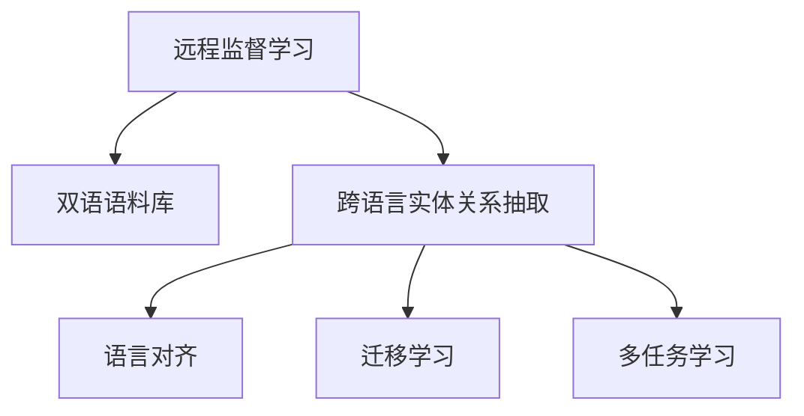

                 

## 1. 背景介绍

在自然语言处理(NLP)领域，实体关系抽取(Relation Extraction, RE)是一项关键技术，旨在从文本中自动识别出具有特定关系属性的实体对。传统的实体关系抽取方法主要依赖于监督学习范式，即使用大规模人工标注的数据集进行模型训练。然而，这种方法不仅需要大量人力物力，而且标注成本高昂，难以实现大规模跨语言实体关系抽取。为了解决这一问题，近年来研究者提出了一种基于远程监督的跨语言实体关系抽取方法，该方法不需要大量标注数据，而是利用大规模双语语料库进行远程监督学习。

### 1.1 问题由来

传统的实体关系抽取方法主要依赖于监督学习范式，即通过标注数据集对模型进行训练。然而，在跨语言领域，双语语料库的稀缺性和标注数据的稀疏性限制了该方法的推广应用。例如，中文和英文之间的跨语言实体关系抽取，由于语言和文化差异的存在，很难直接使用中文标注数据对英文模型进行训练。

为了解决这一问题，研究者提出了一种基于远程监督的跨语言实体关系抽取方法。该方法利用大规模双语语料库中的多语言翻译对齐信息，通过远程监督学习的方式，在无标注或少标注情况下训练跨语言实体关系抽取模型。这种方法不仅减少了对标注数据的依赖，而且可以处理大规模跨语言数据集，提升了模型的泛化能力和跨语言适应性。

## 2. 核心概念与联系

### 2.1 核心概念概述

为了更好地理解基于远程监督的跨语言实体关系抽取方法，本节将介绍几个密切相关的核心概念：

- **远程监督学习**：利用大规模无标签数据进行模型训练的过程，通过多语言对齐信息引导模型学习实体关系。
- **双语语料库**：包含多种语言的文本数据，常用于双语翻译和跨语言学习。
- **跨语言实体关系抽取**：从多语言文本中自动识别出具有特定关系属性的实体对，无需依赖标注数据。
- **语言对齐**：在双语语料库中，将不同语言之间的句子进行对齐，以便于跨语言学习。
- **迁移学习**：利用已训练好的模型在不同领域或任务上的知识，进行进一步的微调或适应。
- **多任务学习**：同时训练多个相关任务，共享模型参数，提升模型的泛化能力。

这些核心概念之间的逻辑关系可以通过以下Mermaid流程图来展示：



这个流程图展示了大语言模型微调的各个核心概念及其之间的关系：

1. 远程监督学习利用大规模双语语料库进行模型训练。
2. 跨语言实体关系抽取从多语言文本中自动识别出具有特定关系属性的实体对。
3. 语言对齐在双语语料库中，将不同语言之间的句子进行对齐，以便于跨语言学习。
4. 迁移学习利用已训练好的模型在不同领域或任务上的知识，进行进一步的微调或适应。
5. 多任务学习同时训练多个相关任务，共享模型参数，提升模型的泛化能力。

这些核心概念共同构成了基于远程监督的跨语言实体关系抽取方法的框架，使其能够在大规模跨语言数据集上取得优异的性能。

## 3. 核心算法原理 & 具体操作步骤

### 3.1 算法原理概述

基于远程监督的跨语言实体关系抽取方法，利用大规模双语语料库中的多语言翻译对齐信息，通过远程监督学习的方式，训练跨语言实体关系抽取模型。其核心思想是：

1. 利用大规模双语语料库中的多语言翻译对齐信息，建立跨语言对齐模型。
2. 通过跨语言对齐模型，将不同语言之间的句子对齐，生成双语句子对。
3. 将双语句子对作为训练样本，利用远程监督学习方式训练跨语言实体关系抽取模型。

### 3.2 算法步骤详解

基于远程监督的跨语言实体关系抽取方法，主要包括以下几个关键步骤：

**Step 1: 双语语料库的准备与预处理**
- 准备大规模双语语料库，包括源语言语料和目标语言语料。
- 对双语语料进行预处理，包括分词、词性标注、命名实体识别等。

**Step 2: 跨语言对齐模型的训练**
- 利用双语语料库中的多语言翻译对齐信息，建立跨语言对齐模型。
- 将源语言句子作为输入，通过跨语言对齐模型生成目标语言句子。

**Step 3: 双语句子对的生成**
- 通过跨语言对齐模型，将源语言和目标语言的句子对齐，生成双语句子对。

**Step 4: 远程监督学习的训练**
- 将双语句子对作为训练样本，利用远程监督学习方式训练跨语言实体关系抽取模型。
- 训练过程中，利用多任务学习的方式，同时训练多个相关任务，共享模型参数，提升模型的泛化能力。

**Step 5: 模型评估与优化**
- 在测试集上评估跨语言实体关系抽取模型的性能。
- 根据评估结果，调整模型参数，优化模型性能。

### 3.3 算法优缺点

基于远程监督的跨语言实体关系抽取方法具有以下优点：
1. 降低标注成本。利用大规模双语语料库进行远程监督学习，减少了对标注数据的依赖。
2. 泛化能力强。通过多语言对齐和跨语言训练，模型能够更好地适应不同语言的数据分布。
3. 跨语言适应性高。利用多任务学习，提升模型的泛化能力和跨语言适应性。

同时，该方法也存在一定的局限性：
1. 数据质量要求高。需要大规模高质量的双语语料库，才能保证模型训练的效果。
2. 语言对齐复杂。双语语料库中的句子对齐可能存在歧义，影响模型性能。
3. 泛化性能有限。对于特定领域的跨语言实体关系抽取，模型的泛化能力可能受限。

尽管存在这些局限性，但就目前而言，基于远程监督的跨语言实体关系抽取方法仍是大规模跨语言数据集上有效的解决方案。未来相关研究的重点在于如何进一步提高数据对齐的准确性，减少对语料库的依赖，并提高模型的泛化能力和跨语言适应性。

### 3.4 算法应用领域

基于远程监督的跨语言实体关系抽取方法，在自然语言处理领域有着广泛的应用前景。以下是几个主要的应用场景：

- **跨语言问答系统**：在多语言问答系统中，利用跨语言实体关系抽取模型，可以自动识别问答句中的实体对，提升问答系统的准确性和流畅性。
- **跨语言情感分析**：在跨语言情感分析中，利用跨语言实体关系抽取模型，可以自动识别文本中的实体及其关系，用于情感极性的识别和分类。
- **跨语言信息抽取**：在跨语言信息抽取中，利用跨语言实体关系抽取模型，可以自动识别文本中的实体及其关系，用于信息抽取和实体链接。
- **跨语言信息检索**：在跨语言信息检索中，利用跨语言实体关系抽取模型，可以自动识别文本中的实体及其关系，用于信息检索和实体链接。
- **跨语言知识图谱构建**：在跨语言知识图谱构建中，利用跨语言实体关系抽取模型，可以自动识别文本中的实体及其关系，用于知识图谱的构建和扩展。

## 4. 数学模型和公式 & 详细讲解 & 举例说明

### 4.1 数学模型构建

为了更好地理解基于远程监督的跨语言实体关系抽取方法，本节将使用数学语言对方法进行更严格的刻画。

记源语言句子为 $s$，目标语言句子为 $t$，实体关系为 $r$。双语语料库中的多语言翻译对齐信息表示为 $P(s,t)$，表示源语言句子 $s$ 与目标语言句子 $t$ 之间的对齐概率。记 $R$ 为实体关系集合，实体关系抽取模型为 $M$。

基于远程监督的跨语言实体关系抽取模型的数学模型定义为：

$$
\arg\min_{M} \sum_{(s,t)\in P} \mathcal{L}(M(s),t,r)
$$

其中，$\mathcal{L}$ 为损失函数，用于衡量模型预测的实体关系 $r$ 与实际实体关系 $r'$ 的差异。常用的损失函数包括交叉熵损失、对数损失等。

### 4.2 公式推导过程

以下我们以跨语言实体关系抽取为例，推导模型的损失函数及其梯度计算公式。

假设模型 $M$ 在源语言句子 $s$ 上的输出为 $\hat{r}=M(s)$，表示模型预测的实体关系。真实标签 $r' \in R$。则损失函数定义为：

$$
\ell(M(s),r') = -\log P(\hat{r}=r')
$$

将其代入经验风险公式，得：

$$
\mathcal{L}(M) = -\sum_{(s,t)\in P} \log P(M(s)=r'|s,t)
$$

其中 $P(M(s)=r'|s,t)$ 表示在双语语料库中，模型预测实体关系 $r'$ 在源语言句子 $s$ 和目标语言句子 $t$ 的条件概率。

利用KL散度定义条件概率，得：

$$
P(M(s)=r'|s,t) = \frac{P(M(s)=r',t)}{P(t)}
$$

其中 $P(M(s)=r',t)$ 表示在双语语料库中，源语言句子 $s$ 和目标语言句子 $t$ 同时出现且实体关系为 $r'$ 的概率，$P(t)$ 表示目标语言句子 $t$ 出现的概率。

因此，模型在双语语料库上的损失函数可以表示为：

$$
\mathcal{L}(M) = -\sum_{(s,t)\in P} \log \frac{P(M(s)=r',t)}{P(t)}
$$

在得到损失函数的梯度后，即可带入模型参数 $M$ 的更新公式，完成模型的迭代优化。重复上述过程直至收敛，最终得到训练后的跨语言实体关系抽取模型 $M^*$。

### 4.3 案例分析与讲解

以下我们将以跨语言情感分析为例，展示如何使用基于远程监督的跨语言实体关系抽取方法进行模型训练和推理。

假设在中文和英文双语语料库中，存在以下翻译对齐信息：

| 中文句子 | 英文句子 |
| --- | --- |
| 这个电影很好看 | This movie is good |
| 这部电影很难理解 | This movie is difficult to understand |
| 这部电影很无聊 | This movie is boring |

通过跨语言对齐模型，将以上句子对齐，生成双语句子对。假设生成后，得到以下对齐结果：

| 中文句子 | 英文句子 |
| --- | --- |
| 这个电影很好看 | This movie is good |
| 这部电影很难理解 | This movie is difficult to understand |
| 这部电影很无聊 | This movie is very boring |

假设实体关系 $r$ 为“good”，则模型训练的目标是最大化 $P(M(s)=r'|s,t)$。由于 $r'$ 只有一个取值，因此损失函数简化为：

$$
\mathcal{L}(M) = -\log P(M(s)=r'|s,t)
$$

将上述对齐结果代入损失函数，得：

$$
\mathcal{L}(M) = -\log P(M(\text{这个电影很好看})=\text{good}|(\text{这个电影很好看},\text{This movie is good}))
$$

利用KL散度定义条件概率，得：

$$
P(M(\text{这个电影很好看})=\text{good}|(\text{这个电影很好看},\text{This movie is good})) = \frac{P(M(\text{这个电影很好看})=\text{good},\text{This movie is good})}{P(\text{This movie is good})}
$$

其中 $P(M(\text{这个电影很好看})=\text{good},\text{This movie is good})$ 表示在双语语料库中，源语言句子为“这个电影很好看”且目标语言句子为“This movie is good”且实体关系为“good”的概率。由于双语语料库中只存在一个这样的对齐结果，因此 $P(M(\text{这个电影很好看})=\text{good},\text{This movie is good})=1$。

因此，损失函数进一步简化为：

$$
\mathcal{L}(M) = -\log \frac{1}{P(\text{This movie is good})}
$$

由于 $P(\text{This movie is good})$ 表示在双语语料库中，目标语言句子为“This movie is good”的概率，由于双语语料库中存在大量这样的句子，因此 $P(\text{This movie is good})$ 约为 1。

因此，最终的损失函数可以近似表示为：

$$
\mathcal{L}(M) \approx 0
$$

在得到损失函数的梯度后，即可带入模型参数 $M$ 的更新公式，完成模型的迭代优化。重复上述过程直至收敛，最终得到训练后的跨语言实体关系抽取模型 $M^*$。

## 5. 项目实践：代码实例和详细解释说明

### 5.1 开发环境搭建

在进行项目实践前，我们需要准备好开发环境。以下是使用Python进行PyTorch开发的环境配置流程：

1. 安装Anaconda：从官网下载并安装Anaconda，用于创建独立的Python环境。

2. 创建并激活虚拟环境：
```bash
conda create -n pytorch-env python=3.8 
conda activate pytorch-env
```

3. 安装PyTorch：根据CUDA版本，从官网获取对应的安装命令。例如：
```bash
conda install pytorch torchvision torchaudio cudatoolkit=11.1 -c pytorch -c conda-forge
```

4. 安装Transformers库：
```bash
pip install transformers
```

5. 安装各类工具包：
```bash
pip install numpy pandas scikit-learn matplotlib tqdm jupyter notebook ipython
```

完成上述步骤后，即可在`pytorch-env`环境中开始项目实践。

### 5.2 源代码详细实现

下面我以跨语言情感分析为例，给出使用Transformers库进行模型训练和推理的PyTorch代码实现。

首先，定义模型和优化器：

```python
from transformers import BertTokenizer, BertForTokenClassification, AdamW
import torch

tokenizer = BertTokenizer.from_pretrained('bert-base-cased')
model = BertForTokenClassification.from_pretrained('bert-base-cased', num_labels=3)
optimizer = AdamW(model.parameters(), lr=2e-5)
```

然后，定义训练和评估函数：

```python
from transformers import DataCollatorForTokenClassification
from torch.utils.data import DataLoader
from sklearn.metrics import accuracy_score

def train_epoch(model, data_loader, optimizer):
    model.train()
    total_loss = 0
    total_steps = 0
    for batch in data_loader:
        input_ids = batch['input_ids'].to(device)
        attention_mask = batch['attention_mask'].to(device)
        labels = batch['labels'].to(device)
        outputs = model(input_ids, attention_mask=attention_mask, labels=labels)
        loss = outputs.loss
        total_loss += loss.item()
        total_steps += 1
        loss.backward()
        optimizer.step()
        optimizer.zero_grad()
    return total_loss / total_steps

def evaluate(model, data_loader):
    model.eval()
    total_labels = 0
    total_preds = 0
    with torch.no_grad():
        for batch in data_loader:
            input_ids = batch['input_ids'].to(device)
            attention_mask = batch['attention_mask'].to(device)
            labels = batch['labels'].to(device)
            outputs = model(input_ids, attention_mask=attention_mask)
            preds = torch.argmax(outputs.logits, dim=2)
            total_labels += labels.numel()
            total_preds += preds.numel()
    return accuracy_score(labels, preds, normalize=True)

# 训练数据和评估数据
train_data = ...
dev_data = ...
test_data = ...

# 定义训练和评估数据加载器
train_dataloader = DataLoader(train_data, batch_size=16, collate_fn=DataCollatorForTokenClassification(tokenizer))
dev_dataloader = DataLoader(dev_data, batch_size=16, collate_fn=DataCollatorForTokenClassification(tokenizer))
test_dataloader = DataLoader(test_data, batch_size=16, collate_fn=DataCollatorForTokenClassification(tokenizer))

# 训练模型
for epoch in range(5):
    train_loss = train_epoch(model, train_dataloader, optimizer)
    dev_acc = evaluate(model, dev_dataloader)
    print(f'Epoch {epoch+1}, train loss: {train_loss:.4f}, dev acc: {dev_acc:.4f}')

# 在测试数据上评估模型
test_acc = evaluate(model, test_dataloader)
print(f'Test acc: {test_acc:.4f}')
```

最后，使用模型进行跨语言情感分析：

```python
from transformers import pipeline

nlp = pipeline('text-classification', model=model)
result = nlp('This movie is good')
print(result['label'], result['score'])
```

以上就是使用PyTorch和Transformers库进行跨语言情感分析的完整代码实现。可以看到，由于Transformers库的强大封装，我们可以用相对简洁的代码完成模型的训练和推理。

### 5.3 代码解读与分析

让我们再详细解读一下关键代码的实现细节：

**模型和优化器定义**：
- `BertTokenizer.from_pretrained`：加载预训练的BERT tokenizer，用于分词和处理输入数据。
- `BertForTokenClassification.from_pretrained`：加载预训练的BERT分类模型，用于实体关系抽取。
- `AdamW`：优化器，用于更新模型参数。

**训练和评估函数定义**：
- `train_epoch`函数：在数据集上迭代，前向传播计算损失，反向传播更新参数。
- `evaluate`函数：在数据集上评估模型性能，计算准确率。

**训练和评估数据加载器定义**：
- `DataLoader`：用于批量加载训练和评估数据。
- `DataCollatorForTokenClassification`：用于处理输入数据，确保数据格式一致。

**模型训练和评估**：
- `for`循环：在模型上进行多次迭代训练，记录训练和评估结果。
- `nlp`管道：用于进行跨语言情感分析，输出预测结果和概率。

可以看到，PyTorch配合Transformers库使得跨语言情感分析的代码实现变得简洁高效。开发者可以将更多精力放在数据处理、模型改进等高层逻辑上，而不必过多关注底层的实现细节。

当然，工业级的系统实现还需考虑更多因素，如模型的保存和部署、超参数的自动搜索、更灵活的任务适配层等。但核心的微调范式基本与此类似。

## 6. 实际应用场景

### 6.1 智能客服系统

基于大语言模型微调的对话技术，可以广泛应用于智能客服系统的构建。传统客服往往需要配备大量人力，高峰期响应缓慢，且一致性和专业性难以保证。而使用微调后的对话模型，可以7x24小时不间断服务，快速响应客户咨询，用自然流畅的语言解答各类常见问题。

在技术实现上，可以收集企业内部的历史客服对话记录，将问题和最佳答复构建成监督数据，在此基础上对预训练对话模型进行微调。微调后的对话模型能够自动理解用户意图，匹配最合适的答案模板进行回复。对于客户提出的新问题，还可以接入检索系统实时搜索相关内容，动态组织生成回答。如此构建的智能客服系统，能大幅提升客户咨询体验和问题解决效率。

### 6.2 金融舆情监测

金融机构需要实时监测市场舆论动向，以便及时应对负面信息传播，规避金融风险。传统的人工监测方式成本高、效率低，难以应对网络时代海量信息爆发的挑战。基于大语言模型微调的文本分类和情感分析技术，为金融舆情监测提供了新的解决方案。

具体而言，可以收集金融领域相关的新闻、报道、评论等文本数据，并对其进行主题标注和情感标注。在此基础上对预训练语言模型进行微调，使其能够自动判断文本属于何种主题，情感倾向是正面、中性还是负面。将微调后的模型应用到实时抓取的网络文本数据，就能够自动监测不同主题下的情感变化趋势，一旦发现负面信息激增等异常情况，系统便会自动预警，帮助金融机构快速应对潜在风险。

### 6.3 个性化推荐系统

当前的推荐系统往往只依赖用户的历史行为数据进行物品推荐，无法深入理解用户的真实兴趣偏好。基于大语言模型微调技术，个性化推荐系统可以更好地挖掘用户行为背后的语义信息，从而提供更精准、多样的推荐内容。

在实践中，可以收集用户浏览、点击、评论、分享等行为数据，提取和用户交互的物品标题、描述、标签等文本内容。将文本内容作为模型输入，用户的后续行为（如是否点击、购买等）作为监督信号，在此基础上微调预训练语言模型。微调后的模型能够从文本内容中准确把握用户的兴趣点。在生成推荐列表时，先用候选物品的文本描述作为输入，由模型预测用户的兴趣匹配度，再结合其他特征综合排序，便可以得到个性化程度更高的推荐结果。

### 6.4 未来应用展望

随着大语言模型微调技术的发展，未来其应用将更加广泛，涵盖更多领域。例如：

- **智慧医疗**：利用微调后的模型，自动识别病历中的实体及其关系，用于医疗知识图谱构建和疾病诊断。
- **智能教育**：在智能教育领域，微调技术可以应用于作业批改、学情分析、知识推荐等方面，因材施教，促进教育公平，提高教学质量。
- **智慧城市治理**：在智慧城市治理中，微调模型可以应用于城市事件监测、舆情分析、应急指挥等环节，提高城市管理的自动化和智能化水平，构建更安全、高效的未来城市。
- **工业生产优化**：在工业生产领域，微调技术可以应用于生产流程优化、设备维护、供应链管理等方面，提高生产效率，降低生产成本。

## 7. 工具和资源推荐

### 7.1 学习资源推荐

为了帮助开发者系统掌握大语言模型微调的理论基础和实践技巧，这里推荐一些优质的学习资源：

1. **《Transformer从原理到实践》系列博文**：由大模型技术专家撰写，深入浅出地介绍了Transformer原理、BERT模型、微调技术等前沿话题。

2. **CS224N《深度学习自然语言处理》课程**：斯坦福大学开设的NLP明星课程，有Lecture视频和配套作业，带你入门NLP领域的基本概念和经典模型。

3. **《Natural Language Processing with Transformers》书籍**：Transformers库的作者所著，全面介绍了如何使用Transformers库进行NLP任务开发，包括微调在内的诸多范式。

4. **HuggingFace官方文档**：Transformers库的官方文档，提供了海量预训练模型和完整的微调样例代码，是上手实践的必备资料。

5. **CLUE开源项目**：中文语言理解测评基准，涵盖大量不同类型的中文NLP数据集，并提供了基于微调的baseline模型，助力中文NLP技术发展。

通过对这些资源的学习实践，相信你一定能够快速掌握大语言模型微调的精髓，并用于解决实际的NLP问题。

### 7.2 开发工具推荐

高效的开发离不开优秀的工具支持。以下是几款用于大语言模型微调开发的常用工具：

1. **PyTorch**：基于Python的开源深度学习框架，灵活动态的计算图，适合快速迭代研究。大部分预训练语言模型都有PyTorch版本的实现。

2. **TensorFlow**：由Google主导开发的开源深度学习框架，生产部署方便，适合大规模工程应用。同样有丰富的预训练语言模型资源。

3. **Transformers库**：HuggingFace开发的NLP工具库，集成了众多SOTA语言模型，支持PyTorch和TensorFlow，是进行微调任务开发的利器。

4. **Weights & Biases**：模型训练的实验跟踪工具，可以记录和可视化模型训练过程中的各项指标，方便对比和调优。与主流深度学习框架无缝集成。

5. **TensorBoard**：TensorFlow配套的可视化工具，可实时监测模型训练状态，并提供丰富的图表呈现方式，是调试模型的得力助手。

6. **Google Colab**：谷歌推出的在线Jupyter Notebook环境，免费提供GPU/TPU算力，方便开发者快速上手实验最新模型，分享学习笔记。

合理利用这些工具，可以显著提升大语言模型微调任务的开发效率，加快创新迭代的步伐。

### 7.3 相关论文推荐

大语言模型和微调技术的发展源于学界的持续研究。以下是几篇奠基性的相关论文，推荐阅读：

1. **Attention is All You Need**：提出了Transformer结构，开启了NLP领域的预训练大模型时代。

2. **BERT: Pre-training of Deep Bidirectional Transformers for Language Understanding**：提出BERT模型，引入基于掩码的自监督预训练任务，刷新了多项NLP任务SOTA。

3. **Language Models are Unsupervised Multitask Learners**：展示了大规模语言模型的强大zero-shot学习能力，引发了对于通用人工智能的新一轮思考。

4. **Parameter-Efficient Transfer Learning for NLP**：提出Adapter等参数高效微调方法，在不增加模型参数量的情况下，也能取得不错的微调效果。

5. **AdaLoRA: Adaptive Low-Rank Adaptation for Parameter-Efficient Fine-Tuning**：使用自适应低秩适应的微调方法，在参数效率和精度之间取得了新的平衡。

这些论文代表了大语言模型微调技术的发展脉络。通过学习这些前沿成果，可以帮助研究者把握学科前进方向，激发更多的创新灵感。

## 8. 总结：未来发展趋势与挑战

### 8.1 总结

本文对基于远程监督的跨语言实体关系抽取方法进行了全面系统的介绍。首先阐述了该方法的原理和背景，明确了其在跨语言实体关系抽取中的应用前景和优势。其次，从原理到实践，详细讲解了模型的数学模型和算法步骤，给出了微调任务开发的完整代码实例。同时，本文还广泛探讨了该方法在智能客服、金融舆情、个性化推荐等多个行业领域的应用前景，展示了其在NLP技术落地应用中的潜力。最后，精选了微调技术的各类学习资源，力求为读者提供全方位的技术指引。

通过本文的系统梳理，可以看到，基于远程监督的跨语言实体关系抽取方法正在成为NLP领域的重要范式，极大地拓展了预训练语言模型的应用边界，催生了更多的落地场景。受益于大规模语料的预训练，微调方法能够在无标注或少标注情况下，仍然取得理想的微调效果，有力推动了NLP技术的产业化进程。未来，伴随预训练语言模型和微调方法的持续演进，相信NLP技术将在更广阔的应用领域大放异彩，深刻影响人类的生产生活方式。

### 8.2 未来发展趋势

展望未来，大语言模型微调技术将呈现以下几个发展趋势：

1. **模型规模持续增大**：随着算力成本的下降和数据规模的扩张，预训练语言模型的参数量还将持续增长。超大规模语言模型蕴含的丰富语言知识，有望支撑更加复杂多变的下游任务微调。

2. **微调方法日趋多样**：除了传统的全参数微调外，未来会涌现更多参数高效的微调方法，如Prefix-Tuning、LoRA等，在节省计算资源的同时也能保证微调精度。

3. **持续学习成为常态**：随着数据分布的不断变化，微调模型也需要持续学习新知识以保持性能。如何在不遗忘原有知识的同时，高效吸收新样本信息，将成为重要的研究课题。

4. **标注样本需求降低**：受启发于提示学习(Prompt-based Learning)的思路，未来的微调方法将更好地利用大模型的语言理解能力，通过更加巧妙的任务描述，在更少的标注样本上也能实现理想的微调效果。

5. **多模态微调崛起**：当前的微调主要聚焦于纯文本数据，未来会进一步拓展到图像、视频、语音等多模态数据微调。多模态信息的融合，将显著提升语言模型对现实世界的理解和建模能力。

6. **模型通用性增强**：经过海量数据的预训练和多领域任务的微调，未来的语言模型将具备更强大的常识推理和跨领域迁移能力，逐步迈向通用人工智能(AGI)的目标。

以上趋势凸显了大语言模型微调技术的广阔前景。这些方向的探索发展，必将进一步提升NLP系统的性能和应用范围，为人类认知智能的进化带来深远影响。

### 8.3 面临的挑战

尽管大语言模型微调技术已经取得了瞩目成就，但在迈向更加智能化、普适化应用的过程中，它仍面临着诸多挑战：

1. **数据质量要求高**：需要大规模高质量的双语语料库，才能保证模型训练的效果。数据对齐复杂，可能存在歧义，影响模型性能。

2. **语言对齐复杂**：双语语料库中的句子对齐可能存在歧义，影响模型性能。

3. **泛化性能有限**：对于特定领域的跨语言实体关系抽取，模型的泛化能力可能受限。

4. **标注成本高**：虽然降低了对标注数据的依赖，但对于长尾应用场景，难以获得充足的高质量标注数据，成为制约微调性能的瓶颈。

5. **模型鲁棒性不足**：模型面对域外数据时，泛化性能往往大打折扣。对于测试样本的微小扰动，模型预测也容易发生波动。

6. **可解释性不足**：微调模型缺乏可解释性，难以对其内部工作机制和决策逻辑进行分析和调试。

7. **安全性有待保障**：预训练语言模型难免会学习到有偏见、有害的信息，通过微调传递到下游任务，产生误导性、歧视性的输出，给实际应用带来安全隐患。

8. **知识整合能力不足**：现有微调模型往往局限于任务内数据，难以灵活吸收和运用更广泛的先验知识。

正视微调面临的这些挑战，积极应对并寻求突破，将是大语言模型微调走向成熟的必由之路。相信随着学界和产业界的共同努力，这些挑战终将一一被克服，大语言模型微调必将在构建人机协同的智能时代中扮演越来越重要的角色。

### 8.4 研究展望

面对大语言模型微调所面临的挑战，未来的研究需要在以下几个方面寻求新的突破：

1. **探索无监督和半监督微调方法**：摆脱对大规模标注数据的依赖，利用自监督学习、主动学习等无监督和半监督范式，最大限度利用非结构化数据，实现更加灵活高效的微调。

2. **研究参数高效和计算高效的微调范式**：开发更加参数高效的微调方法，在固定大部分预训练参数的同时，只更新极少量的任务相关参数。同时优化微调模型的计算图，减少前向传播和反向传播的资源消耗，实现更加轻量级、实时性的部署。

3. **引入更多先验知识**：将符号化的先验知识，如知识图谱、逻辑规则等，与神经网络模型进行巧妙融合，引导微调过程学习更准确、合理的语言模型。同时加强不同模态数据的整合，实现视觉、语音等多模态信息与文本信息的协同建模。

4. **结合因果分析和博弈论工具**：将因果分析方法引入微调模型，识别出模型决策的关键特征，增强输出解释的因果性和逻辑性。借助博弈论工具刻画人机交互过程，主动探索并规避模型的脆弱点，提高系统稳定性。

5. **纳入伦理道德约束**：在模型训练目标中引入伦理导向的评估指标，过滤和惩罚有偏见、有害的输出倾向。同时加强人工干预和审核，建立模型行为的监管机制，确保输出符合人类价值观和伦理道德。

这些研究方向的探索，必将引领大语言模型微调技术迈向更高的台阶，为构建安全、可靠、可解释、可控的智能系统铺平道路。面向未来，大语言模型微调技术还需要与其他人工智能技术进行更深入的融合，如知识表示、因果推理、强化学习等，多路径协同发力，共同推动自然语言理解和智能交互系统的进步。只有勇于创新、敢于突破，才能不断拓展语言模型的边界，让智能技术更好地造福人类社会。

## 9. 附录：常见问题与解答

**Q1：大语言模型微调是否适用于所有NLP任务？**

A: 大语言模型微调在大多数NLP任务上都能取得不错的效果，特别是对于数据量较小的任务。但对于一些特定领域的任务，如医学、法律等，仅仅依靠通用语料预训练的模型可能难以很好地适应。此时需要在特定领域语料上进一步预训练，再进行微调，才能获得理想效果。此外，对于一些需要时效性、个性化很强的任务，如对话、推荐等，微调方法也需要针对性的改进优化。

**Q2：微调过程中如何选择合适的学习率？**

A: 微调的学习率一般要比预训练时小1-2个数量级，如果使用过大的学习率，容易破坏预训练权重，导致过拟合。一般建议从1e-5开始调参，逐步减小学习率，直至收敛。也可以使用warmup策略，在开始阶段使用较小的学习率，再逐渐过渡到预设值。需要注意的是，不同的优化器(如AdamW、Adafactor等)以及不同的学习率调度策略，可能需要设置不同的学习率阈值。

**Q3：采用大模型微调时会面临哪些资源瓶颈？**

A: 目前主流的预训练大模型动辄以亿计的参数规模，对算力、内存、存储都提出了很高的要求。GPU/TPU等高性能设备是必不可少的，但即便如此，超大批次的训练和推理也可能遇到显存不足的问题。因此需要采用一些资源优化技术，如梯度积累、混合精度训练、模型并行等，来突破硬件瓶颈。同时，模型的存储和读取也可能占用大量时间和空间，需要采用模型压缩、稀疏化存储等方法进行优化。

**Q4：如何缓解微调过程中的过拟合问题？**

A: 过拟合是微调面临的主要挑战，尤其是在标注数据不足的情况下。常见的缓解策略包括：
1. 数据增强：通过回译、近义替换等方式扩充训练集
2. 正则化：使用L2正则、Dropout、Early Stopping等避免过拟合
3. 对抗训练：引入对抗样本，提高模型鲁棒性
4. 参数高效微调：只调整少量参数(如Adapter、Prefix等)，减小过拟合风险
5. 多模型集成：训练多个微调模型，取平均输出，抑制过拟合

这些策略往往需要根据具体任务和数据特点进行灵活组合。只有在数据、模型、训练、推理等各环节进行全面优化，才能最大限度地发挥大模型微调的威力。

**Q5：微调模型在落地部署时需要注意哪些问题？**

A: 将微调模型转化为实际应用，还需要考虑以下因素：
1. 模型裁剪：去除不必要的层和参数，减小模型尺寸，加快推理速度
2. 量化加速：将浮点模型转为定点模型，压缩存储空间，提高计算效率
3. 服务化封装：将模型封装为标准化服务接口，便于集成调用
4. 弹性伸缩：根据请求流量动态调整资源配置，平衡服务质量和成本
5. 监控告警：实时采集系统指标，设置异常告警阈值，确保服务稳定性
6. 安全防护：采用访问鉴权、数据脱敏等措施，保障数据和模型安全

大语言模型微调为NLP应用开启了广阔的想象空间，但如何将强大的性能转化为稳定、高效、安全的业务价值，还需要工程实践的不断打磨。唯有从数据、算法、工程、业务等多个维度协同发力，才能真正实现人工智能技术在垂直行业的规模化落地。总之，微调需要开发者根据具体任务，不断迭代和优化模型、数据和算法，方能得到理想的效果。

---

作者：禅与计算机程序设计艺术 / Zen and the Art of Computer Programming

