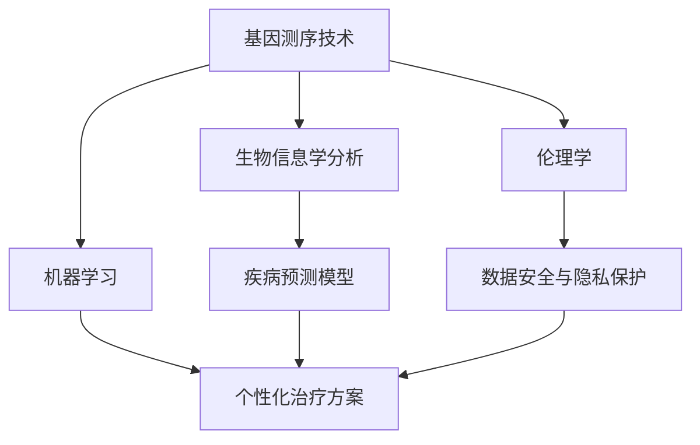

                 

## 1. 背景介绍

### 1.1 问题由来
在医疗领域，传统的诊疗方式主要依赖医生的经验和直觉，缺乏针对个体差异的有效分析手段。而个性化医疗，即基于个体遗传信息、环境因素和生活习惯等综合数据，提供定制化的诊疗方案，能够显著提升治疗效果和患者满意度。

个性化医疗的核心在于如何从海量的生物数据中提取出对个体健康有重要影响的特征，并构建有效的模型对个体健康状态进行预测和干预。近年来，随着基因测序技术的进步和数据存储处理能力的提升，个体化的基因组信息已成为个性化医疗的重要基石。

### 1.2 问题核心关键点
个性化医疗的关键技术包括：
- **基因测序技术**：能够高效、准确地读取和分析个体基因组信息，是大数据驱动个性化医疗的基石。
- **生物信息学分析**：利用数据分析和机器学习技术，从基因组数据中提取健康风险指标和疾病预测模型。
- **个体化治疗方案**：结合患者的历史诊疗数据和基因信息，生成个性化的治疗方案，包括药物选择、剂量调整等。
- **伦理和隐私保护**：确保基因数据的安全性和使用过程中的伦理问题，保护患者隐私。

本文将重点探讨在基因科技创业中，如何利用最新的基因测序和生物信息学技术，构建高效的个性化医疗方案，并探讨其在实际应用中的挑战和前景。

### 1.3 问题研究意义
个性化医疗技术的发展，不仅能显著提升疾病诊断的准确性和治疗效果，还能降低医疗成本，优化医疗资源分配，推动医疗服务的普及和公平。基因科技创业在此背景下，具有重大的研究意义和广阔的市场前景：

1. **推动医疗技术创新**：个性化医疗技术的应用，使得医疗领域进入数据驱动的精准医学时代，推动医学研究的创新。
2. **优化医疗服务**：个性化医疗能够提升诊疗的针对性和效率，减少误诊和过度医疗，提高医疗服务的质量。
3. **降低医疗成本**：通过个性化治疗方案，减少无效治疗和资源浪费，显著降低医疗费用。
4. **促进医疗公平**：个性化医疗能够为弱势群体提供更精准的医疗服务，缩小健康差距。

## 2. 核心概念与联系

### 2.1 核心概念概述

个性化医疗的实现需要依托一系列核心技术，包括基因测序、生物信息学分析、机器学习和伦理学等多个领域的知识。本节将对这些核心概念进行概述，并展示它们之间的联系。

**基因测序技术**：
- **原理**：利用高通量测序技术，对个体DNA序列进行全面读取和分析，获得基因组全貌。
- **应用**：用于发现致病基因、研究遗传疾病、识别药物靶点等。

**生物信息学分析**：
- **原理**：从基因组数据中提取生物学特征，构建疾病预测和风险评估模型。
- **应用**：基因变异分析、基因表达调控、疾病风险评估等。

**机器学习**：
- **原理**：利用训练好的模型对基因数据进行预测和分类，提供个性化的诊疗方案。
- **应用**：构建个性化治疗模型、识别基因与疾病的关联、优化医疗决策等。

**伦理学**：
- **原理**：关注基因数据的使用和共享，确保数据安全、隐私保护和伦理问题。
- **应用**：制定数据使用规范、保护患者隐私、推动伦理审查和监管等。

这些核心概念之间的逻辑关系可以通过以下Mermaid流程图来展示：



这个流程图展示了个体化医疗技术的关键环节及其关联：

1. 基因测序技术获得基因组数据。
2. 生物信息学分析从基因数据中提取生物学特征，构建疾病预测模型。
3. 机器学习利用预测模型，生成个性化的治疗方案。
4. 伦理学确保数据安全和使用过程中的伦理问题。

这些核心技术共同构成了个性化医疗的技术框架，为实现个性化医疗提供了强大的技术支撑。

## 3. 核心算法原理 & 具体操作步骤

### 3.1 算法原理概述

个性化医疗的核心在于利用机器学习算法，构建基于个体基因信息的健康预测和干预模型。算法原理主要包括以下几个步骤：

1. **数据准备**：收集个体的基因数据、临床数据和历史诊疗记录，作为模型输入。
2. **特征工程**：从基因数据中提取生物学特征，如基因变异、基因表达、SNP等，构建特征向量。
3. **模型训练**：使用训练集对机器学习模型进行训练，构建健康风险评估和预测模型。
4. **模型验证**：在验证集上评估模型性能，选择最优模型。
5. **模型应用**：利用训练好的模型对新样本进行预测和分类，生成个性化治疗方案。

### 3.2 算法步骤详解

以下以乳腺癌风险预测为例，详细介绍基于机器学习的个性化医疗算法步骤：

**Step 1: 数据准备**
- 收集患者的基因数据和临床数据，如年龄、家族病史、生活习惯等。
- 使用基因测序技术获得全基因组序列。
- 进行基因变异注释，提取基因变异类型和基因表达数据。

**Step 2: 特征工程**
- 将基因变异类型、基因表达水平和临床数据等转化为特征向量。
- 对基因表达水平进行归一化处理，消除不同基因间的量纲差异。
- 使用PCA等降维技术，减少特征维度，提高计算效率。

**Step 3: 模型训练**
- 使用随机森林、支持向量机(SVM)等机器学习算法，训练健康风险评估模型。
- 利用交叉验证等技术，评估模型性能，选择最优模型。
- 使用超参数调优技术，提高模型泛化能力。

**Step 4: 模型验证**
- 在独立的验证集上，评估模型性能，如准确率、召回率和F1值等。
- 根据评估结果，进一步优化模型结构和参数。

**Step 5: 模型应用**
- 对新样本进行特征提取，输入训练好的模型进行预测。
- 根据预测结果，生成个性化的治疗方案，如药物选择和剂量调整。
- 将预测结果和基因数据反馈给医生，辅助制定诊疗决策。

### 3.3 算法优缺点

个性化医疗的机器学习算法具有以下优点：
1. **高效性**：利用大量数据进行训练，能够快速构建高精度的预测模型。
2. **准确性**：通过多维度数据的综合分析，提高疾病预测和风险评估的准确性。
3. **灵活性**：能够针对个体差异，提供定制化的治疗方案。

同时，该算法也存在一定的局限性：
1. **数据依赖性**：模型效果依赖于数据的全面性和准确性，数据收集和处理成本较高。
2. **模型复杂性**：模型构建和调优过程复杂，需要大量专业知识和技术支持。
3. **解释性不足**：机器学习模型的决策过程难以解释，缺乏可解释性。
4. **伦理风险**：基因数据的敏感性高，使用过程中需严格遵守伦理规范，保护患者隐私。

尽管存在这些局限性，但就目前而言，基于机器学习的个性化医疗方法在多领域已取得显著成效，成为医疗创新和发展的核心方向。

### 3.4 算法应用领域

基于机器学习的个性化医疗算法，在以下领域具有广泛的应用前景：

1. **癌症治疗**：利用基因数据和临床数据，提供个性化的癌症治疗方案，包括药物选择、基因靶向治疗等。
2. **遗传疾病诊断**：通过基因测序和生物信息学分析，诊断遗传疾病，如遗传性耳聋、遗传性癌症等。
3. **药物研发**：利用基因数据预测药物疗效和副作用，优化药物设计和临床试验。
4. **健康风险评估**：构建健康风险评估模型，预测个体患病的概率，提供预防性建议。
5. **基因编辑**：利用基因编辑技术，修复基因变异，治疗遗传疾病，如CRISPR-Cas9等。

除了上述这些经典应用外，个性化医疗技术还在不断拓展其应用范围，如孕妇健康管理、慢性病管理、罕见病诊治等，为患者带来更加精准和个性化的医疗服务。

## 4. 数学模型和公式 & 详细讲解 & 举例说明

### 4.1 数学模型构建

为了更好地理解个性化医疗的机器学习算法，本节将介绍几个常见的数学模型：

**回归模型**：
- 用于预测连续型变量，如健康风险评分。
- 数学表达式：$y = w_0 + w_1x_1 + w_2x_2 + ... + w_nx_n$
- 其中，$y$为预测结果，$x_i$为特征变量，$w_i$为权重系数。

**分类模型**：
- 用于预测离散型变量，如疾病类型。
- 数学表达式：$y_i = \begin{cases}1 & \text{if } w_0 + \sum_{j=1}^nx_jw_j > 0 \\ 0 & \text{otherwise}\end{cases}$
- 其中，$y_i$为预测结果，$x_i$为特征变量，$w_i$为权重系数。

**决策树**：
- 用于构建决策树模型，对数据进行分类和预测。
- 数学表达式：
$$
T_{\text{tree}} = \begin{cases}
  \text{Leaf} & \text{if } \text{all features have been evaluated} \\
  \text{Tree} & \text{else}
\end{cases}
$$
- 其中，$T_{\text{tree}}$为决策树模型，特征和权重为决策路径。

### 4.2 公式推导过程

以随机森林为例，推导其模型构建过程：

**随机森林原理**：
- 随机森林是一种集成学习方法，通过构建多棵决策树，进行分类和回归任务。
- 每棵决策树独立构建，且在训练过程中使用随机抽样和特征选择。

**公式推导**：
- 假设输入特征向量为 $X \in \mathbb{R}^n$，权重向量为 $W \in \mathbb{R}^m$，样本标签为 $Y \in \{0,1\}$。
- 对于每棵决策树 $T_k$，其分类函数为：
$$
f_k(X) = \sum_{j=1}^mW_{kj}F_k(X;\mathbf{W}_j)
$$
- 其中，$W_{kj}$为第$k$棵树的第$j$个特征的权重，$F_k(X;\mathbf{W}_j)$为第$k$棵树的分类函数。

- 通过集成所有决策树，得到随机森林的分类函数为：
$$
F(X) = \frac{1}{M}\sum_{k=1}^MF_k(X)
$$

- 随机森林的性能可通过多棵决策树的平均性能来评估，如准确率、召回率和F1值等。

### 4.3 案例分析与讲解

**案例：乳腺癌风险预测**

- **数据准备**：收集乳腺癌患者的基因数据和临床数据，如年龄、肿瘤大小、病理类型等。
- **特征工程**：提取基因变异类型、基因表达水平和临床数据，构建特征向量。
- **模型训练**：使用随机森林算法，训练乳腺癌风险预测模型。
- **模型验证**：在独立的验证集上评估模型性能，选择最优模型。
- **模型应用**：对新样本进行特征提取，输入训练好的模型进行预测，生成乳腺癌风险评分。

**案例：糖尿病风险评估**

- **数据准备**：收集糖尿病患者的基因数据和临床数据，如年龄、BMI、血糖水平等。
- **特征工程**：提取基因变异类型、基因表达水平和临床数据，构建特征向量。
- **模型训练**：使用支持向量机(SVM)算法，训练糖尿病风险评估模型。
- **模型验证**：在独立的验证集上评估模型性能，选择最优模型。
- **模型应用**：对新样本进行特征提取，输入训练好的模型进行预测，生成糖尿病风险评分。

通过上述案例分析，可以看出，机器学习算法在个性化医疗中的应用，能够显著提升疾病预测的准确性和风险评估的全面性。

## 5. 项目实践：代码实例和详细解释说明

### 5.1 开发环境搭建

在进行个性化医疗项目实践前，我们需要准备好开发环境。以下是使用Python进行机器学习开发的环境配置流程：

1. 安装Anaconda：从官网下载并安装Anaconda，用于创建独立的Python环境。

2. 创建并激活虚拟环境：
```bash
conda create -n pyml-env python=3.8 
conda activate pyml-env
```

3. 安装必要的Python包：
```bash
pip install pandas numpy scikit-learn xgboost joblib seaborn matplotlib
```

4. 安装必要的机器学习库：
```bash
pip install scikit-learn xgboost lightgbm keras tensorflow
```

5. 安装必要的生物信息学库：
```bash
pip install bioconductor pybiopandas biopython
```

完成上述步骤后，即可在`pyml-env`环境中开始个性化医疗项目实践。

### 5.2 源代码详细实现

以下是一个使用Python实现乳腺癌风险预测的随机森林代码示例：

```python
import pandas as pd
from sklearn.model_selection import train_test_split
from sklearn.ensemble import RandomForestClassifier
from sklearn.metrics import accuracy_score, precision_score, recall_score, f1_score

# 加载数据集
data = pd.read_csv('breast_cancer.csv')

# 数据预处理
X = data.drop(['id', 'diagnosis'], axis=1)
y = data['diagnosis']

# 划分训练集和测试集
X_train, X_test, y_train, y_test = train_test_split(X, y, test_size=0.2, random_state=42)

# 创建随机森林模型
model = RandomForestClassifier(n_estimators=100, max_depth=10, random_state=42)

# 训练模型
model.fit(X_train, y_train)

# 预测结果
y_pred = model.predict(X_test)

# 评估模型
print('Accuracy:', accuracy_score(y_test, y_pred))
print('Precision:', precision_score(y_test, y_pred, average='weighted'))
print('Recall:', recall_score(y_test, y_pred, average='weighted'))
print('F1-score:', f1_score(y_test, y_pred, average='weighted'))
```

### 5.3 代码解读与分析

让我们再详细解读一下关键代码的实现细节：

**数据加载**：
- 使用Pandas库加载CSV格式的数据集，并进行基本的数据清洗。

**数据划分**：
- 使用train_test_split函数，将数据集划分为训练集和测试集，比例为8:2。
- 使用模型指定的随机种子，确保结果可复现。

**模型训练**：
- 创建随机森林模型，并设置参数。
- 使用fit函数训练模型，并返回训练好的模型。

**预测与评估**：
- 使用predict函数对测试集进行预测，并计算准确率、精确率、召回率和F1值等指标，评估模型性能。

可以看到，通过上述代码，我们成功构建并评估了乳腺癌风险预测的随机森林模型。

## 6. 实际应用场景

### 6.1 智能医疗诊断

智能医疗诊断系统利用机器学习算法，结合基因数据和临床数据，提供个性化的诊断建议。医生可根据系统生成的诊断报告，制定更加精准的治疗方案，提高诊断准确率和患者满意度。

在技术实现上，可以收集医院的历史诊疗数据，将基因数据和临床数据作为特征输入，训练疾病预测模型。微调后的模型能够对新样本进行预测，生成诊断报告。医生可以通过系统的推荐结果，结合自身经验，进行综合判断，最终确定诊断方案。

### 6.2 个性化药物研发

个性化药物研发旨在开发针对个体差异的药物，提高药物的疗效和安全性。通过基因数据和临床数据的综合分析，能够预测药物在不同个体中的效果和副作用，优化药物设计和临床试验。

在技术实现上，可以收集药物试验数据，提取基因数据和药物特征，构建药物反应预测模型。训练好的模型能够对新药物进行预测，评估其效果和副作用，为药物研发提供指导。同时，结合机器学习和生物信息学技术，优化药物设计和临床试验方案，加速新药上市进程。

### 6.3 健康管理平台

健康管理平台利用机器学习算法，对用户健康数据进行分析，提供个性化的健康建议和管理方案。平台能够记录用户的日常行为数据，如饮食、运动、睡眠等，并结合基因数据，生成健康风险评估报告。

在技术实现上，可以收集用户的历史健康数据，提取基因数据和行为数据，构建健康风险评估模型。训练好的模型能够对新数据进行预测，生成健康管理建议。平台可实时更新用户数据，动态调整健康建议，帮助用户维持健康状态。

### 6.4 未来应用展望

随着机器学习和大数据技术的不断进步，个性化医疗技术将不断拓展其应用场景，为人类健康带来更多福利。

1. **精准医学**：个性化医疗技术将显著提升疾病的早期诊断和治疗效果，推动精准医学的普及。
2. **预防医学**：通过健康风险评估模型，实现个性化预防方案，降低疾病发生率。
3. **精神健康**：利用基因数据和行为数据，分析心理健康风险，提供个性化干预措施。
4. **运动健康**：结合基因数据和运动数据，优化运动方案，提升运动效果和健康状态。
5. **智能康复**：通过基因数据和康复数据，制定个性化的康复计划，提升康复效果。

未来，个性化医疗技术将在更多领域得到应用，为人类健康提供更加全面、精准的服务。

## 7. 工具和资源推荐

### 7.1 学习资源推荐

为了帮助开发者系统掌握个性化医疗的机器学习技术，这里推荐一些优质的学习资源：

1. **Coursera《机器学习》课程**：由斯坦福大学教授Andrew Ng开设，系统讲解了机器学习的基本概念和算法，适合初学者。
2. **Kaggle机器学习竞赛**：提供各类机器学习竞赛平台，通过实战项目积累经验。
3. **DeepLearning.AI《深度学习专项课程》**：由深度学习领域的权威机构开设，涵盖深度学习的基础和进阶内容。
4. **Bioconductor社区**：生物信息学领域的开源社区，提供各类生物信息学工具和资源。
5. **Pandas官方文档**：Pandas库的官方文档，详细介绍了数据处理和分析技术。

通过对这些资源的学习实践，相信你一定能够快速掌握个性化医疗的机器学习技术，并用于解决实际的医疗问题。

### 7.2 开发工具推荐

高效的开发离不开优秀的工具支持。以下是几款用于个性化医疗项目开发的常用工具：

1. **Jupyter Notebook**：强大的交互式开发环境，支持代码编写、数据可视化、模型评估等。
2. **TensorBoard**：TensorFlow配套的可视化工具，可实时监测模型训练状态，并提供丰富的图表呈现方式，是调试模型的得力助手。
3. **GitHub**：代码版本控制和协作平台，支持代码托管、团队协作和项目发布。
4. **Docker**：容器化技术，支持模型打包和部署，确保模型的一致性和可移植性。
5. **AWS SageMaker**：云平台服务，提供高效的机器学习模型训练和部署环境。

合理利用这些工具，可以显著提升个性化医疗项目开发的效率，加快创新迭代的步伐。

### 7.3 相关论文推荐

个性化医疗技术的发展源于学界的持续研究。以下是几篇奠基性的相关论文，推荐阅读：

1. **《A Survey on Machine Learning Applications in Personalized Medicine》**：综述了机器学习在个性化医疗中的应用，提供了丰富的实例和案例分析。
2. **《Predictive Analytics for Healthcare: A Review》**：系统介绍了预测分析在医疗领域的应用，包括健康风险评估、疾病预测等。
3. **《Personalized Medicine: A Review》**：讨论了个性化医疗的原理、技术和应用，提供了深入的学术视角。
4. **《Data Mining and Statistical Learning for Personalized Medicine》**：介绍了数据挖掘和统计学习在个性化医疗中的作用，提供了丰富的算法和模型。
5. **《Towards Personalized Medicine Through Deep Learning》**：讨论了深度学习在个性化医疗中的应用，提供了丰富的实例和案例分析。

这些论文代表了个性化医疗技术的发展脉络。通过学习这些前沿成果，可以帮助研究者把握学科前进方向，激发更多的创新灵感。

## 8. 总结：未来发展趋势与挑战

### 8.1 总结

本文对基于机器学习的个性化医疗方法进行了全面系统的介绍。首先阐述了个性化医疗的核心技术，包括基因测序、生物信息学分析、机器学习和伦理学等。然后，从算法原理到具体实现，详细讲解了基于随机森林、支持向量机等机器学习算法，构建个性化医疗方案的过程。最后，探讨了个性化医疗技术在实际应用中的挑战和未来展望。

通过本文的系统梳理，可以看到，个性化医疗技术在基因测序和生物信息学技术的基础上，通过机器学习算法，能够为个体提供更加精准和个性化的医疗服务。这不仅提高了诊疗的准确性和效率，还显著降低了医疗成本，优化了医疗资源分配。未来，随着技术的不断进步和应用场景的拓展，个性化医疗将成为医疗领域的核心技术，推动医疗服务的全面升级。

### 8.2 未来发展趋势

展望未来，个性化医疗技术将呈现以下几个发展趋势：

1. **深度学习应用广泛**：深度学习算法在个性化医疗中的应用将不断深化，能够更好地处理复杂的多模态数据，提供更加精准的预测和诊断。
2. **跨模态数据分析**：将基因数据、临床数据、影像数据等多模态数据进行整合，构建更全面的健康模型。
3. **精准药物设计**：通过个性化医疗技术，加速药物的发现和设计，提升新药研发效率。
4. **实时健康监测**：利用物联网设备和移动应用，实现对个体健康状况的实时监测和预警。
5. **个性化健康管理**：结合基因数据和行为数据，提供个性化的健康管理方案，提升生活质量。
6. **伦理和隐私保护**：加强数据隐私保护和伦理监管，确保个性化医疗技术的应用合规和安全。

以上趋势凸显了个性化医疗技术的广阔前景。这些方向的探索发展，必将进一步提升个性化医疗系统的性能和应用范围，为人类健康带来更多福利。

### 8.3 面临的挑战

尽管个性化医疗技术已经取得了显著成效，但在迈向更加智能化、普适化应用的过程中，它仍面临着诸多挑战：

1. **数据隐私保护**：基因数据涉及个体隐私，如何确保数据安全和使用过程中的伦理问题，是一个重要挑战。
2. **数据质量问题**：基因数据和临床数据的获取和处理成本较高，数据质量参差不齐，影响了模型训练的效果。
3. **算法复杂性**：机器学习模型构建和调优过程复杂，需要大量专业知识和技术支持。
4. **模型解释性**：机器学习模型的决策过程难以解释，缺乏可解释性，增加了应用中的风险。
5. **技术整合难度**：个性化医疗技术需要与医疗设备和应用系统进行深度整合，技术集成难度较大。
6. **成本问题**：个性化医疗技术的应用成本较高，如何降低成本，提高效益，是一个重要的商业问题。

尽管存在这些挑战，但个性化医疗技术的发展前景仍然广阔，未来需要进一步优化技术，降低成本，确保应用的安全和合规。

### 8.4 研究展望

面对个性化医疗技术面临的挑战，未来的研究需要在以下几个方面寻求新的突破：

1. **数据隐私保护**：开发更加安全、可控的数据隐私保护技术，确保数据安全和合规使用。
2. **数据质量提升**：提高数据收集和处理的自动化水平，确保数据质量的一致性和可靠性。
3. **模型可解释性**：开发可解释的机器学习算法，提高模型决策的透明性和可解释性。
4. **跨模态数据融合**：探索跨模态数据整合技术，构建更加全面的健康模型。
5. **实时健康监测**：利用物联网设备和移动应用，实现对个体健康状况的实时监测和预警。
6. **成本优化**：通过技术优化和规模化应用，降低个性化医疗技术的成本，提高效益。

这些研究方向的探索，必将引领个性化医疗技术迈向更高的台阶，为人类健康带来更多福利。面向未来，个性化医疗技术还需要与其他人工智能技术进行更深入的融合，如知识表示、因果推理、强化学习等，多路径协同发力，共同推动个性化医疗的进步。只有勇于创新、敢于突破，才能不断拓展个性化医疗的边界，让智能技术更好地造福人类社会。

## 9. 附录：常见问题与解答

**Q1：个性化医疗技术的优势和劣势是什么？**

A: 个性化医疗技术具有以下优势：
1. 提高诊疗准确性和治疗效果，降低误诊和过度医疗的风险。
2. 个性化治疗方案能够提高患者的治疗满意度和生活质量。
3. 通过基因数据预测疾病风险，实现预防性医疗，降低疾病发生率。
4. 精准药物设计能够提高新药研发效率，加速药物上市。

同时，个性化医疗技术也存在以下劣势：
1. 基因数据的隐私问题较为敏感，数据保护和隐私管理难度较大。
2. 数据获取和处理成本较高，数据质量参差不齐。
3. 模型构建和调优过程复杂，需要大量专业知识和技术支持。
4. 模型解释性不足，增加了应用中的风险。

尽管存在这些劣势，但个性化医疗技术的优势更为显著，能够显著提升医疗服务的质量和效率，为患者带来更多福利。

**Q2：如何选择合适的机器学习算法？**

A: 选择机器学习算法时，需要考虑以下因素：
1. 数据类型：如果数据是连续型的，可以选择回归模型，如线性回归、决策树回归等。如果数据是离散型的，可以选择分类模型，如逻辑回归、支持向量机等。
2. 数据量：如果数据量较大，可以选择复杂度较高的模型，如随机森林、深度学习等。如果数据量较小，可以选择复杂度较低的模型，如线性回归、逻辑回归等。
3. 模型可解释性：如果需要对模型结果进行解释，可以选择可解释性较高的模型，如决策树、逻辑回归等。如果模型解释性不重要，可以选择复杂度较高的模型，如深度学习、随机森林等。
4. 算法效率：如果计算资源有限，可以选择效率较高的模型，如逻辑回归、线性回归等。如果计算资源充足，可以选择复杂度较高的模型，如深度学习、随机森林等。

综上所述，选择合适的机器学习算法需要综合考虑数据类型、数据量、模型可解释性和算法效率等多个因素，根据具体情况进行选择。

**Q3：基因数据对个性化医疗的影响是什么？**

A: 基因数据对个性化医疗的影响主要体现在以下几个方面：
1. 基因数据是个性化医疗的基础，通过基因数据，可以发现个体差异，制定个性化的诊疗方案。
2. 基因数据能够预测疾病风险，实现预防性医疗，降低疾病发生率。
3. 基因数据能够指导药物设计，提高新药研发效率，加速药物上市。
4. 基因数据能够提高诊疗的精准性和治疗效果，降低误诊和过度医疗的风险。
5. 基因数据能够优化健康管理方案，提高患者生活质量。

综上所述，基因数据在个性化医疗中具有重要的作用，是实现个性化医疗的关键因素之一。

**Q4：个性化医疗技术在实际应用中需要注意哪些问题？**

A: 个性化医疗技术在实际应用中需要注意以下问题：
1. 数据隐私保护：确保基因数据和临床数据的隐私和安全，遵循相关法律法规和伦理规范。
2. 数据质量问题：提高数据收集和处理的自动化水平，确保数据质量的一致性和可靠性。
3. 模型可解释性：开发可解释的机器学习算法，提高模型决策的透明性和可解释性。
4. 算法复杂性：机器学习模型构建和调优过程复杂，需要大量专业知识和技术支持。
5. 技术整合难度：个性化医疗技术需要与医疗设备和应用系统进行深度整合，技术集成难度较大。
6. 成本问题：个性化医疗技术的应用成本较高，如何降低成本，提高效益，是一个重要的商业问题。

综上所述，个性化医疗技术在实际应用中需要注意数据隐私保护、数据质量、模型可解释性、算法复杂性、技术整合和成本问题等多方面的问题，确保技术应用的合理性和有效性。

---

作者：禅与计算机程序设计艺术 / Zen and the Art of Computer Programming

