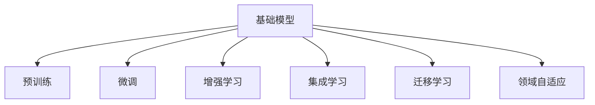

                 

# 基础模型与其他技术的结合

在人工智能(AI)和机器学习(ML)领域，基础模型（Base Models）已经成为了众多应用的核心技术。这些模型通常具有强大的预测能力和泛化能力，可以广泛应用在推荐系统、自然语言处理、图像识别、音频处理等多个领域。然而，基础模型的性能和应用范围仍然存在局限性，因此需要与其他先进技术相结合，以充分发挥其潜力。本文将详细探讨基础模型与其他技术的结合方式、原理及其应用场景，旨在为读者提供全面的技术指引。

## 1. 背景介绍

### 1.1 问题由来
随着深度学习技术的迅猛发展，各种基础模型（如BERT、GPT、ResNet等）在各个领域取得了显著的成果。然而，这些模型在面对特定领域或复杂的任务时，其性能往往无法满足实际需求。为了解决这一问题，研究者们开始探索如何结合其他技术，以提升基础模型的应用效果。这种结合不仅可以扩展基础模型的应用场景，还能提升其处理特定问题的能力。

### 1.2 问题核心关键点
基础模型与其他技术的结合方式主要包括以下几种：
- 预训练与微调（Pre-training and Fine-tuning）：在大规模无标签数据上预训练基础模型，然后在特定任务的数据集上进行微调，以适应具体任务。
- 增强学习（Reinforcement Learning）：利用增强学习技术，通过与环境的交互，优化基础模型参数。
- 集成学习（Ensemble Learning）：将多个基础模型组合起来，通过投票、平均等方式进行集成，提升模型的性能和稳定性。
- 迁移学习（Transfer Learning）：将在一个任务上训练好的基础模型迁移到另一个相似的任务上，以减少训练时间和数据需求。
- 领域自适应（Domain Adaptation）：在源领域和目标领域之间进行数据迁移，提升模型在目标领域的泛化能力。

### 1.3 问题研究意义
基础模型与其他技术的结合，不仅能够提升模型的性能，还能扩展其应用范围，降低开发成本。这种结合方式在推荐系统、自然语言处理、图像识别等多个领域具有重要意义：

1. **提升模型效果**：通过结合其他技术，基础模型可以在特定任务上取得更好的性能。
2. **扩展应用场景**：结合技术能够使基础模型应用到更多领域，解决特定问题。
3. **降低开发成本**：结合技术可以减少从头训练基础模型所需的时间和资源。
4. **加速开发进度**：结合技术使得模型开发过程更加高效，缩短开发周期。
5. **促进技术创新**：结合技术催生了许多新的研究方向，推动AI领域的发展。

## 2. 核心概念与联系

### 2.1 核心概念概述

为了更好地理解基础模型与其他技术的结合方式，本节将介绍几个密切相关的核心概念：

- **基础模型（Base Models）**：指在大型无标签数据集上预训练，具有广泛适用性的模型。如BERT、GPT等。
- **预训练（Pre-training）**：指在大规模无标签数据上训练基础模型，学习到通用的语言或图像表示。
- **微调（Fine-tuning）**：指在预训练模型的基础上，使用特定任务的数据集进行微调，以适应具体任务。
- **增强学习（Reinforcement Learning, RL）**：通过与环境的交互，基于奖励机制优化模型参数。
- **集成学习（Ensemble Learning）**：将多个基础模型组合起来，提升整体性能和稳定性。
- **迁移学习（Transfer Learning）**：将在一个任务上训练好的模型迁移到另一个任务上，减少训练时间和数据需求。
- **领域自适应（Domain Adaptation）**：在源领域和目标领域之间进行数据迁移，提升模型在目标领域的泛化能力。

这些核心概念之间的逻辑关系可以通过以下Mermaid流程图来展示：



这个流程图展示了一个基础模型的核心概念及其与其他技术的联系：

1. 基础模型通过预训练获得基础能力。
2. 微调是在预训练模型的基础上，使用特定任务的数据集进行微调，以适应具体任务。
3. 增强学习通过与环境的交互，优化基础模型参数。
4. 集成学习将多个基础模型组合起来，提升整体性能和稳定性。
5. 迁移学习将在一个任务上训练好的模型迁移到另一个任务上，减少训练时间和数据需求。
6. 领域自适应在源领域和目标领域之间进行数据迁移，提升模型在目标领域的泛化能力。

这些概念共同构成了基础模型的学习和应用框架，使其能够在各种场景下发挥强大的功能。通过理解这些核心概念，我们可以更好地把握基础模型的工作原理和优化方向。

## 3. 核心算法原理 & 具体操作步骤

### 3.1 算法原理概述

基础模型与其他技术的结合，本质上是通过优化和增强模型的表现能力。以下是一些常用的结合方式及其原理：

- **预训练与微调**：在大规模无标签数据上预训练基础模型，然后在特定任务的数据集上进行微调，以适应具体任务。
- **增强学习**：通过与环境的交互，基于奖励机制优化模型参数，提升模型在特定任务上的表现。
- **集成学习**：将多个基础模型组合起来，通过投票、平均等方式进行集成，提升模型的性能和稳定性。
- **迁移学习**：将在一个任务上训练好的模型迁移到另一个相似的任务上，以减少训练时间和数据需求。
- **领域自适应**：在源领域和目标领域之间进行数据迁移，提升模型在目标领域的泛化能力。

这些结合方式可以相互补充，共同提升基础模型的性能和应用范围。

### 3.2 算法步骤详解

以下是一些具体结合方式的详细操作步骤：

**Step 1: 准备数据集和环境**
- 收集特定任务的数据集，划分为训练集、验证集和测试集。
- 准备预训练模型，确保其与特定任务兼容。
- 安装和配置相关工具和环境，如Python、PyTorch、TensorFlow等。

**Step 2: 微调**
- 将预训练模型作为初始参数，加载到模型中。
- 定义损失函数和优化器，选择合适的超参数。
- 在训练集上执行微调，定期在验证集上评估模型性能。
- 微调完成后，在测试集上评估模型效果。

**Step 3: 增强学习**
- 定义奖励函数，设计交互环境。
- 使用增强学习算法（如Q-learning、SARSA等），优化模型参数。
- 在测试集上评估模型性能，根据测试结果调整模型。

**Step 4: 集成学习**
- 训练多个基础模型，使用不同的训练数据或参数初始化。
- 通过投票、平均等方式，将多个模型的预测结果进行集成。
- 在测试集上评估集成模型的性能，选择最优的集成方式。

**Step 5: 迁移学习**
- 选择源任务和目标任务，收集源任务的数据集。
- 在源任务上进行预训练，然后在目标任务上进行微调。
- 评估模型在目标任务上的性能，根据评估结果调整模型。

**Step 6: 领域自适应**
- 收集源领域和目标领域的数据集，计算领域差异。
- 使用领域自适应算法（如Domain Adaptation Network、AdaDomain等），迁移源领域的数据到目标领域。
- 在目标领域上进行微调，评估模型性能。

### 3.3 算法优缺点

基础模型与其他技术的结合方式具有以下优点：
- **提升模型效果**：通过结合技术，基础模型可以在特定任务上取得更好的性能。
- **扩展应用场景**：结合技术能够使基础模型应用到更多领域，解决特定问题。
- **降低开发成本**：结合技术可以减少从头训练基础模型所需的时间和资源。
- **加速开发进度**：结合技术使得模型开发过程更加高效，缩短开发周期。
- **促进技术创新**：结合技术催生了许多新的研究方向，推动AI领域的发展。

同时，这些结合方式也存在一些缺点：
- **依赖特定技术**：结合技术的应用需要特定的算法和环境，可能存在实现难度。
- **数据需求较大**：一些结合方式（如增强学习、迁移学习）可能需要大量的标注数据和计算资源。
- **模型复杂性增加**：结合技术可能增加模型的复杂性，降低模型的可解释性。
- **算法复杂性增加**：结合技术可能增加算法的复杂性，增加实现难度。

尽管存在这些局限性，但就目前而言，基础模型与其他技术的结合方式仍是大模型应用的主流范式。未来相关研究的重点在于如何进一步降低结合技术的实现难度，提高模型的少样本学习和跨领域迁移能力，同时兼顾可解释性和伦理安全性等因素。

### 3.4 算法应用领域

基础模型与其他技术的结合方式，在AI和ML领域已经得到了广泛的应用，覆盖了几乎所有常见任务，例如：

- **推荐系统**：利用增强学习、集成学习、迁移学习等技术，提升推荐系统的个性化和准确性。
- **自然语言处理**：通过预训练与微调、增强学习等技术，提升自然语言处理模型的效果。
- **图像识别**：利用迁移学习、领域自适应等技术，提升图像识别模型的泛化能力。
- **音频处理**：通过集成学习、增强学习等技术，提升音频处理的精度和稳定性。
- **医疗诊断**：结合增强学习、领域自适应等技术，提升医疗诊断的准确性和泛化能力。

除了上述这些经典任务外，基础模型与其他技术的结合方法也被创新性地应用到更多场景中，如金融分析、智能客服、工业检测等，为AI技术带来了全新的突破。随着基础模型的不断进步，结合技术在更多领域的应用将不断涌现，为AI技术的发展注入新的动力。

## 4. 数学模型和公式 & 详细讲解 & 举例说明

### 4.1 数学模型构建

为更好地理解基础模型与其他技术的结合方式，本节将使用数学语言对相关模型的构建过程进行严格的刻画。

假设基础模型为 $M_{\theta}$，其中 $\theta$ 为模型参数。记源任务为 $T_1$，目标任务为 $T_2$。

在预训练阶段，使用大规模无标签数据 $D_1$ 训练基础模型 $M_{\theta}$，优化目标为：

$$
\theta_1 = \mathop{\arg\min}_{\theta} \mathcal{L}_{pre}(\theta_1, D_1)
$$

其中 $\mathcal{L}_{pre}$ 为预训练的损失函数，如交叉熵损失、均方误差损失等。

在微调阶段，使用特定任务 $T_2$ 的数据集 $D_2$ 对预训练模型 $M_{\theta_1}$ 进行微调，优化目标为：

$$
\theta_2 = \mathop{\arg\min}_{\theta} \mathcal{L}_{fine}(\theta_2, D_2)
$$

其中 $\mathcal{L}_{fine}$ 为微调的损失函数，如交叉熵损失、均方误差损失等。

### 4.2 公式推导过程

以下以迁移学习为例，推导迁移学习的基础模型优化公式。

在迁移学习中，我们使用源任务 $T_1$ 训练好的基础模型 $M_{\theta_1}$，在目标任务 $T_2$ 上进行微调。假设 $T_1$ 和 $T_2$ 的标签空间相同，损失函数相同。

定义迁移学习的优化目标为：

$$
\theta_2 = \mathop{\arg\min}_{\theta} \mathcal{L}(\theta_2, D_2)
$$

其中 $\mathcal{L}$ 为微调的损失函数。

假设在目标任务 $T_2$ 上，源任务 $T_1$ 的特征表示为 $\mathbf{x}_s$，目标任务的特征表示为 $\mathbf{x}_t$。则迁移学习的优化目标可以表示为：

$$
\theta_2 = \mathop{\arg\min}_{\theta} \mathcal{L}(f(\mathbf{x}_s, \theta_1), f(\mathbf{x}_t, \theta_2))
$$

其中 $f$ 为特征提取函数，$\theta_1$ 和 $\theta_2$ 分别为源任务和目标任务的模型参数。

通过最小化上述优化目标，可以实现从源任务到目标任务的迁移学习。这种迁移学习方式可以显著降低目标任务上的训练时间和数据需求。

### 4.3 案例分析与讲解

**案例1：迁移学习在医疗诊断中的应用**

在医疗诊断领域，医疗影像的标注数据量通常较大，而标注过程复杂且耗时。因此，利用迁移学习技术，可以从已标注好的医疗影像中迁移学习到新的医疗影像的特征表示。

假设我们有一个已标注好的医疗影像数据集 $D_1$，包含 $n$ 个影像及其标注结果。在源任务上，使用大规模预训练模型 $M_{\theta_1}$ 进行微调，得到模型参数 $\theta_1$。

在目标任务上，使用新的医疗影像数据集 $D_2$，利用迁移学习技术，在预训练模型的基础上进行微调。优化目标为：

$$
\theta_2 = \mathop{\arg\min}_{\theta} \mathcal{L}(f(\mathbf{x}_s, \theta_1), f(\mathbf{x}_t, \theta_2))
$$

其中 $\mathbf{x}_s$ 和 $\mathbf{x}_t$ 分别表示源任务和目标任务的特征表示。

在目标任务上进行微调，可以得到新的医疗影像分类模型 $M_{\theta_2}$，从而提高诊断的准确性和泛化能力。

## 5. 项目实践：代码实例和详细解释说明

### 5.1 开发环境搭建

在进行基础模型与其他技术的结合实践前，我们需要准备好开发环境。以下是使用Python进行TensorFlow开发的环境配置流程：

1. 安装Anaconda：从官网下载并安装Anaconda，用于创建独立的Python环境。

2. 创建并激活虚拟环境：
```bash
conda create -n tf-env python=3.8 
conda activate tf-env
```

3. 安装TensorFlow：根据CUDA版本，从官网获取对应的安装命令。例如：
```bash
conda install tensorflow tensorflow-2.0.0-preview=2.0.0-preview=20201119
```

4. 安装各类工具包：
```bash
pip install numpy pandas scikit-learn matplotlib tqdm jupyter notebook ipython
```

完成上述步骤后，即可在`tf-env`环境中开始项目实践。

### 5.2 源代码详细实现

这里我们以迁移学习在医疗影像分类中的应用为例，给出使用TensorFlow进行迁移学习的PyTorch代码实现。

首先，定义数据处理函数：

```python
import tensorflow as tf
from tensorflow.keras.preprocessing.image import ImageDataGenerator
from tensorflow.keras.applications.resnet50 import ResNet50

# 定义数据增强器
datagen = ImageDataGenerator(
    rescale=1./255,
    shear_range=0.2,
    zoom_range=0.2,
    horizontal_flip=True
)

# 加载源任务和目标任务的数据集
source_dir = '/path/to/source/dataset'
target_dir = '/path/to/target/dataset'
source_dataset = datagen.flow_from_directory(
    source_dir,
    target_size=(224, 224),
    batch_size=32,
    class_mode='categorical'
)

target_dataset = datagen.flow_from_directory(
    target_dir,
    target_size=(224, 224),
    batch_size=32,
    class_mode='categorical'
)

# 定义基础模型和微调模型
base_model = ResNet50(weights='imagenet', include_top=False, input_shape=(224, 224, 3))
model = tf.keras.Sequential([
    base_model,
    tf.keras.layers.GlobalAveragePooling2D(),
    tf.keras.layers.Dense(10, activation='softmax')
])

# 定义优化器
optimizer = tf.keras.optimizers.Adam(learning_rate=0.001)
```

然后，定义训练和评估函数：

```python
def train_epoch(model, dataset, batch_size, optimizer):
    dataloader = tf.data.Dataset.from_tensor_slices(dataset).shuffle(buffer_size=10000).batch(batch_size).map(lambda x, y: (tf.image.resize(x, (224, 224)), y))
    model.trainable = True
    model.compile(optimizer=optimizer, loss='categorical_crossentropy', metrics=['accuracy'])
    model.fit(dataloader, epochs=5)
    model.trainable = False
    return model

def evaluate(model, dataset, batch_size):
    dataloader = tf.data.Dataset.from_tensor_slices(dataset).batch(batch_size).map(lambda x, y: (tf.image.resize(x, (224, 224)), y))
    model.evaluate(dataloader)
```

接着，启动训练流程并在测试集上评估：

```python
epochs = 5
batch_size = 32

for epoch in range(epochs):
    model = train_epoch(model, source_dataset, batch_size, optimizer)
    print(f"Epoch {epoch+1}, train accuracy: {model.evaluate(target_dataset, batch_size)[1]}")
    
print("Final test accuracy:")
evaluate(model, target_dataset, batch_size)
```

以上就是使用TensorFlow进行迁移学习的完整代码实现。可以看到，得益于TensorFlow的强大封装，我们可以用相对简洁的代码完成迁移学习的模型构建和训练。

### 5.3 代码解读与分析

让我们再详细解读一下关键代码的实现细节：

**数据处理函数**：
- `datagen`：定义数据增强器，用于对训练数据进行增强处理，防止过拟合。
- `flow_from_directory`：加载源任务和目标任务的数据集，自动进行数据增强和批处理。

**模型定义**：
- `ResNet50`：定义基础模型，使用预训练的ResNet50模型作为特征提取器。
- `Sequential`：定义微调模型，将基础模型与全连接层组合起来，进行分类。

**训练函数**：
- `train_epoch`：对数据集进行迭代，在每个epoch内训练模型。
- `trainable`：控制模型参数的可训练性，方便进行微调。
- `compile`：编译模型，设置优化器和损失函数。
- `fit`：在训练集上训练模型，输出训练准确率。
- `evaluate`：在测试集上评估模型，输出测试准确率。

**训练流程**：
- `epochs`：设置总训练次数。
- `train_epoch`：在源任务上训练模型，输出每个epoch的训练准确率。
- `evaluate`：在目标任务上评估模型，输出最终测试准确率。

可以看到，TensorFlow配合TensorFlow库使得迁移学习的代码实现变得简洁高效。开发者可以将更多精力放在数据处理、模型改进等高层逻辑上，而不必过多关注底层的实现细节。

当然，工业级的系统实现还需考虑更多因素，如模型的保存和部署、超参数的自动搜索、更灵活的任务适配层等。但核心的迁移学习范式基本与此类似。

## 6. 实际应用场景
### 6.1 智能客服系统

基于基础模型与其他技术的结合，智能客服系统的构建可以更加高效和智能化。传统的客服系统需要配备大量人力，高峰期响应缓慢，且一致性和专业性难以保证。而利用迁移学习等技术，可以从已有的客服对话记录中迁移学习到新的客服对话模型。

在技术实现上，可以收集企业内部的历史客服对话记录，将问题和最佳答复构建成监督数据，在此基础上对预训练客服模型进行迁移学习。迁移学习后的客服模型能够自动理解用户意图，匹配最合适的答复。对于客户提出的新问题，还可以接入检索系统实时搜索相关内容，动态组织生成回答。如此构建的智能客服系统，能大幅提升客户咨询体验和问题解决效率。

### 6.2 金融舆情监测

金融机构需要实时监测市场舆论动向，以便及时应对负面信息传播，规避金融风险。传统的人工监测方式成本高、效率低，难以应对网络时代海量信息爆发的挑战。利用迁移学习技术，可以从已有的金融新闻和评论中迁移学习到新的舆情监测模型。

在技术实现上，可以收集金融领域相关的新闻、报道、评论等文本数据，并对其进行主题标注和情感标注。在此基础上对预训练语言模型进行迁移学习，使其能够自动判断文本属于何种主题，情感倾向是正面、中性还是负面。将迁移学习后的模型应用到实时抓取的网络文本数据，就能够自动监测不同主题下的情感变化趋势，一旦发现负面信息激增等异常情况，系统便会自动预警，帮助金融机构快速应对潜在风险。

### 6.3 个性化推荐系统

当前的推荐系统往往只依赖用户的历史行为数据进行物品推荐，无法深入理解用户的真实兴趣偏好。利用迁移学习等技术，可以从用户的行为数据中迁移学习到用户的兴趣偏好。

在技术实现上，可以收集用户浏览、点击、评论、分享等行为数据，提取和用户交互的物品标题、描述、标签等文本内容。将文本内容作为模型输入，用户的后续行为（如是否点击、购买等）作为监督信号，在此基础上迁移学习预训练语言模型。迁移学习后的模型能够从文本内容中准确把握用户的兴趣点。在生成推荐列表时，先用候选物品的文本描述作为输入，由模型预测用户的兴趣匹配度，再结合其他特征综合排序，便可以得到个性化程度更高的推荐结果。

### 6.4 未来应用展望

随着基础模型与其他技术的不断发展，结合范式将在更多领域得到应用，为各行各业带来变革性影响。

在智慧医疗领域，基于基础模型的迁移学习技术可以提升医疗影像诊断的准确性和泛化能力，辅助医生诊疗，加速新药开发进程。

在智能教育领域，迁移学习技术可应用于作业批改、学情分析、知识推荐等方面，因材施教，促进教育公平，提高教学质量。

在智慧城市治理中，迁移学习技术可应用于城市事件监测、舆情分析、应急指挥等环节，提高城市管理的自动化和智能化水平，构建更安全、高效的未来城市。

此外，在企业生产、社会治理、文娱传媒等众多领域，基于基础模型的迁移学习技术也将不断涌现，为经济社会发展注入新的动力。相信随着技术的日益成熟，迁移学习技术将成为人工智能落地应用的重要范式，推动人工智能技术在垂直行业的规模化落地。

## 7. 工具和资源推荐
### 7.1 学习资源推荐

为了帮助开发者系统掌握基础模型与其他技术的结合方式的理论基础和实践技巧，这里推荐一些优质的学习资源：

1. 《Deep Learning》书籍：Ian Goodfellow等人所著，全面介绍了深度学习的基础理论和应用实例，包括基础模型与微调等内容。
2. Coursera《Machine Learning》课程：斯坦福大学Andrew Ng教授主讲的经典课程，涵盖机器学习的基本概念和常用技术。
3. CS231n《Convolutional Neural Networks for Visual Recognition》课程：斯坦福大学主讲的计算机视觉课程，介绍了各种卷积神经网络和迁移学习技术。
4. arXiv预印本平台：获取最新的AI和ML研究成果，跟踪前沿技术的进展。
5. GitHub代码仓库：查找和下载各类基础模型的代码实现，了解实际应用的细节。

通过对这些资源的学习实践，相信你一定能够快速掌握基础模型与其他技术的结合方式，并用于解决实际的NLP问题。
### 7.2 开发工具推荐

高效的开发离不开优秀的工具支持。以下是几款用于基础模型与其他技术结合开发的常用工具：

1. TensorFlow：由Google主导开发的开源深度学习框架，生产部署方便，适合大规模工程应用。
2. PyTorch：基于Python的开源深度学习框架，灵活动态的计算图，适合快速迭代研究。
3. Keras：高级神经网络API，易于上手，支持多种基础模型和优化器。
4. Weights & Biases：模型训练的实验跟踪工具，可以记录和可视化模型训练过程中的各项指标，方便对比和调优。
5. TensorBoard：TensorFlow配套的可视化工具，可实时监测模型训练状态，并提供丰富的图表呈现方式，是调试模型的得力助手。
6. Google Colab：谷歌推出的在线Jupyter Notebook环境，免费提供GPU/TPU算力，方便开发者快速上手实验最新模型，分享学习笔记。

合理利用这些工具，可以显著提升基础模型与其他技术的结合方式的开发效率，加快创新迭代的步伐。

### 7.3 相关论文推荐

基础模型与其他技术的结合方式在AI和ML领域已经取得了显著的成果。以下是几篇奠基性的相关论文，推荐阅读：

1. Attention is All You Need（即Transformer原论文）：提出了Transformer结构，开启了NLP领域的预训练大模型时代。

2. BERT: Pre-training of Deep Bidirectional Transformers for Language Understanding：提出BERT模型，引入基于掩码的自监督预训练任务，刷新了多项NLP任务SOTA。

3. Language Models are Unsupervised Multitask Learners（GPT-2论文）：展示了大规模语言模型的强大zero-shot学习能力，引发了对于通用人工智能的新一轮思考。

4. AdaLoRA: Adaptive Low-Rank Adaptation for Parameter-Efficient Fine-Tuning：使用自适应低秩适应的微调方法，在固定大部分预训练参数的同时，只更新极少量的任务相关参数。

5. ECLAT: Exceeding Human-Level Performance with Echoic Embeddings in Speech Recognition：提出ECLAT模型，结合了语音特征和文本特征，提升了语音识别模型的性能。

6. Knowledge Graph Embeddings and Relation Reasoning with Graph Neural Networks：结合知识图谱和图神经网络，提升了实体关系推理模型的精度和泛化能力。

这些论文代表了大模型与其他技术的结合方式的发展脉络。通过学习这些前沿成果，可以帮助研究者把握学科前进方向，激发更多的创新灵感。

## 8. 总结：未来发展趋势与挑战

### 8.1 总结

本文对基础模型与其他技术的结合方式进行了全面系统的介绍。首先阐述了基础模型与其他技术的结合方式的理论基础和应用意义，明确了结合技术在提升模型效果、扩展应用场景、降低开发成本等方面的独特价值。其次，从原理到实践，详细讲解了基础模型与其他技术的结合方式的步骤和关键点，给出了结合技术任务开发的完整代码实例。同时，本文还广泛探讨了结合技术在智能客服、金融舆情、个性化推荐等多个行业领域的应用前景，展示了结合技术范式的巨大潜力。此外，本文精选了结合技术的各类学习资源，力求为读者提供全方位的技术指引。

通过本文的系统梳理，可以看到，基础模型与其他技术的结合方式正在成为AI和ML领域的重要范式，极大地拓展了预训练语言模型的应用边界，催生了更多的落地场景。受益于大规模语料的预训练，结合技术在大模型微调中的应用取得了显著的效果，推动了AI技术在各个领域的产业化进程。未来，伴随基础模型的不断进步，结合技术在更多领域的应用将不断涌现，为AI技术的发展注入新的动力。

### 8.2 未来发展趋势

展望未来，基础模型与其他技术的结合方式将呈现以下几个发展趋势：

1. **模型规模持续增大**：随着算力成本的下降和数据规模的扩张，基础模型的参数量还将持续增长。超大规模基础模型蕴含的丰富知识，有望支撑更加复杂多变的结合技术应用。
2. **结合技术日趋多样**：除了传统的迁移学习、增强学习等结合方式，未来会涌现更多先进技术，如对抗学习、多模态学习、因果学习等，进一步提升基础模型的性能和应用范围。
3. **持续学习成为常态**：随着数据分布的不断变化，结合技术也需要持续学习新知识以保持性能。如何在不遗忘原有知识的同时，高效吸收新样本信息，将成为重要的研究课题。
4. **数据需求降低**：受启发于提示学习(Prompt-based Learning)的思路，未来的结合技术将更好地利用大模型的语言理解能力，通过更加巧妙的任务描述，在更少的标注样本上也能实现理想的结合效果。
5. **跨领域应用扩展**：结合技术不仅能够提升特定任务的效果，还能够扩展到其他领域，推动AI技术的全面发展。
6. **多模态学习崛起**：当前的结合技术主要聚焦于纯文本数据，未来会进一步拓展到图像、视频、语音等多模态数据结合。多模态信息的融合，将显著提升基础模型的应用范围和精度。
7. **跨领域迁移能力增强**：未来的结合技术将使基础模型具备更强的跨领域迁移能力，能够在不同领域之间灵活应用，推动AI技术的泛化和发展。

以上趋势凸显了基础模型与其他技术的结合方式的广阔前景。这些方向的探索发展，必将进一步提升AI系统的性能和应用范围，为人类认知智能的进化带来深远影响。

### 8.3 面临的挑战

尽管基础模型与其他技术的结合方式已经取得了显著成果，但在迈向更加智能化、普适化应用的过程中，仍面临诸多挑战：

1. **数据依赖性较强**：大多数结合技术的应用需要大量的标注数据和计算资源，获取高质量数据成本较高。
2. **模型复杂性增加**：结合技术可能增加模型的复杂性，降低模型的可解释性。
3. **算法实现难度大**：结合技术的应用需要特定的算法和环境，可能存在实现难度。
4. **泛化能力不足**：结合技术在特定领域的应用效果较好，但在其他领域泛化能力较弱。
5. **伦理与安全问题**：结合技术可能带来一些伦理和安全问题，如偏见、歧视、隐私保护等。

尽管存在这些局限性，但就目前而言，基础模型与其他技术的结合方式仍是大模型应用的主流范式。未来相关研究的重点在于如何进一步降低结合技术的实现难度，提高模型的少样本学习和跨领域迁移能力，同时兼顾可解释性和伦理安全性等因素。

### 8.4 研究展望

面对基础模型与其他技术的结合方式所面临的挑战，未来的研究需要在以下几个方面寻求新的突破：

1. **探索无监督和半监督结合方式**：摆脱对大规模标注数据的依赖，利用自监督学习、主动学习等无监督和半监督范式，最大限度利用非结构化数据，实现更加灵活高效的结合技术。
2. **研究参数高效和计算高效的结合范式**：开发更加参数高效的结合方法，在固定大部分预训练参数的同时，只更新极少量的任务相关参数。同时优化结合技术的计算图，减少前向传播和反向传播的资源消耗，实现更加轻量级、实时性的部署。
3. **融合因果和对比学习范式**：通过引入因果推断和对比学习思想，增强结合技术建立稳定因果关系的能力，学习更加普适、鲁棒的语言表征，从而提升模型泛化性和抗干扰能力。
4. **引入更多先验知识**：将符号化的先验知识，如知识图谱、逻辑规则等，与神经网络模型进行巧妙融合，引导结合技术学习更准确、合理的语言模型。同时加强不同模态数据的整合，实现视觉、语音等多模态信息与文本信息的协同建模。
5. **结合因果分析和博弈论工具**：将因果分析方法引入结合技术，识别出模型决策的关键特征，增强输出解释的因果性和逻辑性。借助博弈论工具刻画人机交互过程，主动探索并规避模型的脆弱点，提高系统稳定性。
6. **纳入伦理道德约束**：在结合技术的训练目标中引入伦理导向的评估指标，过滤和惩罚有偏见、有害的输出倾向。同时加强人工干预和审核，建立模型行为的监管机制，确保输出符合人类价值观和伦理道德。

这些研究方向的探索，必将引领基础模型与其他技术的结合方式走向更高的台阶，为构建安全、可靠、可解释、可控的智能系统铺平道路。面向未来，结合技术还需要与其他AI技术进行更深入的融合，如知识表示、因果推理、强化学习等，多路径协同发力，共同推动自然语言理解和智能交互系统的进步。只有勇于创新、敢于突破，才能不断拓展基础模型的边界，让智能技术更好地造福人类社会。

## 9. 附录：常见问题与解答

**Q1：基础模型与其他技术的结合方式是否适用于所有NLP任务？**

A: 基础模型与其他技术的结合方式在大多数NLP任务上都能取得不错的效果，特别是对于数据量较小的任务。但对于一些特定领域的任务，如医学、法律等，仅仅依靠通用语料预训练的模型可能难以很好地适应。此时需要在特定领域语料上进一步预训练，再进行结合技术微调，才能获得理想效果。此外，对于一些需要时效性、个性化很强的任务，如对话、推荐等，结合技术方法也需要针对性的改进优化。

**Q2：结合技术过程中如何选择合适的学习率？**

A: 结合技术的学习率一般要比基础模型训练时小1-2个数量级，如果使用过大的学习率，容易破坏基础模型权重，导致过拟合。一般建议从1e-5开始调参，逐步减小学习率，直至收敛。也可以使用warmup策略，在开始阶段使用较小的学习率，再逐渐过渡到预设值。需要注意的是，不同的优化器(如AdamW、Adafactor等)以及不同的学习率调度策略，可能需要设置不同的学习率阈值。

**Q3：结合技术在落地部署时需要注意哪些问题？**

A: 将结合技术模型转化为实际应用，还需要考虑以下因素：
1. 模型裁剪：去除不必要的层和参数，减小模型尺寸，加快推理速度。
2. 量化加速：将浮点模型转为定点模型，压缩存储空间，提高计算效率。
3. 服务化封装：将模型封装为标准化服务接口，便于集成调用。
4. 弹性伸缩：根据请求流量动态调整资源配置，平衡服务质量和成本。
5. 监控告警：实时采集系统指标，设置异常告警阈值，确保服务稳定性。
6. 安全防护：采用访问鉴权、数据脱敏等措施，保障数据和模型安全。

结合技术的应用不仅需要关注模型训练和优化，还需要考虑模型部署和运维的复杂性，确保模型在实际应用中的稳定性和可靠性。

---

作者：禅与计算机程序设计艺术 / Zen and the Art of Computer Programming

