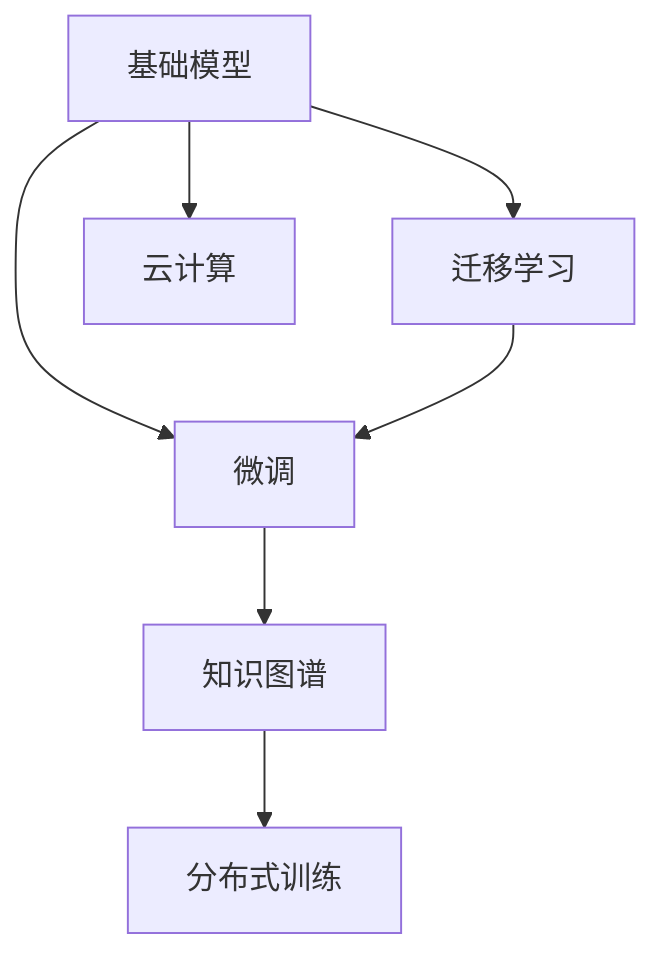

                 

# 基础模型的公共基础设施

> 关键词：基础模型,公共基础设施,深度学习,人工智能,大数据,云计算,模型压缩,模型优化,数据管理,模型迁移,知识图谱,算法研究

## 1. 背景介绍

在人工智能的快速发展的今天，基础模型已成为AI技术的公共基础设施，在众多领域发挥着重要作用。无论是金融、医疗、零售，还是自动驾驶、智能客服、工业自动化等，几乎每个行业都在某种程度上依赖基础模型来驱动其业务。本文将详细探讨基础模型的公共基础设施，包括其定义、重要性、发展历程以及未来趋势，帮助读者深入理解这一核心技术的演进与价值。

### 1.1 问题由来

基础模型通常指在大数据集上预训练得到的深度学习模型，例如BERT、GPT-3、ResNet等。这些模型通过复杂的神经网络结构和大规模数据训练，具备了强大的数据表示和处理能力。其作用在于提供一个通用的模板，供研究人员和开发者在其基础上进行微调或迁移学习，以适应特定的应用场景。

### 1.2 问题核心关键点

基础模型的公共基础设施性质体现在以下几个方面：
- **通用性**：基础模型可以在不同的应用场景中广泛使用，减少了重复构建模型的需求。
- **高效性**：预训练的基础模型在效率上通常优于从头训练，因为它们可以利用大规模数据进行快速的特征提取和模式学习。
- **可扩展性**：基础模型通常支持云计算环境下的分布式训练和推理，便于大规模扩展。
- **模块化**：基础模型可以作为组件集成到更复杂的系统中，便于定制和优化。

### 1.3 问题研究意义

基础模型的公共基础设施性质，为各行各业带来了极大的便利和效率提升。它的研究和发展，不仅促进了深度学习技术的普及和应用，还推动了人工智能技术的产业化进程。

1. **降低开发成本**：使用基础模型可以显著降低深度学习应用的开发成本，包括数据收集、模型训练和系统部署等方面。
2. **提升模型性能**：基础模型通过大规模数据预训练，具有较强的泛化能力，可以显著提升模型在不同任务上的性能。
3. **加速技术创新**：基础模型的开源和共享，促进了学术界和工业界之间的知识交流和合作，加速了技术创新和产品迭代。
4. **推动行业应用**：基础模型在多个行业的成功应用，证明了其强大的实用价值，推动了人工智能技术的广泛普及。

## 2. 核心概念与联系

### 2.1 核心概念概述

为了更好地理解基础模型的公共基础设施，本节将介绍几个核心概念：

- **基础模型(Foundation Model)**：指在大规模数据集上预训练的深度学习模型，具备强大的通用性和泛化能力，可以应用于各种自然语言处理、计算机视觉、推荐系统等领域。
- **迁移学习(Transfer Learning)**：指将预训练模型的知识迁移到新的任务上，通过微调或修改，适应特定任务的需求。
- **微调(Fine-Tuning)**：指在预训练模型的基础上，使用少量标注数据进行有监督学习，优化模型在特定任务上的性能。
- **知识图谱(Knowledge Graph)**：一种用于表示实体和关系的图形结构，有助于提升模型的语义理解和知识提取能力。
- **分布式训练(Distributed Training)**：指在多个计算节点上并行训练模型，以加速训练过程，适应大规模数据集。
- **云计算(Cloud Computing)**：通过互联网提供计算资源和数据存储服务，便于基础模型的部署和管理。

这些概念之间存在紧密的联系，通过合理的组织和应用，可以实现基础模型在多个领域的广泛应用。

### 2.2 核心概念原理和架构的 Mermaid 流程图(Mermaid 流程节点中不要有括号、逗号等特殊字符)



这个流程图展示了基础模型的核心概念及其之间的关系：

1. 基础模型通过预训练学习到通用的特征表示。
2. 迁移学习利用预训练模型的知识，通过微调或修改，适应新的任务需求。
3. 微调在少量标注数据上进行有监督学习，进一步优化模型性能。
4. 知识图谱提升模型的语义理解能力，帮助更好地处理和推理信息。
5. 分布式训练加快模型训练速度，适应大规模数据集。
6. 云计算提供计算和存储服务，便于基础模型的部署和管理。

这些概念共同构成了基础模型的基础设施框架，使其能够广泛应用于各种实际应用中。

## 3. 核心算法原理 & 具体操作步骤

### 3.1 算法原理概述

基础模型的公共基础设施性质，主要体现在其强大的特征提取能力和泛化性能上。预训练模型的核心思想是通过大规模无标签数据学习到通用的特征表示，然后通过迁移学习或微调，适配特定任务的需求。

### 3.2 算法步骤详解

以下是对基础模型公共基础设施的算法步骤详解：

**Step 1: 数据准备与预训练**
- 收集大规模无标签数据集，如互联网文本、图像库、音频库等。
- 使用深度学习模型（如Transformer、CNN等）在大规模数据上进行预训练，学习到通用的特征表示。

**Step 2: 迁移学习与微调**
- 选择合适的预训练模型作为初始化参数，如BERT、GPT-3、ResNet等。
- 根据应用场景，使用少量标注数据进行微调，优化模型在特定任务上的性能。
- 可以通过冻结预训练模型的部分层，只微调顶层，减少需优化的参数，避免过拟合。

**Step 3: 知识图谱构建**
- 构建或获取领域知识图谱，表示实体和关系。
- 将知识图谱与预训练模型结合，提升模型的语义理解和知识提取能力。

**Step 4: 分布式训练与云计算**
- 使用分布式训练技术，在多个计算节点上并行训练模型，加快训练速度。
- 部署到云计算平台，提供便捷的计算和存储服务，便于模型的大规模部署。

### 3.3 算法优缺点

基础模型的公共基础设施具有以下优点：
- **高效性**：预训练模型通过大规模数据学习，具备强大的特征提取能力。
- **通用性**：基础模型可以作为通用模板，应用于各种NLP、CV等任务。
- **可扩展性**：分布式训练和云计算支持，便于模型的大规模扩展。

同时，基础模型也存在以下局限性：
- **数据依赖性**：预训练模型的性能高度依赖于数据质量和大规模训练。
- **模型复杂性**：大规模预训练模型的参数量通常很大，内存和计算资源消耗较高。
- **迁移能力有限**：在任务数据分布差异较大时，迁移学习的泛化性能可能不足。

### 3.4 算法应用领域

基础模型在多个领域中得到了广泛应用，包括：

- **自然语言处理(NLP)**：文本分类、情感分析、问答系统、机器翻译、自动摘要等任务。
- **计算机视觉(CV)**：图像分类、目标检测、图像生成、图像描述等任务。
- **推荐系统**：商品推荐、内容推荐、广告推荐等任务。
- **医疗健康**：疾病诊断、治疗方案推荐、患者监测等任务。
- **金融领域**：信用评分、欺诈检测、市场预测等任务。

这些应用领域展示了基础模型的强大实力，推动了人工智能技术在各个行业的发展和应用。

## 4. 数学模型和公式 & 详细讲解 & 举例说明（备注：数学公式请使用latex格式，latex嵌入文中独立段落使用 $$，段落内使用 $)
### 4.1 数学模型构建

基础模型通常采用神经网络结构进行构建。以深度学习模型为例，其一般包含输入层、若干隐藏层和输出层。假设模型的输入为 $x \in \mathbb{R}^n$，输出为 $y \in \mathbb{R}^m$。模型参数为 $\theta$，其数学表达式为：

$$
y = f_{\theta}(x)
$$

其中 $f_{\theta}(\cdot)$ 为模型的非线性映射函数。

### 4.2 公式推导过程

以基础模型在NLP任务上的应用为例，我们可以推导其公式推导过程。

假设模型 $f_{\theta}$ 在输入文本 $x$ 上的输出为 $y$，表示模型对文本的分类或标注。对于二分类任务，我们可以使用交叉熵损失函数：

$$
\mathcal{L}(y, \hat{y}) = -y \log \hat{y} - (1-y) \log (1-\hat{y})
$$

其中 $y$ 为真实标签，$\hat{y}$ 为模型预测标签。

在训练过程中，我们使用梯度下降等优化算法，最小化损失函数，更新模型参数 $\theta$：

$$
\theta \leftarrow \theta - \eta \nabla_{\theta} \mathcal{L}(y, \hat{y})
$$

其中 $\eta$ 为学习率，$\nabla_{\theta} \mathcal{L}(y, \hat{y})$ 为损失函数对参数 $\theta$ 的梯度。

通过上述公式，我们可以看到，基础模型通过有监督学习，不断调整模型参数，使得模型输出的预测标签尽可能接近真实标签，从而实现对特定任务的适应和优化。

### 4.3 案例分析与讲解

以BERT模型为例，其在大规模无标签文本数据上进行了预训练，学习到丰富的语言表示。然后在特定任务上，通过微调，将BERT模型的知识迁移到新的任务上。以情感分析任务为例，我们可以将微调的过程表示为：

1. **数据准备**：收集包含情感标签的文本数据集。
2. **预训练模型初始化**：使用预训练好的BERT模型作为初始参数。
3. **微调**：在训练集上使用交叉熵损失函数进行微调，最小化预测标签与真实标签之间的差异。
4. **评估**：在测试集上评估微调后的模型性能，对比微调前后的效果。

通过微调，BERT模型能够学习到情感分析任务的特定知识，在新的文本数据上表现优异。

## 5. 项目实践：代码实例和详细解释说明

### 5.1 开发环境搭建

在进行基础模型项目实践前，我们需要准备好开发环境。以下是使用Python进行TensorFlow开发的环境配置流程：

1. 安装Anaconda：从官网下载并安装Anaconda，用于创建独立的Python环境。

2. 创建并激活虚拟环境：
```bash
conda create -n tf-env python=3.8 
conda activate tf-env
```

3. 安装TensorFlow：根据CUDA版本，从官网获取对应的安装命令。例如：
```bash
pip install tensorflow==2.6.0
```

4. 安装各类工具包：
```bash
pip install numpy pandas scikit-learn matplotlib tqdm jupyter notebook ipython
```

完成上述步骤后，即可在`tf-env`环境中开始基础模型的实践。

### 5.2 源代码详细实现

下面我们以情感分析任务为例，给出使用TensorFlow对BERT模型进行微调的代码实现。

首先，定义数据预处理函数：

```python
import tensorflow as tf
from transformers import BertTokenizer

tokenizer = BertTokenizer.from_pretrained('bert-base-uncased')

def preprocess_data(texts, labels):
    encoded_inputs = tokenizer(texts, return_tensors='tf', padding=True, truncation=True)
    input_ids = encoded_inputs['input_ids']
    attention_masks = encoded_inputs['attention_mask']
    
    return input_ids, attention_masks, labels
```

然后，定义模型和优化器：

```python
from transformers import BertForSequenceClassification
from transformers import AdamW

model = BertForSequenceClassification.from_pretrained('bert-base-uncased', num_labels=2)

optimizer = AdamW(model.parameters(), lr=2e-5)
```

接着，定义训练和评估函数：

```python
def train_epoch(model, dataset, batch_size, optimizer):
    for batch in dataset:
        input_ids, attention_masks, labels = batch
        model.zero_grad()
        outputs = model(input_ids, attention_mask=attention_masks, labels=labels)
        loss = outputs.loss
        loss.backward()
        optimizer.step()
        return loss

def evaluate(model, dataset, batch_size):
    total_loss = 0
    total_correct = 0
    for batch in dataset:
        input_ids, attention_masks, labels = batch
        outputs = model(input_ids, attention_mask=attention_masks)
        logits = outputs.logits
        predictions = tf.argmax(logits, axis=1)
        total_loss += tf.reduce_mean(loss)
        total_correct += tf.reduce_sum(tf.cast(tf.equal(predictions, labels), dtype=tf.int32))
    return total_loss / len(dataset), total_correct / len(dataset)
```

最后，启动训练流程并在测试集上评估：

```python
epochs = 3
batch_size = 16

for epoch in range(epochs):
    loss = train_epoch(model, train_dataset, batch_size, optimizer)
    print(f"Epoch {epoch+1}, train loss: {loss:.3f}")
    
    print(f"Epoch {epoch+1}, dev results:")
    dev_loss, dev_acc = evaluate(model, dev_dataset, batch_size)
    print(f"Dev loss: {dev_loss:.3f}, Dev acc: {dev_acc:.3f}")
    
print("Test results:")
test_loss, test_acc = evaluate(model, test_dataset, batch_size)
print(f"Test loss: {test_loss:.3f}, Test acc: {test_acc:.3f}")
```

以上就是使用TensorFlow对BERT模型进行情感分析任务微调的完整代码实现。可以看到，得益于TensorFlow的强大封装，我们可以用相对简洁的代码完成BERT模型的加载和微调。

### 5.3 代码解读与分析

让我们再详细解读一下关键代码的实现细节：

**preprocess_data函数**：
- `tokenizer`：定义分词器和模型初始化。
- `input_ids`和`attention_masks`：将输入文本转化为模型所需的Tensor格式，并进行padding和truncation处理。
- `labels`：将文本的情感标签转化为Tensor格式。

**train_epoch函数**：
- 对数据集进行迭代，计算每个批次的损失，使用梯度下降更新模型参数。

**evaluate函数**：
- 计算模型在测试集上的平均损失和准确率，对比微调前后的性能。

**训练流程**：
- 定义总的epoch数和batch size，开始循环迭代。
- 每个epoch内，在训练集上训练，输出平均loss。
- 在验证集上评估，输出分类指标。
- 所有epoch结束后，在测试集上评估，给出最终测试结果。

可以看到，TensorFlow配合HuggingFace库使得BERT微调的代码实现变得简洁高效。开发者可以将更多精力放在数据处理、模型改进等高层逻辑上，而不必过多关注底层的实现细节。

当然，工业级的系统实现还需考虑更多因素，如模型的保存和部署、超参数的自动搜索、更灵活的任务适配层等。但核心的微调范式基本与此类似。

## 6. 实际应用场景

### 6.1 智能客服系统

基础模型在智能客服系统中的应用，可以显著提升客户服务体验。传统的客服系统需要大量人工参与，且响应速度较慢。而使用基础模型进行情感分析和意图识别，可以实时处理客户咨询，快速响应并给出合适的回复。

在技术实现上，可以将客户咨询文本输入到预训练的模型中进行情感分类和意图识别，然后根据分类结果生成回复。在实际部署中，可以通过分布式训练加速模型推理，提升系统响应速度。

### 6.2 金融舆情监测

在金融领域，舆情监测对风险控制和决策制定至关重要。传统的人工舆情分析耗费大量人力和时间，且难以处理海量数据。而基础模型可以通过情感分析和文本分类技术，自动监测市场舆情，快速识别异常信息。

具体而言，可以收集社交媒体、新闻网站、论坛等互联网上的金融相关信息，使用情感分析模型识别情绪倾向，然后通过分类模型识别舆情主题。一旦发现负面信息激增等异常情况，系统便会自动预警，帮助金融机构及时应对潜在风险。

### 6.3 个性化推荐系统

推荐系统需要根据用户的历史行为和兴趣，推荐最符合其需求的商品或内容。传统推荐系统往往依赖用户行为数据，难以捕捉用户深层次的兴趣和需求。而基础模型可以通过文本分类和情感分析，获取用户对不同商品或内容的兴趣，然后生成推荐列表。

在实际应用中，可以将商品描述、用户评论等文本输入到基础模型中进行情感分类和主题提取，然后根据用户的历史行为和分类结果，生成个性化的推荐结果。在模型优化方面，可以通过知识图谱技术引入更多的领域知识，提升推荐系统的精度和效果。

### 6.4 未来应用展望

随着基础模型的不断发展，其在多个领域的应用将进一步深化和扩展。未来，基础模型有望在以下方面实现新的突破：

1. **自监督学习**：通过自监督学习任务，如掩码语言模型、Next Word Prediction等，进一步提升模型的泛化能力。
2. **跨模态学习**：结合视觉、听觉等模态信息，提升模型的语义理解能力和推理能力。
3. **小样本学习**：通过迁移学习和小样本学习技术，在数据量较少的情况下，也能获得较好的模型性能。
4. **联邦学习**：利用联邦学习技术，保护数据隐私的同时，提升模型在分布式环境下的训练效果。
5. **模型压缩与优化**：通过模型压缩、稀疏化等技术，减少模型资源消耗，提升推理效率。

这些趋势将进一步推动基础模型在各个领域的应用，提升系统的性能和鲁棒性。

## 7. 工具和资源推荐

### 7.1 学习资源推荐

为了帮助开发者系统掌握基础模型的公共基础设施，这里推荐一些优质的学习资源：

1. 《深度学习》系列书籍：如《深度学习入门》、《深度学习实践》等，涵盖深度学习的基本概念和实战案例。
2. 《TensorFlow实战》：详细介绍了TensorFlow的使用方法，包括模型构建、训练和部署等。
3. 《Transformers教程》：由HuggingFace提供，介绍了Transformer模型的原理和应用。
4. 《自然语言处理综述》：斯坦福大学提供的NLP课程，涵盖NLP的基本概念和最新技术。
5. 《强化学习》书籍：如《强化学习：原理与算法》，介绍了强化学习的基本概念和应用。

通过对这些资源的学习实践，相信你一定能够快速掌握基础模型的公共基础设施，并用于解决实际的AI问题。

### 7.2 开发工具推荐

高效的开发离不开优秀的工具支持。以下是几款用于基础模型开发的常用工具：

1. TensorFlow：基于Python的开源深度学习框架，灵活动态的计算图，适合快速迭代研究。
2. PyTorch：基于Python的开源深度学习框架，灵活高效的自动微分系统。
3. HuggingFace：提供了一系列预训练语言模型和工具库，便于模型的微调和部署。
4. Weights & Biases：模型训练的实验跟踪工具，可以记录和可视化模型训练过程中的各项指标，方便对比和调优。
5. TensorBoard：TensorFlow配套的可视化工具，可实时监测模型训练状态，并提供丰富的图表呈现方式。

合理利用这些工具，可以显著提升基础模型的开发效率，加快创新迭代的步伐。

### 7.3 相关论文推荐

基础模型的公共基础设施研究源于学界的持续研究。以下是几篇奠基性的相关论文，推荐阅读：

1. Attention is All You Need：提出了Transformer结构，开启了NLP领域的预训练大模型时代。
2. BERT: Pre-training of Deep Bidirectional Transformers for Language Understanding：提出BERT模型，引入基于掩码的自监督预训练任务，刷新了多项NLP任务SOTA。
3. Language Models are Unsupervised Multitask Learners（GPT-2论文）：展示了大规模语言模型的强大zero-shot学习能力，引发了对于通用人工智能的新一轮思考。
4. Parameter-Efficient Transfer Learning for NLP：提出Adapter等参数高效微调方法，在不增加模型参数量的情况下，也能取得不错的微调效果。
5. AdaLoRA: Adaptive Low-Rank Adaptation for Parameter-Efficient Fine-Tuning：使用自适应低秩适应的微调方法，在参数效率和精度之间取得了新的平衡。

这些论文代表了大语言模型公共基础设施的发展脉络。通过学习这些前沿成果，可以帮助研究者把握学科前进方向，激发更多的创新灵感。

## 8. 总结：未来发展趋势与挑战

### 8.1 研究成果总结

本文对基础模型的公共基础设施进行了全面系统的介绍。首先阐述了基础模型在AI技术中的重要性，明确了其在各个行业中的广泛应用。其次，从原理到实践，详细讲解了基础模型的构建、迁移学习和微调过程，给出了基础模型微调的完整代码实例。同时，本文还广泛探讨了基础模型在多个领域的应用前景，展示了其强大的实用价值。

通过本文的系统梳理，可以看到，基础模型已成为AI技术的公共基础设施，推动了深度学习技术的普及和应用，加速了人工智能技术的产业化进程。

### 8.2 未来发展趋势

展望未来，基础模型的公共基础设施将呈现以下几个发展趋势：

1. **技术革新**：随着深度学习技术的不断进步，基础模型将在模型结构、训练算法和优化技术等方面取得新的突破，提升模型的性能和效率。
2. **跨领域应用**：基础模型将进一步扩展到更多领域，如医疗、金融、工业等，提升其在实际场景中的应用价值。
3. **普适性增强**：基础模型将更加注重普适性，通过自监督学习、跨模态学习等技术，提升模型的泛化能力和适应性。
4. **资源优化**：基础模型的资源优化技术，如分布式训练、模型压缩等，将进一步提升模型训练和推理的效率。
5. **伦理和安全**：基础模型将更加注重伦理和安全问题，通过引入伦理导向的评估指标，避免有害信息的传播，确保模型的安全性和可解释性。

这些趋势凸显了基础模型的广阔前景。未来，基础模型将继续引领深度学习技术的发展，推动人工智能技术的广泛应用和产业化。

### 8.3 面临的挑战

尽管基础模型的公共基础设施已经取得了显著的成果，但在迈向更加智能化、普适化应用的过程中，它仍面临着诸多挑战：

1. **数据质量问题**：基础模型的性能高度依赖于数据质量和大规模训练，如何获取高质量的数据和标签，是基础模型发展的瓶颈之一。
2. **模型复杂性**：大规模基础模型的参数量通常很大，内存和计算资源消耗较高，如何优化模型结构，提升推理效率，是基础模型面临的重要挑战。
3. **泛化能力不足**：在任务数据分布差异较大时，基础模型的泛化性能可能不足，如何提升模型的跨领域迁移能力，是未来研究的重要方向。
4. **伦理和安全**：基础模型可能学习到有害信息，传递到下游任务中，如何避免模型偏见和有害信息的传播，确保模型的伦理和安全，是基础模型面临的重要挑战。

### 8.4 研究展望

面对基础模型公共基础设施所面临的挑战，未来的研究需要在以下几个方面寻求新的突破：

1. **数据增强技术**：通过数据增强技术，如回译、数据扩充等，提升基础模型的泛化能力。
2. **分布式训练优化**：利用分布式训练技术，加速基础模型的训练过程，适应大规模数据集。
3. **模型压缩与优化**：通过模型压缩、稀疏化等技术，减少基础模型的资源消耗，提升推理效率。
4. **跨模态学习**：结合视觉、听觉等模态信息，提升基础模型的语义理解能力和推理能力。
5. **联邦学习**：利用联邦学习技术，保护数据隐私的同时，提升基础模型在分布式环境下的训练效果。
6. **模型伦理和安全**：引入伦理导向的评估指标，避免有害信息的传播，确保基础模型的安全性和可解释性。

这些研究方向将引领基础模型公共基础设施的发展，推动其在各个领域的应用，为构建安全、可靠、可解释、可控的智能系统铺平道路。面向未来，基础模型需要与其他人工智能技术进行更深入的融合，如知识表示、因果推理、强化学习等，多路径协同发力，共同推动自然语言理解和智能交互系统的进步。只有勇于创新、敢于突破，才能不断拓展基础模型的边界，让智能技术更好地造福人类社会。

## 9. 附录：常见问题与解答

**Q1: 基础模型的公共基础设施具体指的是什么？**

A: 基础模型的公共基础设施指的是深度学习模型在大规模数据上预训练得到的基础表示，通过迁移学习和微调，可以应用于各种自然语言处理、计算机视觉、推荐系统等领域。

**Q2: 基础模型与预训练模型的区别是什么？**

A: 基础模型通常指在大规模无标签数据上预训练得到的深度学习模型，如BERT、GPT等。预训练模型是指在大规模数据上经过预训练，但在特定任务上进行微调的过程。基础模型是预训练模型的基础，预训练模型则是基础模型在特定任务上的应用。

**Q3: 基础模型在实际应用中需要注意哪些问题？**

A: 在实际应用中，基础模型需要注意以下问题：
1. 数据质量：数据质量直接影响基础模型的性能，需要确保数据的正确性和一致性。
2. 模型复杂性：大规模基础模型的资源消耗较高，需要优化模型结构，提升推理效率。
3. 泛化能力：基础模型在不同领域和任务上的泛化能力有限，需要进一步提升模型的跨领域迁移能力。
4. 伦理和安全：基础模型可能学习到有害信息，传递到下游任务中，需要避免模型偏见和有害信息的传播，确保模型的伦理和安全。

通过理解和解决这些问题，可以最大限度地发挥基础模型的公共基础设施价值，提升其在实际应用中的性能和效果。

---

作者：禅与计算机程序设计艺术 / Zen and the Art of Computer Programming

