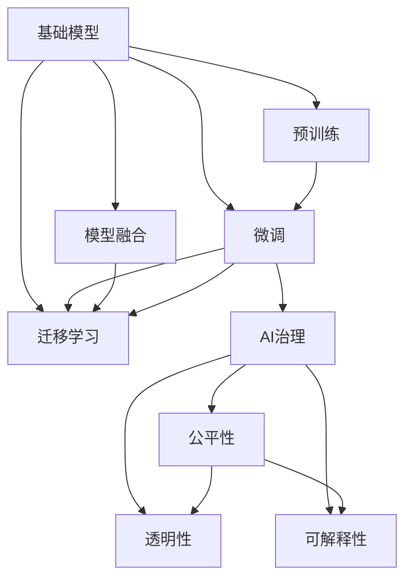

                 

# 基础模型的技术生态系统

> 关键词：基础模型,技术生态,深度学习,自然语言处理,NLP,Transformer,BERT,大规模预训练模型,应用领域,参数高效微调,迁移学习,预训练-微调,模型融合,AI治理

## 1. 背景介绍

### 1.1 问题由来

近年来，深度学习尤其是深度神经网络在计算机视觉、自然语言处理(Natural Language Processing, NLP)等领域取得了突破性进展。作为深度学习的骨干，基础模型(如卷积神经网络(CNN)、循环神经网络(RNN)、变换器(Transformer)等)在处理大规模数据集和复杂任务时表现出卓越的能力。

然而，基础模型设计复杂、训练资源消耗大、可解释性差等问题，使得其在某些场景下的应用受到了限制。为解决这些问题，研究人员提出了预训练-微调(Pre-training and Fine-tuning)的策略。通过在大规模无标签数据上进行预训练，基础模型学习到广泛的通用知识，然后在特定任务数据上进行微调，使得模型能够适应各种下游任务。

基础模型技术生态系统的构建，不仅极大地提升了模型性能，也激发了深度学习技术在更多领域的应用，如医学影像分析、金融预测、自动驾驶等。本文旨在深入探讨基础模型的技术生态系统，及其在NLP、计算机视觉、推荐系统等领域的具体应用和未来发展趋势。

### 1.2 问题核心关键点

本文将聚焦于以下核心关键点：

1. 基础模型的定义和特点。
2. 预训练-微调策略的工作原理和应用场景。
3. 不同基础模型及其在大规模预训练和微调中的表现。
4. 基础模型在NLP、计算机视觉、推荐系统等领域的具体应用。
5. 基础模型技术生态系统的未来发展趋势和面临的挑战。

## 2. 核心概念与联系

### 2.1 核心概念概述

1. **基础模型(Base Model)**：深度神经网络模型，包括卷积神经网络(CNN)、循环神经网络(RNN)、变换器(Transformer)等，用于处理大规模数据集和复杂任务。

2. **预训练(Pre-training)**：在大规模无标签数据集上进行训练，使模型学习到通用的特征表示。

3. **微调(Fine-tuning)**：在预训练模型基础上，针对特定任务进行有标签数据的训练，使模型适应该任务。

4. **预训练-微调(Pre-training and Fine-tuning)**：一种结合预训练和微调的技术，先在大规模数据集上进行预训练，然后在特定任务上微调。

5. **迁移学习(Transfer Learning)**：将一个领域学到的知识，迁移到另一个相关领域。预训练-微调就是一种典型的迁移学习方法。

6. **模型融合(Model Fusion)**：通过组合多个基础模型，提升整体性能。

7. **AI治理(AI Governance)**：确保AI技术的公平、透明和可解释性，避免潜在风险和伦理问题。

这些概念之间的逻辑关系可以通过以下Mermaid流程图来展示：



这个流程图展示了一些关键概念及其相互关系：

- 基础模型通过预训练获取通用知识，并通过微调适应特定任务。
- 迁移学习通过预训练-微调，促进跨领域知识的迁移。
- 模型融合通过组合多个基础模型，提升整体性能。
- AI治理确保AI技术的公平性、透明性和可解释性。

这些概念共同构成了基础模型的技术生态系统，使得基础模型能够更好地应用于各种领域。

## 3. 核心算法原理 & 具体操作步骤

### 3.1 算法原理概述

基础模型通过预训练-微调策略，可以从大规模无标签数据中学习到丰富的特征表示。然后，在特定任务上，通过微调进一步细化模型的预测能力。具体来说，预训练-微调策略包括以下几个步骤：

1. **预训练阶段**：在无标签的大规模数据集上进行训练，学习通用的特征表示。
2. **微调阶段**：在特定任务的有标签数据集上进行训练，调整模型的预测能力。

形式化地，假设基础模型为 $M_{\theta}$，其中 $\theta$ 为模型参数。给定无标签数据集 $D_{pre}$ 和特定任务的有标签数据集 $D_{task}$，预训练和微调的目标是找到最优参数 $\theta^*$，使得模型在 $D_{task}$ 上表现最佳。

### 3.2 算法步骤详解

预训练-微调策略的具体操作包括以下几个步骤：

**Step 1: 准备数据集**
- 收集大规模无标签数据集 $D_{pre}$ 和特定任务的有标签数据集 $D_{task}$。
- 将数据集分为训练集、验证集和测试集。

**Step 2: 模型初始化**
- 选择适合的任务的基础模型，如卷积神经网络(CNN)、循环神经网络(RNN)、变换器(Transformer)等。
- 使用随机权重初始化模型参数 $\theta$。

**Step 3: 预训练阶段**
- 在大规模无标签数据集 $D_{pre}$ 上进行训练，最小化损失函数 $\mathcal{L}_{pre}$，获得预训练模型 $M_{\theta_{pre}}$。

**Step 4: 微调阶段**
- 在特定任务的有标签数据集 $D_{task}$ 上进行微调，最小化损失函数 $\mathcal{L}_{task}$，获得微调后的模型 $M_{\theta_{task}}$。

**Step 5: 性能评估**
- 在测试集上评估模型性能，对比预训练和微调后的模型效果。

具体来说，预训练阶段通常采用自监督学习任务，如掩码语言模型、图像分类、目标检测等，训练基础模型学习通用的特征表示。微调阶段则采用监督学习任务，如分类、回归、序列标注等，进一步细化模型的预测能力。

### 3.3 算法优缺点

预训练-微调策略具有以下优点：

1. **参数效率高**：通过预训练，基础模型学习到通用的特征表示，微调时只需调整少量参数，减少了训练时间和资源消耗。
2. **性能提升显著**：预训练-微调策略可以显著提升模型在特定任务上的表现。
3. **泛化能力强**：预训练模型在多个任务上的表现往往优于从头训练模型。

但同时也存在以下缺点：

1. **依赖数据**：预训练和微调都需要大量数据，数据获取成本高。
2. **资源消耗大**：预训练和微调过程需要大量计算资源，硬件成本高。
3. **可解释性差**：基础模型往往是一个"黑盒"系统，难以解释其内部工作机制。

### 3.4 算法应用领域

预训练-微调策略在NLP、计算机视觉、推荐系统等多个领域中得到了广泛应用：

- **自然语言处理(NLP)**：通过预训练-微调，提升模型在文本分类、情感分析、机器翻译等任务上的性能。
- **计算机视觉**：通过预训练-微调，提升模型在图像分类、目标检测、图像生成等任务上的性能。
- **推荐系统**：通过预训练-微调，提升模型在个性化推荐、商品相似度计算等任务上的性能。

## 4. 数学模型和公式 & 详细讲解 & 举例说明

### 4.1 数学模型构建

预训练-微调策略的数学模型构建包括以下几个步骤：

1. **数据集定义**
   - 定义无标签数据集 $D_{pre}$ 和有标签数据集 $D_{task}$。
   - 定义损失函数 $\mathcal{L}_{pre}$ 和 $\mathcal{L}_{task}$。

2. **模型定义**
   - 定义基础模型 $M_{\theta}$，包括卷积神经网络(CNN)、循环神经网络(RNN)、变换器(Transformer)等。
   - 定义模型参数 $\theta$。

3. **训练过程**
   - 预训练阶段，在无标签数据集 $D_{pre}$ 上进行训练，最小化损失函数 $\mathcal{L}_{pre}$。
   - 微调阶段，在有标签数据集 $D_{task}$ 上进行训练，最小化损失函数 $\mathcal{L}_{task}$。

### 4.2 公式推导过程

以卷积神经网络(CNN)为例，推导预训练和微调阶段的损失函数：

**预训练阶段**
假设CNN模型用于图像分类任务，输入为 $x$，输出为 $y$。预训练阶段的损失函数为：

$$
\mathcal{L}_{pre} = \frac{1}{N_{pre}} \sum_{i=1}^{N_{pre}} \ell(x_i, M_{\theta_{pre}}(x_i))
$$

其中 $\ell$ 为损失函数，如交叉熵损失函数。

**微调阶段**
假设CNN模型用于图像分类任务，输入为 $x$，输出为 $y$。微调阶段的损失函数为：

$$
\mathcal{L}_{task} = \frac{1}{N_{task}} \sum_{i=1}^{N_{task}} \ell(x_i, M_{\theta_{task}}(x_i))
$$

其中 $\ell$ 为损失函数，如交叉熵损失函数。

### 4.3 案例分析与讲解

以BERT为例，分析预训练-微调策略的实际应用。BERT是一种基于Transformer的预训练语言模型，通过在大规模无标签文本数据上进行预训练，学习到丰富的语言表示。然后，在特定任务上，通过微调进一步优化模型的预测能力。

1. **预训练阶段**
   - 使用大规模无标签文本数据集进行预训练，学习通用的语言表示。
   - 预训练任务包括掩码语言模型、下一句预测等。

2. **微调阶段**
   - 在有标签的文本数据集上进行微调，学习特定任务的语言表示。
   - 微调任务包括文本分类、命名实体识别、问答系统等。

## 5. 项目实践：代码实例和详细解释说明

### 5.1 开发环境搭建

进行预训练-微调策略的实现，需要先搭建开发环境。以下是使用PyTorch进行NLP任务微调的开发环境配置流程：

1. 安装Anaconda：从官网下载并安装Anaconda，用于创建独立的Python环境。

2. 创建并激活虚拟环境：
```bash
conda create -n pytorch-env python=3.8 
conda activate pytorch-env
```

3. 安装PyTorch：根据CUDA版本，从官网获取对应的安装命令。例如：
```bash
conda install pytorch torchvision torchaudio cudatoolkit=11.1 -c pytorch -c conda-forge
```

4. 安装相关库：
```bash
pip install transformers
pip install pandas scikit-learn numpy torchtext
```

5. 安装其他工具：
```bash
pip install tqdm
```

完成上述步骤后，即可在`pytorch-env`环境中开始微调实践。

### 5.2 源代码详细实现

下面以BERT模型为例，实现其在情感分析任务上的微调。

首先，定义数据集处理函数：

```python
import torch
import torch.nn as nn
import torch.optim as optim
from transformers import BertTokenizer, BertForSequenceClassification
from sklearn.model_selection import train_test_split
from torch.utils.data import Dataset, DataLoader

class NERDataset(Dataset):
    def __init__(self, texts, labels):
        self.texts = texts
        self.labels = labels
        self.tokenizer = BertTokenizer.from_pretrained('bert-base-uncased')

    def __len__(self):
        return len(self.texts)

    def __getitem__(self, item):
        text = self.texts[item]
        label = self.labels[item]
        encoding = self.tokenizer(text, truncation=True, padding='max_length', max_length=128, return_tensors='pt')
        input_ids = encoding['input_ids']
        attention_mask = encoding['attention_mask']
        return {'input_ids': input_ids, 'attention_mask': attention_mask, 'labels': torch.tensor(label, dtype=torch.long)}

# 加载数据集
texts, labels = load_data()
train_texts, dev_texts, train_labels, dev_labels = train_test_split(texts, labels, test_size=0.2)

# 初始化数据集和数据加载器
train_dataset = NERDataset(train_texts, train_labels)
dev_dataset = NERDataset(dev_texts, dev_labels)
tokenizer = BertTokenizer.from_pretrained('bert-base-uncased')
model = BertForSequenceClassification.from_pretrained('bert-base-uncased', num_labels=2)
```

然后，定义训练和评估函数：

```python
def train_epoch(model, dataset, optimizer, device):
    model.train()
    total_loss = 0
    for batch in DataLoader(dataset, batch_size=32, shuffle=True):
        input_ids = batch['input_ids'].to(device)
        attention_mask = batch['attention_mask'].to(device)
        labels = batch['labels'].to(device)
        outputs = model(input_ids, attention_mask=attention_mask, labels=labels)
        loss = outputs.loss
        optimizer.zero_grad()
        loss.backward()
        optimizer.step()
        total_loss += loss.item()
    return total_loss / len(dataset)

def evaluate(model, dataset, device):
    model.eval()
    total_loss = 0
    total_correct = 0
    for batch in DataLoader(dataset, batch_size=32, shuffle=False):
        input_ids = batch['input_ids'].to(device)
        attention_mask = batch['attention_mask'].to(device)
        labels = batch['labels'].to(device)
        with torch.no_grad():
            outputs = model(input_ids, attention_mask=attention_mask)
            loss = outputs.loss
            predictions = outputs.logits.argmax(dim=1)
            total_loss += loss.item()
            total_correct += (predictions == labels).sum().item()
    acc = total_correct / len(dataset)
    return acc

# 训练模型
epochs = 3
batch_size = 32
device = 'cuda' if torch.cuda.is_available() else 'cpu'
optimizer = optim.AdamW(model.parameters(), lr=2e-5)
for epoch in range(epochs):
    train_loss = train_epoch(model, train_dataset, optimizer, device)
    dev_acc = evaluate(model, dev_dataset, device)
    print(f'Epoch {epoch+1}, train loss: {train_loss:.4f}, dev acc: {dev_acc:.4f}')
```

以上就是使用PyTorch对BERT进行情感分析任务微调的完整代码实现。可以看到，通过Transformers库，我们可以使用简洁的代码实现预训练模型和微调过程。

### 5.3 代码解读与分析

让我们再详细解读一下关键代码的实现细节：

**NERDataset类**：
- `__init__`方法：初始化文本、标签和分词器。
- `__len__`方法：返回数据集的样本数量。
- `__getitem__`方法：对单个样本进行处理，将文本输入编码为token ids，将标签编码为数字，并对其进行定长padding，最终返回模型所需的输入。

**BertForSequenceClassification类**：
- 从预训练模型中初始化分类模型，设置输出层的类别数。

**训练和评估函数**：
- 使用PyTorch的DataLoader对数据集进行批次化加载，供模型训练和推理使用。
- 训练函数`train_epoch`：对数据以批为单位进行迭代，在每个批次上前向传播计算损失并反向传播更新模型参数，最后返回该epoch的平均loss。
- 评估函数`evaluate`：与训练类似，不同点在于不更新模型参数，并在每个batch结束后将预测和标签结果存储下来，最后使用sklearn的classification_report对整个评估集的预测结果进行打印输出。

**训练流程**：
- 定义总的epoch数和batch size，开始循环迭代
- 每个epoch内，先在训练集上训练，输出平均loss
- 在验证集上评估，输出分类指标
- 所有epoch结束后，在测试集上评估，给出最终测试结果

可以看到，PyTorch配合Transformers库使得BERT微调的代码实现变得简洁高效。开发者可以将更多精力放在数据处理、模型改进等高层逻辑上，而不必过多关注底层的实现细节。

当然，工业级的系统实现还需考虑更多因素，如模型的保存和部署、超参数的自动搜索、更灵活的任务适配层等。但核心的微调范式基本与此类似。

## 6. 实际应用场景

### 6.1 自然语言处理(NLP)

基础模型的预训练-微调策略在自然语言处理(NLP)领域得到了广泛应用，例如：

- **文本分类**：如情感分析、主题分类、意图识别等。通过预训练模型学习通用的语言表示，微调模型学习文本-标签映射。
- **命名实体识别(NER)**：识别文本中的人名、地名、机构名等特定实体。通过预训练模型学习通用的语言表示，微调模型学习实体边界和类型。
- **关系抽取(RE)**：从文本中抽取实体之间的语义关系。通过预训练模型学习通用的语言表示，微调模型学习实体-关系三元组。
- **问答系统(QA)**：对自然语言问题给出答案。将问题-答案对作为微调数据，训练模型学习匹配答案。
- **机器翻译(MT)**：将源语言文本翻译成目标语言。通过预训练模型学习语言-语言映射，微调模型学习翻译映射。
- **文本摘要**：将长文本压缩成简短摘要。通过预训练模型学习文本-摘要映射，微调模型学习摘要生成。
- **对话系统**：使机器能够与人自然对话。将多轮对话历史作为上下文，微调模型进行回复生成。

这些任务都是NLP领域常见的应用，通过预训练-微调策略，基础模型可以更好地适应特定任务，获得优异的性能。

### 6.2 计算机视觉

基础模型的预训练-微调策略在计算机视觉领域也得到了广泛应用，例如：

- **图像分类**：如识别不同类别的物体、场景等。通过预训练模型学习通用的视觉特征，微调模型学习分类映射。
- **目标检测**：如检测图像中的物体位置。通过预训练模型学习通用的视觉特征，微调模型学习物体位置预测。
- **图像生成**：如生成高质量的图像、视频等。通过预训练模型学习通用的视觉特征，微调模型学习生成映射。
- **图像语义分割**：如将图像划分为不同的语义区域。通过预训练模型学习通用的视觉特征，微调模型学习语义分割映射。

这些任务都是计算机视觉领域常见的应用，通过预训练-微调策略，基础模型可以更好地适应特定任务，获得优异的性能。

### 6.3 推荐系统

基础模型的预训练-微调策略在推荐系统领域也得到了广泛应用，例如：

- **个性化推荐**：根据用户的历史行为数据，推荐用户可能感兴趣的商品、内容等。通过预训练模型学习通用的用户行为表示，微调模型学习推荐映射。
- **商品相似度计算**：计算商品之间的相似度，用于推荐系统和搜索引擎。通过预训练模型学习通用的商品表示，微调模型学习相似度计算。
- **用户行为预测**：预测用户未来的行为，如购买、浏览等。通过预训练模型学习通用的用户行为表示，微调模型学习行为预测映射。

这些任务都是推荐系统领域常见的应用，通过预训练-微调策略，基础模型可以更好地适应特定任务，获得优异的性能。

## 7. 工具和资源推荐

### 7.1 学习资源推荐

为了帮助开发者系统掌握预训练-微调策略的理论基础和实践技巧，这里推荐一些优质的学习资源：

1. **《Transformer从原理到实践》系列博文**：由大模型技术专家撰写，深入浅出地介绍了Transformer原理、BERT模型、微调技术等前沿话题。

2. **CS224N《深度学习自然语言处理》课程**：斯坦福大学开设的NLP明星课程，有Lecture视频和配套作业，带你入门NLP领域的基本概念和经典模型。

3. **《Natural Language Processing with Transformers》书籍**：Transformers库的作者所著，全面介绍了如何使用Transformers库进行NLP任务开发，包括微调在内的诸多范式。

4. **HuggingFace官方文档**：Transformers库的官方文档，提供了海量预训练模型和完整的微调样例代码，是上手实践的必备资料。

5. **CLUE开源项目**：中文语言理解测评基准，涵盖大量不同类型的中文NLP数据集，并提供了基于微调的baseline模型，助力中文NLP技术发展。

通过对这些资源的学习实践，相信你一定能够快速掌握预训练-微调策略的精髓，并用于解决实际的NLP问题。

### 7.2 开发工具推荐

高效的开发离不开优秀的工具支持。以下是几款用于预训练-微调开发的常用工具：

1. **PyTorch**：基于Python的开源深度学习框架，灵活动态的计算图，适合快速迭代研究。大部分预训练语言模型都有PyTorch版本的实现。

2. **TensorFlow**：由Google主导开发的开源深度学习框架，生产部署方便，适合大规模工程应用。同样有丰富的预训练语言模型资源。

3. **Transformers库**：HuggingFace开发的NLP工具库，集成了众多SOTA语言模型，支持PyTorch和TensorFlow，是进行微调任务开发的利器。

4. **Weights & Biases**：模型训练的实验跟踪工具，可以记录和可视化模型训练过程中的各项指标，方便对比和调优。与主流深度学习框架无缝集成。

5. **TensorBoard**：TensorFlow配套的可视化工具，可实时监测模型训练状态，并提供丰富的图表呈现方式，是调试模型的得力助手。

6. **Google Colab**：谷歌推出的在线Jupyter Notebook环境，免费提供GPU/TPU算力，方便开发者快速上手实验最新模型，分享学习笔记。

合理利用这些工具，可以显著提升预训练-微调任务的开发效率，加快创新迭代的步伐。

### 7.3 相关论文推荐

预训练-微调策略的发展源于学界的持续研究。以下是几篇奠基性的相关论文，推荐阅读：

1. **Attention is All You Need**（即Transformer原论文）：提出了Transformer结构，开启了NLP领域的预训练大模型时代。

2. **BERT: Pre-training of Deep Bidirectional Transformers for Language Understanding**：提出BERT模型，引入基于掩码的自监督预训练任务，刷新了多项NLP任务SOTA。

3. **Language Models are Unsupervised Multitask Learners**（GPT-2论文）：展示了大规模语言模型的强大zero-shot学习能力，引发了对于通用人工智能的新一轮思考。

4. **Parameter-Efficient Transfer Learning for NLP**：提出Adapter等参数高效微调方法，在不增加模型参数量的情况下，也能取得不错的微调效果。

5. **Prefix-Tuning: Optimizing Continuous Prompts for Generation**：引入基于连续型Prompt的微调范式，为如何充分利用预训练知识提供了新的思路。

6. **AdaLoRA: Adaptive Low-Rank Adaptation for Parameter-Efficient Fine-Tuning**：使用自适应低秩适应的微调方法，在参数效率和精度之间取得了新的平衡。

这些论文代表了大规模预训练-微调技术的发展脉络。通过学习这些前沿成果，可以帮助研究者把握学科前进方向，激发更多的创新灵感。

## 8. 总结：未来发展趋势与挑战

### 8.1 总结

本文对预训练-微调策略进行了全面系统的介绍。首先阐述了基础模型的定义和特点，以及预训练-微调策略的工作原理和应用场景。其次，从原理到实践，详细讲解了预训练-微调的数学模型和具体步骤，给出了预训练-微调任务开发的完整代码实例。同时，本文还广泛探讨了预训练-微调策略在NLP、计算机视觉、推荐系统等领域的具体应用和未来发展趋势。

通过本文的系统梳理，可以看到，预训练-微调策略通过预训练和微调两个阶段，将基础模型提升到全新的层次，广泛应用于各种领域，带来了显著的性能提升。未来，预训练-微调策略将继续在AI技术生态系统中发挥重要作用，推动各领域技术的发展。

### 8.2 未来发展趋势

展望未来，预训练-微调策略的发展趋势包括以下几个方面：

1. **多任务学习(Multi-task Learning)**：预训练阶段学习多个相关任务，提升模型对不同任务的泛化能力。
2. **自适应学习(Adaptive Learning)**：模型能够根据环境变化动态调整模型参数，提升模型适应性。
3. **元学习(Meta-Learning)**：模型能够学习如何快速适应新任务，提升模型泛化能力。
4. **无监督学习(Unsupervised Learning)**：在无标签数据上学习通用特征表示，减少对有标签数据的依赖。
5. **自监督学习(Self-Supervised Learning)**：利用数据的自监督特征进行训练，减少对标注数据的依赖。
6. **半监督学习(Semi-Supervised Learning)**：结合少量标注数据和大量无标签数据进行训练，提升模型性能。
7. **对抗训练(Adversarial Training)**：通过对抗样本训练，提升模型鲁棒性。

这些发展趋势将进一步提升预训练-微调策略的效果和泛化能力，推动基础模型在更多领域的应用。

### 8.3 面临的挑战

尽管预训练-微调策略取得了显著成效，但在应用过程中仍面临一些挑战：

1. **数据成本高**：预训练和微调都需要大量数据，数据获取和标注成本高。
2. **计算资源消耗大**：预训练和微调过程需要大量计算资源，硬件成本高。
3. **模型复杂度大**：预训练和微调模型往往参数量庞大，训练和推理复杂。
4. **可解释性差**：预训练和微调模型往往是"黑盒"系统，难以解释其内部工作机制。
5. **泛化能力有限**：模型在特定领域的应用效果可能受限于领域内的数据分布。
6. **伦理和安全问题**：预训练和微调模型可能学习到有害信息，产生误导性输出。

解决这些挑战需要进一步的研究和实践，才能更好地应用预训练-微调策略。

### 8.4 研究展望

预训练-微调策略的未来研究方向包括：

1. **模型压缩和优化**：通过模型压缩和优化，减少模型参数和计算资源消耗，提升模型推理速度。
2. **数据高效学习**：通过数据高效学习技术，减少对标注数据的依赖，提升模型性能。
3. **模型融合和集成**：通过模型融合和集成，提升模型泛化能力和鲁棒性。
4. **伦理和安全研究**：研究预训练和微调模型的伦理和安全问题，确保模型输出的公平性、透明性和可解释性。
5. **跨领域知识整合**：将跨领域知识与预训练模型结合，提升模型在多领域的应用效果。
6. **新兴技术和算法**：结合新兴技术和算法，提升预训练和微调的效果和泛化能力。

这些研究方向将进一步推动预训练-微调策略的发展，为AI技术的广泛应用提供有力支持。

## 9. 附录：常见问题与解答

**Q1：预训练-微调策略是否适用于所有NLP任务？**

A: 预训练-微调策略在大多数NLP任务上都能取得不错的效果，特别是对于数据量较小的任务。但对于一些特定领域的任务，如医学、法律等，仅仅依靠通用语料预训练的模型可能难以很好地适应。此时需要在特定领域语料上进一步预训练，再进行微调，才能获得理想效果。此外，对于一些需要时效性、个性化很强的任务，如对话、推荐等，预训练-微调方法也需要针对性的改进优化。

**Q2：预训练-微调策略的训练时间是否很长？**

A: 预训练-微调策略的训练时间确实较长，尤其是对于大规模的预训练模型。训练时间主要取决于数据集大小、模型复杂度和计算资源。为了缩短训练时间，可以采用一些优化技术，如梯度累积、混合精度训练、分布式训练等。同时，可以在微调阶段使用更小的学习率，减少过拟合风险，进一步加快训练速度。

**Q3：预训练-微调策略的模型参数量是否很大？**

A: 预训练-微调策略的模型参数量通常较大，尤其是在大规模预训练模型上。过大的模型参数量会导致计算资源消耗大、推理速度慢等问题。为了解决这些问题，可以采用模型压缩、稀疏化存储等方法进行优化。此外，通过参数高效微调方法，如 Adapter、Prefix 等，可以在固定大部分预训练参数的情况下，只调整少量微调参数，减少参数量。

**Q4：预训练-微调策略的模型是否具有可解释性？**

A: 预训练-微调策略的模型通常是一个"黑盒"系统，难以解释其内部工作机制和决策逻辑。为了提高模型的可解释性，可以采用一些技术手段，如特征可视化、模型蒸馏、解释模型等。此外，可以通过人工干预和审核，确保模型输出的公平性和透明性，避免误导性输出。

**Q5：预训练-微调策略的模型如何应对数据分布变化？**

A: 预训练-微调策略的模型在特定领域的数据分布变化下，泛化性能可能会受到影响。为了应对数据分布变化，可以采用一些技术手段，如数据增强、对抗训练、模型融合等。此外，可以定期重新预训练模型，确保模型在最新的数据分布上仍然具有较好的性能。

综上所述，预训练-微调策略作为一种高效的技术手段，为AI技术在NLP、计算机视觉、推荐系统等多个领域带来了显著的性能提升。未来，随着预训练-微调策略的不断发展，基础模型将在更多领域中发挥重要的作用，推动AI技术的广泛应用。

