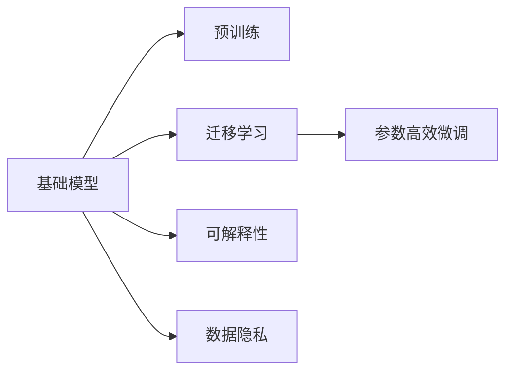
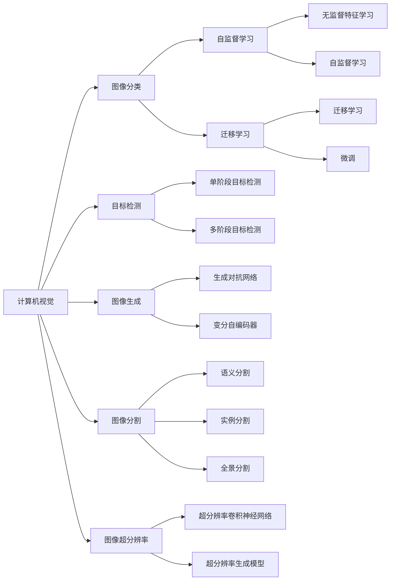

                 

# 基础模型的技术研究与社会应用

在人工智能飞速发展的今天，基础模型已经成为了推动技术进步和应用落地的重要驱动力。本文将从基础模型的技术研究和社会应用两个角度出发，深入探讨其在各个领域的应用潜力以及面临的挑战和机遇。

## 1. 背景介绍

### 1.1 问题由来

随着深度学习技术的普及和数据量的不断增加，基础模型在计算机视觉、自然语言处理（NLP）、语音识别等领域取得了显著进展。这些模型通过在大规模无标签数据上进行预训练，学习到通用的特征表示，再通过微调在特定任务上取得优异的性能。以GPT-3、BERT、ResNet等模型为代表的预训练模型，已经成为了推动AI应用落地的重要工具。

然而，基础模型在实际应用中也面临着诸多挑战，如算力消耗大、模型复杂度高、数据隐私问题等。如何在保证模型性能的同时，解决这些问题，并进一步扩展其应用场景，是当前研究的重要方向。

### 1.2 问题核心关键点

基础模型的核心在于其强大的特征表示能力，能够在各类任务上实现迁移学习。其主要特点包括：

- **预训练**：在大规模无标签数据上进行预训练，学习通用的特征表示。
- **迁移学习**：通过微调在特定任务上取得优异的性能。
- **通用性**：可以适应多种任务，只需少量数据即可完成微调。
- **高效性**：通过参数高效微调等技术，可以在小数据集上实现性能提升。

尽管如此，基础模型在实际应用中也存在着一些问题：

- **资源消耗大**：高参数量和高计算复杂度使得模型训练和推理需要大量的算力和内存。
- **数据隐私**：预训练模型依赖于大规模数据，存在数据隐私泄露的风险。
- **可解释性不足**：黑盒模型难以解释其决策过程，难以满足实际应用中的可解释性和可控性要求。

针对这些问题，本文将从技术研究和应用场景两个方面展开探讨。

## 2. 核心概念与联系

### 2.1 核心概念概述

为了更好地理解基础模型的技术研究和社会应用，本文将介绍几个核心概念及其相互联系：

- **基础模型**：在大规模无标签数据上进行预训练，学习到通用的特征表示的模型。
- **预训练**：在大规模无标签数据上进行自监督学习，学习到通用的特征表示。
- **迁移学习**：将预训练模型作为初始化参数，通过微调在特定任务上取得优异的性能。
- **参数高效微调**：通过只更新少量模型参数，提高模型在特定任务上的性能。
- **可解释性**：模型决策过程的可视化，解释模型如何做出预测。
- **数据隐私**：保护用户数据，防止数据泄露。

这些核心概念之间存在着密切的联系，构成了基础模型的技术框架，如图1所示：



图1：基础模型的技术框架

## 3. 核心算法原理 & 具体操作步骤

### 3.1 算法原理概述

基础模型的核心原理是通过在大规模无标签数据上进行预训练，学习到通用的特征表示。这些通用的特征表示可以在各类任务上实现迁移学习，即通过微调在特定任务上取得优异的性能。

在微调过程中，基础模型作为初始化参数，通过与特定任务的标注数据结合，进一步学习任务相关的特征表示。这一过程通过反向传播算法进行，最小化损失函数来优化模型参数。

### 3.2 算法步骤详解

基础模型的微调过程主要包括以下几个步骤：

1. **准备数据**：收集特定任务的标注数据集，划分为训练集、验证集和测试集。
2. **设计任务适配层**：根据任务类型，在基础模型顶层设计合适的输出层和损失函数。
3. **设置超参数**：选择合适的优化算法及其参数，如Adam、SGD等，设置学习率、批大小、迭代轮数等。
4. **微调模型**：在训练集上进行前向传播和反向传播，最小化损失函数，优化模型参数。
5. **验证和测试**：在验证集上评估模型性能，防止过拟合，在测试集上评估最终性能。

### 3.3 算法优缺点

基础模型具有以下优点：

- **高效性**：通过迁移学习，可以在小数据集上实现高性能。
- **通用性**：适用于多种任务，只需少量数据即可完成微调。
- **可扩展性**：可以通过不断增加数据，提升模型性能。

但同时也存在一些缺点：

- **资源消耗大**：高参数量和高计算复杂度使得模型训练和推理需要大量的算力和内存。
- **数据隐私问题**：预训练模型依赖于大规模数据，存在数据隐私泄露的风险。
- **可解释性不足**：黑盒模型难以解释其决策过程，难以满足实际应用中的可解释性和可控性要求。

### 3.4 算法应用领域

基础模型在计算机视觉、自然语言处理、语音识别等领域有着广泛的应用，如图2所示：



图2：基础模型的应用领域

## 4. 数学模型和公式 & 详细讲解 & 举例说明

### 4.1 数学模型构建

假设基础模型为 $M_{\theta}$，其中 $\theta$ 为预训练得到的模型参数。给定特定任务的标注数据集 $D=\{(x_i, y_i)\}_{i=1}^N$，微调的目标是找到新的模型参数 $\hat{\theta}$，使得：

$$
\hat{\theta}=\mathop{\arg\min}_{\theta} \mathcal{L}(M_{\theta},D)
$$

其中 $\mathcal{L}$ 为针对任务 $T$ 设计的损失函数，用于衡量模型预测输出与真实标签之间的差异。

### 4.2 公式推导过程

以图像分类任务为例，假设模型 $M_{\theta}$ 在输入 $x$ 上的输出为 $\hat{y}=M_{\theta}(x) \in \{0,1\}^C$，表示样本属于 $C$ 个类别的概率。真实标签 $y \in \{0,1\}^C$。则二分类交叉熵损失函数定义为：

$$
\ell(M_{\theta}(x),y) = -\frac{1}{C}\sum_{c=1}^C y_c\log \hat{y}_c
$$

将其代入经验风险公式，得：

$$
\mathcal{L}(\theta) = -\frac{1}{N}\sum_{i=1}^N \ell(M_{\theta}(x_i),y_i)
$$

通过反向传播算法，损失函数对参数 $\theta_k$ 的梯度为：

$$
\frac{\partial \mathcal{L}(\theta)}{\partial \theta_k} = -\frac{1}{N}\sum_{i=1}^N (\frac{y_i}{\hat{y}_i}-1)\frac{\partial M_{\theta}(x_i)}{\partial \theta_k}
$$

其中 $\frac{\partial M_{\theta}(x_i)}{\partial \theta_k}$ 可进一步递归展开，利用自动微分技术完成计算。

### 4.3 案例分析与讲解

以BERT模型为例，进行自然语言处理任务微调的公式推导。

假设BERT模型在输入文本 $x$ 上的输出为 $\hat{y}=M_{\theta}(x) \in [0,1]$，表示样本属于正类的概率。真实标签 $y \in \{0,1\}$。则二分类交叉熵损失函数定义为：

$$
\ell(M_{\theta}(x),y) = -[y\log \hat{y} + (1-y)\log (1-\hat{y})]
$$

将其代入经验风险公式，得：

$$
\mathcal{L}(\theta) = -\frac{1}{N}\sum_{i=1}^N [y_i\log M_{\theta}(x_i)+(1-y_i)\log(1-M_{\theta}(x_i))]
$$

通过反向传播算法，损失函数对参数 $\theta_k$ 的梯度为：

$$
\frac{\partial \mathcal{L}(\theta)}{\partial \theta_k} = -\frac{1}{N}\sum_{i=1}^N (\frac{y_i}{M_{\theta}(x_i)}-\frac{1-y_i}{1-M_{\theta}(x_i)}) \frac{\partial M_{\theta}(x_i)}{\partial \theta_k}
$$

其中 $\frac{\partial M_{\theta}(x_i)}{\partial \theta_k}$ 可进一步递归展开，利用自动微分技术完成计算。

## 5. 项目实践：代码实例和详细解释说明

### 5.1 开发环境搭建

在进行基础模型微调实践前，我们需要准备好开发环境。以下是使用Python进行PyTorch开发的环境配置流程：

1. 安装Anaconda：从官网下载并安装Anaconda，用于创建独立的Python环境。

2. 创建并激活虚拟环境：
```bash
conda create -n pytorch-env python=3.8 
conda activate pytorch-env
```

3. 安装PyTorch：根据CUDA版本，从官网获取对应的安装命令。例如：
```bash
conda install pytorch torchvision torchaudio cudatoolkit=11.1 -c pytorch -c conda-forge
```

4. 安装TensorFlow：
```bash
conda install tensorflow
```

5. 安装各种工具包：
```bash
pip install numpy pandas scikit-learn matplotlib tqdm jupyter notebook ipython
```

完成上述步骤后，即可在`pytorch-env`环境中开始微调实践。

### 5.2 源代码详细实现

下面以图像分类任务为例，给出使用PyTorch进行ResNet模型微调的代码实现。

首先，定义图像分类任务的数据处理函数：

```python
import torch
from torch.utils.data import Dataset, DataLoader
from torchvision import transforms, models, datasets

class ImageClassificationDataset(Dataset):
    def __init__(self, data_dir, transform=None):
        self.data_dir = data_dir
        self.transform = transform
        self.train_dir = os.path.join(data_dir, 'train')
        self.test_dir = os.path.join(data_dir, 'test')
        self.train_img = datasets.ImageFolder(self.train_dir, self.transform)
        self.test_img = datasets.ImageFolder(self.test_dir, self.transform)
    
    def __len__(self):
        return len(self.train_img) + len(self.test_img)
    
    def __getitem__(self, idx):
        if idx < len(self.train_img):
            img, label = self.train_img[idx]
        else:
            img, label = self.test_img[idx - len(self.train_img)]
        img = transforms.ToTensor()(img)
        label = torch.tensor(label, dtype=torch.long)
        if self.transform:
            img = self.transform(img)
        return img, label
```

然后，定义模型和优化器：

```python
import torch.nn as nn
import torch.optim as optim

model = models.resnet50(pretrained=True)
model.fc = nn.Linear(2048, num_classes)
criterion = nn.CrossEntropyLoss()

optimizer = optim.SGD(model.parameters(), lr=0.001, momentum=0.9, weight_decay=1e-4)
```

接着，定义训练和评估函数：

```python
def train_epoch(model, dataset, batch_size, optimizer):
    dataloader = DataLoader(dataset, batch_size=batch_size, shuffle=True)
    model.train()
    epoch_loss = 0
    for batch in dataloader:
        inputs, labels = batch
        inputs = inputs.to(device)
        labels = labels.to(device)
        optimizer.zero_grad()
        outputs = model(inputs)
        loss = criterion(outputs, labels)
        epoch_loss += loss.item()
        loss.backward()
        optimizer.step()
    return epoch_loss / len(dataloader)

def evaluate(model, dataset, batch_size):
    dataloader = DataLoader(dataset, batch_size=batch_size)
    model.eval()
    preds, labels = [], []
    with torch.no_grad():
        for batch in dataloader:
            inputs, labels = batch
            inputs = inputs.to(device)
            labels = labels.to(device)
            outputs = model(inputs)
            preds.append(outputs.argmax(dim=1).cpu().numpy())
            labels.append(labels.cpu().numpy())
    return classification_report(labels, preds)
```

最后，启动训练流程并在测试集上评估：

```python
epochs = 10
batch_size = 32

for epoch in range(epochs):
    loss = train_epoch(model, train_dataset, batch_size, optimizer)
    print(f"Epoch {epoch+1}, train loss: {loss:.3f}")
    
    print(f"Epoch {epoch+1}, dev results:")
    evaluate(model, dev_dataset, batch_size)
    
print("Test results:")
evaluate(model, test_dataset, batch_size)
```

以上就是使用PyTorch对ResNet进行图像分类任务微调的完整代码实现。可以看到，得益于PyTorch的强大封装，我们可以用相对简洁的代码完成模型微调。

### 5.3 代码解读与分析

让我们再详细解读一下关键代码的实现细节：

**ImageClassificationDataset类**：
- `__init__`方法：初始化数据集路径和转换方法。
- `__len__`方法：返回数据集的样本数量。
- `__getitem__`方法：对单个样本进行处理，将图像转换为Tensor，标签转换为Tensor。

**criterion函数**：
- 定义交叉熵损失函数。

**train_epoch函数**：
- 使用PyTorch的DataLoader对数据集进行批次化加载，供模型训练使用。
- 在每个批次上前向传播计算损失函数，反向传播更新模型参数。

**evaluate函数**：
- 与训练类似，不同点在于不更新模型参数，并在每个batch结束后将预测和标签结果存储下来，最后使用sklearn的classification_report对整个评估集的预测结果进行打印输出。

**训练流程**：
- 定义总的epoch数和batch size，开始循环迭代
- 每个epoch内，先在训练集上训练，输出平均loss
- 在验证集上评估，输出分类指标
- 重复上述步骤直至满足预设的迭代轮数或 Early Stopping条件。

可以看到，PyTorch配合TensorFlow库使得ResNet模型微调的代码实现变得简洁高效。开发者可以将更多精力放在数据处理、模型改进等高层逻辑上，而不必过多关注底层的实现细节。

当然，工业级的系统实现还需考虑更多因素，如模型的保存和部署、超参数的自动搜索、更灵活的任务适配层等。但核心的微调范式基本与此类似。

## 6. 实际应用场景

### 6.1 智能医疗诊断

基础模型在医疗诊断领域具有广泛的应用潜力。通过在大规模医学数据上进行预训练，学习到通用的医学特征表示，再通过微调在特定疾病诊断任务上取得优异的性能。

例如，在癌症筛查任务中，可以收集包含各种癌症病例的医学影像数据，将诊断结果标注为正负样本，在此基础上对预训练模型进行微调。微调后的模型能够自动识别癌症病灶，辅助医生进行早期诊断和治疗方案推荐。

### 6.2 金融市场预测

基础模型在金融市场预测中也具有重要的应用价值。通过在大规模金融市场数据上进行预训练，学习到通用的市场特征表示，再通过微调在特定市场预测任务上取得优异的性能。

例如，在股票价格预测任务中，可以收集历史股票价格数据，将未来某个时间点的股票价格标注为正负样本，在此基础上对预训练模型进行微调。微调后的模型能够根据历史价格数据，预测未来价格走势，为投资者提供决策支持。

### 6.3 自动驾驶

基础模型在自动驾驶领域具有广泛的应用潜力。通过在大规模交通数据上进行预训练，学习到通用的交通特征表示，再通过微调在特定驾驶任务上取得优异的性能。

例如，在自动驾驶决策任务中，可以收集包含各种交通场景的图像数据，将驾驶决策结果标注为正负样本，在此基础上对预训练模型进行微调。微调后的模型能够根据图像数据，做出正确的驾驶决策，提高自动驾驶的安全性和可靠性。

### 6.4 未来应用展望

随着基础模型的不断发展，其在各个领域的应用前景将更加广阔。未来，基础模型将在以下几个方面取得更大的突破：

1. **多模态融合**：将视觉、语音、文本等多模态信息进行深度融合，提升模型的感知能力和决策能力。
2. **自监督学习**：通过无监督学习方式，利用数据的多样性，提升模型的泛化能力和鲁棒性。
3. **跨领域迁移**：将模型在不同领域之间的迁移能力进一步提升，实现更广泛的领域覆盖。
4. **分布式训练**：通过分布式训练技术，提升模型的训练效率和可扩展性。
5. **量化加速**：通过量化技术，将浮点模型转为定点模型，提高计算效率和资源利用率。

## 7. 工具和资源推荐

### 7.1 学习资源推荐

为了帮助开发者系统掌握基础模型的理论基础和实践技巧，这里推荐一些优质的学习资源：

1. 《Deep Learning》一书：由Ian Goodfellow等编写，全面介绍了深度学习的基本概念和核心技术。
2. 《Hands-On Machine Learning with Scikit-Learn, Keras, and TensorFlow》一书：由Aurélien Géron编写，结合Scikit-Learn、Keras和TensorFlow，深入讲解了机器学习和深度学习的实践技巧。
3. CS231n《Convolutional Neural Networks for Visual Recognition》课程：斯坦福大学开设的计算机视觉课程，提供丰富的理论和实践指导。
4. CS224n《Natural Language Processing with Deep Learning》课程：斯坦福大学开设的自然语言处理课程，提供丰富的理论和实践指导。
5. arXiv预训练模型论文库：收集了大量的预训练模型论文，方便开发者学习和研究。

通过对这些资源的学习实践，相信你一定能够快速掌握基础模型的精髓，并用于解决实际的AI问题。

### 7.2 开发工具推荐

高效的开发离不开优秀的工具支持。以下是几款用于基础模型微调开发的常用工具：

1. PyTorch：基于Python的开源深度学习框架，灵活动态的计算图，适合快速迭代研究。大部分预训练语言模型都有PyTorch版本的实现。
2. TensorFlow：由Google主导开发的开源深度学习框架，生产部署方便，适合大规模工程应用。同样有丰富的预训练语言模型资源。
3. Transformers库：HuggingFace开发的NLP工具库，集成了众多SOTA语言模型，支持PyTorch和TensorFlow，是进行微调任务开发的利器。
4. Weights & Biases：模型训练的实验跟踪工具，可以记录和可视化模型训练过程中的各项指标，方便对比和调优。与主流深度学习框架无缝集成。
5. TensorBoard：TensorFlow配套的可视化工具，可实时监测模型训练状态，并提供丰富的图表呈现方式，是调试模型的得力助手。
6. Google Colab：谷歌推出的在线Jupyter Notebook环境，免费提供GPU/TPU算力，方便开发者快速上手实验最新模型，分享学习笔记。

合理利用这些工具，可以显著提升基础模型微调任务的开发效率，加快创新迭代的步伐。

### 7.3 相关论文推荐

基础模型和微调技术的发展源于学界的持续研究。以下是几篇奠基性的相关论文，推荐阅读：

1. AlexNet：ImageNet大规模视觉识别挑战赛的冠军模型，开启了深度学习在计算机视觉领域的应用。
2. VGG：设计了卷积神经网络的经典结构，大幅提升了计算机视觉模型的精度。
3. ResNet：提出了残差网络结构，有效解决了深度网络退化的问题，提升了模型深度。
4. BERT：提出了一种新的预训练方法，通过遮蔽语言模型和下一句预测任务，提升了自然语言处理模型的精度。
5. GPT-3：提出了一种新的预训练方法，通过自回归生成模型，提升了语言生成的精度和灵活性。

这些论文代表了大模型和微调技术的发展脉络。通过学习这些前沿成果，可以帮助研究者把握学科前进方向，激发更多的创新灵感。

## 8. 总结：未来发展趋势与挑战

### 8.1 总结

本文对基础模型的技术研究和社会应用进行了全面系统的介绍。首先阐述了基础模型的核心原理和应用场景，明确了其在各个领域的重要价值。其次，从理论到实践，详细讲解了基础模型的数学模型和微调算法，给出了微调任务开发的完整代码实例。同时，本文还广泛探讨了基础模型在智能医疗、金融市场、自动驾驶等多个行业领域的应用前景，展示了其广阔的应用空间。

通过本文的系统梳理，可以看到，基础模型在各个领域具有巨大的应用潜力，其强大的特征表示能力能够显著提升各类任务的性能。然而，基础模型也面临着诸多挑战，如算力消耗大、数据隐私问题、可解释性不足等，需要研究者不断攻克。

### 8.2 未来发展趋势

展望未来，基础模型将呈现以下几个发展趋势：

1. **多模态融合**：将视觉、语音、文本等多模态信息进行深度融合，提升模型的感知能力和决策能力。
2. **自监督学习**：通过无监督学习方式，利用数据的多样性，提升模型的泛化能力和鲁棒性。
3. **跨领域迁移**：将模型在不同领域之间的迁移能力进一步提升，实现更广泛的领域覆盖。
4. **分布式训练**：通过分布式训练技术，提升模型的训练效率和可扩展性。
5. **量化加速**：通过量化技术，将浮点模型转为定点模型，提高计算效率和资源利用率。

这些趋势凸显了基础模型的广阔前景，相信在未来，基础模型将在更多的领域和应用场景中发挥重要作用。

### 8.3 面临的挑战

尽管基础模型已经取得了显著进展，但在实际应用中也面临着诸多挑战：

1. **资源消耗大**：高参数量和高计算复杂度使得模型训练和推理需要大量的算力和内存。
2. **数据隐私问题**：预训练模型依赖于大规模数据，存在数据隐私泄露的风险。
3. **可解释性不足**：黑盒模型难以解释其决策过程，难以满足实际应用中的可解释性和可控性要求。

### 8.4 研究展望

面对基础模型面临的挑战，未来的研究需要在以下几个方面寻求新的突破：

1. **多模态融合**：将视觉、语音、文本等多模态信息进行深度融合，提升模型的感知能力和决策能力。
2. **自监督学习**：通过无监督学习方式，利用数据的多样性，提升模型的泛化能力和鲁棒性。
3. **跨领域迁移**：将模型在不同领域之间的迁移能力进一步提升，实现更广泛的领域覆盖。
4. **分布式训练**：通过分布式训练技术，提升模型的训练效率和可扩展性。
5. **量化加速**：通过量化技术，将浮点模型转为定点模型，提高计算效率和资源利用率。
6. **自适应优化**：通过自适应优化算法，提升模型的训练速度和效果。

这些研究方向将为未来的基础模型和微调技术带来新的突破，为构建更加智能、高效、可解释的AI系统奠定基础。面向未来，基础模型和微调技术还需要与其他人工智能技术进行更深入的融合，如知识表示、因果推理、强化学习等，多路径协同发力，共同推动自然语言理解和智能交互系统的进步。只有勇于创新、敢于突破，才能不断拓展基础模型的边界，让智能技术更好地造福人类社会。

## 9. 附录：常见问题与解答

**Q1：基础模型的预训练和微调有什么区别？**

A: 预训练是指在大规模无标签数据上进行自监督学习，学习到通用的特征表示。微调是指在预训练模型上，通过有监督学习，对特定任务进行优化，从而获得更好的性能。

**Q2：如何选择合适的学习率？**

A: 学习率的选择取决于具体任务和数据集。一般建议从1e-5开始调参，逐步减小学习率，直至收敛。也可以使用warmup策略，在开始阶段使用较小的学习率，再逐渐过渡到预设值。

**Q3：预训练模型和微调模型有哪些区别？**

A: 预训练模型是在大规模无标签数据上进行自监督学习，学习到通用的特征表示。微调模型是在预训练模型基础上，通过有监督学习，对特定任务进行优化，从而获得更好的性能。

**Q4：基础模型在医疗领域的应用有哪些？**

A: 基础模型在医疗领域可以应用于医学影像分类、疾病诊断、基因组分析等多个任务。例如，在医学影像分类任务中，可以利用预训练模型对医学影像进行分类，辅助医生进行疾病诊断。

**Q5：基础模型在金融领域的应用有哪些？**

A: 基础模型在金融领域可以应用于股票价格预测、信用风险评估、市场情绪分析等多个任务。例如，在股票价格预测任务中，可以利用预训练模型对股票价格进行预测，辅助投资者进行决策。

总之，基础模型在各个领域具有巨大的应用潜力，其强大的特征表示能力能够显著提升各类任务的性能。然而，基础模型也面临着诸多挑战，如算力消耗大、数据隐私问题、可解释性不足等，需要研究者不断攻克。未来，基础模型和微调技术还需要与其他人工智能技术进行更深入的融合，共同推动自然语言理解和智能交互系统的进步。

---

作者：禅与计算机程序设计艺术 / Zen and the Art of Computer Programming

