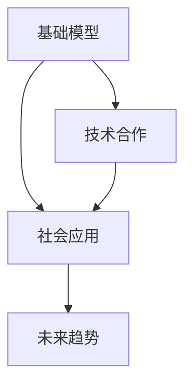
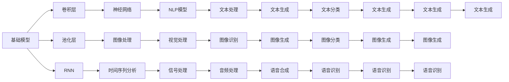

                 

# 基础模型的未来技术与社会合作

> 关键词：基础模型,技术合作,社会应用,未来趋势,算法优化

## 1. 背景介绍

### 1.1 问题由来

在当前的科技浪潮中，人工智能（AI）尤其是深度学习技术，正以前所未有的速度快速发展，推动了众多行业的数字化转型。然而，尽管深度学习模型在诸多任务上取得了卓越的成果，其背后的“黑盒”特性仍然让许多人对其产生质疑。特别是在医疗、金融等关键领域，模型的决策过程缺乏透明度，导致用户和监管机构难以对其信任。

基础模型作为深度学习技术的重要组成部分，因其简单、可解释、高效的特性，逐渐成为研究热点。通过将复杂的深度学习模型拆解为若干基础模块，基础模型不仅可以降低计算复杂度，提升模型可解释性，还能与其他技术深度结合，推动AI技术的普及和应用。本文旨在探讨基础模型及其在未来技术和社会合作中的潜在价值和挑战。

### 1.2 问题核心关键点

为了更好地理解基础模型的未来技术和社会合作，我们首先明确几个关键问题：

- **基础模型是什么**：基础模型是由若干基础模块组成的深度学习模型，通常使用线性代数和微积分来定义，具有可解释性强、计算效率高等优点。
- **技术合作如何实现**：基础模型需要与其他技术（如自然语言处理、计算机视觉等）进行深度融合，通过技术合作提升模型的综合能力。
- **社会应用前景如何**：基础模型在教育、医疗、金融等领域具有广泛应用前景，能够带来显著的社会效益。
- **未来趋势是什么**：基础模型的未来将向哪些方向发展，面临哪些挑战。

通过回答这些问题，我们可以更全面地了解基础模型在技术和社会合作中的作用和潜力。

## 2. 核心概念与联系

### 2.1 核心概念概述

- **基础模型**：指的是深度学习模型中的基础模块，如卷积层、池化层、循环神经网络等。这些模块通常具有结构简单、功能明确的特点，容易被理解和调试。
- **技术合作**：指的是将基础模型与其他技术进行深度结合，如自然语言处理、计算机视觉等，提升模型的综合能力，解决实际问题。
- **社会应用**：指的是基础模型在教育、医疗、金融等社会领域的应用，推动技术普及和应用，带来社会效益。
- **未来趋势**：指的是基础模型在未来技术和社会合作中的发展方向和潜在挑战。

这些核心概念之间的关系可以用以下Mermaid流程图表示：



这个流程图展示了基础模型、技术合作、社会应用和未来趋势之间的联系。

### 2.2 核心概念原理和架构的 Mermaid 流程图



这个流程图展示了基础模型的基本架构及其与其他技术的关系。

## 3. 核心算法原理 & 具体操作步骤

### 3.1 算法原理概述

基础模型的算法原理主要基于线性代数和微积分。以卷积神经网络（CNN）为例，其核心算法包括卷积运算、池化运算和激活函数。卷积运算通过滑动卷积核提取特征，池化运算通过下采样减少特征数量，激活函数通过非线性变换增强模型表达能力。这些基础模块通过堆叠和组合，形成复杂的深度学习模型。

### 3.2 算法步骤详解

1. **数据准备**：收集和预处理数据集，如图像、文本等，将其转化为适合模型训练的格式。
2. **模型搭建**：选择适合的基模块，如卷积层、池化层、循环神经网络等，搭建基础模型。
3. **模型训练**：使用训练数据集对基础模型进行训练，调整模型参数以最小化损失函数。
4. **模型评估**：使用验证数据集评估模型性能，调整模型参数以提高精度。
5. **模型应用**：将训练好的基础模型应用于实际问题，如图像识别、文本分类等。

### 3.3 算法优缺点

**优点**：

- **可解释性**：基础模型的结构简单，容易被解释和理解。
- **高效性**：基础模型的计算复杂度较低，训练和推理速度快。
- **灵活性**：基础模型可以与其他技术进行深度结合，提升模型的综合能力。

**缺点**：

- **通用性不足**：基础模型的功能相对单一，无法处理复杂的非线性问题。
- **易过拟合**：基础模型在处理复杂任务时容易过拟合，需要更多的数据和更好的正则化技术。
- **难以应对噪声**：基础模型对输入数据的噪声敏感，需要额外的预处理步骤。

### 3.4 算法应用领域

基础模型在计算机视觉、自然语言处理、信号处理等领域有广泛应用。例如，卷积神经网络（CNN）在图像识别和图像分类任务中表现优异；循环神经网络（RNN）在文本生成和序列标注任务中应用广泛；自注意力机制（Transformer）在机器翻译和文本摘要任务中取得了显著进展。

## 4. 数学模型和公式 & 详细讲解 & 举例说明

### 4.1 数学模型构建

基础模型的数学模型通常基于线性代数和微积分。以卷积神经网络（CNN）为例，其核心数学模型包括卷积运算、池化运算和激活函数。卷积运算的基本形式为：

$$
C_{ij} = \sum_{k=1}^{K} W_{ik} \cdot P_{kj} + b_i
$$

其中，$C_{ij}$表示卷积层中第$i$通道第$j$个像素的卷积结果，$W_{ik}$表示卷积核第$k$个特征的权重，$P_{kj}$表示输入图像中第$k$个通道第$j$个像素的值，$b_i$表示卷积层的偏置项。

### 4.2 公式推导过程

卷积运算的推导过程较为复杂，涉及傅里叶变换和卷积定理。具体推导过程可以参考深度学习相关书籍或文献。

### 4.3 案例分析与讲解

以卷积神经网络（CNN）为例，分析其在图像识别任务中的应用。CNN通过卷积层、池化层和全连接层对图像数据进行特征提取和分类。在训练过程中，通过最小化交叉熵损失函数，调整卷积核和偏置项，以提高模型的分类精度。

## 5. 项目实践：代码实例和详细解释说明

### 5.1 开发环境搭建

1. **安装Python**：在系统中安装Python 3.6及以上版本。
2. **安装TensorFlow**：在Python环境中使用以下命令安装TensorFlow：

   ```bash
   pip install tensorflow
   ```

3. **安装Keras**：在Python环境中使用以下命令安装Keras：

   ```bash
   pip install keras
   ```

### 5.2 源代码详细实现

以下是一个简单的卷积神经网络（CNN）在图像分类任务中的代码实现：

```python
import tensorflow as tf
from tensorflow.keras import datasets, layers, models

# 加载数据集
(train_images, train_labels), (test_images, test_labels) = datasets.cifar10.load_data()

# 数据预处理
train_images, test_images = train_images / 255.0, test_images / 255.0

# 定义模型
model = models.Sequential()
model.add(layers.Conv2D(32, (3, 3), activation='relu', input_shape=(32, 32, 3)))
model.add(layers.MaxPooling2D((2, 2)))
model.add(layers.Conv2D(64, (3, 3), activation='relu'))
model.add(layers.MaxPooling2D((2, 2)))
model.add(layers.Conv2D(64, (3, 3), activation='relu'))
model.add(layers.Flatten())
model.add(layers.Dense(64, activation='relu'))
model.add(layers.Dense(10))

# 编译模型
model.compile(optimizer='adam',
              loss=tf.keras.losses.SparseCategoricalCrossentropy(from_logits=True),
              metrics=['accuracy'])

# 训练模型
model.fit(train_images, train_labels, epochs=10, 
          validation_data=(test_images, test_labels))
```

### 5.3 代码解读与分析

上述代码展示了如何使用TensorFlow和Keras搭建一个简单的CNN模型，并对其进行训练。关键步骤如下：

1. **加载数据集**：使用CIFAR-10数据集，包含60000张32x32的彩色图像和10个类别的标签。
2. **数据预处理**：将像素值归一化到[0,1]之间。
3. **定义模型**：使用卷积层、池化层和全连接层构建模型。
4. **编译模型**：指定优化器、损失函数和评估指标。
5. **训练模型**：使用训练集和验证集对模型进行训练，并评估性能。

### 5.4 运行结果展示

训练完成后，可以使用测试集对模型进行评估：

```python
test_loss, test_acc = model.evaluate(test_images,  test_labels, verbose=2)
print('\nTest accuracy:', test_acc)
```

## 6. 实际应用场景

### 6.1 医疗影像分析

基础模型在医疗影像分析中具有重要应用。通过将卷积神经网络（CNN）应用于医学影像数据，可以自动诊断疾病，提升诊断准确性和效率。例如，使用CNN对医学影像进行分类和分割，可以帮助医生更快地识别肿瘤、病变等关键区域。

### 6.2 自然语言处理

基础模型在自然语言处理中也有广泛应用。通过将循环神经网络（RNN）应用于文本数据，可以进行情感分析、语言翻译等任务。例如，使用RNN对文本进行编码和解码，生成机器翻译结果。

### 6.3 金融风险评估

基础模型在金融风险评估中也有应用。通过将多层感知器（MLP）应用于金融数据，可以进行风险评估和预测。例如，使用MLP对客户信用进行评分，帮助金融机构评估贷款风险。

### 6.4 未来应用展望

基础模型在未来的发展方向主要包括以下几个方面：

1. **跨模态融合**：基础模型可以与其他模态的数据（如声音、图像）进行深度结合，提升综合能力。
2. **端到端学习**：基础模型可以与端到端学习方法结合，提高学习效率和性能。
3. **强化学习**：基础模型可以与其他强化学习算法结合，提升模型决策能力。
4. **自适应学习**：基础模型可以自动适应不同的任务和数据分布，提升泛化能力。

## 7. 工具和资源推荐

### 7.1 学习资源推荐

1. **《深度学习》书籍**：Ian Goodfellow等著，深入介绍了深度学习的基础理论和实践方法。
2. **Coursera课程**：由Andrew Ng等教授开设的深度学习课程，涵盖深度学习的基础和进阶内容。
3. **Kaggle竞赛**：参加Kaggle数据科学竞赛，提升实战能力。

### 7.2 开发工具推荐

1. **TensorFlow**：由Google开发的深度学习框架，支持GPU计算，适合大规模模型训练。
2. **Keras**：基于TensorFlow的高级神经网络API，易于上手和调试。
3. **PyTorch**：由Facebook开发的深度学习框架，具有动态计算图和易于调试的特点。

### 7.3 相关论文推荐

1. **AlexNet**：Hinton等提出的经典卷积神经网络模型，奠定了卷积神经网络在计算机视觉中的地位。
2. **RNN**：Hochreiter等提出的循环神经网络模型，适用于时间序列数据的处理。
3. **Transformer**：Vaswani等提出的自注意力机制，广泛应用于机器翻译和文本摘要任务。

## 8. 总结：未来发展趋势与挑战

### 8.1 研究成果总结

基础模型作为深度学习技术的重要组成部分，具有结构简单、计算高效、可解释性强的特点。其在计算机视觉、自然语言处理、信号处理等领域具有广泛应用，推动了AI技术的普及和应用。

### 8.2 未来发展趋势

基础模型的未来发展方向主要包括以下几个方面：

1. **跨模态融合**：基础模型可以与其他模态的数据进行深度结合，提升综合能力。
2. **端到端学习**：基础模型可以与端到端学习方法结合，提高学习效率和性能。
3. **强化学习**：基础模型可以与其他强化学习算法结合，提升模型决策能力。
4. **自适应学习**：基础模型可以自动适应不同的任务和数据分布，提升泛化能力。

### 8.3 面临的挑战

基础模型在未来的发展过程中面临以下挑战：

1. **计算资源**：基础模型通常需要大量的计算资源进行训练和推理，如何降低计算成本是一个重要问题。
2. **数据质量**：基础模型对输入数据的质量敏感，需要高质量的数据进行训练和验证。
3. **模型泛化**：基础模型在处理复杂任务时容易过拟合，需要更多的数据和更好的正则化技术。
4. **模型可解释性**：基础模型的决策过程缺乏透明度，难以解释其内部工作机制。

### 8.4 研究展望

未来的研究需要在以下几个方面进行探索：

1. **高效计算**：探索更高效的计算方法，降低计算成本，提高模型训练和推理效率。
2. **数据增强**：研究更好的数据增强技术，提高数据质量和模型泛化能力。
3. **可解释性**：研究更强的可解释性方法，增强模型的透明性和可信度。
4. **跨领域应用**：探索基础模型在更多领域的应用，推动AI技术的普及和应用。

## 9. 附录：常见问题与解答

**Q1: 基础模型和深度学习模型有什么区别？**

A: 基础模型是深度学习模型的基础模块，通常具有结构简单、功能明确的特点，容易被理解和调试。而深度学习模型则是多个基础模块的组合，可以处理复杂的非线性问题，但缺乏可解释性。

**Q2: 基础模型在实际应用中面临哪些挑战？**

A: 基础模型在实际应用中面临以下挑战：
1. 计算资源有限，训练和推理速度较慢。
2. 对输入数据的噪声敏感，需要额外的预处理步骤。
3. 模型泛化能力不足，容易过拟合。
4. 缺乏可解释性，难以解释其内部工作机制。

**Q3: 如何提升基础模型的可解释性？**

A: 提升基础模型的可解释性可以从以下几个方面进行：
1. 使用可视化工具，如图像、热图等，展示模型的特征提取过程。
2. 使用注意力机制，关注模型的重要特征和决策点。
3. 使用可解释的深度学习模型，如LIME、SHAP等。

**Q4: 未来基础模型的发展方向是什么？**

A: 未来基础模型的发展方向主要包括以下几个方面：
1. 跨模态融合，提升综合能力。
2. 端到端学习，提高学习效率和性能。
3. 强化学习，提升模型决策能力。
4. 自适应学习，提升泛化能力。

**Q5: 如何提高基础模型的训练效率？**

A: 提高基础模型的训练效率可以从以下几个方面进行：
1. 使用分布式计算，并行化训练过程。
2. 使用混合精度训练，减少计算成本。
3. 使用数据增强技术，提高数据质量和模型泛化能力。
4. 使用高效的正则化技术，如Dropout、L2正则等。

---

作者：禅与计算机程序设计艺术 / Zen and the Art of Computer Programming

