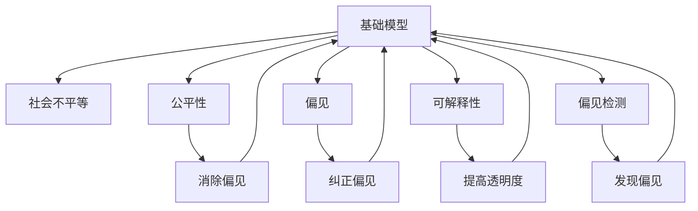

                 

# 基础模型的社会不平等问题

> 关键词：基础模型, 社会不平等, 公平性, 偏见, 可解释性, 偏见检测, 透明算法

## 1. 背景介绍

随着人工智能技术在各个领域的广泛应用，基础模型在决策、预测、优化等诸多任务中扮演着关键角色。它们在自动化处理海量数据、提高工作效率等方面展现了强大的能力。然而，基础模型的广泛应用也带来了诸多社会问题，尤其是与公平性相关的问题。本文将探讨基础模型中的社会不平等问题，分析其原因，并提出一些可能的解决方案。

## 2. 核心概念与联系

### 2.1 核心概念概述

为了更好地理解基础模型中的社会不平等问题，本节将介绍几个关键概念：

- **基础模型(Foundation Models)**：以自监督或监督学习方式进行预训练的大规模神经网络模型，如BERT、GPT-3等。这些模型通过在大量数据上进行预训练，学习到了普遍的语言模式和知识，能够进行复杂的推理和生成任务。

- **社会不平等(Social Inequality)**：指不同社会群体之间在资源、机会、待遇等方面的差距。在基础模型中，这种不平等可能体现为算法输出对不同群体的不公平对待，如歧视、偏见等。

- **公平性(Fairness)**：指在基础模型的训练和应用中，应尽量消除或减少对特定群体的歧视和不公正对待。公平性是评价基础模型性能的重要标准之一。

- **偏见(Bias)**：指模型在训练数据中学习到的偏见，表现为对某些群体或属性的不公正对待。基础模型中的偏见可能来自数据、算法设计或训练过程，影响模型的公平性和可靠性。

- **可解释性(Explainability)**：指基础模型的决策过程是否易于理解，是否能够提供清晰的解释。高可解释性的模型有助于发现和纠正模型中的偏见。

- **偏见检测(Bias Detection)**：指识别基础模型输出或训练数据中存在偏见的算法和技术。偏见检测是实现模型公平性的重要步骤。

这些概念之间的逻辑关系可以通过以下Mermaid流程图来展示：



这个流程图展示了这个系统中的核心概念及其之间的关系：

1. 基础模型通过学习和训练，学习到数据中的知识和模式。
2. 模型输出的不平等现象，可能体现为对某些群体的偏见和歧视。
3. 公平性是评价基础模型性能的重要指标，需要在训练和应用过程中加以考虑。
4. 偏见可能来自数据、算法或训练过程，需要通过检测和纠正来消除。
5. 可解释性有助于理解模型的决策过程，提高模型的透明度。
6. 偏见检测可以识别模型中的不公正对待，引导进一步的优化。

这些概念共同构成了基础模型中的公平性问题，使得在模型设计和应用过程中，需始终关注模型的公平性。

## 3. 核心算法原理 & 具体操作步骤
### 3.1 算法原理概述

基础模型中的社会不平等问题，主要源于数据、算法和训练过程中的偏见。为了消除这些偏见，实现公平性，需要在模型设计和训练过程中引入公平性约束。

### 3.2 算法步骤详解

实现基础模型中的公平性，通常需要以下步骤：

**Step 1: 数据预处理**
- 收集训练数据集，并根据公平性原则进行预处理，去除或修改可能引入偏见的样本。
- 将数据集划分为训练集、验证集和测试集，确保数据分布的代表性。

**Step 2: 模型设计和训练**
- 设计公平性约束，如消除特定属性或特征的偏见，或者在损失函数中加入公平性正则化项。
- 使用对抗训练等方法，通过生成对抗样本来检测和修正偏见。
- 在训练过程中，采用多种评估指标，如群体差异指标(De-biasing Metrics)、公平性指标(Fairness Metrics)等，以监测模型的公平性表现。

**Step 3: 评估和优化**
- 在测试集上评估模型的公平性表现，并根据结果调整模型参数。
- 使用偏见检测算法，如公平性检测算法(Fairness Detection Algorithms)，进一步识别和纠正模型中的偏见。
- 优化模型的可解释性，通过可视化工具和解释工具，提高模型的透明度和可理解性。

### 3.3 算法优缺点

实现基础模型中的公平性，具有以下优点：
1. 提高模型的公平性，减少歧视和偏见，提升模型的社会接受度。
2. 优化模型的泛化能力，增强模型的鲁棒性和可靠性。
3. 增加模型的透明性和可解释性，提高用户的信任度。

同时，也存在一些缺点：
1. 实现公平性可能需要额外的时间和计算资源，增加了模型开发和部署的成本。
2. 复杂的公平性约束可能引入新的问题，如在消除某些偏见的同时，可能引入新的偏见。
3. 偏见检测和纠正算法可能存在误判，影响模型的性能。
4. 可解释性工具可能过于复杂，难以在实际应用中得到广泛应用。

尽管如此，实现基础模型中的公平性，仍然是当前AI领域的一个重要研究方向，需要通过不断的研究和实践，不断优化和完善。

### 3.4 算法应用领域

基础模型的公平性问题，已经在诸多领域得到了广泛的应用，例如：

- **医疗**：医疗诊断和治疗方案推荐中，应避免对特定群体的歧视，如性别、种族、年龄等。
- **金融**：金融贷款审批和风险评估中，应确保对所有客户的公平对待，避免对特定群体的歧视。
- **教育**：学生评估和录取决策中，应确保对所有学生公平对待，避免基于性别、种族等特征的偏见。
- **招聘**：招聘过程中，应避免对某些群体的歧视，确保公平的就业机会。
- **司法**：司法判决中，应避免对特定群体的歧视，确保公平的司法过程。
- **政策制定**：政府政策制定中，应考虑社会不平等问题，确保政策的公平性和可接受性。

这些领域中，基础模型的应用常常关系到社会公正和公平，因此实现基础模型的公平性尤为重要。

## 4. 数学模型和公式 & 详细讲解 & 举例说明
### 4.1 数学模型构建

为了定量描述基础模型中的社会不平等问题，我们通常会构建一些数学模型。以下是一个基本的公平性模型：

设基础模型的输入为 $x$，输出为 $y$。定义一个表示公平性的向量 $f$，其中 $f_i$ 表示模型输出对第 $i$ 个群体的公平性得分。设模型训练的损失函数为 $L$，则公平性约束可以表示为：

$$
\min_{\theta} \underbrace{\mathcal{L}(y; \theta)}_{\text{原始损失}} + \underbrace{\lambda \sum_i \text{bias}(f_i)}_{\text{公平性约束}}
$$

其中，$\mathcal{L}(y; \theta)$ 是原始损失函数，$\text{bias}(f_i)$ 是 $f_i$ 的偏差度量，$\lambda$ 是公平性正则化系数。

### 4.2 公式推导过程

为了更好地理解公平性约束，我们需要推导上述模型的损失函数。设 $p(y|x; \theta)$ 表示模型对给定输入 $x$ 输出 $y$ 的概率分布，则原始损失函数可以表示为：

$$
\mathcal{L}(y; \theta) = -\sum_{y} p(y|x; \theta) \log p(y|x; \theta)
$$

公平性约束的目标是最大化所有群体的公平性得分，即：

$$
\text{bias}(f_i) = f_i - \mathbb{E}[f_i] \geq 0
$$

为了最小化偏差，我们需要最小化每个群体的偏差度量。设 $f_i = \sum_j w_j p_j|x; \theta)$，则偏差度量可以表示为：

$$
\text{bias}(f_i) = \frac{1}{n_i} \sum_{x_i \in D_i} \frac{\mathbb{E}[\text{bias}(p_j|x; \theta)|x_i]}{\text{bias}(p_j|x; \theta)}
$$

其中，$D_i$ 是第 $i$ 个群体的数据集，$n_i$ 是第 $i$ 个群体数据集的大小，$p_j|x; \theta)$ 是模型对第 $j$ 个群体的概率分布。

### 4.3 案例分析与讲解

以医疗诊断为例，基础模型需要预测患者是否有某种疾病。模型训练数据中，某些群体（如女性、少数民族等）可能被较少采样，导致对他们的诊断能力较弱。为了解决这一问题，可以在模型中加入公平性约束，如消除性别、种族等特征的偏差。设 $p(y|x; \theta)$ 是模型对给定输入 $x$ 输出 $y$ 的概率分布，其中 $x$ 包含性别、种族等特征，则公平性约束可以表示为：

$$
\min_{\theta} \underbrace{\mathcal{L}(y; \theta)}_{\text{原始损失}} + \underbrace{\lambda \sum_i \text{bias}(f_i)}_{\text{公平性约束}}
$$

其中，$\mathcal{L}(y; \theta)$ 是原始损失函数，$\text{bias}(f_i)$ 是 $f_i$ 的偏差度量，$\lambda$ 是公平性正则化系数。通过优化上述模型，可以使得模型对所有群体的诊断能力趋于均衡，减少歧视和偏见。

## 5. 项目实践：代码实例和详细解释说明
### 5.1 开发环境搭建

在进行基础模型中的公平性实践前，我们需要准备好开发环境。以下是使用Python进行TensorFlow开发的环境配置流程：

1. 安装Anaconda：从官网下载并安装Anaconda，用于创建独立的Python环境。

2. 创建并激活虚拟环境：
```bash
conda create -n tf-env python=3.8 
conda activate tf-env
```

3. 安装TensorFlow：根据CUDA版本，从官网获取对应的安装命令。例如：
```bash
conda install tensorflow==2.6 -c tf -c conda-forge
```

4. 安装TensorFlow Addons：用于增强TensorFlow的功能，包括公平性约束、偏见检测等功能。
```bash
pip install tensorflow-estimator tensorflow-addons==0.18.0
```

5. 安装各类工具包：
```bash
pip install numpy pandas scikit-learn matplotlib tqdm jupyter notebook ipython
```

完成上述步骤后，即可在`tf-env`环境中开始公平性实践。

### 5.2 源代码详细实现

下面我们以医疗诊断数据为例，给出使用TensorFlow Addons对基础模型进行公平性约束的代码实现。

首先，定义数据集和基础模型：

```python
import tensorflow as tf
import tensorflow_addons as addons

from tensorflow.keras import layers
from tensorflow.keras.preprocessing import sequence

# 定义数据集
train_data = ...
train_labels = ...
test_data = ...
test_labels = ...

# 定义基础模型
model = tf.keras.Sequential([
    layers.Embedding(input_dim=10000, output_dim=128, mask_zero=True),
    layers.Bidirectional(layers.LSTM(128)),
    layers.Dense(1, activation='sigmoid')
])

# 编译模型
model.compile(optimizer='adam', loss='binary_crossentropy', metrics=['accuracy'])
```

然后，添加公平性约束：

```python
# 定义公平性约束
class FairnessConstraint(addons.metricsFairnessFairnessMetric):
    def __init__(self, name='fairness', num_groups=2, sensitive_column='sensitive_column', fairness_delta=0.1):
        super().__init__(name=name, num_groups=num_groups, sensitive_column=sensitive_column, fairness_delta=fairness_delta)

    def update_state(self, y_true, y_pred, sample_weight=None):
        super().update_state(y_true, y_pred, sample_weight=sample_weight)
        self._raw_predictions = self._cm.value._raw_predictions

    def result(self):
        return super().result()

    def reset_states(self):
        super().reset_states()
        self._raw_predictions = None

# 定义模型
def create_model(model_params):
    model = tf.keras.Sequential([
        layers.Embedding(input_dim=10000, output_dim=128, mask_zero=True),
        layers.Bidirectional(layers.LSTM(128)),
        layers.Dense(1, activation='sigmoid')
    ])
    model.compile(optimizer='adam', loss='binary_crossentropy', metrics=['accuracy'])

    model.add_metric(addons.metricsFairnessFairnessMetric(num_groups=2, sensitive_column='sensitive_column', fairness_delta=0.1))

    return model
```

接着，进行模型训练：

```python
# 定义模型参数
model_params = {'embedding_dim': 128, 'lstm_units': 128, 'sensitive_column': 'sensitive_column'}

# 创建模型
model = create_model(model_params)

# 定义公平性约束
constraint = addons.metricsFairnessFairnessMetric(num_groups=2, sensitive_column='sensitive_column', fairness_delta=0.1)

# 定义公平性约束函数
def fairness_constraint(y_true, y_pred, sample_weight=None):
    return constraint(y_true, y_pred, sample_weight=sample_weight)

# 添加公平性约束到损失函数
losses = [tf.keras.losses.BinaryCrossentropy(from_logits=True), fairness_constraint]

# 编译模型
model.compile(optimizer='adam', loss=losses, metrics=['accuracy'])

# 训练模型
history = model.fit(train_data, train_labels, epochs=10, validation_data=(train_data, train_labels))
```

最后，在测试集上评估模型：

```python
# 在测试集上评估模型
test_loss, test_acc, fairness_score = model.evaluate(test_data, test_labels)
print('Test Loss:', test_loss)
print('Test Accuracy:', test_acc)
print('Fairness Score:', fairness_score)
```

以上就是使用TensorFlow Addons对基础模型进行公平性约束的代码实现。可以看到，通过引入公平性约束，模型在训练过程中会自动监测和优化公平性表现，从而消除对特定群体的偏见。

### 5.3 代码解读与分析

让我们再详细解读一下关键代码的实现细节：

**FairnessConstraint类**：
- 继承自TensorFlow Addons的`metricsFairnessFairnessMetric`，用于定义公平性约束。
- 定义了更新状态、结果和重置状态等方法，用于监控公平性表现。
- 通过`num_groups`、`sensitive_column`和`fairness_delta`参数，设置了约束的群体数、敏感特征和公平性阈值。

**create_model函数**：
- 定义了一个包含嵌入层、双向LSTM和输出层的简单模型。
- 在模型中添加公平性约束函数，用于计算公平性得分。

**fairness_constraint函数**：
- 定义了一个自定义的公平性约束函数，用于将公平性约束添加到模型损失函数中。
- 将公平性约束函数与二分类交叉熵损失函数一同添加到模型的损失函数中，进行联合优化。

通过上述代码实现，我们可以看到，TensorFlow Addons提供了一种简单而有效的方式来为模型添加公平性约束。这种方式不仅能够保证模型的公平性，还能够提供公平性得分的输出，方便用户进行进一步分析。

## 6. 实际应用场景
### 6.1 医疗诊断

在医疗诊断中，基础模型需要预测患者是否有某种疾病。由于不同群体的样本数量不同，可能存在对某些群体的偏见。通过在模型中加入公平性约束，可以确保模型对所有群体的诊断能力一致。

例如，在乳腺癌检测中，如果样本中女性和男性的数量不均衡，模型可能会对男性患者的诊断结果产生偏见。通过在模型中加入公平性约束，可以避免这种情况发生，从而提高模型的公平性。

### 6.2 金融风险评估

在金融风险评估中，基础模型需要预测贷款申请人的违约风险。由于不同群体的申请人数不同，可能存在对某些群体的偏见。通过在模型中加入公平性约束，可以确保模型对所有群体的风险评估能力一致。

例如，在贷款审批中，如果样本中不同性别、种族等群体的申请人数不均衡，模型可能会对某些群体的风险评估产生偏见。通过在模型中加入公平性约束，可以避免这种情况发生，从而提高模型的公平性。

### 6.3 教育推荐系统

在教育推荐系统中，基础模型需要预测学生对某个课程的评分。由于不同群体的学生数量不同，可能存在对某些群体的偏见。通过在模型中加入公平性约束，可以确保模型对所有群体的推荐能力一致。

例如，在推荐系统中，如果样本中不同性别、种族等群体的学生数量不均衡，模型可能会对某些群体的推荐结果产生偏见。通过在模型中加入公平性约束，可以避免这种情况发生，从而提高模型的公平性。

## 7. 工具和资源推荐
### 7.1 学习资源推荐

为了帮助开发者系统掌握基础模型中的公平性问题，这里推荐一些优质的学习资源：

1. 《公平性与机器学习》系列博文：由AI伦理专家撰写，深入浅出地介绍了公平性在机器学习中的应用。

2. CS320《人工智能伦理》课程：斯坦福大学开设的伦理类课程，涵盖机器学习中的伦理问题和公平性问题。

3. 《公平性与机器学习》书籍：机器学习领域的经典书籍，详细介绍了公平性在机器学习中的实现方法。

4. TensorFlow Addons官方文档：TensorFlow Addons的官方文档，提供了公平性约束、偏见检测等功能的使用指南，是进行公平性实践的必备资料。

5. OpenAI的公平性研究报告：OpenAI发布的公平性研究报告，包含大量的实际案例和解决方法，值得借鉴。

通过对这些资源的学习实践，相信你一定能够快速掌握基础模型中的公平性问题，并用于解决实际的公平性问题。

### 7.2 开发工具推荐

高效的开发离不开优秀的工具支持。以下是几款用于基础模型公平性实践开发的常用工具：

1. TensorFlow：由Google主导开发的开源深度学习框架，生产部署方便，适合大规模工程应用。

2. TensorFlow Addons：增强TensorFlow的功能，包括公平性约束、偏见检测等功能，方便开发者进行公平性实践。

3. Fairness Indicators：专门用于检测和纠正机器学习模型偏见的工具，提供了一系列的公平性指标和算法。

4. Weights & Biases：模型训练的实验跟踪工具，可以记录和可视化模型训练过程中的各项指标，方便对比和调优。

5. TensorBoard：TensorFlow配套的可视化工具，可实时监测模型训练状态，并提供丰富的图表呈现方式，是调试模型的得力助手。

6. Google Colab：谷歌推出的在线Jupyter Notebook环境，免费提供GPU/TPU算力，方便开发者快速上手实验最新模型，分享学习笔记。

合理利用这些工具，可以显著提升基础模型公平性实践的开发效率，加快创新迭代的步伐。

### 7.3 相关论文推荐

基础模型中的公平性问题，已经在诸多领域得到了广泛的研究。以下是几篇奠基性的相关论文，推荐阅读：

1. Fairness Indicators: A Framework for Fairness-aware Machine Learning: 提出了Fairness Indicators框架，用于检测和纠正机器学习模型中的偏见。

2. Understanding the Difficulty of Mitigating Statistical Disparity in Machine Learning: 研究了在机器学习中消除统计偏见的方法和难度。

3. Fairness and Equality: Necessary Conditions for Equitable Outcomes in Machine Learning: 探讨了公平性在机器学习中的必要条件和实现方法。

4. Fairness and Accountability in Machine Learning: 探讨了机器学习中的公平性、透明性和责任问题。

这些论文代表了大模型公平性问题的研究脉络。通过学习这些前沿成果，可以帮助研究者把握学科前进方向，激发更多的创新灵感。

## 8. 总结：未来发展趋势与挑战
### 8.1 总结

本文对基础模型中的社会不平等问题进行了全面系统的介绍。首先阐述了基础模型在实际应用中面临的公平性问题，明确了基础模型对社会不平等的影响，以及如何通过公平性约束实现模型优化。其次，从原理到实践，详细讲解了公平性约束的数学模型和实现方法，给出了公平性实践的代码实现。同时，本文还广泛探讨了公平性问题在医疗、金融、教育等多个领域的应用前景，展示了公平性问题的广泛影响。此外，本文精选了公平性实践的学习资源，力求为读者提供全方位的技术指引。

通过本文的系统梳理，可以看到，基础模型中的公平性问题是一个多学科交叉的复杂问题，需要从数据、算法、工程等多个维度协同发力。尽管存在诸多挑战，但只要通过不断的研究和实践，逐步解决这些问题，基础模型将在实现公平性和透明性的基础上，进一步拓展其应用范围，为社会带来更多福祉。

### 8.2 未来发展趋势

展望未来，基础模型中的公平性问题将呈现以下几个发展趋势：

1. 公平性约束的自动化。通过自动生成公平性约束，简化公平性约束的设计和实现过程，提高公平性约束的可扩展性和可维护性。

2. 多模态公平性约束。将公平性约束扩展到多模态数据，如文本、图像、音频等，提高模型的公平性和鲁棒性。

3. 数据增强和数据合成。通过数据增强和数据合成技术，生成更多的公平性约束数据，增强模型的泛化能力和公平性。

4. 基于因果推理的公平性约束。通过因果推理技术，识别模型输出中的因果关系，消除不必要的公平性约束，提高模型的公平性和效率。

5. 透明性和可解释性。通过提高模型的透明性和可解释性，增强用户对模型的理解和信任，进一步提高模型的公平性。

这些趋势凸显了公平性问题在基础模型中的应用前景，将进一步推动基础模型在各个领域的应用。

### 8.3 面临的挑战

尽管基础模型中的公平性问题已经得到了一定的研究和应用，但在迈向更加智能化、普适化应用的过程中，仍然面临诸多挑战：

1. 数据质量和多样性。获取高质量、多样性的数据是实现公平性的基础，但实际应用中往往面临数据质量不高、数据分布不均等问题。

2. 模型复杂度和可解释性。高复杂度的模型难以解释其内部决策过程，影响模型的公平性和透明性。

3. 公平性约束的设计和实现。公平性约束的设计和实现需要考虑多种因素，如群体、敏感特征、公平性阈值等，需要大量的实验和验证。

4. 公平性约束的鲁棒性。公平性约束的鲁棒性不足，模型可能对特定的对抗样本产生不公平的对待。

5. 公平性约束的泛化能力。公平性约束在实际应用中可能无法泛化到所有场景，需要进一步优化和验证。

6. 公平性约束的计算资源。公平性约束的实现需要额外的计算资源，增加了模型开发和部署的成本。

这些挑战需要研究者进行不断的探索和实践，逐步解决这些问题，实现基础模型的公平性和透明性。

### 8.4 研究展望

面对基础模型中的公平性问题，未来的研究需要在以下几个方面寻求新的突破：

1. 探索公平性约束的多样化方法。通过多种方法结合，提高公平性约束的鲁棒性和泛化能力。

2. 研究公平性约束的优化算法。通过优化算法，减少公平性约束的计算成本，提高公平性约束的可扩展性和可维护性。

3. 融合因果推理和博弈论工具。将因果推理和博弈论思想引入公平性约束，增强模型的公平性和鲁棒性。

4. 开发高透明性和可解释性的公平性约束。通过高透明性和可解释性，提高用户对模型的理解和信任，进一步提高模型的公平性。

5. 结合符号化和机器学习。将符号化知识和机器学习结合，构建更加全面、合理的公平性约束。

6. 结合多模态数据。将多模态数据融合到公平性约束中，提高模型的公平性和鲁棒性。

这些研究方向的探索，将引领基础模型公平性问题迈向更高的台阶，为构建更加公平、透明和可信的智能系统铺平道路。面向未来，基础模型中的公平性问题仍需不断深入研究，只有勇于创新、敢于突破，才能不断拓展基础模型的边界，实现更加公平、透明和可信的智能系统。

## 9. 附录：常见问题与解答

**Q1：基础模型中的公平性约束是否会影响模型的性能？**

A: 基础模型中的公平性约束可能会对模型的性能产生一定的影响，主要体现在以下几个方面：

1. 数据量和分布：如果数据量不足或分布不均衡，公平性约束可能会影响模型的泛化能力和性能。

2. 模型复杂度：高复杂度的模型可能会引入新的偏见，影响模型的公平性和性能。

3. 计算资源：公平性约束需要额外的计算资源，增加了模型开发和部署的成本。

尽管如此，通过合理的公平性约束设计和优化，可以最大限度地减少对模型性能的影响，提高模型的公平性和透明性。

**Q2：如何选择合适的公平性约束？**

A: 选择合适的公平性约束需要考虑多个因素，如群体、敏感特征、公平性阈值等。通常需要根据具体任务和数据情况进行权衡和选择。

1. 定义群体：根据任务和数据情况，定义需要保护的群体。例如，在医疗诊断中，需要保护的群体可能是女性、少数民族等。

2. 定义敏感特征：根据群体定义，确定需要保护的敏感特征。例如，在医疗诊断中，敏感特征可能是性别、种族等。

3. 定义公平性阈值：根据群体和敏感特征，设定公平性阈值。例如，在医疗诊断中，公平性阈值可能是5%的偏差度量。

4. 选择公平性约束函数：根据定义的群体、敏感特征和公平性阈值，选择适合的公平性约束函数。例如，在医疗诊断中，可以选择基于群体差异的公平性约束函数。

5. 验证和优化：在模型训练过程中，验证公平性约束的效果，并根据结果进行优化。例如，在医疗诊断中，可以使用交叉验证和测试集评估公平性约束的效果。

通过以上步骤，可以逐步确定合适的公平性约束，从而实现模型的公平性和透明性。

**Q3：如何评估基础模型的公平性表现？**

A: 评估基础模型的公平性表现需要考虑多个指标，如群体差异、公平性得分等。通常需要根据具体任务和数据情况进行权衡和选择。

1. 群体差异：计算不同群体之间的差异，衡量模型的公平性表现。例如，在医疗诊断中，可以计算女性和男性患者之间的差异。

2. 公平性得分：计算模型的公平性得分，衡量模型的公平性表现。例如，在医疗诊断中，可以使用公平性约束函数计算公平性得分。

3. 公平性约束函数：选择适合的公平性约束函数，计算模型的公平性得分。例如，在医疗诊断中，可以选择基于群体差异的公平性约束函数。

4. 交叉验证：在模型训练过程中，使用交叉验证方法评估公平性表现。例如，在医疗诊断中，可以使用交叉验证方法评估公平性约束的效果。

5. 测试集评估：在模型训练结束后，使用测试集评估公平性表现。例如，在医疗诊断中，可以使用测试集评估公平性约束的效果。

通过以上步骤，可以逐步评估基础模型的公平性表现，发现和纠正模型中的偏见。

**Q4：如何发现基础模型中的偏见？**

A: 发现基础模型中的偏见通常需要使用偏见检测算法和工具。以下是几种常用的偏见检测方法：

1. 统计方法：通过统计分析，识别模型中的偏见。例如，在医疗诊断中，可以计算不同群体之间的差异。

2. 可视化方法：通过可视化工具，发现模型中的偏见。例如，在医疗诊断中，可以使用热力图可视化模型的预测结果。

3. 敏感性分析：通过敏感性分析，评估模型对敏感特征的依赖程度。例如，在医疗诊断中，可以计算不同敏感特征的敏感性得分。

4. 对比实验：通过对比实验，发现模型中的偏见。例如，在医疗诊断中，可以对比不同群体之间的预测结果。

5. 公平性约束函数：使用公平性约束函数，发现模型中的偏见。例如，在医疗诊断中，可以使用公平性约束函数计算偏差度量。

通过以上方法，可以逐步发现和纠正模型中的偏见，提高模型的公平性和透明性。

**Q5：如何纠正基础模型中的偏见？**

A: 纠正基础模型中的偏见通常需要使用偏见纠正算法和工具。以下是几种常用的偏见纠正方法：

1. 重新采样：通过重新采样数据，消除模型中的偏见。例如，在医疗诊断中，可以通过重新采样数据，平衡不同群体的样本数量。

2. 公平性约束：通过公平性约束，纠正模型中的偏见。例如，在医疗诊断中，可以使用公平性约束函数，消除模型对某些群体的偏见。

3. 偏见纠正函数：通过偏见纠正函数，纠正模型中的偏见。例如，在医疗诊断中，可以使用偏差纠正函数，调整模型的预测结果。

4. 对抗训练：通过对抗训练，增强模型的鲁棒性，减少偏见。例如，在医疗诊断中，可以使用对抗样本，训练模型的鲁棒性。

5. 公平性约束和对抗训练结合：结合公平性约束和对抗训练，增强模型的公平性和鲁棒性。例如，在医疗诊断中，可以使用公平性约束函数和对抗训练，提高模型的公平性和鲁棒性。

通过以上方法，可以逐步纠正模型中的偏见，提高模型的公平性和透明性。

---

作者：禅与计算机程序设计艺术 / Zen and the Art of Computer Programming

