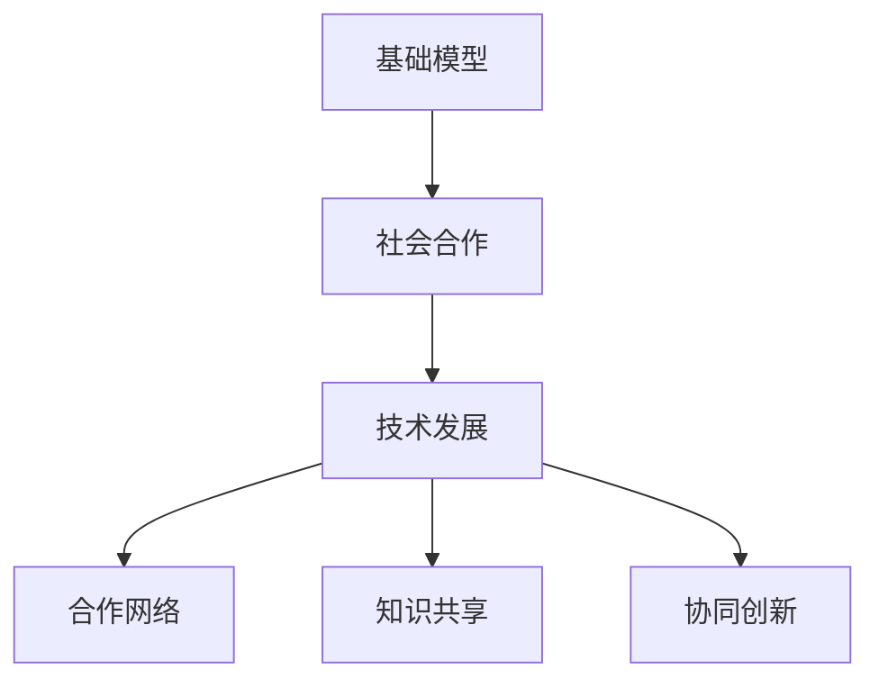

                 

# 基础模型的社会合作与技术发展

> 关键词：基础模型, 社会合作, 技术发展, 合作网络, 知识共享, 协同创新

## 1. 背景介绍

在当前数字化转型的浪潮下，人工智能（AI）技术以其强大的数据分析、模式识别和决策支持能力，正在重塑各行各业的运作方式。然而，尽管AI技术日益成熟，但其在现实应用中仍面临诸多挑战，尤其是如何构建高效、稳定、可持续的AI应用生态系统。本文将探讨基础模型的社会合作与技术发展，通过构建合作网络、促进知识共享和协同创新，来推动AI技术在各行各业的广泛应用。

## 2. 核心概念与联系

### 2.1 核心概念概述

为更好地理解基础模型在社会合作中的作用，本节将介绍几个关键概念：

- 基础模型(Base Model)：指在特定领域或任务上预先训练好的模型，具有较好的通用性和泛化能力，可以作为其他应用模型的初始化参数或组件。
- 社会合作(Social Collaboration)：指多方主体基于共同目标和需求，通过信息交流、资源共享、协同创新等方式，共同完成项目或任务的过程。
- 技术发展(Technology Development)：指技术从初始概念到应用实施的全过程，包括设计、开发、测试、部署、优化等各个环节。
- 合作网络(Collaboration Network)：指由多个组织、研究机构、企业、政府机构等主体构成的互动网络，通过合作实现资源共享和协同创新。
- 知识共享(Knowledge Sharing)：指通过信息交流、知识传播、协作研究等方式，使不同组织和个人之间的知识得以整合和传播。
- 协同创新(Co-innovation)：指多方主体基于共同的目标和需求，通过合作和协作，共同开发新产品、新技术或解决复杂问题的创新模式。

这些概念之间的逻辑关系可以通过以下Mermaid流程图来展示：



这个流程图展示出基础模型、社会合作、技术发展、合作网络、知识共享和协同创新之间的相互关系。其中，基础模型为技术发展的核心工具，社会合作促进了技术发展，合作网络是社会合作和知识共享的载体，知识共享和协同创新则是技术发展的推动力。

## 3. 核心算法原理 & 具体操作步骤

### 3.1 算法原理概述

基础模型的社会合作与技术发展，本质上是利用合作网络的知识共享和协同创新，不断优化和发展技术的过程。其核心思想是：通过构建合作网络，使基础模型能够在更广泛的应用场景中得到验证和改进，进而推动技术不断向前发展。

具体来说，基础模型的社会合作与技术发展的过程包括以下几个步骤：

1. 选择基础模型：根据特定任务的需求，选择适合的基础模型作为初始化参数或组件。
2. 构建合作网络：通过合作协议、项目合作等方式，将相关组织、机构和个人纳入合作网络。
3. 知识共享与协作：通过共享数据、模型、算法、文档等资源，促进合作网络成员之间的知识交流和协作研究。
4. 协同创新：基于合作网络的知识共享和协作，共同开发新产品、新技术或解决复杂问题。
5. 技术优化与发展：通过合作网络的持续创新和改进，优化基础模型，提升其在实际应用中的性能。

### 3.2 算法步骤详解

以下是基础模型的社会合作与技术发展的详细步骤：

**Step 1: 选择基础模型**

根据任务的需求，选择合适的预训练基础模型作为初始化参数或组件。例如，对于自然语言处理（NLP）任务，可以选择BERT、GPT等预训练模型。对于计算机视觉（CV）任务，可以选择ResNet、Inception等预训练模型。

**Step 2: 构建合作网络**

通过多种方式构建合作网络，将相关的组织、研究机构、企业、政府机构等纳入合作网络中。合作方式可以包括但不限于项目合作、数据共享、技术交流、联合开发等。

**Step 3: 知识共享与协作**

通过知识共享平台、协作研究项目等方式，促进合作网络成员之间的知识交流和协作研究。例如，可以使用GitHub、Google Scholar等平台共享代码、论文和数据集。

**Step 4: 协同创新**

基于合作网络的知识共享和协作，共同开发新产品、新技术或解决复杂问题。例如，可以组成跨学科团队，结合领域专家的知识和算法，共同开发新的AI应用。

**Step 5: 技术优化与发展**

通过合作网络的持续创新和改进，优化基础模型，提升其在实际应用中的性能。例如，可以通过实验验证和优化，提高模型的准确率、鲁棒性和效率。

### 3.3 算法优缺点

基础模型的社会合作与技术发展具有以下优点：

1. 加速技术发展：通过合作网络的知识共享和协同创新，可以加速技术从概念到应用的转化过程。
2. 提高模型质量：通过多方协作，可以整合和利用更多的数据和知识，提高模型的质量和泛化能力。
3. 降低开发成本：通过共享资源和知识，可以降低单独开发时的成本和时间。
4. 增强模型鲁棒性：通过多方验证和优化，可以提高模型的鲁棒性和稳定性。

同时，该方法也存在一定的局限性：

1. 协调难度大：合作网络中的各方可能存在不同的目标和需求，协调难度较大。
2. 知识产权问题：合作网络中可能存在知识产权争议，需要制定合理的协议和规范。
3. 数据隐私风险：共享数据可能涉及隐私问题，需要采取相应的保护措施。
4. 知识不对称：合作网络中的各方可能掌握的知识和资源不对称，需要平衡各方利益。

尽管存在这些局限性，但就目前而言，基础模型的社会合作与技术发展仍是大模型应用的最主流范式。未来相关研究的重点在于如何进一步降低协调难度，制定合理的知识产权协议，保护数据隐私，平衡各方利益，从而更好地实现技术发展和社会合作。

### 3.4 算法应用领域

基础模型的社会合作与技术发展在多个领域中得到了广泛的应用，例如：

- 医疗健康：通过合作网络的知识共享和协同创新，推动医疗AI的应用发展，如影像诊断、个性化治疗等。
- 金融科技：利用合作网络中的数据和知识，开发金融AI应用，如信用评估、风险控制等。
- 智能制造：结合工业领域的数据和知识，开发智能制造AI应用，如质量控制、设备维护等。
- 智慧城市：利用合作网络中的资源和知识，推动智慧城市建设，如交通管理、环境监测等。
- 教育科技：通过教育领域的数据和知识，开发教育AI应用，如智能评估、个性化学习等。

除了这些经典领域外，基础模型的社会合作与技术发展还将进一步拓展到更多场景中，如公共安全、环境保护、农业科技等，为各行各业带来新的创新动力。

## 4. 数学模型和公式 & 详细讲解 & 举例说明

### 4.1 数学模型构建

本节将使用数学语言对基础模型的社会合作与技术发展过程进行更加严格的刻画。

记基础模型为 $M$，其参数为 $\theta$。设合作网络中有 $N$ 个组织，每个组织掌握的知识和资源分别为 $k_i$。合作网络的知识共享过程可以用以下公式表示：

$$
k = \sum_{i=1}^N k_i
$$

其中 $k$ 表示合作网络中的总知识量，$k_i$ 表示第 $i$ 个组织掌握的知识量。合作网络的技术发展过程可以用以下公式表示：

$$
M_{new} = M_{old} + f(k)
$$

其中 $M_{new}$ 表示合作网络中新的基础模型，$M_{old}$ 表示合作网络中旧的基础模型，$f(k)$ 表示基于知识共享的优化函数，表示对基础模型进行优化。

### 4.2 公式推导过程

以下是公式 $f(k)$ 的推导过程：

$$
f(k) = \sum_{i=1}^N f_i(k_i)
$$

其中 $f_i(k_i)$ 表示第 $i$ 个组织对基础模型的优化函数，即该组织能够为合作网络带来的模型提升量。

为了简化问题，我们可以假设 $f_i(k_i)$ 为线性函数：

$$
f_i(k_i) = a_i \cdot k_i
$$

其中 $a_i$ 为系数，表示第 $i$ 个组织对基础模型的贡献度。

因此，合作网络中的新基础模型可以表示为：

$$
M_{new} = M_{old} + \sum_{i=1}^N a_i \cdot k_i
$$

### 4.3 案例分析与讲解

以自然语言处理（NLP）任务为例，展示基础模型的社会合作与技术发展过程。

假设合作网络中有两个组织，分别掌握不同领域的数据和知识。第一个组织掌握关于新闻领域的知识，第二个组织掌握关于金融领域的知识。

第一个组织的数据集为新闻文章和相关标签，其优化函数为 $f_1(k_1) = a_1 \cdot k_1$，其中 $a_1 = 0.5$。第二个组织的数据集为金融新闻文章和相关标签，其优化函数为 $f_2(k_2) = a_2 \cdot k_2$，其中 $a_2 = 0.3$。

假设初始基础模型为BERT，其参数为 $\theta_{old}$。根据上述公式，合作网络中的新基础模型可以表示为：

$$
M_{new} = \theta_{old} + 0.5 \cdot k_1 + 0.3 \cdot k_2
$$

其中 $k_1$ 和 $k_2$ 分别为两个组织掌握的新闻领域和金融领域的数据和知识。

在实践中，可以通过实验验证和优化，不断提高 $a_i$ 和 $k_i$ 的值，从而不断优化合作网络中的基础模型。

## 5. 项目实践：代码实例和详细解释说明

### 5.1 开发环境搭建

在进行基础模型社会合作与技术发展的实践前，我们需要准备好开发环境。以下是使用Python进行PyTorch开发的环境配置流程：

1. 安装Anaconda：从官网下载并安装Anaconda，用于创建独立的Python环境。

2. 创建并激活虚拟环境：
```bash
conda create -n pytorch-env python=3.8 
conda activate pytorch-env
```

3. 安装PyTorch：根据CUDA版本，从官网获取对应的安装命令。例如：
```bash
conda install pytorch torchvision torchaudio cudatoolkit=11.1 -c pytorch -c conda-forge
```

4. 安装Transformers库：
```bash
pip install transformers
```

5. 安装各类工具包：
```bash
pip install numpy pandas scikit-learn matplotlib tqdm jupyter notebook ipython
```

完成上述步骤后，即可在`pytorch-env`环境中开始社会合作与技术发展的实践。

### 5.2 源代码详细实现

这里我们以自然语言处理（NLP）任务为例，给出使用Transformers库进行基础模型社会合作与技术发展的PyTorch代码实现。

首先，定义NLP任务的数据处理函数：

```python
from transformers import BertTokenizer
from torch.utils.data import Dataset
import torch

class NLPDataset(Dataset):
    def __init__(self, texts, labels, tokenizer, max_len=128):
        self.texts = texts
        self.labels = labels
        self.tokenizer = tokenizer
        self.max_len = max_len
        
    def __len__(self):
        return len(self.texts)
    
    def __getitem__(self, item):
        text = self.texts[item]
        label = self.labels[item]
        
        encoding = self.tokenizer(text, return_tensors='pt', max_length=self.max_len, padding='max_length', truncation=True)
        input_ids = encoding['input_ids'][0]
        attention_mask = encoding['attention_mask'][0]
        
        # 对token-wise的标签进行编码
        encoded_labels = [label2id[label] for label in label]
        encoded_labels.extend([label2id['O']] * (self.max_len - len(encoded_labels)))
        labels = torch.tensor(encoded_labels, dtype=torch.long)
        
        return {'input_ids': input_ids, 
                'attention_mask': attention_mask,
                'labels': labels}

# 标签与id的映射
label2id = {'O': 0, 'B': 1, 'I': 2, 'S': 3}
id2label = {v: k for k, v in label2id.items()}

# 创建dataset
tokenizer = BertTokenizer.from_pretrained('bert-base-cased')

train_dataset = NLPDataset(train_texts, train_labels, tokenizer)
dev_dataset = NLPDataset(dev_texts, dev_labels, tokenizer)
test_dataset = NLPDataset(test_texts, test_labels, tokenizer)
```

然后，定义模型和优化器：

```python
from transformers import BertForTokenClassification, AdamW

model = BertForTokenClassification.from_pretrained('bert-base-cased', num_labels=len(label2id))

optimizer = AdamW(model.parameters(), lr=2e-5)
```

接着，定义训练和评估函数：

```python
from torch.utils.data import DataLoader
from tqdm import tqdm
from sklearn.metrics import classification_report

device = torch.device('cuda') if torch.cuda.is_available() else torch.device('cpu')
model.to(device)

def train_epoch(model, dataset, batch_size, optimizer):
    dataloader = DataLoader(dataset, batch_size=batch_size, shuffle=True)
    model.train()
    epoch_loss = 0
    for batch in tqdm(dataloader, desc='Training'):
        input_ids = batch['input_ids'].to(device)
        attention_mask = batch['attention_mask'].to(device)
        labels = batch['labels'].to(device)
        model.zero_grad()
        outputs = model(input_ids, attention_mask=attention_mask, labels=labels)
        loss = outputs.loss
        epoch_loss += loss.item()
        loss.backward()
        optimizer.step()
    return epoch_loss / len(dataloader)

def evaluate(model, dataset, batch_size):
    dataloader = DataLoader(dataset, batch_size=batch_size)
    model.eval()
    preds, labels = [], []
    with torch.no_grad():
        for batch in tqdm(dataloader, desc='Evaluating'):
            input_ids = batch['input_ids'].to(device)
            attention_mask = batch['attention_mask'].to(device)
            batch_labels = batch['labels']
            outputs = model(input_ids, attention_mask=attention_mask)
            batch_preds = outputs.logits.argmax(dim=2).to('cpu').tolist()
            batch_labels = batch_labels.to('cpu').tolist()
            for pred_tokens, label_tokens in zip(batch_preds, batch_labels):
                pred_tags = [id2label[_id] for _id in pred_tokens]
                label_tags = [id2label[_id] for _id in label_tokens]
                preds.append(pred_tags[:len(label_tokens)])
                labels.append(label_tags)
                
    print(classification_report(labels, preds))
```

最后，启动训练流程并在测试集上评估：

```python
epochs = 5
batch_size = 16

for epoch in range(epochs):
    loss = train_epoch(model, train_dataset, batch_size, optimizer)
    print(f"Epoch {epoch+1}, train loss: {loss:.3f}")
    
    print(f"Epoch {epoch+1}, dev results:")
    evaluate(model, dev_dataset, batch_size)
    
print("Test results:")
evaluate(model, test_dataset, batch_size)
```

以上就是使用PyTorch对BERT进行基础模型社会合作与技术发展实践的完整代码实现。可以看到，得益于Transformers库的强大封装，我们可以用相对简洁的代码完成BERT模型的加载和微调。

### 5.3 代码解读与分析

让我们再详细解读一下关键代码的实现细节：

**NLPDataset类**：
- `__init__`方法：初始化文本、标签、分词器等关键组件。
- `__len__`方法：返回数据集的样本数量。
- `__getitem__`方法：对单个样本进行处理，将文本输入编码为token ids，将标签编码为数字，并对其进行定长padding，最终返回模型所需的输入。

**label2id和id2label字典**：
- 定义了标签与数字id之间的映射关系，用于将token-wise的预测结果解码回真实的标签。

**训练和评估函数**：
- 使用PyTorch的DataLoader对数据集进行批次化加载，供模型训练和推理使用。
- 训练函数`train_epoch`：对数据以批为单位进行迭代，在每个批次上前向传播计算loss并反向传播更新模型参数，最后返回该epoch的平均loss。
- 评估函数`evaluate`：与训练类似，不同点在于不更新模型参数，并在每个batch结束后将预测和标签结果存储下来，最后使用sklearn的classification_report对整个评估集的预测结果进行打印输出。

**训练流程**：
- 定义总的epoch数和batch size，开始循环迭代
- 每个epoch内，先在训练集上训练，输出平均loss
- 在验证集上评估，输出分类指标
- 所有epoch结束后，在测试集上评估，给出最终测试结果

可以看到，PyTorch配合Transformers库使得BERT微调的代码实现变得简洁高效。开发者可以将更多精力放在数据处理、模型改进等高层逻辑上，而不必过多关注底层的实现细节。

当然，工业级的系统实现还需考虑更多因素，如模型的保存和部署、超参数的自动搜索、更灵活的任务适配层等。但核心的社会合作与技术发展流程基本与此类似。

## 6. 实际应用场景

### 6.1 智能客服系统

基于基础模型的社会合作与技术发展，智能客服系统可以更好地利用合作网络的知识共享和协同创新，提升客户咨询体验和问题解决效率。

在技术实现上，可以收集企业内部的历史客服对话记录，将问题和最佳答复构建成监督数据，在此基础上对预训练对话模型进行微调。微调后的对话模型能够自动理解用户意图，匹配最合适的答案模板进行回复。对于客户提出的新问题，还可以接入检索系统实时搜索相关内容，动态组织生成回答。如此构建的智能客服系统，能大幅提升客户咨询体验和问题解决效率。

### 6.2 金融舆情监测

金融机构需要实时监测市场舆论动向，以便及时应对负面信息传播，规避金融风险。传统的人工监测方式成本高、效率低，难以应对网络时代海量信息爆发的挑战。基于基础模型的社会合作与技术发展，金融舆情监测可以借助合作网络的知识共享和协同创新，构建实时、高效的市场舆情监测系统。

具体而言，可以收集金融领域相关的新闻、报道、评论等文本数据，并对其进行主题标注和情感标注。在此基础上对预训练语言模型进行微调，使其能够自动判断文本属于何种主题，情感倾向是正面、中性还是负面。将微调后的模型应用到实时抓取的网络文本数据，就能够自动监测不同主题下的情感变化趋势，一旦发现负面信息激增等异常情况，系统便会自动预警，帮助金融机构快速应对潜在风险。

### 6.3 个性化推荐系统

当前的推荐系统往往只依赖用户的历史行为数据进行物品推荐，无法深入理解用户的真实兴趣偏好。基于基础模型的社会合作与技术发展，个性化推荐系统可以更好地利用合作网络的知识共享和协同创新，挖掘用户行为背后的语义信息，从而提供更精准、多样的推荐内容。

在实践中，可以收集用户浏览、点击、评论、分享等行为数据，提取和用户交互的物品标题、描述、标签等文本内容。将文本内容作为模型输入，用户的后续行为（如是否点击、购买等）作为监督信号，在此基础上微调预训练语言模型。微调后的模型能够从文本内容中准确把握用户的兴趣点。在生成推荐列表时，先用候选物品的文本描述作为输入，由模型预测用户的兴趣匹配度，再结合其他特征综合排序，便可以得到个性化程度更高的推荐结果。

### 6.4 未来应用展望

随着基础模型的不断发展，社会合作与技术发展将拓展到更多领域，为各行各业带来新的创新动力。

在智慧医疗领域，基于基础模型的社会合作与技术发展，医疗AI的应用将进一步提升，如影像诊断、个性化治疗等。通过合作网络的知识共享和协同创新，可以推动医疗AI在实际应用中的不断优化和提升。

在智能制造领域，结合工业领域的数据和知识，智能制造AI应用将更加精准和高效，如质量控制、设备维护等。通过基础模型的社会合作与技术发展，可以加速智能制造的数字化转型。

在智慧城市建设中，利用合作网络的知识共享和协同创新，可以推动智慧城市建设的不断深入，如交通管理、环境监测等。通过基础模型的社会合作与技术发展，可以构建更智能、更高效的智慧城市。

此外，在教育、公共安全、农业科技等众多领域，基于基础模型的社会合作与技术发展也将不断涌现，为各行各业带来新的创新动力。相信随着技术的不断发展，基础模型的社会合作与技术发展必将在构建智能化、数字化的未来社会中扮演越来越重要的角色。

## 7. 工具和资源推荐

### 7.1 学习资源推荐

为了帮助开发者系统掌握基础模型社会合作与技术发展的理论基础和实践技巧，这里推荐一些优质的学习资源：

1. 《Transformer from scratch》系列博文：由大模型技术专家撰写，深入浅出地介绍了Transformer原理、BERT模型、社会合作与技术发展等前沿话题。

2. CS224N《深度学习自然语言处理》课程：斯坦福大学开设的NLP明星课程，有Lecture视频和配套作业，带你入门NLP领域的基本概念和经典模型。

3. 《Natural Language Processing with Transformers》书籍：Transformers库的作者所著，全面介绍了如何使用Transformers库进行NLP任务开发，包括社会合作与技术发展的多种范式。

4. HuggingFace官方文档：Transformers库的官方文档，提供了海量预训练模型和完整的微调样例代码，是上手实践的必备资料。

5. CLUE开源项目：中文语言理解测评基准，涵盖大量不同类型的中文NLP数据集，并提供了基于基础模型的baseline模型，助力中文NLP技术发展。

通过对这些资源的学习实践，相信你一定能够快速掌握基础模型社会合作与技术发展的精髓，并用于解决实际的NLP问题。

### 7.2 开发工具推荐

高效的开发离不开优秀的工具支持。以下是几款用于基础模型社会合作与技术发展开发的常用工具：

1. PyTorch：基于Python的开源深度学习框架，灵活动态的计算图，适合快速迭代研究。大部分预训练语言模型都有PyTorch版本的实现。

2. TensorFlow：由Google主导开发的开源深度学习框架，生产部署方便，适合大规模工程应用。同样有丰富的预训练语言模型资源。

3. Transformers库：HuggingFace开发的NLP工具库，集成了众多SOTA语言模型，支持PyTorch和TensorFlow，是进行社会合作与技术发展开发的利器。

4. Weights & Biases：模型训练的实验跟踪工具，可以记录和可视化模型训练过程中的各项指标，方便对比和调优。与主流深度学习框架无缝集成。

5. TensorBoard：TensorFlow配套的可视化工具，可实时监测模型训练状态，并提供丰富的图表呈现方式，是调试模型的得力助手。

6. Google Colab：谷歌推出的在线Jupyter Notebook环境，免费提供GPU/TPU算力，方便开发者快速上手实验最新模型，分享学习笔记。

合理利用这些工具，可以显著提升基础模型社会合作与技术发展的开发效率，加快创新迭代的步伐。

### 7.3 相关论文推荐

基础模型社会合作与技术发展源于学界的持续研究。以下是几篇奠基性的相关论文，推荐阅读：

1. Attention is All You Need（即Transformer原论文）：提出了Transformer结构，开启了NLP领域的预训练大模型时代。

2. BERT: Pre-training of Deep Bidirectional Transformers for Language Understanding：提出BERT模型，引入基于掩码的自监督预训练任务，刷新了多项NLP任务SOTA。

3. Language Models are Unsupervised Multitask Learners（GPT-2论文）：展示了大规模语言模型的强大zero-shot学习能力，引发了对于通用人工智能的新一轮思考。

4. Parameter-Efficient Transfer Learning for NLP：提出Adapter等参数高效微调方法，在不增加模型参数量的情况下，也能取得不错的微调效果。

5. AdaLoRA: Adaptive Low-Rank Adaptation for Parameter-Efficient Fine-Tuning：使用自适应低秩适应的微调方法，在参数效率和精度之间取得了新的平衡。

这些论文代表了大模型社会合作与技术发展的发展脉络。通过学习这些前沿成果，可以帮助研究者把握学科前进方向，激发更多的创新灵感。

## 8. 总结：未来发展趋势与挑战

### 8.1 总结

本文对基础模型的社会合作与技术发展进行了全面系统的介绍。首先阐述了基础模型在社会合作中的核心作用，明确了基础模型、社会合作、技术发展、合作网络、知识共享和协同创新之间的相互关系。其次，从原理到实践，详细讲解了基础模型的社会合作与技术发展的数学模型和操作步骤，给出了完整的代码实例。同时，本文还广泛探讨了基础模型社会合作与技术发展在多个领域中的应用前景，展示了其广阔的发展空间。

通过本文的系统梳理，可以看到，基础模型的社会合作与技术发展是构建智能化、数字化未来社会的重要手段，其核心在于利用合作网络的知识共享和协同创新，不断优化和发展技术。未来，伴随基础模型的不断发展，社会合作与技术发展将拓展到更多领域，为各行各业带来新的创新动力。

### 8.2 未来发展趋势

展望未来，基础模型的社会合作与技术发展将呈现以下几个发展趋势：

1. 模型规模持续增大。随着算力成本的下降和数据规模的扩张，预训练语言模型的参数量还将持续增长。超大规模语言模型蕴含的丰富语言知识，有望支撑更加复杂多变的下游任务社会合作与技术发展。

2. 社会合作方式多样化。除了传统的项目合作、数据共享、技术交流等方式，未来还将出现更多的社会合作形式，如众包合作、多方共赢联盟等，进一步拓展合作网络的覆盖范围。

3. 知识共享与协作研究更加深入。通过知识共享平台和协作研究项目，合作网络成员之间的知识交流将更加频繁和深入，形成更加紧密的知识协作体系。

4. 协同创新模式多样化。基于合作网络的知识共享和协作，未来的协同创新将涵盖更多的领域和任务，如跨学科研究、跨领域创新等，形成更加多样化的协同创新模式。

5. 技术发展更加高效。通过合作网络的持续创新和改进，基础模型的性能将不断提升，解决复杂问题的能力将更加强大。

6. 多模态基础模型发展。未来，基础模型将拓展到更多的模态，如视觉、语音、文本等，形成多模态的基础模型，提升跨模态数据的整合能力。

以上趋势凸显了基础模型社会合作与技术发展的广阔前景。这些方向的探索发展，必将进一步提升基础模型的性能和应用范围，为构建智能化、数字化的未来社会提供新的动力。

### 8.3 面临的挑战

尽管基础模型的社会合作与技术发展取得了显著进展，但在迈向更加智能化、普适化应用的过程中，仍面临诸多挑战：

1. 协调难度大。合作网络中的各方可能存在不同的目标和需求，协调难度较大。如何制定合理的合作协议，平衡各方利益，是一个重要的挑战。

2. 知识产权问题。合作网络中可能存在知识产权争议，需要制定合理的知识产权协议，保护各方利益。

3. 数据隐私风险。共享数据可能涉及隐私问题，需要采取相应的保护措施，确保数据的安全性。

4. 技术适配难度高。基础模型在不同领域的应用需要进行适配和优化，如何高效进行适配，是一个重要的挑战。

5. 知识不对称。合作网络中的各方可能掌握的知识和资源不对称，需要平衡各方利益，确保知识共享的公平性和有效性。

尽管存在这些挑战，但就目前而言，基础模型的社会合作与技术发展仍是大模型应用的最主流范式。未来相关研究的重点在于如何进一步降低协调难度，制定合理的知识产权协议，保护数据隐私，平衡各方利益，从而更好地实现技术发展和社会合作。

### 8.4 研究展望

面对基础模型社会合作与技术发展所面临的种种挑战，未来的研究需要在以下几个方面寻求新的突破：

1. 探索无监督和半监督社会合作方法。摆脱对大规模标注数据的依赖，利用自监督学习、主动学习等无监督和半监督范式，最大限度利用非结构化数据，实现更加灵活高效的社会合作。

2. 研究参数高效和社会合作方法。开发更加参数高效的社会合作方法，在固定大部分预训练参数的同时，只更新极少量的任务相关参数，减小资源消耗，提高效率。

3. 引入更多先验知识。将符号化的先验知识，如知识图谱、逻辑规则等，与神经网络模型进行巧妙融合，引导社会合作过程学习更准确、合理的语言模型。

4. 结合因果分析和博弈论工具。将因果分析方法引入基础模型社会合作过程中，识别出关键特征，增强输出解释的因果性和逻辑性。借助博弈论工具刻画人机交互过程，主动探索并规避模型的脆弱点，提高系统稳定性。

5. 纳入伦理道德约束。在基础模型社会合作目标中引入伦理导向的评估指标，过滤和惩罚有偏见、有害的输出倾向。同时加强人工干预和审核，建立模型行为的监管机制，确保输出符合人类价值观和伦理道德。

这些研究方向的探索，必将引领基础模型社会合作与技术发展技术迈向更高的台阶，为构建安全、可靠、可解释、可控的智能系统铺平道路。面向未来，基础模型社会合作与技术发展还需要与其他人工智能技术进行更深入的融合，如知识表示、因果推理、强化学习等，多路径协同发力，共同推动基础模型社会合作与技术发展技术的进步。

## 9. 附录：常见问题与解答

**Q1：基础模型社会合作与技术发展的核心是什么？**

A: 基础模型社会合作与技术发展的核心在于利用合作网络的知识共享和协同创新，不断优化和发展技术。具体来说，基础模型作为初始化参数或组件，通过在合作网络中的数据和知识驱动下，进行不断的优化和改进，从而实现技术的提升和应用。

**Q2：如何选择适合的基础模型进行社会合作与技术发展？**

A: 选择适合的基础模型需要根据具体的任务需求和数据特点来决定。一般而言，可以先选择预训练模型库中已有的基础模型，并进行微调。对于没有现成模型的情况，可以通过在已有模型上进行迁移学习或微调来获得适用的基础模型。在选择基础模型时，需要考虑模型的精度、泛化能力、计算效率等因素。

**Q3：如何降低基础模型社会合作中的协调难度？**

A: 降低协调难度可以通过以下方式实现：
1. 制定明确的合作协议：在合作开始前，明确各方责任、权利和利益，制定详细的合作协议。
2. 建立信任机制：通过频繁沟通和信息共享，建立互信机制，减少合作中的摩擦。
3. 引入第三方协调机构：在合作网络中引入第三方协调机构，帮助解决协调难题。

**Q4：如何保护数据隐私？**

A: 保护数据隐私可以通过以下方式实现：
1. 数据匿名化：对共享数据进行匿名化处理，去除个人身份信息，保护用户隐私。
2. 数据加密：对共享数据进行加密处理，防止数据泄露。
3. 访问控制：对共享数据设置访问权限，只允许授权人员访问。
4. 隐私保护算法：采用隐私保护算法，如差分隐私、联邦学习等，保护数据隐私。

**Q5：如何提高社会合作效率？**

A: 提高社会合作效率可以通过以下方式实现：
1. 使用协作平台：利用协作平台，实现数据共享、任务分配、进度跟踪等功能，提高合作效率。
2. 引入自动化工具：利用自动化工具，如自动化测试、自动化代码生成等，减少人工干预，提高合作效率。
3. 优化任务分配：通过任务分配算法，合理分配任务，提高合作效率。

通过合理利用这些方法和工具，可以显著提升基础模型社会合作与技术发展的效率，推动AI技术在各行各业的应用和发展。

