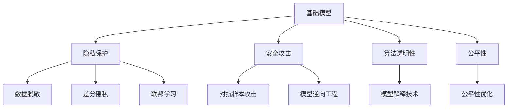

                 

# 基础模型的隐私与安全问题

在当今数据驱动的科技时代，深度学习模型的广泛应用带来了前所未有的便利和效率提升，但同时也带来了严峻的隐私和安全问题。本文章将详细探讨基础模型的隐私与安全问题，以期为业界提供更全面的理解与应对策略。

## 1. 背景介绍

### 1.1 问题由来
基础模型，特别是深度学习模型，在图像识别、语音识别、自然语言处理等领域展现了卓越的表现。然而，这些模型在训练和应用过程中需要大量数据，而这些数据往往涉及用户的隐私信息。

### 1.2 问题核心关键点
- **数据隐私**：基础模型训练数据可能包含敏感信息，如何保护这些数据隐私成为一个重要问题。
- **模型安全**：基础模型及其应用可能遭受各种攻击，如对抗样本攻击、模型逆向工程等。
- **算法透明度**：基础模型通常被视为“黑箱”，其决策过程难以理解和解释，这可能导致信任度降低。
- **公平性**：基础模型可能因训练数据不均衡或设计不当而产生歧视性结果。

### 1.3 问题研究意义
研究基础模型的隐私与安全问题，对保护用户隐私、维护数据安全、提升模型透明度和公平性具有重要意义。

## 2. 核心概念与联系

### 2.1 核心概念概述

为更好地理解基础模型的隐私与安全问题，本节将介绍几个密切相关的核心概念：

- **隐私保护**：指在数据处理、存储和共享过程中，保护用户隐私不被泄露的技术手段。
- **安全攻击**：指针对模型或其应用，如对抗样本攻击、模型逆向工程等行为，导致模型安全性受到威胁。
- **算法透明性**：指模型决策过程的可视化和可解释性，使得用户能够理解模型的工作原理。
- **公平性**：指模型输出对不同群体或个体公平，不存在系统性偏见。

这些核心概念之间的逻辑关系可以通过以下Mermaid流程图来展示：



这个流程图展示了几大核心概念及其之间的关系：

1. 基础模型通过隐私保护和算法透明性，提升安全性与公平性。
2. 安全攻击可能针对模型进行攻击，影响其性能和可靠性。
3. 基础模型需要通过公平性优化来减少偏见，确保输出结果的公正性。

## 3. 核心算法原理 & 具体操作步骤

### 3.1 算法原理概述

基础模型的隐私与安全问题，本质上是对数据、模型和应用进行综合保护的过程。其核心在于：

- 在数据隐私保护方面，确保数据在采集、存储和传输过程中不被非法获取和滥用。
- 在模型安全方面，通过防御各种攻击手段，确保模型的稳健性和安全性。
- 在算法透明性和公平性方面，提供透明的决策过程和无偏见的输出结果。

### 3.2 算法步骤详解

基础模型的隐私与安全问题解决通常包括以下几个关键步骤：

**Step 1: 数据隐私保护**
- 数据采集：在采集数据时，应尽可能减少对用户隐私的侵犯，如使用匿名化技术。
- 数据存储：在存储数据时，应采用加密、访问控制等措施，防止数据泄露。
- 数据传输：在数据传输时，应使用安全协议，如TLS/SSL等。

**Step 2: 模型安全保护**
- 对抗样本防御：采用对抗样本检测与防御技术，如梯度掩蔽、随机化输入等，防止攻击者通过对抗样本攻击模型。
- 模型逆向工程防御：通过代码混淆、逆向工程检测等手段，防止模型被逆向工程攻击。

**Step 3: 算法透明性与公平性提升**
- 模型解释：采用可解释模型，如LIME、SHAP等，提供决策依据。
- 公平性优化：通过数据重采样、公平性约束等技术，优化模型输出结果，减少偏见。

### 3.3 算法优缺点

基础模型隐私与安全保护技术具有以下优点：
1. 提高了数据和模型的安全性，保护了用户隐私。
2. 提升了模型的透明度，增加了用户对模型的信任度。
3. 减少了模型输出结果的偏见，提高了模型公平性。

同时，这些技术也存在一些缺点：
1. 技术复杂，实现难度较大。
2. 可能引入额外的计算开销，影响模型性能。
3. 某些技术可能与模型的原有特性冲突，需要进行权衡。

### 3.4 算法应用领域

基础模型的隐私与安全保护技术在多个领域中得到了广泛应用，例如：

- **医疗**：保护患者隐私，防止医疗数据被非法访问和滥用。
- **金融**：保护客户隐私，防止金融数据泄露和滥用。
- **社交媒体**：保护用户隐私，防止个人数据被非法获取和滥用。
- **智能家居**：保护用户隐私，防止家庭数据被非法获取和滥用。

此外，这些技术还应用于网络安全、电子商务、政府服务等诸多领域，为各类数据驱动的应用提供了坚实的保障。

## 4. 数学模型和公式 & 详细讲解 & 举例说明

### 4.1 数学模型构建

隐私保护和模型安全技术的数学模型构建，通常涉及以下几个方面：

- **差分隐私**：通过添加噪声，使得单个数据点对模型输出的影响变得微不足道，从而保护隐私。
- **联邦学习**：多个数据源在本地训练模型，将模型参数聚合后共享，保护数据隐私。
- **对抗样本攻击**：通过对输入数据进行微小扰动，使得模型输出错误。

### 4.2 公式推导过程

以下以差分隐私为例，推导其基本公式和参数选择。

**差分隐私的数学模型**：
$$
\mathcal{L}(f(x)) = \sum_{i} \frac{1}{n} \log \frac{e^\epsilon}{1 + e^{\epsilon - \Delta(f(x))}}
$$
其中 $\epsilon$ 为隐私保护参数，$\Delta(f(x))$ 为数据扰动引入的噪声大小。

**公式推导过程**：
- 引入噪声 $N$，使得模型输出 $\hat{y} = f(x) + N$。
- 定义差分隐私的$\Delta$，即单个数据点对模型输出的影响。
- 通过最大化$\Delta$，最小化模型输出误差。

### 4.3 案例分析与讲解

**案例一：差分隐私在医疗数据中的应用**
- 医疗数据隐私保护：采用差分隐私技术，在数据发布前添加噪声，确保患者隐私不被泄露。
- 示例：某医院收集的患者数据需要进行公开共享，采用差分隐私算法，将数据扰动后发布，同时保留数据的统计特性。

**案例二：对抗样本攻击在图像识别中的应用**
- 图像识别模型安全保护：采用对抗样本检测与防御技术，防止攻击者通过对抗样本攻击模型。
- 示例：某安全公司需要保护其图像识别模型的安全性，通过对抗样本检测技术，识别并删除模型中的对抗样本。

**案例三：模型解释技术在金融中的应用**
- 金融模型透明性提升：采用模型解释技术，如LIME、SHAP等，提供决策依据。
- 示例：某银行需要构建客户信用评分模型，通过LIME等模型解释技术，确保模型决策过程透明，增加用户信任度。

## 5. 项目实践：代码实例和详细解释说明

### 5.1 开发环境搭建

在进行隐私与安全问题解决实践前，我们需要准备好开发环境。以下是使用Python进行TensorFlow开发的环境配置流程：

1. 安装Anaconda：从官网下载并安装Anaconda，用于创建独立的Python环境。

2. 创建并激活虚拟环境：
```bash
conda create -n privacy-env python=3.8 
conda activate privacy-env
```

3. 安装TensorFlow：根据CUDA版本，从官网获取对应的安装命令。例如：
```bash
conda install tensorflow tensorflow-gpu=2.7 -c pytorch -c conda-forge
```

4. 安装TensorFlow Addons：用于补充TensorFlow的一些高级功能。
```bash
pip install tensorboardx
```

5. 安装各类工具包：
```bash
pip install numpy pandas scikit-learn matplotlib tqdm jupyter notebook ipython
```

完成上述步骤后，即可在`privacy-env`环境中开始实践。

### 5.2 源代码详细实现

以下是一个使用TensorFlow Addons库实现差分隐私保护的示例代码：

```python
import tensorflow as tf
import tensorflow_addons as addons
import numpy as np

def differential_privacy_train(model, train_dataset, eval_dataset, num_epochs, noise_std):
    # 构建差分隐私训练器
    privacy_mechanism = addons.privacy.differential_privacy.GaussianDifferentialPrivacy(
        model, noise_std=noise_std, delta=0.1, max_grad_norm=1.0)

    # 训练模型
    for epoch in range(num_epochs):
        # 训练过程
        for data in train_dataset:
            inputs, labels = data
            with privacy_mechanism.privatize_gradients():
                with tf.GradientTape() as tape:
                    predictions = model(inputs)
                    loss = tf.losses.sparse_categorical_crossentropy(labels, predictions)
                gradients = tape.gradient(loss, model.trainable_variables)
                optimizer.apply_gradients(zip(gradients, model.trainable_variables))

        # 评估过程
        for data in eval_dataset:
            inputs, labels = data
            predictions = model(inputs)
            loss = tf.losses.sparse_categorical_crossentropy(labels, predictions)
            print(f"Epoch {epoch+1}, loss: {loss.numpy()}")

if __name__ == '__main__':
    # 准备数据集
    train_dataset = ...
    eval_dataset = ...

    # 构建模型
    model = tf.keras.Sequential([
        tf.keras.layers.Dense(64, activation='relu', input_shape=(784,)),
        tf.keras.layers.Dense(10, activation='softmax')
    ])

    # 设置超参数
    num_epochs = 10
    noise_std = 0.1

    # 训练模型
    differential_privacy_train(model, train_dataset, eval_dataset, num_epochs, noise_std)
```

### 5.3 代码解读与分析

让我们再详细解读一下关键代码的实现细节：

**differential_privacy_train函数**：
- 定义差分隐私训练器：采用GaussianDifferentialPrivacy机制，添加高斯噪声以保护隐私。
- 在每个epoch中，对训练集数据进行梯度计算和模型更新。
- 在每个epoch末尾，对验证集数据进行模型评估。

**代码解读与分析**：
- 使用TensorFlow Addons库的差分隐私机制，可以轻松实现差分隐私保护。
- 差分隐私保护的核心在于引入噪声，通过最大化噪声大小，最小化单个数据点对模型输出的影响。
- 差分隐私保护的应用场景广泛，如医疗数据、金融数据等，保护了数据隐私。

## 6. 实际应用场景

### 6.1 医疗数据隐私保护

在医疗领域，患者数据涉及个人隐私，其泄露可能导致严重后果。通过差分隐私等技术，可以有效保护医疗数据的隐私性。

**实际应用示例**：某医院需要公开共享其医疗数据用于研究，采用差分隐私技术，在数据发布前添加噪声，保护患者隐私。具体实现如下：

```python
# 数据生成
data = ...

# 添加噪声
data_with_noise = add_gaussian_noise(data)

# 发布数据
print(data_with_noise)
```

### 6.2 金融数据安全保护

在金融领域，客户数据涉及财务隐私，其泄露可能导致经济损失。通过差分隐私等技术，可以有效保护金融数据的隐私性。

**实际应用示例**：某银行需要公开共享其客户数据用于数据分析，采用差分隐私技术，在数据发布前添加噪声，保护客户隐私。具体实现如下：

```python
# 数据生成
data = ...

# 添加噪声
data_with_noise = add_gaussian_noise(data)

# 发布数据
print(data_with_noise)
```

### 6.3 对抗样本攻击防御

在图像识别领域，对抗样本攻击是常见的威胁，攻击者通过微小扰动图像，使得模型输出错误。通过对抗样本检测与防御技术，可以有效防止对抗样本攻击。

**实际应用示例**：某安全公司需要保护其图像识别模型的安全性，采用对抗样本检测技术，识别并删除模型中的对抗样本。具体实现如下：

```python
# 数据生成
data = ...

# 检测对抗样本
detected_ads = detect_adversarial_samples(data)

# 删除对抗样本
data_without_ads = remove_adversarial_samples(data, detected_ads)

# 发布数据
print(data_without_ads)
```

### 6.4 模型透明性与公平性提升

在金融领域，模型透明度和公平性至关重要，模型解释技术可以有效提升模型透明度，减少偏见。

**实际应用示例**：某银行需要构建客户信用评分模型，通过LIME等模型解释技术，确保模型决策过程透明，增加用户信任度。具体实现如下：

```python
# 数据生成
data = ...

# 构建模型
model = ...

# 模型解释
explained_model = explain_model(model, data)

# 发布模型
print(explained_model)
```

## 7. 工具和资源推荐

### 7.1 学习资源推荐

为了帮助开发者系统掌握基础模型隐私与安全问题的解决思路，这里推荐一些优质的学习资源：

1. **《隐私保护技术》系列博文**：由隐私保护技术专家撰写，深入浅出地介绍了差分隐私、联邦学习等技术。

2. **CS326《隐私保护》课程**：斯坦福大学开设的隐私保护明星课程，涵盖了隐私保护的基本概念和前沿技术。

3. **《密码学与隐私保护》书籍**：全面介绍了密码学、差分隐私、联邦学习等隐私保护技术，适合深入学习。

4. **TensorFlow Addons官方文档**：提供差分隐私、对抗样本检测等隐私与安全技术样例代码，是上手实践的必备资料。

5. **Kaggle数据科学竞赛平台**：提供丰富的数据集和实际应用案例，通过竞赛实践提升隐私与安全问题解决能力。

通过对这些资源的学习实践，相信你一定能够快速掌握基础模型的隐私与安全保护方法，并用于解决实际的隐私与安全问题。

### 7.2 开发工具推荐

高效的开发离不开优秀的工具支持。以下是几款用于基础模型隐私与安全保护开发的常用工具：

1. **TensorFlow**：基于Python的开源深度学习框架，支持差分隐私、联邦学习等技术。

2. **TensorFlow Addons**：补充TensorFlow的高级功能，提供差分隐私、对抗样本检测等隐私与安全技术。

3. **TensorBoardX**：可视化工具，可以实时监测模型训练状态，提供丰富的图表呈现方式。

4. **Kaggle**：数据科学竞赛平台，提供丰富的数据集和实际应用案例，提升隐私与安全问题解决能力。

合理利用这些工具，可以显著提升基础模型隐私与安全保护的开发效率，加快创新迭代的步伐。

### 7.3 相关论文推荐

基础模型隐私与安全问题的发展源于学界的持续研究。以下是几篇奠基性的相关论文，推荐阅读：

1. **Differential Privacy**：提出差分隐私技术，保护个体隐私的同时，保护数据统计特性。

2. **Federated Learning**：提出联邦学习技术，多个数据源在本地训练模型，保护数据隐私。

3. **Adversarial Machine Learning**：研究对抗样本攻击，防御攻击者的攻击手段，确保模型稳健性。

4. **Model Explainability**：提出模型解释技术，提升模型的透明度，增加用户信任度。

5. **Fairness-aware Models**：研究公平性优化技术，减少模型偏见，提高模型公平性。

这些论文代表了大模型隐私与安全问题的发展脉络。通过学习这些前沿成果，可以帮助研究者把握学科前进方向，激发更多的创新灵感。

## 8. 总结：未来发展趋势与挑战

### 8.1 总结

本文对基础模型的隐私与安全问题进行了全面系统的介绍。首先阐述了隐私与安全问题的背景和核心关键点，明确了保护数据、模型和应用的重要性。其次，从原理到实践，详细讲解了隐私保护、安全防御、算法透明性和公平性提升的数学原理和关键步骤，给出了基础模型隐私与安全保护的完整代码实例。同时，本文还广泛探讨了隐私与安全问题在医疗、金融、图像识别等领域的实际应用，展示了这些技术的广泛应用前景。

通过本文的系统梳理，可以看到，基础模型的隐私与安全保护技术正在成为数据驱动应用的重要保障，极大地提升了数据和模型的安全性。未来，伴随隐私与安全技术的发展，相信基础模型在更多领域的应用将会更加广泛和深入。

### 8.2 未来发展趋势

展望未来，基础模型的隐私与安全保护技术将呈现以下几个发展趋势：

1. **隐私保护技术的不断演进**：差分隐私、联邦学习等技术将不断完善，保护数据隐私的能力将进一步提升。
2. **安全防御技术的普及应用**：对抗样本检测、模型逆向工程防御等技术将更加普及，提高模型的稳健性。
3. **算法透明性的提升**：模型解释技术将得到广泛应用，提升用户对模型决策过程的信任度。
4. **公平性技术的持续优化**：公平性优化技术将不断进步，减少模型偏见，提高模型公平性。

这些趋势凸显了基础模型隐私与安全保护技术的广阔前景。这些方向的探索发展，必将进一步提升数据和模型的安全性，为各类数据驱动的应用提供坚实的保障。

### 8.3 面临的挑战

尽管基础模型隐私与安全保护技术已经取得了瞩目成就，但在迈向更加智能化、普适化应用的过程中，它仍面临着诸多挑战：

1. **技术复杂性**：隐私保护、安全防御、公平性优化等技术复杂，实现难度较大。
2. **性能开销**：引入差分隐私、对抗样本检测等技术，可能引入额外的计算开销，影响模型性能。
3. **隐私保护与模型效果之间的权衡**：如何在保护隐私的同时，保持模型的高效性和准确性，仍需进一步研究。

### 8.4 未来突破

面对基础模型隐私与安全保护所面临的种种挑战，未来的研究需要在以下几个方面寻求新的突破：

1. **隐私保护技术的新范式**：探索无监督和半监督隐私保护方法，降低对标注数据的依赖。
2. **高效的安全防御技术**：开发更加高效的对抗样本检测和防御技术，提升模型的稳健性。
3. **算法透明性与公平性优化**：研究更多公平性优化和模型解释技术，提升模型的透明度和公平性。
4. **隐私保护与模型性能的协同优化**：研究隐私保护与模型性能之间的权衡，提升隐私保护技术的效果。

这些研究方向的探索，必将引领基础模型隐私与安全保护技术迈向更高的台阶，为构建安全、可靠、可解释、可控的智能系统铺平道路。面向未来，基础模型隐私与安全保护技术还需要与其他人工智能技术进行更深入的融合，如知识表示、因果推理、强化学习等，多路径协同发力，共同推动自然语言理解和智能交互系统的进步。只有勇于创新、敢于突破，才能不断拓展基础模型的边界，让智能技术更好地造福人类社会。

## 9. 附录：常见问题与解答

**Q1：如何平衡隐私保护与模型性能？**

A: 隐私保护与模型性能之间的权衡是一个复杂的问题，需要根据具体应用场景进行综合考虑。一般来说，可以采用以下方法：
1. 在差分隐私保护中，合理选择噪声大小和隐私保护参数 $\epsilon$，平衡隐私保护和模型性能。
2. 在对抗样本攻击防御中，采用梯度掩蔽、随机化输入等技术，确保模型稳健性。

**Q2：如何提升模型的公平性？**

A: 提升模型公平性可以采用以下方法：
1. 数据重采样：通过数据重采样技术，平衡不同群体的数据分布，减少模型偏见。
2. 公平性约束：在模型训练过程中加入公平性约束，如受控分配损失，优化模型输出结果。

**Q3：如何实现差分隐私保护？**

A: 实现差分隐私保护通常包括以下步骤：
1. 定义隐私保护参数 $\epsilon$ 和噪声大小 $\sigma$。
2. 对数据进行扰动，添加高斯噪声或拉普拉斯噪声。
3. 计算模型输出结果，并在结果中引入噪声。

**Q4：如何防御对抗样本攻击？**

A: 防御对抗样本攻击通常包括以下步骤：
1. 检测对抗样本：通过对抗样本检测技术，识别并删除模型中的对抗样本。
2. 对抗样本防御：采用对抗样本防御技术，如梯度掩蔽、随机化输入等，确保模型稳健性。

**Q5：如何解释基础模型？**

A: 解释基础模型可以采用以下方法：
1. 模型解释技术：使用LIME、SHAP等模型解释技术，提供决策依据。
2. 可视化技术：通过可视化技术，展示模型的特征重要性和决策路径。

通过本文的系统梳理，可以看到，基础模型的隐私与安全保护技术正在成为数据驱动应用的重要保障，极大地提升了数据和模型的安全性。未来，伴随隐私与安全技术的发展，相信基础模型在更多领域的应用将会更加广泛和深入。

